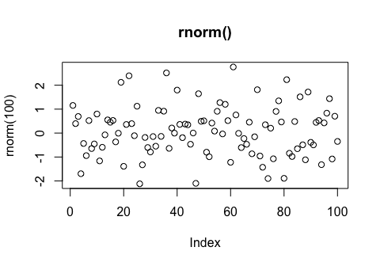
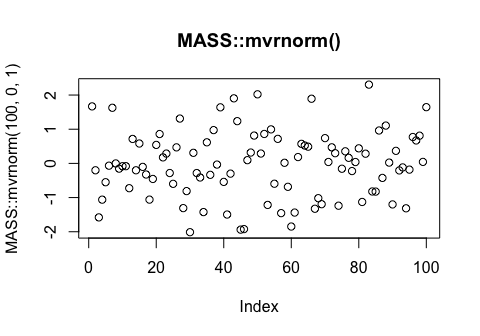

R for Data Science Walkthrough Chapters 17-21
================
Erick Lu

-   [Chapter 17, 18 - No Exercises](#chapter-17-18---no-exercises)
-   [Chapter 19: Functions](#chapter-19-functions)
    -   [19.2.1 Practice](#practice)
    -   [19.3.1 Exercises](#exercises)
    -   [19.4.4 Exercises](#exercises-1)
    -   [19.5.5 Exercises](#exercises-2)
-   [Chapter 20: Vectors](#chapter-20-vectors)
    -   [20.3.5 Exercises](#exercises-3)
    -   [20.4.6 Exercises](#exercises-4)
    -   [20.5.4 Exercises](#exercises-5)
    -   [20.7.4 Exercises](#exercises-6)
-   [Chapter 21](#chapter-21)
    -   [21.2.1 Exercises](#exercises-7)
    -   [21.3.5 Exercises](#exercises-8)
    -   [21.4.1 Exercises](#exercises-9)
    -   [21.5.3 Exercises](#exercises-10)
    -   [21.9.3 Exercises](#exercises-11)

This my walkthrough for chapters 17-21 for the book: *R for Data Science* by Hadley Wickham and Garrett Grolemund. Here I provide solutions to their exercises and some of my own notes and explorations.

Chapter 17, 18 - No Exercises
=============================

Chapter 19: Functions
=====================

Learn about unit testing your functions - <http://r-pkgs.had.co.nz/tests.html>.

19.2.1 Practice
---------------

### 1. Why is TRUE not a parameter to rescale01()? What would happen if x contained a single missing value, and na.rm was FALSE?

TRUE is not a parameter to rescale01() because it is an option for one of the arguments in the range() function. It can be specified within the function itself rather than having to be passed in as a function parameter. If na.rm was FALSE, NA values would not be "removed" from the analysis, and the function would produce a vector of NA values. Below, I show an example what would happen if na.rm was FALSE and a vector with an NA value was used.

``` r
rescale01 <- function(x) {
  rng <- range(x, na.rm = TRUE)
  (x - rng[1]) / (rng[2] - rng[1])
}

rescale01_FALSE <- function(x) {
  rng <- range(x, na.rm = FALSE)
  (x - rng[1]) / (rng[2] - rng[1])
}

test <- c(1,2,3,NA,4,5)

rescale01(test)
```

    ## [1] 0.00 0.25 0.50   NA 0.75 1.00

``` r
rescale01_FALSE(test)
```

    ## [1] NA NA NA NA NA NA

### 2. In the second variant of rescale01(), infinite values are left unchanged. Rewrite rescale01() so that -Inf is mapped to 0, and Inf is mapped to 1.

To map Inf to 1 and -Inf to 0, we can search for the indicies which have these values and assign 0 or 1 accordingly, using the which() function in base R. We then return the modified vector using return().

``` r
x <- c(1:10,Inf, c(1:3), Inf, c(1:5), -Inf)
rescale01_mapInf <- function(x) {
rng <- range(x, na.rm = TRUE, finite = TRUE) 
x <- (x - rng[1]) / (rng[2] - rng[1])
x[which(x==Inf)] <- 1
x[which(x==-Inf)] <- 0
return (x)
}
rescale01_mapInf(x)
```

    ##  [1] 0.0000000 0.1111111 0.2222222 0.3333333 0.4444444 0.5555556 0.6666667
    ##  [8] 0.7777778 0.8888889 1.0000000 1.0000000 0.0000000 0.1111111 0.2222222
    ## [15] 1.0000000 0.0000000 0.1111111 0.2222222 0.3333333 0.4444444 0.0000000

### 3. Practice turning the following code snippets into functions. Think about what each function does. What would you call it? How many arguments does it need? Can you rewrite it to be more expressive or less duplicative?

mean(is.na(x)) is a snippet that calculates what proportion of the values in a vector are NA values. is.na(x) will return a boolean for each value in x (FALSE if not NA, TRUE if NA). TRUE is 1 and FALSE is 0 when used in mean().

``` r
x = c(1:5, NA, 1:2, NA, 1:3)
mean(is.na(x))
```

    ## [1] 0.1666667

``` r
# rewrite the snippet into a function
proportion_na <- function (x) {
  sum(is.na(x))/length(x)
}
# see if the function output matches the snippet
proportion_na(x)
```

    ## [1] 0.1666667

x / sum(x, na.rm = TRUE) is a snippet that divides each of the values in X by the total sum of the non-NA values in x.

``` r
x / sum(x, na.rm = TRUE)
```

    ##  [1] 0.04166667 0.08333333 0.12500000 0.16666667 0.20833333         NA
    ##  [7] 0.04166667 0.08333333         NA 0.04166667 0.08333333 0.12500000

``` r
divide_by_sum <- function (x) {
  x / sum(x, na.rm = TRUE)
}
divide_by_sum(x)
```

    ##  [1] 0.04166667 0.08333333 0.12500000 0.16666667 0.20833333         NA
    ##  [7] 0.04166667 0.08333333         NA 0.04166667 0.08333333 0.12500000

sd(x, na.rm = TRUE) / mean(x, na.rm = TRUE) is a snippet that divides the standard deviation of the values in x by the mean of the values in x.

``` r
sd(x, na.rm = TRUE) / mean(x, na.rm = TRUE)
```

    ## [1] 0.5624571

``` r
sd_div_mean <- function (x) {
  sd(x, na.rm = TRUE) / mean(x, na.rm = TRUE)
}
sd_div_mean(x)
```

    ## [1] 0.5624571

Each of the functions only requires the vector x as an input argument.

### 4. Follow <http://nicercode.github.io/intro/writing-functions.html> to write your own functions to compute the variance and skew of a numeric vector.

``` r
sample_vector <- c(1:10)

variance <- function (x) {
  n <- length(x)
    m <- mean(x)
    (1/(n - 1)) * sum((x - m)^2)
}

skew <- function (x) {
    n <- length(x)
    v <- var(x)
    m <- mean(x)
    third.moment <- (1/(n - 2)) * sum((x - m)^3)
    third.moment/(var(x)^(3/2))
}
# might have to cross-reference this function with other sources to make sure it's correct.

variance(sample_vector)
```

    ## [1] 9.166667

``` r
var(sample_vector)
```

    ## [1] 9.166667

``` r
skew(sample_vector)
```

    ## [1] 0

### 5. Write both\_na(), a function that takes two vectors of the same length and returns the number of positions that have an NA in both vectors.

I interpreted this question as finding the index numbers of positions in both vectors that both contain NA values. For example, if you had one vector c(1, 2, NA, 5, 6) and another vector c(NA, 6, NA, 4, 5), this function should return "3". To do this, we first evaluate which values in both vectors are NA values using is.na(). Then, we can use which() to find out the index of all TRUE (NA) values in these vectors. Then, we use intersect() to determine which indecies are common between the two vectors. This function should work even if the vectors are different lengths.

``` r
vector1 = c(1, 2, NA, 5, 6)
vector2 = c(NA, 6, NA, 4, 5)

both_na <- function (v1, v2) {
  na1 <- is.na(v1)
  na2 <- is.na(v2)
  intersect(which(na1==TRUE),which(na2==TRUE))
}

vector1
```

    ## [1]  1  2 NA  5  6

``` r
vector2
```

    ## [1] NA  6 NA  4  5

``` r
both_na(vector1,vector2)
```

    ## [1] 3

### 6. What do the following functions do? Why are they useful even though they are so short?

``` r
is_directory <- function(x) file.info(x)$isdir
is_readable <- function(x) file.access(x, 4) == 0
```

is\_directory() is a function that tells the user whether the object (x) is a directory or not (returns a TRUE or FALSE value). is\_readable() is a function that tells the user whether the file is readable or not (also returns TRUE or FALSE). The second argument (4) indicates that it "tests for read permission" based on the documentation. The function file.access() returns 0 for success and -1 for failure. These functions are useful because it they provide information that guides the user with how to proceed with the file.

### 7. Read the complete lyrics to “Little Bunny Foo Foo”. There’s a lot of duplication in this song. Extend the initial piping example to recreate the complete song, and use functions to reduce the duplication.

The lyrics are repeated three times, each time with the number of chances decreased by one. We can lump all the lyrics into one function, and then call the function 3 times using a loop while decreasing the number of chances each iteration of the loop.

``` r
# I commented out the pseudocode so the R markdown file can compile.

# foo_foo %>%
#   hop(through = forest) %>%
#   scoop(up = field_mice) %>%
#   bop(on = head) %>%
#   down(came = good_fairy) %>%
#   scoop(up = field_mice) %>%
#   bop (on = head) %>%
#   give (chances = three) %>%
#   turn (into = goonie)
#   # repeat 3 times, with the # of chances decreasing each time
#   
# play_through (foo_foo, chances) {
#   hop(through = forest) %>%
#   scoop(up = field_mice) %>%
#   bop(on = head) %>%
#   down(came = good_fairy) %>%
#   scoop(up = field_mice) %>%
#   bop (on = head) %>%
#   give (chances = three) %>%
#   turn (into = goonie)
# }
#  
# chances <- 3
# while (chances > 0) {
#   play_through (foo_foo, chances)
#   chances <- chances - 1
# }
#  
```

19.3.1 Exercises
----------------

### 1. Read the source code for each of the following three functions, puzzle out what they do, and then brainstorm better names.

``` r
f1 <- function(string, prefix) {
  substr(string, 1, nchar(prefix)) == prefix
}

f1("hello", "he")
```

    ## [1] TRUE

``` r
f1("hello", "ell")
```

    ## [1] FALSE

This function returns TRUE or FALSE depending on whether the second argument (prefix) matches the corresponding first letters in the first argument (string). A better function name would be "is\_prefix".

``` r
f2 <- function(x) {
  if (length(x) <= 1) return(NULL)
  x[-length(x)]
}
x = c(1:10)
x
```

    ##  [1]  1  2  3  4  5  6  7  8  9 10

``` r
f2(x)
```

    ## [1] 1 2 3 4 5 6 7 8 9

This is a function that deletes the last entry of the input vector, x. If the vector is of length 1 or less, the function returns NULL. A better function name would be "delete\_last".

``` r
f3 <- function(x, y) {
  rep(y, length.out = length(x))
}
x = c(1:10)
x
```

    ##  [1]  1  2  3  4  5  6  7  8  9 10

``` r
f3(x, 5)
```

    ##  [1] 5 5 5 5 5 5 5 5 5 5

This is a function that returns a vector that is the same length as x, but all of its values consist of y. A better name for this function would be "rep\_constant\_values". Although we are not necessarily changing the values in the input vector, but rather generating a new vector with the values "replaced", the user can infer that the output vector consist of a constant value.

### 2. Take a function that you’ve written recently and spend 5 minutes brainstorming a better name for it and its arguments.

Below is an example of a task that could be optimized by writing a function instead.

``` r
library(tidyverse)
```

    ## ── Attaching packages ────────────────────────────────────────────────────────────────────────────────────────────────────────────────────────────────────────────────────── tidyverse 1.2.1 ──

    ## ✔ ggplot2 3.2.0     ✔ purrr   0.3.2
    ## ✔ tibble  2.1.3     ✔ dplyr   0.8.1
    ## ✔ tidyr   0.8.3     ✔ stringr 1.4.0
    ## ✔ readr   1.3.1     ✔ forcats 0.4.0

    ## ── Conflicts ───────────────────────────────────────────────────────────────────────────────────────────────────────────────────────────────────────────────────────── tidyverse_conflicts() ──
    ## ✖ dplyr::filter() masks stats::filter()
    ## ✖ dplyr::lag()    masks stats::lag()

``` r
preg <- tribble(
  ~pregnant, ~male, ~female,
  "yes",     NA,    10,
  "no",      20,    12
)

# without using functions, convert the pregnant and female columns to booleans (TRUE or FALSE values).
gather(preg, sex, count, male, female) %>%
  mutate(pregnant = pregnant == "yes",
         female = sex == "female") %>%
  select(-sex)
```

    ## # A tibble: 4 x 3
    ##   pregnant count female
    ##   <lgl>    <dbl> <lgl> 
    ## 1 TRUE        NA FALSE 
    ## 2 FALSE       20 FALSE 
    ## 3 TRUE        10 TRUE  
    ## 4 FALSE       12 TRUE

Instead of having to place the "==" clause in the mutate function, we can write a function to do so instead.

``` r
# write function to convert a vector of strings to TRUE or FALSE, depending on whether the values match a specified string:
string_to_boolean <- function (x, string) {
  x == string
}

# use the function to do the job
gather(preg, sex, count, male, female) %>%
  mutate(pregnant = string_to_boolean(pregnant,"yes"),
         female = string_to_boolean(sex,"female")) %>%
  select(-sex)
```

    ## # A tibble: 4 x 3
    ##   pregnant count female
    ##   <lgl>    <dbl> <lgl> 
    ## 1 TRUE        NA FALSE 
    ## 2 FALSE       20 FALSE 
    ## 3 TRUE        10 TRUE  
    ## 4 FALSE       12 TRUE

### 3. Compare and contrast rnorm() and MASS::mvrnorm(). How could you make them more consistent?

First we can compare and contrast the type of output from the two functions by generating a list of 100 random normal values with mean 0 and SD 1 using both functions (plotted below):

``` r
plot(rnorm(100), main = "rnorm()")
```



``` r
plot(MASS::mvrnorm(100,0,1), main = "MASS::mvrnorm()")
```



I noticed that `rnorm(100)` automatically sets the mean to 0 and SD to 1, whereas `MASS::mvrnorm(100)` does not work unless you manually specify the mean to 0 and SD to 1 in the 2nd and 3rd arguments `MASS::mvrnorm(100,0,1)`. To make them more consistent, I would set the default values for mu and Sigma for MASS::mvrnorm() to 0 and 1, so that both functions will work without having to explicitly state the mu (mean) and Sigma (SD) values.

### 4. Make a case for why norm\_r(), norm\_d() etc would be better than rnorm(), dnorm(). Make a case for the opposite.

norm\_r(), norm\_d() etc would be better since you know that these functions have are common with each other in that they deal with the normal distribution. The suffix "\_r", etc lets you know how the functions differ from each other. You can also get a list of all the related functions by typing "norm" in RStudio and seeing the autocomplete options. One could argue that this is not as good as the current rnorm(), dnorm() etc convention because of the added finger work required to place an underscore in the name. Also, norm\_r() is a rather cryptic name that might not have intuitive meaning, whereas rnorm immediately suggests "random normal" to one familiar with statistics.

19.4.4 Exercises
----------------

### 1. What’s the difference between if and ifelse()? Carefully read the help and construct three examples that illustrate the key differences.

`if`, if used by itself, will only execute its contents if the conditional statement is TRUE. If the statement is FALSE, nothing will be executed unless there is an `else if` or `else` statement afterwards. ifelse() gives you an option to execute code if the conditional statement is FALSE. It can also be used to filter or reassign values in a vector depending on a condition.

### 2. Write a greeting function that says “good morning”, “good afternoon”, or “good evening”, depending on the time of day. (Hint: use a time argument that defaults to lubridate::now(). That will make it easier to test your function.)

``` r
library(lubridate)
```

    ## 
    ## Attaching package: 'lubridate'

    ## The following object is masked from 'package:base':
    ## 
    ##     date

``` r
greet <- function ( datetime = lubridate::now() ) {
  print(datetime)
  time <- hour(datetime)
  
  if (time < 12) {
    print("good morning")
  } else if (time >= 12 && time < 18) {
    print("good afternoon")
  } else
    print("good evening")
}

greet()
```

    ## [1] "2019-06-19 17:15:23 PDT"
    ## [1] "good afternoon"

``` r
greet(ymd_hms("2016-07-08 08:34:56"))
```

    ## [1] "2016-07-08 08:34:56 UTC"
    ## [1] "good morning"

``` r
greet(ymd_hms("2016-07-08 20:34:56"))
```

    ## [1] "2016-07-08 20:34:56 UTC"
    ## [1] "good evening"

``` r
greet(ymd_hms("2016-07-08 15:34:56"))
```

    ## [1] "2016-07-08 15:34:56 UTC"
    ## [1] "good afternoon"

### 3. Implement a fizzbuzz function. It takes a single number as input. If the number is divisible by three, it returns “fizz”. If it’s divisible by five it returns “buzz”. If it’s divisible by three and five, it returns “fizzbuzz”. Otherwise, it returns the number. Make sure you first write working code before you create the function.

``` r
fizzbuzz <- function ( input ) {
  if (input %% 3 == 0 && input %% 5 == 0) {
    print("fizzbuzz")
  } else if ( input %% 5 == 0 ) {
    print ("buzz")
  } else if ( input %% 3 == 0 ) {
    print ("fizz")
  } else
    print (input)
}

fizzbuzz(15)
```

    ## [1] "fizzbuzz"

``` r
fizzbuzz(10)
```

    ## [1] "buzz"

``` r
fizzbuzz(9)
```

    ## [1] "fizz"

``` r
fizzbuzz(4)
```

    ## [1] 4

### 4. How could you use cut() to simplify this set of nested if-else statements?

``` r
# if (temp <= 0) {
#   "freezing"
# } else if (temp <= 10) {
#   "cold"
# } else if (temp <= 20) {
#   "cool"
# } else if (temp <= 30) {
#   "warm"
# } else {
#   "hot"
# }

temp_range <- c(-5:40)
# without labels
cut(temp_range, breaks = c(-100, 0, 10, 20, 30, 100), right = TRUE)
```

    ##  [1] (-100,0] (-100,0] (-100,0] (-100,0] (-100,0] (-100,0] (0,10]  
    ##  [8] (0,10]   (0,10]   (0,10]   (0,10]   (0,10]   (0,10]   (0,10]  
    ## [15] (0,10]   (0,10]   (10,20]  (10,20]  (10,20]  (10,20]  (10,20] 
    ## [22] (10,20]  (10,20]  (10,20]  (10,20]  (10,20]  (20,30]  (20,30] 
    ## [29] (20,30]  (20,30]  (20,30]  (20,30]  (20,30]  (20,30]  (20,30] 
    ## [36] (20,30]  (30,100] (30,100] (30,100] (30,100] (30,100] (30,100]
    ## [43] (30,100] (30,100] (30,100] (30,100]
    ## Levels: (-100,0] (0,10] (10,20] (20,30] (30,100]

``` r
table(cut(temp_range, breaks = c(-100, 0, 10, 20, 30, 100), right = TRUE))
```

    ## 
    ## (-100,0]   (0,10]  (10,20]  (20,30] (30,100] 
    ##        6       10       10       10       10

``` r
# with labels
cut(temp_range, breaks = c(-100, 0, 10, 20, 30, 100), labels = c("freezing", "cold", "cool", "warm", "hot"), right = TRUE)
```

    ##  [1] freezing freezing freezing freezing freezing freezing cold    
    ##  [8] cold     cold     cold     cold     cold     cold     cold    
    ## [15] cold     cold     cool     cool     cool     cool     cool    
    ## [22] cool     cool     cool     cool     cool     warm     warm    
    ## [29] warm     warm     warm     warm     warm     warm     warm    
    ## [36] warm     hot      hot      hot      hot      hot      hot     
    ## [43] hot      hot      hot      hot     
    ## Levels: freezing cold cool warm hot

``` r
table(cut(temp_range, breaks = c(-100, 0, 10, 20, 30, 100), labels = c("freezing", "cold", "cool", "warm", "hot"), right = TRUE))
```

    ## 
    ## freezing     cold     cool     warm      hot 
    ##        6       10       10       10       10

How would you change the call to cut() if I’d used &lt; instead of &lt;=? What is the other chief advantage of cut() for this problem? (Hint: what happens if you have many values in temp?)

If &lt; was used instead of &lt;=, I would change the argument from right = TRUE to right = FALSE. This will split the interval to be closed on the left and open on the right. The other advantage of cut() for this problem is that it is able to sort a vector of values into the various intervals, whereas the nested if else statement that was provided only works on a single value. This makes cut() more efficient when there are many values to be sorted into the intervals.

### 5. What happens if you use switch() with numeric values?

Based on the documentation for switch(), if numerical values are input for the EXPR parameter (first argument), switch() will choose the corresponding element of the list of alternatives (...). I wrote an example below. Switch(1) will choose the first argument after EXPR (the second total argument in the switch() function). If a numerical input for EXPR is larger than the number of alternatives, it seems no output is provided (typeof() returns NULL).

``` r
test_switch <- function ( x ) {
  switch(x, 
         "first choice after EXPR",
         2,
         "third",
         "4th choice after EXPR"
         )
}
test_switch(1)
```

    ## [1] "first choice after EXPR"

``` r
test_switch(2)
```

    ## [1] 2

``` r
test_switch(3)
```

    ## [1] "third"

``` r
test_switch(4)
```

    ## [1] "4th choice after EXPR"

``` r
typeof(test_switch(5))
```

    ## [1] "NULL"

### 6. What does this switch() call do? What happens if x is “e”?

Below I turn the provided switch() call into a function and test each of the possibilities for x, as well as try what happens when x is "e". Since there is no output provided for options a or c, the switch() function returns the value immediately afterwards. So test\_switch("a") returns the same value as test\_switch("b"), and test\_switch("c") returns the same value as test\_switch("d"). If x is "e", a NULL value is returned. There seems to be no output but if you use typeof(test\_switch("e")), we see that the value is NULL.

``` r
test_switch <- function (x) {
  switch(x, 
    a = ,
    b = "ab",
    c = ,
    d = "cd"
  )
}

test_switch("a")
```

    ## [1] "ab"

``` r
test_switch("b")
```

    ## [1] "ab"

``` r
test_switch("c")
```

    ## [1] "cd"

``` r
test_switch("d")
```

    ## [1] "cd"

``` r
test_switch("e")
typeof(test_switch("e"))
```

    ## [1] "NULL"

19.5.5 Exercises
----------------

### 1. What does commas(letters, collapse = "-") do? Why?

commas(letters, collapse = "-") results in an error. I think the intention of the code was to combine all the letters separated by hyphens (for example, a-b-c-d-e...). In order to do this, we would have to modify the commas function directly (shown below, a new function called hyphens()). The code that was provided seems to attempt to incorrectly override the collapse argument by specifying it after letters. Since commas() has `...` as its only argument, this means that collapse = "-" is incorporated into the `...`, resulting in the error.

``` r
commas <- function(...) stringr::str_c(..., collapse = ", ")
commas(letters[1:10])
```

    ## [1] "a, b, c, d, e, f, g, h, i, j"

``` r
# this produces an error:
# commas(letters[1:10], collapse = "-")

# to produce the intended output, modify the commas function.

hyphens <- function(...) stringr::str_c(..., collapse = "-")
hyphens(letters[1:10])
```

    ## [1] "a-b-c-d-e-f-g-h-i-j"

Alternatively, we could modify the function to allow the user to specify what type of insertion to use as an argument after `...`, with the default being commas. I name the function insert\_between(), below.

``` r
insert_between <- function(..., insert = ", ") stringr::str_c(..., collapse = insert)
insert_between (letters[1:10])
```

    ## [1] "a, b, c, d, e, f, g, h, i, j"

``` r
insert_between (letters[1:10], insert = "-")
```

    ## [1] "a-b-c-d-e-f-g-h-i-j"

### 2. It’d be nice if you could supply multiple characters to the pad argument, e.g. rule("Title", pad = "-+"). Why doesn’t this currently work? How could you fix it?

This doesn't currently work optimally because the rule becomes twice as long (due to there being 2 characters instead of 1 for the pad argument). To fix this, we could divide the width according to the length of the pad argument. To figure out how many characters are in pad, use nchar(). Then, divide the width parameter by this number. This results in a rule that is the appropriate length. I show what the existing function does below, along with a modified function that performs the correct result.

``` r
# The original rule function, showing what happens if multiple characters were supplied:
rule <- function(..., pad = "-") {
  title <- paste0(...)
  width <- getOption("width") - nchar(title) - 5
  cat(title, " ", stringr::str_dup(pad, width), "\n", sep = "")
}

rule("Important output")
```

    ## Important output ------------------------------------------------------

``` r
rule("Title", pad = "-+")
```

    ## Title -+-+-+-+-+-+-+-+-+-+-+-+-+-+-+-+-+-+-+-+-+-+-+-+-+-+-+-+-+-+-+-+-+-+-+-+-+-+-+-+-+-+-+-+-+-+-+-+-+-+-+-+-+-+-+-+-+-+-+-+-+-+-+-+-+

``` r
# An improved version that scales the padding based on the character length:
scaled_rule <- function(..., pad = "-") {
  title <- paste0(...)
  pad_length <- nchar(pad)
  print(str_c("Number of characters in pad: ", pad_length))
  width <- (getOption("width") - nchar(title) - 5)/pad_length
  print(str_c("Number of times pad was duplicated: ", width))
  cat(title, " ", stringr::str_dup(pad, width), "\n", sep = "")
}
scaled_rule("Important output")
```

    ## [1] "Number of characters in pad: 1"
    ## [1] "Number of times pad was duplicated: 54"
    ## Important output ------------------------------------------------------

``` r
scaled_rule("Title", pad = "-+")
```

    ## [1] "Number of characters in pad: 2"
    ## [1] "Number of times pad was duplicated: 32.5"
    ## Title -+-+-+-+-+-+-+-+-+-+-+-+-+-+-+-+-+-+-+-+-+-+-+-+-+-+-+-+-+-+-+-+

### 3. What does the trim argument to mean() do? When might you use it?

The trim argument in mean() will remove a proportion of values from both sides of the vector before calculating the mean of the remaining values. The proportion is between 0 to 0.5, with default value being 0 (no trim applied). Examples below of how trim may affect mean calculation. You might use this when you are calculating something in which the edge cases have high variability or contain unreliable data.

``` r
x = c(1,1,1:10,1,1)
mean(x)
```

    ## [1] 4.214286

``` r
mean(x, trim = 0.2)
```

    ## [1] 3.8

### 4. The default value for the method argument to cor() is c("pearson", "kendall", "spearman"). What does that mean? What value is used by default?

Based on the documentation for cor(), these specify the type of correlation coefficient that is calculated by the function. The default value used is "pearson". Below is an example of how changing these parameters may affect the output, since each method uses a different equation.

``` r
x = c(1:20)
y = c(1,1,1,1:15, 5, 6)
cor(x,y)
```

    ## [1] 0.796562

``` r
cor(x,y, method = "kendall")
```

    ## [1] 0.7743726

``` r
cor(x,y, method = "spearman")
```

    ## [1] 0.8157183

Chapter 20: Vectors
===================

20.3.5 Exercises
----------------

### 1. Describe the difference between is.finite(x) and !is.infinite(x).

is.finite(x) should only evaluate to TRUE if the value is not NA, NaN, or +/-Inf. However, !is.infinite(x) will evaluate to TRUE if the value is NA, NaN, or a double/integer.

``` r
is.finite(0)
```

    ## [1] TRUE

``` r
is.finite(NA)
```

    ## [1] FALSE

``` r
!is.infinite(NA)
```

    ## [1] TRUE

### 2. Read the source code for dplyr::near() (Hint: to see the source code, drop the ()). How does it work?

The source code is below:

``` r
# function (x, y, tol = .Machine$double.eps^0.5) 
# {
#     abs(x - y) < tol
# }
# <bytecode: 0x10a60a198>
# <environment: namespace:dplyr>
```

Based on the code, the function subtracts the input (x) with the number that you want to compare it to (y), takes the absolute value of that operation, and then checks to see if it is below a certain threshold (tol). If so, it returns TRUE. If not, it returns FALSE. You can toggle the size of the threshold to your liking by changing the tol parameter.

### 3. A logical vector can take 3 possible values. How many possible values can an integer vector take? How many possible values can a double take? Use google to do some research.

The maximum possible values for integer and double values is related to the bit-representation of each type. For integers, there are 2^32 possible values since R uses 32-bit representation for integers. For doubles, R uses 64-bit representation so there would be 2^64 possible values.

### 4. Brainstorm at least four functions that allow you to convert a double to an integer. How do they differ? Be precise.

A double could be converted to an integer by rounding either up or down (floor() or ceiling()). In the case of a tie value (doubles ending in .5) we could either round up or down, or towards the either the even or odd digit.

### 5. What functions from the readr package allow you to turn a string into logical, integer, and double vector?

Respectively, the functions parse\_logical(), parse\_integer(), parse\_double() will turn a string into a logical, integer, or double.

``` r
library(readr)
parse_logical(c("TRUE", "FALSE"))
```

    ## [1]  TRUE FALSE

``` r
parse_integer(c("100", "200"))
```

    ## [1] 100 200

``` r
parse_double(c("100.3", "200"))
```

    ## [1] 100.3 200.0

20.4.6 Exercises
----------------

### 1. What does mean(is.na(x)) tell you about a vector x? What about sum(!is.finite(x))?

mean(is.na(x)) tells you what proportion of the values in the vector x are NA. sum(!is.finite(x)) tells you how many values in the vector are NA (total count), because NA is not a finite value.

``` r
x <- c(NA, 1, 2, NA, 5:10, NA, NA, NA)
is.na(x)
```

    ##  [1]  TRUE FALSE FALSE  TRUE FALSE FALSE FALSE FALSE FALSE FALSE  TRUE
    ## [12]  TRUE  TRUE

``` r
mean(is.na(x))
```

    ## [1] 0.3846154

``` r
is.finite(x)
```

    ##  [1] FALSE  TRUE  TRUE FALSE  TRUE  TRUE  TRUE  TRUE  TRUE  TRUE FALSE
    ## [12] FALSE FALSE

``` r
!is.finite(x)
```

    ##  [1]  TRUE FALSE FALSE  TRUE FALSE FALSE FALSE FALSE FALSE FALSE  TRUE
    ## [12]  TRUE  TRUE

``` r
sum(is.finite(x))
```

    ## [1] 8

``` r
sum(!is.finite(x))
```

    ## [1] 5

### 2. Carefully read the documentation of is.vector(). What does it actually test for? Why does is.atomic() not agree with the definition of atomic vectors above?

is.vector() tests for whether a vector is of the specified mode and has no attributes other than names. For example, the named vector 'x' below will return TRUE. See examples of use below. The definition above states that atomic vectors are homogenous, in which each value of the vector should be of the same type. One way that is.atomic() deviates from this definition of atomic vectors is that it still returns TRUE for named vectors, which can have character-based names for numerical values.

``` r
x <- c(a = 1, b = 2)
is.vector(x)
```

    ## [1] TRUE

``` r
is.atomic(x)
```

    ## [1] TRUE

``` r
x <- c(a = 1, b = "hello")
is.vector(x, mode = "integer")
```

    ## [1] FALSE

``` r
is.vector(x, mode = "character")
```

    ## [1] TRUE

``` r
is.atomic(x)
```

    ## [1] TRUE

### 3. Compare and contrast setNames() with purrr::set\_names().

purrr::set\_names() is a more flexible version of stats::setNames() that has more features. In the example below, setNames fails to work when the "names" are not explicitly provided as one vector of the same length as the vector to be named. purrr::set\_names() still works when the names are provided separately.

``` r
# using stats::setNames()
setNames(1:4, c("a", "b", "c", "d"))
```

    ## a b c d 
    ## 1 2 3 4

``` r
#setNames(1:4, "a", "b", "c", "d") # Error in setNames(1:4, "a", "b", "c", "d") :unused arguments ("b", "c", "d")
```

``` r
# using purrr::setNames()
library(purrr)
set_names(1:4, c("a", "b", "c", "d"))
```

    ## a b c d 
    ## 1 2 3 4

``` r
set_names(1:4, "a", "b", "c", "d")
```

    ## a b c d 
    ## 1 2 3 4

### 4. Create functions that take a vector as input and returns:

-   The last value. Should you use \[ or \[\[?

``` r
# we should use [, instead of [[]]
example <- letters[1:10]
return_last <- function (x) {
  return (x[length(x)])
}
example
```

    ##  [1] "a" "b" "c" "d" "e" "f" "g" "h" "i" "j"

``` r
return_last(example)
```

    ## [1] "j"

-   The elements at even numbered positions.

``` r
example <- letters[1:10]
return_even <- function (x) {
  even_indicies <- c(1:length(x)) %% 2 == 0
  return (x[even_indicies])
}
example
```

    ##  [1] "a" "b" "c" "d" "e" "f" "g" "h" "i" "j"

``` r
return_even(example)
```

    ## [1] "b" "d" "f" "h" "j"

-   Every element except the last value.

``` r
example <- letters[1:10]
remove_last <- function (x) {
  return(x[-length(x)])
}
example
```

    ##  [1] "a" "b" "c" "d" "e" "f" "g" "h" "i" "j"

``` r
remove_last(example)
```

    ## [1] "a" "b" "c" "d" "e" "f" "g" "h" "i"

-   Only even numbers (and no missing values).

``` r
example <- c(1:5, NA, 6:12, NA, 13:20)
return_even <- function (x) {
  return (x[x %% 2 == 0 & !is.na(x)])
}
example
```

    ##  [1]  1  2  3  4  5 NA  6  7  8  9 10 11 12 NA 13 14 15 16 17 18 19 20

``` r
return_even(example)
```

    ##  [1]  2  4  6  8 10 12 14 16 18 20

### 5. Why is x\[-which(x &gt; 0)\] not the same as x\[x &lt;= 0\]?

which(x &gt; 0) returns a vector of indicies in x which contain values that are greater than zero. x\[-which(x &gt; 0)\] selects the values in x which do not correspond to those indicies. x &lt;= 0 returns a vector of boolean values corresponding to the values in x which are less than or equal to zero, and x\[x &lt;= 0\] selects the values in x which satisfy the boolean condition.

``` r
x <- c(-5:5)
which(x > 0)
```

    ## [1]  7  8  9 10 11

``` r
x <= 0
```

    ##  [1]  TRUE  TRUE  TRUE  TRUE  TRUE  TRUE FALSE FALSE FALSE FALSE FALSE

``` r
x[-which(x > 0)]
```

    ## [1] -5 -4 -3 -2 -1  0

``` r
x[x <= 0]
```

    ## [1] -5 -4 -3 -2 -1  0

### 6. What happens when you subset with a positive integer that’s bigger than the length of the vector? What happens when you subset with a name that doesn’t exist?

Subsetting with a positive integer that's bigger than the length of the vector returns NA. When you subset with a name that doesn't exist, it returns an error saying <name> doesnt exist.

``` r
x <- c(-5:5)
# length(x) is 11
x[12]
```

    ## [1] NA

``` r
# add names to x, then try a name that doesn't exist
names(x) <- letters[1:length(x)]
x
```

    ##  a  b  c  d  e  f  g  h  i  j  k 
    ## -5 -4 -3 -2 -1  0  1  2  3  4  5

``` r
# x[l] # Error: object 'l' not found
```

20.5.4 Exercises
----------------

### 1. Draw the following lists as nested sets:

-   list(a, b, list(c, d), list(e, f))

The structure is as follows: \[ a, b, \[c,d\], \[e,f\] \]

-   list(list(list(list(list(list(a))))))

The structure is as follows (the value "a" is nested within 6 lists): \[
\[
\[
\[ \[ \[ a \] \] \] \] \] \]

### 2. What happens if you subset a tibble as if you’re subsetting a list? What are the key differences between a list and a tibble?

Subsetting a tibble using the names of the columns will pull out the respective columns of the tibble as a new tibble, if multiple columns are selected. If only one column of the tibble is selected, the column is pulled out as the data type of the values stored in it. The same applies to a list, which returns a new list if multiple named constituents are selected, or a vector if one named constituent is selected. A key difference is that a tibble has a fixed dimension and each column must be of the same length, whereas a list can contain vectors of differing lengths. A tibble can also be manipulated using dplyr commands and functions that apply to data frames, which provides more functionality/flexibility for data analysis.

``` r
iris
```

    ##     Sepal.Length Sepal.Width Petal.Length Petal.Width    Species
    ## 1            5.1         3.5          1.4         0.2     setosa
    ## 2            4.9         3.0          1.4         0.2     setosa
    ## 3            4.7         3.2          1.3         0.2     setosa
    ## 4            4.6         3.1          1.5         0.2     setosa
    ## 5            5.0         3.6          1.4         0.2     setosa
    ## 6            5.4         3.9          1.7         0.4     setosa
    ## 7            4.6         3.4          1.4         0.3     setosa
    ## 8            5.0         3.4          1.5         0.2     setosa
    ## 9            4.4         2.9          1.4         0.2     setosa
    ## 10           4.9         3.1          1.5         0.1     setosa
    ## 11           5.4         3.7          1.5         0.2     setosa
    ## 12           4.8         3.4          1.6         0.2     setosa
    ## 13           4.8         3.0          1.4         0.1     setosa
    ## 14           4.3         3.0          1.1         0.1     setosa
    ## 15           5.8         4.0          1.2         0.2     setosa
    ## 16           5.7         4.4          1.5         0.4     setosa
    ## 17           5.4         3.9          1.3         0.4     setosa
    ## 18           5.1         3.5          1.4         0.3     setosa
    ## 19           5.7         3.8          1.7         0.3     setosa
    ## 20           5.1         3.8          1.5         0.3     setosa
    ## 21           5.4         3.4          1.7         0.2     setosa
    ## 22           5.1         3.7          1.5         0.4     setosa
    ## 23           4.6         3.6          1.0         0.2     setosa
    ## 24           5.1         3.3          1.7         0.5     setosa
    ## 25           4.8         3.4          1.9         0.2     setosa
    ## 26           5.0         3.0          1.6         0.2     setosa
    ## 27           5.0         3.4          1.6         0.4     setosa
    ## 28           5.2         3.5          1.5         0.2     setosa
    ## 29           5.2         3.4          1.4         0.2     setosa
    ## 30           4.7         3.2          1.6         0.2     setosa
    ## 31           4.8         3.1          1.6         0.2     setosa
    ## 32           5.4         3.4          1.5         0.4     setosa
    ## 33           5.2         4.1          1.5         0.1     setosa
    ## 34           5.5         4.2          1.4         0.2     setosa
    ## 35           4.9         3.1          1.5         0.2     setosa
    ## 36           5.0         3.2          1.2         0.2     setosa
    ## 37           5.5         3.5          1.3         0.2     setosa
    ## 38           4.9         3.6          1.4         0.1     setosa
    ## 39           4.4         3.0          1.3         0.2     setosa
    ## 40           5.1         3.4          1.5         0.2     setosa
    ## 41           5.0         3.5          1.3         0.3     setosa
    ## 42           4.5         2.3          1.3         0.3     setosa
    ## 43           4.4         3.2          1.3         0.2     setosa
    ## 44           5.0         3.5          1.6         0.6     setosa
    ## 45           5.1         3.8          1.9         0.4     setosa
    ## 46           4.8         3.0          1.4         0.3     setosa
    ## 47           5.1         3.8          1.6         0.2     setosa
    ## 48           4.6         3.2          1.4         0.2     setosa
    ## 49           5.3         3.7          1.5         0.2     setosa
    ## 50           5.0         3.3          1.4         0.2     setosa
    ## 51           7.0         3.2          4.7         1.4 versicolor
    ## 52           6.4         3.2          4.5         1.5 versicolor
    ## 53           6.9         3.1          4.9         1.5 versicolor
    ## 54           5.5         2.3          4.0         1.3 versicolor
    ## 55           6.5         2.8          4.6         1.5 versicolor
    ## 56           5.7         2.8          4.5         1.3 versicolor
    ## 57           6.3         3.3          4.7         1.6 versicolor
    ## 58           4.9         2.4          3.3         1.0 versicolor
    ## 59           6.6         2.9          4.6         1.3 versicolor
    ## 60           5.2         2.7          3.9         1.4 versicolor
    ## 61           5.0         2.0          3.5         1.0 versicolor
    ## 62           5.9         3.0          4.2         1.5 versicolor
    ## 63           6.0         2.2          4.0         1.0 versicolor
    ## 64           6.1         2.9          4.7         1.4 versicolor
    ## 65           5.6         2.9          3.6         1.3 versicolor
    ## 66           6.7         3.1          4.4         1.4 versicolor
    ## 67           5.6         3.0          4.5         1.5 versicolor
    ## 68           5.8         2.7          4.1         1.0 versicolor
    ## 69           6.2         2.2          4.5         1.5 versicolor
    ## 70           5.6         2.5          3.9         1.1 versicolor
    ## 71           5.9         3.2          4.8         1.8 versicolor
    ## 72           6.1         2.8          4.0         1.3 versicolor
    ## 73           6.3         2.5          4.9         1.5 versicolor
    ## 74           6.1         2.8          4.7         1.2 versicolor
    ## 75           6.4         2.9          4.3         1.3 versicolor
    ## 76           6.6         3.0          4.4         1.4 versicolor
    ## 77           6.8         2.8          4.8         1.4 versicolor
    ## 78           6.7         3.0          5.0         1.7 versicolor
    ## 79           6.0         2.9          4.5         1.5 versicolor
    ## 80           5.7         2.6          3.5         1.0 versicolor
    ## 81           5.5         2.4          3.8         1.1 versicolor
    ## 82           5.5         2.4          3.7         1.0 versicolor
    ## 83           5.8         2.7          3.9         1.2 versicolor
    ## 84           6.0         2.7          5.1         1.6 versicolor
    ## 85           5.4         3.0          4.5         1.5 versicolor
    ## 86           6.0         3.4          4.5         1.6 versicolor
    ## 87           6.7         3.1          4.7         1.5 versicolor
    ## 88           6.3         2.3          4.4         1.3 versicolor
    ## 89           5.6         3.0          4.1         1.3 versicolor
    ## 90           5.5         2.5          4.0         1.3 versicolor
    ## 91           5.5         2.6          4.4         1.2 versicolor
    ## 92           6.1         3.0          4.6         1.4 versicolor
    ## 93           5.8         2.6          4.0         1.2 versicolor
    ## 94           5.0         2.3          3.3         1.0 versicolor
    ## 95           5.6         2.7          4.2         1.3 versicolor
    ## 96           5.7         3.0          4.2         1.2 versicolor
    ## 97           5.7         2.9          4.2         1.3 versicolor
    ## 98           6.2         2.9          4.3         1.3 versicolor
    ## 99           5.1         2.5          3.0         1.1 versicolor
    ## 100          5.7         2.8          4.1         1.3 versicolor
    ## 101          6.3         3.3          6.0         2.5  virginica
    ## 102          5.8         2.7          5.1         1.9  virginica
    ## 103          7.1         3.0          5.9         2.1  virginica
    ## 104          6.3         2.9          5.6         1.8  virginica
    ## 105          6.5         3.0          5.8         2.2  virginica
    ## 106          7.6         3.0          6.6         2.1  virginica
    ## 107          4.9         2.5          4.5         1.7  virginica
    ## 108          7.3         2.9          6.3         1.8  virginica
    ## 109          6.7         2.5          5.8         1.8  virginica
    ## 110          7.2         3.6          6.1         2.5  virginica
    ## 111          6.5         3.2          5.1         2.0  virginica
    ## 112          6.4         2.7          5.3         1.9  virginica
    ## 113          6.8         3.0          5.5         2.1  virginica
    ## 114          5.7         2.5          5.0         2.0  virginica
    ## 115          5.8         2.8          5.1         2.4  virginica
    ## 116          6.4         3.2          5.3         2.3  virginica
    ## 117          6.5         3.0          5.5         1.8  virginica
    ## 118          7.7         3.8          6.7         2.2  virginica
    ## 119          7.7         2.6          6.9         2.3  virginica
    ## 120          6.0         2.2          5.0         1.5  virginica
    ## 121          6.9         3.2          5.7         2.3  virginica
    ## 122          5.6         2.8          4.9         2.0  virginica
    ## 123          7.7         2.8          6.7         2.0  virginica
    ## 124          6.3         2.7          4.9         1.8  virginica
    ## 125          6.7         3.3          5.7         2.1  virginica
    ## 126          7.2         3.2          6.0         1.8  virginica
    ## 127          6.2         2.8          4.8         1.8  virginica
    ## 128          6.1         3.0          4.9         1.8  virginica
    ## 129          6.4         2.8          5.6         2.1  virginica
    ## 130          7.2         3.0          5.8         1.6  virginica
    ## 131          7.4         2.8          6.1         1.9  virginica
    ## 132          7.9         3.8          6.4         2.0  virginica
    ## 133          6.4         2.8          5.6         2.2  virginica
    ## 134          6.3         2.8          5.1         1.5  virginica
    ## 135          6.1         2.6          5.6         1.4  virginica
    ## 136          7.7         3.0          6.1         2.3  virginica
    ## 137          6.3         3.4          5.6         2.4  virginica
    ## 138          6.4         3.1          5.5         1.8  virginica
    ## 139          6.0         3.0          4.8         1.8  virginica
    ## 140          6.9         3.1          5.4         2.1  virginica
    ## 141          6.7         3.1          5.6         2.4  virginica
    ## 142          6.9         3.1          5.1         2.3  virginica
    ## 143          5.8         2.7          5.1         1.9  virginica
    ## 144          6.8         3.2          5.9         2.3  virginica
    ## 145          6.7         3.3          5.7         2.5  virginica
    ## 146          6.7         3.0          5.2         2.3  virginica
    ## 147          6.3         2.5          5.0         1.9  virginica
    ## 148          6.5         3.0          5.2         2.0  virginica
    ## 149          6.2         3.4          5.4         2.3  virginica
    ## 150          5.9         3.0          5.1         1.8  virginica

``` r
typeof(iris)
```

    ## [1] "list"

``` r
typeof(iris[,c("Sepal.Length", "Sepal.Width")])
```

    ## [1] "list"

``` r
typeof(iris$Sepal.Length)
```

    ## [1] "double"

``` r
typeof(iris[,c("Sepal.Length")])
```

    ## [1] "double"

``` r
mylist <- list(nums = c(1:5),
               myletters = letters[1:15])
mylist
```

    ## $nums
    ## [1] 1 2 3 4 5
    ## 
    ## $myletters
    ##  [1] "a" "b" "c" "d" "e" "f" "g" "h" "i" "j" "k" "l" "m" "n" "o"

``` r
typeof(mylist)
```

    ## [1] "list"

``` r
typeof(mylist$nums)
```

    ## [1] "integer"

20.7.4 Exercises
----------------

### 1. What does hms::hms(3600) return? How does it print? What primitive type is the augmented vector built on top of? What attributes does it use?

It returns 01:00:00. It is built on top of double. It uses the attributes "class", which has values "hms" and "difftime", and "units", which has the value "secs".

``` r
hms::hms(3600)
```

    ## 01:00:00

``` r
typeof(hms::hms(3600))
```

    ## [1] "double"

``` r
attributes(hms::hms(3600))
```

    ## $class
    ## [1] "hms"      "difftime"
    ## 
    ## $units
    ## [1] "secs"

### 2. Try and make a tibble that has columns with different lengths. What happens?

Trying to make a tibble with differing column lengths results in an error.

``` r
# tibble (a = c(1:5),
#         b = letters[1:3])

# Error: Tibble columns must have consistent lengths, only values of length one are recycled: * Length 3: Column `b` * Length 5: Column `a`
```

However, there is an exception to this, in which the values of length one are repeated until the column length matches the other columns. An example is below:

``` r
tibble (a = c(1:5),
        b = letters[1])
```

    ## # A tibble: 5 x 2
    ##       a b    
    ##   <int> <chr>
    ## 1     1 a    
    ## 2     2 a    
    ## 3     3 a    
    ## 4     4 a    
    ## 5     5 a

### 3. Based on the definition above, is it ok to have a list as a column of a tibble?

Yes, it is OK to have a list as a column of a tibble, as long as the the length of the list matches the length of the other columns in the tibble. An example of a tibble with a list for one of its columns and how to select a value from that column is below:

``` r
mytib <- tibble (a = c(1:3),
        b = letters[1:3],
        mylist = list(x = c(1:5),
                      y = c(10:20),
                      z = c(2:3)))
mytib$mylist[[1]]
```

    ## [1] 1 2 3 4 5

Chapter 21
==========

21.2.1 Exercises
----------------

### 1. Write for loops to:

-   Compute the mean of every column in mtcars.

``` r
# loop through each column of mtcars and compute mean
for (column in colnames(mtcars)) {
  print (c(column,mean(mtcars[,column])))
}
```

    ## [1] "mpg"       "20.090625"
    ## [1] "cyl"    "6.1875"
    ## [1] "disp"       "230.721875"
    ## [1] "hp"       "146.6875"
    ## [1] "drat"      "3.5965625"
    ## [1] "wt"      "3.21725"
    ## [1] "qsec"     "17.84875"
    ## [1] "vs"     "0.4375"
    ## [1] "am"      "0.40625"
    ## [1] "gear"   "3.6875"
    ## [1] "carb"   "2.8125"

-   Determine the type of each column in nycflights13::flights.

``` r
for (column in colnames(nycflights13::flights)) {
  print ( c(column,class(nycflights13::flights[[column]])) )
}
```

    ## [1] "year"    "integer"
    ## [1] "month"   "integer"
    ## [1] "day"     "integer"
    ## [1] "dep_time" "integer" 
    ## [1] "sched_dep_time" "integer"       
    ## [1] "dep_delay" "numeric"  
    ## [1] "arr_time" "integer" 
    ## [1] "sched_arr_time" "integer"       
    ## [1] "arr_delay" "numeric"  
    ## [1] "carrier"   "character"
    ## [1] "flight"  "integer"
    ## [1] "tailnum"   "character"
    ## [1] "origin"    "character"
    ## [1] "dest"      "character"
    ## [1] "air_time" "numeric" 
    ## [1] "distance" "numeric" 
    ## [1] "hour"    "numeric"
    ## [1] "minute"  "numeric"
    ## [1] "time_hour" "POSIXct"   "POSIXt"

-   Compute the number of unique values in each column of iris.

``` r
for (column in colnames(iris)) {
  print (c(column, length(unique(iris[,column]))))
}
```

    ## [1] "Sepal.Length" "35"          
    ## [1] "Sepal.Width" "23"         
    ## [1] "Petal.Length" "43"          
    ## [1] "Petal.Width" "22"         
    ## [1] "Species" "3"

-   Generate 10 random normals for each of μ=−10,0,10, and 100.

``` r
means <- c(-10, 0, 10, 100)
for (i in means) {
  print(rnorm (10, i))
}
```

    ##  [1] -10.572717  -8.700343 -10.574074  -9.316848  -9.176429  -9.477688
    ##  [7] -10.154619  -9.925624 -11.297953  -9.413018
    ##  [1]  0.63685239  1.19298844  0.81098925 -0.42885637  0.06363363
    ##  [6] -0.38381549  0.18729491  0.14159553 -1.47604267  2.01593850
    ##  [1] 11.819990  8.810736  8.630096  9.508142  9.759374  8.461559  9.506156
    ##  [8]  9.795728  8.331278  7.908750
    ##  [1]  99.67657  99.73476  98.51146 100.40718  98.71624  98.72362 100.82144
    ##  [8] 100.82085  99.36983 100.22442

### 2. Eliminate the for loop in each of the following examples by taking advantage of an existing function that works with vectors:

``` r
out <- ""
for (x in letters) {
  out <- stringr::str_c(out, x)
}
out
```

    ## [1] "abcdefghijklmnopqrstuvwxyz"

``` r
# use str_c() with collapse to put all the letters together.
str_c(letters, collapse = "")
```

    ## [1] "abcdefghijklmnopqrstuvwxyz"

``` r
x <- sample(100)
sd <- 0
for (i in seq_along(x)) {
  sd <- sd + (x[i] - mean(x)) ^ 2
}
sd <- sqrt(sd / (length(x) - 1))
sd
```

    ## [1] 29.01149

``` r
# if we only want to replace the for loop, then use: sum( (x-mean(x))^2 )
sqrt( sum( (x-mean(x))^2 ) / (length(x) - 1) )
```

    ## [1] 29.01149

``` r
# otherwise just use the sd() function instead of the for loop
sd(x)
```

    ## [1] 29.01149

``` r
x <- runif(100)
out <- vector("numeric", length(x))
out[1] <- x[1]
for (i in 2:length(x)) {
  out[i] <- out[i - 1] + x[i]
}
out
```

    ##   [1]  0.713978  1.048245  1.785439  2.756113  2.891243  3.814236  3.994641
    ##   [8]  4.327064  4.833473  5.699333  6.291609  6.999291  7.952097  8.435647
    ##  [15]  9.402398 10.144072 10.646222 11.043022 11.740918 12.562345 12.919565
    ##  [22] 13.808950 14.695354 15.343535 16.332129 16.928925 17.844510 17.909640
    ##  [29] 18.288915 18.685884 19.276769 19.967724 20.652809 21.647479 22.562658
    ##  [36] 23.216625 23.750928 23.864901 24.638603 24.749028 24.962267 25.950179
    ##  [43] 26.293651 26.461640 26.884032 27.122580 28.054865 28.076932 28.188811
    ##  [50] 28.475916 29.217467 29.486965 29.699129 30.434587 30.614451 31.137218
    ##  [57] 31.411814 31.665871 32.302309 32.450017 32.504199 33.357868 34.050071
    ##  [64] 34.384710 34.609358 34.848255 35.329405 36.243145 37.053052 37.358126
    ##  [71] 37.500235 37.627188 38.338856 38.620196 38.707661 39.365193 39.915520
    ##  [78] 40.738974 41.595945 42.536770 42.961137 43.466815 43.965453 44.704802
    ##  [85] 45.627750 46.298732 46.361299 47.284135 47.350380 47.544655 47.767566
    ##  [92] 48.607419 49.472213 50.100536 50.164074 50.592651 51.333706 51.788895
    ##  [99] 52.761279 53.366010

``` r
# the same output can be achieved by calculating the cumulative sum (cumsum()):
cumsum(x)
```

    ##   [1]  0.713978  1.048245  1.785439  2.756113  2.891243  3.814236  3.994641
    ##   [8]  4.327064  4.833473  5.699333  6.291609  6.999291  7.952097  8.435647
    ##  [15]  9.402398 10.144072 10.646222 11.043022 11.740918 12.562345 12.919565
    ##  [22] 13.808950 14.695354 15.343535 16.332129 16.928925 17.844510 17.909640
    ##  [29] 18.288915 18.685884 19.276769 19.967724 20.652809 21.647479 22.562658
    ##  [36] 23.216625 23.750928 23.864901 24.638603 24.749028 24.962267 25.950179
    ##  [43] 26.293651 26.461640 26.884032 27.122580 28.054865 28.076932 28.188811
    ##  [50] 28.475916 29.217467 29.486965 29.699129 30.434587 30.614451 31.137218
    ##  [57] 31.411814 31.665871 32.302309 32.450017 32.504199 33.357868 34.050071
    ##  [64] 34.384710 34.609358 34.848255 35.329405 36.243145 37.053052 37.358126
    ##  [71] 37.500235 37.627188 38.338856 38.620196 38.707661 39.365193 39.915520
    ##  [78] 40.738974 41.595945 42.536770 42.961137 43.466815 43.965453 44.704802
    ##  [85] 45.627750 46.298732 46.361299 47.284135 47.350380 47.544655 47.767566
    ##  [92] 48.607419 49.472213 50.100536 50.164074 50.592651 51.333706 51.788895
    ##  [99] 52.761279 53.366010

### 3. Combine your function writing and for loop skills:

-   Write a for loop that prints() the lyrics to the children’s song “Alice the camel”.

<!-- -->

    Alice the Camel has one hump.
    Alice the Camel has one hump.
    Alice the Camel has one hump.
    Go Alice go!

The package `english` has a nice function to convert numericals to their corresponding english words, which we can utilize to write out this poem. For example, the number 1 can be converted to "one" and written out. This makes looping through numbers and printing them out easy. The code below prints the poem out if Alice started out with 3 humps. This isn't exactly the same as the real poem, but you can get the idea.

``` r
num_humps <- 3
while (num_humps >=0) {
  eng_num_humps <- english::as.english(num_humps)
  if (num_humps == 0)
    cat("Alice the Camel has no more humps! End of poem.")
  else if (num_humps == 1){
    cat(str_c(rep(paste("Alice the Camel has", eng_num_humps, "hump.\n"),3), collapse = ""))
    cat("Go Alice go!\n\n")
  }
  else{
    cat(str_c(rep(paste("Alice the Camel has", eng_num_humps, "humps.\n"),3), collapse = ""))
    cat("Go Alice go!\n\n")
  }
  num_humps <- num_humps -1
}
```

    ## Alice the Camel has three humps.
    ## Alice the Camel has three humps.
    ## Alice the Camel has three humps.
    ## Go Alice go!
    ## 
    ## Alice the Camel has two humps.
    ## Alice the Camel has two humps.
    ## Alice the Camel has two humps.
    ## Go Alice go!
    ## 
    ## Alice the Camel has one hump.
    ## Alice the Camel has one hump.
    ## Alice the Camel has one hump.
    ## Go Alice go!
    ## 
    ## Alice the Camel has no more humps! End of poem.

-   Convert the nursery rhyme “ten in the bed” to a function. Generalise it to any number of people in any sleeping structure.

<!-- -->

    There were ten in the bed
    And the little one said,
    "Roll over! Roll over!"
    So they all rolled over and
    one fell out

    ... nine ... eight ... etc.

    There were two in the bed
    And the little one said,
    "Roll over! Roll over!"
    So they all rolled over and one fell out

    There was one in the bed
    And the little one said,

    "Alone at last!"

``` r
sleeping_people_poem <- function (num_people = 10, struct = "bed") {
  while (num_people > 0) {
    
    if (num_people == 1) {
      cat( paste0( "\nThere was ", english::as.english(num_people), " in the ", struct  ) )
      cat( "\nAnd the little one said,\nAlone at last!" )

    }
    else {
      cat( paste0( "\nThere were ", english::as.english(num_people), " in the ", struct  ) )
      cat( "\nAnd the little one said,\nRoll over! Roll over!\nSo they all rolled over and one fell out\n" )
    }
    num_people <- num_people - 1
  }
}
sleeping_people_poem()
```

    ## 
    ## There were ten in the bed
    ## And the little one said,
    ## Roll over! Roll over!
    ## So they all rolled over and one fell out
    ## 
    ## There were nine in the bed
    ## And the little one said,
    ## Roll over! Roll over!
    ## So they all rolled over and one fell out
    ## 
    ## There were eight in the bed
    ## And the little one said,
    ## Roll over! Roll over!
    ## So they all rolled over and one fell out
    ## 
    ## There were seven in the bed
    ## And the little one said,
    ## Roll over! Roll over!
    ## So they all rolled over and one fell out
    ## 
    ## There were six in the bed
    ## And the little one said,
    ## Roll over! Roll over!
    ## So they all rolled over and one fell out
    ## 
    ## There were five in the bed
    ## And the little one said,
    ## Roll over! Roll over!
    ## So they all rolled over and one fell out
    ## 
    ## There were four in the bed
    ## And the little one said,
    ## Roll over! Roll over!
    ## So they all rolled over and one fell out
    ## 
    ## There were three in the bed
    ## And the little one said,
    ## Roll over! Roll over!
    ## So they all rolled over and one fell out
    ## 
    ## There were two in the bed
    ## And the little one said,
    ## Roll over! Roll over!
    ## So they all rolled over and one fell out
    ## 
    ## There was one in the bed
    ## And the little one said,
    ## Alone at last!

We use a similar concept as above to generate the poem.

-   Convert the song “99 bottles of beer on the wall” to a function. Generalise to any number of any vessel containing any liquid on any surface.

<!-- -->

    99 bottles of beer on the wall, 99 bottles of beer.
    Take one down and pass it around, 98 bottles of beer on the wall.

    ...

    No more bottles of beer on the wall, no more bottles of beer. 
    Go to the store and buy some more, 99 bottles of beer on the wall.

We use a similar concept as above, but to generalize for any number of any vessel for any liquid, we pass in parameters to a function containing the loop, with the defaults set to bottles of beer. So that this markdown document isn't insanely long, I've cut down the number of bottles to 3.

``` r
count_down_poem <- function (num_vessels=99, vessel_type="bottles", liquid_type = "beer", surface_type = "wall" ){
  item = paste0(vessel_type, " of ", liquid_type)
  starting_vessels <- num_vessels
  while (num_vessels >0) {
    cat (paste0( num_vessels," ", item, " on the ", surface_type, ", ", num_vessels," ", item, ".\n" ))
    num_vessels <- num_vessels-1
    if(num_vessels == 0)
      cat( paste0( "Take one down and pass it around, no more ", item, " on the ", surface_type, ".\n\n" ))
    else
      cat ( paste0( "Take one down and pass it around, ", num_vessels, " ", item, " on the ", surface_type, ".\n\n" ))
  }
  cat(paste0("No more ", item, " on the ", surface_type, ", ", "no more ", item, ".\n") )
  cat(paste0("Go to the store and buy some more, ", starting_vessels, " ", item, " on the ", surface_type, ".\n\n") )
  
}
count_down_poem(num_vessels = 3)
```

    ## 3 bottles of beer on the wall, 3 bottles of beer.
    ## Take one down and pass it around, 2 bottles of beer on the wall.
    ## 
    ## 2 bottles of beer on the wall, 2 bottles of beer.
    ## Take one down and pass it around, 1 bottles of beer on the wall.
    ## 
    ## 1 bottles of beer on the wall, 1 bottles of beer.
    ## Take one down and pass it around, no more bottles of beer on the wall.
    ## 
    ## No more bottles of beer on the wall, no more bottles of beer.
    ## Go to the store and buy some more, 3 bottles of beer on the wall.

``` r
count_down_poem(num_vessels = 3, vessel_type = "tanks", liquid_type = "water", surface_type = "farm")
```

    ## 3 tanks of water on the farm, 3 tanks of water.
    ## Take one down and pass it around, 2 tanks of water on the farm.
    ## 
    ## 2 tanks of water on the farm, 2 tanks of water.
    ## Take one down and pass it around, 1 tanks of water on the farm.
    ## 
    ## 1 tanks of water on the farm, 1 tanks of water.
    ## Take one down and pass it around, no more tanks of water on the farm.
    ## 
    ## No more tanks of water on the farm, no more tanks of water.
    ## Go to the store and buy some more, 3 tanks of water on the farm.

### 4. It’s common to see for loops that don’t preallocate the output and instead increase the length of a vector at each step:

``` r
# make a list of 100000 lists of differing length
x <- vector("list", 100000)
for (i in seq_along(x)) {
  n <- sample(100,1)
  x[[i]] <- rnorm(n, 10, 1)
}

# time a loop that increases the length of a vector at each step:
output <- vector("integer", 0)
system.time(
for (i in seq_along(x)) {
  output <- c(output, lengths(x[i]))
}
)
```

    ##    user  system elapsed 
    ##  11.715   5.160  16.885

``` r
# time a loop that places the output inside a preallocated vector:
output <- vector("integer", length(x))
system.time(
for (i in seq_along(x)) {
  output[i] <- lengths(x[i])
}
)
```

    ##    user  system elapsed 
    ##   0.069   0.001   0.070

How does this affect performance? Design and execute an experiment.

Preallocation significantly increases the performance of the loop, especially when there are large numbers of iterations involved. I generate a list of 100,000 lists of differing length. The loops will assess the length of each list within the list. Using system.time to measure the time it takes to execute the for loop, we find that it takes roughly 17 seconds if the vector's length is increased at each step, whereas the loop takes less than a tenth of a second if preallocation is used. This is quite a significant performance improvement!

21.3.5 Exercises
----------------

### 1. Imagine you have a directory full of CSV files that you want to read in. You have their paths in a vector, files &lt;- dir("data/", pattern = "\\.csv$", full.names = TRUE), and now want to read each one with read\_csv(). Write the for loop that will load them into a single data frame.

I wrote the `diamonds` dataset to a csv file twice and stored the files in a folder called test\_output (this folder is part of .gitignore so it does not show up in this repo). The loop below should read the csv files, store the tables in a list, then bind the list into a data frame.

``` r
#write.csv(diamonds, file = "diamonds.csv")
files <- dir("test_output/", pattern = "\\.csv$", full.names = TRUE)
files
```

    ## [1] "test_output//diamonds1.csv" "test_output//diamonds2.csv"

``` r
output <- vector("list", length(files))
for (i in seq_along(files)) {
  output[[i]] <- read_csv(files[i])
}
```

    ## Warning: Missing column names filled in: 'X1' [1]

    ## Parsed with column specification:
    ## cols(
    ##   X1 = col_double(),
    ##   carat = col_double(),
    ##   cut = col_character(),
    ##   color = col_character(),
    ##   clarity = col_character(),
    ##   depth = col_double(),
    ##   table = col_double(),
    ##   price = col_double(),
    ##   x = col_double(),
    ##   y = col_double(),
    ##   z = col_double()
    ## )

    ## Warning: Missing column names filled in: 'X1' [1]

    ## Parsed with column specification:
    ## cols(
    ##   X1 = col_double(),
    ##   carat = col_double(),
    ##   cut = col_character(),
    ##   color = col_character(),
    ##   clarity = col_character(),
    ##   depth = col_double(),
    ##   table = col_double(),
    ##   price = col_double(),
    ##   x = col_double(),
    ##   y = col_double(),
    ##   z = col_double()
    ## )

``` r
output <- bind_cols(output)
```

### 2. What happens if you use for (nm in names(x)) and x has no names? What if only some of the elements are named? What if the names are not unique?

If there are no names, names(x) is NULL and the loop does not execute. If only some of the elements are named, all elements of X are iterated through but nm will be NA for the elements that are unnamed. If the names are not unique, the loop acts normally--all elements will be iterated through and the non-unique names will still be used. Example below:

``` r
print_names <- function (x){
  for(nm in names(x)) {
    print(nm)
  }
}

# if x has no names:
x <- c(1:10)
print_names(x) # nothing happens

names(x)[2:5] <- letters[1:4]
print_names(x) # NA is printed when names do not exist
```

    ## [1] NA
    ## [1] "a"
    ## [1] "b"
    ## [1] "c"
    ## [1] "d"
    ## [1] NA
    ## [1] NA
    ## [1] NA
    ## [1] NA
    ## [1] NA

``` r
names(x) <- c(letters[1:5], letters[1:5])
print_names(x)
```

    ## [1] "a"
    ## [1] "b"
    ## [1] "c"
    ## [1] "d"
    ## [1] "e"
    ## [1] "a"
    ## [1] "b"
    ## [1] "c"
    ## [1] "d"
    ## [1] "e"

### 3. Write a function that prints the mean of each numeric column in a data frame, along with its name. For example, show\_mean(iris) would print:

``` r
print_means <- function (df) {
  for (i in seq_along(df)) {
    if (is.numeric(df[,i])){
        print(paste0( colnames(df)[i], ": ", mean(df[,i])))
    }
  }
}

print_means(iris)
```

    ## [1] "Sepal.Length: 5.84333333333333"
    ## [1] "Sepal.Width: 3.05733333333333"
    ## [1] "Petal.Length: 3.758"
    ## [1] "Petal.Width: 1.19933333333333"

``` r
# show_mean(iris)
#> Sepal.Length: 5.84
#> Sepal.Width:  3.06
#> Petal.Length: 3.76
#> Petal.Width:  1.20
```

(Extra challenge: what function did I use to make sure that the numbers lined up nicely, even though the variable names had different lengths?)

If we want to make the numbers line up nicely, we can find the length of the longest column name and add spaces to the other column names to let them match up. The function that could do this (add spaces to strings) would be str\_pad, part of `stringr`. I would first find which column names correspond to numeric columns. Then, I would add the colon using str\_c(). I would then determine the maximum str length using str\_length() and max(), and then apply this length to the str\_pad() function in order to add the appropriate number of spaces.

``` r
print_means <- function (df) {
  numeric_cols <- vector()
  # find out which columns are numeric
  for (i in seq_along(df)) {
    if (is.numeric(df[,i])){
        numeric_cols <- append(numeric_cols, colnames(df)[i])
    }
  }
  # add the colon to the column name
  padded_cols <- str_c(numeric_cols, ": ")
  # determine lenth of each name
  max_str_length <- max(str_length(padded_cols))
  
  # print out a padded version of the name with a rounded mean value
  for (i in seq_along(padded_cols)) {
    print(paste0( str_pad(padded_cols[i], max_str_length, "right"), round(mean(df[[numeric_cols[i]]]),2) ))
  }
}
print_means(iris)
```

    ## [1] "Sepal.Length: 5.84"
    ## [1] "Sepal.Width:  3.06"
    ## [1] "Petal.Length: 3.76"
    ## [1] "Petal.Width:  1.2"

### 4. What does this code do? How does it work?

``` r
trans <- list( 
  disp = function(x) x * 0.0163871,
  am = function(x) {
    factor(x, labels = c("auto", "manual"))
  }
)
head(mtcars[,c("disp", "am")])
```

    ##                   disp am
    ## Mazda RX4          160  1
    ## Mazda RX4 Wag      160  1
    ## Datsun 710         108  1
    ## Hornet 4 Drive     258  0
    ## Hornet Sportabout  360  0
    ## Valiant            225  0

``` r
for (var in names(trans)) {
  mtcars[[var]] <- trans[[var]](mtcars[[var]])
}
head(mtcars[,c("disp", "am")])
```

    ##                       disp     am
    ## Mazda RX4         2.621936 manual
    ## Mazda RX4 Wag     2.621936 manual
    ## Datsun 710        1.769807 manual
    ## Hornet 4 Drive    4.227872   auto
    ## Hornet Sportabout 5.899356   auto
    ## Valiant           3.687098   auto

The first chunk of code defines a list called "trans" which contains two entries, one named "disp" which is a function that multiplies a value by 0.0163871, and another function named "am" which categorizes values based on whether they are equal to "auto" or "manual".

Afterwards, the for loop iterates through the items in the list trans (which are "disp" and "am"), which both also happen to be names of columns in the built-in R dataset `mtcars`. The code overwrites the existing columns with new values according to the function called by trans\[\[var\]\]. For example, trans[\[disp\]](mtcars%5B%5Bdisp%5D%5D) will multiply the disp column in mtcars by 0.0163871 and then update that column with the new value. The column "am" will be updated from 1 and 0 values to "manual" and "auto".

21.4.1 Exercises
----------------

### 1. Read the documentation for apply(). In the 2d case, what two for loops does it generalise?

apply(), as the name suggests, will apply a function of your choosing to either all the rows (MARGIN = 1), all the columns (MARGIN=2), or all the rows and columns (MARGIN = c(1,2)). The for loops that it generalizes are those that iterate sequentially through each column of the df, or through each row of the df, or a nested loop that iterates through each row within each column. A short example is below, which calculates the mean each column of a dataset (MARGIN = 2), or of each row of dataset (MARGIN = 1).

``` r
mtcars_subset <- mtcars[1:5,1:5]


apply(mtcars_subset, 2, mean) # by column
```

    ##        mpg        cyl       disp         hp       drat 
    ##  20.980000   6.000000   3.428181 119.600000   3.576000

``` r
apply(mtcars_subset, 1, mean) # by row
```

    ##         Mazda RX4     Mazda RX4 Wag        Datsun 710    Hornet 4 Drive 
    ##          28.70439          28.70439          25.08396          28.94157 
    ## Hornet Sportabout 
    ##          42.14987

``` r
apply(mtcars_subset, c(1,2), mean) # by both col and row
```

    ##                    mpg cyl     disp  hp drat
    ## Mazda RX4         21.0   6 2.621936 110 3.90
    ## Mazda RX4 Wag     21.0   6 2.621936 110 3.90
    ## Datsun 710        22.8   4 1.769807  93 3.85
    ## Hornet 4 Drive    21.4   6 4.227872 110 3.08
    ## Hornet Sportabout 18.7   8 5.899356 175 3.15

``` r
# theoretical loop that apply (MARGIN = 2) generalizes, similar to col_summary() from this chapter
apply_mean_col <- function(df, fun) {
  out <- vector("double", ncol(df))
  for (i in seq_along(df)) {
    out[i] <- fun(df[[i]])
  }
  out
}
apply_mean_col(mtcars_subset, mean)
```

    ## [1]  20.980000   6.000000   3.428181 119.600000   3.576000

``` r
# theoretical loop that apply (MARGIN = 1) generalizes
apply_mean_row <- function(df, fun) {
  out <- vector("double", nrow(df))
  for (i in 1:nrow(df)) {
    out[i] <- fun(unlist(df[i,]))
  }
  out
}
apply_mean_row(mtcars_subset, mean)
```

    ## [1] 28.70439 28.70439 25.08396 28.94157 42.14987

### 2. Adapt col\_summary() so that it only applies to numeric columns. You might want to start with an is\_numeric() function that returns a logical vector that has a TRUE corresponding to each numeric column.

``` r
col_summary_numeric <- function(df, fun) {
  numeric_cols <- vector("logical", length(df))
  for ( i in seq_along(df)) {
    if ( is.numeric(df[[i]]) )
      numeric_cols[i] <- T
    else
      numeric_cols[i] <- F
  }
  df_numeric <- df[,numeric_cols]
  out <- vector("double", length(df_numeric))
  for (i in seq_along(df_numeric)) {
    out[i] <- fun(df_numeric[[i]])
  }
  names(out) <- colnames(df_numeric)
  out
}

col_summary_numeric(mtcars, mean)
```

    ##        mpg        cyl       disp         hp       drat         wt 
    ##  20.090625   6.187500   3.780862 146.687500   3.596563   3.217250 
    ##       qsec         vs       gear       carb 
    ##  17.848750   0.437500   3.687500   2.812500

21.5.3 Exercises
----------------

### 1. Write code that uses one of the map functions to:

-   Compute the mean of every column in mtcars.

``` r
map_dbl(mtcars, mean)
```

    ## Warning in mean.default(.x[[i]], ...): argument is not numeric or logical:
    ## returning NA

    ##        mpg        cyl       disp         hp       drat         wt 
    ##  20.090625   6.187500   3.780862 146.687500   3.596563   3.217250 
    ##       qsec         vs         am       gear       carb 
    ##  17.848750   0.437500         NA   3.687500   2.812500

-   Determine the type of each column in nycflights13::flights.

``` r
map_chr(nycflights13::flights, typeof)
```

    ##           year          month            day       dep_time sched_dep_time 
    ##      "integer"      "integer"      "integer"      "integer"      "integer" 
    ##      dep_delay       arr_time sched_arr_time      arr_delay        carrier 
    ##       "double"      "integer"      "integer"       "double"    "character" 
    ##         flight        tailnum         origin           dest       air_time 
    ##      "integer"    "character"    "character"    "character"       "double" 
    ##       distance           hour         minute      time_hour 
    ##       "double"       "double"       "double"       "double"

-   Compute the number of unique values in each column of iris.

``` r
map_int(iris, function(x) length(unique(x)))
```

    ## Sepal.Length  Sepal.Width Petal.Length  Petal.Width      Species 
    ##           35           23           43           22            3

-   Generate 10 random normals for each of μ=−10,0,10, and 100.

``` r
map(c(10,0,10,100), function (x) rnorm(10, x, 1))
```

    ## [[1]]
    ##  [1] 10.736084 10.356243  9.174330  9.787335 10.218343 10.674200 10.026636
    ##  [8] 10.216155 10.426901  9.233548
    ## 
    ## [[2]]
    ##  [1]  0.98287040  0.67230098  0.87215495  1.01892022 -0.47004370
    ##  [6]  0.18680392  0.04451613  1.54727017 -0.69306429  0.46569455
    ## 
    ## [[3]]
    ##  [1]  9.821947 10.210436  9.364290  9.674160  8.165729  9.566966  9.801749
    ##  [8] 10.695402 10.105033 10.066460
    ## 
    ## [[4]]
    ##  [1]  99.16250  99.51824  99.81949  98.45548  99.72858  99.59008 100.89161
    ##  [8] 100.65129 100.99280  99.67007

``` r
# also works
# map(c(10,0,10,100), ~ rnorm(10, ., 1))
```

### 2. How can you create a single vector that for each column in a data frame indicates whether or not it’s a factor?

Use map() to run is.factor() on each column.

``` r
map_lgl(iris, is.factor)
```

    ## Sepal.Length  Sepal.Width Petal.Length  Petal.Width      Species 
    ##        FALSE        FALSE        FALSE        FALSE         TRUE

### 3. What happens when you use the map functions on vectors that aren’t lists? What does map(1:5, runif) do? Why?

The output is the same whether the vector is a list or an atomic vector. map(1:5,runif) calls runif(1), runif(2), runif(3), runif(4), and runif(5), as does map(list(1,2,3,4,5), runif).

``` r
map(1:5, runif)
```

    ## [[1]]
    ## [1] 0.2886313
    ## 
    ## [[2]]
    ## [1] 0.27065693 0.06050863
    ## 
    ## [[3]]
    ## [1] 0.720661541 0.650728700 0.001892516
    ## 
    ## [[4]]
    ## [1] 0.3015728 0.6974009 0.5225447 0.8831126
    ## 
    ## [[5]]
    ## [1] 0.03639426 0.87333723 0.12791261 0.85018935 0.60595444

``` r
map(list(1,2,3,4,5), runif)
```

    ## [[1]]
    ## [1] 0.6398888
    ## 
    ## [[2]]
    ## [1] 0.4914208 0.4909508
    ## 
    ## [[3]]
    ## [1] 0.5650495 0.2363394 0.3402167
    ## 
    ## [[4]]
    ## [1] 0.67494488 0.11191316 0.84398399 0.01608006
    ## 
    ## [[5]]
    ## [1] 0.7400177 0.3855375 0.2124128 0.3830934 0.4240160

### 4. What does map(-2:2, rnorm, n = 5) do? Why? What does map\_dbl(-2:2, rnorm, n = 5) do? Why?

map(-2:2, rnorm, n = 5) calls rnorm(n=5,-2), rnorm(n=5,-1), rnorm(n=5,0), rnorm(n=5,1), and rnorm(n=5,2), and returns the output as a list of vectors. However, map\_dbl(-2:2, rnorm, n = 5) results in an error. This is because map\_dbl cannot return a list of vectors, and can only return one vector in which the values are all doubles.

``` r
map(-2:2, rnorm, n = 5)
```

    ## [[1]]
    ## [1] -3.142321 -2.267917 -2.428873 -3.515474 -2.623086
    ## 
    ## [[2]]
    ## [1] -1.5724947 -1.5125115 -0.4412195  1.1913279 -0.6471784
    ## 
    ## [[3]]
    ## [1] -0.6906652 -1.4769763 -0.9206307 -0.4414105  0.3430758
    ## 
    ## [[4]]
    ## [1]  3.5852498  0.2221220  1.5414203 -0.4368452 -0.4696477
    ## 
    ## [[5]]
    ## [1] -0.240740133 -0.005783944  2.321451388  1.131985981  2.344606274

``` r
# map_dbl(-2:2, rnorm, n = 5) # Error: Result 1 must be a single double, not a double vector of length 5
```

### 5. Rewrite map(x, function(df) lm(mpg ~ wt, data = df)) to eliminate the anonymous function.

This mapping function assumes that the dataset x has multiple entries in which a linear model can be fitted between variables mpg and wt. This looks like it was meant to analyze the mtcars dataset, which we can subset using split(). For example, let's split by column "am". Then, the mapping call should calculate a linear model between mpg and wt for "auto" cars as well as "manual" cars.

``` r
x <- split(mtcars, mtcars$am)

# orig function
map(x, function(df) lm(mpg ~ wt, data = df))
```

    ## $auto
    ## 
    ## Call:
    ## lm(formula = mpg ~ wt, data = df)
    ## 
    ## Coefficients:
    ## (Intercept)           wt  
    ##      31.416       -3.786  
    ## 
    ## 
    ## $manual
    ## 
    ## Call:
    ## lm(formula = mpg ~ wt, data = df)
    ## 
    ## Coefficients:
    ## (Intercept)           wt  
    ##      46.294       -9.084

``` r
# rewrite function to eliminate anonymous function
map(x, ~ lm(mpg ~ wt, data = .))
```

    ## $auto
    ## 
    ## Call:
    ## lm(formula = mpg ~ wt, data = .)
    ## 
    ## Coefficients:
    ## (Intercept)           wt  
    ##      31.416       -3.786  
    ## 
    ## 
    ## $manual
    ## 
    ## Call:
    ## lm(formula = mpg ~ wt, data = .)
    ## 
    ## Coefficients:
    ## (Intercept)           wt  
    ##      46.294       -9.084

21.9.3 Exercises
----------------

### 1. Implement your own version of every() using a for loop. Compare it with purrr::every(). What does purrr’s version do that your version doesn’t?

``` r
# purrr::every()
every(mtcars, is.numeric)
```

    ## [1] FALSE

``` r
every(mtcars, is.atomic)
```

    ## [1] TRUE

``` r
# my implementation
my_every <- function (x, fun, ...) {
  # default value to return is TRUE
  is_every <- TRUE
  for (i in seq_along(x)) {
    # if an item in x does not satisfy the function, change is_every to FALSE
    if (fun(x[[i]],...) == F) {
     is_every <- FALSE 
    }
  }
  is_every
}

my_every(mtcars, is.numeric)
```

    ## [1] FALSE

``` r
my_every(mtcars, is.atomic)
```

    ## [1] TRUE

When looking at the source code behind purrr:every(), I see that they tested whether there are any NA values in the input, and return NA if true. They also use is\_false() instead of `== F`, which seems to be safer. They also return a default value of TRUE unless one of the items in the input does not satisfy the logical function, which then ends the for loop early by returning FALSE. In retrospect, this method is much more efficient compared to my version because it will end the loop early rather than having to finish iterating through what could potentially be a very large loop.

### 2. Create an enhanced col\_summary() that applies a summary function to every numeric column in a data frame.

``` r
col_summary_numeric <- function(df, fun) {
  # first determine which columns are numeric
  numeric_cols <- vector("logical", length(df))
  for ( i in seq_along(df)) {
    if ( is.numeric(df[[i]]) )
      numeric_cols[i] <- T
    else
      numeric_cols[i] <- F
  }
  # subset the data based on only the numeric columns
  df_numeric <- df[,numeric_cols]
  
  # apply the summary function to each of the columns in the subsetted data
  out <- vector("double", length(df_numeric))
  for (i in seq_along(df_numeric)) {
    out[i] <- fun(df_numeric[[i]])
  }
  
  # annotate and return the output
  names(out) <- colnames(df_numeric)
  out
}

col_summary_numeric(mtcars, mean)
```

    ##        mpg        cyl       disp         hp       drat         wt 
    ##  20.090625   6.187500   3.780862 146.687500   3.596563   3.217250 
    ##       qsec         vs       gear       carb 
    ##  17.848750   0.437500   3.687500   2.812500

### 3. A possible base R equivalent of col\_summary() is:

``` r
col_sum3 <- function(df, f) {
  is_num <- sapply(df, is.numeric)
  df_num <- df[, is_num]

  sapply(df_num, f)
}
```

But it has a number of bugs as illustrated with the following inputs:

``` r
df <- tibble(
  x = 1:3, 
  y = 3:1,
  z = c("a", "b", "c")
)
# OK
col_sum3(df, mean)
```

    ## x y 
    ## 2 2

``` r
# Has problems: don't always return numeric vector
col_sum3(df[1:2], mean)
```

    ## x y 
    ## 2 2

``` r
col_sum3(df[1], mean)
```

    ## x 
    ## 2

``` r
# col_sum3(df[0], mean) # Error: Can't subset with `[` using an object of class list.
```

What causes the bugs?

To view the errors more in-depth, we can use purrr::safely() to observe what's going on. For the first two "problematic" entries, there does not seem to be an error, as the $error portion is NULL. Furthermore, using `typeof( col_sum3(df[1:2], mean))` returns "double", suggesting that the function is indeed returning a numeric vector in this instance. We do observe an error for col\_sum3(df\[0\], mean), which tries to call the col\_sum3 function on an empty data frame. The error comes from the line, `df_num <- df[, is_num]`. This is because is\_num is an emtpy list, and trying to subset an empty data frame with an empty list results in the error. The code below will walk through this phenomenon.

``` r
safely_col_sum3 <- safely(col_sum3)

safely_col_sum3(df[1:2], mean)
```

    ## $result
    ## x y 
    ## 2 2 
    ## 
    ## $error
    ## NULL

``` r
safely_col_sum3(df[1], mean)
```

    ## $result
    ## x 
    ## 2 
    ## 
    ## $error
    ## NULL

``` r
safely_col_sum3(df[0], mean)
```

    ## $result
    ## NULL
    ## 
    ## $error
    ## <error>
    ## message: Can't subset with `[` using an object of class list.
    ## class:   `rlang_error`
    ## backtrace:
    ##   1. rmarkdown::render(...)
    ##  19. purrr:::safely_col_sum3(df[0], mean)
    ##  28. global::.f(...)
    ##  30. tibble:::`[.tbl_df`(df, , is_num)
    ##  31. tibble:::check_names_df(j, x)
    ## Call `rlang::last_trace()` to see the full backtrace

``` r
# df[0] creates an emtpy data frame
df <- df[0]
df
```

    ## # A tibble: 3 x 0

``` r
# is_num is an empty list
is_num <- sapply(df, is.numeric)
is_num
```

    ## named list()

``` r
# this throws the error
# df_num <- df[, is_num] # Error: Can't subset with `[` using an object of class list.
```

------------------------------------------------------------------------

Thanks for reading! I hope you found my solutions to the exercises informative. A walkthrough of chapters 22 - 30 can be found at [r4ds\_p7\_chapters22-30\_walkthrough.md](https://github.com/erilu/R-for-data-science-walkthrough/blob/master/r4ds_p7_chapters22-30_walkthrough.md).
