R for Data Science Walkthrough Chapters 1-3
================
Erick Lu

-   [Chapter 1 & 2: Introduction](#chapter-1-2-introduction)
-   [Chapter 3 - Data Visualization](#chapter-3---data-visualization)
    -   [3.2 Creating a ggplot](#creating-a-ggplot)
    -   [3.2.4 Exercises](#exercises)
    -   [3.3 Aesthetic Mappings](#aesthetic-mappings)
    -   [3.3.1 Exercises](#exercises-1)
    -   [3.5 Facets](#facets)
    -   [3.5.1 Exercises](#exercises-2)
    -   [3.6 Geometric objects](#geometric-objects)
    -   [3.6.1 Exercises](#exercises-3)
    -   [3.7 Statistical Transformations](#statistical-transformations)
    -   [3.7.1 Exercises](#exercises-4)
    -   [3.8 Position Adjustments](#position-adjustments)
    -   [3.8.1 Exercises](#exercises-5)
    -   [3.9 Coordinate Systems](#coordinate-systems)
    -   [3.9.1 Exercises](#exercises-6)

This my walkthrough for the book: *R for Data Science* by Hadley Wickham and Garrett Grolemund. It contains my answers to their exercises and some of my own notes and data explorations. Here I will go through chapters 1-3, which focuses on learning the basics behind using ggplot2 to visualize data.

Chapter 1 & 2: Introduction
===========================

Install the packages that the book will use (tidyverse):

``` r
# install.packages("tidyverse")
library(tidyverse)
```

    ## ── Attaching packages ─────────────────────────────────────────────────────────────────────────────────────────── tidyverse 1.2.1 ──

    ## ✔ ggplot2 2.2.1     ✔ purrr   0.2.4
    ## ✔ tibble  1.4.2     ✔ dplyr   0.7.4
    ## ✔ tidyr   0.8.0     ✔ stringr 1.3.0
    ## ✔ readr   1.1.1     ✔ forcats 0.3.0

    ## Warning: package 'ggplot2' was built under R version 3.3.2

    ## Warning: package 'readr' was built under R version 3.3.2

    ## Warning: package 'purrr' was built under R version 3.3.2

    ## Warning: package 'dplyr' was built under R version 3.3.2

    ## ── Conflicts ────────────────────────────────────────────────────────────────────────────────────────────── tidyverse_conflicts() ──
    ## ✖ dplyr::filter() masks stats::filter()
    ## ✖ dplyr::lag()    masks stats::lag()

Install the datasets that the book will use:

``` r
# install.packages(c("nycflights13", "gapminder", "Lahman"))
```

Use the dput function to figure out how built-in data frames were constructed in R. First, examine how the `mtcars` dataset looks like using `head()`.

``` r
?mtcars # get documentation on the data / package / function
head(mtcars) # get first few lines of the already built data frame
```

    ##                    mpg cyl disp  hp drat    wt  qsec vs am gear carb
    ## Mazda RX4         21.0   6  160 110 3.90 2.620 16.46  0  1    4    4
    ## Mazda RX4 Wag     21.0   6  160 110 3.90 2.875 17.02  0  1    4    4
    ## Datsun 710        22.8   4  108  93 3.85 2.320 18.61  1  1    4    1
    ## Hornet 4 Drive    21.4   6  258 110 3.08 3.215 19.44  1  0    3    1
    ## Hornet Sportabout 18.7   8  360 175 3.15 3.440 17.02  0  0    3    2
    ## Valiant           18.1   6  225 105 2.76 3.460 20.22  1  0    3    1

Now use `dput()` to learn how this data frame was constructed.

``` r
dput(mtcars) # get the code used to build the actual data frame
```

    ## structure(list(mpg = c(21, 21, 22.8, 21.4, 18.7, 18.1, 14.3, 
    ## 24.4, 22.8, 19.2, 17.8, 16.4, 17.3, 15.2, 10.4, 10.4, 14.7, 32.4, 
    ## 30.4, 33.9, 21.5, 15.5, 15.2, 13.3, 19.2, 27.3, 26, 30.4, 15.8, 
    ## 19.7, 15, 21.4), cyl = c(6, 6, 4, 6, 8, 6, 8, 4, 4, 6, 6, 8, 
    ## 8, 8, 8, 8, 8, 4, 4, 4, 4, 8, 8, 8, 8, 4, 4, 4, 8, 6, 8, 4), 
    ##     disp = c(160, 160, 108, 258, 360, 225, 360, 146.7, 140.8, 
    ##     167.6, 167.6, 275.8, 275.8, 275.8, 472, 460, 440, 78.7, 75.7, 
    ##     71.1, 120.1, 318, 304, 350, 400, 79, 120.3, 95.1, 351, 145, 
    ##     301, 121), hp = c(110, 110, 93, 110, 175, 105, 245, 62, 95, 
    ##     123, 123, 180, 180, 180, 205, 215, 230, 66, 52, 65, 97, 150, 
    ##     150, 245, 175, 66, 91, 113, 264, 175, 335, 109), drat = c(3.9, 
    ##     3.9, 3.85, 3.08, 3.15, 2.76, 3.21, 3.69, 3.92, 3.92, 3.92, 
    ##     3.07, 3.07, 3.07, 2.93, 3, 3.23, 4.08, 4.93, 4.22, 3.7, 2.76, 
    ##     3.15, 3.73, 3.08, 4.08, 4.43, 3.77, 4.22, 3.62, 3.54, 4.11
    ##     ), wt = c(2.62, 2.875, 2.32, 3.215, 3.44, 3.46, 3.57, 3.19, 
    ##     3.15, 3.44, 3.44, 4.07, 3.73, 3.78, 5.25, 5.424, 5.345, 2.2, 
    ##     1.615, 1.835, 2.465, 3.52, 3.435, 3.84, 3.845, 1.935, 2.14, 
    ##     1.513, 3.17, 2.77, 3.57, 2.78), qsec = c(16.46, 17.02, 18.61, 
    ##     19.44, 17.02, 20.22, 15.84, 20, 22.9, 18.3, 18.9, 17.4, 17.6, 
    ##     18, 17.98, 17.82, 17.42, 19.47, 18.52, 19.9, 20.01, 16.87, 
    ##     17.3, 15.41, 17.05, 18.9, 16.7, 16.9, 14.5, 15.5, 14.6, 18.6
    ##     ), vs = c(0, 0, 1, 1, 0, 1, 0, 1, 1, 1, 1, 0, 0, 0, 0, 0, 
    ##     0, 1, 1, 1, 1, 0, 0, 0, 0, 1, 0, 1, 0, 0, 0, 1), am = c(1, 
    ##     1, 1, 0, 0, 0, 0, 0, 0, 0, 0, 0, 0, 0, 0, 0, 0, 1, 1, 1, 
    ##     0, 0, 0, 0, 0, 1, 1, 1, 1, 1, 1, 1), gear = c(4, 4, 4, 3, 
    ##     3, 3, 3, 4, 4, 4, 4, 3, 3, 3, 3, 3, 3, 4, 4, 4, 3, 3, 3, 
    ##     3, 3, 4, 5, 5, 5, 5, 5, 4), carb = c(4, 4, 1, 1, 2, 1, 4, 
    ##     2, 2, 4, 4, 3, 3, 3, 4, 4, 4, 1, 2, 1, 1, 2, 2, 4, 2, 1, 
    ##     2, 2, 4, 6, 8, 2)), .Names = c("mpg", "cyl", "disp", "hp", 
    ## "drat", "wt", "qsec", "vs", "am", "gear", "carb"), row.names = c("Mazda RX4", 
    ## "Mazda RX4 Wag", "Datsun 710", "Hornet 4 Drive", "Hornet Sportabout", 
    ## "Valiant", "Duster 360", "Merc 240D", "Merc 230", "Merc 280", 
    ## "Merc 280C", "Merc 450SE", "Merc 450SL", "Merc 450SLC", "Cadillac Fleetwood", 
    ## "Lincoln Continental", "Chrysler Imperial", "Fiat 128", "Honda Civic", 
    ## "Toyota Corolla", "Toyota Corona", "Dodge Challenger", "AMC Javelin", 
    ## "Camaro Z28", "Pontiac Firebird", "Fiat X1-9", "Porsche 914-2", 
    ## "Lotus Europa", "Ford Pantera L", "Ferrari Dino", "Maserati Bora", 
    ## "Volvo 142E"), class = "data.frame")

We can see that the data frame was constructed by merging lists of each of the parameters (displ, hwy, etc..) into columns, then naming each of the columns and rows.

Chapter 3 - Data Visualization
==============================

3.2 Creating a ggplot
---------------------

Learn how to use ggplot2. The dataset we will work with is the built-in dataset `mpg`.

``` r
head(mpg)
```

    ## # A tibble: 6 x 11
    ##   manufacturer model displ  year   cyl trans drv     cty   hwy fl    class
    ##   <chr>        <chr> <dbl> <int> <int> <chr> <chr> <int> <int> <chr> <chr>
    ## 1 audi         a4     1.80  1999     4 auto… f        18    29 p     comp…
    ## 2 audi         a4     1.80  1999     4 manu… f        21    29 p     comp…
    ## 3 audi         a4     2.00  2008     4 manu… f        20    31 p     comp…
    ## 4 audi         a4     2.00  2008     4 auto… f        21    30 p     comp…
    ## 5 audi         a4     2.80  1999     6 auto… f        16    26 p     comp…
    ## 6 audi         a4     2.80  1999     6 manu… f        18    26 p     comp…

Plot mileage (hwy) against engine displacement (displ):

``` r
ggplot(data = mpg) + 
  geom_point(mapping = aes (x=displ, y=hwy)) +
  ggtitle("Engine displacement (x-axis) vs Mileage (y-axis)") +
  theme(plot.title = element_text(hjust = 0.5))
```

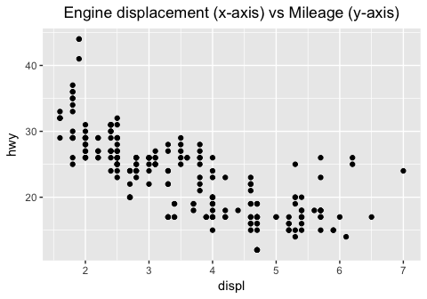

I added a title to the ggplot (ggtitle) and centered the title by adding a theme parameter. I also found that it was not required to have the "data =" or "mapping =" in the ggplot() or geom\_point() parameters. Since there was a inverse correlation, I was interested to see what a linear model would look like if fitted to the data. Here is how I added a trend line to the plot above.

``` r
ggplot(data = mpg, aes (x = displ, y = hwy)) + 
  geom_point() +
  ggtitle("Engine displacement (x-axis) vs Mileage (y-axis)") +
  theme(plot.title = element_text(hjust = 0.5)) +
  geom_smooth(method = 'lm', se = F)
```

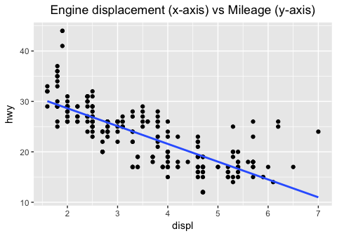

I had to specify the `aes` in the ggplot() parameter, so that it would apply to both the geom\_point() and geom\_smooth(). When I kept the `aes` in the geom\_point() paramter as before, I received an error.

3.2.4 Exercises
---------------

1.Run ggplot(data = mpg). What do you see?

``` r
ggplot(data = mpg)
```


We see an empty plot. The ggplot() function simply creates a plotting space and specifies the data that will be plotted. Sequential parameters must be added ("+") to the ggplot to see anything.

2.How many rows are in mpg? How many columns?

``` r
dim(mpg)
```

    ## [1] 234  11

There are 234 rows and 11 columns in the data set.

3.What does the drv variable describe? Read the help for ?mpg to find out.

``` r
?mpg
```

The `drv` column specifies whether the car is "f = front-wheel drive, r = rear wheel drive, 4 = 4wd" .

4.Make a scatterplot of hwy vs cyl.

``` r
ggplot(data = mpg) + 
  geom_point(mapping = aes (x=cyl, y=hwy)) +
  ggtitle("Number of Cylinders (x-axis) vs Mileage (y-axis)") +
  theme(plot.title = element_text(hjust = 0.5))
```

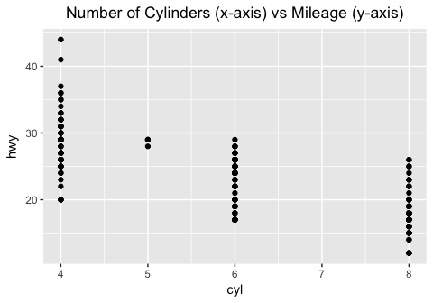

There is an inverse correlation with the number of cylinders and how much mileage the car gets on the highway.

5.What happens if you make a scatterplot of class vs drv? Why is the plot not useful?

``` r
ggplot(data = mpg) + 
  geom_point(mapping = aes (x=class, y=drv)) +
  ggtitle("Number of Class (x-axis) vs Type of Drive (y-axis)") +
  theme(plot.title = element_text(hjust = 0.5))
```

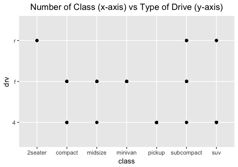

The data is not particularly useful since these are two categorical variables, and because the class of car does not usually dictate the type of drive. Furthermore, you do not know how many points fall under each of the dots seen at the crosshairs. This plot would suggest that, since there are many classes of cars with two or more types of drive.

3.3 Aesthetic Mappings
----------------------

Color-code the points in the scatterplot by another variable in the data set.

``` r
ggplot(data = mpg) + 
  geom_point(mapping = aes(x = displ, y = hwy, color = class))
```

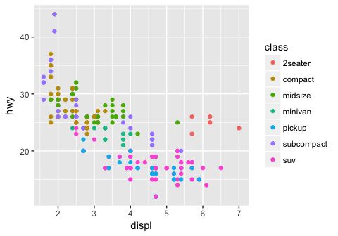

The plot shows that SUVs have low highway mileage and high engine displacement and that compact cars have high mileage and low engine displacement, as expected.

Another example, this time color coding based on the `drv` variable.

``` r
ggplot(data = mpg) + 
  geom_point(mapping = aes(x = displ, y = hwy, color = drv))
```

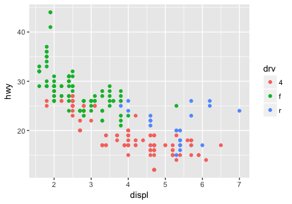

We can see that the front wheel drive cars on average have low engine displacement and high highway mileage.

Using size variable to further categorize in the graph (you can combine multiple parameters for the cateogrization! This is pretty cool). If you try to use a categorical/discrete variable for size, an error will be displayed.

``` r
ggplot(data = mpg) + 
  geom_point(mapping = aes(x = displ, y = hwy, size = cyl, color = class, alpha = drv))
```

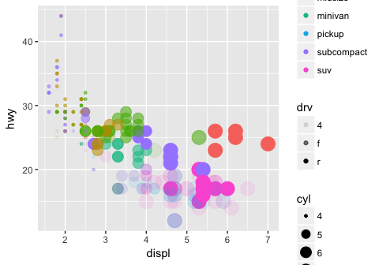

3.3.1 Exercises
---------------

1.What’s gone wrong with this code? Why are the points not blue?

``` r
ggplot(data = mpg) + 
  geom_point(mapping = aes(x = displ, y = hwy, color = "blue"))
```

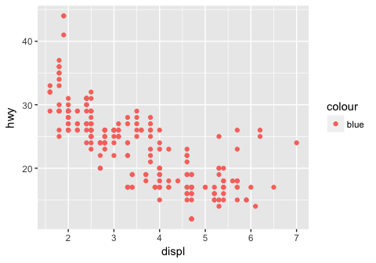

The points are not blue because the "color =" parameter lies within aes(). This means the function will be looking for a column within the mpg dataset called "blue", which does not exist. So to fix this, place the "color =" parameter outside aes(), but within geom\_point().

``` r
ggplot(data = mpg) + 
  geom_point(mapping = aes(x = displ, y = hwy), color = "blue")
```

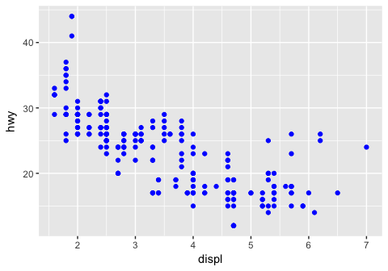

2.Which variables in mpg are categorical? Which variables are continuous? (Hint: type ?mpg to read the documentation for the dataset). How can you see this information when you run mpg?

One way you can figure out which are categorical vs continuous is by using the `summary()` function. The continuous variables will have the quartiles specified, whereas the categorical variables will not. You might have to be wary about categorical variables in numerical form, in which you would have to read the documentation. Runing just `mpg` would show the type of varable under the column name (char vs int vs dbl, etc.) which would also let you know this information.

``` r
summary(mpg)
```

    ##  manufacturer          model               displ            year     
    ##  Length:234         Length:234         Min.   :1.600   Min.   :1999  
    ##  Class :character   Class :character   1st Qu.:2.400   1st Qu.:1999  
    ##  Mode  :character   Mode  :character   Median :3.300   Median :2004  
    ##                                        Mean   :3.472   Mean   :2004  
    ##                                        3rd Qu.:4.600   3rd Qu.:2008  
    ##                                        Max.   :7.000   Max.   :2008  
    ##       cyl           trans               drv                 cty       
    ##  Min.   :4.000   Length:234         Length:234         Min.   : 9.00  
    ##  1st Qu.:4.000   Class :character   Class :character   1st Qu.:14.00  
    ##  Median :6.000   Mode  :character   Mode  :character   Median :17.00  
    ##  Mean   :5.889                                         Mean   :16.86  
    ##  3rd Qu.:8.000                                         3rd Qu.:19.00  
    ##  Max.   :8.000                                         Max.   :35.00  
    ##       hwy             fl               class          
    ##  Min.   :12.00   Length:234         Length:234        
    ##  1st Qu.:18.00   Class :character   Class :character  
    ##  Median :24.00   Mode  :character   Mode  :character  
    ##  Mean   :23.44                                        
    ##  3rd Qu.:27.00                                        
    ##  Max.   :44.00

3.Map a continuous variable to color, size, and shape. How do these aesthetics behave differently for categorical vs. continuous variables?

I mapped the continuous variable, "cty", city miles per gallon, using color and size. By color, the points are now on a gradient. By size, the larger points have higher city miles per gallon. I couldn't map the continuous variable to shape, since there are a set number of shapes available. This was also an issue when running it for the variable "class", since there was one more class than there were number of shapes as well (the SUV category has no points as a result).

``` r
# install gridExtra package to plot multiple graphs side by side, could also use cowplots package
# install.packages("gridExtra")
library(gridExtra)
```

    ## Warning: package 'gridExtra' was built under R version 3.3.2

    ## 
    ## Attaching package: 'gridExtra'

    ## The following object is masked from 'package:dplyr':
    ## 
    ##     combine

``` r
byColor <- ggplot(data = mpg) + 
  geom_point(mapping = aes(x = displ, y = hwy, color = cty)) +
  ggtitle("City miles mapped by color")
bySize <- ggplot(data = mpg) + 
  geom_point(mapping = aes(x = displ, y = hwy, size = cty)) +
  ggtitle("City miles mapped by size")

grid.arrange(byColor, bySize, ncol=2)
```

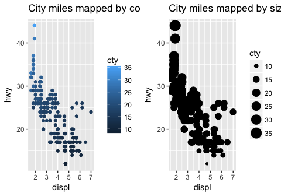

``` r
byShape <- ggplot(data = mpg) + 
  geom_point(mapping = aes(x = displ, y = hwy, shape = class))+
  ggtitle("Number of Class (x-axis) vs Type of Drive (y-axis)")
byShape
```

    ## Warning: The shape palette can deal with a maximum of 6 discrete values
    ## because more than 6 becomes difficult to discriminate; you have 7.
    ## Consider specifying shapes manually if you must have them.

    ## Warning: Removed 62 rows containing missing values (geom_point).

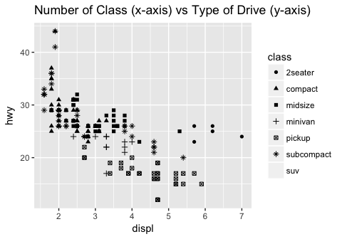

4.What happens if you map the same variable to multiple aesthetics?

The points will all lie on the same area of the spectrum for each aesthetic.

``` r
ggplot(data = mpg) + 
  geom_point(mapping = aes(x = displ, y = hwy, size = cyl, color = cyl, alpha = cyl))
```

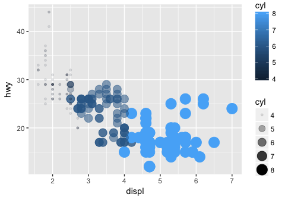

5.What does the stroke aesthetic do? What shapes does it work with? (Hint: use ?geom\_point)

The stroke will modify the width of the border for geom\_points that have a border. Below I increase the size of the points after categorizing by the drv variable.

``` r
ggplot(data = mpg) + 
  geom_point(mapping = aes(x = displ, y = hwy, shape = drv, stroke = 3))
```

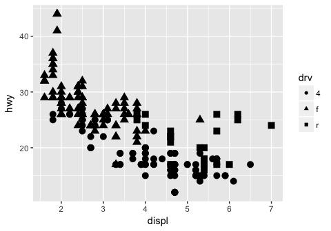

6.What happens if you map an aesthetic to something other than a variable name, like aes(colour = displ &lt; 5)?

The aesthetic will be mapped to the output of the argument. Displ &lt; 5 will return TRUE for all points less than 5, and these points will be mapped to a separate color. Below is an example of displ &lt; 5 and cyl &lt; 5.

``` r
ggplot(data = mpg) + 
  geom_point(mapping = aes(x = displ, y = hwy, color = displ < 5))
```

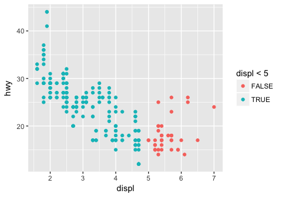

``` r
ggplot(data = mpg) + 
  geom_point(mapping = aes(x = displ, y = hwy, color = cyl < 5))
```

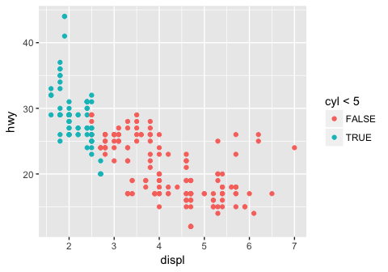

3.5 Facets
----------

Split data up into subplots based on a discrete variable: 1 dimensional facet. This allows us to focus in on subsets of the data (say for example, you wanted to quickly compare midsize vars vs minivans) Can add aesthetic mappings as well ontop of this!

``` r
ggplot(data = mpg) + 
  geom_point(mapping = aes(x = displ, y = hwy, color = drv)) + 
  facet_wrap(~ class, nrow = 2)
```

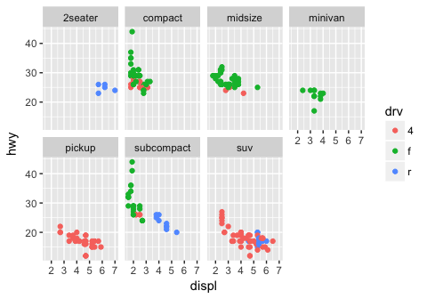

Instead of adding the aesthetic mapping, we can also make a 2D facet. This lets us add yet another mapping on top. So useful!

``` r
ggplot(data = mpg) + 
  geom_point(mapping = aes(x = displ, y = hwy, color = trans)) + 
  facet_grid(drv ~ cyl)
```

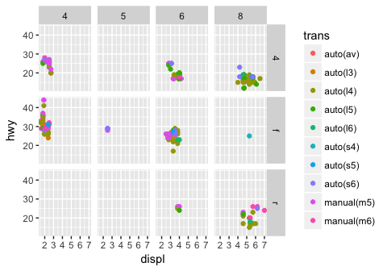

3.5.1 Exercises
---------------

1.What happens if you facet on a continuous variable?

Let's try faceting on city miles per gallon (cty):

``` r
ggplot(data = mpg) + 
  geom_point(mapping = aes(x = displ, y = hwy)) + 
  facet_grid(drv ~ cty)
```

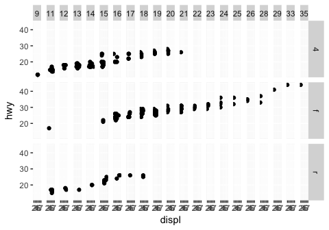

It looks like ggplot2 will still spit out a graph, but the graph is not very interpretable. It also takes much more time to process than a discrete variable with fewer factors.

2.What do the empty cells in plot with facet\_grid(drv ~ cyl) mean? How do they relate to this plot?

The empty cells in facet\_grid(drv~cyl) mean that there are no points that satisfy both of the conditions specified for drv and cyl. In the plot below, you can identify the same blank facet plots as the crosshairs that do not have points (for example, cars with 4 cylinders and rear wheel drive).

``` r
ggplot(data = mpg) + 
  geom_point(mapping = aes(x = drv, y = cyl))
```

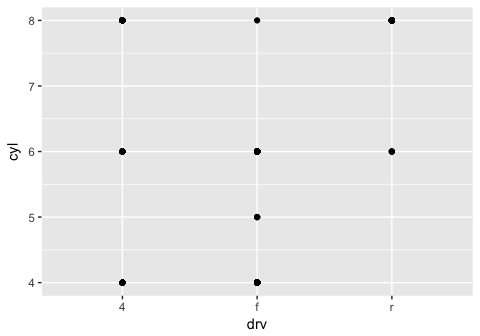

3.What plots does the following code make? What does . do?

Based on the output, I assume that . means to perform a 1D facet plot using the variable supplied. Although having the . vs not having it doesn't change the output when using the form (~ drv). Switching between . ~ drv and drv ~ . flips the orientation of the graphs. Worth to note that facet\_map(~ drv, ncol = 3) provides the same output as facet\_grid(. ~ drv).

``` r
ggplot(data = mpg) + 
  geom_point(mapping = aes(x = displ, y = hwy)) +
  facet_grid(drv ~ .)
```

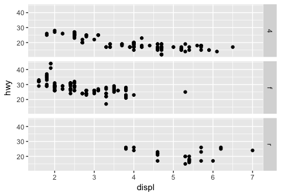

``` r
ggplot(data = mpg) + 
  geom_point(mapping = aes(x = displ, y = hwy)) +
  facet_grid(. ~ drv)
```

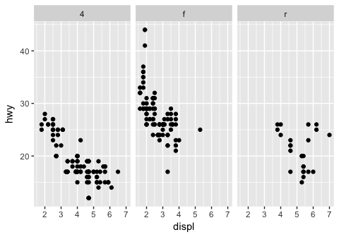

4.Take the first faceted plot in this section:

``` r
ggplot(data = mpg) + 
  geom_point(mapping = aes(x = displ, y = hwy)) + 
  facet_wrap(~ class)
```

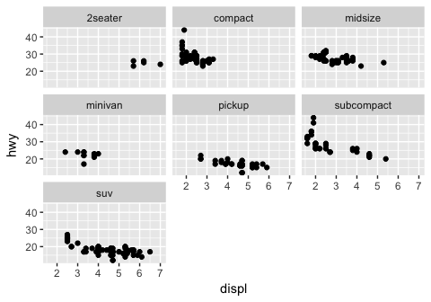

What are the advantages to using faceting instead of the colour aesthetic? What are the disadvantages? How might the balance change if you had a larger dataset?

Faceting will allow you to examine the overall distribution of one subset vs another. Pulling out the points and viewing the plot in isolation might make it easier to see trends in the data. Larger datasets with more variability between subsets (overlapping points) might want to use facets. However the computing power needed to facet the data might not scale well.

5.Read ?facet\_wrap. What does nrow do? What does ncol do? What other options control the layout of the individual panels? Why doesn’t facet\_grid() have nrow and ncol argument?

nrow and ncol in facet\_wrap() determine how many rows and columns the output graphs will be organized into. Other options include as.table, or dir. facet\_grid() does not have nrow and ncol because there are defined numbers of parameters for the two variables being compared.

6.When using facet\_grid() you should usually put the variable with more unique levels in the columns. Why?

Putting the variable with more unique levels in the columns will allow you to scan the facets faster. Also, monitors are widescreen.

3.6 Geometric objects
---------------------

Data can be visualized in different ways using different geom\_ functions:

``` r
# left
ggplot(data = mpg) + 
  geom_point(mapping = aes(x = displ, y = hwy))
```

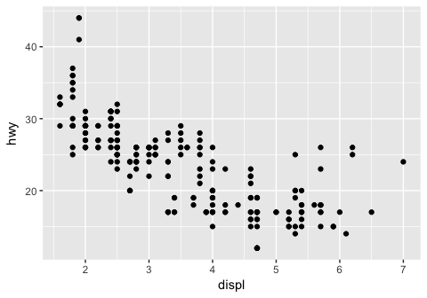

``` r
# right
ggplot(data = mpg) + 
  geom_smooth(mapping = aes(x = displ, y = hwy))
```

    ## `geom_smooth()` using method = 'loess'

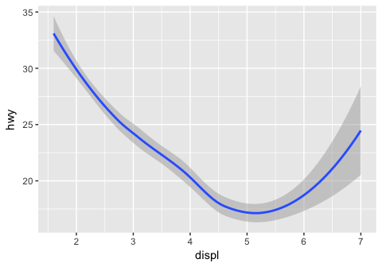

Geom functions can be combined! Also, the better coding practice is to declare global parameters in ggplot() and change as you want in the geom\_() functions, so that you do not have to modify or copy/paste multiple times. You can also only choose to display a subset of the data using the filter() command.

``` r
# declaring locally
ggplot(data = mpg) + 
  geom_point(mapping = aes (x = displ, y = hwy, color = drv)) +
  geom_smooth(mapping = aes(x = displ, y = hwy, linetype = drv, color = drv))
```

    ## `geom_smooth()` using method = 'loess'


``` r
# declaring globally and locally
ggplot(data = mpg, mapping = aes (x = displ, y = hwy, color = drv)) + 
  geom_point() +
  geom_smooth(mapping = aes(linetype = drv))
```

    ## `geom_smooth()` using method = 'loess'

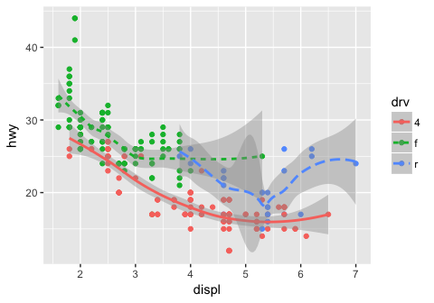

``` r
# using filter() to only display some of the data, dependent on city mileage value
ggplot(data = mpg, mapping = aes (x = displ, y = hwy, color = drv)) +
  geom_point(data = filter(mpg, cty < 20)) +
  geom_smooth(mapping = aes(linetype = drv))
```

    ## Warning: package 'bindrcpp' was built under R version 3.3.2

    ## `geom_smooth()` using method = 'loess'

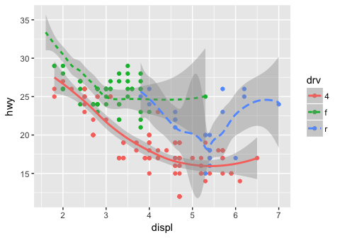

3.6.1 Exercises
---------------

1.What geom would you use to draw a line chart? A boxplot? A histogram? An area chart?

Line chart would use geom\_line(), a boxplot would use geom\_boxplot(), a histogram would use geom\_histogram(), and an area chart would use geom\_area().

2.Run this code in your head and predict what the output will look like. Then, run the code in R and check your predictions.

I predict that hwy will be plotted against displ as a scatter plot, with the color of the dot depending on the drv variable. superimposed on these points will be a smoothened conditional mean line, also colored based on the drv variable, since these were declared globally.

``` r
ggplot(data = mpg, mapping = aes(x = displ, y = hwy, color = drv)) + 
  geom_point() + 
  geom_smooth(se = FALSE)
```

    ## `geom_smooth()` using method = 'loess'

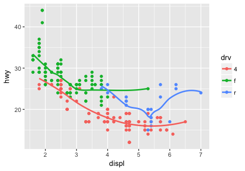

3.What does show.legend = FALSE do? What happens if you remove it? Why do you think I used it earlier in the chapter?

show.legend = FALSE prevents the legend from being displayed. If you remove it, the legends will show up. I think that it was set to false just to save space!

4.What does the se argument to geom\_smooth() do?

Based on the ?geom\_smooth documentation, the se argument tells the graph to either display or hide the confidence interval around the smooth function. This would depend on the type of smoothing performed (loess vs lm, etc.).

5.Will these two graphs look different? Why/why not?

``` r
ggplot(data = mpg, mapping = aes(x = displ, y = hwy)) + 
  geom_point() + 
  geom_smooth()
```

    ## `geom_smooth()` using method = 'loess'

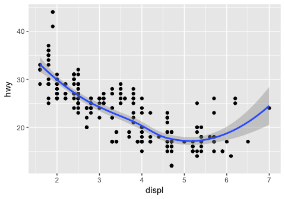

``` r
ggplot() + 
  geom_point(data = mpg, mapping = aes(x = displ, y = hwy)) + 
  geom_smooth(data = mpg, mapping = aes(x = displ, y = hwy))
```

    ## `geom_smooth()` using method = 'loess'


No, the graphs will not look different. One defines the parameters globally, whereas the other defines the same parameters locally in each geom\_() function.

6.Recreate the R code necessary to generate the following graphs.

``` r
ggplot(data = mpg, mapping = aes(x = displ, y = hwy)) +
  geom_point () +
  geom_smooth (se = FALSE)
```

    ## `geom_smooth()` using method = 'loess'

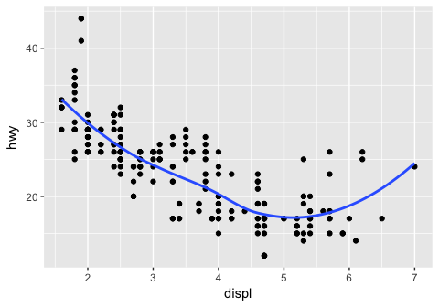

``` r
ggplot(data = mpg, mapping = aes(x = displ, y = hwy)) +
  geom_point () +
  geom_smooth (aes(group = drv), se = FALSE)
```

    ## `geom_smooth()` using method = 'loess'

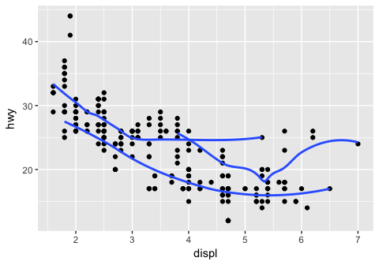

``` r
ggplot(data = mpg, mapping = aes(x = displ, y = hwy, color = drv)) +
  geom_point () +
  geom_smooth (se = FALSE)
```

    ## `geom_smooth()` using method = 'loess'


``` r
ggplot(data = mpg, mapping = aes(x = displ, y = hwy)) +
  geom_point (aes(color = drv)) +
  geom_smooth (aes(linetype = drv), se = FALSE)
```

    ## `geom_smooth()` using method = 'loess'

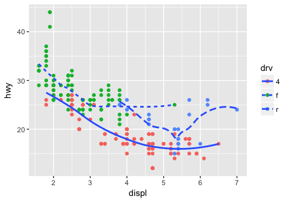

``` r
ggplot(data = mpg, mapping = aes(x = displ, y = hwy, fill = drv)) +
  geom_point (size = 3, shape = 21, stroke = 3, color = "white")
```

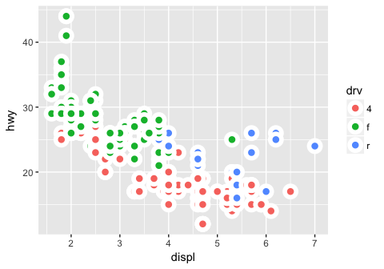

3.7 Statistical Transformations
-------------------------------

Make a barplot using geom\_bar():

``` r
ggplot(data = diamonds) +
  geom_bar(mapping = aes(x = cut))
```


We can also create a barplot if given a set of pre-defined values:

``` r
demo <- tribble(
  ~cut,         ~freq,
  "Fair",       1610,
  "Good",       4906,
  "Very Good",  12082,
  "Premium",    13791,
  "Ideal",      21551
)

ggplot(data = demo) +
  geom_bar(mapping = aes(x = cut, y = freq), stat = "identity")
```

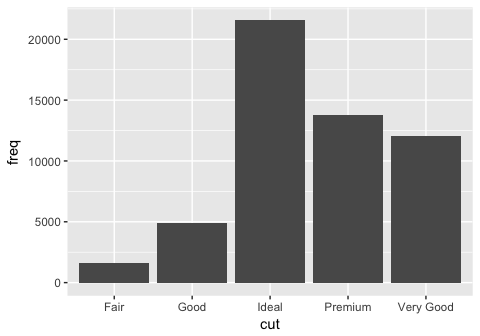

Or plot the barplot as a proportion (kind of like a histogram would, except this uses discrete variables on the x axis):

``` r
ggplot(data = diamonds) + 
  geom_bar(mapping = aes(x = cut, y = ..prop.., group = 1))
```

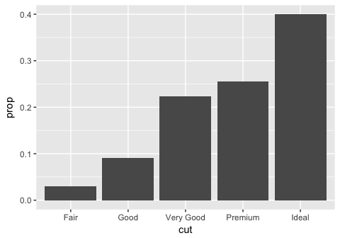

This is how to provide a stat summary manually using stat\_summary(). It might be better to visualize this using a boxplot. I'll try making one here as well:

``` r
# stat summary
ggplot(data = diamonds) + 
  stat_summary(
    mapping = aes(x = cut, y = depth),
    fun.ymin = min,
    fun.ymax = max,
    fun.y = median
  )
```

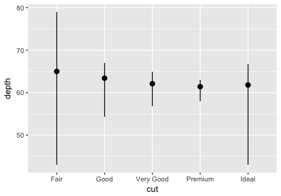

``` r
# boxplot

ggplot(data = diamonds) +
  geom_boxplot( mapping = aes (x = cut, y = depth))
```

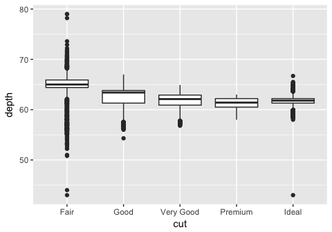

As you can see, the layout for the stat\_summary and boxplot are identical. The type of information provided by the boxplot is also very similar, except that it also provides the 1st and 3rd quartile and individual points lying outside. I am sure we could have added this information to the stat\_summary().

3.7.1 Exercises
---------------

1.What is the default geom associated with stat\_summary()? How could you rewrite the previous plot to use that geom function instead of the stat function?

Looking at the ?stat\_summary page, the default geom function associated with it is "pointrange." Below is a replicate of the plot using this geom\_function:

``` r
ggplot(data = diamonds) +
  geom_pointrange(mapping = aes (x = cut, y = depth, ymin =depth, ymax =depth))
```

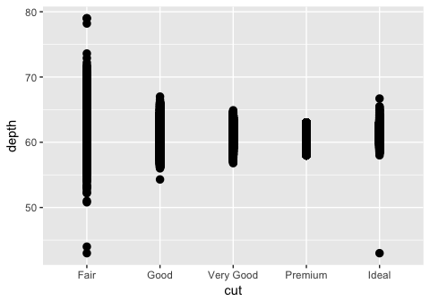 This plot looks similar, but its not exactly the same. We still need to find a way to convert the dots into a line and plot the median point.

2.What does geom\_col() do? How is it different to geom\_bar()?

geom\_col() creates a barplot but uses the values in the data. In other words, it is as if we used geom\_bar() with stat = "identity".

3.Most geoms and stats come in pairs that are almost always used in concert. Read through the documentation and make a list of all the pairs. What do they have in common?

I would refer to this page on the tidyverse website to see all the pairs of stats and geoms: <http://ggplot2.tidyverse.org/reference/>. Most of the stats and corresponding geoms are paired and have the same suffix.

4.What variables does stat\_smooth() compute? What parameters control its behaviour?

stat\_smooth() computes the moving average using a choice of methods. You can set the span for the smoothing to calculate from, number of points to evalate the smoother at, and other parameters. Below I use stat\_smooth to replicate one of the previous graphs that used geom\_smooth().

``` r
ggplot(data = mpg, aes(x = displ, y = hwy)) +
  geom_point(aes(color = drv)) +
  stat_smooth(se = "FALSE")
```

    ## `geom_smooth()` using method = 'loess'

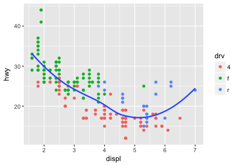

5.In our proportion bar chart, we need to set group = 1. Why? In other words what is the problem with these two graphs?

Without the group = 1, each of the proportions that are calculated for every category in cut will be equal to 1. This is because geom\_bar is calculating the proportion of each category in cut within that same category (ie: what proportion of "Fair" is in "Fair"). By forcing the group to be 1, the proper proportions as part of the total number of observations will be displayed. Changing the group size to an arbitrary number doesnt seem to change the graph.

``` r
ggplot(data = diamonds) + 
  geom_bar(mapping = aes(x = cut, y = ..prop..))
```

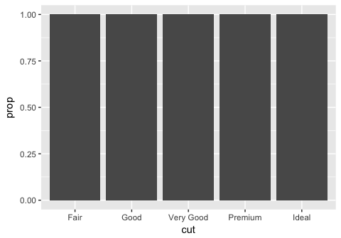

``` r
ggplot(data = diamonds) + 
  geom_bar(mapping = aes(x = cut, fill = color, y = ..prop..))
```

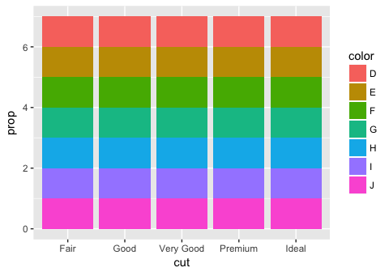

For some reason adding "group = 1" to the second geom\_bar plot (the one with the fill = color parameter) gets rid of the fill. Looking online there was no straightforward solution to this, except for using ..count.. and manually calculating the proportions (not using y = ..prop..).

3.8 Position Adjustments
------------------------

To apply a separate color to each bar, specify either "color" or "fill" within aes() with the same variable that was on the x axis.

``` r
# border, specify color parameter
ggplot(data = diamonds) + 
  geom_bar(mapping = aes(x = cut, colour = cut))
```

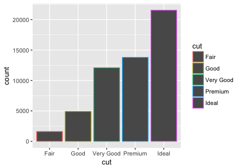

``` r
#fill, specify fill parameter
ggplot(data = diamonds) + 
  geom_bar(mapping = aes(x = cut, fill = cut))
```

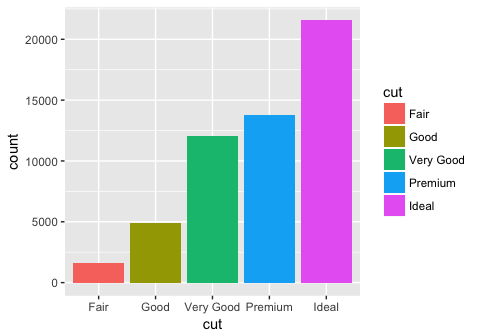

If you color by a variable other than what was on the x axis, each bar will be split into colors:

``` r
ggplot(data = diamonds) + 
  geom_bar(mapping = aes(x = cut, fill = clarity))
```

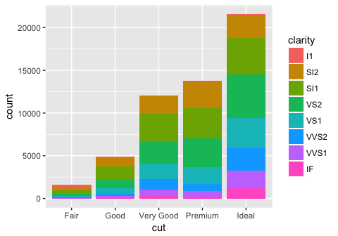

Note that this is plotting the raw counts, and not the proportions. Trying to do this using y = ..prop.. and group=1 does not work.

If you want to see the relative contribution in a different way (not stacked), set the position parameter to "identity". This will overlap the bars and make them all start from 0. To visualize them, you must either make the bars transparent or have no fill.

``` r
ggplot(data = diamonds, mapping = aes(x = cut, fill = clarity)) + 
  geom_bar(alpha = 1/5, position = "identity")
```

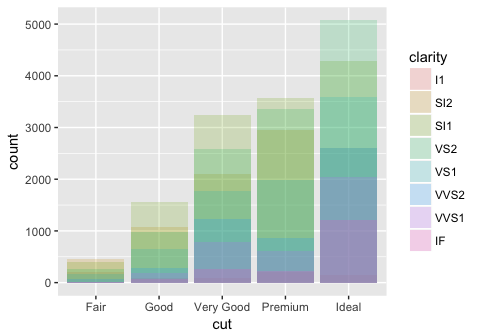

``` r
ggplot(data = diamonds, mapping = aes(x = cut, colour = clarity)) + 
  geom_bar(fill = NA, position = "identity")
```

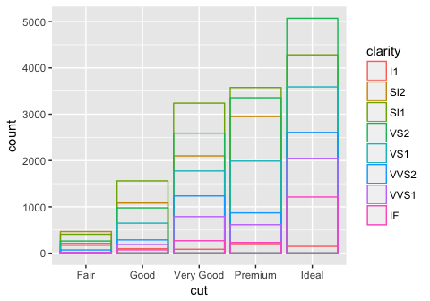 Alternatively, you can have all the bars go to the same height so you can see what the differences in proportion are between the subgroups of each item on the x axis (position = fill). Or, you can have each of the subgroups plotted side by side within each bar (position = dodge).

``` r
# position = fill
ggplot(data = diamonds) + 
  geom_bar(mapping = aes(x = cut, fill = clarity), position = "fill")
```

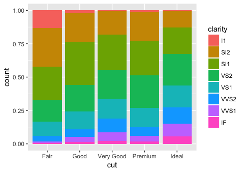

``` r
# position = dodge
ggplot(data = diamonds) + 
  geom_bar(mapping = aes(x = cut, fill = clarity), position = "dodge")
```

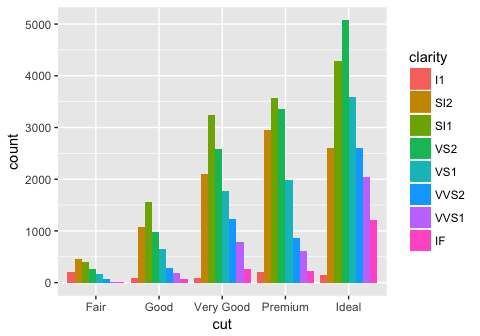

On scatterplots, overlapping points can be overlooked quite easily. One way to get around this is to jitter all the points, so that the number of overlapping points can be better visualized. The jitter parameter adds some normally distributed noise to each of the values in the dataset.

``` r
ggplot(data = mpg) + 
  geom_point(mapping = aes(x = displ, y = hwy), position = "jitter")
```

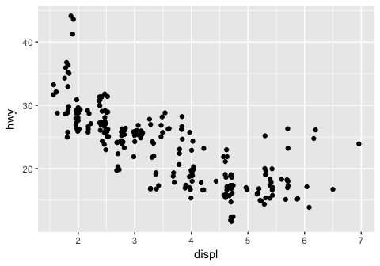

3.8.1 Exercises
---------------

1.What is the problem with this plot? How could you improve it?

``` r
ggplot(data = mpg, mapping = aes(x = cty, y = hwy)) + 
  geom_point()
```

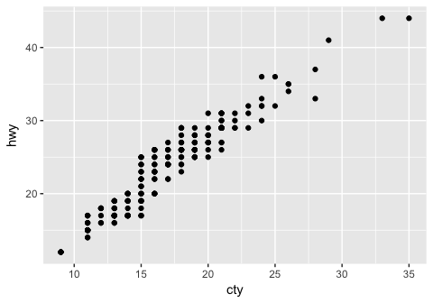

A lot of the data points are overlapping, so we have no sense of how weighted each point is. A better version of the plot would be one that uses the jitter parameter:

``` r
ggplot(data = mpg, mapping = aes(x = cty, y = hwy)) + 
  geom_point(position = "jitter")
```

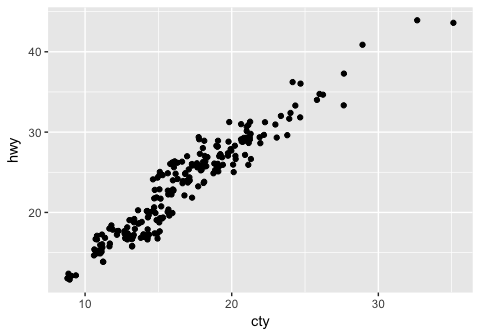

2.What parameters to geom\_jitter() control the amount of jittering?

Based on ?geom\_jitter, the "width" and "height" parameters for geom\_jitter will control how much noise is added to each point.

3.Compare and contrast geom\_jitter() with geom\_count().

``` r
# geom jitter
ggplot(data = mpg, mapping = aes(x = cty, y = hwy)) + 
  geom_jitter()
```


``` r
# geom count
ggplot(data = mpg, mapping = aes(x = cty, y = hwy)) + 
  geom_count()
```


Geom\_count does not "jitter" the points; instead, it increases the size of the point based off of how many points were in that specific x,y slot.

4.What’s the default position adjustment for geom\_boxplot()? Create a visualisation of the mpg dataset that demonstrates it

?geom\_boxplot() indicates that the default position is "dodge," which means that any further grouping by aesthetic of each category on the x-axis will have the "dodge" positioning. As shown above, "dodge" splits the category into the indicated subgroups and plots it side by side within the category.

Here is a visualization of hte mpg dataset using geom\_boxplot(), which shows the city miles per gallon for each class of car, further grouped by the type of drive. The type of drive is "dodged":

``` r
ggplot (data = mpg, mapping = aes (x = class, y = cty)) +
  geom_boxplot(aes (color = drv))
```


If i wanted to plot the boxplots on top of each other, I would use position = "identity", and then make the graphs transparent by specifying an alpha value:

``` r
ggplot (data = mpg, mapping = aes (x = class, y = cty)) +
  geom_boxplot(aes (color = drv), position = "identity", alpha = 1)
```


3.9 Coordinate Systems
----------------------

Sometimes we want to swap the axes, for various reasons (one being that the x-labels are long and hard to fit on a small graph):

``` r
# vertical boxplots
ggplot(data = mpg, mapping = aes(x = class, y = hwy)) + 
  geom_boxplot()
```


``` r
# horizontal boxplots
ggplot(data = mpg, mapping = aes(x = class, y = hwy)) + 
  geom_boxplot() +
  coord_flip()
```


We also might want to change bar plots into pie charts:

``` r
bar <- ggplot(data = diamonds) + 
  geom_bar(
    mapping = aes(x = cut, fill = cut), 
    show.legend = FALSE,
    width = 1
  ) + 
  theme(aspect.ratio = 1) +
  labs(x = NULL, y = NULL)

bar + coord_flip()
```


``` r
bar + coord_polar()
```


``` r
# 
```

3.9.1 Exercises
---------------

1.Turn a stacked bar chart into a pie chart using coord\_polar().

The previous chart is a coxcomb plot, not what you would usually expect to see when looking at pie charts. Below I've modified the code to produce a more conventional pie chart, starting from a stacked bar chart.

``` r
# make a stacked bar chart with one bar
bar <- ggplot(data = diamonds) + 
  geom_bar(
    mapping = aes(x = factor(1), fill = cut), # factor(1) can be "" or anything not specifying a variable in the dataset.
    width = 1 #, -> if you want a transparent pie chart, uncomment these!
    # position = 'identity', 
    # alpha = .2
  ) + 
  theme(aspect.ratio = 1) +
  labs(x = NULL, y = NULL)

bar + coord_polar(theta = 'y')
```


2.What does labs() do? Read the documentation.

Labs() allows you to specify custom labels for the ggplot graphs.

3.What’s the difference between coord\_quickmap() and coord\_map()?

coord\_map() projects a spherical map onto a 2D plane, but does not preserve straight lines. coord\_quickmap() does the same thing as coord\_map except that it uses a quick approximation that preserves straight lines (for the most part).

4.What does the plot below tell you about the relationship between city and highway mpg? Why is coord\_fixed() important? What does geom\_abline() do?

The plot below tells us that there is a positive correlation between city and highway mpg. In other words, cars with higher city mileage tend to also have higher highway mileage. Although not necessary, coord\_fixed() will make the scale of each axis the same width (5 units on the y axis moves up by the same length as 5 units on the x axis). Geom\_abline() adds a line of slope 1 that passes through the origin (0,0). As it is now, it is not very informative. So, I modified the parameters to turn it into a regression line by passing in the slope and intercept values from the base R "lm" function. I also plotted the ggplot geom\_smooth() as a comparison, showing that they provide the same line.

``` r
# provided example
ggplot(data = mpg, mapping = aes(x = cty, y = hwy)) +
  geom_point() + 
  geom_abline() +
  coord_fixed()
```


``` r
# modified the abline to plot a simple linear regression ontop of the points.
ggplot(data = mpg, mapping = aes(x = cty, y = hwy)) +
  geom_point() + 
  geom_abline(intercept = lm(hwy ~ cty, data = mpg)$coeff[1], slope = lm(hwy ~ cty, data = mpg)$coeff[2]) +
  coord_fixed()
```


``` r
# used geom_smooth instead of geom_abline to get the same result
ggplot(data = mpg, mapping = aes(x = cty, y = hwy)) +
  geom_point() + 
  geom_smooth (method = 'lm', se = F)+
  coord_fixed()
```


This concludes my walkthrough of chapters 1-3 of *R for Data Science*! Thanks for reading! A walkthrough of chapters 4 - 8 can be found in the R markdown file, r4ds\_chapter4-8\_walkthrough.Rmd.
