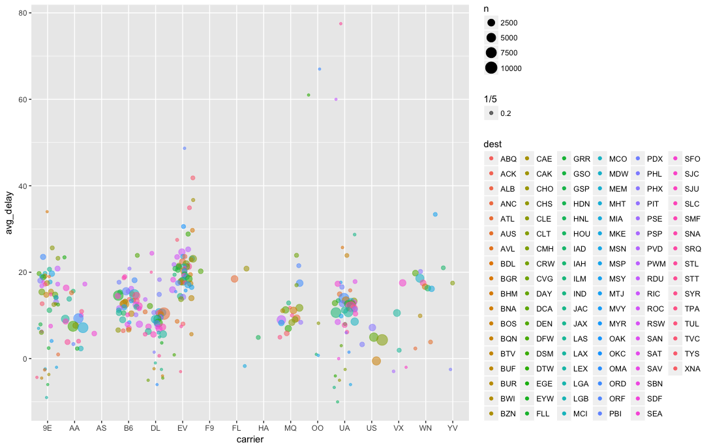

R for Data Science Walkthrough Chapters 4-6
================
Erick Lu

-   [Chapter 4](#chapter-4)
    -   [4.4 Practice](#practice)
-   [Chapter 5](#chapter-5)
    -   [5.2 Filter rows with filter()](#filter-rows-with-filter)
    -   [5.2.1 Comparisons](#comparisons)
    -   [5.2.2 Logical Operators](#logical-operators)
    -   [5.2.3 Missing values](#missing-values)
    -   [5.2.4 Exercises](#exercises)
    -   [5.3 Arrange rows with arrange()](#arrange-rows-with-arrange)
    -   [5.3.1 Exercises](#exercises-1)
    -   [5.4 Select columns with select()](#select-columns-with-select)
    -   [5.4.1 Exercises](#exercises-2)
    -   [5.5 Add new variables with mutate()](#add-new-variables-with-mutate)
    -   [5.5.2 Exercises](#exercises-3)
    -   [5.6 Grouped summaries with summarise()](#grouped-summaries-with-summarise)
    -   [5.6.7 Exercises](#exercises-4)
    -   [5.7 Grouped mutates (and filters)](#grouped-mutates-and-filters)
    -   [5.7.1 Exercises](#exercises-5)

This my walkthrough for the book: *R for Data Science* by Hadley Wickham and Garrett Grolemund. It contains my answers to their exercises, some highlights from the book that I found useful, and some of my own notes and data explorations. Here I will go through chapters 4-6.

Chapter 4
=========

4.4 Practice
------------

### 1. Why does this code not work?

``` r
my_variable <- 10
# my_varıable
```

The code does not work because there is a typo in the variable name that you are calling. The letter "i" is not the same in my\_var(i)able.

### 2. Tweak each of the following R commands so that they run correctly:

Changed "dota" to "data", "fliter" to "filter", "=" to "==", and "diamond" to "diamonds"

``` r
library(tidyverse)
```

    ## ── Attaching packages ─────────────────────────────────────────────────────────────────────────────────────────── tidyverse 1.2.1 ──

    ## ✔ ggplot2 2.2.1     ✔ purrr   0.2.4
    ## ✔ tibble  1.4.2     ✔ dplyr   0.7.4
    ## ✔ tidyr   0.8.0     ✔ stringr 1.3.0
    ## ✔ readr   1.1.1     ✔ forcats 0.3.0

    ## Warning: package 'ggplot2' was built under R version 3.3.2

    ## Warning: package 'readr' was built under R version 3.3.2

    ## Warning: package 'purrr' was built under R version 3.3.2

    ## Warning: package 'dplyr' was built under R version 3.3.2

    ## ── Conflicts ────────────────────────────────────────────────────────────────────────────────────────────── tidyverse_conflicts() ──
    ## ✖ dplyr::filter() masks stats::filter()
    ## ✖ dplyr::lag()    masks stats::lag()

``` r
ggplot(data = mpg) + 
  geom_point(mapping = aes(x = displ, y = hwy))
```


``` r
filter(mpg, cyl == 8)
```

    ## Warning: package 'bindrcpp' was built under R version 3.3.2

    ## # A tibble: 70 x 11
    ##    manufacturer model     displ  year   cyl trans  drv     cty   hwy fl   
    ##    <chr>        <chr>     <dbl> <int> <int> <chr>  <chr> <int> <int> <chr>
    ##  1 audi         a6 quatt…  4.20  2008     8 auto(… 4        16    23 p    
    ##  2 chevrolet    c1500 su…  5.30  2008     8 auto(… r        14    20 r    
    ##  3 chevrolet    c1500 su…  5.30  2008     8 auto(… r        11    15 e    
    ##  4 chevrolet    c1500 su…  5.30  2008     8 auto(… r        14    20 r    
    ##  5 chevrolet    c1500 su…  5.70  1999     8 auto(… r        13    17 r    
    ##  6 chevrolet    c1500 su…  6.00  2008     8 auto(… r        12    17 r    
    ##  7 chevrolet    corvette   5.70  1999     8 manua… r        16    26 p    
    ##  8 chevrolet    corvette   5.70  1999     8 auto(… r        15    23 p    
    ##  9 chevrolet    corvette   6.20  2008     8 manua… r        16    26 p    
    ## 10 chevrolet    corvette   6.20  2008     8 auto(… r        15    25 p    
    ## # ... with 60 more rows, and 1 more variable: class <chr>

``` r
filter(diamonds, carat > 3)
```

    ## # A tibble: 32 x 10
    ##    carat cut     color clarity depth table price     x     y     z
    ##    <dbl> <ord>   <ord> <ord>   <dbl> <dbl> <int> <dbl> <dbl> <dbl>
    ##  1  3.01 Premium I     I1       62.7   58.  8040  9.10  8.97  5.67
    ##  2  3.11 Fair    J     I1       65.9   57.  9823  9.15  9.02  5.98
    ##  3  3.01 Premium F     I1       62.2   56.  9925  9.24  9.13  5.73
    ##  4  3.05 Premium E     I1       60.9   58. 10453  9.26  9.25  5.66
    ##  5  3.02 Fair    I     I1       65.2   56. 10577  9.11  9.02  5.91
    ##  6  3.01 Fair    H     I1       56.1   62. 10761  9.54  9.38  5.31
    ##  7  3.65 Fair    H     I1       67.1   53. 11668  9.53  9.48  6.38
    ##  8  3.24 Premium H     I1       62.1   58. 12300  9.44  9.40  5.85
    ##  9  3.22 Ideal   I     I1       62.6   55. 12545  9.49  9.42  5.92
    ## 10  3.50 Ideal   H     I1       62.8   57. 12587  9.65  9.59  6.03
    ## # ... with 22 more rows

### 3. Press Alt + Shift + K. What happens? How can you get to the same place using the menus?

This opens up a list of the keyboard shortcuts! Very useful. Using the menus, either type "shorcut" into the search bar under help, or find it under: tools: keyboard shortcuts help.

Chapter 5
=========

The data that we will work with in chapter 5 is from the nycflights13 package.

``` r
library(tidyverse)
library(nycflights13)
```

    ## Warning: package 'nycflights13' was built under R version 3.3.2

``` r
flights
```

    ## # A tibble: 336,776 x 19
    ##     year month   day dep_time sched_dep_time dep_delay arr_time
    ##    <int> <int> <int>    <int>          <int>     <dbl>    <int>
    ##  1  2013     1     1      517            515        2.      830
    ##  2  2013     1     1      533            529        4.      850
    ##  3  2013     1     1      542            540        2.      923
    ##  4  2013     1     1      544            545       -1.     1004
    ##  5  2013     1     1      554            600       -6.      812
    ##  6  2013     1     1      554            558       -4.      740
    ##  7  2013     1     1      555            600       -5.      913
    ##  8  2013     1     1      557            600       -3.      709
    ##  9  2013     1     1      557            600       -3.      838
    ## 10  2013     1     1      558            600       -2.      753
    ## # ... with 336,766 more rows, and 12 more variables: sched_arr_time <int>,
    ## #   arr_delay <dbl>, carrier <chr>, flight <int>, tailnum <chr>,
    ## #   origin <chr>, dest <chr>, air_time <dbl>, distance <dbl>, hour <dbl>,
    ## #   minute <dbl>, time_hour <dttm>

5.2 Filter rows with filter()
-----------------------------

filter() will subset obervations based on their values. I think it works a lot like the which() function in base R (ie: data\[which(data$variable &gt; value),\] ). Below is a way to do the same thing using either filter() or base R which().

``` r
# tidyverse filter() output
filter(flights, month == 1, day == 1)
```

    ## # A tibble: 842 x 19
    ##     year month   day dep_time sched_dep_time dep_delay arr_time
    ##    <int> <int> <int>    <int>          <int>     <dbl>    <int>
    ##  1  2013     1     1      517            515        2.      830
    ##  2  2013     1     1      533            529        4.      850
    ##  3  2013     1     1      542            540        2.      923
    ##  4  2013     1     1      544            545       -1.     1004
    ##  5  2013     1     1      554            600       -6.      812
    ##  6  2013     1     1      554            558       -4.      740
    ##  7  2013     1     1      555            600       -5.      913
    ##  8  2013     1     1      557            600       -3.      709
    ##  9  2013     1     1      557            600       -3.      838
    ## 10  2013     1     1      558            600       -2.      753
    ## # ... with 832 more rows, and 12 more variables: sched_arr_time <int>,
    ## #   arr_delay <dbl>, carrier <chr>, flight <int>, tailnum <chr>,
    ## #   origin <chr>, dest <chr>, air_time <dbl>, distance <dbl>, hour <dbl>,
    ## #   minute <dbl>, time_hour <dttm>

``` r
# base R way to get the same output
flights[which(flights$month ==1 & flights$day ==1),]
```

    ## # A tibble: 842 x 19
    ##     year month   day dep_time sched_dep_time dep_delay arr_time
    ##    <int> <int> <int>    <int>          <int>     <dbl>    <int>
    ##  1  2013     1     1      517            515        2.      830
    ##  2  2013     1     1      533            529        4.      850
    ##  3  2013     1     1      542            540        2.      923
    ##  4  2013     1     1      544            545       -1.     1004
    ##  5  2013     1     1      554            600       -6.      812
    ##  6  2013     1     1      554            558       -4.      740
    ##  7  2013     1     1      555            600       -5.      913
    ##  8  2013     1     1      557            600       -3.      709
    ##  9  2013     1     1      557            600       -3.      838
    ## 10  2013     1     1      558            600       -2.      753
    ## # ... with 832 more rows, and 12 more variables: sched_arr_time <int>,
    ## #   arr_delay <dbl>, carrier <chr>, flight <int>, tailnum <chr>,
    ## #   origin <chr>, dest <chr>, air_time <dbl>, distance <dbl>, hour <dbl>,
    ## #   minute <dbl>, time_hour <dttm>

5.2.1 Comparisons
-----------------

A safer way for comparing two numeric vectors is the near() function in dplyr. For example, if running this comparison:

``` r
sqrt(2) ^ 2 == 2
```

    ## [1] FALSE

``` r
1/49 * 49 == 1
```

    ## [1] FALSE

We see that what we would normally regard as true is specified as FALSE in R, due to floating point precision issues. The near() function will allow more tolerance.

``` r
near(sqrt(2) ^ 2,  2)
```

    ## [1] TRUE

``` r
near(1 / 49 * 49, 1)
```

    ## [1] TRUE

5.2.2 Logical Operators
-----------------------

There are many ways to combine "and", `&`, "or", `|`, and "not",`!` to filter out observations in a data table.

``` r
#following two filter functions give same output
filter(flights, month == 11 | month == 12)
```

    ## # A tibble: 55,403 x 19
    ##     year month   day dep_time sched_dep_time dep_delay arr_time
    ##    <int> <int> <int>    <int>          <int>     <dbl>    <int>
    ##  1  2013    11     1        5           2359        6.      352
    ##  2  2013    11     1       35           2250      105.      123
    ##  3  2013    11     1      455            500       -5.      641
    ##  4  2013    11     1      539            545       -6.      856
    ##  5  2013    11     1      542            545       -3.      831
    ##  6  2013    11     1      549            600      -11.      912
    ##  7  2013    11     1      550            600      -10.      705
    ##  8  2013    11     1      554            600       -6.      659
    ##  9  2013    11     1      554            600       -6.      826
    ## 10  2013    11     1      554            600       -6.      749
    ## # ... with 55,393 more rows, and 12 more variables: sched_arr_time <int>,
    ## #   arr_delay <dbl>, carrier <chr>, flight <int>, tailnum <chr>,
    ## #   origin <chr>, dest <chr>, air_time <dbl>, distance <dbl>, hour <dbl>,
    ## #   minute <dbl>, time_hour <dttm>

``` r
filter(flights, month %in% c(11,12))
```

    ## # A tibble: 55,403 x 19
    ##     year month   day dep_time sched_dep_time dep_delay arr_time
    ##    <int> <int> <int>    <int>          <int>     <dbl>    <int>
    ##  1  2013    11     1        5           2359        6.      352
    ##  2  2013    11     1       35           2250      105.      123
    ##  3  2013    11     1      455            500       -5.      641
    ##  4  2013    11     1      539            545       -6.      856
    ##  5  2013    11     1      542            545       -3.      831
    ##  6  2013    11     1      549            600      -11.      912
    ##  7  2013    11     1      550            600      -10.      705
    ##  8  2013    11     1      554            600       -6.      659
    ##  9  2013    11     1      554            600       -6.      826
    ## 10  2013    11     1      554            600       -6.      749
    ## # ... with 55,393 more rows, and 12 more variables: sched_arr_time <int>,
    ## #   arr_delay <dbl>, carrier <chr>, flight <int>, tailnum <chr>,
    ## #   origin <chr>, dest <chr>, air_time <dbl>, distance <dbl>, hour <dbl>,
    ## #   minute <dbl>, time_hour <dttm>

``` r
#following two filter functions give same output
filter(flights, !(arr_delay > 120 | dep_delay > 120))
```

    ## # A tibble: 316,050 x 19
    ##     year month   day dep_time sched_dep_time dep_delay arr_time
    ##    <int> <int> <int>    <int>          <int>     <dbl>    <int>
    ##  1  2013     1     1      517            515        2.      830
    ##  2  2013     1     1      533            529        4.      850
    ##  3  2013     1     1      542            540        2.      923
    ##  4  2013     1     1      544            545       -1.     1004
    ##  5  2013     1     1      554            600       -6.      812
    ##  6  2013     1     1      554            558       -4.      740
    ##  7  2013     1     1      555            600       -5.      913
    ##  8  2013     1     1      557            600       -3.      709
    ##  9  2013     1     1      557            600       -3.      838
    ## 10  2013     1     1      558            600       -2.      753
    ## # ... with 316,040 more rows, and 12 more variables: sched_arr_time <int>,
    ## #   arr_delay <dbl>, carrier <chr>, flight <int>, tailnum <chr>,
    ## #   origin <chr>, dest <chr>, air_time <dbl>, distance <dbl>, hour <dbl>,
    ## #   minute <dbl>, time_hour <dttm>

``` r
filter(flights, arr_delay <= 120 & !dep_delay > 120)
```

    ## # A tibble: 316,050 x 19
    ##     year month   day dep_time sched_dep_time dep_delay arr_time
    ##    <int> <int> <int>    <int>          <int>     <dbl>    <int>
    ##  1  2013     1     1      517            515        2.      830
    ##  2  2013     1     1      533            529        4.      850
    ##  3  2013     1     1      542            540        2.      923
    ##  4  2013     1     1      544            545       -1.     1004
    ##  5  2013     1     1      554            600       -6.      812
    ##  6  2013     1     1      554            558       -4.      740
    ##  7  2013     1     1      555            600       -5.      913
    ##  8  2013     1     1      557            600       -3.      709
    ##  9  2013     1     1      557            600       -3.      838
    ## 10  2013     1     1      558            600       -2.      753
    ## # ... with 316,040 more rows, and 12 more variables: sched_arr_time <int>,
    ## #   arr_delay <dbl>, carrier <chr>, flight <int>, tailnum <chr>,
    ## #   origin <chr>, dest <chr>, air_time <dbl>, distance <dbl>, hour <dbl>,
    ## #   minute <dbl>, time_hour <dttm>

5.2.3 Missing values
--------------------

Missing values are represented as NA. NA values are "contagious," meaning that any operation or comparison with NA will also return NA. If a data frame contains NA values, they will not be returned by filter() unless specifically asked for, using is.na()

``` r
df <- tibble(x = c(1, NA, 3))
filter(df, x > 1)
```

    ## # A tibble: 1 x 1
    ##       x
    ##   <dbl>
    ## 1    3.

``` r
#> # A tibble: 1 × 1
#>       x
#>   <dbl>
#> 1     3
filter(df, is.na(x) | x > 1)
```

    ## # A tibble: 2 x 1
    ##       x
    ##   <dbl>
    ## 1   NA 
    ## 2    3.

5.2.4 Exercises
---------------

### 1. Find all flights that

-   Had an arrival delay of two or more hours

``` r
# arr_delay is in minutes, so 120 for two hours
filter(flights, arr_delay >= 120)
```

    ## # A tibble: 10,200 x 19
    ##     year month   day dep_time sched_dep_time dep_delay arr_time
    ##    <int> <int> <int>    <int>          <int>     <dbl>    <int>
    ##  1  2013     1     1      811            630      101.     1047
    ##  2  2013     1     1      848           1835      853.     1001
    ##  3  2013     1     1      957            733      144.     1056
    ##  4  2013     1     1     1114            900      134.     1447
    ##  5  2013     1     1     1505           1310      115.     1638
    ##  6  2013     1     1     1525           1340      105.     1831
    ##  7  2013     1     1     1549           1445       64.     1912
    ##  8  2013     1     1     1558           1359      119.     1718
    ##  9  2013     1     1     1732           1630       62.     2028
    ## 10  2013     1     1     1803           1620      103.     2008
    ## # ... with 10,190 more rows, and 12 more variables: sched_arr_time <int>,
    ## #   arr_delay <dbl>, carrier <chr>, flight <int>, tailnum <chr>,
    ## #   origin <chr>, dest <chr>, air_time <dbl>, distance <dbl>, hour <dbl>,
    ## #   minute <dbl>, time_hour <dttm>

-   Flew to Houston (IAH or HOU)

``` r
filter(flights, dest == "IAH" | dest == "HOU")
```

    ## # A tibble: 9,313 x 19
    ##     year month   day dep_time sched_dep_time dep_delay arr_time
    ##    <int> <int> <int>    <int>          <int>     <dbl>    <int>
    ##  1  2013     1     1      517            515        2.      830
    ##  2  2013     1     1      533            529        4.      850
    ##  3  2013     1     1      623            627       -4.      933
    ##  4  2013     1     1      728            732       -4.     1041
    ##  5  2013     1     1      739            739        0.     1104
    ##  6  2013     1     1      908            908        0.     1228
    ##  7  2013     1     1     1028           1026        2.     1350
    ##  8  2013     1     1     1044           1045       -1.     1352
    ##  9  2013     1     1     1114            900      134.     1447
    ## 10  2013     1     1     1205           1200        5.     1503
    ## # ... with 9,303 more rows, and 12 more variables: sched_arr_time <int>,
    ## #   arr_delay <dbl>, carrier <chr>, flight <int>, tailnum <chr>,
    ## #   origin <chr>, dest <chr>, air_time <dbl>, distance <dbl>, hour <dbl>,
    ## #   minute <dbl>, time_hour <dttm>

-   Were operated by United, American, or Delta

``` r
#find all unique carriers:
unique(flights$carrier)
```

    ##  [1] "UA" "AA" "B6" "DL" "EV" "MQ" "US" "WN" "VX" "FL" "AS" "9E" "F9" "HA"
    ## [15] "YV" "OO"

``` r
#Symbol for United = UA, American = AA, Delta = DL
filter (flights, carrier %in% c("UA", "AA","DL"))
```

    ## # A tibble: 139,504 x 19
    ##     year month   day dep_time sched_dep_time dep_delay arr_time
    ##    <int> <int> <int>    <int>          <int>     <dbl>    <int>
    ##  1  2013     1     1      517            515        2.      830
    ##  2  2013     1     1      533            529        4.      850
    ##  3  2013     1     1      542            540        2.      923
    ##  4  2013     1     1      554            600       -6.      812
    ##  5  2013     1     1      554            558       -4.      740
    ##  6  2013     1     1      558            600       -2.      753
    ##  7  2013     1     1      558            600       -2.      924
    ##  8  2013     1     1      558            600       -2.      923
    ##  9  2013     1     1      559            600       -1.      941
    ## 10  2013     1     1      559            600       -1.      854
    ## # ... with 139,494 more rows, and 12 more variables: sched_arr_time <int>,
    ## #   arr_delay <dbl>, carrier <chr>, flight <int>, tailnum <chr>,
    ## #   origin <chr>, dest <chr>, air_time <dbl>, distance <dbl>, hour <dbl>,
    ## #   minute <dbl>, time_hour <dttm>

-   Departed in summer (July, August, and September)

``` r
filter (flights, month >= 7 & month <=9)
```

    ## # A tibble: 86,326 x 19
    ##     year month   day dep_time sched_dep_time dep_delay arr_time
    ##    <int> <int> <int>    <int>          <int>     <dbl>    <int>
    ##  1  2013     7     1        1           2029      212.      236
    ##  2  2013     7     1        2           2359        3.      344
    ##  3  2013     7     1       29           2245      104.      151
    ##  4  2013     7     1       43           2130      193.      322
    ##  5  2013     7     1       44           2150      174.      300
    ##  6  2013     7     1       46           2051      235.      304
    ##  7  2013     7     1       48           2001      287.      308
    ##  8  2013     7     1       58           2155      183.      335
    ##  9  2013     7     1      100           2146      194.      327
    ## 10  2013     7     1      100           2245      135.      337
    ## # ... with 86,316 more rows, and 12 more variables: sched_arr_time <int>,
    ## #   arr_delay <dbl>, carrier <chr>, flight <int>, tailnum <chr>,
    ## #   origin <chr>, dest <chr>, air_time <dbl>, distance <dbl>, hour <dbl>,
    ## #   minute <dbl>, time_hour <dttm>

``` r
# test whether the output only has months 7 8 9 to check our work.
unique(filter (flights, month >= 7 & month <=9)$month)
```

    ## [1] 7 8 9

-   Arrived more than two hours late, but didn’t leave late

``` r
filter (flights, arr_delay > 120, dep_delay <=0)
```

    ## # A tibble: 29 x 19
    ##     year month   day dep_time sched_dep_time dep_delay arr_time
    ##    <int> <int> <int>    <int>          <int>     <dbl>    <int>
    ##  1  2013     1    27     1419           1420       -1.     1754
    ##  2  2013    10     7     1350           1350        0.     1736
    ##  3  2013    10     7     1357           1359       -2.     1858
    ##  4  2013    10    16      657            700       -3.     1258
    ##  5  2013    11     1      658            700       -2.     1329
    ##  6  2013     3    18     1844           1847       -3.       39
    ##  7  2013     4    17     1635           1640       -5.     2049
    ##  8  2013     4    18      558            600       -2.     1149
    ##  9  2013     4    18      655            700       -5.     1213
    ## 10  2013     5    22     1827           1830       -3.     2217
    ## # ... with 19 more rows, and 12 more variables: sched_arr_time <int>,
    ## #   arr_delay <dbl>, carrier <chr>, flight <int>, tailnum <chr>,
    ## #   origin <chr>, dest <chr>, air_time <dbl>, distance <dbl>, hour <dbl>,
    ## #   minute <dbl>, time_hour <dttm>

``` r
#looks like combining the two arguments into one does the same thing.
filter(flights, arr_delay > 120 & dep_delay <=0)
```

    ## # A tibble: 29 x 19
    ##     year month   day dep_time sched_dep_time dep_delay arr_time
    ##    <int> <int> <int>    <int>          <int>     <dbl>    <int>
    ##  1  2013     1    27     1419           1420       -1.     1754
    ##  2  2013    10     7     1350           1350        0.     1736
    ##  3  2013    10     7     1357           1359       -2.     1858
    ##  4  2013    10    16      657            700       -3.     1258
    ##  5  2013    11     1      658            700       -2.     1329
    ##  6  2013     3    18     1844           1847       -3.       39
    ##  7  2013     4    17     1635           1640       -5.     2049
    ##  8  2013     4    18      558            600       -2.     1149
    ##  9  2013     4    18      655            700       -5.     1213
    ## 10  2013     5    22     1827           1830       -3.     2217
    ## # ... with 19 more rows, and 12 more variables: sched_arr_time <int>,
    ## #   arr_delay <dbl>, carrier <chr>, flight <int>, tailnum <chr>,
    ## #   origin <chr>, dest <chr>, air_time <dbl>, distance <dbl>, hour <dbl>,
    ## #   minute <dbl>, time_hour <dttm>

-   Were delayed by at least an hour, but made up over 30 minutes in flight

``` r
# if delayed 60 minutes but made up at least 30, expect arr_delay to be less than 60-30 = 30 min
filter (flights, dep_delay >= 60, arr_delay < 30)
```

    ## # A tibble: 206 x 19
    ##     year month   day dep_time sched_dep_time dep_delay arr_time
    ##    <int> <int> <int>    <int>          <int>     <dbl>    <int>
    ##  1  2013     1     3     1850           1745       65.     2148
    ##  2  2013     1     3     1950           1845       65.     2228
    ##  3  2013     1     3     2015           1915       60.     2135
    ##  4  2013     1     6     1019            900       79.     1558
    ##  5  2013     1     7     1543           1430       73.     1758
    ##  6  2013     1    11     1020            920       60.     1311
    ##  7  2013     1    12     1706           1600       66.     1949
    ##  8  2013     1    12     1953           1845       68.     2154
    ##  9  2013     1    19     1456           1355       61.     1636
    ## 10  2013     1    21     1531           1430       61.     1843
    ## # ... with 196 more rows, and 12 more variables: sched_arr_time <int>,
    ## #   arr_delay <dbl>, carrier <chr>, flight <int>, tailnum <chr>,
    ## #   origin <chr>, dest <chr>, air_time <dbl>, distance <dbl>, hour <dbl>,
    ## #   minute <dbl>, time_hour <dttm>

-   Departed between midnight and 6am (inclusive)

``` r
times <- filter (flights, dep_time >= 0 & dep_time <= 600)
times
```

    ## # A tibble: 9,344 x 19
    ##     year month   day dep_time sched_dep_time dep_delay arr_time
    ##    <int> <int> <int>    <int>          <int>     <dbl>    <int>
    ##  1  2013     1     1      517            515        2.      830
    ##  2  2013     1     1      533            529        4.      850
    ##  3  2013     1     1      542            540        2.      923
    ##  4  2013     1     1      544            545       -1.     1004
    ##  5  2013     1     1      554            600       -6.      812
    ##  6  2013     1     1      554            558       -4.      740
    ##  7  2013     1     1      555            600       -5.      913
    ##  8  2013     1     1      557            600       -3.      709
    ##  9  2013     1     1      557            600       -3.      838
    ## 10  2013     1     1      558            600       -2.      753
    ## # ... with 9,334 more rows, and 12 more variables: sched_arr_time <int>,
    ## #   arr_delay <dbl>, carrier <chr>, flight <int>, tailnum <chr>,
    ## #   origin <chr>, dest <chr>, air_time <dbl>, distance <dbl>, hour <dbl>,
    ## #   minute <dbl>, time_hour <dttm>

``` r
#check if it worked
range(times$dep_time)
```

    ## [1]   1 600

-   Another useful dplyr filtering helper is between(). What does it do? Can you use it to simplify the code needed to answer the previous challenges?

?between() states that this is a shortcut to perform the same function as `x >= left & x <= right`, for `between(x, left, right)`. I will use between() to produce the same result as in the previous bullet point for flights departing between midnight and 6am.

``` r
filter(flights, between(dep_time, 0, 600))
```

    ## # A tibble: 9,344 x 19
    ##     year month   day dep_time sched_dep_time dep_delay arr_time
    ##    <int> <int> <int>    <int>          <int>     <dbl>    <int>
    ##  1  2013     1     1      517            515        2.      830
    ##  2  2013     1     1      533            529        4.      850
    ##  3  2013     1     1      542            540        2.      923
    ##  4  2013     1     1      544            545       -1.     1004
    ##  5  2013     1     1      554            600       -6.      812
    ##  6  2013     1     1      554            558       -4.      740
    ##  7  2013     1     1      555            600       -5.      913
    ##  8  2013     1     1      557            600       -3.      709
    ##  9  2013     1     1      557            600       -3.      838
    ## 10  2013     1     1      558            600       -2.      753
    ## # ... with 9,334 more rows, and 12 more variables: sched_arr_time <int>,
    ## #   arr_delay <dbl>, carrier <chr>, flight <int>, tailnum <chr>,
    ## #   origin <chr>, dest <chr>, air_time <dbl>, distance <dbl>, hour <dbl>,
    ## #   minute <dbl>, time_hour <dttm>

### 2. How many flights have a missing dep\_time? What other variables are missing? What might these rows represent?

``` r
filter(flights, is.na(dep_time))
```

    ## # A tibble: 8,255 x 19
    ##     year month   day dep_time sched_dep_time dep_delay arr_time
    ##    <int> <int> <int>    <int>          <int>     <dbl>    <int>
    ##  1  2013     1     1       NA           1630        NA       NA
    ##  2  2013     1     1       NA           1935        NA       NA
    ##  3  2013     1     1       NA           1500        NA       NA
    ##  4  2013     1     1       NA            600        NA       NA
    ##  5  2013     1     2       NA           1540        NA       NA
    ##  6  2013     1     2       NA           1620        NA       NA
    ##  7  2013     1     2       NA           1355        NA       NA
    ##  8  2013     1     2       NA           1420        NA       NA
    ##  9  2013     1     2       NA           1321        NA       NA
    ## 10  2013     1     2       NA           1545        NA       NA
    ## # ... with 8,245 more rows, and 12 more variables: sched_arr_time <int>,
    ## #   arr_delay <dbl>, carrier <chr>, flight <int>, tailnum <chr>,
    ## #   origin <chr>, dest <chr>, air_time <dbl>, distance <dbl>, hour <dbl>,
    ## #   minute <dbl>, time_hour <dttm>

The flights with missing dep\_time also have missing arr\_time and air\_time, suggesting that these were cancelled flights.

### 3. Why is NA ^ 0 not missing? Why is NA | TRUE not missing? Why is FALSE & NA not missing? Can you figure out the general rule? (NA \* 0 is a tricky counterexample!)

Since NA represents an unknown value, it still obeys certain rules as if it were a known value. Since any number to the power of 0 is 1, NA^0 returns the value 1, which will make the code `filter(flights, dep_time == NA^0)` return all the flights that departed at time 0001. NA | TRUE is an expression that evaluates to TRUE, because the logical operator will evaluate whether either side has a TRUE value. This would return all the data points in the data frame. FALSE & NA returns FALSE based on the same premise as the previous item. Since FALSE exists on either side of the & logical operator, it is evaluated as FALSE. The general (but not concrete) rule is that modifying NA with a logical operator in the form `NA <operator> value` will evaluate to either TRUE or FALSE, returning not missing values, and that NA will still abide by certain rules that any value would abide by. NA\*0, however, is an exception beacuse this still evaluates to NA, whereas other values would evaluate to 0.

``` r
NA^0
```

    ## [1] 1

``` r
NA | TRUE
```

    ## [1] TRUE

``` r
FALSE & NA
```

    ## [1] FALSE

``` r
NA*0
```

    ## [1] NA

``` r
filter(flights, dep_time == NA^0)
```

    ## # A tibble: 25 x 19
    ##     year month   day dep_time sched_dep_time dep_delay arr_time
    ##    <int> <int> <int>    <int>          <int>     <dbl>    <int>
    ##  1  2013     1    13        1           2249       72.      108
    ##  2  2013     1    31        1           2100      181.      124
    ##  3  2013    11    13        1           2359        2.      442
    ##  4  2013    12    16        1           2359        2.      447
    ##  5  2013    12    20        1           2359        2.      430
    ##  6  2013    12    26        1           2359        2.      437
    ##  7  2013    12    30        1           2359        2.      441
    ##  8  2013     2    11        1           2100      181.      111
    ##  9  2013     2    24        1           2245       76.      121
    ## 10  2013     3     8        1           2355        6.      431
    ## # ... with 15 more rows, and 12 more variables: sched_arr_time <int>,
    ## #   arr_delay <dbl>, carrier <chr>, flight <int>, tailnum <chr>,
    ## #   origin <chr>, dest <chr>, air_time <dbl>, distance <dbl>, hour <dbl>,
    ## #   minute <dbl>, time_hour <dttm>

``` r
filter(flights, dep_time == NA | TRUE)
```

    ## # A tibble: 336,776 x 19
    ##     year month   day dep_time sched_dep_time dep_delay arr_time
    ##    <int> <int> <int>    <int>          <int>     <dbl>    <int>
    ##  1  2013     1     1      517            515        2.      830
    ##  2  2013     1     1      533            529        4.      850
    ##  3  2013     1     1      542            540        2.      923
    ##  4  2013     1     1      544            545       -1.     1004
    ##  5  2013     1     1      554            600       -6.      812
    ##  6  2013     1     1      554            558       -4.      740
    ##  7  2013     1     1      555            600       -5.      913
    ##  8  2013     1     1      557            600       -3.      709
    ##  9  2013     1     1      557            600       -3.      838
    ## 10  2013     1     1      558            600       -2.      753
    ## # ... with 336,766 more rows, and 12 more variables: sched_arr_time <int>,
    ## #   arr_delay <dbl>, carrier <chr>, flight <int>, tailnum <chr>,
    ## #   origin <chr>, dest <chr>, air_time <dbl>, distance <dbl>, hour <dbl>,
    ## #   minute <dbl>, time_hour <dttm>

5.3 Arrange rows with arrange()
-------------------------------

arrange() will return a data frame with the observations sorted by the variable you specify. It functions similarly to the order() function in base R. Below are two ways to get the same sorted dataframe using arrange() and order(). You can see that arrange() makes things a little simpler to read. For the base R order() function, it will only return a sorted list of values, so you have to pass them into the flights\[\] frame to obtain all the values for the sorted data.

``` r
# using arrange()
arrange(flights, desc(arr_delay))
```

    ## # A tibble: 336,776 x 19
    ##     year month   day dep_time sched_dep_time dep_delay arr_time
    ##    <int> <int> <int>    <int>          <int>     <dbl>    <int>
    ##  1  2013     1     9      641            900     1301.     1242
    ##  2  2013     6    15     1432           1935     1137.     1607
    ##  3  2013     1    10     1121           1635     1126.     1239
    ##  4  2013     9    20     1139           1845     1014.     1457
    ##  5  2013     7    22      845           1600     1005.     1044
    ##  6  2013     4    10     1100           1900      960.     1342
    ##  7  2013     3    17     2321            810      911.      135
    ##  8  2013     7    22     2257            759      898.      121
    ##  9  2013    12     5      756           1700      896.     1058
    ## 10  2013     5     3     1133           2055      878.     1250
    ## # ... with 336,766 more rows, and 12 more variables: sched_arr_time <int>,
    ## #   arr_delay <dbl>, carrier <chr>, flight <int>, tailnum <chr>,
    ## #   origin <chr>, dest <chr>, air_time <dbl>, distance <dbl>, hour <dbl>,
    ## #   minute <dbl>, time_hour <dttm>

``` r
# using base R order()
flights[order(flights$arr_delay, decreasing = T),]
```

    ## # A tibble: 336,776 x 19
    ##     year month   day dep_time sched_dep_time dep_delay arr_time
    ##    <int> <int> <int>    <int>          <int>     <dbl>    <int>
    ##  1  2013     1     9      641            900     1301.     1242
    ##  2  2013     6    15     1432           1935     1137.     1607
    ##  3  2013     1    10     1121           1635     1126.     1239
    ##  4  2013     9    20     1139           1845     1014.     1457
    ##  5  2013     7    22      845           1600     1005.     1044
    ##  6  2013     4    10     1100           1900      960.     1342
    ##  7  2013     3    17     2321            810      911.      135
    ##  8  2013     7    22     2257            759      898.      121
    ##  9  2013    12     5      756           1700      896.     1058
    ## 10  2013     5     3     1133           2055      878.     1250
    ## # ... with 336,766 more rows, and 12 more variables: sched_arr_time <int>,
    ## #   arr_delay <dbl>, carrier <chr>, flight <int>, tailnum <chr>,
    ## #   origin <chr>, dest <chr>, air_time <dbl>, distance <dbl>, hour <dbl>,
    ## #   minute <dbl>, time_hour <dttm>

Missing values (NA) are placed at the end for arrange()

``` r
df <- tibble(x = c(5, 2, NA))
arrange(df, x)
```

    ## # A tibble: 3 x 1
    ##       x
    ##   <dbl>
    ## 1    2.
    ## 2    5.
    ## 3   NA

``` r
arrange(df, desc(x))
```

    ## # A tibble: 3 x 1
    ##       x
    ##   <dbl>
    ## 1    5.
    ## 2    2.
    ## 3   NA

5.3.1 Exercises
---------------

### 1. How could you use arrange() to sort all missing values to the start? (Hint: use is.na()).

``` r
arrange(flights, desc(is.na(dep_time)))
```

    ## # A tibble: 336,776 x 19
    ##     year month   day dep_time sched_dep_time dep_delay arr_time
    ##    <int> <int> <int>    <int>          <int>     <dbl>    <int>
    ##  1  2013     1     1       NA           1630        NA       NA
    ##  2  2013     1     1       NA           1935        NA       NA
    ##  3  2013     1     1       NA           1500        NA       NA
    ##  4  2013     1     1       NA            600        NA       NA
    ##  5  2013     1     2       NA           1540        NA       NA
    ##  6  2013     1     2       NA           1620        NA       NA
    ##  7  2013     1     2       NA           1355        NA       NA
    ##  8  2013     1     2       NA           1420        NA       NA
    ##  9  2013     1     2       NA           1321        NA       NA
    ## 10  2013     1     2       NA           1545        NA       NA
    ## # ... with 336,766 more rows, and 12 more variables: sched_arr_time <int>,
    ## #   arr_delay <dbl>, carrier <chr>, flight <int>, tailnum <chr>,
    ## #   origin <chr>, dest <chr>, air_time <dbl>, distance <dbl>, hour <dbl>,
    ## #   minute <dbl>, time_hour <dttm>

### 2. Sort flights to find the most delayed flights. Find the flights that left earliest.

``` r
# most delayed flights
arrange(flights, desc(dep_delay))
```

    ## # A tibble: 336,776 x 19
    ##     year month   day dep_time sched_dep_time dep_delay arr_time
    ##    <int> <int> <int>    <int>          <int>     <dbl>    <int>
    ##  1  2013     1     9      641            900     1301.     1242
    ##  2  2013     6    15     1432           1935     1137.     1607
    ##  3  2013     1    10     1121           1635     1126.     1239
    ##  4  2013     9    20     1139           1845     1014.     1457
    ##  5  2013     7    22      845           1600     1005.     1044
    ##  6  2013     4    10     1100           1900      960.     1342
    ##  7  2013     3    17     2321            810      911.      135
    ##  8  2013     6    27      959           1900      899.     1236
    ##  9  2013     7    22     2257            759      898.      121
    ## 10  2013    12     5      756           1700      896.     1058
    ## # ... with 336,766 more rows, and 12 more variables: sched_arr_time <int>,
    ## #   arr_delay <dbl>, carrier <chr>, flight <int>, tailnum <chr>,
    ## #   origin <chr>, dest <chr>, air_time <dbl>, distance <dbl>, hour <dbl>,
    ## #   minute <dbl>, time_hour <dttm>

``` r
# flights that left earliest (least amount of delay)
arrange(flights, dep_delay)
```

    ## # A tibble: 336,776 x 19
    ##     year month   day dep_time sched_dep_time dep_delay arr_time
    ##    <int> <int> <int>    <int>          <int>     <dbl>    <int>
    ##  1  2013    12     7     2040           2123      -43.       40
    ##  2  2013     2     3     2022           2055      -33.     2240
    ##  3  2013    11    10     1408           1440      -32.     1549
    ##  4  2013     1    11     1900           1930      -30.     2233
    ##  5  2013     1    29     1703           1730      -27.     1947
    ##  6  2013     8     9      729            755      -26.     1002
    ##  7  2013    10    23     1907           1932      -25.     2143
    ##  8  2013     3    30     2030           2055      -25.     2213
    ##  9  2013     3     2     1431           1455      -24.     1601
    ## 10  2013     5     5      934            958      -24.     1225
    ## # ... with 336,766 more rows, and 12 more variables: sched_arr_time <int>,
    ## #   arr_delay <dbl>, carrier <chr>, flight <int>, tailnum <chr>,
    ## #   origin <chr>, dest <chr>, air_time <dbl>, distance <dbl>, hour <dbl>,
    ## #   minute <dbl>, time_hour <dttm>

### 3. Sort flights to find the fastest flights.

``` r
# fastest flights
arrange (flights, arr_delay)
```

    ## # A tibble: 336,776 x 19
    ##     year month   day dep_time sched_dep_time dep_delay arr_time
    ##    <int> <int> <int>    <int>          <int>     <dbl>    <int>
    ##  1  2013     5     7     1715           1729      -14.     1944
    ##  2  2013     5    20      719            735      -16.      951
    ##  3  2013     5     2     1947           1949       -2.     2209
    ##  4  2013     5     6     1826           1830       -4.     2045
    ##  5  2013     5     4     1816           1820       -4.     2017
    ##  6  2013     5     2     1926           1929       -3.     2157
    ##  7  2013     5     6     1753           1755       -2.     2004
    ##  8  2013     5     7     2054           2055       -1.     2317
    ##  9  2013     5    13      657            700       -3.      908
    ## 10  2013     1     4     1026           1030       -4.     1305
    ## # ... with 336,766 more rows, and 12 more variables: sched_arr_time <int>,
    ## #   arr_delay <dbl>, carrier <chr>, flight <int>, tailnum <chr>,
    ## #   origin <chr>, dest <chr>, air_time <dbl>, distance <dbl>, hour <dbl>,
    ## #   minute <dbl>, time_hour <dttm>

``` r
# find out which airlines had the top 1,000 fastest flights
top1000_fastest <- arrange(flights,arr_delay)[1:1000,]
ggplot (top1000_fastest, aes ( x = carrier, fill = carrier))+
  geom_bar()
```


``` r
# compare total air time vs dep_delay to see if there are any trends between airlines
ggplot (top1000_fastest, aes (x = arr_delay, y = air_time))+
  geom_point( aes (color = carrier))
```


Based on the bar plot, within the top 1000 flights that landed early, AA, DL, and UA have more than other airlines. Looking at the scatterplot, it seems UA generally has medium-length flights that arrive ahead of schedule, whereas HA has very long flights that arrive ahead of schedule, and 9E has very short flights that arrive ahead of schedule.

### 4. Which flights travelled the longest? Which travelled the shortest?

The shortest flights were from EWR to BDL, taking around 22 minutes. Of the top 100 shortest flights, flight number 4276 was the most frequent. The longest flights were from JFK to HNL or EWR to HNL, and lasted around 654 minutes. Of the top 100 longest flights, flight number 51 was the most frequent.

``` r
# flights that travelled the shortest
shortest <- arrange(flights, air_time)[1:100,]
shortest
```

    ## # A tibble: 100 x 19
    ##     year month   day dep_time sched_dep_time dep_delay arr_time
    ##    <int> <int> <int>    <int>          <int>     <dbl>    <int>
    ##  1  2013     1    16     1355           1315       40.     1442
    ##  2  2013     4    13      537            527       10.      622
    ##  3  2013    12     6      922            851       31.     1021
    ##  4  2013     2     3     2153           2129       24.     2247
    ##  5  2013     2     5     1303           1315      -12.     1342
    ##  6  2013     2    12     2123           2130       -7.     2211
    ##  7  2013     3     2     1450           1500      -10.     1547
    ##  8  2013     3     8     2026           1935       51.     2131
    ##  9  2013     3    18     1456           1329       87.     1533
    ## 10  2013     3    19     2226           2145       41.     2305
    ## # ... with 90 more rows, and 12 more variables: sched_arr_time <int>,
    ## #   arr_delay <dbl>, carrier <chr>, flight <int>, tailnum <chr>,
    ## #   origin <chr>, dest <chr>, air_time <dbl>, distance <dbl>, hour <dbl>,
    ## #   minute <dbl>, time_hour <dttm>

``` r
# find the most frequent flight number for top 100 shortest flights.
arrange(count(shortest, flight),desc(n))
```

    ## # A tibble: 32 x 2
    ##    flight     n
    ##     <int> <int>
    ##  1   4276    19
    ##  2   4368    12
    ##  3   3822     8
    ##  4   4155     7
    ##  5   3847     5
    ##  6   4619     5
    ##  7   4103     4
    ##  8   3825     3
    ##  9   4118     3
    ## 10   5968     3
    ## # ... with 22 more rows

``` r
# flights that travelled the longest
longest <- arrange(flights, desc(air_time))[1:100,]
longest
```

    ## # A tibble: 100 x 19
    ##     year month   day dep_time sched_dep_time dep_delay arr_time
    ##    <int> <int> <int>    <int>          <int>     <dbl>    <int>
    ##  1  2013     3    17     1337           1335        2.     1937
    ##  2  2013     2     6      853            900       -7.     1542
    ##  3  2013     3    15     1001           1000        1.     1551
    ##  4  2013     3    17     1006           1000        6.     1607
    ##  5  2013     3    16     1001           1000        1.     1544
    ##  6  2013     2     5      900            900        0.     1555
    ##  7  2013    11    12      936            930        6.     1630
    ##  8  2013     3    14      958           1000       -2.     1542
    ##  9  2013    11    20     1006           1000        6.     1639
    ## 10  2013     3    15     1342           1335        7.     1924
    ## # ... with 90 more rows, and 12 more variables: sched_arr_time <int>,
    ## #   arr_delay <dbl>, carrier <chr>, flight <int>, tailnum <chr>,
    ## #   origin <chr>, dest <chr>, air_time <dbl>, distance <dbl>, hour <dbl>,
    ## #   minute <dbl>, time_hour <dttm>

``` r
# find the most frequent flight number for top 100 shortest flights.
arrange(count(longest, flight),desc(n))
```

    ## # A tibble: 2 x 2
    ##   flight     n
    ##    <int> <int>
    ## 1     51    61
    ## 2     15    39

``` r
# get average flight time for top 100 shortest / longest flights
mean(shortest$air_time)
```

    ## [1] 22.32

``` r
mean(longest$air_time)
```

    ## [1] 654.47

5.4 Select columns with select()
--------------------------------

The select() function allows you to select a subset of columns (variables) from your data frame and return a new data frame with these selected columns. This works similarly to using indexes to pull out columns from a data frame in base R. For example, here is a way to do the same thing both ways:

``` r
# Select columns by name
select(flights, year, month, day)
```

    ## # A tibble: 336,776 x 3
    ##     year month   day
    ##    <int> <int> <int>
    ##  1  2013     1     1
    ##  2  2013     1     1
    ##  3  2013     1     1
    ##  4  2013     1     1
    ##  5  2013     1     1
    ##  6  2013     1     1
    ##  7  2013     1     1
    ##  8  2013     1     1
    ##  9  2013     1     1
    ## 10  2013     1     1
    ## # ... with 336,766 more rows

``` r
# use base R to do the same thing
flights[,c("year","month","day")]
```

    ## # A tibble: 336,776 x 3
    ##     year month   day
    ##    <int> <int> <int>
    ##  1  2013     1     1
    ##  2  2013     1     1
    ##  3  2013     1     1
    ##  4  2013     1     1
    ##  5  2013     1     1
    ##  6  2013     1     1
    ##  7  2013     1     1
    ##  8  2013     1     1
    ##  9  2013     1     1
    ## 10  2013     1     1
    ## # ... with 336,766 more rows

Select seems to be more versatile if you want to do other things quickly, like combining it with ends\_with(), starts\_with(), contains(), matches(), num\_range(), etc.

``` r
# select multiple columns using colon
select(flights, year:day)
```

    ## # A tibble: 336,776 x 3
    ##     year month   day
    ##    <int> <int> <int>
    ##  1  2013     1     1
    ##  2  2013     1     1
    ##  3  2013     1     1
    ##  4  2013     1     1
    ##  5  2013     1     1
    ##  6  2013     1     1
    ##  7  2013     1     1
    ##  8  2013     1     1
    ##  9  2013     1     1
    ## 10  2013     1     1
    ## # ... with 336,766 more rows

``` r
# select columns that end with a phrase
select(flights, ends_with("time"))
```

    ## # A tibble: 336,776 x 5
    ##    dep_time sched_dep_time arr_time sched_arr_time air_time
    ##       <int>          <int>    <int>          <int>    <dbl>
    ##  1      517            515      830            819     227.
    ##  2      533            529      850            830     227.
    ##  3      542            540      923            850     160.
    ##  4      544            545     1004           1022     183.
    ##  5      554            600      812            837     116.
    ##  6      554            558      740            728     150.
    ##  7      555            600      913            854     158.
    ##  8      557            600      709            723      53.
    ##  9      557            600      838            846     140.
    ## 10      558            600      753            745     138.
    ## # ... with 336,766 more rows

A variant of select(), rename(), can rename column variables. This seems very useful.

``` r
rename(flights, tail_num = tailnum)
```

    ## # A tibble: 336,776 x 19
    ##     year month   day dep_time sched_dep_time dep_delay arr_time
    ##    <int> <int> <int>    <int>          <int>     <dbl>    <int>
    ##  1  2013     1     1      517            515        2.      830
    ##  2  2013     1     1      533            529        4.      850
    ##  3  2013     1     1      542            540        2.      923
    ##  4  2013     1     1      544            545       -1.     1004
    ##  5  2013     1     1      554            600       -6.      812
    ##  6  2013     1     1      554            558       -4.      740
    ##  7  2013     1     1      555            600       -5.      913
    ##  8  2013     1     1      557            600       -3.      709
    ##  9  2013     1     1      557            600       -3.      838
    ## 10  2013     1     1      558            600       -2.      753
    ## # ... with 336,766 more rows, and 12 more variables: sched_arr_time <int>,
    ## #   arr_delay <dbl>, carrier <chr>, flight <int>, tail_num <chr>,
    ## #   origin <chr>, dest <chr>, air_time <dbl>, distance <dbl>, hour <dbl>,
    ## #   minute <dbl>, time_hour <dttm>

To move variables to the leftmost side using select(), use the everything() function in conjunction with the variables you are pulling out.

``` r
select(flights, carrier, flight, everything())
```

    ## # A tibble: 336,776 x 19
    ##    carrier flight  year month   day dep_time sched_dep_time dep_delay
    ##    <chr>    <int> <int> <int> <int>    <int>          <int>     <dbl>
    ##  1 UA        1545  2013     1     1      517            515        2.
    ##  2 UA        1714  2013     1     1      533            529        4.
    ##  3 AA        1141  2013     1     1      542            540        2.
    ##  4 B6         725  2013     1     1      544            545       -1.
    ##  5 DL         461  2013     1     1      554            600       -6.
    ##  6 UA        1696  2013     1     1      554            558       -4.
    ##  7 B6         507  2013     1     1      555            600       -5.
    ##  8 EV        5708  2013     1     1      557            600       -3.
    ##  9 B6          79  2013     1     1      557            600       -3.
    ## 10 AA         301  2013     1     1      558            600       -2.
    ## # ... with 336,766 more rows, and 11 more variables: arr_time <int>,
    ## #   sched_arr_time <int>, arr_delay <dbl>, tailnum <chr>, origin <chr>,
    ## #   dest <chr>, air_time <dbl>, distance <dbl>, hour <dbl>, minute <dbl>,
    ## #   time_hour <dttm>

5.4.1 Exercises
---------------

### 1. Brainstorm as many ways as possible to select dep\_time, dep\_delay, arr\_time, and arr\_delay from flights.

``` r
# standard way to select
select (flights, dep_time, dep_delay, arr_time, arr_delay)
```

    ## # A tibble: 336,776 x 4
    ##    dep_time dep_delay arr_time arr_delay
    ##       <int>     <dbl>    <int>     <dbl>
    ##  1      517        2.      830       11.
    ##  2      533        4.      850       20.
    ##  3      542        2.      923       33.
    ##  4      544       -1.     1004      -18.
    ##  5      554       -6.      812      -25.
    ##  6      554       -4.      740       12.
    ##  7      555       -5.      913       19.
    ##  8      557       -3.      709      -14.
    ##  9      557       -3.      838       -8.
    ## 10      558       -2.      753        8.
    ## # ... with 336,766 more rows

``` r
# select using starts_with()
select (flights, starts_with("dep"),starts_with("arr"))
```

    ## # A tibble: 336,776 x 4
    ##    dep_time dep_delay arr_time arr_delay
    ##       <int>     <dbl>    <int>     <dbl>
    ##  1      517        2.      830       11.
    ##  2      533        4.      850       20.
    ##  3      542        2.      923       33.
    ##  4      544       -1.     1004      -18.
    ##  5      554       -6.      812      -25.
    ##  6      554       -4.      740       12.
    ##  7      555       -5.      913       19.
    ##  8      557       -3.      709      -14.
    ##  9      557       -3.      838       -8.
    ## 10      558       -2.      753        8.
    ## # ... with 336,766 more rows

``` r
#can also do some less efficient combination of contains() and subtracting columns.
select (flights, contains("dep_"), contains("arr_"),-contains("sched"))
```

    ## # A tibble: 336,776 x 4
    ##    dep_time dep_delay arr_time arr_delay
    ##       <int>     <dbl>    <int>     <dbl>
    ##  1      517        2.      830       11.
    ##  2      533        4.      850       20.
    ##  3      542        2.      923       33.
    ##  4      544       -1.     1004      -18.
    ##  5      554       -6.      812      -25.
    ##  6      554       -4.      740       12.
    ##  7      555       -5.      913       19.
    ##  8      557       -3.      709      -14.
    ##  9      557       -3.      838       -8.
    ## 10      558       -2.      753        8.
    ## # ... with 336,766 more rows

### 2. What happens if you include the name of a variable multiple times in a select() call?

``` r
select(flights, dep_time, dep_time)
```

    ## # A tibble: 336,776 x 1
    ##    dep_time
    ##       <int>
    ##  1      517
    ##  2      533
    ##  3      542
    ##  4      544
    ##  5      554
    ##  6      554
    ##  7      555
    ##  8      557
    ##  9      557
    ## 10      558
    ## # ... with 336,766 more rows

It looks like you will only get the variable one time (it will not duplicate).

### 3. What does the one\_of() function do? Why might it be helpful in conjunction with this vector?

one\_of() function takes in a vector of characters, which could be names of columns that you want to select. This way, you dont have to have so many arguments in select(). You can pre-make a vector with the columns you want, then select one\_of(vars), as shown here. However, I tried just putting the vector in as a argument without one\_of() and it gave the same output.

``` r
vars <- c("year", "month", "day", "dep_delay", "arr_delay")
#use the one_of() function to select each of the specified columns in vars
select(flights, one_of(vars))
```

    ## # A tibble: 336,776 x 5
    ##     year month   day dep_delay arr_delay
    ##    <int> <int> <int>     <dbl>     <dbl>
    ##  1  2013     1     1        2.       11.
    ##  2  2013     1     1        4.       20.
    ##  3  2013     1     1        2.       33.
    ##  4  2013     1     1       -1.      -18.
    ##  5  2013     1     1       -6.      -25.
    ##  6  2013     1     1       -4.       12.
    ##  7  2013     1     1       -5.       19.
    ##  8  2013     1     1       -3.      -14.
    ##  9  2013     1     1       -3.       -8.
    ## 10  2013     1     1       -2.        8.
    ## # ... with 336,766 more rows

``` r
# it seems like this also works to give the same output.
select(flights, vars)
```

    ## # A tibble: 336,776 x 5
    ##     year month   day dep_delay arr_delay
    ##    <int> <int> <int>     <dbl>     <dbl>
    ##  1  2013     1     1        2.       11.
    ##  2  2013     1     1        4.       20.
    ##  3  2013     1     1        2.       33.
    ##  4  2013     1     1       -1.      -18.
    ##  5  2013     1     1       -6.      -25.
    ##  6  2013     1     1       -4.       12.
    ##  7  2013     1     1       -5.       19.
    ##  8  2013     1     1       -3.      -14.
    ##  9  2013     1     1       -3.       -8.
    ## 10  2013     1     1       -2.        8.
    ## # ... with 336,766 more rows

### 4. Does the result of running the following code surprise you? How do the select helpers deal with case by default? How can you change that default?

``` r
select(flights, contains("TIME"))
```

    ## Warning in as.POSIXlt.POSIXct(x, tz): unknown timezone 'zone/tz/2018c.1.0/
    ## zoneinfo/America/Los_Angeles'

    ## # A tibble: 336,776 x 6
    ##    dep_time sched_dep_time arr_time sched_arr_time air_time
    ##       <int>          <int>    <int>          <int>    <dbl>
    ##  1      517            515      830            819     227.
    ##  2      533            529      850            830     227.
    ##  3      542            540      923            850     160.
    ##  4      544            545     1004           1022     183.
    ##  5      554            600      812            837     116.
    ##  6      554            558      740            728     150.
    ##  7      555            600      913            854     158.
    ##  8      557            600      709            723      53.
    ##  9      557            600      838            846     140.
    ## 10      558            600      753            745     138.
    ## # ... with 336,766 more rows, and 1 more variable: time_hour <dttm>

The code returns columns that have lowercase time in them, even though we specified TIME in uppercase. This is not surprising because ?contains() specifies that "ignore.case = TRUE" by default. To get only columns with uppercase TIME, we can write:

``` r
select(flights, contains("TIME", ignore.case = FALSE))
```

    ## # A tibble: 336,776 x 0

Since no columns in the flights data frame have the uppercase TIME in them, nothing is returned.

5.5 Add new variables with mutate()
-----------------------------------

``` r
# view the data as a spreadsheet with View() - note capital V
# View(flights)

# select a subset of columns so data is easier to work with for demonstration purposes
flights_sml <- select(flights, 
  year:day, 
  ends_with("delay"), 
  distance, 
  air_time
)
flights_sml
```

    ## # A tibble: 336,776 x 7
    ##     year month   day dep_delay arr_delay distance air_time
    ##    <int> <int> <int>     <dbl>     <dbl>    <dbl>    <dbl>
    ##  1  2013     1     1        2.       11.    1400.     227.
    ##  2  2013     1     1        4.       20.    1416.     227.
    ##  3  2013     1     1        2.       33.    1089.     160.
    ##  4  2013     1     1       -1.      -18.    1576.     183.
    ##  5  2013     1     1       -6.      -25.     762.     116.
    ##  6  2013     1     1       -4.       12.     719.     150.
    ##  7  2013     1     1       -5.       19.    1065.     158.
    ##  8  2013     1     1       -3.      -14.     229.      53.
    ##  9  2013     1     1       -3.       -8.     944.     140.
    ## 10  2013     1     1       -2.        8.     733.     138.
    ## # ... with 336,766 more rows

To add new columns to the dataset that are functions of existing columns, use the mutate() function. You can even refer to newly created columns in the same call, which seems like magic. The new columns are appended to the end of the data frame.

``` r
mutate(flights_sml,
  gain = arr_delay - dep_delay,
  hours = air_time / 60,
  gain_per_hour = gain / hours
)
```

    ## # A tibble: 336,776 x 10
    ##     year month   day dep_delay arr_delay distance air_time  gain hours
    ##    <int> <int> <int>     <dbl>     <dbl>    <dbl>    <dbl> <dbl> <dbl>
    ##  1  2013     1     1        2.       11.    1400.     227.    9. 3.78 
    ##  2  2013     1     1        4.       20.    1416.     227.   16. 3.78 
    ##  3  2013     1     1        2.       33.    1089.     160.   31. 2.67 
    ##  4  2013     1     1       -1.      -18.    1576.     183.  -17. 3.05 
    ##  5  2013     1     1       -6.      -25.     762.     116.  -19. 1.93 
    ##  6  2013     1     1       -4.       12.     719.     150.   16. 2.50 
    ##  7  2013     1     1       -5.       19.    1065.     158.   24. 2.63 
    ##  8  2013     1     1       -3.      -14.     229.      53.  -11. 0.883
    ##  9  2013     1     1       -3.       -8.     944.     140.   -5. 2.33 
    ## 10  2013     1     1       -2.        8.     733.     138.   10. 2.30 
    ## # ... with 336,766 more rows, and 1 more variable: gain_per_hour <dbl>

To keep only the newly created columns, use transmute():

``` r
transmute(flights,
  gain = arr_delay - dep_delay,
  hours = air_time / 60,
  gain_per_hour = gain / hours
)
```

    ## # A tibble: 336,776 x 3
    ##     gain hours gain_per_hour
    ##    <dbl> <dbl>         <dbl>
    ##  1    9. 3.78           2.38
    ##  2   16. 3.78           4.23
    ##  3   31. 2.67          11.6 
    ##  4  -17. 3.05          -5.57
    ##  5  -19. 1.93          -9.83
    ##  6   16. 2.50           6.40
    ##  7   24. 2.63           9.11
    ##  8  -11. 0.883        -12.5 
    ##  9   -5. 2.33          -2.14
    ## 10   10. 2.30           4.35
    ## # ... with 336,766 more rows

In general, all functions or operators that can be applied to vectors and return vectors with the same number of values as output can be used with mutate() or transmute(). Examples include arithmetic operators, modular arithmetic, logs, offsets (lead() and lag()), cumulative sum/averages, logical comparisons (returns boolean for each value in vector), Another provided example:

``` r
# convert dep_time to hours and minutes using modulus and remainder
transmute(flights,
  dep_time,
  hour = dep_time %/% 100,
  minute = dep_time %% 100
)
```

    ## # A tibble: 336,776 x 3
    ##    dep_time  hour minute
    ##       <int> <dbl>  <dbl>
    ##  1      517    5.    17.
    ##  2      533    5.    33.
    ##  3      542    5.    42.
    ##  4      544    5.    44.
    ##  5      554    5.    54.
    ##  6      554    5.    54.
    ##  7      555    5.    55.
    ##  8      557    5.    57.
    ##  9      557    5.    57.
    ## 10      558    5.    58.
    ## # ... with 336,766 more rows

``` r
y <- c(1, 2, NA, 2,  4, 3)
min_rank(y)
```

    ## [1]  1  2 NA  2  5  4

``` r
rank(y)
```

    ## [1] 1.0 2.5 6.0 2.5 5.0 4.0

5.5.2 Exercises
---------------

### 1. Currently dep\_time and sched\_dep\_time are convenient to look at, but hard to compute with because they’re not really continuous numbers. Convert them to a more convenient representation of number of minutes since midnight.

To convert military hours to minutes since midnight, first find how many hours it's been (%/% 100), then multiply that by 60 to get the minutes, then add the remainin minutes (%% 100). Below is a table of the old columns and new columns.

``` r
transmute(flights,
          dep_time,
          sched_dep_time,
          dep_time_min = (dep_time %/% 100)*60 + (dep_time %% 100),
          sched_dep_time_min = (dep_time %/% 100)*60 + (dep_time %% 100)
)
```

    ## # A tibble: 336,776 x 4
    ##    dep_time sched_dep_time dep_time_min sched_dep_time_min
    ##       <int>          <int>        <dbl>              <dbl>
    ##  1      517            515         317.               317.
    ##  2      533            529         333.               333.
    ##  3      542            540         342.               342.
    ##  4      544            545         344.               344.
    ##  5      554            600         354.               354.
    ##  6      554            558         354.               354.
    ##  7      555            600         355.               355.
    ##  8      557            600         357.               357.
    ##  9      557            600         357.               357.
    ## 10      558            600         358.               358.
    ## # ... with 336,766 more rows

### 2. Compare air\_time with arr\_time - dep\_time. What do you expect to see? What do you see? What do you need to do to fix it?

I expect to see that arr\_time - dep\_time = air\_time. However, the values do not match because arr\_time - dep\_time returns the amount of time in hours:minutes, whereas air\_time is in total minutes. We would have to convert the output into total minutes. However, this still does not fix the problem. There is also the issue of time zones. Depending on where the plane flew, the air\_time could be consistent but the arr\_time could be way off. We can see from the first two rows that two different flights that had different arr\_time and dep\_times had the same air\_time!

``` r
# gives time in hours:min
transmute (flights, arr_time, dep_time, air_time, my_air_time = arr_time - dep_time)
```

    ## # A tibble: 336,776 x 4
    ##    arr_time dep_time air_time my_air_time
    ##       <int>    <int>    <dbl>       <int>
    ##  1      830      517     227.         313
    ##  2      850      533     227.         317
    ##  3      923      542     160.         381
    ##  4     1004      544     183.         460
    ##  5      812      554     116.         258
    ##  6      740      554     150.         186
    ##  7      913      555     158.         358
    ##  8      709      557      53.         152
    ##  9      838      557     140.         281
    ## 10      753      558     138.         195
    ## # ... with 336,766 more rows

``` r
# convert to total minutes
transmute (flights, arr_time, dep_time, air_time, my_air_time = ((arr_time %/% 100)*60 + arr_time %% 100) - ((dep_time %/% 100)*60 + dep_time %% 100))
```

    ## # A tibble: 336,776 x 4
    ##    arr_time dep_time air_time my_air_time
    ##       <int>    <int>    <dbl>       <dbl>
    ##  1      830      517     227.        193.
    ##  2      850      533     227.        197.
    ##  3      923      542     160.        221.
    ##  4     1004      544     183.        260.
    ##  5      812      554     116.        138.
    ##  6      740      554     150.        106.
    ##  7      913      555     158.        198.
    ##  8      709      557      53.         72.
    ##  9      838      557     140.        161.
    ## 10      753      558     138.        115.
    ## # ... with 336,766 more rows

### 3. Compare dep\_time, sched\_dep\_time, and dep\_delay. How would you expect those three numbers to be related?

I would expect that dep\_time - sched\_dep\_time, converted to minutes, would equal dep\_delay.

``` r
transmute (flights, dep_time, sched_dep_time, dep_delay, my_dep_delay = ((dep_time %/% 100)*60 + dep_time %% 100) - ((sched_dep_time %/% 100)*60 + sched_dep_time %% 100))
```

    ## # A tibble: 336,776 x 4
    ##    dep_time sched_dep_time dep_delay my_dep_delay
    ##       <int>          <int>     <dbl>        <dbl>
    ##  1      517            515        2.           2.
    ##  2      533            529        4.           4.
    ##  3      542            540        2.           2.
    ##  4      544            545       -1.          -1.
    ##  5      554            600       -6.          -6.
    ##  6      554            558       -4.          -4.
    ##  7      555            600       -5.          -5.
    ##  8      557            600       -3.          -3.
    ##  9      557            600       -3.          -3.
    ## 10      558            600       -2.          -2.
    ## # ... with 336,766 more rows

### 4. Find the 10 most delayed flights using a ranking function. How do you want to handle ties? Carefully read the documentation for min\_rank().

I suppose we could arrange dep\_delay to find the top most delayed flights. Using min\_rank() will rank the delayed flights - if we rank the delayed flights and then sort on the rank, we see that the most delayed flight is rank 328521, with a delay of 1301 minutes. The default ties.method for min\_rank is "min".

``` r
transmute(flights, dep_delay, rank_delay = min_rank(dep_delay)) 
```

    ## # A tibble: 336,776 x 2
    ##    dep_delay rank_delay
    ##        <dbl>      <int>
    ##  1        2.     208140
    ##  2        4.     219823
    ##  3        2.     208140
    ##  4       -1.     164763
    ##  5       -6.      48888
    ##  6       -4.      94410
    ##  7       -5.      69589
    ##  8       -3.     119029
    ##  9       -3.     119029
    ## 10       -2.     143247
    ## # ... with 336,766 more rows

``` r
sorted_flights <- transmute(flights, dep_delay, rank_delay = min_rank(dep_delay)) %>% arrange(desc(rank_delay))
sorted_flights[1:10,]
```

    ## # A tibble: 10 x 2
    ##    dep_delay rank_delay
    ##        <dbl>      <int>
    ##  1     1301.     328521
    ##  2     1137.     328520
    ##  3     1126.     328519
    ##  4     1014.     328518
    ##  5     1005.     328517
    ##  6      960.     328516
    ##  7      911.     328515
    ##  8      899.     328514
    ##  9      898.     328513
    ## 10      896.     328512

### 5. What does 1:3 + 1:10 return? Why?

``` r
# returns error
 1:3 + 1:10
```

    ## Warning in 1:3 + 1:10: longer object length is not a multiple of shorter
    ## object length

    ##  [1]  2  4  6  5  7  9  8 10 12 11

``` r
# if adding to a multiple:
1:3 + 1:9
```

    ## [1]  2  4  6  5  7  9  8 10 12

### 6. What trigonometric functions does R provide?

Taken from the R documentation: "These functions give the obvious trigonometric functions. They respectively compute the cosine, sine, tangent, arc-cosine, arc-sine, arc-tangent, and the two-argument arc-tangent."

`cospi(x), sinpi(x), and tanpi(x), compute cos(pi*x), sin(pi*x), and tan(pi*x).`

5.6 Grouped summaries with summarise()
--------------------------------------

summarise(), in its simplest usage, can perform a function on a column in the data set and return the output as a single row:

``` r
summarise(flights, delay = mean(dep_delay, na.rm = TRUE))
```

    ## # A tibble: 1 x 1
    ##   delay
    ##   <dbl>
    ## 1  12.6

A more advanced usage of summarise() is when paired with group\_by(). This will return the function on each of the subgroups from group\_by(), and giving statistics "by group". Looking at the group\_by() output, there doesnt seem to be any striking difference between the original flights data frame and the grouped data frame. The result of using group\_by() is not immediately apparent unless paired with summarise(). It would be interesting to know what other usages group\_by() can have.

``` r
by_day <- group_by(flights, year, month, day)
summarise(by_day, delay = mean(dep_delay, na.rm = TRUE))
```

    ## # A tibble: 365 x 4
    ## # Groups:   year, month [?]
    ##     year month   day delay
    ##    <int> <int> <int> <dbl>
    ##  1  2013     1     1 11.5 
    ##  2  2013     1     2 13.9 
    ##  3  2013     1     3 11.0 
    ##  4  2013     1     4  8.95
    ##  5  2013     1     5  5.73
    ##  6  2013     1     6  7.15
    ##  7  2013     1     7  5.42
    ##  8  2013     1     8  2.55
    ##  9  2013     1     9  2.28
    ## 10  2013     1    10  2.84
    ## # ... with 355 more rows

### 5.6.1 Combining multiple operations with the pipe

Learning how to use the pipe - the pipe, or `%>%` can be used to more efficiently run sequential of functions on a variable and its output. This reduces the amount of naming intermediate variables we have to do. If we care about intermediate variables (ie, performing other analysis or using the vairable for other purposes) then I would not use the pipe. If i do not care about the intermeidate variables and want to quickly get output, the pipe would be useful.

Here is the provided example about writing code without or with pipes:

``` r
# not using pipes - note all the intermediate variables
by_dest <- group_by(flights, dest)
delay <- summarise(by_dest,
  count = n(),
  dist = mean(distance, na.rm = TRUE),
  delay = mean(arr_delay, na.rm = TRUE)
)
delay <- filter(delay, count > 20, dest != "HNL")
```

``` r
# using pipes
delay <- flights %>% 
  group_by(dest) %>% 
  summarise(
    count = n(),
    dist = mean(distance, na.rm = TRUE),
    delay = mean(arr_delay, na.rm = TRUE)
  ) %>% 
  filter(count > 20, dest != "HNL")

# It looks like delays increase with distance up to ~750 miles 
# and then decrease. Maybe as flights get longer there's more 
# ability to make up delays in the air?
ggplot(data = delay, mapping = aes(x = dist, y = delay)) +
  geom_point(aes(size = count), alpha = 1/3) +
  geom_smooth(se = FALSE)
```

    ## `geom_smooth()` using method = 'loess'


``` r
#> `geom_smooth()` using method = 'loess'
```

### 5.6.2 Missing values

Without setting na.rm, the following code does not produce any means using summarse(). Instead, all the values under the mean column are NA. This is beacuse aggregating NA with any other numbers will return NA. We must call na.rm = TRUE in the summarise() function to produce meaningul values.

``` r
# without na.rm
flights %>% 
  group_by(year, month, day) %>% 
  summarise(mean = mean(dep_delay))
```

    ## # A tibble: 365 x 4
    ## # Groups:   year, month [?]
    ##     year month   day  mean
    ##    <int> <int> <int> <dbl>
    ##  1  2013     1     1    NA
    ##  2  2013     1     2    NA
    ##  3  2013     1     3    NA
    ##  4  2013     1     4    NA
    ##  5  2013     1     5    NA
    ##  6  2013     1     6    NA
    ##  7  2013     1     7    NA
    ##  8  2013     1     8    NA
    ##  9  2013     1     9    NA
    ## 10  2013     1    10    NA
    ## # ... with 355 more rows

``` r
# with na.rm
flights %>% 
  group_by(year, month, day) %>% 
  summarise(mean = mean(dep_delay, na.rm = TRUE))
```

    ## # A tibble: 365 x 4
    ## # Groups:   year, month [?]
    ##     year month   day  mean
    ##    <int> <int> <int> <dbl>
    ##  1  2013     1     1 11.5 
    ##  2  2013     1     2 13.9 
    ##  3  2013     1     3 11.0 
    ##  4  2013     1     4  8.95
    ##  5  2013     1     5  5.73
    ##  6  2013     1     6  7.15
    ##  7  2013     1     7  5.42
    ##  8  2013     1     8  2.55
    ##  9  2013     1     9  2.28
    ## 10  2013     1    10  2.84
    ## # ... with 355 more rows

To get a data frame without any of the NA values (cancelled flights):

``` r
# 2 ways to use filter() to get the non-cancelled flights
(not_cancelled <- flights %>% 
  filter(!is.na(dep_delay), !is.na(arr_delay)))
```

    ## # A tibble: 327,346 x 19
    ##     year month   day dep_time sched_dep_time dep_delay arr_time
    ##    <int> <int> <int>    <int>          <int>     <dbl>    <int>
    ##  1  2013     1     1      517            515        2.      830
    ##  2  2013     1     1      533            529        4.      850
    ##  3  2013     1     1      542            540        2.      923
    ##  4  2013     1     1      544            545       -1.     1004
    ##  5  2013     1     1      554            600       -6.      812
    ##  6  2013     1     1      554            558       -4.      740
    ##  7  2013     1     1      555            600       -5.      913
    ##  8  2013     1     1      557            600       -3.      709
    ##  9  2013     1     1      557            600       -3.      838
    ## 10  2013     1     1      558            600       -2.      753
    ## # ... with 327,336 more rows, and 12 more variables: sched_arr_time <int>,
    ## #   arr_delay <dbl>, carrier <chr>, flight <int>, tailnum <chr>,
    ## #   origin <chr>, dest <chr>, air_time <dbl>, distance <dbl>, hour <dbl>,
    ## #   minute <dbl>, time_hour <dttm>

``` r
(not_cancelled2 <- flights %>% 
  filter(!(is.na(dep_delay) | is.na(arr_delay))))
```

    ## # A tibble: 327,346 x 19
    ##     year month   day dep_time sched_dep_time dep_delay arr_time
    ##    <int> <int> <int>    <int>          <int>     <dbl>    <int>
    ##  1  2013     1     1      517            515        2.      830
    ##  2  2013     1     1      533            529        4.      850
    ##  3  2013     1     1      542            540        2.      923
    ##  4  2013     1     1      544            545       -1.     1004
    ##  5  2013     1     1      554            600       -6.      812
    ##  6  2013     1     1      554            558       -4.      740
    ##  7  2013     1     1      555            600       -5.      913
    ##  8  2013     1     1      557            600       -3.      709
    ##  9  2013     1     1      557            600       -3.      838
    ## 10  2013     1     1      558            600       -2.      753
    ## # ... with 327,336 more rows, and 12 more variables: sched_arr_time <int>,
    ## #   arr_delay <dbl>, carrier <chr>, flight <int>, tailnum <chr>,
    ## #   origin <chr>, dest <chr>, air_time <dbl>, distance <dbl>, hour <dbl>,
    ## #   minute <dbl>, time_hour <dttm>

``` r
not_cancelled %>% 
  group_by(year, month, day) %>% 
  summarise(mean = mean(dep_delay))
```

    ## # A tibble: 365 x 4
    ## # Groups:   year, month [?]
    ##     year month   day  mean
    ##    <int> <int> <int> <dbl>
    ##  1  2013     1     1 11.4 
    ##  2  2013     1     2 13.7 
    ##  3  2013     1     3 10.9 
    ##  4  2013     1     4  8.97
    ##  5  2013     1     5  5.73
    ##  6  2013     1     6  7.15
    ##  7  2013     1     7  5.42
    ##  8  2013     1     8  2.56
    ##  9  2013     1     9  2.30
    ## 10  2013     1    10  2.84
    ## # ... with 355 more rows

### 5.6.3 Counts

When using summarise, its important to know how many observations each summary value was being computed on. If the counts are low, the variance of the summary value might be very high, and the results may not be as interpretable or reliable.

``` r
delays <- not_cancelled %>% 
  group_by(tailnum) %>% 
  summarise(
    delay = mean(arr_delay)
  )

ggplot(data = delays, mapping = aes(x = delay)) + 
  geom_freqpoly(binwidth = 10)
```


Here we see that some flights have very high delay values, but these flights also don't have very many counts. To count how many observations each summary value was computed on, use the n() function in summarize()

``` r
delays <- not_cancelled %>% 
  group_by(tailnum) %>% 
  summarise(
    delay = mean(arr_delay, na.rm = TRUE),
    n = n()
  )

# basically the previous graph flipped on its side
ggplot(data = delays, mapping = aes(x = n, y = delay)) + 
  geom_point(alpha = 1/10)
```


We can filter out the observations based on less than 25 counts using filter(), and then pipe the result into ggplot.

``` r
delays %>% 
  filter(n > 25) %>% 
  ggplot(mapping = aes(x = n, y = delay)) + 
    geom_point(alpha = 1/10) +
    geom_smooth(se = FALSE)
```

    ## `geom_smooth()` using method = 'gam'


### 5.6.4 Useful summary functions

Types of functions that you can use in summarize are: mean(), median(), sd(), IQR(), mad(), min(), quantile(), max(), first(), nth(), last(), n(), sum (!is.na()), counts of logical variables (sum(x&gt;20)), and more. And subsetting values prior to performing the function using &gt; &lt;, etc.

When subsetting, it is important not to be confused between getting the mean of the subsetted values vs the proportion of the subsetted values that satisfy the condition:

``` r
# get mean delay of flights delayed by more than 60 hours
not_cancelled %>% 
  group_by(year, month, day) %>% 
  summarise(
    avg_delay_over60 = mean(arr_delay[arr_delay > 60]) # the average positive delay
  )
```

    ## # A tibble: 365 x 4
    ## # Groups:   year, month [?]
    ##     year month   day avg_delay_over60
    ##    <int> <int> <int>            <dbl>
    ##  1  2013     1     1            131. 
    ##  2  2013     1     2            116. 
    ##  3  2013     1     3            109. 
    ##  4  2013     1     4            104. 
    ##  5  2013     1     5            103. 
    ##  6  2013     1     6             90.5
    ##  7  2013     1     7            106. 
    ##  8  2013     1     8            100. 
    ##  9  2013     1     9            165. 
    ## 10  2013     1    10            183. 
    ## # ... with 355 more rows

``` r
# get proportion of flights delayed for more than 60 hours
not_cancelled %>% 
  group_by(year, month, day) %>% 
  summarise(hour_perc = mean(arr_delay > 60))
```

    ## # A tibble: 365 x 4
    ## # Groups:   year, month [?]
    ##     year month   day hour_perc
    ##    <int> <int> <int>     <dbl>
    ##  1  2013     1     1    0.0722
    ##  2  2013     1     2    0.0851
    ##  3  2013     1     3    0.0567
    ##  4  2013     1     4    0.0396
    ##  5  2013     1     5    0.0349
    ##  6  2013     1     6    0.0470
    ##  7  2013     1     7    0.0333
    ##  8  2013     1     8    0.0213
    ##  9  2013     1     9    0.0202
    ## 10  2013     1    10    0.0183
    ## # ... with 355 more rows

The example in the book provides two ways to find the min & max observation for each group of flights (although the output is in a different format), which I thought was interesting.

``` r
# using summarise()
not_cancelled %>% 
  group_by(year, month, day) %>% 
  summarise(
    first_dep = first(dep_time), 
    last_dep = last(dep_time)
  )
```

    ## # A tibble: 365 x 5
    ## # Groups:   year, month [?]
    ##     year month   day first_dep last_dep
    ##    <int> <int> <int>     <int>    <int>
    ##  1  2013     1     1       517     2356
    ##  2  2013     1     2        42     2354
    ##  3  2013     1     3        32     2349
    ##  4  2013     1     4        25     2358
    ##  5  2013     1     5        14     2357
    ##  6  2013     1     6        16     2355
    ##  7  2013     1     7        49     2359
    ##  8  2013     1     8       454     2351
    ##  9  2013     1     9         2     2252
    ## 10  2013     1    10         3     2320
    ## # ... with 355 more rows

``` r
# using mutate() & filter()
not_cancelled %>% 
  group_by(year, month, day) %>% 
  mutate(r = min_rank(desc(dep_time))) %>% 
  filter(r %in% range(r))
```

    ## # A tibble: 770 x 20
    ## # Groups:   year, month, day [365]
    ##     year month   day dep_time sched_dep_time dep_delay arr_time
    ##    <int> <int> <int>    <int>          <int>     <dbl>    <int>
    ##  1  2013     1     1      517            515        2.      830
    ##  2  2013     1     1     2356           2359       -3.      425
    ##  3  2013     1     2       42           2359       43.      518
    ##  4  2013     1     2     2354           2359       -5.      413
    ##  5  2013     1     3       32           2359       33.      504
    ##  6  2013     1     3     2349           2359      -10.      434
    ##  7  2013     1     4       25           2359       26.      505
    ##  8  2013     1     4     2358           2359       -1.      429
    ##  9  2013     1     4     2358           2359       -1.      436
    ## 10  2013     1     5       14           2359       15.      503
    ## # ... with 760 more rows, and 13 more variables: sched_arr_time <int>,
    ## #   arr_delay <dbl>, carrier <chr>, flight <int>, tailnum <chr>,
    ## #   origin <chr>, dest <chr>, air_time <dbl>, distance <dbl>, hour <dbl>,
    ## #   minute <dbl>, time_hour <dttm>, r <int>

Also, I thought it was very useful how you can weight counts based on another variable, so that you can get a sum of total values of a different variable grouped on another set of variables (basically a shorter way to use group\_by and summarize-sum() together, as shown below).

``` r
# sum using weighted counts()
not_cancelled %>% 
  count(tailnum, wt = distance)
```

    ## # A tibble: 4,037 x 2
    ##    tailnum       n
    ##    <chr>     <dbl>
    ##  1 D942DN    3418.
    ##  2 N0EGMQ  239143.
    ##  3 N10156  109664.
    ##  4 N102UW   25722.
    ##  5 N103US   24619.
    ##  6 N104UW   24616.
    ##  7 N10575  139903.
    ##  8 N105UW   23618.
    ##  9 N107US   21677.
    ## 10 N108UW   32070.
    ## # ... with 4,027 more rows

``` r
# sum using group_by and summarise() + sum()
not_cancelled %>%
  group_by(tailnum) %>%
  summarise(sum_distances = sum(distance))
```

    ## # A tibble: 4,037 x 2
    ##    tailnum sum_distances
    ##    <chr>           <dbl>
    ##  1 D942DN          3418.
    ##  2 N0EGMQ        239143.
    ##  3 N10156        109664.
    ##  4 N102UW         25722.
    ##  5 N103US         24619.
    ##  6 N104UW         24616.
    ##  7 N10575        139903.
    ##  8 N105UW         23618.
    ##  9 N107US         21677.
    ## 10 N108UW         32070.
    ## # ... with 4,027 more rows

To count unique values, use n\_distinct():

``` r
not_cancelled %>% 
  group_by(dest) %>% 
  summarise(carriers = n_distinct(carrier)) %>% 
  arrange(desc(carriers))
```

    ## # A tibble: 104 x 2
    ##    dest  carriers
    ##    <chr>    <int>
    ##  1 ATL          7
    ##  2 BOS          7
    ##  3 CLT          7
    ##  4 ORD          7
    ##  5 TPA          7
    ##  6 AUS          6
    ##  7 DCA          6
    ##  8 DTW          6
    ##  9 IAD          6
    ## 10 MSP          6
    ## # ... with 94 more rows

### 5.6.5 Grouping by multiple variables

You can progressively peel off groupings by re-calling summarise() on previous summarise() tables. Must be careful to use aggregation functions that make sense, like sum(), and not rank-based statistics like median(). They initial grouped data frame can be ungrouped manually as well.

``` r
# group the data
daily <- group_by(flights, year, month, day)

# use summarise() to get metric per group
(per_day   <- summarise(daily, flights = n()))
```

    ## # A tibble: 365 x 4
    ## # Groups:   year, month [?]
    ##     year month   day flights
    ##    <int> <int> <int>   <int>
    ##  1  2013     1     1     842
    ##  2  2013     1     2     943
    ##  3  2013     1     3     914
    ##  4  2013     1     4     915
    ##  5  2013     1     5     720
    ##  6  2013     1     6     832
    ##  7  2013     1     7     933
    ##  8  2013     1     8     899
    ##  9  2013     1     9     902
    ## 10  2013     1    10     932
    ## # ... with 355 more rows

``` r
# use summarise() on the previous summary to get metric one level up
(per_month <- summarise(per_day, flights = sum(flights)))
```

    ## # A tibble: 12 x 3
    ## # Groups:   year [?]
    ##     year month flights
    ##    <int> <int>   <int>
    ##  1  2013     1   27004
    ##  2  2013     2   24951
    ##  3  2013     3   28834
    ##  4  2013     4   28330
    ##  5  2013     5   28796
    ##  6  2013     6   28243
    ##  7  2013     7   29425
    ##  8  2013     8   29327
    ##  9  2013     9   27574
    ## 10  2013    10   28889
    ## 11  2013    11   27268
    ## 12  2013    12   28135

``` r
# use summarise() on the previous summary again to get metric another level up
(per_year  <- summarise(per_month, flights = sum(flights)))
```

    ## # A tibble: 1 x 2
    ##    year flights
    ##   <int>   <int>
    ## 1  2013  336776

``` r
# ungroup the data
daily %>% 
  ungroup() %>%             # no longer grouped by date
  summarise(flights = n())  # all flights
```

    ## # A tibble: 1 x 1
    ##   flights
    ##     <int>
    ## 1  336776

5.6.7 Exercises
---------------

### 1. Brainstorm at least 5 different ways to assess the typical delay characteristics of a group of flights. Consider the following scenarios:

-   A flight is 15 minutes early 50% of the time, and 15 minutes late 50% of the time.

To examine how flights behave, I would group by the flight number (flight), then perform analyses on the grouped flights. When looking at the data, there are some flights that are always 15 minutes late! However, these flights had less than 20 total data points. Filtering out the flights with less than 20 total points, we can see that flights with less data points tend to have a higher proportion of delays, whereas flights with many data points have an overall lower proportion of delayed flights. The proportion of flights that are early 15 minutes also follows a similar trend, with flights that have flown fewer times tending to have larger proportion of those flights 15 minutes early.

``` r
by_flight <- not_cancelled %>%
  group_by(flight) %>%
  summarise(
    late_15 = mean(dep_delay >= 15),
    early_15 = mean(dep_delay <= -15),
    n = n()
  ) %>%
  arrange(desc(late_15))
by_flight
```

    ## # A tibble: 3,835 x 4
    ##    flight late_15 early_15     n
    ##     <int>   <dbl>    <dbl> <int>
    ##  1    106      1.       0.     1
    ##  2    974      1.       0.     1
    ##  3   1084      1.       0.     3
    ##  4   1226      1.       0.     1
    ##  5   1320      1.       0.     1
    ##  6   1510      1.       0.     1
    ##  7   1514      1.       0.     1
    ##  8   1760      1.       0.     2
    ##  9   1859      1.       0.     1
    ## 10   1868      1.       0.     2
    ## # ... with 3,825 more rows

``` r
# filter out flights with less than 20 total flights, then plot delays vs total counts
ggplot(filter(by_flight, n > 20), aes (x = n, y = late_15)) +
  geom_point( aes(alpha = 1/5))
```


``` r
# filter out flights with less than 20 total flights, then plot delays vs total counts
ggplot(filter(by_flight, n > 20), aes (x = n, y = early_15)) +
  geom_point( aes(alpha = 1/5))
```


``` r
# find the flights that are either 15 minutes late with proportion 0.5 (no results)
filter (by_flight, late_15 == 0.5, early_15 == 0.5)
```

    ## # A tibble: 0 x 4
    ## # ... with 4 variables: flight <int>, late_15 <dbl>, early_15 <dbl>,
    ## #   n <int>

-   A flight is always 10 minutes late.

The code below will give the flight numbers of all the flights that have been at least 10 minutes late 100% of the time. We can see that the number of counts is low for all of the flights returned.

``` r
by_flight <- not_cancelled %>%
  group_by(flight) %>%
  summarise(
    late_10 = mean(dep_delay > 10),
    n = n()
  ) %>%
  filter(late_10 == 1)
by_flight
```

    ## # A tibble: 93 x 3
    ##    flight late_10     n
    ##     <int>   <dbl> <int>
    ##  1    106      1.     1
    ##  2    896      1.     1
    ##  3    974      1.     1
    ##  4   1084      1.     3
    ##  5   1226      1.     1
    ##  6   1320      1.     1
    ##  7   1475      1.     3
    ##  8   1510      1.     1
    ##  9   1514      1.     1
    ## 10   1760      1.     2
    ## # ... with 83 more rows

-   A flight is 30 minutes early 50% of the time, and 30 minutes late 50% of the time.

This can be solved by using the same code from the first bullet point, except changing the parameters to 30 minutes instead of 15.

-   99% of the time a flight is on time. 1% of the time it’s 2 hours late.

Below is code that finds flights that are late at least 2 hours exactly 1% of the time.

``` r
by_flight <- not_cancelled %>%
  group_by(flight) %>%
  summarise(
    late_120 = mean(dep_delay >= 120),
    n = n()
  ) %>%
  filter(late_120 == 0.01)
by_flight
```

    ## # A tibble: 2 x 3
    ##   flight late_120     n
    ##    <int>    <dbl> <int>
    ## 1   1153   0.0100   100
    ## 2   3361   0.0100   200

Which is more important: arrival delay or departure delay?

In my opinion, time of arrival of the flight is more important than departure delay, since you will probably have planned an itinerary that has a next step that depends on the time of arrival rather than the time of departure.

### 2. Come up with another approach that will give you the same output as not\_cancelled %&gt;% count(dest) and not\_cancelled %&gt;% count(tailnum, wt = distance) (without using count()).

``` r
# same output as: not_cancelled %>% count(dest)
not_cancelled %>%
  group_by(dest) %>%
  summarize(
    n = n()
  )
```

    ## # A tibble: 104 x 2
    ##    dest      n
    ##    <chr> <int>
    ##  1 ABQ     254
    ##  2 ACK     264
    ##  3 ALB     418
    ##  4 ANC       8
    ##  5 ATL   16837
    ##  6 AUS    2411
    ##  7 AVL     261
    ##  8 BDL     412
    ##  9 BGR     358
    ## 10 BHM     269
    ## # ... with 94 more rows

``` r
# same output as: not_cancelled %>% count(tailnum, wt = distance)
not_cancelled %>%
  group_by(tailnum) %>%
  summarize(
    n = sum(distance)
  )
```

    ## # A tibble: 4,037 x 2
    ##    tailnum       n
    ##    <chr>     <dbl>
    ##  1 D942DN    3418.
    ##  2 N0EGMQ  239143.
    ##  3 N10156  109664.
    ##  4 N102UW   25722.
    ##  5 N103US   24619.
    ##  6 N104UW   24616.
    ##  7 N10575  139903.
    ##  8 N105UW   23618.
    ##  9 N107US   21677.
    ## 10 N108UW   32070.
    ## # ... with 4,027 more rows

### 3. Our definition of cancelled flights (is.na(dep\_delay) | is.na(arr\_delay) ) is slightly suboptimal. Why? Which is the most important column?

If a flight still took place and there was an error in entering the dep\_delay or arr\_delay, we would have thrown out the flight. A more important column to look at may be air\_time - a flight cannot have had air\_time if it never flew.

### 4. Look at the number of cancelled flights per day. Is there a pattern? Is the proportion of cancelled flights related to the average delay?

To answer the first part of the question, this code returns a table with the number of cancelled flights per day. Plotting the data as a time series, we can see that there is some periodic trend in which spikes of large numbers of cancelled flights occur.

``` r
# find number of cancelled flights per day

cancelled_flights <- filter (flights, is.na(air_time))
(per_day_cancelled <- cancelled_flights %>%
  group_by(year, month, day) %>%
  summarize(n = n()))
```

    ## # A tibble: 363 x 4
    ## # Groups:   year, month [?]
    ##     year month   day     n
    ##    <int> <int> <int> <int>
    ##  1  2013     1     1    11
    ##  2  2013     1     2    15
    ##  3  2013     1     3    14
    ##  4  2013     1     4     7
    ##  5  2013     1     5     3
    ##  6  2013     1     6     3
    ##  7  2013     1     7     3
    ##  8  2013     1     8     7
    ##  9  2013     1     9     9
    ## 10  2013     1    10     3
    ## # ... with 353 more rows

``` r
ggplot (per_day_cancelled)+
  geom_boxplot(aes (x = day, y = n, group = day))
```


``` r
ggplot (per_day_cancelled)+
  geom_line(aes(x = c(1:length(per_day_cancelled$n)), y = n))
```


To find the proportion of cancelled flights per day, first group flights by year,month,day using group\_by(), then for each day, count the total number of flights and number of cancelled flights using summarize(), and then use mutate() to calculate the proportion by dividing the number of cancelled flights by the total flights. Based on the graph of average\_delay vs proportion\_cancelled, we can see that there is a positive correlation in which days that have overall higher delays also have overall higher proportion of cancelled flights.

``` r
#proportion of cancelled flights per day

(proportion_cancelled <- flights %>%
  group_by(year,month,day) %>%
  summarize (
    average_delay = mean(dep_delay, na.rm = T),
    num_cancelled = sum (is.na(air_time)),
    total_flights = n()
  ) %>%
  mutate ( prop_cancelled = num_cancelled/total_flights))
```

    ## # A tibble: 365 x 7
    ## # Groups:   year, month [12]
    ##     year month   day average_delay num_cancelled total_flights
    ##    <int> <int> <int>         <dbl>         <int>         <int>
    ##  1  2013     1     1         11.5             11           842
    ##  2  2013     1     2         13.9             15           943
    ##  3  2013     1     3         11.0             14           914
    ##  4  2013     1     4          8.95             7           915
    ##  5  2013     1     5          5.73             3           720
    ##  6  2013     1     6          7.15             3           832
    ##  7  2013     1     7          5.42             3           933
    ##  8  2013     1     8          2.55             7           899
    ##  9  2013     1     9          2.28             9           902
    ## 10  2013     1    10          2.84             3           932
    ## # ... with 355 more rows, and 1 more variable: prop_cancelled <dbl>

``` r
ggplot(proportion_cancelled, aes (average_delay, prop_cancelled))+
  geom_point()
```


### 5. Which carrier has the worst delays? Challenge: can you disentangle the effects of bad airports vs. bad carriers? Why/why not? (Hint: think about flights %&gt;% group\_by(carrier, dest) %&gt;% summarise(n()))

The top 5 carriers with the worst delays are: F9, EV, YV&lt; FL, and WN. If we continue to subset by airport location (see graph), we find that some carriers have higher delays on average without depending on destination, whereas some carriers which fly only to certain destinations have a large dep\_delay. One such example is FL, which we see only flies to 3 destinations and has a high dep\_delay on average.

``` r
# find carrier with worst delay
by_carrier <- flights %>%
  group_by(carrier) %>%
  summarize (
    avg_delay = mean(dep_delay, na.rm = T)
  ) %>%
  arrange(desc(avg_delay))
by_carrier
```

    ## # A tibble: 16 x 2
    ##    carrier avg_delay
    ##    <chr>       <dbl>
    ##  1 F9          20.2 
    ##  2 EV          20.0 
    ##  3 YV          19.0 
    ##  4 FL          18.7 
    ##  5 WN          17.7 
    ##  6 9E          16.7 
    ##  7 B6          13.0 
    ##  8 VX          12.9 
    ##  9 OO          12.6 
    ## 10 UA          12.1 
    ## 11 MQ          10.6 
    ## 12 DL           9.26
    ## 13 AA           8.59
    ## 14 AS           5.80
    ## 15 HA           4.90
    ## 16 US           3.78

``` r
by_carrier_dest <- flights %>%
  group_by(carrier, dest) %>%
  summarize (
    avg_delay = mean(dep_delay, na.rm = T),
    n = n()
  ) %>%
  arrange(desc(avg_delay))
by_carrier_dest
```

    ## # A tibble: 314 x 4
    ## # Groups:   carrier [16]
    ##    carrier dest  avg_delay     n
    ##    <chr>   <chr>     <dbl> <int>
    ##  1 UA      STL        77.5     2
    ##  2 OO      ORD        67.0     1
    ##  3 OO      DTW        61.0     2
    ##  4 UA      RDU        60.0     1
    ##  5 EV      PBI        48.7     6
    ##  6 EV      TYS        41.8   323
    ##  7 EV      CAE        36.7   113
    ##  8 EV      TUL        34.9   315
    ##  9 9E      BGR        34.0     1
    ## 10 WN      MSY        33.4   298
    ## # ... with 304 more rows

``` r
# "stripchart" of average delay grouped by carrier, each point is a destination
ggplot(by_carrier_dest) +
  geom_point (aes(x = carrier, y = avg_delay, color = dest, size = n, alpha = 1/5), position = 'jitter')
```

    ## Warning: Removed 1 rows containing missing values (geom_point).



### 6. What does the sort argument to count() do. When might you use it?

If you set sort = TRUE in count(), it will return the output sorted in descending order of n. This might be useful when trying to find the item with the most occurances when counting, and will save you from having to pipe the data into arrange().

5.7 Grouped mutates (and filters)
---------------------------------

You can use the group\_by() function for purposes other than piping into summarize(). For example, you can use group\_by() with filter() to find which items within a group satisfy a certain condition.

``` r
popular_dests <- flights %>% 
  group_by(dest) %>% 
  filter(n() > 365)
popular_dests
```

    ## # A tibble: 332,577 x 19
    ## # Groups:   dest [77]
    ##     year month   day dep_time sched_dep_time dep_delay arr_time
    ##    <int> <int> <int>    <int>          <int>     <dbl>    <int>
    ##  1  2013     1     1      517            515        2.      830
    ##  2  2013     1     1      533            529        4.      850
    ##  3  2013     1     1      542            540        2.      923
    ##  4  2013     1     1      544            545       -1.     1004
    ##  5  2013     1     1      554            600       -6.      812
    ##  6  2013     1     1      554            558       -4.      740
    ##  7  2013     1     1      555            600       -5.      913
    ##  8  2013     1     1      557            600       -3.      709
    ##  9  2013     1     1      557            600       -3.      838
    ## 10  2013     1     1      558            600       -2.      753
    ## # ... with 332,567 more rows, and 12 more variables: sched_arr_time <int>,
    ## #   arr_delay <dbl>, carrier <chr>, flight <int>, tailnum <chr>,
    ## #   origin <chr>, dest <chr>, air_time <dbl>, distance <dbl>, hour <dbl>,
    ## #   minute <dbl>, time_hour <dttm>

``` r
# out of 105 destinations, 77 have had greater than 365 flights
length(unique(flights$dest))
```

    ## [1] 105

``` r
length(unique(popular_dests$dest))
```

    ## [1] 77

This resulting filtered data frame can be further analyzed for per-group metrics.

``` r
popular_dests %>% 
  filter(arr_delay > 0) %>% 
  mutate(prop_delay = arr_delay / sum(arr_delay)) %>% 
  select(year:day, dest, arr_delay, prop_delay)
```

    ## # A tibble: 131,106 x 6
    ## # Groups:   dest [77]
    ##     year month   day dest  arr_delay prop_delay
    ##    <int> <int> <int> <chr>     <dbl>      <dbl>
    ##  1  2013     1     1 IAH         11.  0.000111 
    ##  2  2013     1     1 IAH         20.  0.000201 
    ##  3  2013     1     1 MIA         33.  0.000235 
    ##  4  2013     1     1 ORD         12.  0.0000424
    ##  5  2013     1     1 FLL         19.  0.0000938
    ##  6  2013     1     1 ORD          8.  0.0000283
    ##  7  2013     1     1 LAX          7.  0.0000344
    ##  8  2013     1     1 DFW         31.  0.000282 
    ##  9  2013     1     1 ATL         12.  0.0000400
    ## 10  2013     1     1 DTW         16.  0.000116 
    ## # ... with 131,096 more rows

``` r
# not sure if this divides the group sum, or the total sum of all flights
```

5.7.1 Exercises
---------------

### 1. Refer back to the lists of useful mutate and filtering functions. Describe how each operation changes when you combine it with grouping.

For filter(), the conditional statement in the filter() function will be applied separately to each subgroup, and all the observations corresponding to the subgroups that are TRUE will be returned.

When combined with grouping, mutate seems to be more tricky. The functions do not seem to change if a grouped or ungrouped input is used. It seems that the mutate() would be useful if used on a grouped, filtered table.

``` r
flights %>%
  group_by(year,month,day) %>%
mutate(  dep_time,
  hour = dep_time %/% 100,
  log_air_time = log(air_time)
)
```

    ## # A tibble: 336,776 x 20
    ## # Groups:   year, month, day [365]
    ##     year month   day dep_time sched_dep_time dep_delay arr_time
    ##    <int> <int> <int>    <int>          <int>     <dbl>    <int>
    ##  1  2013     1     1      517            515        2.      830
    ##  2  2013     1     1      533            529        4.      850
    ##  3  2013     1     1      542            540        2.      923
    ##  4  2013     1     1      544            545       -1.     1004
    ##  5  2013     1     1      554            600       -6.      812
    ##  6  2013     1     1      554            558       -4.      740
    ##  7  2013     1     1      555            600       -5.      913
    ##  8  2013     1     1      557            600       -3.      709
    ##  9  2013     1     1      557            600       -3.      838
    ## 10  2013     1     1      558            600       -2.      753
    ## # ... with 336,766 more rows, and 13 more variables: sched_arr_time <int>,
    ## #   arr_delay <dbl>, carrier <chr>, flight <int>, tailnum <chr>,
    ## #   origin <chr>, dest <chr>, air_time <dbl>, distance <dbl>, hour <dbl>,
    ## #   minute <dbl>, time_hour <dttm>, log_air_time <dbl>

``` r
flights %>%
mutate(  dep_time,
  hour = dep_time %/% 100,
  log_air_time = log(air_time)
)
```

    ## # A tibble: 336,776 x 20
    ##     year month   day dep_time sched_dep_time dep_delay arr_time
    ##    <int> <int> <int>    <int>          <int>     <dbl>    <int>
    ##  1  2013     1     1      517            515        2.      830
    ##  2  2013     1     1      533            529        4.      850
    ##  3  2013     1     1      542            540        2.      923
    ##  4  2013     1     1      544            545       -1.     1004
    ##  5  2013     1     1      554            600       -6.      812
    ##  6  2013     1     1      554            558       -4.      740
    ##  7  2013     1     1      555            600       -5.      913
    ##  8  2013     1     1      557            600       -3.      709
    ##  9  2013     1     1      557            600       -3.      838
    ## 10  2013     1     1      558            600       -2.      753
    ## # ... with 336,766 more rows, and 13 more variables: sched_arr_time <int>,
    ## #   arr_delay <dbl>, carrier <chr>, flight <int>, tailnum <chr>,
    ## #   origin <chr>, dest <chr>, air_time <dbl>, distance <dbl>, hour <dbl>,
    ## #   minute <dbl>, time_hour <dttm>, log_air_time <dbl>

### 2. Which plane (tailnum) has the worst on-time record?

There are over 100 planes which have a 100% record of being delayed, either on departure or arrival.

``` r
flights %>%
  group_by(tailnum) %>%
  summarize(
    delay_count = sum (dep_delay > 0),
    delay_proportion = mean (dep_delay>0)
  ) %>%
  arrange (desc(delay_proportion))
```

    ## # A tibble: 4,044 x 3
    ##    tailnum delay_count delay_proportion
    ##    <chr>         <int>            <dbl>
    ##  1 N136DL            1               1.
    ##  2 N206UA            1               1.
    ##  3 N228UA            1               1.
    ##  4 N245AY            2               1.
    ##  5 N26906            1               1.
    ##  6 N302AS            1               1.
    ##  7 N303AS            1               1.
    ##  8 N305AS            2               1.
    ##  9 N319AS            3               1.
    ## 10 N32626            1               1.
    ## # ... with 4,034 more rows

``` r
flights %>%
  group_by(tailnum) %>%
  summarize(
    arr_count = sum (arr_delay > 0),
    arr_proportion = mean (arr_delay>0)
  ) %>%
  arrange (desc(arr_proportion))
```

    ## # A tibble: 4,044 x 3
    ##    tailnum arr_count arr_proportion
    ##    <chr>       <int>          <dbl>
    ##  1 N121DE          2             1.
    ##  2 N136DL          1             1.
    ##  3 N143DA          1             1.
    ##  4 N17627          2             1.
    ##  5 N240AT          5             1.
    ##  6 N26906          1             1.
    ##  7 N295AT          4             1.
    ##  8 N302AS          1             1.
    ##  9 N303AS          1             1.
    ## 10 N32626          1             1.
    ## # ... with 4,034 more rows

### 3. What time of day should you fly if you want to avoid delays as much as possible?

To figure this out, we would want to examine the distribution of delays over time to see where the delays are minimized. Plotting time on the x-axis and the mean dep\_delay per unit time on the y axis, we can see that from time 500-1000 there are on average less delays than during other times.

``` r
flights %>%
  group_by(dep_time) %>%
  summarize(
    mean_delay = mean (dep_delay, na.rm = T),
    n = n()
  ) %>%
  arrange (mean_delay) %>%
  ggplot ( aes (dep_time, mean_delay) )+
  geom_point(aes(size = n, alpha = 1/5))
```

    ## Warning: Removed 1 rows containing missing values (geom_point).


### 4. For each destination, compute the total minutes of delay. For each, flight, compute the proportion of the total delay for its destination.

``` r
# calculate total delay time of delayed flights using summarize()
flights %>%
  filter(dep_delay >0) %>%
  group_by(dest) %>%
  summarize(
    total_delay = sum (dep_delay, na.rm = T)
  )
```

    ## # A tibble: 103 x 2
    ##    dest  total_delay
    ##    <chr>       <dbl>
    ##  1 ABQ         4076.
    ##  2 ACK         2603.
    ##  3 ALB        10934.
    ##  4 ANC          105.
    ##  5 ATL       254414.
    ##  6 AUS        36623.
    ##  7 AVL         3092.
    ##  8 BDL         8471.
    ##  9 BGR         8170.
    ## 10 BHM         8817.
    ## # ... with 93 more rows

``` r
# calculate total delay time of delayed flights using weighted counts()
flights %>%
  filter(dep_delay >0) %>%
  count(dest, wt = dep_delay)
```

    ## # A tibble: 103 x 2
    ##    dest        n
    ##    <chr>   <dbl>
    ##  1 ABQ     4076.
    ##  2 ACK     2603.
    ##  3 ALB    10934.
    ##  4 ANC      105.
    ##  5 ATL   254414.
    ##  6 AUS    36623.
    ##  7 AVL     3092.
    ##  8 BDL     8471.
    ##  9 BGR     8170.
    ## 10 BHM     8817.
    ## # ... with 93 more rows

``` r
# first filter for all flights that are delayed, then group by destination
# then calculate dep_delay for flight to destination / sum of all delayed flights within the same destination
# select the rows you want, then arrange based on alphabetical order
flights %>%
  filter(dep_delay >0) %>%
  group_by(dest) %>%
  mutate (prop_delay = dep_delay / sum (dep_delay)) %>%
  select (dest, flight, dep_delay, prop_delay) %>%
  arrange (dest)
```

    ## # A tibble: 128,432 x 4
    ## # Groups:   dest [103]
    ##    dest  flight dep_delay prop_delay
    ##    <chr>  <int>     <dbl>      <dbl>
    ##  1 ABQ       65        9.   0.00221 
    ##  2 ABQ       65       16.   0.00393 
    ##  3 ABQ       65        1.   0.000245
    ##  4 ABQ       65       10.   0.00245 
    ##  5 ABQ       65       53.   0.0130  
    ##  6 ABQ       65      105.   0.0258  
    ##  7 ABQ       65       14.   0.00343 
    ##  8 ABQ       65       18.   0.00442 
    ##  9 ABQ       65        3.   0.000736
    ## 10 ABQ       65       17.   0.00417 
    ## # ... with 128,422 more rows

### 5. Delays are typically temporally correlated: even once the problem that caused the initial delay has been resolved, later flights are delayed to allow earlier flights to leave. Using lag() explore how the delay of a flight is related to the delay of the immediately preceding flight.

I first filter for flights that are delayed. The flights are already ordered by dep\_tiem. I then use mutate() and lag() to bind a new column to the data that shows what the previous delay was for that observation. Then, I plot the current delay vs. the previous delay in a scatterplot. Since there are so many points, it is hard to see the pattern. So, I added a linear regression line to the points (OLS) to visualize any correlation that exists. There is a positive correlation, suggesting that, on average, flights that come immediately after a delayed flight tend to also be delayed. The slope is &lt; 1, suggesting that the delay is less than the previous delay.

``` r
flights %>%
  filter (dep_delay >0) %>%
  mutate ( prev_delay = lag(dep_delay)) %>%
  ggplot ( aes (x = prev_delay, y = dep_delay))+
  geom_point() +
  geom_smooth(method = 'lm', se = F)
```

    ## Warning: Removed 1 rows containing non-finite values (stat_smooth).

    ## Warning: Removed 1 rows containing missing values (geom_point).


### 6. Look at each destination. Can you find flights that are suspiciously fast? (i.e. flights that represent a potential data entry error). Compute the air time a flight relative to the shortest flight to that destination. Which flights were most delayed in the air?

Flights that are suspiciously fast will have an air\_time value that is very small compared to the expected amount of air\_time (sched\_arr\_time - sched\_dep\_time). To find these flights, first group flights by dest, use mutate() to calculate the expected air\_time, and calculate the proportion of the amount of time saved during the flight, (expected\_air\_time - air\_time)/expected\_air\_time. Use arrange() to sort the flights based on prop\_time\_saved. If we expected the flight to take two hours but the flight had an air\_time of 20 minutes, these flights would show up at the top of each group. We see that there are suspiciously fast flights such as flight 4117 to ALB which took 26 minutes, but was expected to take 72 minutes, saving 63% of the expected flight time. Also, flight 4013 to PHL took 23 minutes but was expected ot take 93. This is suspicious!

``` r
# calculate the expected air time by converting sched_arr_time and sched_dep_time to minutes, then subtracting.
# if the sched_arr_time was past midnight, we have to add 2400 to the value before subtracting.
# to fix this, I use ifelse() within the mutate function.
expected_times <- not_cancelled %>%
  mutate (expected_air_time = ifelse(sched_arr_time < sched_dep_time, 
                                     ((((sched_arr_time+2400) %/% 100)*60 + (sched_arr_time+2400) %% 100) 
                                      - ((sched_dep_time %/% 100)*60 + sched_dep_time %% 100)), 
                                     (((sched_arr_time %/% 100)*60 + sched_arr_time %% 100) 
                                      - ((sched_dep_time %/% 100)*60 + sched_dep_time %% 100))))
# use grouped arrange() to find suspicous flights with large prop_time_saved for each destination.
expected_times %>%
  group_by(dest) %>%
  mutate( prop_time_saved = (expected_air_time - air_time)/expected_air_time ) %>%
  arrange(desc(prop_time_saved)) %>%
  slice (1:5) %>% # select top 5 fastest flights
  select (dest, flight, sched_dep_time, sched_arr_time, air_time, expected_air_time, prop_time_saved)
```

    ## # A tibble: 516 x 7
    ## # Groups:   dest [104]
    ##    dest  flight sched_dep_time sched_arr_time air_time expected_air_time
    ##    <chr>  <int>          <int>          <int>    <dbl>             <dbl>
    ##  1 ABQ     1505           2001           2308     224.              187.
    ##  2 ABQ     1505           2001           2308     230.              187.
    ##  3 ABQ     1505           2001           2308     230.              187.
    ##  4 ABQ     1505           2001           2308     230.              187.
    ##  5 ABQ     1505           2001           2308     230.              187.
    ##  6 ACK     1491            800            909      35.               69.
    ##  7 ACK     1491            800            909      35.               69.
    ##  8 ACK     1491            800            909      35.               69.
    ##  9 ACK     1191           1209           1316      35.               67.
    ## 10 ACK     1195            800            913      39.               73.
    ## # ... with 506 more rows, and 1 more variable: prop_time_saved <dbl>

To compute air time to a flight relative to shortest flight to the destination, I would first take a ratio of the air\_time to distance, find out what this value is for the shortest flight (smallest distance), then compare it with the suspicious flights. To find the flights most delayed in the air, subtract arr\_delay from dep\_delay and compare these values.

``` r
# compare distance traveled over time 
not_cancelled %>%
  group_by(dest) %>%
  mutate ( dist_over_time = distance/air_time,
           shortest_dest_flight = min (air_time, na.rm = T)) %>%
  arrange (desc(dist_over_time)) %>%
  slice (1:5) %>% 
  select( dest, flight, distance, air_time, dist_over_time, shortest_dest_flight)
```

    ## # A tibble: 516 x 6
    ## # Groups:   dest [104]
    ##    dest  flight distance air_time dist_over_time shortest_dest_flight
    ##    <chr>  <int>    <dbl>    <dbl>          <dbl>                <dbl>
    ##  1 ABQ     1505    1826.     212.           8.61                 212.
    ##  2 ABQ     1505    1826.     213.           8.57                 212.
    ##  3 ABQ     1505    1826.     213.           8.57                 212.
    ##  4 ABQ     1505    1826.     217.           8.41                 212.
    ##  5 ABQ     1505    1826.     220.           8.30                 212.
    ##  6 ACK     1491     199.      35.           5.69                  35.
    ##  7 ACK     1191     199.      35.           5.69                  35.
    ##  8 ACK     1491     199.      35.           5.69                  35.
    ##  9 ACK     1191     199.      35.           5.69                  35.
    ## 10 ACK     1491     199.      35.           5.69                  35.
    ## # ... with 506 more rows

``` r
# top 5 flights for each destination that are delayed the most in the air
(in_air_delays <- not_cancelled %>%
  group_by(dest) %>%
  mutate (in_air_delay = arr_delay - dep_delay) %>%
  arrange (desc(in_air_delay)) %>%
  slice (1:5) %>% 
  select( dest, flight, arr_delay, dep_delay, in_air_delay))
```

    ## # A tibble: 516 x 5
    ## # Groups:   dest [104]
    ##    dest  flight arr_delay dep_delay in_air_delay
    ##    <chr>  <int>     <dbl>     <dbl>        <dbl>
    ##  1 ABQ     1505      126.       18.         108.
    ##  2 ABQ     1505      103.        0.         103.
    ##  3 ABQ     1505      117.       31.          86.
    ##  4 ABQ     1505       72.        0.          72.
    ##  5 ABQ     1505       67.        0.          67.
    ##  6 ACK     1491       86.       -5.          91.
    ##  7 ACK     1191      150.       71.          79.
    ##  8 ACK     1191       39.       -1.          40.
    ##  9 ACK     1191       24.       -9.          33.
    ## 10 ACK     1491       52.       26.          26.
    ## # ... with 506 more rows

``` r
ggplot(in_air_delays) +
  geom_point (aes(x = dest, y = in_air_delay), position = 'jitter')+
  theme(axis.text.x = element_text(angle = 45, hjust = 1))
```


### 7. Find all destinations that are flown by at least two carriers. Use that information to rank the carriers.

The code below will find the destinations that are flown by at least 2 carriers. The second part of the question is vague--how can carriers be ranked by whether a destination is flown to by 2 more more carriers? It would make more sense to rank the destinations. Below I rank the carriers by the number of destinations they fly to.

``` r
# destinations that are flown by at least two carriers
not_cancelled %>%
  group_by(dest) %>%
  filter( length(unique(carrier)) >= 2)
```

    ## # A tibble: 315,946 x 19
    ## # Groups:   dest [75]
    ##     year month   day dep_time sched_dep_time dep_delay arr_time
    ##    <int> <int> <int>    <int>          <int>     <dbl>    <int>
    ##  1  2013     1     1      517            515        2.      830
    ##  2  2013     1     1      533            529        4.      850
    ##  3  2013     1     1      542            540        2.      923
    ##  4  2013     1     1      544            545       -1.     1004
    ##  5  2013     1     1      554            600       -6.      812
    ##  6  2013     1     1      554            558       -4.      740
    ##  7  2013     1     1      555            600       -5.      913
    ##  8  2013     1     1      557            600       -3.      709
    ##  9  2013     1     1      557            600       -3.      838
    ## 10  2013     1     1      558            600       -2.      753
    ## # ... with 315,936 more rows, and 12 more variables: sched_arr_time <int>,
    ## #   arr_delay <dbl>, carrier <chr>, flight <int>, tailnum <chr>,
    ## #   origin <chr>, dest <chr>, air_time <dbl>, distance <dbl>, hour <dbl>,
    ## #   minute <dbl>, time_hour <dttm>

``` r
# get the same output using the n_distinct() function instead of length(unique())
not_cancelled %>%
  group_by(dest) %>%
  filter( n_distinct(carrier) >= 2)
```

    ## # A tibble: 315,946 x 19
    ## # Groups:   dest [75]
    ##     year month   day dep_time sched_dep_time dep_delay arr_time
    ##    <int> <int> <int>    <int>          <int>     <dbl>    <int>
    ##  1  2013     1     1      517            515        2.      830
    ##  2  2013     1     1      533            529        4.      850
    ##  3  2013     1     1      542            540        2.      923
    ##  4  2013     1     1      544            545       -1.     1004
    ##  5  2013     1     1      554            600       -6.      812
    ##  6  2013     1     1      554            558       -4.      740
    ##  7  2013     1     1      555            600       -5.      913
    ##  8  2013     1     1      557            600       -3.      709
    ##  9  2013     1     1      557            600       -3.      838
    ## 10  2013     1     1      558            600       -2.      753
    ## # ... with 315,936 more rows, and 12 more variables: sched_arr_time <int>,
    ## #   arr_delay <dbl>, carrier <chr>, flight <int>, tailnum <chr>,
    ## #   origin <chr>, dest <chr>, air_time <dbl>, distance <dbl>, hour <dbl>,
    ## #   minute <dbl>, time_hour <dttm>

``` r
# carriers that fly to the most destinations:
not_cancelled %>%
  group_by(carrier) %>%
  summarize(
    num_dest = length (unique(dest))
  ) %>%
  arrange (desc(num_dest))
```

    ## # A tibble: 16 x 2
    ##    carrier num_dest
    ##    <chr>      <int>
    ##  1 EV            61
    ##  2 9E            48
    ##  3 UA            47
    ##  4 B6            42
    ##  5 DL            40
    ##  6 MQ            20
    ##  7 AA            19
    ##  8 WN            11
    ##  9 OO             5
    ## 10 US             5
    ## 11 VX             5
    ## 12 FL             3
    ## 13 YV             3
    ## 14 AS             1
    ## 15 F9             1
    ## 16 HA             1

``` r
# checking to see if length(unique(dest)) worked by selecting one of the flights and manually counting
EV_flights <- not_cancelled %>%
  filter ( carrier == 'EV')
length(unique(EV_flights$dest))
```

    ## [1] 61

``` r
# we can also group sequentially, if that's what the question is suggesting
not_cancelled %>%
  group_by(dest) %>%
  filter(n_distinct(carrier) >= 2) %>%  # filter for flights to destinations that have more than 2 carriers
  group_by(carrier) %>% # group by carriers in this filtered dataset
  summarize(num_dest = n_distinct(dest)) %>% # find the number of distinct destinations they fly to
  arrange(desc(num_dest)) # sort the output
```

    ## # A tibble: 16 x 2
    ##    carrier num_dest
    ##    <chr>      <int>
    ##  1 EV            50
    ##  2 9E            47
    ##  3 UA            42
    ##  4 DL            39
    ##  5 B6            35
    ##  6 AA            19
    ##  7 MQ            19
    ##  8 WN            10
    ##  9 OO             5
    ## 10 US             5
    ## 11 VX             4
    ## 12 YV             3
    ## 13 FL             2
    ## 14 AS             1
    ## 15 F9             1
    ## 16 HA             1

### 8. For each plane, count the number of flights before the first delay of greater than 1 hour.

I would first group by flight, and then select the minimum sched\_dep\_time for flights that were delayed greater than 60 minutes. Then I would count the number of flights that are less than the minimum sched\_dep\_time in each group of flights. I used full\_join() to map the first flight with delay greater than 1 hour to the original flights table, then used summarize() to count the number of flights that came before this for each group within tailnum.

``` r
# finds the first occurance of a delay greater than 60 min

min_delay <- flights %>%
  group_by(tailnum) %>%
  filter (dep_delay > 60) %>%
  summarize(
    min_sched_dep =  min (sched_dep_time)
  )

# join the dep_time of the first occurance of the >60min delay to the original table
(joined_delay <- full_join (flights,min_delay, by = "tailnum") %>% arrange (tailnum))
```

    ## # A tibble: 336,776 x 20
    ##     year month   day dep_time sched_dep_time dep_delay arr_time
    ##    <int> <int> <int>    <int>          <int>     <dbl>    <int>
    ##  1  2013     2    11     1508           1400       68.     1807
    ##  2  2013     3    23     1340           1300       40.     1638
    ##  3  2013     3    24      859            835       24.     1142
    ##  4  2013     7     5     1253           1259       -6.     1518
    ##  5  2013     1     1     1604           1510       54.     1817
    ##  6  2013     1     1     2100           2100        0.     2307
    ##  7  2013     1     2      827            835       -8.     1059
    ##  8  2013     1     2     2014           2020       -6.     2256
    ##  9  2013     1     4     1621           1625       -4.     1853
    ## 10  2013     1     5      834            835       -1.     1050
    ## # ... with 336,766 more rows, and 13 more variables: sched_arr_time <int>,
    ## #   arr_delay <dbl>, carrier <chr>, flight <int>, tailnum <chr>,
    ## #   origin <chr>, dest <chr>, air_time <dbl>, distance <dbl>, hour <dbl>,
    ## #   minute <dbl>, time_hour <dttm>, min_sched_dep <dbl>

``` r
# use summarize() to figure out how many values came before the first delay > 60min (see column num_before_delay60).
joined_delay %>%
  group_by(tailnum) %>%
  summarize(
    num_before_delay60 = sum ( sched_dep_time < min_sched_dep, na.rm = T)
  )
```

    ## # A tibble: 4,044 x 2
    ##    tailnum num_before_delay60
    ##    <chr>                <int>
    ##  1 D942DN                   3
    ##  2 N0EGMQ                  13
    ##  3 N10156                  15
    ##  4 N102UW                  17
    ##  5 N103US                   0
    ##  6 N104UW                  28
    ##  7 N10575                  20
    ##  8 N105UW                  22
    ##  9 N107US                  33
    ## 10 N108UW                  32
    ## # ... with 4,034 more rows

------------------------------------------------------------------------

Thanks for reading through my walkthrough of chapters 4 - 6! I hope you found my solutions to the exercises informative. A walkthrough of chapters 7 - 8 can be found at [r4ds\_chapters7-8\_walkthrough.md](https://github.com/erilu/R-for-data-science-walkthrough/blob/master/r4ds_chapters7-8_walkthrough.md).
