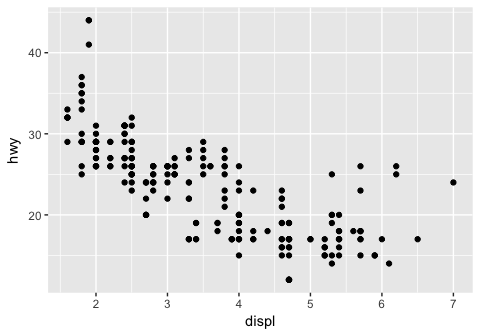

R for Data Science Walkthrough Chapters 4-8
================
Erick Lu

-   [Chapter 4](#chapter-4)
    -   [4.4 Practice](#practice)
-   [Chapter 5](#chapter-5)
    -   [5.2 Filter rows with filter()](#filter-rows-with-filter)
    -   [5.2.1 Comparisons](#comparisons)
    -   [5.2.2 Logical Operators](#logical-operators)
    -   [5.2.3 Missing values](#missing-values)
    -   [5.2.4 Exercises](#exercises)
    -   [5.3 Arrange rows with arrange()](#arrange-rows-with-arrange)
    -   [5.3.1 Exercises](#exercises-1)
    -   [5.4 Select columns with select()](#select-columns-with-select)
    -   [5.4.1 Exercises](#exercises-2)
    -   [5.5 Add new variables with mutate()](#add-new-variables-with-mutate)
    -   [5.5.2 Exercises](#exercises-3)
    -   [5.6 Grouped summaries with summarise()](#grouped-summaries-with-summarise)
    -   [5.6.7 Exercises](#exercises-4)
    -   [5.7 Grouped mutates (and filters)](#grouped-mutates-and-filters)
    -   [5.7.1 Exercises](#exercises-5)

This my walkthrough for the book: *R for Data Science* by Hadley Wickham and Garrett Grolemund. It contains my answers to their exercises and some of my own notes and data explorations. Here I will go through chapters 4-8.

Chapter 4
=========

4.4 Practice
------------

1.  Why does this code not work?

``` r
my_variable <- 10
# my_varıable
```

The code does not work because there is a typo in the variable name that you are calling. The letter "i" is not the same in my\_var(i)able.

1.  Tweak each of the following R commands so that they run correctly:

Changed "dota" to "data", "fliter" to "filter", "=" to "==", and "diamond" to "diamonds"

``` r
library(tidyverse)
```

    ## ── Attaching packages ──────────────────────────────────────────────────────────────────────────────────────────────────────────────── tidyverse 1.2.1 ──

    ## ✔ ggplot2 2.2.1     ✔ purrr   0.2.4
    ## ✔ tibble  1.4.2     ✔ dplyr   0.7.4
    ## ✔ tidyr   0.8.0     ✔ stringr 1.3.0
    ## ✔ readr   1.1.1     ✔ forcats 0.3.0

    ## Warning: package 'ggplot2' was built under R version 3.3.2

    ## Warning: package 'readr' was built under R version 3.3.2

    ## Warning: package 'purrr' was built under R version 3.3.2

    ## Warning: package 'dplyr' was built under R version 3.3.2

    ## ── Conflicts ─────────────────────────────────────────────────────────────────────────────────────────────────────────────────── tidyverse_conflicts() ──
    ## ✖ dplyr::filter() masks stats::filter()
    ## ✖ dplyr::lag()    masks stats::lag()

``` r
ggplot(data = mpg) + 
  geom_point(mapping = aes(x = displ, y = hwy))
```



``` r
filter(mpg, cyl == 8)
```

    ## Warning: package 'bindrcpp' was built under R version 3.3.2

    ## # A tibble: 70 x 11
    ##    manufacturer model     displ  year   cyl trans  drv     cty   hwy fl   
    ##    <chr>        <chr>     <dbl> <int> <int> <chr>  <chr> <int> <int> <chr>
    ##  1 audi         a6 quatt…  4.20  2008     8 auto(… 4        16    23 p    
    ##  2 chevrolet    c1500 su…  5.30  2008     8 auto(… r        14    20 r    
    ##  3 chevrolet    c1500 su…  5.30  2008     8 auto(… r        11    15 e    
    ##  4 chevrolet    c1500 su…  5.30  2008     8 auto(… r        14    20 r    
    ##  5 chevrolet    c1500 su…  5.70  1999     8 auto(… r        13    17 r    
    ##  6 chevrolet    c1500 su…  6.00  2008     8 auto(… r        12    17 r    
    ##  7 chevrolet    corvette   5.70  1999     8 manua… r        16    26 p    
    ##  8 chevrolet    corvette   5.70  1999     8 auto(… r        15    23 p    
    ##  9 chevrolet    corvette   6.20  2008     8 manua… r        16    26 p    
    ## 10 chevrolet    corvette   6.20  2008     8 auto(… r        15    25 p    
    ## # ... with 60 more rows, and 1 more variable: class <chr>

``` r
filter(diamonds, carat > 3)
```

    ## # A tibble: 32 x 10
    ##    carat cut     color clarity depth table price     x     y     z
    ##    <dbl> <ord>   <ord> <ord>   <dbl> <dbl> <int> <dbl> <dbl> <dbl>
    ##  1  3.01 Premium I     I1       62.7   58.  8040  9.10  8.97  5.67
    ##  2  3.11 Fair    J     I1       65.9   57.  9823  9.15  9.02  5.98
    ##  3  3.01 Premium F     I1       62.2   56.  9925  9.24  9.13  5.73
    ##  4  3.05 Premium E     I1       60.9   58. 10453  9.26  9.25  5.66
    ##  5  3.02 Fair    I     I1       65.2   56. 10577  9.11  9.02  5.91
    ##  6  3.01 Fair    H     I1       56.1   62. 10761  9.54  9.38  5.31
    ##  7  3.65 Fair    H     I1       67.1   53. 11668  9.53  9.48  6.38
    ##  8  3.24 Premium H     I1       62.1   58. 12300  9.44  9.40  5.85
    ##  9  3.22 Ideal   I     I1       62.6   55. 12545  9.49  9.42  5.92
    ## 10  3.50 Ideal   H     I1       62.8   57. 12587  9.65  9.59  6.03
    ## # ... with 22 more rows

1.  Press Alt + Shift + K. What happens? How can you get to the same place using the menus?

This opens up a list of the keyboard shortcuts! Very useful. Using the menus, either type "shorcut" into the search bar under help, or find it under: tools: keyboard shortcuts help.

Chapter 5
=========

The data that we will work with in chapter 5 is from the nycflights13 package.

``` r
library(tidyverse)
library(nycflights13)
```

    ## Warning: package 'nycflights13' was built under R version 3.3.2

``` r
flights
```

    ## # A tibble: 336,776 x 19
    ##     year month   day dep_time sched_dep_time dep_delay arr_time
    ##    <int> <int> <int>    <int>          <int>     <dbl>    <int>
    ##  1  2013     1     1      517            515        2.      830
    ##  2  2013     1     1      533            529        4.      850
    ##  3  2013     1     1      542            540        2.      923
    ##  4  2013     1     1      544            545       -1.     1004
    ##  5  2013     1     1      554            600       -6.      812
    ##  6  2013     1     1      554            558       -4.      740
    ##  7  2013     1     1      555            600       -5.      913
    ##  8  2013     1     1      557            600       -3.      709
    ##  9  2013     1     1      557            600       -3.      838
    ## 10  2013     1     1      558            600       -2.      753
    ## # ... with 336,766 more rows, and 12 more variables: sched_arr_time <int>,
    ## #   arr_delay <dbl>, carrier <chr>, flight <int>, tailnum <chr>,
    ## #   origin <chr>, dest <chr>, air_time <dbl>, distance <dbl>, hour <dbl>,
    ## #   minute <dbl>, time_hour <dttm>

5.2 Filter rows with filter()
-----------------------------

filter() will subset obervations based on their values. I think it works a lot like the which() function in base R (ie: data\[which(data$variable &gt; value),\] ). Below is a way to do the same thing using either filter() or base R which().

``` r
# tidyverse filter() output
filter(flights, month == 1, day == 1)
```

    ## # A tibble: 842 x 19
    ##     year month   day dep_time sched_dep_time dep_delay arr_time
    ##    <int> <int> <int>    <int>          <int>     <dbl>    <int>
    ##  1  2013     1     1      517            515        2.      830
    ##  2  2013     1     1      533            529        4.      850
    ##  3  2013     1     1      542            540        2.      923
    ##  4  2013     1     1      544            545       -1.     1004
    ##  5  2013     1     1      554            600       -6.      812
    ##  6  2013     1     1      554            558       -4.      740
    ##  7  2013     1     1      555            600       -5.      913
    ##  8  2013     1     1      557            600       -3.      709
    ##  9  2013     1     1      557            600       -3.      838
    ## 10  2013     1     1      558            600       -2.      753
    ## # ... with 832 more rows, and 12 more variables: sched_arr_time <int>,
    ## #   arr_delay <dbl>, carrier <chr>, flight <int>, tailnum <chr>,
    ## #   origin <chr>, dest <chr>, air_time <dbl>, distance <dbl>, hour <dbl>,
    ## #   minute <dbl>, time_hour <dttm>

``` r
# base R way to get the same output
flights[which(flights$month ==1 & flights$day ==1),]
```

    ## # A tibble: 842 x 19
    ##     year month   day dep_time sched_dep_time dep_delay arr_time
    ##    <int> <int> <int>    <int>          <int>     <dbl>    <int>
    ##  1  2013     1     1      517            515        2.      830
    ##  2  2013     1     1      533            529        4.      850
    ##  3  2013     1     1      542            540        2.      923
    ##  4  2013     1     1      544            545       -1.     1004
    ##  5  2013     1     1      554            600       -6.      812
    ##  6  2013     1     1      554            558       -4.      740
    ##  7  2013     1     1      555            600       -5.      913
    ##  8  2013     1     1      557            600       -3.      709
    ##  9  2013     1     1      557            600       -3.      838
    ## 10  2013     1     1      558            600       -2.      753
    ## # ... with 832 more rows, and 12 more variables: sched_arr_time <int>,
    ## #   arr_delay <dbl>, carrier <chr>, flight <int>, tailnum <chr>,
    ## #   origin <chr>, dest <chr>, air_time <dbl>, distance <dbl>, hour <dbl>,
    ## #   minute <dbl>, time_hour <dttm>

5.2.1 Comparisons
-----------------

A safer way for comparing two numeric vectors is the near() function in dplyr. For example, if running this comparison:

``` r
sqrt(2) ^ 2 == 2
```

    ## [1] FALSE

``` r
1/49 * 49 == 1
```

    ## [1] FALSE

We see that what we would normally regard as true is specified as FALSE in R, due to floating point precision issues. The near() function will allow more tolerance.

``` r
near(sqrt(2) ^ 2,  2)
```

    ## [1] TRUE

``` r
near(1 / 49 * 49, 1)
```

    ## [1] TRUE

5.2.2 Logical Operators
-----------------------

There are many ways to combine "and", `&`, "or", `|`, and "not",`!` to filter out observations in a data table.

``` r
#following two filter functions give same output
filter(flights, month == 11 | month == 12)
```

    ## # A tibble: 55,403 x 19
    ##     year month   day dep_time sched_dep_time dep_delay arr_time
    ##    <int> <int> <int>    <int>          <int>     <dbl>    <int>
    ##  1  2013    11     1        5           2359        6.      352
    ##  2  2013    11     1       35           2250      105.      123
    ##  3  2013    11     1      455            500       -5.      641
    ##  4  2013    11     1      539            545       -6.      856
    ##  5  2013    11     1      542            545       -3.      831
    ##  6  2013    11     1      549            600      -11.      912
    ##  7  2013    11     1      550            600      -10.      705
    ##  8  2013    11     1      554            600       -6.      659
    ##  9  2013    11     1      554            600       -6.      826
    ## 10  2013    11     1      554            600       -6.      749
    ## # ... with 55,393 more rows, and 12 more variables: sched_arr_time <int>,
    ## #   arr_delay <dbl>, carrier <chr>, flight <int>, tailnum <chr>,
    ## #   origin <chr>, dest <chr>, air_time <dbl>, distance <dbl>, hour <dbl>,
    ## #   minute <dbl>, time_hour <dttm>

``` r
filter(flights, month %in% c(11,12))
```

    ## # A tibble: 55,403 x 19
    ##     year month   day dep_time sched_dep_time dep_delay arr_time
    ##    <int> <int> <int>    <int>          <int>     <dbl>    <int>
    ##  1  2013    11     1        5           2359        6.      352
    ##  2  2013    11     1       35           2250      105.      123
    ##  3  2013    11     1      455            500       -5.      641
    ##  4  2013    11     1      539            545       -6.      856
    ##  5  2013    11     1      542            545       -3.      831
    ##  6  2013    11     1      549            600      -11.      912
    ##  7  2013    11     1      550            600      -10.      705
    ##  8  2013    11     1      554            600       -6.      659
    ##  9  2013    11     1      554            600       -6.      826
    ## 10  2013    11     1      554            600       -6.      749
    ## # ... with 55,393 more rows, and 12 more variables: sched_arr_time <int>,
    ## #   arr_delay <dbl>, carrier <chr>, flight <int>, tailnum <chr>,
    ## #   origin <chr>, dest <chr>, air_time <dbl>, distance <dbl>, hour <dbl>,
    ## #   minute <dbl>, time_hour <dttm>

``` r
#following two filter functions give same output
filter(flights, !(arr_delay > 120 | dep_delay > 120))
```

    ## # A tibble: 316,050 x 19
    ##     year month   day dep_time sched_dep_time dep_delay arr_time
    ##    <int> <int> <int>    <int>          <int>     <dbl>    <int>
    ##  1  2013     1     1      517            515        2.      830
    ##  2  2013     1     1      533            529        4.      850
    ##  3  2013     1     1      542            540        2.      923
    ##  4  2013     1     1      544            545       -1.     1004
    ##  5  2013     1     1      554            600       -6.      812
    ##  6  2013     1     1      554            558       -4.      740
    ##  7  2013     1     1      555            600       -5.      913
    ##  8  2013     1     1      557            600       -3.      709
    ##  9  2013     1     1      557            600       -3.      838
    ## 10  2013     1     1      558            600       -2.      753
    ## # ... with 316,040 more rows, and 12 more variables: sched_arr_time <int>,
    ## #   arr_delay <dbl>, carrier <chr>, flight <int>, tailnum <chr>,
    ## #   origin <chr>, dest <chr>, air_time <dbl>, distance <dbl>, hour <dbl>,
    ## #   minute <dbl>, time_hour <dttm>

``` r
filter(flights, arr_delay <= 120 & !dep_delay > 120)
```

    ## # A tibble: 316,050 x 19
    ##     year month   day dep_time sched_dep_time dep_delay arr_time
    ##    <int> <int> <int>    <int>          <int>     <dbl>    <int>
    ##  1  2013     1     1      517            515        2.      830
    ##  2  2013     1     1      533            529        4.      850
    ##  3  2013     1     1      542            540        2.      923
    ##  4  2013     1     1      544            545       -1.     1004
    ##  5  2013     1     1      554            600       -6.      812
    ##  6  2013     1     1      554            558       -4.      740
    ##  7  2013     1     1      555            600       -5.      913
    ##  8  2013     1     1      557            600       -3.      709
    ##  9  2013     1     1      557            600       -3.      838
    ## 10  2013     1     1      558            600       -2.      753
    ## # ... with 316,040 more rows, and 12 more variables: sched_arr_time <int>,
    ## #   arr_delay <dbl>, carrier <chr>, flight <int>, tailnum <chr>,
    ## #   origin <chr>, dest <chr>, air_time <dbl>, distance <dbl>, hour <dbl>,
    ## #   minute <dbl>, time_hour <dttm>

5.2.3 Missing values
--------------------

Missing values are represented as NA. NA values are "contagious," meaning that any operation or comparison with NA will also return NA. If a data frame contains NA values, they will not be returned by filter() unless specifically asked for, using is.na()

``` r
df <- tibble(x = c(1, NA, 3))
filter(df, x > 1)
```

    ## # A tibble: 1 x 1
    ##       x
    ##   <dbl>
    ## 1    3.

``` r
#> # A tibble: 1 × 1
#>       x
#>   <dbl>
#> 1     3
filter(df, is.na(x) | x > 1)
```

    ## # A tibble: 2 x 1
    ##       x
    ##   <dbl>
    ## 1   NA 
    ## 2    3.

5.2.4 Exercises
---------------

1.  Find all flights that

-   Had an arrival delay of two or more hours

``` r
# arr_delay is in minutes, so 120 for two hours
filter(flights, arr_delay >= 120)
```

    ## # A tibble: 10,200 x 19
    ##     year month   day dep_time sched_dep_time dep_delay arr_time
    ##    <int> <int> <int>    <int>          <int>     <dbl>    <int>
    ##  1  2013     1     1      811            630      101.     1047
    ##  2  2013     1     1      848           1835      853.     1001
    ##  3  2013     1     1      957            733      144.     1056
    ##  4  2013     1     1     1114            900      134.     1447
    ##  5  2013     1     1     1505           1310      115.     1638
    ##  6  2013     1     1     1525           1340      105.     1831
    ##  7  2013     1     1     1549           1445       64.     1912
    ##  8  2013     1     1     1558           1359      119.     1718
    ##  9  2013     1     1     1732           1630       62.     2028
    ## 10  2013     1     1     1803           1620      103.     2008
    ## # ... with 10,190 more rows, and 12 more variables: sched_arr_time <int>,
    ## #   arr_delay <dbl>, carrier <chr>, flight <int>, tailnum <chr>,
    ## #   origin <chr>, dest <chr>, air_time <dbl>, distance <dbl>, hour <dbl>,
    ## #   minute <dbl>, time_hour <dttm>

-   Flew to Houston (IAH or HOU)

``` r
filter(flights, dest == "IAH" | dest == "HOU")
```

    ## # A tibble: 9,313 x 19
    ##     year month   day dep_time sched_dep_time dep_delay arr_time
    ##    <int> <int> <int>    <int>          <int>     <dbl>    <int>
    ##  1  2013     1     1      517            515        2.      830
    ##  2  2013     1     1      533            529        4.      850
    ##  3  2013     1     1      623            627       -4.      933
    ##  4  2013     1     1      728            732       -4.     1041
    ##  5  2013     1     1      739            739        0.     1104
    ##  6  2013     1     1      908            908        0.     1228
    ##  7  2013     1     1     1028           1026        2.     1350
    ##  8  2013     1     1     1044           1045       -1.     1352
    ##  9  2013     1     1     1114            900      134.     1447
    ## 10  2013     1     1     1205           1200        5.     1503
    ## # ... with 9,303 more rows, and 12 more variables: sched_arr_time <int>,
    ## #   arr_delay <dbl>, carrier <chr>, flight <int>, tailnum <chr>,
    ## #   origin <chr>, dest <chr>, air_time <dbl>, distance <dbl>, hour <dbl>,
    ## #   minute <dbl>, time_hour <dttm>

-   Were operated by United, American, or Delta

``` r
#find all unique carriers:
unique(flights$carrier)
```

    ##  [1] "UA" "AA" "B6" "DL" "EV" "MQ" "US" "WN" "VX" "FL" "AS" "9E" "F9" "HA"
    ## [15] "YV" "OO"

``` r
#Symbol for United = UA, American = AA, Delta = DL
filter (flights, carrier %in% c("UA", "AA","DL"))
```

    ## # A tibble: 139,504 x 19
    ##     year month   day dep_time sched_dep_time dep_delay arr_time
    ##    <int> <int> <int>    <int>          <int>     <dbl>    <int>
    ##  1  2013     1     1      517            515        2.      830
    ##  2  2013     1     1      533            529        4.      850
    ##  3  2013     1     1      542            540        2.      923
    ##  4  2013     1     1      554            600       -6.      812
    ##  5  2013     1     1      554            558       -4.      740
    ##  6  2013     1     1      558            600       -2.      753
    ##  7  2013     1     1      558            600       -2.      924
    ##  8  2013     1     1      558            600       -2.      923
    ##  9  2013     1     1      559            600       -1.      941
    ## 10  2013     1     1      559            600       -1.      854
    ## # ... with 139,494 more rows, and 12 more variables: sched_arr_time <int>,
    ## #   arr_delay <dbl>, carrier <chr>, flight <int>, tailnum <chr>,
    ## #   origin <chr>, dest <chr>, air_time <dbl>, distance <dbl>, hour <dbl>,
    ## #   minute <dbl>, time_hour <dttm>

-   Departed in summer (July, August, and September)

``` r
filter (flights, month >= 7 & month <=9)
```

    ## # A tibble: 86,326 x 19
    ##     year month   day dep_time sched_dep_time dep_delay arr_time
    ##    <int> <int> <int>    <int>          <int>     <dbl>    <int>
    ##  1  2013     7     1        1           2029      212.      236
    ##  2  2013     7     1        2           2359        3.      344
    ##  3  2013     7     1       29           2245      104.      151
    ##  4  2013     7     1       43           2130      193.      322
    ##  5  2013     7     1       44           2150      174.      300
    ##  6  2013     7     1       46           2051      235.      304
    ##  7  2013     7     1       48           2001      287.      308
    ##  8  2013     7     1       58           2155      183.      335
    ##  9  2013     7     1      100           2146      194.      327
    ## 10  2013     7     1      100           2245      135.      337
    ## # ... with 86,316 more rows, and 12 more variables: sched_arr_time <int>,
    ## #   arr_delay <dbl>, carrier <chr>, flight <int>, tailnum <chr>,
    ## #   origin <chr>, dest <chr>, air_time <dbl>, distance <dbl>, hour <dbl>,
    ## #   minute <dbl>, time_hour <dttm>

``` r
# test whether the output only has months 7 8 9 to check our work.
unique(filter (flights, month >= 7 & month <=9)$month)
```

    ## [1] 7 8 9

-   Arrived more than two hours late, but didn’t leave late

``` r
filter (flights, arr_delay > 120, dep_delay <=0)
```

    ## # A tibble: 29 x 19
    ##     year month   day dep_time sched_dep_time dep_delay arr_time
    ##    <int> <int> <int>    <int>          <int>     <dbl>    <int>
    ##  1  2013     1    27     1419           1420       -1.     1754
    ##  2  2013    10     7     1350           1350        0.     1736
    ##  3  2013    10     7     1357           1359       -2.     1858
    ##  4  2013    10    16      657            700       -3.     1258
    ##  5  2013    11     1      658            700       -2.     1329
    ##  6  2013     3    18     1844           1847       -3.       39
    ##  7  2013     4    17     1635           1640       -5.     2049
    ##  8  2013     4    18      558            600       -2.     1149
    ##  9  2013     4    18      655            700       -5.     1213
    ## 10  2013     5    22     1827           1830       -3.     2217
    ## # ... with 19 more rows, and 12 more variables: sched_arr_time <int>,
    ## #   arr_delay <dbl>, carrier <chr>, flight <int>, tailnum <chr>,
    ## #   origin <chr>, dest <chr>, air_time <dbl>, distance <dbl>, hour <dbl>,
    ## #   minute <dbl>, time_hour <dttm>

``` r
#looks like combining the two arguments into one does the same thing.
filter(flights, arr_delay > 120 & dep_delay <=0)
```

    ## # A tibble: 29 x 19
    ##     year month   day dep_time sched_dep_time dep_delay arr_time
    ##    <int> <int> <int>    <int>          <int>     <dbl>    <int>
    ##  1  2013     1    27     1419           1420       -1.     1754
    ##  2  2013    10     7     1350           1350        0.     1736
    ##  3  2013    10     7     1357           1359       -2.     1858
    ##  4  2013    10    16      657            700       -3.     1258
    ##  5  2013    11     1      658            700       -2.     1329
    ##  6  2013     3    18     1844           1847       -3.       39
    ##  7  2013     4    17     1635           1640       -5.     2049
    ##  8  2013     4    18      558            600       -2.     1149
    ##  9  2013     4    18      655            700       -5.     1213
    ## 10  2013     5    22     1827           1830       -3.     2217
    ## # ... with 19 more rows, and 12 more variables: sched_arr_time <int>,
    ## #   arr_delay <dbl>, carrier <chr>, flight <int>, tailnum <chr>,
    ## #   origin <chr>, dest <chr>, air_time <dbl>, distance <dbl>, hour <dbl>,
    ## #   minute <dbl>, time_hour <dttm>

-   Were delayed by at least an hour, but made up over 30 minutes in flight

``` r
# if delayed 60 minutes but made up at least 30, expect arr_delay to be less than 60-30 = 30 min
filter (flights, dep_delay >= 60, arr_delay < 30)
```

    ## # A tibble: 206 x 19
    ##     year month   day dep_time sched_dep_time dep_delay arr_time
    ##    <int> <int> <int>    <int>          <int>     <dbl>    <int>
    ##  1  2013     1     3     1850           1745       65.     2148
    ##  2  2013     1     3     1950           1845       65.     2228
    ##  3  2013     1     3     2015           1915       60.     2135
    ##  4  2013     1     6     1019            900       79.     1558
    ##  5  2013     1     7     1543           1430       73.     1758
    ##  6  2013     1    11     1020            920       60.     1311
    ##  7  2013     1    12     1706           1600       66.     1949
    ##  8  2013     1    12     1953           1845       68.     2154
    ##  9  2013     1    19     1456           1355       61.     1636
    ## 10  2013     1    21     1531           1430       61.     1843
    ## # ... with 196 more rows, and 12 more variables: sched_arr_time <int>,
    ## #   arr_delay <dbl>, carrier <chr>, flight <int>, tailnum <chr>,
    ## #   origin <chr>, dest <chr>, air_time <dbl>, distance <dbl>, hour <dbl>,
    ## #   minute <dbl>, time_hour <dttm>

-   Departed between midnight and 6am (inclusive)

``` r
times <- filter (flights, dep_time >= 0 & dep_time <= 600)
times
```

    ## # A tibble: 9,344 x 19
    ##     year month   day dep_time sched_dep_time dep_delay arr_time
    ##    <int> <int> <int>    <int>          <int>     <dbl>    <int>
    ##  1  2013     1     1      517            515        2.      830
    ##  2  2013     1     1      533            529        4.      850
    ##  3  2013     1     1      542            540        2.      923
    ##  4  2013     1     1      544            545       -1.     1004
    ##  5  2013     1     1      554            600       -6.      812
    ##  6  2013     1     1      554            558       -4.      740
    ##  7  2013     1     1      555            600       -5.      913
    ##  8  2013     1     1      557            600       -3.      709
    ##  9  2013     1     1      557            600       -3.      838
    ## 10  2013     1     1      558            600       -2.      753
    ## # ... with 9,334 more rows, and 12 more variables: sched_arr_time <int>,
    ## #   arr_delay <dbl>, carrier <chr>, flight <int>, tailnum <chr>,
    ## #   origin <chr>, dest <chr>, air_time <dbl>, distance <dbl>, hour <dbl>,
    ## #   minute <dbl>, time_hour <dttm>

``` r
#check if it worked
range(times$dep_time)
```

    ## [1]   1 600

-   Another useful dplyr filtering helper is between(). What does it do? Can you use it to simplify the code needed to answer the previous challenges?

?between() states that this is a shortcut to perform the same function as `x >= left & x <= right`, for `between(x, left, right)`. I will use between() to produce the same result as in the previous bullet point for flights departing between midnight and 6am.

``` r
filter(flights, between(dep_time, 0, 600))
```

    ## # A tibble: 9,344 x 19
    ##     year month   day dep_time sched_dep_time dep_delay arr_time
    ##    <int> <int> <int>    <int>          <int>     <dbl>    <int>
    ##  1  2013     1     1      517            515        2.      830
    ##  2  2013     1     1      533            529        4.      850
    ##  3  2013     1     1      542            540        2.      923
    ##  4  2013     1     1      544            545       -1.     1004
    ##  5  2013     1     1      554            600       -6.      812
    ##  6  2013     1     1      554            558       -4.      740
    ##  7  2013     1     1      555            600       -5.      913
    ##  8  2013     1     1      557            600       -3.      709
    ##  9  2013     1     1      557            600       -3.      838
    ## 10  2013     1     1      558            600       -2.      753
    ## # ... with 9,334 more rows, and 12 more variables: sched_arr_time <int>,
    ## #   arr_delay <dbl>, carrier <chr>, flight <int>, tailnum <chr>,
    ## #   origin <chr>, dest <chr>, air_time <dbl>, distance <dbl>, hour <dbl>,
    ## #   minute <dbl>, time_hour <dttm>

1.  How many flights have a missing dep\_time? What other variables are missing? What might these rows represent?

``` r
filter(flights, is.na(dep_time))
```

    ## # A tibble: 8,255 x 19
    ##     year month   day dep_time sched_dep_time dep_delay arr_time
    ##    <int> <int> <int>    <int>          <int>     <dbl>    <int>
    ##  1  2013     1     1       NA           1630        NA       NA
    ##  2  2013     1     1       NA           1935        NA       NA
    ##  3  2013     1     1       NA           1500        NA       NA
    ##  4  2013     1     1       NA            600        NA       NA
    ##  5  2013     1     2       NA           1540        NA       NA
    ##  6  2013     1     2       NA           1620        NA       NA
    ##  7  2013     1     2       NA           1355        NA       NA
    ##  8  2013     1     2       NA           1420        NA       NA
    ##  9  2013     1     2       NA           1321        NA       NA
    ## 10  2013     1     2       NA           1545        NA       NA
    ## # ... with 8,245 more rows, and 12 more variables: sched_arr_time <int>,
    ## #   arr_delay <dbl>, carrier <chr>, flight <int>, tailnum <chr>,
    ## #   origin <chr>, dest <chr>, air_time <dbl>, distance <dbl>, hour <dbl>,
    ## #   minute <dbl>, time_hour <dttm>

The flights with missing dep\_time also have missing arr\_time and air\_time, suggesting that these were cancelled flights.

1.  Why is NA ^ 0 not missing? Why is NA | TRUE not missing? Why is FALSE & NA not missing? Can you figure out the general rule? (NA \* 0 is a tricky counterexample!)

Since NA represents an unknown value, it still obeys certain rules as if it were a known value. Since any number to the power of 0 is 1, NA^0 returns the value 1, which will make the code `filter(flights, dep_time == NA^0)` return all the flights that departed at time 0001. NA | TRUE is an expression that evaluates to TRUE, because the logical operator will evaluate whether either side has a TRUE value. This would return all the data points in the data frame. FALSE & NA returns FALSE based on the same premise as the previous item. Since FALSE exists on either side of the & logical operator, it is evaluated as FALSE. The general (but not concrete) rule is that modifying NA with a logical operator in the form `NA <operator> value` will evaluate to either TRUE or FALSE, returning not missing values, and that NA will still abide by certain rules that any value would abide by. NA\*0, however, is an exception beacuse this still evaluates to NA, whereas other values would evaluate to 0.

``` r
NA^0
```

    ## [1] 1

``` r
NA | TRUE
```

    ## [1] TRUE

``` r
FALSE & NA
```

    ## [1] FALSE

``` r
NA*0
```

    ## [1] NA

``` r
filter(flights, dep_time == NA^0)
```

    ## # A tibble: 25 x 19
    ##     year month   day dep_time sched_dep_time dep_delay arr_time
    ##    <int> <int> <int>    <int>          <int>     <dbl>    <int>
    ##  1  2013     1    13        1           2249       72.      108
    ##  2  2013     1    31        1           2100      181.      124
    ##  3  2013    11    13        1           2359        2.      442
    ##  4  2013    12    16        1           2359        2.      447
    ##  5  2013    12    20        1           2359        2.      430
    ##  6  2013    12    26        1           2359        2.      437
    ##  7  2013    12    30        1           2359        2.      441
    ##  8  2013     2    11        1           2100      181.      111
    ##  9  2013     2    24        1           2245       76.      121
    ## 10  2013     3     8        1           2355        6.      431
    ## # ... with 15 more rows, and 12 more variables: sched_arr_time <int>,
    ## #   arr_delay <dbl>, carrier <chr>, flight <int>, tailnum <chr>,
    ## #   origin <chr>, dest <chr>, air_time <dbl>, distance <dbl>, hour <dbl>,
    ## #   minute <dbl>, time_hour <dttm>

``` r
filter(flights, dep_time == NA | TRUE)
```

    ## # A tibble: 336,776 x 19
    ##     year month   day dep_time sched_dep_time dep_delay arr_time
    ##    <int> <int> <int>    <int>          <int>     <dbl>    <int>
    ##  1  2013     1     1      517            515        2.      830
    ##  2  2013     1     1      533            529        4.      850
    ##  3  2013     1     1      542            540        2.      923
    ##  4  2013     1     1      544            545       -1.     1004
    ##  5  2013     1     1      554            600       -6.      812
    ##  6  2013     1     1      554            558       -4.      740
    ##  7  2013     1     1      555            600       -5.      913
    ##  8  2013     1     1      557            600       -3.      709
    ##  9  2013     1     1      557            600       -3.      838
    ## 10  2013     1     1      558            600       -2.      753
    ## # ... with 336,766 more rows, and 12 more variables: sched_arr_time <int>,
    ## #   arr_delay <dbl>, carrier <chr>, flight <int>, tailnum <chr>,
    ## #   origin <chr>, dest <chr>, air_time <dbl>, distance <dbl>, hour <dbl>,
    ## #   minute <dbl>, time_hour <dttm>

5.3 Arrange rows with arrange()
-------------------------------

arrange() will return a data frame with the observations sorted by the variable you specify. It functions similarly to the order() function in base R. Below are two ways to get the same sorted dataframe using arrange() and order(). You can see that arrange() makes things a little simpler to read. For the base R order() function, it will only return a sorted list of values, so you have to pass them into the flights\[\] frame to obtain all the values for the sorted data.

``` r
# using arrange()
arrange(flights, desc(arr_delay))
```

    ## # A tibble: 336,776 x 19
    ##     year month   day dep_time sched_dep_time dep_delay arr_time
    ##    <int> <int> <int>    <int>          <int>     <dbl>    <int>
    ##  1  2013     1     9      641            900     1301.     1242
    ##  2  2013     6    15     1432           1935     1137.     1607
    ##  3  2013     1    10     1121           1635     1126.     1239
    ##  4  2013     9    20     1139           1845     1014.     1457
    ##  5  2013     7    22      845           1600     1005.     1044
    ##  6  2013     4    10     1100           1900      960.     1342
    ##  7  2013     3    17     2321            810      911.      135
    ##  8  2013     7    22     2257            759      898.      121
    ##  9  2013    12     5      756           1700      896.     1058
    ## 10  2013     5     3     1133           2055      878.     1250
    ## # ... with 336,766 more rows, and 12 more variables: sched_arr_time <int>,
    ## #   arr_delay <dbl>, carrier <chr>, flight <int>, tailnum <chr>,
    ## #   origin <chr>, dest <chr>, air_time <dbl>, distance <dbl>, hour <dbl>,
    ## #   minute <dbl>, time_hour <dttm>

``` r
# using base R order()
flights[order(flights$arr_delay, decreasing = T),]
```

    ## # A tibble: 336,776 x 19
    ##     year month   day dep_time sched_dep_time dep_delay arr_time
    ##    <int> <int> <int>    <int>          <int>     <dbl>    <int>
    ##  1  2013     1     9      641            900     1301.     1242
    ##  2  2013     6    15     1432           1935     1137.     1607
    ##  3  2013     1    10     1121           1635     1126.     1239
    ##  4  2013     9    20     1139           1845     1014.     1457
    ##  5  2013     7    22      845           1600     1005.     1044
    ##  6  2013     4    10     1100           1900      960.     1342
    ##  7  2013     3    17     2321            810      911.      135
    ##  8  2013     7    22     2257            759      898.      121
    ##  9  2013    12     5      756           1700      896.     1058
    ## 10  2013     5     3     1133           2055      878.     1250
    ## # ... with 336,766 more rows, and 12 more variables: sched_arr_time <int>,
    ## #   arr_delay <dbl>, carrier <chr>, flight <int>, tailnum <chr>,
    ## #   origin <chr>, dest <chr>, air_time <dbl>, distance <dbl>, hour <dbl>,
    ## #   minute <dbl>, time_hour <dttm>

Missing values (NA) are placed at the end for arrange()

``` r
df <- tibble(x = c(5, 2, NA))
arrange(df, x)
```

    ## # A tibble: 3 x 1
    ##       x
    ##   <dbl>
    ## 1    2.
    ## 2    5.
    ## 3   NA

``` r
arrange(df, desc(x))
```

    ## # A tibble: 3 x 1
    ##       x
    ##   <dbl>
    ## 1    5.
    ## 2    2.
    ## 3   NA

5.3.1 Exercises
---------------

1.  How could you use arrange() to sort all missing values to the start? (Hint: use is.na()).

``` r
arrange(flights, desc(is.na(dep_time)))
```

    ## # A tibble: 336,776 x 19
    ##     year month   day dep_time sched_dep_time dep_delay arr_time
    ##    <int> <int> <int>    <int>          <int>     <dbl>    <int>
    ##  1  2013     1     1       NA           1630        NA       NA
    ##  2  2013     1     1       NA           1935        NA       NA
    ##  3  2013     1     1       NA           1500        NA       NA
    ##  4  2013     1     1       NA            600        NA       NA
    ##  5  2013     1     2       NA           1540        NA       NA
    ##  6  2013     1     2       NA           1620        NA       NA
    ##  7  2013     1     2       NA           1355        NA       NA
    ##  8  2013     1     2       NA           1420        NA       NA
    ##  9  2013     1     2       NA           1321        NA       NA
    ## 10  2013     1     2       NA           1545        NA       NA
    ## # ... with 336,766 more rows, and 12 more variables: sched_arr_time <int>,
    ## #   arr_delay <dbl>, carrier <chr>, flight <int>, tailnum <chr>,
    ## #   origin <chr>, dest <chr>, air_time <dbl>, distance <dbl>, hour <dbl>,
    ## #   minute <dbl>, time_hour <dttm>

1.  Sort flights to find the most delayed flights. Find the flights that left earliest.

``` r
# most delayed flights
arrange(flights, desc(dep_delay))
```

    ## # A tibble: 336,776 x 19
    ##     year month   day dep_time sched_dep_time dep_delay arr_time
    ##    <int> <int> <int>    <int>          <int>     <dbl>    <int>
    ##  1  2013     1     9      641            900     1301.     1242
    ##  2  2013     6    15     1432           1935     1137.     1607
    ##  3  2013     1    10     1121           1635     1126.     1239
    ##  4  2013     9    20     1139           1845     1014.     1457
    ##  5  2013     7    22      845           1600     1005.     1044
    ##  6  2013     4    10     1100           1900      960.     1342
    ##  7  2013     3    17     2321            810      911.      135
    ##  8  2013     6    27      959           1900      899.     1236
    ##  9  2013     7    22     2257            759      898.      121
    ## 10  2013    12     5      756           1700      896.     1058
    ## # ... with 336,766 more rows, and 12 more variables: sched_arr_time <int>,
    ## #   arr_delay <dbl>, carrier <chr>, flight <int>, tailnum <chr>,
    ## #   origin <chr>, dest <chr>, air_time <dbl>, distance <dbl>, hour <dbl>,
    ## #   minute <dbl>, time_hour <dttm>

``` r
# flights that left earliest (least amount of delay)
arrange(flights, dep_delay)
```

    ## # A tibble: 336,776 x 19
    ##     year month   day dep_time sched_dep_time dep_delay arr_time
    ##    <int> <int> <int>    <int>          <int>     <dbl>    <int>
    ##  1  2013    12     7     2040           2123      -43.       40
    ##  2  2013     2     3     2022           2055      -33.     2240
    ##  3  2013    11    10     1408           1440      -32.     1549
    ##  4  2013     1    11     1900           1930      -30.     2233
    ##  5  2013     1    29     1703           1730      -27.     1947
    ##  6  2013     8     9      729            755      -26.     1002
    ##  7  2013    10    23     1907           1932      -25.     2143
    ##  8  2013     3    30     2030           2055      -25.     2213
    ##  9  2013     3     2     1431           1455      -24.     1601
    ## 10  2013     5     5      934            958      -24.     1225
    ## # ... with 336,766 more rows, and 12 more variables: sched_arr_time <int>,
    ## #   arr_delay <dbl>, carrier <chr>, flight <int>, tailnum <chr>,
    ## #   origin <chr>, dest <chr>, air_time <dbl>, distance <dbl>, hour <dbl>,
    ## #   minute <dbl>, time_hour <dttm>

1.  Sort flights to find the fastest flights.

``` r
# fastest flights
arrange (flights, arr_delay)
```

    ## # A tibble: 336,776 x 19
    ##     year month   day dep_time sched_dep_time dep_delay arr_time
    ##    <int> <int> <int>    <int>          <int>     <dbl>    <int>
    ##  1  2013     5     7     1715           1729      -14.     1944
    ##  2  2013     5    20      719            735      -16.      951
    ##  3  2013     5     2     1947           1949       -2.     2209
    ##  4  2013     5     6     1826           1830       -4.     2045
    ##  5  2013     5     4     1816           1820       -4.     2017
    ##  6  2013     5     2     1926           1929       -3.     2157
    ##  7  2013     5     6     1753           1755       -2.     2004
    ##  8  2013     5     7     2054           2055       -1.     2317
    ##  9  2013     5    13      657            700       -3.      908
    ## 10  2013     1     4     1026           1030       -4.     1305
    ## # ... with 336,766 more rows, and 12 more variables: sched_arr_time <int>,
    ## #   arr_delay <dbl>, carrier <chr>, flight <int>, tailnum <chr>,
    ## #   origin <chr>, dest <chr>, air_time <dbl>, distance <dbl>, hour <dbl>,
    ## #   minute <dbl>, time_hour <dttm>

``` r
# find out which airlines had the top 1,000 fastest flights
top1000_fastest <- arrange(flights,arr_delay)[1:1000,]
ggplot (top1000_fastest, aes ( x = carrier, fill = carrier))+
  geom_bar()
```


``` r
# compare total air time vs dep_delay to see if there are any trends between airlines
ggplot (top1000_fastest, aes (x = arr_delay, y = air_time))+
  geom_point( aes (color = carrier))
```


Based on the bar plot, within the top 1000 flights that landed early, AA, DL, and UA have more than other airlines. Looking at the scatterplot, it seems UA generally has medium-length flights that arrive ahead of schedule, whereas HA has very long flights that arrive ahead of schedule, and 9E has very short flights that arrive ahead of schedule.

1.  Which flights travelled the longest? Which travelled the shortest?

The shortest flights were from EWR to BDL, taking around 22 minutes. Of the top 100 shortest flights, flight number 4276 was the most frequent. The longest flights were from JFK to HNL or EWR to HNL, and lasted around 654 minutes. Of the top 100 longest flights, flight number 51 was the most frequent.

``` r
# flights that travelled the shortest
shortest <- arrange(flights, air_time)[1:100,]
shortest
```

    ## # A tibble: 100 x 19
    ##     year month   day dep_time sched_dep_time dep_delay arr_time
    ##    <int> <int> <int>    <int>          <int>     <dbl>    <int>
    ##  1  2013     1    16     1355           1315       40.     1442
    ##  2  2013     4    13      537            527       10.      622
    ##  3  2013    12     6      922            851       31.     1021
    ##  4  2013     2     3     2153           2129       24.     2247
    ##  5  2013     2     5     1303           1315      -12.     1342
    ##  6  2013     2    12     2123           2130       -7.     2211
    ##  7  2013     3     2     1450           1500      -10.     1547
    ##  8  2013     3     8     2026           1935       51.     2131
    ##  9  2013     3    18     1456           1329       87.     1533
    ## 10  2013     3    19     2226           2145       41.     2305
    ## # ... with 90 more rows, and 12 more variables: sched_arr_time <int>,
    ## #   arr_delay <dbl>, carrier <chr>, flight <int>, tailnum <chr>,
    ## #   origin <chr>, dest <chr>, air_time <dbl>, distance <dbl>, hour <dbl>,
    ## #   minute <dbl>, time_hour <dttm>

``` r
# find the most frequent flight number for top 100 shortest flights.
arrange(count(shortest, flight),desc(n))
```

    ## # A tibble: 32 x 2
    ##    flight     n
    ##     <int> <int>
    ##  1   4276    19
    ##  2   4368    12
    ##  3   3822     8
    ##  4   4155     7
    ##  5   3847     5
    ##  6   4619     5
    ##  7   4103     4
    ##  8   3825     3
    ##  9   4118     3
    ## 10   5968     3
    ## # ... with 22 more rows

``` r
# flights that travelled the longest
longest <- arrange(flights, desc(air_time))[1:100,]
longest
```

    ## # A tibble: 100 x 19
    ##     year month   day dep_time sched_dep_time dep_delay arr_time
    ##    <int> <int> <int>    <int>          <int>     <dbl>    <int>
    ##  1  2013     3    17     1337           1335        2.     1937
    ##  2  2013     2     6      853            900       -7.     1542
    ##  3  2013     3    15     1001           1000        1.     1551
    ##  4  2013     3    17     1006           1000        6.     1607
    ##  5  2013     3    16     1001           1000        1.     1544
    ##  6  2013     2     5      900            900        0.     1555
    ##  7  2013    11    12      936            930        6.     1630
    ##  8  2013     3    14      958           1000       -2.     1542
    ##  9  2013    11    20     1006           1000        6.     1639
    ## 10  2013     3    15     1342           1335        7.     1924
    ## # ... with 90 more rows, and 12 more variables: sched_arr_time <int>,
    ## #   arr_delay <dbl>, carrier <chr>, flight <int>, tailnum <chr>,
    ## #   origin <chr>, dest <chr>, air_time <dbl>, distance <dbl>, hour <dbl>,
    ## #   minute <dbl>, time_hour <dttm>

``` r
# find the most frequent flight number for top 100 shortest flights.
arrange(count(longest, flight),desc(n))
```

    ## # A tibble: 2 x 2
    ##   flight     n
    ##    <int> <int>
    ## 1     51    61
    ## 2     15    39

``` r
# get average flight time for top 100 shortest / longest flights
mean(shortest$air_time)
```

    ## [1] 22.32

``` r
mean(longest$air_time)
```

    ## [1] 654.47

5.4 Select columns with select()
--------------------------------

The select() function allows you to select a subset of columns (variables) from your data frame and return a new data frame with these selected columns. This works similarly to using indexes to pull out columns from a data frame in base R. For example, here is a way to do the same thing both ways:

``` r
# Select columns by name
select(flights, year, month, day)
```

    ## # A tibble: 336,776 x 3
    ##     year month   day
    ##    <int> <int> <int>
    ##  1  2013     1     1
    ##  2  2013     1     1
    ##  3  2013     1     1
    ##  4  2013     1     1
    ##  5  2013     1     1
    ##  6  2013     1     1
    ##  7  2013     1     1
    ##  8  2013     1     1
    ##  9  2013     1     1
    ## 10  2013     1     1
    ## # ... with 336,766 more rows

``` r
# use base R to do the same thing
flights[,c("year","month","day")]
```

    ## # A tibble: 336,776 x 3
    ##     year month   day
    ##    <int> <int> <int>
    ##  1  2013     1     1
    ##  2  2013     1     1
    ##  3  2013     1     1
    ##  4  2013     1     1
    ##  5  2013     1     1
    ##  6  2013     1     1
    ##  7  2013     1     1
    ##  8  2013     1     1
    ##  9  2013     1     1
    ## 10  2013     1     1
    ## # ... with 336,766 more rows

Select seems to be more versatile if you want to do other things quickly, like combining it with ends\_with(), starts\_with(), contains(), matches(), num\_range(), etc.

``` r
# select multiple columns using colon
select(flights, year:day)
```

    ## # A tibble: 336,776 x 3
    ##     year month   day
    ##    <int> <int> <int>
    ##  1  2013     1     1
    ##  2  2013     1     1
    ##  3  2013     1     1
    ##  4  2013     1     1
    ##  5  2013     1     1
    ##  6  2013     1     1
    ##  7  2013     1     1
    ##  8  2013     1     1
    ##  9  2013     1     1
    ## 10  2013     1     1
    ## # ... with 336,766 more rows

``` r
# select columns that end with a phrase
select(flights, ends_with("time"))
```

    ## # A tibble: 336,776 x 5
    ##    dep_time sched_dep_time arr_time sched_arr_time air_time
    ##       <int>          <int>    <int>          <int>    <dbl>
    ##  1      517            515      830            819     227.
    ##  2      533            529      850            830     227.
    ##  3      542            540      923            850     160.
    ##  4      544            545     1004           1022     183.
    ##  5      554            600      812            837     116.
    ##  6      554            558      740            728     150.
    ##  7      555            600      913            854     158.
    ##  8      557            600      709            723      53.
    ##  9      557            600      838            846     140.
    ## 10      558            600      753            745     138.
    ## # ... with 336,766 more rows

A variant of select(), rename(), can rename column variables. This seems very useful.

``` r
rename(flights, tail_num = tailnum)
```

    ## # A tibble: 336,776 x 19
    ##     year month   day dep_time sched_dep_time dep_delay arr_time
    ##    <int> <int> <int>    <int>          <int>     <dbl>    <int>
    ##  1  2013     1     1      517            515        2.      830
    ##  2  2013     1     1      533            529        4.      850
    ##  3  2013     1     1      542            540        2.      923
    ##  4  2013     1     1      544            545       -1.     1004
    ##  5  2013     1     1      554            600       -6.      812
    ##  6  2013     1     1      554            558       -4.      740
    ##  7  2013     1     1      555            600       -5.      913
    ##  8  2013     1     1      557            600       -3.      709
    ##  9  2013     1     1      557            600       -3.      838
    ## 10  2013     1     1      558            600       -2.      753
    ## # ... with 336,766 more rows, and 12 more variables: sched_arr_time <int>,
    ## #   arr_delay <dbl>, carrier <chr>, flight <int>, tail_num <chr>,
    ## #   origin <chr>, dest <chr>, air_time <dbl>, distance <dbl>, hour <dbl>,
    ## #   minute <dbl>, time_hour <dttm>

To move variables to the leftmost side using select(), use the everything() function in conjunction with the variables you are pulling out.

``` r
select(flights, carrier, flight, everything())
```

    ## # A tibble: 336,776 x 19
    ##    carrier flight  year month   day dep_time sched_dep_time dep_delay
    ##    <chr>    <int> <int> <int> <int>    <int>          <int>     <dbl>
    ##  1 UA        1545  2013     1     1      517            515        2.
    ##  2 UA        1714  2013     1     1      533            529        4.
    ##  3 AA        1141  2013     1     1      542            540        2.
    ##  4 B6         725  2013     1     1      544            545       -1.
    ##  5 DL         461  2013     1     1      554            600       -6.
    ##  6 UA        1696  2013     1     1      554            558       -4.
    ##  7 B6         507  2013     1     1      555            600       -5.
    ##  8 EV        5708  2013     1     1      557            600       -3.
    ##  9 B6          79  2013     1     1      557            600       -3.
    ## 10 AA         301  2013     1     1      558            600       -2.
    ## # ... with 336,766 more rows, and 11 more variables: arr_time <int>,
    ## #   sched_arr_time <int>, arr_delay <dbl>, tailnum <chr>, origin <chr>,
    ## #   dest <chr>, air_time <dbl>, distance <dbl>, hour <dbl>, minute <dbl>,
    ## #   time_hour <dttm>

5.4.1 Exercises
---------------

1.  Brainstorm as many ways as possible to select dep\_time, dep\_delay, arr\_time, and arr\_delay from flights.

``` r
# standard way to select
select (flights, dep_time, dep_delay, arr_time, arr_delay)
```

    ## # A tibble: 336,776 x 4
    ##    dep_time dep_delay arr_time arr_delay
    ##       <int>     <dbl>    <int>     <dbl>
    ##  1      517        2.      830       11.
    ##  2      533        4.      850       20.
    ##  3      542        2.      923       33.
    ##  4      544       -1.     1004      -18.
    ##  5      554       -6.      812      -25.
    ##  6      554       -4.      740       12.
    ##  7      555       -5.      913       19.
    ##  8      557       -3.      709      -14.
    ##  9      557       -3.      838       -8.
    ## 10      558       -2.      753        8.
    ## # ... with 336,766 more rows

``` r
# select using starts_with()
select (flights, starts_with("dep"),starts_with("arr"))
```

    ## # A tibble: 336,776 x 4
    ##    dep_time dep_delay arr_time arr_delay
    ##       <int>     <dbl>    <int>     <dbl>
    ##  1      517        2.      830       11.
    ##  2      533        4.      850       20.
    ##  3      542        2.      923       33.
    ##  4      544       -1.     1004      -18.
    ##  5      554       -6.      812      -25.
    ##  6      554       -4.      740       12.
    ##  7      555       -5.      913       19.
    ##  8      557       -3.      709      -14.
    ##  9      557       -3.      838       -8.
    ## 10      558       -2.      753        8.
    ## # ... with 336,766 more rows

``` r
#can also do some less efficient combination of contains() and subtracting columns.
select (flights, contains("dep_"), contains("arr_"),-contains("sched"))
```

    ## # A tibble: 336,776 x 4
    ##    dep_time dep_delay arr_time arr_delay
    ##       <int>     <dbl>    <int>     <dbl>
    ##  1      517        2.      830       11.
    ##  2      533        4.      850       20.
    ##  3      542        2.      923       33.
    ##  4      544       -1.     1004      -18.
    ##  5      554       -6.      812      -25.
    ##  6      554       -4.      740       12.
    ##  7      555       -5.      913       19.
    ##  8      557       -3.      709      -14.
    ##  9      557       -3.      838       -8.
    ## 10      558       -2.      753        8.
    ## # ... with 336,766 more rows

1.  What happens if you include the name of a variable multiple times in a select() call?

``` r
select(flights, dep_time, dep_time)
```

    ## # A tibble: 336,776 x 1
    ##    dep_time
    ##       <int>
    ##  1      517
    ##  2      533
    ##  3      542
    ##  4      544
    ##  5      554
    ##  6      554
    ##  7      555
    ##  8      557
    ##  9      557
    ## 10      558
    ## # ... with 336,766 more rows

It looks like you will only get the variable one time (it will not duplicate).

1.  What does the one\_of() function do? Why might it be helpful in conjunction with this vector?

one\_of() function takes in a vector of characters, which could be names of columns that you want to select. This way, you dont have to have so many arguments in select(). You can pre-make a vector with the columns you want, then select one\_of(vars), as shown here. However, I tried just putting the vector in as a argument without one\_of() and it gave the same output.

``` r
vars <- c("year", "month", "day", "dep_delay", "arr_delay")
#use the one_of() function to select each of the specified columns in vars
select(flights, one_of(vars))
```

    ## # A tibble: 336,776 x 5
    ##     year month   day dep_delay arr_delay
    ##    <int> <int> <int>     <dbl>     <dbl>
    ##  1  2013     1     1        2.       11.
    ##  2  2013     1     1        4.       20.
    ##  3  2013     1     1        2.       33.
    ##  4  2013     1     1       -1.      -18.
    ##  5  2013     1     1       -6.      -25.
    ##  6  2013     1     1       -4.       12.
    ##  7  2013     1     1       -5.       19.
    ##  8  2013     1     1       -3.      -14.
    ##  9  2013     1     1       -3.       -8.
    ## 10  2013     1     1       -2.        8.
    ## # ... with 336,766 more rows

``` r
# it seems like this also works to give the same output.
select(flights, vars)
```

    ## # A tibble: 336,776 x 5
    ##     year month   day dep_delay arr_delay
    ##    <int> <int> <int>     <dbl>     <dbl>
    ##  1  2013     1     1        2.       11.
    ##  2  2013     1     1        4.       20.
    ##  3  2013     1     1        2.       33.
    ##  4  2013     1     1       -1.      -18.
    ##  5  2013     1     1       -6.      -25.
    ##  6  2013     1     1       -4.       12.
    ##  7  2013     1     1       -5.       19.
    ##  8  2013     1     1       -3.      -14.
    ##  9  2013     1     1       -3.       -8.
    ## 10  2013     1     1       -2.        8.
    ## # ... with 336,766 more rows

1.  Does the result of running the following code surprise you? How do the select helpers deal with case by default? How can you change that default?

``` r
select(flights, contains("TIME"))
```

    ## Warning in as.POSIXlt.POSIXct(x, tz): unknown timezone 'zone/tz/2018c.1.0/
    ## zoneinfo/America/Los_Angeles'

    ## # A tibble: 336,776 x 6
    ##    dep_time sched_dep_time arr_time sched_arr_time air_time
    ##       <int>          <int>    <int>          <int>    <dbl>
    ##  1      517            515      830            819     227.
    ##  2      533            529      850            830     227.
    ##  3      542            540      923            850     160.
    ##  4      544            545     1004           1022     183.
    ##  5      554            600      812            837     116.
    ##  6      554            558      740            728     150.
    ##  7      555            600      913            854     158.
    ##  8      557            600      709            723      53.
    ##  9      557            600      838            846     140.
    ## 10      558            600      753            745     138.
    ## # ... with 336,766 more rows, and 1 more variable: time_hour <dttm>

The code returns columns that have lowercase time in them, even though we specified TIME in uppercase. This is not surprising because ?contains() specifies that "ignore.case = TRUE" by default. To get only columns with uppercase TIME, we can write:

``` r
select(flights, contains("TIME", ignore.case = FALSE))
```

    ## # A tibble: 336,776 x 0

Since no columns in the flights data frame have the uppercase TIME in them, nothing is returned.

5.5 Add new variables with mutate()
-----------------------------------

5.5.2 Exercises
---------------

1.  Currently dep\_time and sched\_dep\_time are convenient to look at, but hard to compute with because they’re not really continuous numbers. Convert them to a more convenient representation of number of minutes since midnight.

2.  Compare air\_time with arr\_time - dep\_time. What do you expect to see? What do you see? What do you need to do to fix it?

3.  Compare dep\_time, sched\_dep\_time, and dep\_delay. How would you expect those three numbers to be related?

4.  Find the 10 most delayed flights using a ranking function. How do you want to handle ties? Carefully read the documentation for min\_rank().

5.  What does 1:3 + 1:10 return? Why?

6.  What trigonometric functions does R provide?

5.6 Grouped summaries with summarise()
--------------------------------------

5.6.7 Exercises
---------------

1.  Brainstorm at least 5 different ways to assess the typical delay characteristics of a group of flights. Consider the following scenarios:

-   A flight is 15 minutes early 50% of the time, and 15 minutes late 50% of the time.

-   A flight is always 10 minutes late.

-   A flight is 30 minutes early 50% of the time, and 30 minutes late 50% of the time.

-   99% of the time a flight is on time. 1% of the time it’s 2 hours late.

Which is more important: arrival delay or departure delay?

1.  Come up with another approach that will give you the same output as not\_cancelled %&gt;% count(dest) and not\_cancelled %&gt;% count(tailnum, wt = distance) (without using count()).

2.  Our definition of cancelled flights (is.na(dep\_delay) | is.na(arr\_delay) ) is slightly suboptimal. Why? Which is the most important column?

3.  Look at the number of cancelled flights per day. Is there a pattern? Is the proportion of cancelled flights related to the average delay?

4.  Which carrier has the worst delays? Challenge: can you disentangle the effects of bad airports vs. bad carriers? Why/why not? (Hint: think about flights %&gt;% group\_by(carrier, dest) %&gt;% summarise(n()))

5.  What does the sort argument to count() do. When might you use it?

5.7 Grouped mutates (and filters)
---------------------------------

5.7.1 Exercises
---------------

1.  Refer back to the lists of useful mutate and filtering functions. Describe how each operation changes when you combine it with grouping.

2.  Which plane (tailnum) has the worst on-time record?

3.  What time of day should you fly if you want to avoid delays as much as possible?

4.  For each destination, compute the total minutes of delay. For each, flight, compute the proportion of the total delay for its destination.

5.  Delays are typically temporally correlated: even once the problem that caused the initial delay has been resolved, later flights are delayed to allow earlier flights to leave. Using lag() explore how the delay of a flight is related to the delay of the immediately preceding flight.

6.  Look at each destination. Can you find flights that are suspiciously fast? (i.e. flights that represent a potential data entry error). Compute the air time a flight relative to the shortest flight to that destination. Which flights were most delayed in the air?

7.  Find all destinations that are flown by at least two carriers. Use that information to rank the carriers.

8.  For each plane, count the number of flights before the first delay of greater than 1 hour.
