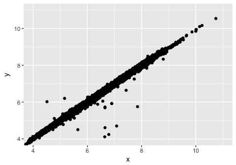

R for Data Science Walkthrough Chapters 7-8
================
Erick Lu

-   [Chapter 7 Exploratory Data Analysis](#chapter-7-exploratory-data-analysis)
    -   [7.3.4 Exercises](#exercises)
    -   [7.4.1 Exercises](#exercises-1)
    -   [7.5.1.1 Exercises](#exercises-2)
    -   [7.5.2.1 Exercises](#exercises-3)
    -   [7.5.3.1 Exercises](#exercises-4)

Chapter 7 Exploratory Data Analysis
===================================

``` r
library(tidyverse)
```

    ## ── Attaching packages ─────────────────────────────────────────────────────────────────────────────────────────── tidyverse 1.2.1 ──

    ## ✔ ggplot2 2.2.1     ✔ purrr   0.2.4
    ## ✔ tibble  1.4.2     ✔ dplyr   0.7.4
    ## ✔ tidyr   0.8.0     ✔ stringr 1.3.0
    ## ✔ readr   1.1.1     ✔ forcats 0.3.0

    ## Warning: package 'ggplot2' was built under R version 3.3.2

    ## Warning: package 'readr' was built under R version 3.3.2

    ## Warning: package 'purrr' was built under R version 3.3.2

    ## Warning: package 'dplyr' was built under R version 3.3.2

    ## ── Conflicts ────────────────────────────────────────────────────────────────────────────────────────────── tidyverse_conflicts() ──
    ## ✖ dplyr::filter() masks stats::filter()
    ## ✖ dplyr::lag()    masks stats::lag()

7.3.4 Exercises
---------------

### 1. Explore the distribution of each of the x, y, and z variables in diamonds. What do you learn? Think about a diamond and how you might decide which dimension is the length, width, and depth.

### 2. Explore the distribution of price. Do you discover anything unusual or surprising? (Hint: Carefully think about the binwidth and make sure you try a wide range of values.)

### 3. How many diamonds are 0.99 carat? How many are 1 carat? What do you think is the cause of the difference?

### 4. Compare and contrast coord\_cartesian() vs xlim() or ylim() when zooming in on a histogram. What happens if you leave binwidth unset? What happens if you try and zoom so only half a bar shows?

7.4.1 Exercises
---------------

### 1. What happens to missing values in a histogram? What happens to missing values in a bar chart? Why is there a difference?

### 2. What does na.rm = TRUE do in mean() and sum()?

7.5.1.1 Exercises
-----------------

### 1. Use what you’ve learned to improve the visualisation of the departure times of cancelled vs. non-cancelled flights.

### 2. What variable in the diamonds dataset is most important for predicting the price of a diamond? How is that variable correlated with cut? Why does the combination of those two relationships lead to lower quality diamonds being more expensive?

### 3. Install the ggstance package, and create a horizontal boxplot. How does this compare to using coord\_flip()?

### 4. One problem with boxplots is that they were developed in an era of much smaller datasets and tend to display a prohibitively large number of “outlying values”. One approach to remedy this problem is the letter value plot. Install the lvplot package, and try using geom\_lv() to display the distribution of price vs cut. What do you learn? How do you interpret the plots?

### 5. Compare and contrast geom\_violin() with a facetted geom\_histogram(), or a coloured geom\_freqpoly(). What are the pros and cons of each method?

### 6. If you have a small dataset, it’s sometimes useful to use geom\_jitter() to see the relationship between a continuous and categorical variable. The ggbeeswarm package provides a number of methods similar to geom\_jitter(). List them and briefly describe what each one does.

7.5.2.1 Exercises
-----------------

### 1. How could you rescale the count dataset above to more clearly show the distribution of cut within colour, or colour within cut?

### 2. Use geom\_tile() together with dplyr to explore how average flight delays vary by destination and month of year. What makes the plot difficult to read? How could you improve it?

### 3. Why is it slightly better to use aes(x = color, y = cut) rather than aes(x = cut, y = color) in the example above?

7.5.3.1 Exercises
-----------------

### 1. Instead of summarising the conditional distribution with a boxplot, you could use a frequency polygon. What do you need to consider when using cut\_width() vs cut\_number()? How does that impact a visualisation of the 2d distribution of carat and price?

### 2. Visualise the distribution of carat, partitioned by price.

### 3. How does the price distribution of very large diamonds compare to small diamonds. Is it as you expect, or does it surprise you?

### 4. Combine two of the techniques you’ve learned to visualise the combined distribution of cut, carat, and price.

### 5. Two dimensional plots reveal outliers that are not visible in one dimensional plots. For example, some points in the plot below have an unusual combination of x and y values, which makes the points outliers even though their x and y values appear normal when examined separately.

``` r
ggplot(data = diamonds) +
  geom_point(mapping = aes(x = x, y = y)) +
  coord_cartesian(xlim = c(4, 11), ylim = c(4, 11))
```



### 6. Why is a scatterplot a better display than a binned plot for this case?
