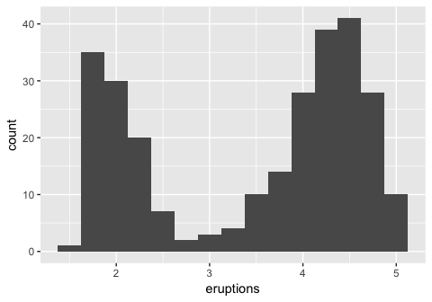

R for Data Science Walkthrough Chapters 7-8
================
Erick Lu

-   [Chapter 7 Exploratory Data Analysis](#chapter-7-exploratory-data-analysis)
    -   [Visualizing Distributions](#visualizing-distributions)
    -   [7.3.4 Exercises](#exercises)
    -   [7.4.1 Exercises](#exercises-1)
    -   [7.5.1.1 Exercises](#exercises-2)
    -   [7.5.2.1 Exercises](#exercises-3)
    -   [7.5.3.1 Exercises](#exercises-4)

This my walkthrough for the book: *R for Data Science* by Hadley Wickham and Garrett Grolemund. It contains my answers to their exercises, highlights of some of the info I found useful / insightful, and some of my own notes and data explorations. Here I will go through chapters 7-8.

Chapter 7 Exploratory Data Analysis
===================================

Exploratory data analysis (EDA) is something I was first introduced to while I was an undergraduate Statistics major at UC Berkeley. The description that this book provides is very similar to what I was taught, in that there is no "correct" or defined way to perform EDA. Exploring the data and generating questions and insights about how the data is structured, the quality of the data, what types of analysis/modeling can be performed using the data, and interpreting results of your analysis are all important things to be thinking about. While EDA can be performed in a variety of ways, this text focuses on using the tidyverse packages to do so.

``` r
library(tidyverse)
```

    ## ── Attaching packages ─────────────────────────────────────────────────────────────────────────────────────────── tidyverse 1.2.1 ──

    ## ✔ ggplot2 2.2.1     ✔ purrr   0.2.4
    ## ✔ tibble  1.4.2     ✔ dplyr   0.7.4
    ## ✔ tidyr   0.8.0     ✔ stringr 1.3.0
    ## ✔ readr   1.1.1     ✔ forcats 0.3.0

    ## Warning: package 'ggplot2' was built under R version 3.3.2

    ## Warning: package 'readr' was built under R version 3.3.2

    ## Warning: package 'purrr' was built under R version 3.3.2

    ## Warning: package 'dplyr' was built under R version 3.3.2

    ## ── Conflicts ────────────────────────────────────────────────────────────────────────────────────────────── tidyverse_conflicts() ──
    ## ✖ dplyr::filter() masks stats::filter()
    ## ✖ dplyr::lag()    masks stats::lag()

Visualizing Distributions
-------------------------

Categorical variables can be visualized using a bar chart (how many observations have property 'x'?):

``` r
# discrete binning
ggplot(data = diamonds) +
  geom_bar(mapping = aes(x = cut))
```


``` r
# manual version:
diamonds %>% 
  count(cut)
```

    ## # A tibble: 5 x 2
    ##   cut           n
    ##   <ord>     <int>
    ## 1 Fair       1610
    ## 2 Good       4906
    ## 3 Very Good 12082
    ## 4 Premium   13791
    ## 5 Ideal     21551

Continuous variables can also be visualized using a bar chart (how many observations have values between 1.5-2?):

``` r
# binning continuous variable
ggplot(data = diamonds) +
  geom_histogram(mapping = aes(x = carat), binwidth = 0.5)
```


``` r
# manual version:
diamonds %>% 
  count(cut_width(carat, 0.5))
```

    ## Warning: package 'bindrcpp' was built under R version 3.3.2

    ## # A tibble: 11 x 2
    ##    `cut_width(carat, 0.5)`     n
    ##    <fct>                   <int>
    ##  1 [-0.25,0.25]              785
    ##  2 (0.25,0.75]             29498
    ##  3 (0.75,1.25]             15977
    ##  4 (1.25,1.75]              5313
    ##  5 (1.75,2.25]              2002
    ##  6 (2.25,2.75]               322
    ##  7 (2.75,3.25]                32
    ##  8 (3.25,3.75]                 5
    ##  9 (3.75,4.25]                 4
    ## 10 (4.25,4.75]                 1
    ## 11 (4.75,5.25]                 1

You can change the size of the bins in a histogram by modifying binwidth:

``` r
# filter dataset to only keep observations with carat < 3
smaller <- diamonds %>% 
  filter(carat < 3)
# plot histogram using smaller bin width
ggplot(data = smaller, mapping = aes(x = carat)) +
  geom_histogram(binwidth = 0.1)
```


You can also overlay histogram-like data using geom\_freqpoly(). Here, the aesthetic mapping is further subgrouped by cut, using color. Each line shows up as a different color corresponding to the type of cut. We can see that the majority of ideal cuts have lower carats, as expected.

``` r
ggplot(data = smaller, mapping = aes(x = carat, colour = cut)) +
  geom_freqpoly(binwidth = 0.1)
```


Some of the common questions you can ask based on this type of data are:

-   Which values are the most common? Why?
-   Which values are rare? Why? Does that match your expectations?
-   Can you see any unusual patterns? What might explain them?

If there are clusters visible in your data, such as in the dataset, faithful:

``` r
# example of histogram with 2 clusters
ggplot(data = faithful, mapping = aes(x = eruptions)) + 
  geom_histogram(binwidth = 0.25)
```



You might want to ask the following questions about the clusters:

-   How are the observations within each cluster similar to each other?
-   How are the observations in separate clusters different from each other?
-   How can you explain or describe the clusters?
-   Why might the appearance of clusters be misleading?

If there are unusual values in your dataset, you can either filter them out using filter(), or replace the values with NA using mutate(). Below are the provided examples for both:

``` r
# remove using filter()
diamonds2 <- diamonds %>% 
  filter(between(y, 3, 20))
# replace with NA using mutate and ifelse()
diamonds2 <- diamonds %>% 
  mutate(y = ifelse(y < 3 | y > 20, NA, y))
```

I find that ifelse() is particularly useful, since you can use it to replace only a subset of values in any column of choice. For example, if we wanted to raise the price of all diamonds with a currrent price over 2000 by 3000, we could say:

``` r
(raise_price <- diamonds %>% 
  mutate(price = ifelse(price > 2000, price+3000, price)))
```

    ## # A tibble: 53,940 x 10
    ##    carat cut       color clarity depth table price     x     y     z
    ##    <dbl> <ord>     <ord> <ord>   <dbl> <dbl> <dbl> <dbl> <dbl> <dbl>
    ##  1 0.230 Ideal     E     SI2      61.5   55.  326.  3.95  3.98  2.43
    ##  2 0.210 Premium   E     SI1      59.8   61.  326.  3.89  3.84  2.31
    ##  3 0.230 Good      E     VS1      56.9   65.  327.  4.05  4.07  2.31
    ##  4 0.290 Premium   I     VS2      62.4   58.  334.  4.20  4.23  2.63
    ##  5 0.310 Good      J     SI2      63.3   58.  335.  4.34  4.35  2.75
    ##  6 0.240 Very Good J     VVS2     62.8   57.  336.  3.94  3.96  2.48
    ##  7 0.240 Very Good I     VVS1     62.3   57.  336.  3.95  3.98  2.47
    ##  8 0.260 Very Good H     SI1      61.9   55.  337.  4.07  4.11  2.53
    ##  9 0.220 Fair      E     VS2      65.1   61.  337.  3.87  3.78  2.49
    ## 10 0.230 Very Good H     VS1      59.4   61.  338.  4.00  4.05  2.39
    ## # ... with 53,930 more rows

Missing values may provide some insight into the data, even though they do not have values. For example, the presence of a missing value in a column such as dep\_time in the nycflights13 dataset suggests the flight was cancelled. You can then compare how the other attributes of a cancelled flight differ from a non-cancelled flight. The example provided by the book compares the distribution of sched\_dep\_time for cancelled vs non-cancelled flights:

``` r
nycflights13::flights %>% 
  mutate(
    cancelled = is.na(dep_time),
    sched_hour = sched_dep_time %/% 100,
    sched_min = sched_dep_time %% 100,
    sched_dep_time = sched_hour + sched_min / 60
  ) %>% 
  ggplot(mapping = aes(sched_dep_time)) + 
    geom_freqpoly(mapping = aes(colour = cancelled), binwidth = 1/4)
```


7.3.4 Exercises
---------------

### 1. Explore the distribution of each of the x, y, and z variables in diamonds. What do you learn? Think about a diamond and how you might decide which dimension is the length, width, and depth.

To explor the distributions of x, y, and z, we can plot a histogram for each of them. Alternatively, we can plot a boxplot, which also shows the distribution of values for each of the variables, as well as any outliers. We can see that for each of the values, there are indeed a few outliers that have very high or low values. However, for the most part, x and y are between 4-9, and z is between 2 and 6. We can also plot a scatterplot of x vs y or z and fit a linear model to the points. We can see that there is a strong positive correlation between x and y, and x and z.

``` r
# plot a histogram for x, y, and z separately
ggplot(diamonds, aes (x = x))+
  geom_histogram(binwidth = 0.2)
```


``` r
ggplot(diamonds, aes (x = y))+
  geom_histogram(binwidth = 0.2)
```


``` r
ggplot(diamonds, aes (x = z))+
  geom_histogram(binwidth = 0.2)
```


``` r
# or, reshape the data and plot a boxplot of the three variables side by side

library(reshape2)
```

    ## Warning: package 'reshape2' was built under R version 3.3.2

    ## 
    ## Attaching package: 'reshape2'

    ## The following object is masked from 'package:tidyr':
    ## 
    ##     smiths

``` r
x_y_z_melt = melt( select(diamonds, x,y,z), measure.vars = c('x','y','z'))
ggplot(x_y_z_melt)+
  geom_boxplot(aes(x = variable, y = value))
```


``` r
# get a numeric summary for all the columns in diamonds
summary(diamonds)
```

    ##      carat               cut        color        clarity     
    ##  Min.   :0.2000   Fair     : 1610   D: 6775   SI1    :13065  
    ##  1st Qu.:0.4000   Good     : 4906   E: 9797   VS2    :12258  
    ##  Median :0.7000   Very Good:12082   F: 9542   SI2    : 9194  
    ##  Mean   :0.7979   Premium  :13791   G:11292   VS1    : 8171  
    ##  3rd Qu.:1.0400   Ideal    :21551   H: 8304   VVS2   : 5066  
    ##  Max.   :5.0100                     I: 5422   VVS1   : 3655  
    ##                                     J: 2808   (Other): 2531  
    ##      depth           table           price             x         
    ##  Min.   :43.00   Min.   :43.00   Min.   :  326   Min.   : 0.000  
    ##  1st Qu.:61.00   1st Qu.:56.00   1st Qu.:  950   1st Qu.: 4.710  
    ##  Median :61.80   Median :57.00   Median : 2401   Median : 5.700  
    ##  Mean   :61.75   Mean   :57.46   Mean   : 3933   Mean   : 5.731  
    ##  3rd Qu.:62.50   3rd Qu.:59.00   3rd Qu.: 5324   3rd Qu.: 6.540  
    ##  Max.   :79.00   Max.   :95.00   Max.   :18823   Max.   :10.740  
    ##                                                                  
    ##        y                z         
    ##  Min.   : 0.000   Min.   : 0.000  
    ##  1st Qu.: 4.720   1st Qu.: 2.910  
    ##  Median : 5.710   Median : 3.530  
    ##  Mean   : 5.735   Mean   : 3.539  
    ##  3rd Qu.: 6.540   3rd Qu.: 4.040  
    ##  Max.   :58.900   Max.   :31.800  
    ## 

``` r
# see how x correlates with y or z
ggplot (diamonds, aes(x = x, y = y)) +
  geom_point() +
  geom_smooth(method = 'lm', se = F)
```


``` r
ggplot (diamonds, aes(x = x, y = z)) +
  geom_point()+
  geom_smooth(method = 'lm', se = F)
```


### 2. Explore the distribution of price. Do you discover anything unusual or surprising? (Hint: Carefully think about the binwidth and make sure you try a wide range of values.)

``` r
#examine the distribution of price using various bin widths
ggplot (diamonds, aes (x = price))+
  geom_histogram(binwidth = 10)
```


``` r
ggplot (diamonds, aes (x = price))+
  geom_histogram(binwidth = 50)
```


``` r
ggplot (diamonds, aes (x = price))+
  geom_histogram(binwidth = 500)
```


``` r
# zoom in on diamonds which are less than 2500 to examine the anomaly
ggplot(filter(diamonds, price < 2500), aes (x = price))+
  geom_histogram(binwidth = 5)
```


### 3. How many diamonds are 0.99 carat? How many are 1 carat? What do you think is the cause of the difference?

### 4. Compare and contrast coord\_cartesian() vs xlim() or ylim() when zooming in on a histogram. What happens if you leave binwidth unset? What happens if you try and zoom so only half a bar shows?

7.4.1 Exercises
---------------

### 1. What happens to missing values in a histogram? What happens to missing values in a bar chart? Why is there a difference?

### 2. What does na.rm = TRUE do in mean() and sum()?

7.5.1.1 Exercises
-----------------

### 1. Use what you’ve learned to improve the visualisation of the departure times of cancelled vs. non-cancelled flights.

### 2. What variable in the diamonds dataset is most important for predicting the price of a diamond? How is that variable correlated with cut? Why does the combination of those two relationships lead to lower quality diamonds being more expensive?

### 3. Install the ggstance package, and create a horizontal boxplot. How does this compare to using coord\_flip()?

### 4. One problem with boxplots is that they were developed in an era of much smaller datasets and tend to display a prohibitively large number of “outlying values”. One approach to remedy this problem is the letter value plot. Install the lvplot package, and try using geom\_lv() to display the distribution of price vs cut. What do you learn? How do you interpret the plots?

### 5. Compare and contrast geom\_violin() with a facetted geom\_histogram(), or a coloured geom\_freqpoly(). What are the pros and cons of each method?

### 6. If you have a small dataset, it’s sometimes useful to use geom\_jitter() to see the relationship between a continuous and categorical variable. The ggbeeswarm package provides a number of methods similar to geom\_jitter(). List them and briefly describe what each one does.

7.5.2.1 Exercises
-----------------

### 1. How could you rescale the count dataset above to more clearly show the distribution of cut within colour, or colour within cut?

### 2. Use geom\_tile() together with dplyr to explore how average flight delays vary by destination and month of year. What makes the plot difficult to read? How could you improve it?

### 3. Why is it slightly better to use aes(x = color, y = cut) rather than aes(x = cut, y = color) in the example above?

7.5.3.1 Exercises
-----------------

### 1. Instead of summarising the conditional distribution with a boxplot, you could use a frequency polygon. What do you need to consider when using cut\_width() vs cut\_number()? How does that impact a visualisation of the 2d distribution of carat and price?

### 2. Visualise the distribution of carat, partitioned by price.

### 3. How does the price distribution of very large diamonds compare to small diamonds. Is it as you expect, or does it surprise you?

### 4. Combine two of the techniques you’ve learned to visualise the combined distribution of cut, carat, and price.

### 5. Two dimensional plots reveal outliers that are not visible in one dimensional plots. For example, some points in the plot below have an unusual combination of x and y values, which makes the points outliers even though their x and y values appear normal when examined separately.

``` r
ggplot(data = diamonds) +
  geom_point(mapping = aes(x = x, y = y)) +
  coord_cartesian(xlim = c(4, 11), ylim = c(4, 11))
```


### 6. Why is a scatterplot a better display than a binned plot for this case?
