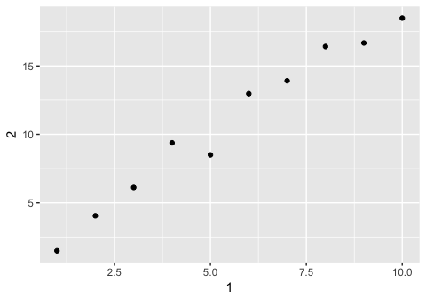

R for Data Science Walkthrough Chapters 9-13
================
Erick Lu

-   [Chapter 9 Introduction](#chapter-9-introduction)
-   [Chapter 10 Tibbles](#chapter-10-tibbles)
    -   [10.5 Exercises](#exercises)
-   [Chapter 11 Data Import](#chapter-11-data-import)
    -   [11.2 Getting started - reading in files](#getting-started---reading-in-files)
    -   [11.2.2 Exercises](#exercises-1)
    -   [11.3 Parsing a vector](#parsing-a-vector)
    -   [11.3.5 Exercises](#exercises-2)
    -   [11.4 and 11.5 Parsing a file & Writing to a file](#and-11.5-parsing-a-file-writing-to-a-file)
-   [Chapter 12 Tidy Data](#chapter-12-tidy-data)
    -   [12.2.1 Exercises](#exercises-3)
    -   [12.3.3 Exercises](#exercises-4)
    -   [12.4.3 Exercises](#exercises-5)
    -   [12.5.1 Exercises](#exercises-6)
    -   [12.6.1 Exercises](#exercises-7)
-   [Chapter 13 Relational Data](#chapter-13-relational-data)
    -   [13.2.1 Exercises](#exercises-8)
    -   [13.3.1 Exercises](#exercises-9)
    -   [13.4.6 Exercises](#exercises-10)
    -   [13.5.1 Exercises](#exercises-11)

This my walkthrough for chapters 9-13 for the book: *R for Data Science* by Hadley Wickham and Garrett Grolemund. Here I provide solutions to their exercises and some of my own notes and explorations.

Chapter 9 Introduction
======================

This chapter provides a list of the content covered in chapter 10-16, which includes tibbles, data import, tidy data, relational data, strings (regular expressions), factors, and dates/times.

``` r
library(tidyverse)
```

    ## ── Attaching packages ─────────────────────────────────────────────────────────────────────────────────────────── tidyverse 1.2.1 ──

    ## ✔ ggplot2 2.2.1     ✔ purrr   0.2.4
    ## ✔ tibble  1.4.2     ✔ dplyr   0.7.5
    ## ✔ tidyr   0.8.1     ✔ stringr 1.3.1
    ## ✔ readr   1.1.1     ✔ forcats 0.3.0

    ## ── Conflicts ────────────────────────────────────────────────────────────────────────────────────────────── tidyverse_conflicts() ──
    ## ✖ dplyr::filter() masks stats::filter()
    ## ✖ dplyr::lag()    masks stats::lag()

Chapter 10 Tibbles
==================

You can create tibbles from existing data frames using as\_tibble(), or create brand new tibbles using tibble():

``` r
tibble(
  x = 1:5, 
  y = 1, 
  z = x ^ 2 + y
)
```

    ## # A tibble: 5 x 3
    ##       x     y     z
    ##   <int> <dbl> <dbl>
    ## 1     1     1     2
    ## 2     2     1     5
    ## 3     3     1    10
    ## 4     4     1    17
    ## 5     5     1    26

A cousin of tibble(), tribble(), can also be used as a way to manually enter data into a tibble format:

``` r
tribble(
  ~x, ~y, ~z,
  #--|--|----
  "a", 2, 3.6,
  "b", 1, 8.5
)
```

    ## # A tibble: 2 x 3
    ##   x         y     z
    ##   <chr> <dbl> <dbl>
    ## 1 a         2   3.6
    ## 2 b         1   8.5

You can also use non-syntactic names for variables in tibbles:

``` r
tb <- tibble(
  `:)` = "smile", 
  ` ` = "space",
  `2000` = "number"
)
tb
```

    ## # A tibble: 1 x 3
    ##   `:)`  ` `   `2000`
    ##   <chr> <chr> <chr> 
    ## 1 smile space number

When compared to a data.frame in baseR, the tibble looks more user-friendly. Calling a tibble automatically provides only the beginning chunk of the data rather than filling up your entire console (think if it as default head(data.frame) display). Other nice features include not converting strings to factors or changing variable names.

To convert tables to or from data frames, use as\_tibble() and as.data.frame():

``` r
class(iris)
```

    ## [1] "data.frame"

``` r
class(as_tibble(iris))
```

    ## [1] "tbl_df"     "tbl"        "data.frame"

``` r
class(as.data.frame(as_tibble(iris)))
```

    ## [1] "data.frame"

You can select columns in tibbles the same way you would with a data.frame:

``` r
df <- tibble(
  x = runif(5),
  y = rnorm(5)
)
# extract column 'x' using either $ or [[]]
df$x
```

    ## [1] 0.08101037 0.11158800 0.90870677 0.40799873 0.33430156

``` r
df[["x"]]
```

    ## [1] 0.08101037 0.11158800 0.90870677 0.40799873 0.33430156

``` r
df[[1]]
```

    ## [1] 0.08101037 0.11158800 0.90870677 0.40799873 0.33430156

10.5 Exercises
--------------

### 1. How can you tell if an object is a tibble? (Hint: try printing mtcars, which is a regular data frame).

You can tell if an object is a tibble because the output you get by calling it will say "tibble"! For example, calling the diamonds tibble returns :`# A tibble: 53,940 x 10` as the first line of the output. Also you can tell something is a tibble based on the class specifications underneath each variable name. A tibble will also only print out the first 10 rows by default, whereas a data.frame will print out as many as the console allows. Last, the definitive way to tell something is a tibble is to use the class() function.

``` r
class(diamonds)
```

    ## [1] "tbl_df"     "tbl"        "data.frame"

``` r
class(mtcars)
```

    ## [1] "data.frame"

### 2. Compare and contrast the following operations on a data.frame and equivalent tibble. What is different? Why might the default data frame behaviours cause you frustration?

On a data.frame, `df$x` will still return the values for column xyz. This behavior does not occur for a tibble, which requires the exact name of the column `df$xyz`. This data.frame feature might cause frustration if you have columns in your dataset with the same prefix, in which you might fetch the wrong column. The other functions between data.frame and tibble work the same way. One distinction to note is that, when creating the data.frame, "a" is considered a factor with 1 level. When creating the tibble, "a" is not converted into a factor.

``` r
df <- data.frame(abc = 1, xyz = "a")
df$x
```

    ## [1] a
    ## Levels: a

``` r
df[, "xyz"]
```

    ## [1] a
    ## Levels: a

``` r
df[, c("abc", "xyz")]
```

    ##   abc xyz
    ## 1   1   a

``` r
df <- tibble(abc = 1, xyz = "a")
df$x
```

    ## Warning: Unknown or uninitialised column: 'x'.

    ## NULL

``` r
df[, "xyz"]
```

    ## # A tibble: 1 x 1
    ##   xyz  
    ##   <chr>
    ## 1 a

``` r
df[, c("abc", "xyz")]
```

    ## # A tibble: 1 x 2
    ##     abc xyz  
    ##   <dbl> <chr>
    ## 1     1 a

### 3. If you have the name of a variable stored in an object, e.g. var &lt;- "mpg", how can you extract the reference variable from a tibble?

If the name of the variable is stored in an object, you can pass the object in lieu of the variable name using \[\[\]\] or \[\] just as you would do so with the explicit variable name. You can even pass the object and another variable name to obtain multiple reference variables using c(). I provide an example below using the diamonds dataset.

``` r
var <- "carat"
var2 <- c("carat","price")

# extract only carat
diamonds[,var]
```

    ## # A tibble: 53,940 x 1
    ##    carat
    ##    <dbl>
    ##  1 0.23 
    ##  2 0.21 
    ##  3 0.23 
    ##  4 0.290
    ##  5 0.31 
    ##  6 0.24 
    ##  7 0.24 
    ##  8 0.26 
    ##  9 0.22 
    ## 10 0.23 
    ## # ... with 53,930 more rows

``` r
#extract carat and price
diamonds[,c(var,"price")]
```

    ## # A tibble: 53,940 x 2
    ##    carat price
    ##    <dbl> <int>
    ##  1 0.23    326
    ##  2 0.21    326
    ##  3 0.23    327
    ##  4 0.290   334
    ##  5 0.31    335
    ##  6 0.24    336
    ##  7 0.24    336
    ##  8 0.26    337
    ##  9 0.22    337
    ## 10 0.23    338
    ## # ... with 53,930 more rows

``` r
diamonds[,var2]
```

    ## # A tibble: 53,940 x 2
    ##    carat price
    ##    <dbl> <int>
    ##  1 0.23    326
    ##  2 0.21    326
    ##  3 0.23    327
    ##  4 0.290   334
    ##  5 0.31    335
    ##  6 0.24    336
    ##  7 0.24    336
    ##  8 0.26    337
    ##  9 0.22    337
    ## 10 0.23    338
    ## # ... with 53,930 more rows

### 4. Practice referring to non-syntactic names in the following data frame by:

``` r
annoying <- tibble(
  `1` = 1:10,
  `2` = `1` * 2 + rnorm(length(`1`))
)
```

-   Extracting the variable called 1.

``` r
annoying[,"1"]
```

    ## # A tibble: 10 x 1
    ##      `1`
    ##    <int>
    ##  1     1
    ##  2     2
    ##  3     3
    ##  4     4
    ##  5     5
    ##  6     6
    ##  7     7
    ##  8     8
    ##  9     9
    ## 10    10

-   Plotting a scatterplot of 1 vs 2.

``` r
ggplot(annoying, aes(`1`,`2`))+
  geom_point()
```



-   Creating a new column called 3 which is 2 divided by 1.

``` r
annoying %>%
  mutate(`3` = `2`/`1`)
```

    ## # A tibble: 10 x 3
    ##      `1`   `2`   `3`
    ##    <int> <dbl> <dbl>
    ##  1     1  2.49  2.49
    ##  2     2  3.22  1.61
    ##  3     3  6.63  2.21
    ##  4     4  6.46  1.61
    ##  5     5  9.02  1.80
    ##  6     6 11.9   1.98
    ##  7     7 13.4   1.92
    ##  8     8 16.2   2.03
    ##  9     9 17.7   1.97
    ## 10    10 20.0   2.00

-   Renaming the columns to one, two and three.

``` r
annoying %>%
  mutate(`3` = `2`/`1`) %>%
  rename(one = `1`, two = `2`, three = `3` )
```

    ## # A tibble: 10 x 3
    ##      one   two three
    ##    <int> <dbl> <dbl>
    ##  1     1  2.49  2.49
    ##  2     2  3.22  1.61
    ##  3     3  6.63  2.21
    ##  4     4  6.46  1.61
    ##  5     5  9.02  1.80
    ##  6     6 11.9   1.98
    ##  7     7 13.4   1.92
    ##  8     8 16.2   2.03
    ##  9     9 17.7   1.97
    ## 10    10 20.0   2.00

### 5. What does tibble::enframe() do? When might you use it?

Taken from the documentation: "enframe() converts named atomic vectors or lists to two-column data frames. For unnamed vectors, the natural sequence is used as name column." I might use this when I have a vector that I want to turn into a data.frame for graphing using ggplot, which requires data be in data.frame or tibble.

``` r
x = rnorm(100)
names(x) <- c(5:104)
enframe(x)
```

    ## # A tibble: 100 x 2
    ##    name    value
    ##    <chr>   <dbl>
    ##  1 5     -1.56  
    ##  2 6     -0.746 
    ##  3 7      0.170 
    ##  4 8     -0.316 
    ##  5 9      1.23  
    ##  6 10     0.0133
    ##  7 11     1.18  
    ##  8 12     1.86  
    ##  9 13    -0.490 
    ## 10 14     0.0899
    ## # ... with 90 more rows

``` r
class(enframe(x))
```

    ## [1] "tbl_df"     "tbl"        "data.frame"

### 6. What option controls how many additional column names are printed at the footer of a tibble?

The documentation for ?format.tbl (tibble formatting) says that the n\_extra argument will control how many additional columns to print abbreviated information for. The example provided in the documentation is below, which only prints 2 of the additional columns (whereas the unmodified print(flights) would yield 5 additional columns in the footer).

``` r
print(nycflights13::flights, n_extra = 2)
```

    ## # A tibble: 336,776 x 19
    ##     year month   day dep_time sched_dep_time dep_delay arr_time
    ##    <int> <int> <int>    <int>          <int>     <dbl>    <int>
    ##  1  2013     1     1      517            515         2      830
    ##  2  2013     1     1      533            529         4      850
    ##  3  2013     1     1      542            540         2      923
    ##  4  2013     1     1      544            545        -1     1004
    ##  5  2013     1     1      554            600        -6      812
    ##  6  2013     1     1      554            558        -4      740
    ##  7  2013     1     1      555            600        -5      913
    ##  8  2013     1     1      557            600        -3      709
    ##  9  2013     1     1      557            600        -3      838
    ## 10  2013     1     1      558            600        -2      753
    ## # ... with 336,766 more rows, and 12 more variables: sched_arr_time <int>,
    ## #   arr_delay <dbl>, …

Chapter 11 Data Import
======================

11.2 Getting started - reading in files
---------------------------------------

To practice various utilities for reading in files, we can use inline csv designation, which requires proper newline designation. Below are some examples of reading in inline csv chunks with various arguments tailored for the type of data being read in.

``` r
# basic read_csv()
read_csv("a,b,c
         1,2,3 
         4,5,6")
```

    ## # A tibble: 2 x 3
    ##       a     b     c
    ##   <int> <int> <int>
    ## 1     1     2     3
    ## 2     4     5     6

``` r
# read in data, ignoring metadata lines
read_csv("The first line of metadata
The second line of metadata
  x,y,z
  1,2,3", skip = 2)
```

    ## # A tibble: 1 x 3
    ##       x     y     z
    ##   <int> <int> <int>
    ## 1     1     2     3

``` r
# designate lines to skip that start with specific symbol
read_csv("# A comment I want to skip
  x,y,z
  1,2,3", comment = "#")
```

    ## # A tibble: 1 x 3
    ##       x     y     z
    ##   <int> <int> <int>
    ## 1     1     2     3

``` r
# read in file that doesnt have column names
read_csv("1,2,3\n4,5,6", col_names = FALSE)
```

    ## # A tibble: 2 x 3
    ##      X1    X2    X3
    ##   <int> <int> <int>
    ## 1     1     2     3
    ## 2     4     5     6

``` r
# read in file and specify column names
read_csv("1,2,3\n4,5,6", col_names = c("x", "y", "z"))
```

    ## # A tibble: 2 x 3
    ##       x     y     z
    ##   <int> <int> <int>
    ## 1     1     2     3
    ## 2     4     5     6

``` r
# read in file, replacing symbol with missing values (NA)
read_csv("a,b,c\n1,2,.", na = ".")
```

    ## # A tibble: 1 x 3
    ##       a     b c    
    ##   <int> <int> <chr>
    ## 1     1     2 <NA>

11.2.2 Exercises
----------------

### 1. What function would you use to read a file where fields were separated with “|”?

I would use `read_delim()` to read in a file where fields are separated with "|". For example:

``` r
read_delim ("a|b|c
            1|2|3
            4|5|6", "|")
```

    ## # A tibble: 2 x 3
    ##   a                   b     c
    ##   <chr>           <int> <int>
    ## 1 "            1"     2     3
    ## 2 "            4"     5     6

### 2. Apart from file, skip, and comment, what other arguments do read\_csv() and read\_tsv() have in common?

Based on the documentation, read\_csv() and read\_tsv() have col\_names, col\_types, locale, na, quoted\_na, quote, trim\_ws, n\_max, guess\_max, and progress.

### 3. What are the most important arguments to read\_fwf()?

The most important arguments are the file, and the col\_positions arguments. There are many options to specify col\_positions, including fwf\_empty(), fwf\_widths(), fwf\_positions(), and fwf\_cols(). Below is the example provided in the documentation:

``` r
fwf_sample <- readr_example("fwf-sample.txt")
cat(read_lines(fwf_sample))
```

    ## John Smith          WA        418-Y11-4111 Mary Hartford       CA        319-Z19-4341 Evan Nolan          IL        219-532-c301

``` r
# You can specify column positions in several ways:
# 1. Guess based on position of empty columns
read_fwf(fwf_sample, fwf_empty(fwf_sample, col_names = c("first", "last", "state", "ssn")))
```

    ## Parsed with column specification:
    ## cols(
    ##   first = col_character(),
    ##   last = col_character(),
    ##   state = col_character(),
    ##   ssn = col_character()
    ## )

    ## # A tibble: 3 x 4
    ##   first last     state ssn         
    ##   <chr> <chr>    <chr> <chr>       
    ## 1 John  Smith    WA    418-Y11-4111
    ## 2 Mary  Hartford CA    319-Z19-4341
    ## 3 Evan  Nolan    IL    219-532-c301

``` r
# 2. A vector of field widths
read_fwf(fwf_sample, fwf_widths(c(20, 10, 12), c("name", "state", "ssn")))
```

    ## Parsed with column specification:
    ## cols(
    ##   name = col_character(),
    ##   state = col_character(),
    ##   ssn = col_character()
    ## )

    ## # A tibble: 3 x 3
    ##   name          state ssn         
    ##   <chr>         <chr> <chr>       
    ## 1 John Smith    WA    418-Y11-4111
    ## 2 Mary Hartford CA    319-Z19-4341
    ## 3 Evan Nolan    IL    219-532-c301

``` r
# 3. Paired vectors of start and end positions
read_fwf(fwf_sample, fwf_positions(c(1, 30), c(10, 42), c("name", "ssn")))
```

    ## Parsed with column specification:
    ## cols(
    ##   name = col_character(),
    ##   ssn = col_character()
    ## )

    ## # A tibble: 3 x 2
    ##   name       ssn         
    ##   <chr>      <chr>       
    ## 1 John Smith 418-Y11-4111
    ## 2 Mary Hartf 319-Z19-4341
    ## 3 Evan Nolan 219-532-c301

``` r
# 4. Named arguments with start and end positions
read_fwf(fwf_sample, fwf_cols(name = c(1, 10), ssn = c(30, 42)))
```

    ## Parsed with column specification:
    ## cols(
    ##   name = col_character(),
    ##   ssn = col_character()
    ## )

    ## # A tibble: 3 x 2
    ##   name       ssn         
    ##   <chr>      <chr>       
    ## 1 John Smith 418-Y11-4111
    ## 2 Mary Hartf 319-Z19-4341
    ## 3 Evan Nolan 219-532-c301

``` r
# 5. Named arguments with column widths
read_fwf(fwf_sample, fwf_cols(name = 20, state = 10, ssn = 12))
```

    ## Parsed with column specification:
    ## cols(
    ##   name = col_character(),
    ##   state = col_character(),
    ##   ssn = col_character()
    ## )

    ## # A tibble: 3 x 3
    ##   name          state ssn         
    ##   <chr>         <chr> <chr>       
    ## 1 John Smith    WA    418-Y11-4111
    ## 2 Mary Hartford CA    319-Z19-4341
    ## 3 Evan Nolan    IL    219-532-c301

### 4. Sometimes strings in a CSV file contain commas. To prevent them from causing problems they need to be surrounded by a quoting character, like " or '. By convention, read\_csv() assumes that the quoting character will be ", and if you want to change it you’ll need to use read\_delim() instead. What arguments do you need to specify to read the following text into a data frame? `"x,y\n1,'a,b'"`

In this example, the string is surrounded by the quoting character '. This is not what read\_csv() default assumes. In the documentation it looks like you can specify the quote argument for both read\_csv() and read\_delim(). Below I read in the text using both methods, specifying `quote = "\'"`.

``` r
read_csv ("x,y\n1,'a,b'", quote = "\'")
```

    ## # A tibble: 1 x 2
    ##       x y    
    ##   <int> <chr>
    ## 1     1 a,b

``` r
read_delim("x,y\n1,'a,b'", delim = ",", quote = "\'")
```

    ## # A tibble: 1 x 2
    ##       x y    
    ##   <int> <chr>
    ## 1     1 a,b

### 5. Identify what is wrong with each of the following inline CSV files. What happens when you run the code?

I have annotated the code below with the problems for each of the inline CSV files. The output should be displayed if you are viewing the rendered `.md file` (you won't see the output if this is a `.Rmd` file).

``` r
# There are not enough column names to go with the amount of columns in the data.
read_csv("a,b\n1,2,3\n4,5,6")
```

    ## Warning: 2 parsing failures.
    ## row # A tibble: 2 x 5 col     row col   expected  actual    file         expected   <int> <chr> <chr>     <chr>     <chr>        actual 1     1 <NA>  2 columns 3 columns literal data file 2     2 <NA>  2 columns 3 columns literal data

    ## # A tibble: 2 x 2
    ##       a     b
    ##   <int> <int>
    ## 1     1     2
    ## 2     4     5

``` r
# Mismatched numbers of columns again. The first row only has 2, whereas the 2nd row has 4, and the header only has 3.
read_csv("a,b,c\n1,2\n1,2,3,4")
```

    ## Warning: 2 parsing failures.
    ## row # A tibble: 2 x 5 col     row col   expected  actual    file         expected   <int> <chr> <chr>     <chr>     <chr>        actual 1     1 <NA>  3 columns 2 columns literal data file 2     2 <NA>  3 columns 4 columns literal data

    ## # A tibble: 2 x 3
    ##       a     b     c
    ##   <int> <int> <int>
    ## 1     1     2    NA
    ## 2     1     2     3

``` r
# Two header columns, and one column of data. Also the "1" is still being read in as an integer.
read_csv("a,b\n\"1")
```

    ## Warning: 2 parsing failures.
    ## row # A tibble: 2 x 5 col     row col   expected                     actual    file         expected   <int> <chr> <chr>                        <chr>     <chr>        actual 1     1 a     closing quote at end of file ""        literal data file 2     1 <NA>  2 columns                    1 columns literal data

    ## # A tibble: 1 x 2
    ##       a b    
    ##   <int> <chr>
    ## 1     1 <NA>

``` r
# Since there are both integer values and character values in the same column, both columns are defined as character.
read_csv("a,b\n1,2\na,b")
```

    ## # A tibble: 2 x 2
    ##   a     b    
    ##   <chr> <chr>
    ## 1 1     2    
    ## 2 a     b

``` r
# I assume ";" was meant to be the delimiter. The csv only has one observation. Use read_delim("a;b\n1;3", ";") instead.
read_csv("a;b\n1;3")
```

    ## # A tibble: 1 x 1
    ##   `a;b`
    ##   <chr>
    ## 1 1;3

11.3 Parsing a vector
---------------------

Parsing vectors or files can be useful to convert variables to their appropriate classes. For example, if a column of integer values was read in as characters, we can convert the data back into integers using parse\_integer(). Below are the provided examples of use:

``` r
str(parse_logical(c("TRUE", "FALSE", "NA")))
```

    ##  logi [1:3] TRUE FALSE NA

``` r
str(parse_integer(c("1", "2", "3")))
```

    ##  int [1:3] 1 2 3

``` r
str(parse_date(c("2010-01-01", "1979-10-14")))
```

    ##  Date[1:2], format: "2010-01-01" "1979-10-14"

Below are the other examples using parsing functions. Using the problems() function on a parsed vector seems especially useful!

``` r
# can specify na values if present in data
parse_integer(c("1", "231", ".", "456"), na = ".")
```

    ## [1]   1 231  NA 456

``` r
x <- parse_integer(c("123", "345", "abc", "123.45"))
```

    ## Warning in rbind(names(probs), probs_f): number of columns of result is not
    ## a multiple of vector length (arg 1)

    ## Warning: 2 parsing failures.
    ## row # A tibble: 2 x 4 col     row   col expected               actual expected   <int> <int> <chr>                  <chr>  actual 1     3    NA an integer             abc    row 2     4    NA no trailing characters .45

``` r
x
```

    ## [1] 123 345  NA  NA
    ## attr(,"problems")
    ## # A tibble: 2 x 4
    ##     row   col expected               actual
    ##   <int> <int> <chr>                  <chr> 
    ## 1     3    NA an integer             abc   
    ## 2     4    NA no trailing characters .45

``` r
problems(x)
```

    ## # A tibble: 2 x 4
    ##     row   col expected               actual
    ##   <int> <int> <chr>                  <chr> 
    ## 1     3    NA an integer             abc   
    ## 2     4    NA no trailing characters .45

### Parsing Numbers

Reading in data obtained from outside the US is also tricky since there are different conventions used to display numerical data. For example, using "." instead of "," to mark decimal places or groupings. The functions have arguments that allow you to specify these marks. The examples provided in the book are below. parse\_number() also ignores non-numerical symbols such as $ or %. However, parse\_double does not seem to have this feature.

``` r
# you can specify the decimal mark symbol if needed
parse_double("1.23")
```

    ## [1] 1.23

``` r
parse_double("1,23", locale = locale(decimal_mark = ","))
```

    ## [1] 1.23

``` r
# parse_number() ignores non-numerical symbols
parse_number("$100")
```

    ## [1] 100

``` r
parse_number("20%")
```

    ## [1] 20

``` r
parse_number("It cost $123.45")
```

    ## [1] 123.45

``` r
# You can also specify grouping marks if needed.
# Used in America
parse_number("$123,456,789")
```

    ## [1] 123456789

``` r
# Used in many parts of Europe
parse_number("123.456.789", locale = locale(grouping_mark = "."))
```

    ## [1] 123456789

``` r
# Used in Switzerland
parse_number("123'456'789", locale = locale(grouping_mark = "'"))
```

    ## [1] 123456789

### Parsing Strings

You can use parse\_character() to parse strings. Each character in a string is encoded, and you can specify the encoding as an argument in parse\_character(). To guess the encoding for a particular string you are parsing, you can use guess\_encoding().

``` r
x1 <- "El Ni\xf1o was particularly bad this year"
x2 <- "\x82\xb1\x82\xf1\x82\xc9\x82\xbf\x82\xcd"

parse_character(x1, locale = locale(encoding = "Latin1"))
```

    ## [1] "El Niño was particularly bad this year"

``` r
parse_character(x2, locale = locale(encoding = "Shift-JIS"))
```

    ## [1] "こんにちは"

``` r
guess_encoding(charToRaw(x1))
```

    ## # A tibble: 2 x 2
    ##   encoding   confidence
    ##   <chr>           <dbl>
    ## 1 ISO-8859-1       0.46
    ## 2 ISO-8859-9       0.23

``` r
guess_encoding(charToRaw(x2))
```

    ## # A tibble: 1 x 2
    ##   encoding confidence
    ##   <chr>         <dbl>
    ## 1 KOI8-R         0.42

### Parsing Factors

To parse a vector of factors, you can use parse\_factor(), specifying the levels that you are expecting to see. If a value in the vector does not exist in the levels argument, an error is returned.

``` r
fruit <- c("apple", "banana")
parse_factor(c("apple", "banana", "banana"), levels = fruit)
```

    ## [1] apple  banana banana
    ## Levels: apple banana

``` r
parse_factor(c("apple", "banana", "bananana"), levels = fruit)
```

    ## Warning: 1 parsing failure.
    ## row # A tibble: 1 x 4 col     row   col expected           actual   expected   <int> <int> <chr>              <chr>    actual 1     3    NA value in level set bananana

    ## [1] apple  banana <NA>  
    ## attr(,"problems")
    ## # A tibble: 1 x 4
    ##     row   col expected           actual  
    ##   <int> <int> <chr>              <chr>   
    ## 1     3    NA value in level set bananana
    ## Levels: apple banana

### Parsing Dates, Date-times, and Times

There are three types of parsers for these purposes which spit out a combination of date, time, or date-time. Below are the provided examples from the book for each of the parsers.

``` r
# date-time
# requires input as year, month, day (mandatory), time-(optional)-hour, minute, second, 
parse_datetime("2010-10-01T2010")
```

    ## [1] "2010-10-01 20:10:00 UTC"

``` r
parse_datetime("20101010")
```

    ## [1] "2010-10-10 UTC"

``` r
# date - year, month, day
# expects a four digit year, a - or /, the month, a - or /, then the day
parse_date("2010-10-01")
```

    ## [1] "2010-10-01"

``` r
#  expects the hour, :, minutes, optionally : and seconds, and an optional am/pm specifier:
library(hms)
parse_time("01:10 am")
```

    ## 01:10:00

``` r
parse_time("01:10 pm")
```

    ## 13:10:00

``` r
parse_time("20:10:01")
```

    ## 20:10:01

You can also create your own date-time format. There are many parameters you can specify for your date-time "key". See ?parse\_date for the options. Depending on how you set up the "key", you may parse different dates from one set of numbers (book example below).

``` r
# different dates are parsed depending on the key that you provide
parse_date("01/02/15", "%m/%d/%y")
```

    ## [1] "2015-01-02"

``` r
parse_date("01/02/15", "%d/%m/%y")
```

    ## [1] "2015-02-01"

``` r
parse_date("01/02/15", "%y/%m/%d")
```

    ## [1] "2001-02-15"

Last, as with parsing numbers, different countries may have different date formats. You can solve this by specifying the local argument, as we did with parse\_integer().

``` r
parse_date("1 janvier 2015", "%d %B %Y", locale = locale("fr"))
```

    ## [1] "2015-01-01"

11.3.5 Exercises
----------------

### 1. What are the most important arguments to locale()?

If you are using locale() for parse\_number(), then the most important arguments are `decimal_mark` and `grouping_mark`. For parse\_character(), you should specify `encoding`. For parse\_date(), you should specify the region using the appropriate characters.

### 2. What happens if you try and set decimal\_mark and grouping\_mark to the same character? What happens to the default value of grouping\_mark when you set decimal\_mark to “,”? What happens to the default value of decimal\_mark when you set the grouping\_mark to “.”?

When you try to set them to the same character, you get an error: `` Error: `decimal_mark` and `grouping_mark` must be different `` The default grouping\_mark becomes '.' if decimal\_mark is set to ','.

``` r
# parse_number("1,234.567", locale = locale(grouping_mark = '.', decimal_mark = '.')) # This Errors!
parse_number("1.234,567", locale = locale(decimal_mark = ','))
```

    ## [1] 1234.567

``` r
parse_number("1.234,567", locale = locale(grouping_mark = '.'))
```

    ## [1] 1234.567

### 3. I didn’t discuss the date\_format and time\_format options to locale(). What do they do? Construct an example that shows when they might be useful.

The date\_format and time\_format specify the date and time formats for the parse function, which are by default `date_format = "%AD"` and `time_format = "%AT"`. From the readr vignette, for date\_format, "The default value is %AD which uses an automatic date parser that recognises dates of the format Y-m-d or Y/m/d." For time\_format, "The default value is %At which uses an automatic time parser that recognises times of the form H:M optionally followed by seconds and am/pm." I could see this useful to specify a custom date\_format for american dates, which are often entered as m-d-Y instead of the default Y-m-d. The full four year date is also often truncated to the last 2 digits, which might result in an error without specifying it in date\_format. Below is an example.

``` r
# today's american date parsed incorrectly using default date_format (throws error)
parse_date("05/24/18")
```

    ## Warning: 1 parsing failure.
    ## row # A tibble: 1 x 4 col     row   col expected     actual   expected   <int> <int> <chr>        <chr>    actual 1     1    NA "date like " 05/24/18

    ## [1] NA

``` r
# today's american date parsed correctly by specifying date_format
parse_date("05/24/18", locale = locale(date_format = "%m/%d/%y"))
```

    ## [1] "2018-05-24"

### 4. If you live outside the US, create a new locale object that encapsulates the settings for the types of file you read most commonly.

I live in the US, but for practice purposes lets say I move to Colombia. I might have to commonly read in old files that are not UTF-8 encoded, but latin1 encoded. The decimal marks are also "," instead of ".". Below is an example locale object for these requirements.

``` r
locale(date_names = "es", decimal_mark = ",", encoding = "latin1")
```

    ## <locale>
    ## Numbers:  123.456,78
    ## Formats:  %AD / %AT
    ## Timezone: UTC
    ## Encoding: latin1
    ## <date_names>
    ## Days:   domingo (dom.), lunes (lun.), martes (mar.), miércoles (mié.),
    ##         jueves (jue.), viernes (vie.), sábado (sáb.)
    ## Months: enero (ene.), febrero (feb.), marzo (mar.), abril (abr.), mayo
    ##         (may.), junio (jun.), julio (jul.), agosto (ago.),
    ##         septiembre (sept.), octubre (oct.), noviembre (nov.),
    ##         diciembre (dic.)
    ## AM/PM:  a. m./p. m.

### 5. What’s the difference between read\_csv() and read\_csv2()?

Base on the documentation, read\_csv2() uses semicolons ";" as separators, instead of ",". read\_csv2() would ideally be used if the comma "," is used as a decimal point within the file, which would mess up read\_csv(). Below is an example:

``` r
# messed up because "," is used as a decimal point
read_csv("a;b\n1,0;2,0")
```

    ## Warning in rbind(names(probs), probs_f): number of columns of result is not
    ## a multiple of vector length (arg 2)

    ## Warning: 1 parsing failure.
    ## row # A tibble: 1 x 5 col     row col   expected  actual    file         expected   <int> <chr> <chr>     <chr>     <chr>        actual 1     1 <NA>  1 columns 3 columns literal data file # A tibble: 1 x 5

    ## # A tibble: 1 x 1
    ##   `a;b`
    ##   <int>
    ## 1     1

``` r
# using read_csv2 fixes the problem
read_csv2("a;b\n1,0;2,0")
```

    ## Using ',' as decimal and '.' as grouping mark. Use read_delim() for more control.

    ## # A tibble: 1 x 2
    ##       a     b
    ##   <dbl> <dbl>
    ## 1     1     2

### 6. What are the most common encodings used in Europe? What are the most common encodings used in Asia? Do some googling to find out.

Common encodings used in Europe are: Common encodings used in Asia are:

### 7. Generate the correct format string to parse each of the following dates and times:

My answers are in the R code below. Helpful descriptions for the format string paramters are found at ?parse\_datetime.

``` r
d1 <- "January 1, 2010"
parse_date (d1, "%B%e%*%Y")
```

    ## [1] "2010-01-01"

``` r
d2 <- "2015-Mar-07"
parse_date(d2, "%Y-%b-%d")
```

    ## [1] "2015-03-07"

``` r
d3 <- "06-Jun-2017"

d4 <- c("August 19 (2015)", "July 1 (2015)")

d5 <- "12/30/14" # Dec 30, 2014

t1 <- "1705"

t2 <- "11:15:10.12 PM"
```

11.4 and 11.5 Parsing a file & Writing to a file
------------------------------------------------

Chapter 12 Tidy Data
====================

12.2.1 Exercises
----------------

### 1. Using prose, describe how the variables and observations are organised in each of the sample tables.

### 2. Compute the rate for table2, and table4a + table4b. You will need to perform four operations:

-   Extract the number of TB cases per country per year.
-   Extract the matching population per country per year.
-   Divide cases by population, and multiply by 10000.
-   Store back in the appropriate place.

Which representation is easiest to work with? Which is hardest? Why?

### 3. Recreate the plot showing change in cases over time using table2 instead of table1. What do you need to do first?

12.3.3 Exercises
----------------

### 1. Why are gather() and spread() not perfectly symmetrical? Carefully consider the following example:

``` r
stocks <- tibble(
  year   = c(2015, 2015, 2016, 2016),
  half  = c(   1,    2,     1,    2),
  return = c(1.88, 0.59, 0.92, 0.17)
)
stocks %>% 
  spread(year, return) %>% 
  gather("year", "return", `2015`:`2016`)
```

    ## # A tibble: 4 x 3
    ##    half year  return
    ##   <dbl> <chr>  <dbl>
    ## 1     1 2015    1.88
    ## 2     2 2015    0.59
    ## 3     1 2016    0.92
    ## 4     2 2016    0.17

(Hint: look at the variable types and think about column names.)

Both spread() and gather() have a convert argument. What does it do?

### 2. Why does this code fail?

``` r
# table4a %>% 
#   gather(1999, 2000, key = "year", value = "cases")
#> Error in combine_vars(vars, ind_list): Position must be between 0 and n
```

### 3. Why does spreading this tibble fail? How could you add a new column to fix the problem?

``` r
people <- tribble(
  ~name,             ~key,    ~value,
  #-----------------|--------|------
  "Phillip Woods",   "age",       45,
  "Phillip Woods",   "height",   186,
  "Phillip Woods",   "age",       50,
  "Jessica Cordero", "age",       37,
  "Jessica Cordero", "height",   156
)
```

### 4. Tidy the simple tibble below. Do you need to spread or gather it? What are the variables?

``` r
preg <- tribble(
  ~pregnant, ~male, ~female,
  "yes",     NA,    10,
  "no",      20,    12
)
```

12.4.3 Exercises
----------------

### 1. What do the extra and fill arguments do in separate()? Experiment with the various options for the following two toy datasets.

``` r
tibble(x = c("a,b,c", "d,e,f,g", "h,i,j")) %>% 
  separate(x, c("one", "two", "three"))
```

    ## Warning: Expected 3 pieces. Additional pieces discarded in 1 rows [2].

    ## # A tibble: 3 x 3
    ##   one   two   three
    ##   <chr> <chr> <chr>
    ## 1 a     b     c    
    ## 2 d     e     f    
    ## 3 h     i     j

``` r
tibble(x = c("a,b,c", "d,e", "f,g,i")) %>% 
  separate(x, c("one", "two", "three"))
```

    ## Warning: Expected 3 pieces. Missing pieces filled with `NA` in 1 rows [2].

    ## # A tibble: 3 x 3
    ##   one   two   three
    ##   <chr> <chr> <chr>
    ## 1 a     b     c    
    ## 2 d     e     <NA> 
    ## 3 f     g     i

### 2. Both unite() and separate() have a remove argument. What does it do? Why would you set it to FALSE?

### 3. Compare and contrast separate() and extract(). Why are there three variations of separation (by position, by separator, and with groups), but only one unite?

12.5.1 Exercises
----------------

### 1. Compare and contrast the fill arguments to spread() and complete().

### 2. What does the direction argument to fill() do?

12.6.1 Exercises
----------------

### 1. In this case study I set na.rm = TRUE just to make it easier to check that we had the correct values. Is this reasonable? Think about how missing values are represented in this dataset. Are there implicit missing values? What’s the difference between an NA and zero?

### 2. What happens if you neglect the mutate() step? (mutate(key = stringr::str\_replace(key, "newrel", "new\_rel")))

### 3. I claimed that iso2 and iso3 were redundant with country. Confirm this claim.

### 4. For each country, year, and sex compute the total number of cases of TB. Make an informative visualisation of the data.

Chapter 13 Relational Data
==========================

13.2.1 Exercises
----------------

### 1. Imagine you wanted to draw (approximately) the route each plane flies from its origin to its destination. What variables would you need? What tables would you need to combine?

### 2. I forgot to draw the relationship between weather and airports. What is the relationship and how should it appear in the diagram?

### 3. weather only contains information for the origin (NYC) airports. If it contained weather records for all airports in the USA, what additional relation would it define with flights?

### 4. We know that some days of the year are “special”, and fewer people than usual fly on them. How might you represent that data as a data frame? What would be the primary keys of that table? How would it connect to the existing tables?

13.3.1 Exercises
----------------

### 1. Add a surrogate key to flights.

### 2. Identify the keys in the following datasets

-   Lahman::Batting,
-   babynames::babynames
-   nasaweather::atmos
-   fueleconomy::vehicles
-   ggplot2::diamonds (You might need to install some packages and read some documentation.)

### 3. Draw a diagram illustrating the connections between the Batting, Master, and Salaries tables in the Lahman package. Draw another diagram that shows the relationship between Master, Managers, AwardsManagers. How would you characterise the relationship between the Batting, Pitching, and Fielding tables?

13.4.6 Exercises
----------------

### 1. Compute the average delay by destination, then join on the airports data frame so you can show the spatial distribution of delays. Here’s an easy way to draw a map of the United States:

``` r
library(nycflights13)
airports %>%
  semi_join(flights, c("faa" = "dest")) %>%
  ggplot(aes(lon, lat)) +
    borders("state") +
    geom_point() +
    coord_quickmap()
```

    ## 
    ## Attaching package: 'maps'

    ## The following object is masked from 'package:purrr':
    ## 
    ##     map


(Don’t worry if you don’t understand what semi\_join() does — you’ll learn about it next.) You might want to use the size or colour of the points to display the average delay for each airport.

### 2. Add the location of the origin and destination (i.e. the lat and lon) to flights.

### 3. Is there a relationship between the age of a plane and its delays?

### 4. What weather conditions make it more likely to see a delay?

### 5. What happened on June 13 2013? Display the spatial pattern of delays, and then use Google to cross-reference with the weather.

13.5.1 Exercises
----------------

### 1. What does it mean for a flight to have a missing tailnum? What do the tail numbers that don’t have a matching record in planes have in common? (Hint: one variable explains ~90% of the problems.)

### 2. Filter flights to only show flights with planes that have flown at least 100 flights.

### 3. Combine fueleconomy::vehicles and fueleconomy::common to find only the records for the most common models.

### 4. Find the 48 hours (over the course of the whole year) that have the worst delays. Cross-reference it with the weather data. Can you see any patterns?

### 5. What does anti\_join(flights, airports, by = c("dest" = "faa")) tell you? What does anti\_join(airports, flights, by = c("faa" = "dest")) tell you?

### 6. You might expect that there’s an implicit relationship between plane and airline, because each plane is flown by a single airline. Confirm or reject this hypothesis using the tools you’ve learned above.
