R for Data Science Walkthrough Chapters 7-8
================
Erick Lu

-   [Chapter 7 Exploratory Data Analysis](#chapter-7-exploratory-data-analysis)
    -   [7.3.1 Visualizing distributions](#visualizing-distributions)
    -   [7.3.4 Exercises](#exercises)
    -   [7.4 Missing Values](#missing-values)
    -   [7.4.1 Exercises](#exercises-1)
    -   [7.5 Covariation](#covariation)
    -   [7.5.1 A categorical and continuous variable](#a-categorical-and-continuous-variable)
    -   [7.5.1.1 Exercises](#exercises-2)
    -   [7.5.2 Two categorical variables](#two-categorical-variables)
    -   [7.5.2.1 Exercises](#exercises-3)
    -   [7.5.3 Two continuous variables](#two-continuous-variables)
    -   [7.5.3.1 Exercises](#exercises-4)
    -   [7.6 Patterns and models](#patterns-and-models)
-   [Chapter 8 - Workflow: Projects](#chapter-8---workflow-projects)

This my walkthrough for chapters 7-8 of the book: *R for Data Science* by Hadley Wickham and Garrett Grolemund. It contains my answers to their exercises, information that I found useful / insightful, and some of my own notes and data explorations.

Chapter 7 Exploratory Data Analysis
===================================

Exploratory data analysis (EDA) is something I was first introduced to while I was an undergraduate Statistics major at UC Berkeley. The description that this book provides is very similar to what I was taught, in that there is no "correct" or defined way to perform EDA. Exploring the data and generating questions and insights about how the data is structured, the quality of the data, what types of analysis/modeling can be performed using the data, and interpreting results of your analysis are all important things to be thinking about. While EDA can be performed in a variety of ways, this text focuses on using the tidyverse packages to do so.

``` r
library(tidyverse)
```

    ## ── Attaching packages ─────────────────────────────────────────────────────────────────────────────────────────── tidyverse 1.2.1 ──

    ## ✔ ggplot2 2.2.1     ✔ purrr   0.2.4
    ## ✔ tibble  1.4.2     ✔ dplyr   0.7.5
    ## ✔ tidyr   0.8.1     ✔ stringr 1.3.1
    ## ✔ readr   1.1.1     ✔ forcats 0.3.0

    ## ── Conflicts ────────────────────────────────────────────────────────────────────────────────────────────── tidyverse_conflicts() ──
    ## ✖ dplyr::filter() masks stats::filter()
    ## ✖ dplyr::lag()    masks stats::lag()

7.3.1 Visualizing distributions
-------------------------------

Categorical variables can be visualized using a bar chart (how many observations have property 'x'?):

``` r
# discrete binning
ggplot(data = diamonds) +
  geom_bar(mapping = aes(x = cut))
```


``` r
# manual version:
diamonds %>%
  count(cut)
```

    ## # A tibble: 5 x 2
    ##   cut           n
    ##   <ord>     <int>
    ## 1 Fair       1610
    ## 2 Good       4906
    ## 3 Very Good 12082
    ## 4 Premium   13791
    ## 5 Ideal     21551

Continuous variables can also be visualized using a bar chart (how many observations have values between 1.5-2?):

``` r
# binning continuous variable
ggplot(data = diamonds) +
  geom_histogram(mapping = aes(x = carat), binwidth = 0.5)
```


``` r
# manual version:
diamonds %>%
  count(cut_width(carat, 0.5))
```

    ## # A tibble: 11 x 2
    ##    `cut_width(carat, 0.5)`     n
    ##    <fct>                   <int>
    ##  1 [-0.25,0.25]              785
    ##  2 (0.25,0.75]             29498
    ##  3 (0.75,1.25]             15977
    ##  4 (1.25,1.75]              5313
    ##  5 (1.75,2.25]              2002
    ##  6 (2.25,2.75]               322
    ##  7 (2.75,3.25]                32
    ##  8 (3.25,3.75]                 5
    ##  9 (3.75,4.25]                 4
    ## 10 (4.25,4.75]                 1
    ## 11 (4.75,5.25]                 1

You can change the size of the bins in a histogram by modifying binwidth:

``` r
# filter dataset to only keep observations with carat < 3
smaller <- diamonds %>%
  filter(carat < 3)
# plot histogram using smaller bin width
ggplot(data = smaller, mapping = aes(x = carat)) +
  geom_histogram(binwidth = 0.1)
```

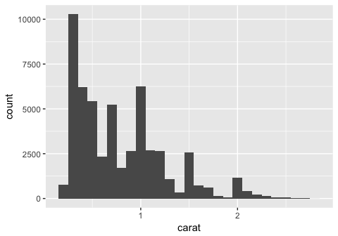

You can also overlay histogram-like data using geom\_freqpoly(). Here, the aesthetic mapping is further subgrouped by cut, using color. Each line shows up as a different color corresponding to the type of cut. We can see that the majority of ideal cuts have lower carats.

``` r
ggplot(data = smaller, mapping = aes(x = carat, colour = cut)) +
  geom_freqpoly(binwidth = 0.1)
```


Some of the common questions you can ask based on this type of data are:

-   Which values are the most common? Why?
-   Which values are rare? Why? Does that match your expectations?
-   Can you see any unusual patterns? What might explain them?

If there are clusters visible in your data, such as in the dataset, faithful:

``` r
# example of histogram with 2 clusters
ggplot(data = faithful, mapping = aes(x = eruptions)) +
  geom_histogram(binwidth = 0.25)
```


You might want to ask the following questions about the clusters:

-   How are the observations within each cluster similar to each other?
-   How are the observations in separate clusters different from each other?
-   How can you explain or describe the clusters?
-   Why might the appearance of clusters be misleading?

Sometimes histograms will reveal outliers or other unusual values. For example, why are the majority of values on the lefthand side of this plot?

``` r
ggplot(diamonds) +
  geom_histogram(mapping = aes(x = y), binwidth = 0.5)
```

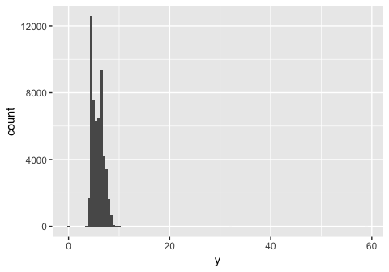

The histogram will plot all values, so if there are 1 or 2 values ith very high 'y' in a dataset with thousands of observations, these will still get plotted and not be immediately visible. A way to see them is to use coor\_cartesian(), as shown in the book.

``` r
ggplot(diamonds) +
  geom_histogram(mapping = aes(x = y), binwidth = 0.5) +
  coord_cartesian(ylim = c(0, 50))
```

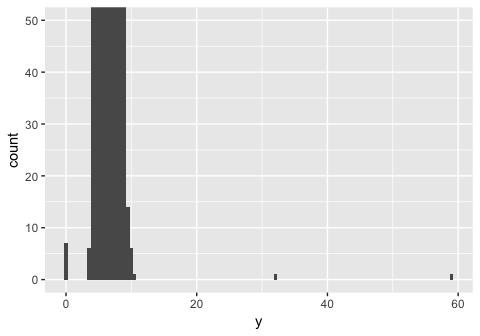 We can see now that there are some outlier values with very high 'y' values, which are the cause of the funny-looking histogram. You can pull out unusual values or outliers using dplyr commands (from chapter 4-6), to figure out why they are deviating from the rest of the data.

``` r
unusual <- diamonds %>%
  filter(y < 3 | y > 20) %>%
  select(price, x, y, z) %>%
  arrange(y)
unusual
```

    ## # A tibble: 9 x 4
    ##   price     x     y     z
    ##   <int> <dbl> <dbl> <dbl>
    ## 1  5139  0      0    0   
    ## 2  6381  0      0    0   
    ## 3 12800  0      0    0   
    ## 4 15686  0      0    0   
    ## 5 18034  0      0    0   
    ## 6  2130  0      0    0   
    ## 7  2130  0      0    0   
    ## 8  2075  5.15  31.8  5.12
    ## 9 12210  8.09  58.9  8.06

7.3.4 Exercises
---------------

### 1. Explore the distribution of each of the x, y, and z variables in diamonds. What do you learn? Think about a diamond and how you might decide which dimension is the length, width, and depth.

To explore the distributions of x, y, and z, we can plot a histogram for each of them. Alternatively, we can plot a boxplot, which also shows the distribution of values for each of the variables, as well as any outliers. We can see that for each of the values, there are indeed a few outliers that have very high or low values. However, for the most part, x and y are between 4-9, and z is between 2 and 6. We can also plot a scatterplot of x vs y or z and fit a linear model to the points. We can see that there is a strong positive correlation between x and y, and x and z.

``` r
# plot a histogram for x, y, and z separately
ggplot(diamonds, aes (x = x))+
  geom_histogram(binwidth = 0.2)
```


``` r
ggplot(diamonds, aes (x = y))+
  geom_histogram(binwidth = 0.2)
```

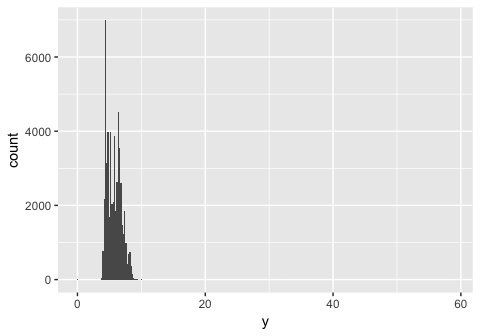

``` r
ggplot(diamonds, aes (x = z))+
  geom_histogram(binwidth = 0.2)
```

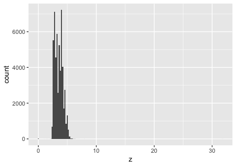

``` r
# or, reshape the data and plot a boxplot of the three variables side by side

library(reshape2)
```

    ##
    ## Attaching package: 'reshape2'

    ## The following object is masked from 'package:tidyr':
    ##
    ##     smiths

``` r
x_y_z_melt = melt( select(diamonds, x,y,z), measure.vars = c('x','y','z'))
ggplot(x_y_z_melt)+
  geom_boxplot(aes(x = variable, y = value))
```

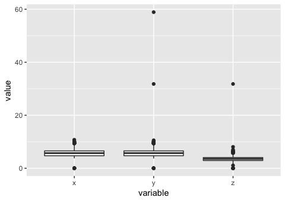

``` r
# get a numeric summary for all the columns in diamonds
summary(diamonds)
```

    ##      carat               cut        color        clarity     
    ##  Min.   :0.2000   Fair     : 1610   D: 6775   SI1    :13065  
    ##  1st Qu.:0.4000   Good     : 4906   E: 9797   VS2    :12258  
    ##  Median :0.7000   Very Good:12082   F: 9542   SI2    : 9194  
    ##  Mean   :0.7979   Premium  :13791   G:11292   VS1    : 8171  
    ##  3rd Qu.:1.0400   Ideal    :21551   H: 8304   VVS2   : 5066  
    ##  Max.   :5.0100                     I: 5422   VVS1   : 3655  
    ##                                     J: 2808   (Other): 2531  
    ##      depth           table           price             x         
    ##  Min.   :43.00   Min.   :43.00   Min.   :  326   Min.   : 0.000  
    ##  1st Qu.:61.00   1st Qu.:56.00   1st Qu.:  950   1st Qu.: 4.710  
    ##  Median :61.80   Median :57.00   Median : 2401   Median : 5.700  
    ##  Mean   :61.75   Mean   :57.46   Mean   : 3933   Mean   : 5.731  
    ##  3rd Qu.:62.50   3rd Qu.:59.00   3rd Qu.: 5324   3rd Qu.: 6.540  
    ##  Max.   :79.00   Max.   :95.00   Max.   :18823   Max.   :10.740  
    ##                                                                  
    ##        y                z         
    ##  Min.   : 0.000   Min.   : 0.000  
    ##  1st Qu.: 4.720   1st Qu.: 2.910  
    ##  Median : 5.710   Median : 3.530  
    ##  Mean   : 5.735   Mean   : 3.539  
    ##  3rd Qu.: 6.540   3rd Qu.: 4.040  
    ##  Max.   :58.900   Max.   :31.800  
    ##

``` r
# see how x correlates with y or z
ggplot (diamonds, aes(x = x, y = y)) +
  geom_point() +
  geom_smooth(method = 'lm', se = F)
```

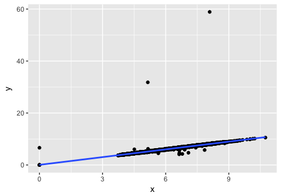

``` r
ggplot (diamonds, aes(x = x, y = z)) +
  geom_point()+
  geom_smooth(method = 'lm', se = F)
```


### 2. Explore the distribution of price. Do you discover anything unusual or surprising? (Hint: Carefully think about the binwidth and make sure you try a wide range of values.)

The distribution of price is skewed to the right (the tail is on the right side). The majority of prices are low, but there are a small amount of very high priced gems. The usual feature revealed by using smaller and smaller binwidth is that there seems to be an absence of diamonds with price 1500 +/- 50 (gap in the histogram).

``` r
#examine the distribution of price using various bin widths
ggplot (diamonds, aes (x = price))+
  geom_histogram(binwidth = 10)
```

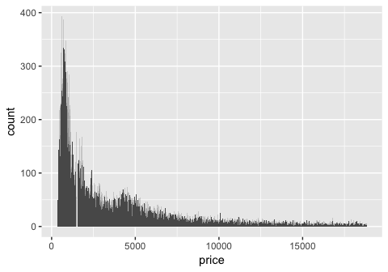

``` r
ggplot (diamonds, aes (x = price))+
  geom_histogram(binwidth = 50)
```


``` r
ggplot (diamonds, aes (x = price))+
  geom_histogram(binwidth = 500)
```


``` r
# zoom in on diamonds which are less than 2500 to examine the anomaly
ggplot(filter(diamonds, price < 2500), aes (x = price))+
  geom_histogram(binwidth = 5)
```


### 3. How many diamonds are 0.99 carat? How many are 1 carat? What do you think is the cause of the difference?

``` r
# use dplyr to filter data by diamonds with either 0.99 or 1 carat, then count each group
diamonds %>%
  filter (carat == 0.99 | carat == 1) %>%
  count (group_by = carat)
```

    ## # A tibble: 2 x 2
    ##   group_by     n
    ##      <dbl> <int>
    ## 1     0.99    23
    ## 2     1     1558

We see that there are 23 observations with 0.99 carat, and 1558 observations with 1 carat. This is a huge difference. There could be many explanations. Maybe diamonds of at least 1 carat can be sold at a higher price range, incentivizing the production of diamonds at least 1 carat and no less. Or, it could be due to an unconcious human tendancy to round to the nearest whole number.

### 4. Compare and contrast coord\_cartesian() vs xlim() or ylim() when zooming in on a histogram. What happens if you leave binwidth unset? What happens if you try and zoom so only half a bar shows?

When using ylim() to zoom in with the same parameters as coord\_cartesian, the values for bars that do not completely fall into view are omitted! As a result, limiting the y axis to between 0 and 50 removes almost the entire dataset! Leaving binwidth unset results in geom\_histogram() choosing a default binwidth. If you try and zoom so only half a bar shows, the bar will be omitted entirely but the rest of the bins will not change (there will be a gap).

``` r
# coord_cartesian() to zoom (book provided example)
ggplot(diamonds) +
  geom_histogram(mapping = aes(x = y), binwidth = 0.5) +
  coord_cartesian(ylim = c(0, 50))
```


``` r
# use  xlim() and ylim() to zoom
ggplot(diamonds) +
  geom_histogram(mapping = aes(x = y), binwidth = 0.5)+
  ylim(0,50)
```

    ## Warning: Removed 11 rows containing missing values (geom_bar).


``` r
#Use xlim and ylim, leave binwidth unset
ggplot(diamonds) +
  geom_histogram(mapping = aes(x = y))+
  ylim(0,10000)+
  xlim(0,10)
```

    ## `stat_bin()` using `bins = 30`. Pick better value with `binwidth`.

    ## Warning: Removed 5 rows containing non-finite values (stat_bin).

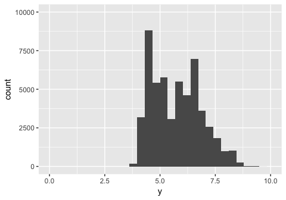

``` r
# leave binwidth unset, cut ylim off in the middle of a bar (it dissapears!)
ggplot(diamonds) +
  geom_histogram(mapping = aes(x = y))+
  ylim(0,7500)+
  xlim(0,10)
```

    ## `stat_bin()` using `bins = 30`. Pick better value with `binwidth`.

    ## Warning: Removed 5 rows containing non-finite values (stat_bin).

    ## Warning: Removed 1 rows containing missing values (geom_bar).

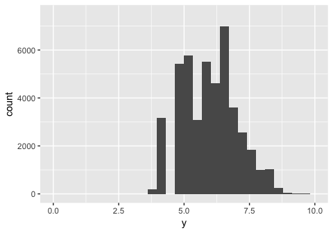

7.4 Missing Values
------------------

If there are unusual values in your dataset, you can either filter them out using filter(), or replace the values with NA using mutate(). Below are the provided examples for both:

``` r
# remove using filter()
diamonds2 <- diamonds %>%
  filter(between(y, 3, 20))
# replace with NA using mutate and ifelse()
diamonds2 <- diamonds %>%
  mutate(y = ifelse(y < 3 | y > 20, NA, y))
```

I find that ifelse() is particularly useful, since you can use it to replace only a subset of values in any column of choice. For example, if we wanted to raise the price of all diamonds with a currrent price over 2000 by 3000, we could say:

``` r
(raise_price <- diamonds %>%
  mutate(price = ifelse(price > 2000, price+3000, price)))
```

    ## # A tibble: 53,940 x 10
    ##    carat cut       color clarity depth table price     x     y     z
    ##    <dbl> <ord>     <ord> <ord>   <dbl> <dbl> <dbl> <dbl> <dbl> <dbl>
    ##  1 0.23  Ideal     E     SI2      61.5    55   326  3.95  3.98  2.43
    ##  2 0.21  Premium   E     SI1      59.8    61   326  3.89  3.84  2.31
    ##  3 0.23  Good      E     VS1      56.9    65   327  4.05  4.07  2.31
    ##  4 0.290 Premium   I     VS2      62.4    58   334  4.2   4.23  2.63
    ##  5 0.31  Good      J     SI2      63.3    58   335  4.34  4.35  2.75
    ##  6 0.24  Very Good J     VVS2     62.8    57   336  3.94  3.96  2.48
    ##  7 0.24  Very Good I     VVS1     62.3    57   336  3.95  3.98  2.47
    ##  8 0.26  Very Good H     SI1      61.9    55   337  4.07  4.11  2.53
    ##  9 0.22  Fair      E     VS2      65.1    61   337  3.87  3.78  2.49
    ## 10 0.23  Very Good H     VS1      59.4    61   338  4     4.05  2.39
    ## # ... with 53,930 more rows

Missing values may provide some insight into the data, even though they do not have values. For example, the presence of a missing value in a column such as dep\_time in the nycflights13 dataset suggests the flight was cancelled. You can then compare how the other attributes of a cancelled flight differ from a non-cancelled flight. The example provided by the book compares the distribution of sched\_dep\_time for cancelled vs non-cancelled flights:

``` r
nycflights13::flights %>%
  mutate(
    cancelled = is.na(dep_time),
    sched_hour = sched_dep_time %/% 100,
    sched_min = sched_dep_time %% 100,
    sched_dep_time = sched_hour + sched_min / 60
  ) %>%
  ggplot(mapping = aes(sched_dep_time)) +
    geom_freqpoly(mapping = aes(colour = cancelled), binwidth = 1/4)
```


7.4.1 Exercises
---------------

### 1. What happens to missing values in a histogram? What happens to missing values in a bar chart? Why is there a difference?

both ?geom\_bar and ?geom\_histogram state that "na.rm - If FALSE, the default, missing values are removed with a warning. If TRUE, missing values are silently removed." So, for both, missing values are omitted in either case. In terms of how this affects the plots, it looks like for histograms, there is a gap where the values used to be. For bar plots, the count is reduced for the category the NA value used to be in (geom\_bar() is associated with the stat function count(), which counts the non-missing values for each category). This has significance for bar plots since if the majority of values in a certain category were missing values, the displayed counts would be low but the viewer would be unaware of the underlying reason as to why.

``` r
# histogram of vector of random numbers, normally distributed
x <- data.frame(x = rnorm(100,5,3))
head(x)
```

    ##          x
    ## 1 5.882593
    ## 2 4.401981
    ## 3 5.082233
    ## 4 2.940216
    ## 5 3.823540
    ## 6 1.701539

``` r
ggplot(x, aes(x))+
  geom_histogram()
```

    ## `stat_bin()` using `bins = 30`. Pick better value with `binwidth`.

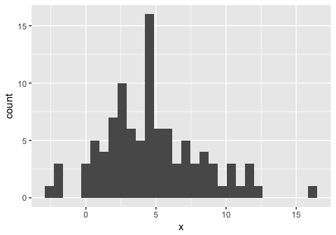

``` r
# replace a chunk of values with NA and see what that does to the histogram.
add_na <- mutate(x, x = ifelse(x > 5 & x <8, NA, x))
head(add_na)
```

    ##          x
    ## 1       NA
    ## 2 4.401981
    ## 3       NA
    ## 4 2.940216
    ## 5 3.823540
    ## 6 1.701539

``` r
ggplot(add_na, aes(x))+
  geom_histogram()
```

    ## `stat_bin()` using `bins = 30`. Pick better value with `binwidth`.

    ## Warning: Removed 20 rows containing non-finite values (stat_bin).

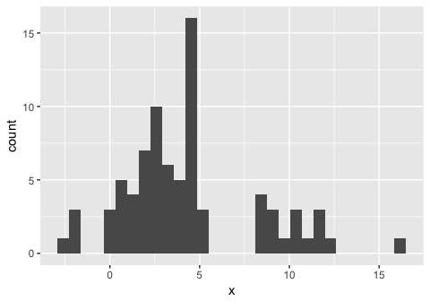

### 2. What does na.rm = TRUE do in mean() and sum()?

mean(), by default, has na.rm = FALSE, which does not remove the NA values prior to calculating the mean. It will try to calculate the mean including the NA value, which evaluates to NA. The same applies for sum(). If you set na.rm = TRUE for both functions, the NA values are removed prior to calculating, and a non-missing value is returned.

``` r
# calculate the sum of vector without NA values, na.rm = FALSE by default
(x <- 1:10)
```

    ##  [1]  1  2  3  4  5  6  7  8  9 10

``` r
mean(x)
```

    ## [1] 5.5

``` r
sum(x)
```

    ## [1] 55

``` r
# calculate the sum of vector containing NA values, na.rm = FALSE by default
(x <- append(x, c(NA,NA)))
```

    ##  [1]  1  2  3  4  5  6  7  8  9 10 NA NA

``` r
mean(x)
```

    ## [1] NA

``` r
sum(x)
```

    ## [1] NA

``` r
# calculate the sum of vector without NA values, setting na.rm = TRUE
mean(x, na.rm = T)
```

    ## [1] 5.5

``` r
sum(x, na.rm = T)
```

    ## [1] 55

7.5 Covariation
---------------

Covariation is how the values of two or more variables are related - in other words, is there a correlation between two or more variables, or columns (if the data is tidy), of your dataset? Knowing this is important, since it may affect the types of parameters you choose when building models (for example, multicollinearity issues when performing OLS).

7.5.1 A categorical and continuous variable
-------------------------------------------

Default for geom\_freqpoly() is to plot the individual groups by count, so if any one group has a lot of observations, it might mask effects in groups that have small numbers of observations. Below, since ideal cuts have the majority of counts, it looks overrepresented in the freqpoly() graph.

``` r
ggplot(data = diamonds, mapping = aes(x = price)) +
  geom_freqpoly(mapping = aes(colour = cut), binwidth = 500)
```

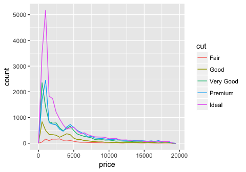

``` r
ggplot(diamonds) +
  geom_bar(mapping = aes(x = cut))
```

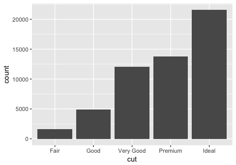

To normalize all the counts and plot the distributions by density, use y= ..density..

``` r
ggplot(data = diamonds, mapping = aes(x = price, y = ..density..)) +
  geom_freqpoly(mapping = aes(colour = cut), binwidth = 500)
```

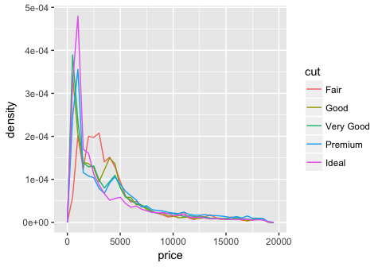

The book notes that there is something surprising about this plot. It shows that diamonds with an ideal cut cost on average lower than diamonds with a fair cut, which is initially counterintuitive. We would have expected that ideal cuts, because of their higher quality cut, cost more. What might be happening here is that there is a hidden 3rd variable that is related to cut and price. Perhaps ideal cuts are on average smaller in size, and prices of small diamonds tend to be small.

Boxplots also give a great sense of the spread of the data. You can think of a boxplot as a histogram turned on its side and summarized by its median, and IQR. Here is the provided boxplot of the distribution of price by cut:

``` r
ggplot(data = diamonds, mapping = aes(x = cut, y = price)) +
  geom_boxplot()
```

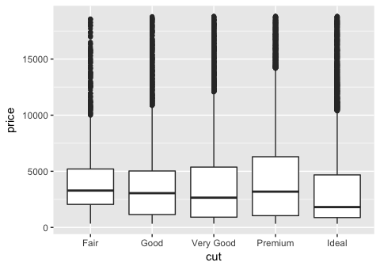

We can see again that ideal diamonds have a lower median price than fair diamonds, as we learned from the individual freqpoly graphs.

Another provided example is the boxplot of the mtcars dataset (mileage by car class):

``` r
ggplot(data = mpg, mapping = aes(x = class, y = hwy)) +
  geom_boxplot()
```

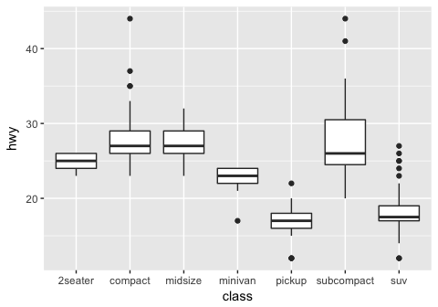

A useful way to reorganize the categorical variables on the x-axis is to use reorder(). I think organized graphs are great! We can order the x axis based on a statistic, in this case the median:

``` r
ggplot(data = mpg) +
  geom_boxplot(mapping = aes(x = reorder(class, hwy, FUN = median), y = hwy))
```

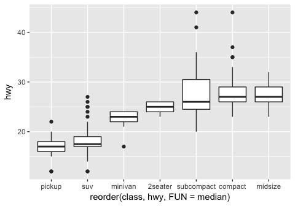

We learned this in chapter 3, but a way to flip the axes is to add a coord\_flip() function to your ggplot. This is useful when you have long axis labels. I prefer tilting the labels by 45 degrees by modifying the tilt using `theme(axis.text.x = element_text(angle = 45, hjust = 1))`.

``` r
ggplot(data = mpg) +
  geom_boxplot(mapping = aes(x = reorder(class, hwy, FUN = median), y = hwy)) +
  coord_flip()
```

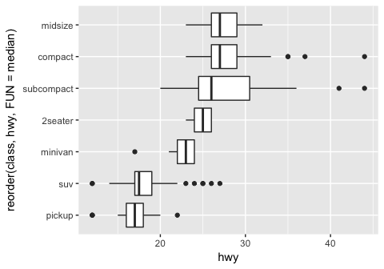

7.5.1.1 Exercises
-----------------

### 1. Use what you’ve learned to improve the visualisation of the departure times of cancelled vs. non-cancelled flights.

The provided geom\_freqpoly() visualization for cancelled vs non-cancelled flights had the issue of there being many more non-cancelled flights than cancelled flights. To fix this, we will use y = ..density.. instead of the total count for the graph, so that we can better see the how the trends compare in each of the groups.

``` r
nycflights13::flights %>%
  mutate(
    cancelled = is.na(dep_time),
    sched_hour = sched_dep_time %/% 100,
    sched_min = sched_dep_time %% 100,
    sched_dep_time = sched_hour + sched_min / 60
  ) %>%
  ggplot(mapping = aes(sched_dep_time, y = ..density..)) +
    geom_freqpoly(mapping = aes(colour = cancelled), binwidth = 1/4)
```

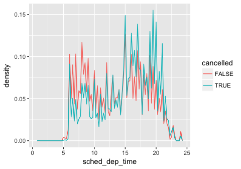

From the overlaid & normalized graphs, we observe that more cancellations occur for flights scheduled to depart between hours 15-22.

### 2. What variable in the diamonds dataset is most important for predicting the price of a diamond? How is that variable correlated with cut? Why does the combination of those two relationships lead to lower quality diamonds being more expensive?

To look for variables that are most useful for predicting the price of the diamond, we can use the cor() function to compute the correlation matrix for all numerical columns. It will show us what is the correlation between any pairwise combination of variables.

``` r
cor(diamonds[,c(1,5:10)], use = 'all.obs')
```

    ##            carat       depth      table      price           x           y
    ## carat 1.00000000  0.02822431  0.1816175  0.9215913  0.97509423  0.95172220
    ## depth 0.02822431  1.00000000 -0.2957785 -0.0106474 -0.02528925 -0.02934067
    ## table 0.18161755 -0.29577852  1.0000000  0.1271339  0.19534428  0.18376015
    ## price 0.92159130 -0.01064740  0.1271339  1.0000000  0.88443516  0.86542090
    ## x     0.97509423 -0.02528925  0.1953443  0.8844352  1.00000000  0.97470148
    ## y     0.95172220 -0.02934067  0.1837601  0.8654209  0.97470148  1.00000000
    ## z     0.95338738  0.09492388  0.1509287  0.8612494  0.97077180  0.95200572
    ##                z
    ## carat 0.95338738
    ## depth 0.09492388
    ## table 0.15092869
    ## price 0.86124944
    ## x     0.97077180
    ## y     0.95200572
    ## z     1.00000000

We observe that the highest correlation with price is carat. To observe how carat is correlated with cut, we can plot a boxplot of carat vs cut:

``` r
ggplot(diamonds, aes(x = reorder(cut, carat, FUN = median), y = carat))+
  geom_boxplot()
```

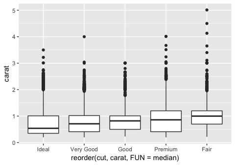

From this graph we see that ideal cuts have the lowest carat, whereas the fair cuts have the largest carat. By pairing this information with the positive correlation between carat and price, this suggests that ideal cuts on average cost less than fair cuts, because ideal cuts have, on average, lower carat. This explains what we saw in the geom\_freqpoly() plot earlier in the chapter, in which we were puzzled as to why ideal cuts had a lower median price than fair cuts. It is because the ideal cut diamonds were smaller on average!

### 3. Install the ggstance package, and create a horizontal boxplot. How does this compare to using coord\_flip()?

I plotted the graph from part 2 using either coord\_flip() or geom\_boxploth() from the ggstance package. For a horizontal plot using geom\_boxploth(), you have to specify y = {your categorical variable} instead of x. The plots look identical.

``` r
# install ggstance using the commented command below
# install.packages("ggstance")
library(ggstance)
```

    ##
    ## Attaching package: 'ggstance'

    ## The following objects are masked from 'package:ggplot2':
    ##
    ##     geom_errorbarh, GeomErrorbarh

``` r
# horizontal boxplot from question #2, using coord_flip()
ggplot(diamonds, aes(x = reorder(cut, carat, FUN = median), y = carat))+
  geom_boxplot()+
  coord_flip()
```

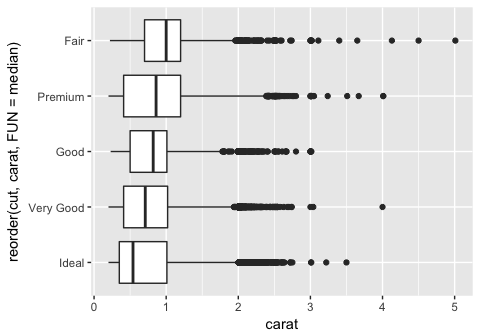

``` r
# horizontal boxplot from question #2, using ggstance geom_boxploth()
ggplot(diamonds, aes(x = carat, y = reorder(cut, carat, FUN = median)))+
  geom_boxploth()
```


### 4. One problem with boxplots is that they were developed in an era of much smaller datasets and tend to display a prohibitively large number of “outlying values”. One approach to remedy this problem is the letter value plot. Install the lvplot package, and try using geom\_lv() to display the distribution of price vs cut. What do you learn? How do you interpret the plots?

It seems like for each category, the plot is widest where most of the points are aggregated. So for the "fair" diamonds, we can see that the widest part of the plot is higher than the widest point of the plot for the "ideal" diamonds, which matches what is represented by the traditional boxplot.

``` r
# install lvplot package - if you get a ggproto error, make sure to specify type = "source" when installing.
# install.packages("lvplot", type = "source")
library(lvplot)

ggplot(diamonds, aes(x = cut, y = price))+
  geom_lv()
```

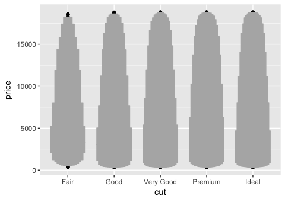

### 5. Compare and contrast geom\_violin() with a facetted geom\_histogram(), or a coloured geom\_freqpoly(). What are the pros and cons of each method?

Below I compare the three methods specified. The violin plot gives a fast look at where the majority of the points are aggregated. The faceted geom\_histogram allows us to examine the raw distribution of values for each category more closely, but the axis scales can be frustrating if the total count differs a lot between groups. It might be better to plot a facetted density histogram instead. A colored geom\_freqpoly() displays the overlapping distributions in line form. If too many distributions are plotted on the same graph, it might be hard to decipher the differences between each individual plot quickly.

``` r
# geom_violin()
ggplot(diamonds, aes(cut, price))+
  geom_violin()
```

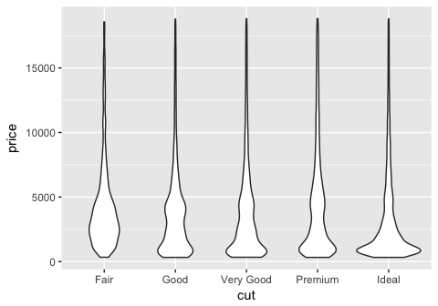

``` r
# geom_histogram + facet_wrap()
ggplot(diamonds)+
  geom_histogram(aes(x = price), binwidth = 500)+
  facet_wrap(~ cut)
```

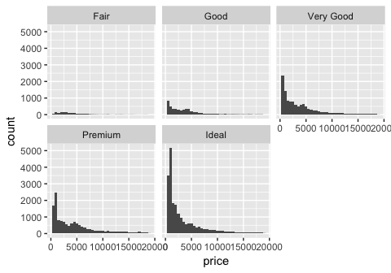

``` r
# geom_histogram + facet_wrap()
ggplot(diamonds)+
  geom_histogram(aes(x = price, y = ..density..), binwidth = 500)+
  facet_wrap(~ cut)
```

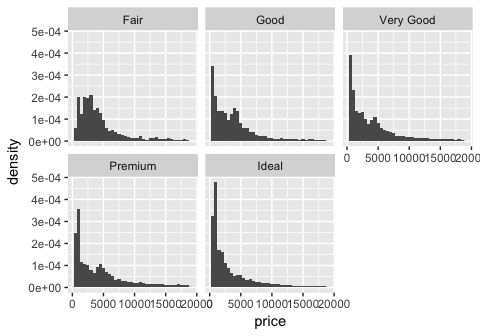

``` r
# geom_freqpoly()
ggplot(diamonds, aes(x = price, y = ..density.., color = cut))+
  geom_freqpoly(binwidth = 500)
```


### 6. If you have a small dataset, it’s sometimes useful to use geom\_jitter() to see the relationship between a continuous and categorical variable. The ggbeeswarm package provides a number of methods similar to geom\_jitter(). List them and briefly describe what each one does.

The plots generated by geom\_jitter() are very similar to the stripchart() from baseR. Here, performing geom\_jitter() on the entire diamonds dataset is not very informative since there are too many datapoints flooding the plot. So, I take a smaller, random sample from the data and plot it using both geom\_jitter() and stripchart(). We can see that the plots are very similar! Next, I use the geom\_quasirandom() plot from the ggbeeswarm package to plot the same data. It produces a more organized plot; rather than random jitter, it groups the points together in a particular fashion (see plot). This makes comparing categories which have different numbers of observations slightly easier, and might reveal some sort of underlying distribution in the data. The method described in the ggbeeswarm github repo is geom\_beeswarm(). This is similar to geom\_quasirandom except for large numbers of observations the points spread out more horizontally and may overlap with other columns.

``` r
# sample 1000 observations randomly from diamonds
(smaller_diamonds <- sample_n(diamonds, 1000, replace = FALSE))
```

    ## # A tibble: 1,000 x 10
    ##    carat cut       color clarity depth table price     x     y     z
    ##    <dbl> <ord>     <ord> <ord>   <dbl> <dbl> <int> <dbl> <dbl> <dbl>
    ##  1  0.32 Ideal     D     VS2      62.2    55   758  4.37  4.41  2.73
    ##  2  0.7  Ideal     E     SI1      61.9    55  2537  5.74  5.77  3.56
    ##  3  0.53 Ideal     D     VS2      61.2    55  1956  5.25  5.21  3.2
    ##  4  0.51 Premium   D     VVS2     62.4    59  2387  5.13  5.06  3.18
    ##  5  0.7  Premium   D     SI2      59.3    59  2562  5.79  5.74  3.42
    ##  6  0.3  Premium   D     SI2      60.9    58   574  4.32  4.29  2.62
    ##  7  1.02 Ideal     G     SI1      62.1    55  5426  6.46  6.49  4.02
    ##  8  1.21 Ideal     E     SI1      61.8    56  8863  6.82  6.86  4.23
    ##  9  0.68 Very Good G     VS1      60.7    58  2114  5.68  5.75  3.47
    ## 10  1.01 Ideal     F     VS1      63.2    56  7209  6.35  6.41  4.03
    ## # ... with 990 more rows

``` r
# geom_jitter()
ggplot(smaller_diamonds, aes(cut,price))+
  geom_jitter()
```

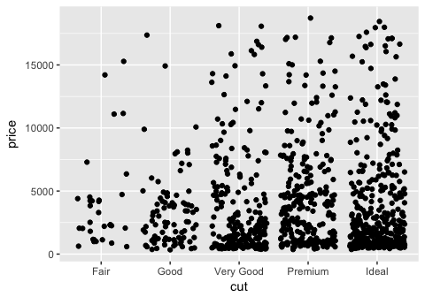

``` r
# base R stripchart
stripchart(price~cut, data = smaller_diamonds, method = "jitter", jitter = 0.1, vertical = TRUE)
```

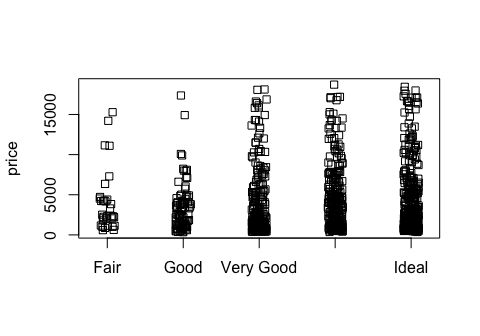

``` r
#install.packages("ggbeeswarm")
library(ggbeeswarm)

# ggbeeswarm geom_quasirandom()
ggplot(smaller_diamonds, aes(cut,price))+
  geom_quasirandom()
```


``` r
# ggbeeswarm geom_beeswarm()
ggplot(smaller_diamonds, aes(cut,price))+
  geom_beeswarm()
```

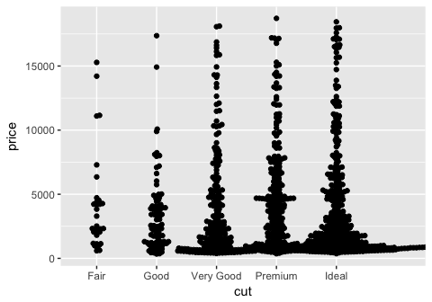

7.5.2 Two categorical variables
-------------------------------

If you are interested in comparing two categorical variables, usually you would count the pairwise frequencies of each of the factors across both categorical variables.

``` r
ggplot(data = diamonds) +
  geom_count(mapping = aes(x = cut, y = color))
```

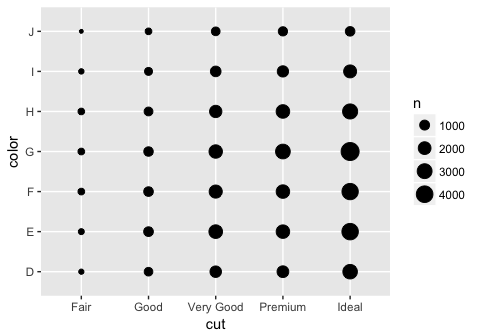

The other example in the book is to first count each of the pairs then plot using a heatmap, or geom\_tile(). This shows basically the same information as the plot above, except instead of the size of the dot being bigger with larger counts, the color of the tile changes.

``` r
diamonds %>%
  count(color, cut)
```

    ## # A tibble: 35 x 3
    ##    color cut           n
    ##    <ord> <ord>     <int>
    ##  1 D     Fair        163
    ##  2 D     Good        662
    ##  3 D     Very Good  1513
    ##  4 D     Premium    1603
    ##  5 D     Ideal      2834
    ##  6 E     Fair        224
    ##  7 E     Good        933
    ##  8 E     Very Good  2400
    ##  9 E     Premium    2337
    ## 10 E     Ideal      3903
    ## # ... with 25 more rows

``` r
diamonds %>%
  count(color, cut) %>%  
  ggplot(mapping = aes(x = color, y = cut)) +
    geom_tile(mapping = aes(fill = n)) +
    coord_flip()
```

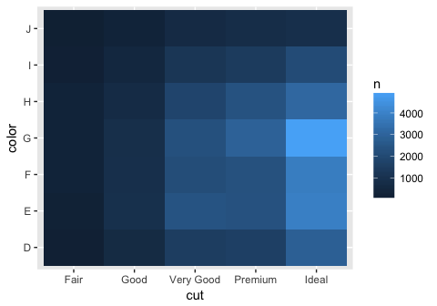

7.5.2.1 Exercises
-----------------

### 1. How could you rescale the count dataset above to more clearly show the distribution of cut within colour, or colour within cut?

Depending on the distribution you want to observe, you can: within a color, display the proportion of observations that were of a certain cut, or within a cut, display the proportion of observations that were of a certain color. Alternatively, using a stacked bar would be more straightforward to visualise this, instead of the geom\_tile() heatmap.

``` r
# show distribution of color within cut
diamonds %>%
  count(color, cut) %>%  
  group_by(cut) %>%
  mutate (by_cut_prop = n/sum(n)) %>%
  ggplot(mapping = aes(x = color, y = cut)) +
    geom_tile(mapping = aes(fill = by_cut_prop)) +
    coord_flip()  
```

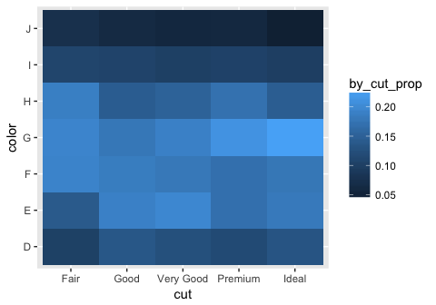

``` r
# barplot distribution of color within cut
diamonds %>%
  ggplot(aes(x = cut, fill = color))+
  geom_bar(position = 'fill')
```

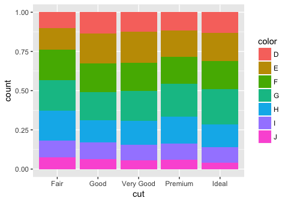

``` r
# show distribution of cut within color
diamonds %>%
  count(color, cut) %>%  
  group_by(color) %>%
  mutate (by_color_prop = n/sum(n)) %>%
  ggplot(mapping = aes(x = color, y = cut)) +
    geom_tile(mapping = aes(fill = by_color_prop)) +
    coord_flip()  
```

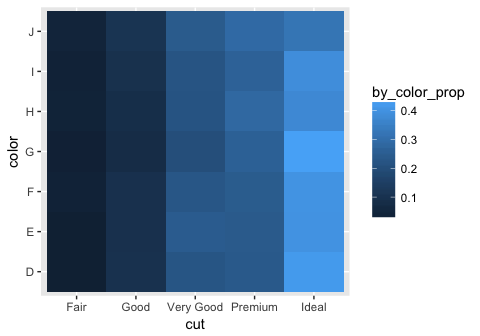

``` r
# barplot distribution of cut within color
diamonds %>%
  ggplot(aes(x = color, fill = cut))+
  geom_bar(position = 'fill')
```


### 2. Use geom\_tile() together with dplyr to explore how average flight delays vary by destination and month of year. What makes the plot difficult to read? How could you improve it?

Using dplyr, first group by destination and month, then compute the average flight delay for each month/dest using summarize(). Then, pipe the result into a geom\_tile call. The large number of destinations makes the plot difficult to read. You can flip the coords so that the destinations will be on the y axis. In general, the problem with this plot is that there are too many items to keep track of.

``` r
library(nycflights13)
flights %>%
  group_by(dest, month) %>%
  summarize ( avg_delay = mean(dep_delay, na.rm = T)) %>%
  ggplot(mapping = aes(x = dest, y = month)) +
    geom_tile(mapping = aes(fill = avg_delay)) +
  coord_flip()
```

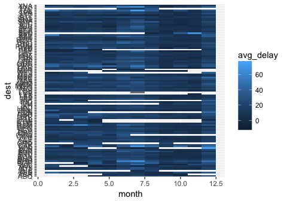

### 3. Why is it slightly better to use aes(x = color, y = cut) rather than aes(x = cut, y = color) in the example above?

One reason is that the axis labels are less likely to overlap if cut is on the y axis. Otherwise, using x = cut and y = color simply flips the coordinate axis on the plot. This does not change the interpretation of the plot, so I would say that the change is insignificant when looking at the big picture. Below are the two versions of the plots.

``` r
# provided example, x = color, y = cut
diamonds %>%
  count(color, cut) %>%  
  ggplot(mapping = aes(x = color, y = cut)) +
    geom_tile(mapping = aes(fill = n))
```

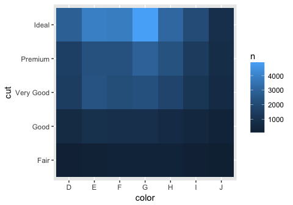

``` r
# switch axes, x = cut, y = color
diamonds %>%
  count(color, cut) %>%  
  ggplot(mapping = aes(x = cut, y = color)) +
    geom_tile(mapping = aes(fill = n))
```


7.5.3 Two continuous variables
------------------------------

To visualize the relationship between two continuous variables, use a scatterplot, or geom\_point(). If working with large numbers of points, it might be better to make the points slightly transparent using an alpha value.

``` r
# standard scatterplot
ggplot(data = diamonds) +
  geom_point(mapping = aes(x = carat, y = price))
```

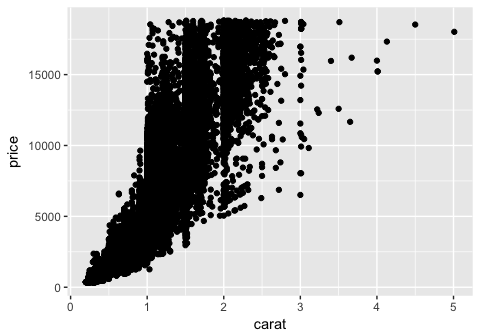

``` r
# make points transparent
ggplot(data = diamonds) +
  geom_point(mapping = aes(x = carat, y = price), alpha = 1 / 100)
```

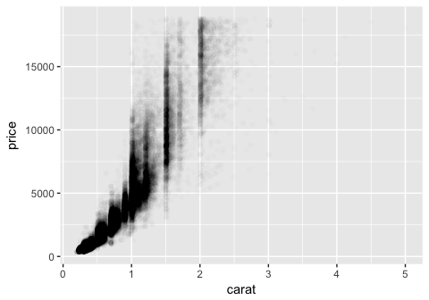

Another way to plot the observations if there are too many points is to use geom\_bin2d. As the name suggests, the plot is binned and colored based on how many observations fall into each bin. This looks similar to a density plot, in which you can see where the majority of points lie. geom\_hex() looks like a fancy version of geom\_bin2d().

``` r
ggplot(data = diamonds) +
  geom_bin2d(mapping = aes(x = carat, y = price))
```


``` r
# install.packages("hexbin")
ggplot(data = diamonds) +
  geom_hex(mapping = aes(x = carat, y = price))
```

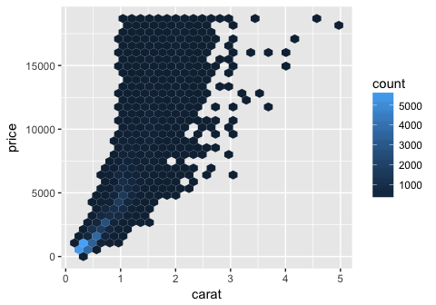

The book also suggests binning one of the continuous variables and plotting boxplots for the other variable for each bin created. There are two ways to bin, using either cut\_width() or cut\_number(). cut\_width() keeps the increment the same for each bin, whereas cut\_number() keeps the number of observations the same.

``` r
# filter dataset to only keep observations with carat < 3
smaller <- diamonds %>%
  filter(carat < 3)

# cut_width binning
ggplot(data = smaller, mapping = aes(x = carat, y = price)) +
  geom_boxplot(mapping = aes(group = cut_width(carat, 0.1)))
```

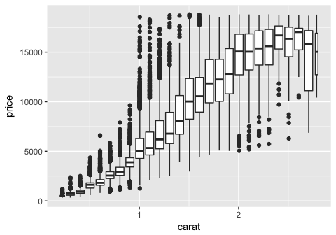

``` r
# cut_number binning
ggplot(data = smaller, mapping = aes(x = carat, y = price)) +
  geom_boxplot(mapping = aes(group = cut_number(carat, 20)))
```


7.5.3.1 Exercises
-----------------

### 1. Instead of summarising the conditional distribution with a boxplot, you could use a frequency polygon. What do you need to consider when using cut\_width() vs cut\_number()? How does that impact a visualisation of the 2d distribution of carat and price?

When using cut\_width(), you must consider the range of the distribution of the variable you are binning. For example, you shouldn't bin by a number larger than the range of carat, or by a number too small (too many bins). If an inappropriate bin size is chosen, the data could be uninterpretable. This goes for cut\_number() too. Selecting an appropriate number of bins to create for cut\_number() is slightly different. We have to take into account the number of observations that fall into each price category. Suppose the distribution of price was skewed to the right (small number of very high priced observations). This would result in a misleading cut\_number() distribution.

``` r
# visualize price binning by carat, cut_width()
ggplot(smaller, aes(x = price, y = ..density..,)) +
  geom_freqpoly(aes(color = cut_width(carat, 0.5)))
```

    ## `stat_bin()` using `bins = 30`. Pick better value with `binwidth`.

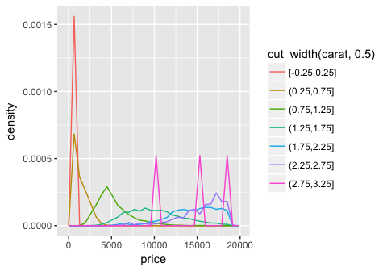

``` r
# visualize price binning by carat, cut_number(), 10 bins
ggplot(smaller, aes(x = price, y = ..density..,)) +
  geom_freqpoly(aes(color = cut_number(carat, 10)))
```

    ## `stat_bin()` using `bins = 30`. Pick better value with `binwidth`.

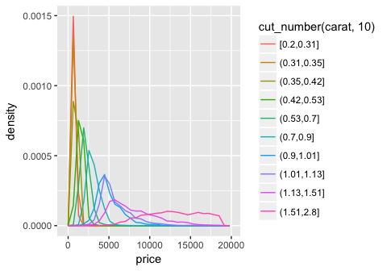

### 2. Visualise the distribution of carat, partitioned by price.

To get this distribution, switch carat and price in the code from the previous question.

``` r
# visualize distribution of carat, binning price, cut_number()
ggplot(smaller, aes(x = carat, y = ..density..)) +
  geom_freqpoly(aes(color = cut_number(price, 10)))
```

    ## `stat_bin()` using `bins = 30`. Pick better value with `binwidth`.

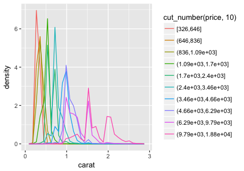

``` r
# visualize distribution of carat, binning price, cut_width()
ggplot(smaller, aes(x = carat, y = ..density..)) +
  geom_freqpoly(aes(color = cut_width(price, 5000)))
```

    ## `stat_bin()` using `bins = 30`. Pick better value with `binwidth`.

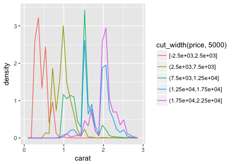

### 3. How does the price distribution of very large diamonds compare to small diamonds. Is it as you expect, or does it surprise you?

Based on the graphs in question 1 and 2, very large diamonds (high carat) are, on average, priced higher than small diamonds (low carat). This is as I would expect. Looking at the distribution of carat size partitioned by price (cut\_width() of 5000), we see that the majority of highest priced diamonds have high carat sizes.

### 4. Combine two of the techniques you’ve learned to visualise the combined distribution of cut, carat, and price.

One way to combine the 3 parameters in one visualization is to use facetting. To visualise how the distributoin of carat and price compare within each category of cut, we can facet either a scatterplot (a binned scatterplot might be better in this case, since there are so many points), or the freqpoly() graphs that we generated previously. We observe from the binned scatterplot that there is a large concentration of points (light blue color) at a low carat and low price. For all types of cuts, price correlates positively with carat. We can also facet the distribution of price vs cut by carat using cut\_number(). In this plot we observe that, again, for all cut types, price correlates with higher carat size.

``` r
# visualize price vs carat, faceting by cut
ggplot (diamonds, aes(carat, price))+
  geom_bin2d( )+
  facet_wrap(~cut)
```

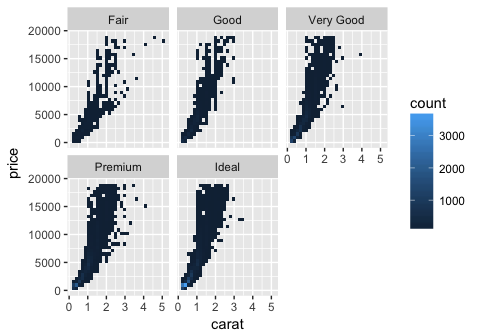

``` r
# visualize price binning by carat, cut_number(), 10 bins
ggplot(diamonds, aes(x = price, y = ..density..)) +
  geom_freqpoly(aes(color = cut_number(carat, 10)))+
  facet_wrap(~cut)
```

    ## `stat_bin()` using `bins = 30`. Pick better value with `binwidth`.

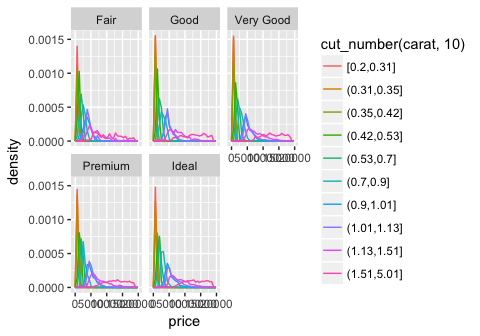

``` r
# visualize price vs cut, binning by carat, 3 bins
ggplot(diamonds, aes(x = cut, y = price)) +
  geom_boxplot()+
  facet_wrap(~cut_number(carat, 3))+
  theme(axis.text.x = element_text(angle = 45, hjust = 1))
```

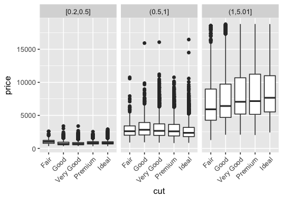

### 5. Two dimensional plots reveal outliers that are not visible in one dimensional plots. For example, some points in the plot below have an unusual combination of x and y values, which makes the points outliers even though their x and y values appear normal when examined separately. Why is a scatterplot a better display than a binned plot for this case?

Because the correlation of x and y is so strong, it becomes easy to find the outliers in the graph below. For example, we might wonder why the outlier with a x-value of 6.7 only had a y value of 4, since the majority of other points with x-values of 6.7 had y-values of near 6.7 as well. A scatter plot allows us to see these individual points, since a scatter plot simply plots all the points in the dataset on the graph. A binned plot using geom\_bin2d() or geom\_hex() may mask a lot of the outliers, depending on the bin size. An outlier, if included in a bin with non-outliers, will go undetected.

Binning only one of the continuous variables will have less caveats, but may still result in issues. In the example below, I've binned the plot using a cut\_width of 0.5, and plotted boxplots for each interval. We can see that while most of the outliers are preserved, the x-values have been shifted to match the center of each bin.

``` r
# the provided scatterplot
ggplot(data = diamonds) +
  geom_point(mapping = aes(x = x, y = y)) +
  coord_cartesian(xlim = c(4, 11), ylim = c(4, 11))
```

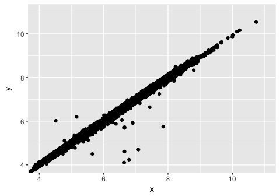

``` r
# bin using geom_hex. default graph is quite ugly and bins include outliers
ggplot(data = diamonds) +
  geom_hex(mapping = aes(x = x, y = y)) +
  coord_cartesian(xlim = c(4, 11), ylim = c(4, 11))
```

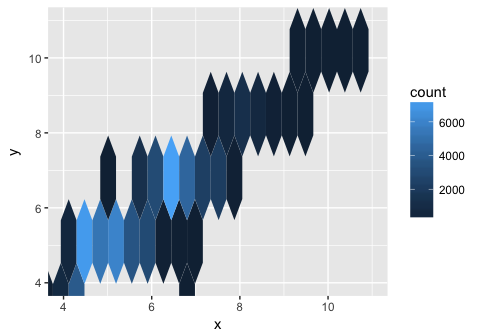

``` r
# a binned boxplot of the same data
ggplot(data = diamonds) +
  geom_boxplot(mapping = aes(x = x, y = y, group = cut_width (x, 0.5))) +
  coord_cartesian(xlim = c(4, 11), ylim = c(4, 11))
```

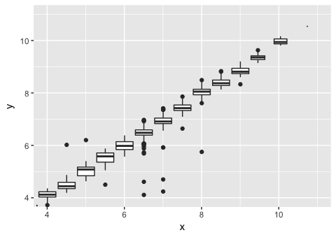

7.6 Patterns and models
-----------------------

Some important questions to ask when discovering a pattern in the data are:

-   Could this pattern be due to coincidence (i.e. random chance)?
-   How can you describe the relationship implied by the pattern?
-   How strong is the relationship implied by the pattern?
-   What other variables might affect the relationship?
-   Does the relationship change if you look at individual subgroups of the data?

By identifying patterns between variables, we can model the pattern and even use this information to learn more about other aspects of the data. As explained earlier, it was puzzling why ideal cut diamonds cost less than lower grade, fair cut diamonds. This was due to the fact that more ideal cut diamonds were smaller in carat, which resulted in the lower price. By identifying this pattern, we can subtract the influence of carat on price, and examine how the cut quality correlates with price after doing so. The book provides the following code, which fits a linear model (lm) between price and carat (mod), adds a transformed value of the residuals (observed value of price - expected value of price based solely on carat size) to the diamonds dataset, then plots the relationship between carat and the residual. We observe that the residuals are higher with ideal cuts than with fair cuts, as expected. We can interpret this as: if carat size was kept constant, ideal cuts cost more than fair cuts on average.

``` r
library(modelr)

mod <- lm(log(price) ~ log(carat), data = diamonds)

(diamonds2 <- diamonds %>%
  add_residuals(mod) %>%
  mutate(resid = exp(resid)))
```

    ## # A tibble: 53,940 x 11
    ##    carat cut       color clarity depth table price     x     y     z resid
    ##    <dbl> <ord>     <ord> <ord>   <dbl> <dbl> <int> <dbl> <dbl> <dbl> <dbl>
    ##  1 0.23  Ideal     E     SI2      61.5    55   326  3.95  3.98  2.43 0.820
    ##  2 0.21  Premium   E     SI1      59.8    61   326  3.89  3.84  2.31 0.955
    ##  3 0.23  Good      E     VS1      56.9    65   327  4.05  4.07  2.31 0.822
    ##  4 0.290 Premium   I     VS2      62.4    58   334  4.2   4.23  2.63 0.569
    ##  5 0.31  Good      J     SI2      63.3    58   335  4.34  4.35  2.75 0.511
    ##  6 0.24  Very Good J     VVS2     62.8    57   336  3.94  3.96  2.48 0.787
    ##  7 0.24  Very Good I     VVS1     62.3    57   336  3.95  3.98  2.47 0.787
    ##  8 0.26  Very Good H     SI1      61.9    55   337  4.07  4.11  2.53 0.690
    ##  9 0.22  Fair      E     VS2      65.1    61   337  3.87  3.78  2.49 0.913
    ## 10 0.23  Very Good H     VS1      59.4    61   338  4     4.05  2.39 0.850
    ## # ... with 53,930 more rows

``` r
ggplot(data = diamonds2) +
  geom_boxplot(mapping = aes(x = cut, y = resid))
```


Chapter 8 - Workflow: Projects
==============================

To ensure reproducibility, I agree with the book that it is best to set RStudio to not preserve your workspace between sessions. You can also do the following to refresh your script:

-   Press Cmd/Ctrl + Shift + F10 to restart RStudio.
-   Press Cmd/Ctrl + Shift + S to rerun the current script.

It is also very important to keep your analysis organized. Have all your plots saved along with your analysis script, and the copies of the raw data in the same folder as your R script/R notebook. A way that RStudio can facilitate organization is through the Projects feature. By creating a RStudio project (.Rproj) in a specified directory, any scripts that you work on for the project will know to look in that directory when you read / write files, which saves time.

Whether you choose to use this feature or not, it is important to stay organized and have an easy way to return to a project and know what you did and which files / code are required to reproduce the analysis.

------------------------------------------------------------------------

Thanks for reading through my walkthrough of chapter 7-8! I hope you found my solutions to the exercises informative. A walkthrough of chapters 9-13 can be found at [r4ds\_p4\_chapters9-13\_walkthrough.md](https://github.com/erilu/R-for-data-science-walkthrough/blob/master/r4ds_p4_chapters9-13_walkthrough.md).
