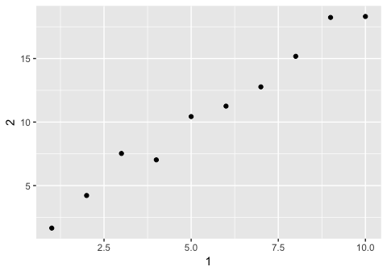

R for Data Science Walkthrough Chapters 9-13
================
Erick Lu

-   [Chapter 9 Introduction](#chapter-9-introduction)
-   [Chapter 10 Tibbles](#chapter-10-tibbles)
    -   [10.5 Exercises](#exercises)
-   [Chapter 11 Data Import](#chapter-11-data-import)
    -   [11.2 Getting started - reading in files](#getting-started---reading-in-files)
    -   [11.2.2 Exercises](#exercises-1)
    -   [11.3 Parsing a vector](#parsing-a-vector)
    -   [11.3.5 Exercises](#exercises-2)
    -   [11.4 Parsing a file](#parsing-a-file)
    -   [11.5 Writing to a file](#writing-to-a-file)
-   [Chapter 12 Tidy Data](#chapter-12-tidy-data)
    -   [12.2.1 Exercises](#exercises-3)
    -   [12.3.1 Spreading and Gathering](#spreading-and-gathering)
    -   [12.3.3 Exercises](#exercises-4)
    -   [12.4 Separating and uniting](#separating-and-uniting)
    -   [12.4.3 Exercises](#exercises-5)
    -   [12.5 Missing Values](#missing-values)
    -   [12.5.1 Exercises](#exercises-6)
    -   [12.6 Case Study](#case-study)
    -   [12.6.1 Exercises](#exercises-7)
-   [Chapter 13 Relational Data](#chapter-13-relational-data)
    -   [13.2.1 Exercises](#exercises-8)
    -   [13.3 Keys](#keys)
    -   [13.3.1 Exercises](#exercises-9)
    -   [13.4 Mutating Joins](#mutating-joins)
    -   [13.4.6 Exercises](#exercises-10)
    -   [Filtering Joins](#filtering-joins)
    -   [13.5.1 Exercises](#exercises-11)
    -   [Join problems and set operations](#join-problems-and-set-operations)

This my walkthrough for chapters 9-13 for the book: *R for Data Science* by Hadley Wickham and Garrett Grolemund. Here I provide solutions to their exercises and some of my own notes and explorations.

Chapter 9 Introduction
======================

This chapter provides a list of the content covered in chapter 10-16, which includes tibbles, data import, tidy data, relational data, strings (regular expressions), factors, and dates/times.

``` r
library(tidyverse)
```

    ## ── Attaching packages ─────────────────────────────────────────────────────────────────────────────────────────── tidyverse 1.2.1 ──

    ## ✔ ggplot2 2.2.1     ✔ purrr   0.2.4
    ## ✔ tibble  1.4.2     ✔ dplyr   0.7.5
    ## ✔ tidyr   0.8.1     ✔ stringr 1.3.1
    ## ✔ readr   1.1.1     ✔ forcats 0.3.0

    ## ── Conflicts ────────────────────────────────────────────────────────────────────────────────────────────── tidyverse_conflicts() ──
    ## ✖ dplyr::filter() masks stats::filter()
    ## ✖ dplyr::lag()    masks stats::lag()

Chapter 10 Tibbles
==================

You can create tibbles from existing data frames using as\_tibble(), or create brand new tibbles using tibble():

``` r
tibble(
  x = 1:5,
  y = 1,
  z = x ^ 2 + y
)
```

    ## # A tibble: 5 x 3
    ##       x     y     z
    ##   <int> <dbl> <dbl>
    ## 1     1     1     2
    ## 2     2     1     5
    ## 3     3     1    10
    ## 4     4     1    17
    ## 5     5     1    26

A cousin of tibble(), tribble(), can also be used as a way to manually enter data into a tibble format:

``` r
tribble(
  ~x, ~y, ~z,
  #--|--|----
  "a", 2, 3.6,
  "b", 1, 8.5
)
```

    ## # A tibble: 2 x 3
    ##   x         y     z
    ##   <chr> <dbl> <dbl>
    ## 1 a         2   3.6
    ## 2 b         1   8.5

You can also use non-syntactic names for variables in tibbles:

``` r
tb <- tibble(
  `:)` = "smile",
  ` ` = "space",
  `2000` = "number"
)
tb
```

    ## # A tibble: 1 x 3
    ##   `:)`  ` `   `2000`
    ##   <chr> <chr> <chr>
    ## 1 smile space number

When compared to a data.frame in baseR, the tibble looks more user-friendly. Calling a tibble automatically provides only the beginning chunk of the data rather than filling up your entire console (think if it as default head(data.frame) display). Other nice features include not converting strings to factors or changing variable names.

To convert tables to or from data frames, use as\_tibble() and as.data.frame():

``` r
class(iris)
```

    ## [1] "data.frame"

``` r
class(as_tibble(iris))
```

    ## [1] "tbl_df"     "tbl"        "data.frame"

``` r
class(as.data.frame(as_tibble(iris)))
```

    ## [1] "data.frame"

You can select columns in tibbles the same way you would with a data.frame:

``` r
df <- tibble(
  x = runif(5),
  y = rnorm(5)
)
# extract column 'x' using either $ or [[]]
df$x
```

    ## [1] 0.73636469 0.01561075 0.03938153 0.81427482 0.12377345

``` r
df[["x"]]
```

    ## [1] 0.73636469 0.01561075 0.03938153 0.81427482 0.12377345

``` r
df[[1]]
```

    ## [1] 0.73636469 0.01561075 0.03938153 0.81427482 0.12377345

10.5 Exercises
--------------

### 1. How can you tell if an object is a tibble? (Hint: try printing mtcars, which is a regular data frame).

You can tell if an object is a tibble because the output you get by calling it will say "tibble"! For example, calling the diamonds tibble returns :`# A tibble: 53,940 x 10` as the first line of the output. Also you can tell something is a tibble based on the class specifications underneath each variable name. A tibble will also only print out the first 10 rows by default, whereas a data.frame will print out as many as the console allows. Last, the definitive way to tell something is a tibble is to use the class() function.

``` r
class(diamonds)
```

    ## [1] "tbl_df"     "tbl"        "data.frame"

``` r
class(mtcars)
```

    ## [1] "data.frame"

### 2. Compare and contrast the following operations on a data.frame and equivalent tibble. What is different? Why might the default data frame behaviours cause you frustration?

On a data.frame, `df$x` will still return the values for column xyz. This behavior does not occur for a tibble, which requires the exact name of the column `df$xyz`. This data.frame feature might cause frustration if you have columns in your dataset with the same prefix, in which you might fetch the wrong column. The other functions between data.frame and tibble work the same way. One distinction to note is that, when creating the data.frame, "a" is considered a factor with 1 level. When creating the tibble, "a" is not converted into a factor.

``` r
df <- data.frame(abc = 1, xyz = "a")
df$x
```

    ## [1] a
    ## Levels: a

``` r
df[, "xyz"]
```

    ## [1] a
    ## Levels: a

``` r
df[, c("abc", "xyz")]
```

    ##   abc xyz
    ## 1   1   a

``` r
df <- tibble(abc = 1, xyz = "a")
df$x
```

    ## Warning: Unknown or uninitialised column: 'x'.

    ## NULL

``` r
df[, "xyz"]
```

    ## # A tibble: 1 x 1
    ##   xyz  
    ##   <chr>
    ## 1 a

``` r
df[, c("abc", "xyz")]
```

    ## # A tibble: 1 x 2
    ##     abc xyz  
    ##   <dbl> <chr>
    ## 1     1 a

### 3. If you have the name of a variable stored in an object, e.g. var &lt;- "mpg", how can you extract the reference variable from a tibble?

If the name of the variable is stored in an object, you can pass the object in lieu of the variable name using \[\[\]\] or \[\] just as you would do so with the explicit variable name. You can even pass the object and another variable name to obtain multiple reference variables using c(). I provide an example below using the diamonds dataset.

``` r
var <- "carat"
var2 <- c("carat","price")

# extract only carat
diamonds[,var]
```

    ## # A tibble: 53,940 x 1
    ##    carat
    ##    <dbl>
    ##  1 0.23
    ##  2 0.21
    ##  3 0.23
    ##  4 0.290
    ##  5 0.31
    ##  6 0.24
    ##  7 0.24
    ##  8 0.26
    ##  9 0.22
    ## 10 0.23
    ## # ... with 53,930 more rows

``` r
#extract carat and price
diamonds[,c(var,"price")]
```

    ## # A tibble: 53,940 x 2
    ##    carat price
    ##    <dbl> <int>
    ##  1 0.23    326
    ##  2 0.21    326
    ##  3 0.23    327
    ##  4 0.290   334
    ##  5 0.31    335
    ##  6 0.24    336
    ##  7 0.24    336
    ##  8 0.26    337
    ##  9 0.22    337
    ## 10 0.23    338
    ## # ... with 53,930 more rows

``` r
diamonds[,var2]
```

    ## # A tibble: 53,940 x 2
    ##    carat price
    ##    <dbl> <int>
    ##  1 0.23    326
    ##  2 0.21    326
    ##  3 0.23    327
    ##  4 0.290   334
    ##  5 0.31    335
    ##  6 0.24    336
    ##  7 0.24    336
    ##  8 0.26    337
    ##  9 0.22    337
    ## 10 0.23    338
    ## # ... with 53,930 more rows

### 4. Practice referring to non-syntactic names in the following data frame by:

``` r
annoying <- tibble(
  `1` = 1:10,
  `2` = `1` * 2 + rnorm(length(`1`))
)
```

-   Extracting the variable called 1.

``` r
annoying[,"1"]
```

    ## # A tibble: 10 x 1
    ##      `1`
    ##    <int>
    ##  1     1
    ##  2     2
    ##  3     3
    ##  4     4
    ##  5     5
    ##  6     6
    ##  7     7
    ##  8     8
    ##  9     9
    ## 10    10

-   Plotting a scatterplot of 1 vs 2.

``` r
ggplot(annoying, aes(`1`,`2`))+
  geom_point()
```



-   Creating a new column called 3 which is 2 divided by 1.

``` r
annoying %>%
  mutate(`3` = `2`/`1`)
```

    ## # A tibble: 10 x 3
    ##      `1`   `2`   `3`
    ##    <int> <dbl> <dbl>
    ##  1     1  1.66  1.66
    ##  2     2  4.22  2.11
    ##  3     3  7.53  2.51
    ##  4     4  7.03  1.76
    ##  5     5 10.4   2.09
    ##  6     6 11.3   1.88
    ##  7     7 12.8   1.82
    ##  8     8 15.2   1.90
    ##  9     9 18.2   2.03
    ## 10    10 18.3   1.83

-   Renaming the columns to one, two and three.

``` r
annoying %>%
  mutate(`3` = `2`/`1`) %>%
  rename(one = `1`, two = `2`, three = `3` )
```

    ## # A tibble: 10 x 3
    ##      one   two three
    ##    <int> <dbl> <dbl>
    ##  1     1  1.66  1.66
    ##  2     2  4.22  2.11
    ##  3     3  7.53  2.51
    ##  4     4  7.03  1.76
    ##  5     5 10.4   2.09
    ##  6     6 11.3   1.88
    ##  7     7 12.8   1.82
    ##  8     8 15.2   1.90
    ##  9     9 18.2   2.03
    ## 10    10 18.3   1.83

### 5. What does tibble::enframe() do? When might you use it?

Taken from the documentation: "enframe() converts named atomic vectors or lists to two-column data frames. For unnamed vectors, the natural sequence is used as name column." I might use this when I have a vector that I want to turn into a data.frame for graphing using ggplot, which requires data be in data.frame or tibble.

``` r
x = rnorm(100)
names(x) <- c(5:104)
enframe(x)
```

    ## # A tibble: 100 x 2
    ##    name   value
    ##    <chr>  <dbl>
    ##  1 5      1.64
    ##  2 6      0.424
    ##  3 7     -1.06
    ##  4 8      0.210
    ##  5 9     -0.888
    ##  6 10    -1.43
    ##  7 11    -1.90
    ##  8 12     0.747
    ##  9 13     0.604
    ## 10 14    -0.469
    ## # ... with 90 more rows

``` r
class(enframe(x))
```

    ## [1] "tbl_df"     "tbl"        "data.frame"

### 6. What option controls how many additional column names are printed at the footer of a tibble?

The documentation for ?format.tbl (tibble formatting) says that the n\_extra argument will control how many additional columns to print abbreviated information for. The example provided in the documentation is below, which only prints 2 of the additional columns (whereas the unmodified print(flights) would yield 5 additional columns in the footer).

``` r
print(nycflights13::flights, n_extra = 2)
```

    ## # A tibble: 336,776 x 19
    ##     year month   day dep_time sched_dep_time dep_delay arr_time
    ##    <int> <int> <int>    <int>          <int>     <dbl>    <int>
    ##  1  2013     1     1      517            515         2      830
    ##  2  2013     1     1      533            529         4      850
    ##  3  2013     1     1      542            540         2      923
    ##  4  2013     1     1      544            545        -1     1004
    ##  5  2013     1     1      554            600        -6      812
    ##  6  2013     1     1      554            558        -4      740
    ##  7  2013     1     1      555            600        -5      913
    ##  8  2013     1     1      557            600        -3      709
    ##  9  2013     1     1      557            600        -3      838
    ## 10  2013     1     1      558            600        -2      753
    ## # ... with 336,766 more rows, and 12 more variables: sched_arr_time <int>,
    ## #   arr_delay <dbl>, …

Chapter 11 Data Import
======================

11.2 Getting started - reading in files
---------------------------------------

To practice various utilities for reading in files, we can use inline csv designation, which requires proper newline designation. Below are some examples of reading in inline csv chunks with various arguments tailored for the type of data being read in.

``` r
# basic read_csv()
read_csv("a,b,c
         1,2,3
         4,5,6")
```

    ## # A tibble: 2 x 3
    ##       a     b     c
    ##   <int> <int> <int>
    ## 1     1     2     3
    ## 2     4     5     6

``` r
# read in data, ignoring metadata lines
read_csv("The first line of metadata
The second line of metadata
  x,y,z
  1,2,3", skip = 2)
```

    ## # A tibble: 1 x 3
    ##       x     y     z
    ##   <int> <int> <int>
    ## 1     1     2     3

``` r
# designate lines to skip that start with specific symbol
read_csv("# A comment I want to skip
  x,y,z
  1,2,3", comment = "#")
```

    ## # A tibble: 1 x 3
    ##       x     y     z
    ##   <int> <int> <int>
    ## 1     1     2     3

``` r
# read in file that doesnt have column names
read_csv("1,2,3\n4,5,6", col_names = FALSE)
```

    ## # A tibble: 2 x 3
    ##      X1    X2    X3
    ##   <int> <int> <int>
    ## 1     1     2     3
    ## 2     4     5     6

``` r
# read in file and specify column names
read_csv("1,2,3\n4,5,6", col_names = c("x", "y", "z"))
```

    ## # A tibble: 2 x 3
    ##       x     y     z
    ##   <int> <int> <int>
    ## 1     1     2     3
    ## 2     4     5     6

``` r
# read in file, replacing symbol with missing values (NA)
read_csv("a,b,c\n1,2,.", na = ".")
```

    ## # A tibble: 1 x 3
    ##       a     b c    
    ##   <int> <int> <chr>
    ## 1     1     2 <NA>

11.2.2 Exercises
----------------

### 1. What function would you use to read a file where fields were separated with “|”?

I would use `read_delim()` to read in a file where fields are separated with "|". For example:

``` r
read_delim ("a|b|c
            1|2|3
            4|5|6", "|")
```

    ## # A tibble: 2 x 3
    ##   a                   b     c
    ##   <chr>           <int> <int>
    ## 1 "            1"     2     3
    ## 2 "            4"     5     6

### 2. Apart from file, skip, and comment, what other arguments do read\_csv() and read\_tsv() have in common?

Based on the documentation, read\_csv() and read\_tsv() have col\_names, col\_types, locale, na, quoted\_na, quote, trim\_ws, n\_max, guess\_max, and progress.

### 3. What are the most important arguments to read\_fwf()?

The most important arguments are the file, and the col\_positions arguments. There are many options to specify col\_positions, including fwf\_empty(), fwf\_widths(), fwf\_positions(), and fwf\_cols(). Below is the example provided in the documentation:

``` r
fwf_sample <- readr_example("fwf-sample.txt")
cat(read_lines(fwf_sample))
```

    ## John Smith          WA        418-Y11-4111 Mary Hartford       CA        319-Z19-4341 Evan Nolan          IL        219-532-c301

``` r
# You can specify column positions in several ways:
# 1. Guess based on position of empty columns
read_fwf(fwf_sample, fwf_empty(fwf_sample, col_names = c("first", "last", "state", "ssn")))
```

    ## Parsed with column specification:
    ## cols(
    ##   first = col_character(),
    ##   last = col_character(),
    ##   state = col_character(),
    ##   ssn = col_character()
    ## )

    ## # A tibble: 3 x 4
    ##   first last     state ssn         
    ##   <chr> <chr>    <chr> <chr>       
    ## 1 John  Smith    WA    418-Y11-4111
    ## 2 Mary  Hartford CA    319-Z19-4341
    ## 3 Evan  Nolan    IL    219-532-c301

``` r
# 2. A vector of field widths
read_fwf(fwf_sample, fwf_widths(c(20, 10, 12), c("name", "state", "ssn")))
```

    ## Parsed with column specification:
    ## cols(
    ##   name = col_character(),
    ##   state = col_character(),
    ##   ssn = col_character()
    ## )

    ## # A tibble: 3 x 3
    ##   name          state ssn         
    ##   <chr>         <chr> <chr>       
    ## 1 John Smith    WA    418-Y11-4111
    ## 2 Mary Hartford CA    319-Z19-4341
    ## 3 Evan Nolan    IL    219-532-c301

``` r
# 3. Paired vectors of start and end positions
read_fwf(fwf_sample, fwf_positions(c(1, 30), c(10, 42), c("name", "ssn")))
```

    ## Parsed with column specification:
    ## cols(
    ##   name = col_character(),
    ##   ssn = col_character()
    ## )

    ## # A tibble: 3 x 2
    ##   name       ssn         
    ##   <chr>      <chr>       
    ## 1 John Smith 418-Y11-4111
    ## 2 Mary Hartf 319-Z19-4341
    ## 3 Evan Nolan 219-532-c301

``` r
# 4. Named arguments with start and end positions
read_fwf(fwf_sample, fwf_cols(name = c(1, 10), ssn = c(30, 42)))
```

    ## Parsed with column specification:
    ## cols(
    ##   name = col_character(),
    ##   ssn = col_character()
    ## )

    ## # A tibble: 3 x 2
    ##   name       ssn         
    ##   <chr>      <chr>       
    ## 1 John Smith 418-Y11-4111
    ## 2 Mary Hartf 319-Z19-4341
    ## 3 Evan Nolan 219-532-c301

``` r
# 5. Named arguments with column widths
read_fwf(fwf_sample, fwf_cols(name = 20, state = 10, ssn = 12))
```

    ## Parsed with column specification:
    ## cols(
    ##   name = col_character(),
    ##   state = col_character(),
    ##   ssn = col_character()
    ## )

    ## # A tibble: 3 x 3
    ##   name          state ssn         
    ##   <chr>         <chr> <chr>       
    ## 1 John Smith    WA    418-Y11-4111
    ## 2 Mary Hartford CA    319-Z19-4341
    ## 3 Evan Nolan    IL    219-532-c301

### 4. Sometimes strings in a CSV file contain commas. To prevent them from causing problems they need to be surrounded by a quoting character, like " or '. By convention, read\_csv() assumes that the quoting character will be ", and if you want to change it you’ll need to use read\_delim() instead. What arguments do you need to specify to read the following text into a data frame? `"x,y\n1,'a,b'"`

In this example, the string is surrounded by the quoting character '. This is not what read\_csv() default assumes. In the documentation it looks like you can specify the quote argument for both read\_csv() and read\_delim(). Below I read in the text using both methods, specifying `quote = "\'"`.

``` r
read_csv ("x,y\n1,'a,b'", quote = "\'")
```

    ## # A tibble: 1 x 2
    ##       x y    
    ##   <int> <chr>
    ## 1     1 a,b

``` r
read_delim("x,y\n1,'a,b'", delim = ",", quote = "\'")
```

    ## # A tibble: 1 x 2
    ##       x y    
    ##   <int> <chr>
    ## 1     1 a,b

### 5. Identify what is wrong with each of the following inline CSV files. What happens when you run the code?

I have annotated the code below with the problems for each of the inline CSV files. The output should be displayed if you are viewing the rendered `.md file` (you won't see the output if this is a `.Rmd` file).

``` r
# There are not enough column names to go with the amount of columns in the data.
read_csv("a,b\n1,2,3\n4,5,6")
```

    ## Warning: 2 parsing failures.
    ## row # A tibble: 2 x 5 col     row col   expected  actual    file         expected   <int> <chr> <chr>     <chr>     <chr>        actual 1     1 <NA>  2 columns 3 columns literal data file 2     2 <NA>  2 columns 3 columns literal data

    ## # A tibble: 2 x 2
    ##       a     b
    ##   <int> <int>
    ## 1     1     2
    ## 2     4     5

``` r
# Mismatched numbers of columns again. The first row only has 2, whereas the 2nd row has 4, and the header only has 3.
read_csv("a,b,c\n1,2\n1,2,3,4")
```

    ## Warning: 2 parsing failures.
    ## row # A tibble: 2 x 5 col     row col   expected  actual    file         expected   <int> <chr> <chr>     <chr>     <chr>        actual 1     1 <NA>  3 columns 2 columns literal data file 2     2 <NA>  3 columns 4 columns literal data

    ## # A tibble: 2 x 3
    ##       a     b     c
    ##   <int> <int> <int>
    ## 1     1     2    NA
    ## 2     1     2     3

``` r
# Two header columns, and one column of data. Also the "1" is still being read in as an integer.
read_csv("a,b\n\"1")
```

    ## Warning: 2 parsing failures.
    ## row # A tibble: 2 x 5 col     row col   expected                     actual    file         expected   <int> <chr> <chr>                        <chr>     <chr>        actual 1     1 a     closing quote at end of file ""        literal data file 2     1 <NA>  2 columns                    1 columns literal data

    ## # A tibble: 1 x 2
    ##       a b    
    ##   <int> <chr>
    ## 1     1 <NA>

``` r
# Since there are both integer values and character values in the same column, both columns are defined as character.
read_csv("a,b\n1,2\na,b")
```

    ## # A tibble: 2 x 2
    ##   a     b    
    ##   <chr> <chr>
    ## 1 1     2    
    ## 2 a     b

``` r
# I assume ";" was meant to be the delimiter. The csv only has one observation. Use read_delim("a;b\n1;3", ";") instead.
read_csv("a;b\n1;3")
```

    ## # A tibble: 1 x 1
    ##   `a;b`
    ##   <chr>
    ## 1 1;3

11.3 Parsing a vector
---------------------

Parsing vectors or files can be useful to convert variables to their appropriate classes. For example, if a column of integer values was read in as characters, we can convert the data back into integers using parse\_integer(). Below are the provided examples of use:

``` r
str(parse_logical(c("TRUE", "FALSE", "NA")))
```

    ##  logi [1:3] TRUE FALSE NA

``` r
str(parse_integer(c("1", "2", "3")))
```

    ##  int [1:3] 1 2 3

``` r
str(parse_date(c("2010-01-01", "1979-10-14")))
```

    ##  Date[1:2], format: "2010-01-01" "1979-10-14"

Below are the other examples using parsing functions. Using the problems() function on a parsed vector seems especially useful!

``` r
# can specify na values if present in data
parse_integer(c("1", "231", ".", "456"), na = ".")
```

    ## [1]   1 231  NA 456

``` r
x <- parse_integer(c("123", "345", "abc", "123.45"))
```

    ## Warning in rbind(names(probs), probs_f): number of columns of result is not
    ## a multiple of vector length (arg 1)

    ## Warning: 2 parsing failures.
    ## row # A tibble: 2 x 4 col     row   col expected               actual expected   <int> <int> <chr>                  <chr>  actual 1     3    NA an integer             abc    row 2     4    NA no trailing characters .45

``` r
x
```

    ## [1] 123 345  NA  NA
    ## attr(,"problems")
    ## # A tibble: 2 x 4
    ##     row   col expected               actual
    ##   <int> <int> <chr>                  <chr>
    ## 1     3    NA an integer             abc   
    ## 2     4    NA no trailing characters .45

``` r
problems(x)
```

    ## # A tibble: 2 x 4
    ##     row   col expected               actual
    ##   <int> <int> <chr>                  <chr>
    ## 1     3    NA an integer             abc   
    ## 2     4    NA no trailing characters .45

### Parsing Numbers

Reading in data obtained from outside the US is also tricky since there are different conventions used to display numerical data. For example, using "." instead of "," to mark decimal places or groupings. The functions have arguments that allow you to specify these marks. The examples provided in the book are below. parse\_number() also ignores non-numerical symbols such as $ or %. However, parse\_double does not seem to have this feature.

``` r
# you can specify the decimal mark symbol if needed
parse_double("1.23")
```

    ## [1] 1.23

``` r
parse_double("1,23", locale = locale(decimal_mark = ","))
```

    ## [1] 1.23

``` r
# parse_number() ignores non-numerical symbols
parse_number("$100")
```

    ## [1] 100

``` r
parse_number("20%")
```

    ## [1] 20

``` r
parse_number("It cost $123.45")
```

    ## [1] 123.45

``` r
# You can also specify grouping marks if needed.
# Used in America
parse_number("$123,456,789")
```

    ## [1] 123456789

``` r
# Used in many parts of Europe
parse_number("123.456.789", locale = locale(grouping_mark = "."))
```

    ## [1] 123456789

``` r
# Used in Switzerland
parse_number("123'456'789", locale = locale(grouping_mark = "'"))
```

    ## [1] 123456789

### Parsing Strings

You can use parse\_character() to parse strings. Each character in a string is encoded, and you can specify the encoding as an argument in parse\_character(). To guess the encoding for a particular string you are parsing, you can use guess\_encoding().

``` r
x1 <- "El Ni\xf1o was particularly bad this year"
x2 <- "\x82\xb1\x82\xf1\x82\xc9\x82\xbf\x82\xcd"

parse_character(x1, locale = locale(encoding = "Latin1"))
```

    ## [1] "El Niño was particularly bad this year"

``` r
parse_character(x2, locale = locale(encoding = "Shift-JIS"))
```

    ## [1] "こんにちは"

``` r
guess_encoding(charToRaw(x1))
```

    ## # A tibble: 2 x 2
    ##   encoding   confidence
    ##   <chr>           <dbl>
    ## 1 ISO-8859-1       0.46
    ## 2 ISO-8859-9       0.23

``` r
guess_encoding(charToRaw(x2))
```

    ## # A tibble: 1 x 2
    ##   encoding confidence
    ##   <chr>         <dbl>
    ## 1 KOI8-R         0.42

### Parsing Factors

To parse a vector of factors, you can use parse\_factor(), specifying the levels that you are expecting to see. If a value in the vector does not exist in the levels argument, an error is returned.

``` r
fruit <- c("apple", "banana")
parse_factor(c("apple", "banana", "banana"), levels = fruit)
```

    ## [1] apple  banana banana
    ## Levels: apple banana

``` r
parse_factor(c("apple", "banana", "bananana"), levels = fruit)
```

    ## Warning: 1 parsing failure.
    ## row # A tibble: 1 x 4 col     row   col expected           actual   expected   <int> <int> <chr>              <chr>    actual 1     3    NA value in level set bananana

    ## [1] apple  banana <NA>  
    ## attr(,"problems")
    ## # A tibble: 1 x 4
    ##     row   col expected           actual  
    ##   <int> <int> <chr>              <chr>   
    ## 1     3    NA value in level set bananana
    ## Levels: apple banana

### Parsing Dates, Date-times, and Times

There are three types of parsers for these purposes which spit out a combination of date, time, or date-time. Below are the provided examples from the book for each of the parsers.

``` r
# date-time
# requires input as year, month, day (mandatory), time-(optional)-hour, minute, second,
parse_datetime("2010-10-01T2010")
```

    ## [1] "2010-10-01 20:10:00 UTC"

``` r
parse_datetime("20101010")
```

    ## [1] "2010-10-10 UTC"

``` r
# date - year, month, day
# expects a four digit year, a - or /, the month, a - or /, then the day
parse_date("2010-10-01")
```

    ## [1] "2010-10-01"

``` r
#  expects the hour, :, minutes, optionally : and seconds, and an optional am/pm specifier:
library(hms)
parse_time("01:10 am")
```

    ## 01:10:00

``` r
parse_time("01:10 pm")
```

    ## 13:10:00

``` r
parse_time("20:10:01")
```

    ## 20:10:01

You can also create your own date-time format. There are many parameters you can specify for your date-time "key". See ?parse\_date for the options. Depending on how you set up the "key", you may parse different dates from one set of numbers (book example below).

``` r
# different dates are parsed depending on the key that you provide
parse_date("01/02/15", "%m/%d/%y")
```

    ## [1] "2015-01-02"

``` r
parse_date("01/02/15", "%d/%m/%y")
```

    ## [1] "2015-02-01"

``` r
parse_date("01/02/15", "%y/%m/%d")
```

    ## [1] "2001-02-15"

Last, as with parsing numbers, different countries may have different date formats. You can solve this by specifying the local argument, as we did with parse\_integer().

``` r
parse_date("1 janvier 2015", "%d %B %Y", locale = locale("fr"))
```

    ## [1] "2015-01-01"

11.3.5 Exercises
----------------

### 1. What are the most important arguments to locale()?

If you are using locale() for parse\_number(), then the most important arguments are `decimal_mark` and `grouping_mark`. For parse\_character(), you should specify `encoding`. For parse\_date(), you should specify the region using the appropriate characters.

### 2. What happens if you try and set decimal\_mark and grouping\_mark to the same character? What happens to the default value of grouping\_mark when you set decimal\_mark to “,”? What happens to the default value of decimal\_mark when you set the grouping\_mark to “.”?

When you try to set them to the same character, you get an error: `` Error: `decimal_mark` and `grouping_mark` must be different `` The default grouping\_mark becomes '.' if decimal\_mark is set to ','.

``` r
# parse_number("1,234.567", locale = locale(grouping_mark = '.', decimal_mark = '.')) # This Errors!
parse_number("1.234,567", locale = locale(decimal_mark = ','))
```

    ## [1] 1234.567

``` r
parse_number("1.234,567", locale = locale(grouping_mark = '.'))
```

    ## [1] 1234.567

### 3. I didn’t discuss the date\_format and time\_format options to locale(). What do they do? Construct an example that shows when they might be useful.

The date\_format and time\_format specify the date and time formats for the parse function, which are by default `date_format = "%AD"` and `time_format = "%AT"`. From the readr vignette, for date\_format, "The default value is %AD which uses an automatic date parser that recognises dates of the format Y-m-d or Y/m/d." For time\_format, "The default value is %At which uses an automatic time parser that recognises times of the form H:M optionally followed by seconds and am/pm." I could see this useful to specify a custom date\_format for american dates, which are often entered as m-d-Y instead of the default Y-m-d. The full four year date is also often truncated to the last 2 digits, which might result in an error without specifying it in date\_format. Below is an example.

``` r
# today's american date parsed incorrectly using default date_format (throws error)
parse_date("05/24/18")
```

    ## Warning: 1 parsing failure.
    ## row # A tibble: 1 x 4 col     row   col expected     actual   expected   <int> <int> <chr>        <chr>    actual 1     1    NA "date like " 05/24/18

    ## [1] NA

``` r
# today's american date parsed correctly by specifying date_format
parse_date("05/24/18", locale = locale(date_format = "%m/%d/%y"))
```

    ## [1] "2018-05-24"

### 4. If you live outside the US, create a new locale object that encapsulates the settings for the types of file you read most commonly.

I live in the US, but for practice purposes lets say I move to Colombia. I might have to commonly read in old files that are not UTF-8 encoded, but latin1 encoded. The decimal marks are also "," instead of ".". Below is an example locale object for these requirements.

``` r
locale(date_names = "es", decimal_mark = ",", encoding = "latin1")
```

    ## <locale>
    ## Numbers:  123.456,78
    ## Formats:  %AD / %AT
    ## Timezone: UTC
    ## Encoding: latin1
    ## <date_names>
    ## Days:   domingo (dom.), lunes (lun.), martes (mar.), miércoles (mié.),
    ##         jueves (jue.), viernes (vie.), sábado (sáb.)
    ## Months: enero (ene.), febrero (feb.), marzo (mar.), abril (abr.), mayo
    ##         (may.), junio (jun.), julio (jul.), agosto (ago.),
    ##         septiembre (sept.), octubre (oct.), noviembre (nov.),
    ##         diciembre (dic.)
    ## AM/PM:  a. m./p. m.

### 5. What’s the difference between read\_csv() and read\_csv2()?

Base on the documentation, read\_csv2() uses semicolons ";" as separators, instead of ",". read\_csv2() would ideally be used if the comma "," is used as a decimal point within the file, which would mess up read\_csv(). Below is an example:

``` r
# messed up because "," is used as a decimal point
read_csv("a;b\n1,0;2,0")
```

    ## Warning in rbind(names(probs), probs_f): number of columns of result is not
    ## a multiple of vector length (arg 2)

    ## Warning: 1 parsing failure.
    ## row # A tibble: 1 x 5 col     row col   expected  actual    file         expected   <int> <chr> <chr>     <chr>     <chr>        actual 1     1 <NA>  1 columns 3 columns literal data file # A tibble: 1 x 5

    ## # A tibble: 1 x 1
    ##   `a;b`
    ##   <int>
    ## 1     1

``` r
# using read_csv2 fixes the problem
read_csv2("a;b\n1,0;2,0")
```

    ## Using ',' as decimal and '.' as grouping mark. Use read_delim() for more control.

    ## # A tibble: 1 x 2
    ##       a     b
    ##   <dbl> <dbl>
    ## 1     1     2

### 6. What are the most common encodings used in Europe? What are the most common encodings used in Asia? Do some googling to find out.

I got the info from the ?stringi::stri\_enc\_detect documentation.

Common encodings used in Europe are: ISO-8859-1, ISO-8859-2, windows-1252, ISO-8859-7 Common encodings used in Asia are: Shift\_JIS, ISO-2022-JP, ISO-2022-CN, ISO-2022-KR, GB18030, EUC-JP, EUC-KR

UTF-8 is widely popular now, and you can also use guess\_encoding() if you are unsure what encoding to use. There is also a lot of info about encoding on Wikipedia.

### 7. Generate the correct format string to parse each of the following dates and times:

My answers are in the R code below. Helpful descriptions for the format string paramters are found at ?parse\_datetime.

``` r
d1 <- "January 1, 2010"
parse_date (d1, "%B%e%*%Y")
```

    ## [1] "2010-01-01"

``` r
d2 <- "2015-Mar-07"
parse_date(d2, "%Y-%b-%d")
```

    ## [1] "2015-03-07"

``` r
d3 <- "06-Jun-2017"
parse_date(d3, "%d-%b-%Y")
```

    ## [1] "2017-06-06"

``` r
d4 <- c("August 19 (2015)", "July 1 (2015)")
parse_date(d4, "%B %d (%Y)")
```

    ## [1] "2015-08-19" "2015-07-01"

``` r
d5 <- "12/30/14" # Dec 30, 2014
parse_date(d5, "%m/%d/%y")
```

    ## [1] "2014-12-30"

``` r
t1 <- "1705"
parse_time(t1, "%H%M")
```

    ## 17:05:00

``` r
t2 <- "11:15:10.12 PM"
parse_time(t2, "%I:%M:%OS %p")
```

    ## 23:15:10.12

11.4 Parsing a file
-------------------

The parsers that we learned about in the previous section are automatically applied by readr when reading in a file using read\_csv() or other reading functions. These guess the type of data in each column being read in, using a combination of guess\_parser() and parse\_guess() on the first 1000 rows of observations.

``` r
guess_parser(c("TRUE", "FALSE"))
```

    ## [1] "logical"

``` r
parse_guess("2010-10-10")
```

    ## [1] "2010-10-10"

There are usually a lot of issues when parsing a large, unorganized file. readr has a "challenge" example that displays some of the issues that arise:

``` r
challenge <- read_csv(readr_example("challenge.csv"))
```

    ## Parsed with column specification:
    ## cols(
    ##   x = col_integer(),
    ##   y = col_character()
    ## )

    ## Warning in rbind(names(probs), probs_f): number of columns of result is not
    ## a multiple of vector length (arg 1)

    ## Warning: 1000 parsing failures.
    ## row # A tibble: 5 x 5 col     row col   expected               actual             file               expected   <int> <chr> <chr>                  <chr>              <chr>              actual 1  1001 x     no trailing characters .23837975086644292 '/Library/Framewo… file 2  1002 x     no trailing characters .41167997173033655 '/Library/Framewo… row 3  1003 x     no trailing characters .7460716762579978  '/Library/Framewo… col 4  1004 x     no trailing characters .723450553836301   '/Library/Framewo… expected 5  1005 x     no trailing characters .614524137461558   '/Library/Framewo…
    ## ... ................. ... .......................................................................... ........ .......................................................................... ...... .......................................................................... .... .......................................................................... ... .......................................................................... ... .......................................................................... ........ ..........................................................................
    ## See problems(...) for more details.

Since the default only looks at the first 1000 rows, we can run into issues if the first 1000 rows or more have troubling characteristics. Here there are many issues displayed in the output after attempting to read the file in. It is very helpful that the error output displays what the function attempted to do. We see that it attempted to parse column x using col\_integer(), and column y using col\_character(). We can see more details by using problems():

``` r
problems(challenge)
```

    ## # A tibble: 1,000 x 5
    ##      row col   expected               actual             file             
    ##    <int> <chr> <chr>                  <chr>              <chr>            
    ##  1  1001 x     no trailing characters .23837975086644292 '/Library/Framew…
    ##  2  1002 x     no trailing characters .41167997173033655 '/Library/Framew…
    ##  3  1003 x     no trailing characters .7460716762579978  '/Library/Framew…
    ##  4  1004 x     no trailing characters .723450553836301   '/Library/Framew…
    ##  5  1005 x     no trailing characters .614524137461558   '/Library/Framew…
    ##  6  1006 x     no trailing characters .473980569280684   '/Library/Framew…
    ##  7  1007 x     no trailing characters .5784610391128808  '/Library/Framew…
    ##  8  1008 x     no trailing characters .2415937229525298  '/Library/Framew…
    ##  9  1009 x     no trailing characters .11437866208143532 '/Library/Framew…
    ## 10  1010 x     no trailing characters .2983446326106787  '/Library/Framew…
    ## # ... with 990 more rows

``` r
tail(challenge)
```

    ## # A tibble: 6 x 2
    ##       x y         
    ##   <int> <chr>     
    ## 1    NA 2019-11-21
    ## 2    NA 2018-03-29
    ## 3    NA 2014-08-04
    ## 4    NA 2015-08-16
    ## 5    NA 2020-02-04
    ## 6    NA 2019-01-06

``` r
typeof(challenge$x)
```

    ## [1] "integer"

``` r
typeof(challenge$y)
```

    ## [1] "character"

``` r
unique(challenge$y[1:1000])
```

    ## [1] NA

The values for column x after row 1000 seem to be doubles, rather than integers. We can fix this by changing the default parsing function from col\_integer() to col\_double(). We also observe that column y contains date values, but the default type was character, since the first 1000 values were NA. We can fix this by changing col\_character() to col\_date().

``` r
challenge <- read_csv(
  readr_example("challenge.csv"),
  col_types = cols(
    x = col_double(),
    y = col_date()
  )
)
tail(challenge)
```

    ## # A tibble: 6 x 2
    ##       x y         
    ##   <dbl> <date>    
    ## 1 0.805 2019-11-21
    ## 2 0.164 2018-03-29
    ## 3 0.472 2014-08-04
    ## 4 0.718 2015-08-16
    ## 5 0.270 2020-02-04
    ## 6 0.608 2019-01-06

``` r
typeof(challenge$x)
```

    ## [1] "double"

``` r
typeof(challenge$y)
```

    ## [1] "double"

Hadley recommends that we should always examine the output of the read\_() function and re-specify the col\_parsers to match what is appropriate for the data. One strategy around this that he describes, which I think would probably be more straightforward if you have many, many columns of data, is to read everything in as a character, then use type\_convert() on the table to convert to the appropriate types. We can see in the example below that type\_convert() properly converts column x to double and column y to date formats.

``` r
challenge2 <- read_csv(readr_example("challenge.csv"),
  col_types = cols(.default = col_character())
)
challenge2
```

    ## # A tibble: 2,000 x 2
    ##    x     y    
    ##    <chr> <chr>
    ##  1 404   <NA>
    ##  2 4172  <NA>
    ##  3 3004  <NA>
    ##  4 787   <NA>
    ##  5 37    <NA>
    ##  6 2332  <NA>
    ##  7 2489  <NA>
    ##  8 1449  <NA>
    ##  9 3665  <NA>
    ## 10 3863  <NA>
    ## # ... with 1,990 more rows

``` r
type_convert(challenge2)
```

    ## Parsed with column specification:
    ## cols(
    ##   x = col_double(),
    ##   y = col_date(format = "")
    ## )

    ## # A tibble: 2,000 x 2
    ##        x y         
    ##    <dbl> <date>    
    ##  1   404 NA        
    ##  2  4172 NA        
    ##  3  3004 NA        
    ##  4   787 NA        
    ##  5    37 NA        
    ##  6  2332 NA        
    ##  7  2489 NA        
    ##  8  1449 NA        
    ##  9  3665 NA        
    ## 10  3863 NA        
    ## # ... with 1,990 more rows

The functions read\_lines() and read\_file() also seem useful to read in the raw lines or unstructured text of a file, in order to better understand the type of data contained. Unless you want to manipulate the strings or extract data using regexes, it might be more efficient to use `less` in your terminal to view the data file, rather than read\_file().

``` r
# use read_lines to read individual lines of the file
head(read_lines(readr_example("challenge.csv")))
```

    ## [1] "x,y"     "404,NA"  "4172,NA" "3004,NA" "787,NA"  "37,NA"

``` r
#use read_file to read the entire file in as one string
substr(read_file(readr_example("challenge.csv")), 1, 100)
```

    ## [1] "x,y\n404,NA\n4172,NA\n3004,NA\n787,NA\n37,NA\n2332,NA\n2489,NA\n1449,NA\n3665,NA\n3863,NA\n4374,NA\n875,NA\n172,N"

11.5 Writing to a file
----------------------

The functions write\_csv() and write\_tsv() are useful functions to write data.frames or tibbles in R to files. When writing files, it is important to use UTF-8 encoding for strings and save dates/date-times in ISO8601 format. There is also a special function for writing to excel: write\_excel\_csv(). write\_rds() will save the actual R object containing the data frame, so that if you load the `.rds` using read\_rds() you can access the data as it was at the time of save. Think of this as using save() in base R to save a `.Robj` for a variable you want to keep track of. You could also use write\_feather() from the `feather` package to save the data in a format accessible by other programming languages, or read it back into R using read\_feather().

``` r
# write_csv(challenge, "challenge.csv")
# write_rds(challenge, "challenge.rds")
# library(feather)
# write_feather(challenge, "challenge.feather")
```

When executing the above write\_csv() or write\_rds(), the files will appear in your working directory, which if you are using an R notebook, conveniently is where your `.Rmd` file is being kept!

There are also other types of files that might be read in. You can use haven for reading in SPSS, Stata, and SAS files, readxl for excel files, DBI to run SQL queries against databases (returns data frame), jsonlite for json, and xml2 for XML.

Chapter 12 Tidy Data
====================

Below is the example provided by the book of the same data presented in 4 different ways. One way is tidy, the others are not!

``` r
table1
```

    ## # A tibble: 6 x 4
    ##   country      year  cases population
    ##   <chr>       <int>  <int>      <int>
    ## 1 Afghanistan  1999    745   19987071
    ## 2 Afghanistan  2000   2666   20595360
    ## 3 Brazil       1999  37737  172006362
    ## 4 Brazil       2000  80488  174504898
    ## 5 China        1999 212258 1272915272
    ## 6 China        2000 213766 1280428583

``` r
table2
```

    ## # A tibble: 12 x 4
    ##    country      year type            count
    ##    <chr>       <int> <chr>           <int>
    ##  1 Afghanistan  1999 cases             745
    ##  2 Afghanistan  1999 population   19987071
    ##  3 Afghanistan  2000 cases            2666
    ##  4 Afghanistan  2000 population   20595360
    ##  5 Brazil       1999 cases           37737
    ##  6 Brazil       1999 population  172006362
    ##  7 Brazil       2000 cases           80488
    ##  8 Brazil       2000 population  174504898
    ##  9 China        1999 cases          212258
    ## 10 China        1999 population 1272915272
    ## 11 China        2000 cases          213766
    ## 12 China        2000 population 1280428583

``` r
table3
```

    ## # A tibble: 6 x 3
    ##   country      year rate             
    ## * <chr>       <int> <chr>            
    ## 1 Afghanistan  1999 745/19987071     
    ## 2 Afghanistan  2000 2666/20595360    
    ## 3 Brazil       1999 37737/172006362  
    ## 4 Brazil       2000 80488/174504898  
    ## 5 China        1999 212258/1272915272
    ## 6 China        2000 213766/1280428583

``` r
# data spread across 2 tables
table4a # cases
```

    ## # A tibble: 3 x 3
    ##   country     `1999` `2000`
    ## * <chr>        <int>  <int>
    ## 1 Afghanistan    745   2666
    ## 2 Brazil       37737  80488
    ## 3 China       212258 213766

``` r
table4b # population
```

    ## # A tibble: 3 x 3
    ##   country         `1999`     `2000`
    ## * <chr>            <int>      <int>
    ## 1 Afghanistan   19987071   20595360
    ## 2 Brazil       172006362  174504898
    ## 3 China       1272915272 1280428583

The three rules that must be satisfied for data to be "tidy" are:

-   Each variable must have its own column.
-   Each observation must have its own row.
-   Each value must have its own cell.

Using these rules, the a tidy dataset from above is `table1`. The packages in the tidyverse such as ggplot2, dplyr, etc. are designed to work with tidy data, so we must learn how to reorganize data and clean it up in the event that we receive a dataset that is not tidy (which is very often).

12.2.1 Exercises
----------------

### 1. Using prose, describe how the variables and observations are organised in each of the sample tables.

-   In table1, each of the variables are organized into columns, and each observation is in a separate row. Each row presents a unique combination of variables and respective observations, and each value has its own cell. This is considered a tidy dataset.
-   In table2, each observation is in a separate row, but each variable does not have its own column. This is not a tidy dataset. To "tidy" this data, population and cases should be separated into individual rows, based on the count column. Count is not considered a variable. Rather, it is considered a value.
-   In table 3, population and cases have been combined into a single column, "rate". Note that this is **not** the actual value of the cases divided by the population (as you might obtain using a mutate()), rather it is a character listing the two separate items! If we had not known there were two variables combined into one column, we might have called this a tidy dataset. I would find a way to split the rate into cases and population, then use mutate() to calculate the rate.
-   In table 4a and 4b, the data for population and cases have been split into two separate tables. The date variable is spread across the columns, and each row of each table represents an individual observation. The two tables have the same country column, and look like something you would see when working with relational data.

### 2. Compute the rate for table2, and table4a + table4b. You will need to perform four operations:

-   Extract the number of TB cases per country per year.
-   Extract the matching population per country per year.
-   Divide cases by population, and multiply by 10000.
-   Store back in the appropriate place.

Which representation is easiest to work with? Which is hardest? Why?

I will try doing the above operations without using tidyr functions.

For table2, we can first filter for the TB cases using filter(), then filter for the population per country using filter() as well. Then we can divide the two, multiply by 10000, and bind the results back to the original table2 by using cbind(). Since there are two rows in table2 corresponding to the same rate value, we must duplicate each rate twice using `rep( each = 2 )` before binding to table2. This preserves the original structure of table2, and has the rate stored in the appropriate places. Using the spread() function in tidyr to generate tidy data and then using mutate() is much easier!

For table 4a and 4b, we can extract the 1999 values from each table and perform the rate calculation, and do the same thing for the 2000 values.Then, we can bind these rates back to both table4a and 4b using cbind. This preserves the original structure for both tables.

``` r
# perform the operations above for table 2a, without using spread()
rate_table2 <- ((filter (table2, type == 'cases')$count / # select cases
  filter (table2, type == 'population')$count) * 10000) %>% # divide by populatoin
  rep(each = 2) # repeat each element twice, maintaining the order of the vector
cbind(table2,rate_table2)
```

    ##        country year       type      count rate_table2
    ## 1  Afghanistan 1999      cases        745    0.372741
    ## 2  Afghanistan 1999 population   19987071    0.372741
    ## 3  Afghanistan 2000      cases       2666    1.294466
    ## 4  Afghanistan 2000 population   20595360    1.294466
    ## 5       Brazil 1999      cases      37737    2.193930
    ## 6       Brazil 1999 population  172006362    2.193930
    ## 7       Brazil 2000      cases      80488    4.612363
    ## 8       Brazil 2000 population  174504898    4.612363
    ## 9        China 1999      cases     212258    1.667495
    ## 10       China 1999 population 1272915272    1.667495
    ## 11       China 2000      cases     213766    1.669488
    ## 12       China 2000 population 1280428583    1.669488

``` r
# using spread() and dplyr is more straightforward and results in tidy data.
table2 %>%
  spread(key = type, value = count) %>%
  mutate(rate = (cases / population) * 10000)
```

    ## # A tibble: 6 x 5
    ##   country      year  cases population  rate
    ##   <chr>       <int>  <int>      <int> <dbl>
    ## 1 Afghanistan  1999    745   19987071 0.373
    ## 2 Afghanistan  2000   2666   20595360 1.29
    ## 3 Brazil       1999  37737  172006362 2.19
    ## 4 Brazil       2000  80488  174504898 4.61
    ## 5 China        1999 212258 1272915272 1.67
    ## 6 China        2000 213766 1280428583 1.67

``` r
# perform the operations above for table 4a and 4b
rate_1999 <- (table4a$`1999` / table4b$`1999`)*10000
rate_2000 <- (table4a$`2000` / table4b$`2000`)*10000
cbind (table4a, rate_1999, rate_2000)
```

    ##       country   1999   2000 rate_1999 rate_2000
    ## 1 Afghanistan    745   2666  0.372741  1.294466
    ## 2      Brazil  37737  80488  2.193930  4.612363
    ## 3       China 212258 213766  1.667495  1.669488

``` r
cbind (table4b, rate_1999, rate_2000)
```

    ##       country       1999       2000 rate_1999 rate_2000
    ## 1 Afghanistan   19987071   20595360  0.372741  1.294466
    ## 2      Brazil  172006362  174504898  2.193930  4.612363
    ## 3       China 1272915272 1280428583  1.667495  1.669488

### 3. Recreate the plot showing change in cases over time using table2 instead of table1. What do you need to do first?

First, we need to tidy table2 so that we can use it with ggplot2, using the spread() function. Then, we can use the ggplot() function in the same manner as in the book example.

``` r
table2 %>%
  spread(key = type, value = count) %>%
  ggplot(aes(year, cases)) +
    geom_line(aes(group = country), colour = "grey50") +
    geom_point(aes(colour = country))
```


12.3.1 Spreading and Gathering
------------------------------

If some column names are not names of variables, but rather values of variables, it will be helful to "gather" these columns into a single column and map the values accordingly. For example, table4a and table4b has values for 1999 and 2000 split across multiple columns. To gather the values, use gather() by specifying the names of the columns to gather, and the names of the variable that is being gathered (key) and the value (value) that is being redistributed.

``` r
table4a %>%
  gather(`1999`, `2000`, key = "year", value = "cases")
```

    ## # A tibble: 6 x 3
    ##   country     year   cases
    ##   <chr>       <chr>  <int>
    ## 1 Afghanistan 1999     745
    ## 2 Brazil      1999   37737
    ## 3 China       1999  212258
    ## 4 Afghanistan 2000    2666
    ## 5 Brazil      2000   80488
    ## 6 China       2000  213766

``` r
table4b %>%
  gather(`1999`, `2000`, key = "year", value = "population")
```

    ## # A tibble: 6 x 3
    ##   country     year  population
    ##   <chr>       <chr>      <int>
    ## 1 Afghanistan 1999    19987071
    ## 2 Brazil      1999   172006362
    ## 3 China       1999  1272915272
    ## 4 Afghanistan 2000    20595360
    ## 5 Brazil      2000   174504898
    ## 6 China       2000  1280428583

When an observation is spread across multiple rows, as in table2, you can spread the data into multiple columns such that each row contains data from a single observation. In table2, each observation is considered a country in a year. Cases and populations for each country/year observation can be split from the type column into their own columns.

``` r
spread(table2, key = type, value = count)
```

    ## # A tibble: 6 x 4
    ##   country      year  cases population
    ##   <chr>       <int>  <int>      <int>
    ## 1 Afghanistan  1999    745   19987071
    ## 2 Afghanistan  2000   2666   20595360
    ## 3 Brazil       1999  37737  172006362
    ## 4 Brazil       2000  80488  174504898
    ## 5 China        1999 212258 1272915272
    ## 6 China        2000 213766 1280428583

12.3.3 Exercises
----------------

### 1. Why are gather() and spread() not perfectly symmetrical? Carefully consider the following example:

``` r
stocks <- tibble(
  year   = c(2015, 2015, 2016, 2016),
  half  = c(   1,    2,     1,    2),
  return = c(1.88, 0.59, 0.92, 0.17)
)
stocks
```

    ## # A tibble: 4 x 3
    ##    year  half return
    ##   <dbl> <dbl>  <dbl>
    ## 1  2015     1   1.88
    ## 2  2015     2   0.59
    ## 3  2016     1   0.92
    ## 4  2016     2   0.17

``` r
stocks %>%
  spread(year, return)
```

    ## # A tibble: 2 x 3
    ##    half `2015` `2016`
    ##   <dbl>  <dbl>  <dbl>
    ## 1     1   1.88   0.92
    ## 2     2   0.59   0.17

``` r
stocks %>%
  spread(year, return) %>%
  gather("year", "return", `2015`:`2016`)
```

    ## # A tibble: 4 x 3
    ##    half year  return
    ##   <dbl> <chr>  <dbl>
    ## 1     1 2015    1.88
    ## 2     2 2015    0.59
    ## 3     1 2016    0.92
    ## 4     2 2016    0.17

(Hint: look at the variable types and think about column names.)

There are a couple differences between the unmodified stocks tibble and the spread and gathered tibble. The spread and gathered stocks tibble has the columns ordered differently. Also, the the types of each column have changed. The original tibble had 3 columns of type <dbl> whereas the spread and gathered tibble has changed the year column to <chr>. The column names can also be changed by spreading and gathering, since they have to be specified as arguments in gather().

Both spread() and gather() have a convert argument. What does it do?

If set to TRUE (the default is FALSE), then the function type.convert() with asis = TRUE will be run on each of the new columns in the spread() or gather() output. This will try to convert the columns to variables of the appropriate type. For example, using convert = TRUE on the example above causes the year column to become an <int> rather than <chr>.

``` r
stocks %>%
  spread(year, return) %>%
  gather("year", "return", `2015`:`2016`, convert = TRUE)
```

    ## # A tibble: 4 x 3
    ##    half  year return
    ##   <dbl> <int>  <dbl>
    ## 1     1  2015   1.88
    ## 2     2  2015   0.59
    ## 3     1  2016   0.92
    ## 4     2  2016   0.17

### 2. Why does this code fail?

``` r
# table4a %>%
#   gather(1999, 2000, key = "year", value = "cases")
#> Error in combine_vars(vars, ind_list): Position must be between 0 and n
```

The code fails because the variables passed into gather(), 1999 and 2000, are not written correctly. They should be encased in backticks, like this: `1999` and `2000`. The code below works.

``` r
table4a %>%
   gather(`1999`, `2000`, key = "year", value = "cases")
```

    ## # A tibble: 6 x 3
    ##   country     year   cases
    ##   <chr>       <chr>  <int>
    ## 1 Afghanistan 1999     745
    ## 2 Brazil      1999   37737
    ## 3 China       1999  212258
    ## 4 Afghanistan 2000    2666
    ## 5 Brazil      2000   80488
    ## 6 China       2000  213766

### 3. Why does spreading this tibble fail? How could you add a new column to fix the problem?

``` r
people <- tribble(
  ~name,             ~key,    ~value,
  #-----------------|--------|------
  "Phillip Woods",   "age",       45,
  "Phillip Woods",   "height",   186,
  "Phillip Woods",   "age",       50,
  "Jessica Cordero", "age",       37,
  "Jessica Cordero", "height",   156
)
# spreading fails
#spread(people, key, value)

people2 <- tribble(
  ~name,             ~key,    ~value,
  #-----------------|--------|------
  "Phillip Woods",   "age",       45,
  "Phillip Woods",   "height",   186,
  "Phillip Woods2",   "age",       50,
  "Jessica Cordero", "age",       37,
  "Jessica Cordero", "height",   156
)
spread(people2, key, value)
```

    ## # A tibble: 3 x 3
    ##   name              age height
    ##   <chr>           <dbl>  <dbl>
    ## 1 Jessica Cordero    37    156
    ## 2 Phillip Woods      45    186
    ## 3 Phillip Woods2     50     NA

``` r
people3 <- tribble(
  ~name,             ~key,    ~value, ~index,
  #-----------------|--------|------|------
  "Phillip Woods",   "age",       45, 1,
  "Phillip Woods",   "height",   186, 1,
  "Phillip Woods",   "age",       50, 2,
  "Jessica Cordero", "age",       37, 3,
  "Jessica Cordero", "height",   156, 3
)
# works now
spread(people3, key, value)
```

    ## # A tibble: 3 x 4
    ##   name            index   age height
    ##   <chr>           <dbl> <dbl>  <dbl>
    ## 1 Jessica Cordero     3    37    156
    ## 2 Phillip Woods       1    45    186
    ## 3 Phillip Woods       2    50     NA

Spreading the provided tribble fails because there is a duplicate value for the variables name and key. If I modify the second "Phillip Woods" value to "Phillip Woods2", the spread() function works. If I add another column named "index" that identifies the unique sets of age and height, spread() also works. In any case, spread() requires a unique combination of variables to spread against.

### 4. Tidy the simple tibble below. Do you need to spread or gather it? What are the variables?

``` r
preg <- tribble(
  ~pregnant, ~male, ~female,
  "yes",     NA,    10,
  "no",      20,    12
)
```

I would need to gather the data. We can combine the male and female designation into a column called "gender", and gather the 4 numerical observations into a column called "cases". Below is the code required to do this.

``` r
preg %>%
  gather(male, female, key = "gender", value = "cases")
```

    ## # A tibble: 4 x 3
    ##   pregnant gender cases
    ##   <chr>    <chr>  <dbl>
    ## 1 yes      male      NA
    ## 2 no       male      20
    ## 3 yes      female    10
    ## 4 no       female    12

12.4 Separating and uniting
---------------------------

In table3, the data for population and cases are combined into one column, rate. To separate them, we can use the separate() function in tidyr. In the opposite case, the function unite() can be used to combine an observation split across multiple columns. Do not confuse unite() with gather()!

Separate() separates one column into multiple columns, by splitting based on a separator character. If the separator is the only non-numerical character for each observation, it does not have to be specified.

``` r
table3 %>%
  separate(rate, into = c("cases", "population"))
```

    ## # A tibble: 6 x 4
    ##   country      year cases  population
    ## * <chr>       <int> <chr>  <chr>     
    ## 1 Afghanistan  1999 745    19987071  
    ## 2 Afghanistan  2000 2666   20595360  
    ## 3 Brazil       1999 37737  172006362
    ## 4 Brazil       2000 80488  174504898
    ## 5 China        1999 212258 1272915272
    ## 6 China        2000 213766 1280428583

Similar to spread() and gather(), separate() has a convert argument that can try to convert the columns to the appropriate types. You can also specify the index to separate the values on, using a number instead of string value for the sep argument.

``` r
table3 %>%
  separate(rate, into = c("cases", "population"), convert = TRUE)
```

    ## # A tibble: 6 x 4
    ##   country      year  cases population
    ## * <chr>       <int>  <int>      <int>
    ## 1 Afghanistan  1999    745   19987071
    ## 2 Afghanistan  2000   2666   20595360
    ## 3 Brazil       1999  37737  172006362
    ## 4 Brazil       2000  80488  174504898
    ## 5 China        1999 212258 1272915272
    ## 6 China        2000 213766 1280428583

``` r
table3 %>%
  separate(year, into = c("century", "year"), sep = 2)
```

    ## # A tibble: 6 x 4
    ##   country     century year  rate             
    ## * <chr>       <chr>   <chr> <chr>            
    ## 1 Afghanistan 19      99    745/19987071     
    ## 2 Afghanistan 20      00    2666/20595360    
    ## 3 Brazil      19      99    37737/172006362  
    ## 4 Brazil      20      00    80488/174504898  
    ## 5 China       19      99    212258/1272915272
    ## 6 China       20      00    213766/1280428583

Unite() is the opposite of separating, and will combine two columns together using a default underscore "\_". You can change the underscore to your choice of separator, using and empty "" if you do not wish to separate the values. The convert argument does not seem to work with this function in the example below.

``` r
# use default separator for unite()
table5 %>%
  unite(new, century,year)
```

    ## # A tibble: 6 x 3
    ##   country     new   rate             
    ##   <chr>       <chr> <chr>            
    ## 1 Afghanistan 19_99 745/19987071     
    ## 2 Afghanistan 20_00 2666/20595360    
    ## 3 Brazil      19_99 37737/172006362  
    ## 4 Brazil      20_00 80488/174504898  
    ## 5 China       19_99 212258/1272915272
    ## 6 China       20_00 213766/1280428583

``` r
# specify sep = "" to combine the two columns with no separation
table5 %>%
  unite(new, century, year, sep = "")
```

    ## # A tibble: 6 x 3
    ##   country     new   rate             
    ##   <chr>       <chr> <chr>            
    ## 1 Afghanistan 1999  745/19987071     
    ## 2 Afghanistan 2000  2666/20595360    
    ## 3 Brazil      1999  37737/172006362  
    ## 4 Brazil      2000  80488/174504898  
    ## 5 China       1999  212258/1272915272
    ## 6 China       2000  213766/1280428583

12.4.3 Exercises
----------------

### 1. What do the extra and fill arguments do in separate()? Experiment with the various options for the following two toy datasets.

``` r
tibble(x = c("a,b,c", "d,e,f,g", "h,i,j")) %>%
  separate(x, c("one", "two", "three"))
```

    ## Warning: Expected 3 pieces. Additional pieces discarded in 1 rows [2].

    ## # A tibble: 3 x 3
    ##   one   two   three
    ##   <chr> <chr> <chr>
    ## 1 a     b     c    
    ## 2 d     e     f    
    ## 3 h     i     j

``` r
tibble(x = c("a,b,c", "d,e", "f,g,i")) %>%
  separate(x, c("one", "two", "three"))
```

    ## Warning: Expected 3 pieces. Missing pieces filled with `NA` in 1 rows [2].

    ## # A tibble: 3 x 3
    ##   one   two   three
    ##   <chr> <chr> <chr>
    ## 1 a     b     c    
    ## 2 d     e     <NA>
    ## 3 f     g     i

In the examples above, the tibbles created are 1 column, 3 rows, with strings as observations. Within each string, commas separate the letters. The separate(x, c("one", "two", "three")) will try to split each string using the comma into three columns. However, in the first tibble, there is a row with four values separated by commas (an extra value). This is where the `extra` argument comes into play.

The documentation for extra states that: \* "warn" (the default): emit a warning and drop extra values. \* "drop": drop any extra values without a warning. \* "merge": only splits at most length(into) times

For the second tibble, there are only two values separated by a comma in the second row (a missing value). This is where the `fill` argument comes into play.

The documentation for fill states that:

-   "warn" (the default): emit a warning and fill from the right
-   "right": fill with missing values on the right
-   "left": fill with missing values on the left

The default for both extra and fill is "warn", which just provides a warning about the missing or extra value. Below I will try the other two options on the appropriate tibles.

``` r
# tibble with extra value
tibble(x = c("a,b,c", "d,e,f,g", "h,i,j")) %>%
  separate(x, c("one", "two", "three"), extra = "drop")
```

    ## # A tibble: 3 x 3
    ##   one   two   three
    ##   <chr> <chr> <chr>
    ## 1 a     b     c    
    ## 2 d     e     f    
    ## 3 h     i     j

``` r
tibble(x = c("a,b,c", "d,e,f,g", "h,i,j")) %>%
  separate(x, c("one", "two", "three"), extra = "merge")
```

    ## # A tibble: 3 x 3
    ##   one   two   three
    ##   <chr> <chr> <chr>
    ## 1 a     b     c    
    ## 2 d     e     f,g  
    ## 3 h     i     j

``` r
# tible with missing value
tibble(x = c("a,b,c", "d,e", "f,g,i")) %>%
  separate(x, c("one", "two", "three"), fill = "right")
```

    ## # A tibble: 3 x 3
    ##   one   two   three
    ##   <chr> <chr> <chr>
    ## 1 a     b     c    
    ## 2 d     e     <NA>
    ## 3 f     g     i

``` r
tibble(x = c("a,b,c", "d,e", "f,g,i")) %>%
  separate(x, c("one", "two", "three"), fill = "left")
```

    ## # A tibble: 3 x 3
    ##   one   two   three
    ##   <chr> <chr> <chr>
    ## 1 a     b     c    
    ## 2 <NA>  d     e    
    ## 3 f     g     i

### 2. Both unite() and separate() have a remove argument. What does it do? Why would you set it to FALSE?

The documentation states that "If TRUE, remove input column from output data frame." The column with the values that were split is by default removed from the resulting table, but if this parameter is set to FALSE, the column remains. You might want to set it to FALSE if you want to have a record of what the original column looked like or want to separate the column a different way. Below is an exmaple of setting remove = FALSE on table3. We can see that the rate column still exists in the output.

``` r
table3 %>%
  separate(rate, into = c("cases", "population"), convert = TRUE, remove = FALSE)
```

    ## # A tibble: 6 x 5
    ##   country      year rate               cases population
    ## * <chr>       <int> <chr>              <int>      <int>
    ## 1 Afghanistan  1999 745/19987071         745   19987071
    ## 2 Afghanistan  2000 2666/20595360       2666   20595360
    ## 3 Brazil       1999 37737/172006362    37737  172006362
    ## 4 Brazil       2000 80488/174504898    80488  174504898
    ## 5 China        1999 212258/1272915272 212258 1272915272
    ## 6 China        2000 213766/1280428583 213766 1280428583

### 3. Compare and contrast separate() and extract(). Why are there three variations of separation (by position, by separator, and with groups), but only one unite?

extract() is a version of separate() except you can specify which groups to include in the final output using regexes. For example, if you run the default extract() on a data frame, it will first separate based on a non-numeric delimiter, then only place the number of groups you specify in the into argument, starting from the left. separate() will throw an error if you specify less than the number of groups for the `into` argument, and by default want to return all the groups created.

There are three variations of separation because the output can be flexible based on the type of separation used (there are fewer constraints on how a value can be split up). There is only one unite because combining values together has more constraints. Unless you can take bits and pieces of different variables to unite (and define how that occurs), the only thing you can define is the delimiter that is used when uniting the data.

``` r
# separate errors if you try to separate into less columns than groups, but can still function.
table3 %>%
  separate(rate, into = c("cases"))
```

    ## Warning: Expected 1 pieces. Additional pieces discarded in 6 rows [1, 2, 3,
    ## 4, 5, 6].

    ## # A tibble: 6 x 3
    ##   country      year cases
    ## * <chr>       <int> <chr>
    ## 1 Afghanistan  1999 745   
    ## 2 Afghanistan  2000 2666  
    ## 3 Brazil       1999 37737
    ## 4 Brazil       2000 80488
    ## 5 China        1999 212258
    ## 6 China        2000 213766

``` r
# extract does not error
table3 %>%
  extract(rate, into = c("cases"))
```

    ## # A tibble: 6 x 3
    ##   country      year cases
    ## * <chr>       <int> <chr>
    ## 1 Afghanistan  1999 745   
    ## 2 Afghanistan  2000 2666  
    ## 3 Brazil       1999 37737
    ## 4 Brazil       2000 80488
    ## 5 China        1999 212258
    ## 6 China        2000 213766

12.5 Missing Values
-------------------

Values in your dataset can be missing explicitly, in which they are specified as NA, or implicitly, in which they are not specified at all. The example provided is:

``` r
stocks <- tibble(
  year   = c(2015, 2015, 2015, 2015, 2016, 2016, 2016),
  qtr    = c(   1,    2,    3,    4,    2,    3,    4),
  return = c(1.88, 0.59, 0.35,   NA, 0.92, 0.17, 2.66)
)
stocks
```

    ## # A tibble: 7 x 3
    ##    year   qtr return
    ##   <dbl> <dbl>  <dbl>
    ## 1  2015     1   1.88
    ## 2  2015     2   0.59
    ## 3  2015     3   0.35
    ## 4  2015     4  NA   
    ## 5  2016     2   0.92
    ## 6  2016     3   0.17
    ## 7  2016     4   2.66

In which there is an explicitly missing value for year 2015 quarter 4, and an implicitly missing value for year 2016 quarter 1 (which is just not present in the data).

We can expose the implicitly missing value by spreading the data:

``` r
stocks %>%
  spread(year, return)
```

    ## # A tibble: 4 x 3
    ##     qtr `2015` `2016`
    ##   <dbl>  <dbl>  <dbl>
    ## 1     1   1.88  NA   
    ## 2     2   0.59   0.92
    ## 3     3   0.35   0.17
    ## 4     4  NA      2.66

Now we see two explicitly missing values. We can also omit NA values entirely by using na.omit() or by specifying na.rm = T in a spread and gather combination.

``` r
# get rid of NA values using na.omit()
na.omit(stocks)
```

    ## # A tibble: 6 x 3
    ##    year   qtr return
    ##   <dbl> <dbl>  <dbl>
    ## 1  2015     1   1.88
    ## 2  2015     2   0.59
    ## 3  2015     3   0.35
    ## 4  2016     2   0.92
    ## 5  2016     3   0.17
    ## 6  2016     4   2.66

``` r
# get rid of NA values using spread and gather( na.rm = T )
stocks %>%
  spread(year, return) %>%
  gather(year, return, `2015`:`2016`, na.rm = TRUE)
```

    ## # A tibble: 6 x 3
    ##     qtr year  return
    ## * <dbl> <chr>  <dbl>
    ## 1     1 2015    1.88
    ## 2     2 2015    0.59
    ## 3     3 2015    0.35
    ## 4     2 2016    0.92
    ## 5     3 2016    0.17
    ## 6     4 2016    2.66

A very useful tool is the complete() function in tidyr! It will look for all combinations of the variables specified and find implicitly missing values in the data, and turn them explicit. This is much cleaner-looking than spreading and gathering.

``` r
stocks %>%
  complete(year, qtr)
```

    ## # A tibble: 8 x 3
    ##    year   qtr return
    ##   <dbl> <dbl>  <dbl>
    ## 1  2015     1   1.88
    ## 2  2015     2   0.59
    ## 3  2015     3   0.35
    ## 4  2015     4  NA   
    ## 5  2016     1  NA   
    ## 6  2016     2   0.92
    ## 7  2016     3   0.17
    ## 8  2016     4   2.66

Another reason there might be missing values in your dataset is because data was only entered for the first occurance of an observation, and implied that the sequential observations would be for the same identifying entry (also called "carrying forward" values). Below is the example provided in the book, in which the treatment and response variables are associated with a person variable. However, patient names are only identified for their first occurance in the table. To make the table easier to work with, we can "carry forward" the names using fill().

``` r
treatment <- tribble(
  ~ person,           ~ treatment, ~response,
  "Derrick Whitmore", 1,           7,
  NA,                 2,           10,
  NA,                 3,           9,
  "Katherine Burke",  1,           4
)
treatment
```

    ## # A tibble: 4 x 3
    ##   person           treatment response
    ##   <chr>                <dbl>    <dbl>
    ## 1 Derrick Whitmore         1        7
    ## 2 <NA>                     2       10
    ## 3 <NA>                     3        9
    ## 4 Katherine Burke          1        4

``` r
treatment %>%
  fill(person)
```

    ## # A tibble: 4 x 3
    ##   person           treatment response
    ##   <chr>                <dbl>    <dbl>
    ## 1 Derrick Whitmore         1        7
    ## 2 Derrick Whitmore         2       10
    ## 3 Derrick Whitmore         3        9
    ## 4 Katherine Burke          1        4

12.5.1 Exercises
----------------

### 1. Compare and contrast the fill arguments to spread() and complete().

For the spread() function, the documentation for the fill argument states that:

"If set, missing values will be replaced with this value. Note that there are two types of missingness in the input: explicit missing values (i.e. NA), and implicit missings, rows that simply aren't present. Both types of missing value will be replaced by fill."

In other words, you can replace the missing values with a value of your choice, specified by the fill argument. For example:

``` r
stocks %>%
  spread(year, return, fill = "MISSING")
```

    ## # A tibble: 4 x 3
    ##     qtr `2015`  `2016`
    ##   <dbl> <chr>   <chr>  
    ## 1     1 1.88    MISSING
    ## 2     2 0.59    0.92   
    ## 3     3 0.35    0.17   
    ## 4     4 MISSING 2.66

``` r
# turns out you can supply more than one value, but this doesnt seem to work that great. use complete() instead for multiple values.
stocks %>%
  spread(year, return, fill = c("NO_2015","NO_2016"))
```

    ## Warning in if (!is.na(fill)) {: the condition has length > 1 and only the
    ## first element will be used

    ## # A tibble: 4 x 3
    ##     qtr `2015`  `2016`
    ##   <dbl> <chr>   <chr>  
    ## 1     1 1.88    NO_2016
    ## 2     2 0.59    0.92   
    ## 3     3 0.35    0.17   
    ## 4     4 NO_2015 2.66

For the complete() function, the documentation for the fill argument states that:

"A named list that for each variable supplies a single value to use instead of NA for missing combinations."

In other words, you can supply the fill argument with a list that has one entry for each of the columns in your data frame. Depending on where the missing value is located, it will be replaced by the appropriate NA value. In the example below, I replace any NA values in the year column with "NO\_YEAR", in the qtr column with "NO\_QTR", and in the return column with "NO\_RETURN".

``` r
stocks %>%
  complete(year, qtr, fill = list(year = "NO_YEAR", qtr = "NO_QTR", return = "NO_RETURN"))
```

    ## # A tibble: 8 x 3
    ##   year  qtr   return   
    ##   <chr> <chr> <chr>    
    ## 1 2015  1     1.88     
    ## 2 2015  2     0.59     
    ## 3 2015  3     0.35     
    ## 4 2015  4     NO_RETURN
    ## 5 2016  1     NO_RETURN
    ## 6 2016  2     0.92     
    ## 7 2016  3     0.17     
    ## 8 2016  4     2.66

### 2. What does the direction argument to fill() do?

The documentation for the direction argument in fill() states: "Direction in which to fill missing values. Currently either "down" (the default) or "up"."

So if we specify direction = "up" for the example provided earlier, the NA values will be filled with the 2nd patient (Katherine Burke), not the 1st patient.

``` r
treatment %>%
  fill(person, .direction = "up")
```

    ## # A tibble: 4 x 3
    ##   person           treatment response
    ##   <chr>                <dbl>    <dbl>
    ## 1 Derrick Whitmore         1        7
    ## 2 Katherine Burke          2       10
    ## 3 Katherine Burke          3        9
    ## 4 Katherine Burke          1        4

12.6 Case Study
---------------

The case study presented uses the tidyr::who dataset, which is depicted below:

``` r
who
```

    ## # A tibble: 7,240 x 60
    ##    country     iso2  iso3   year new_sp_m014 new_sp_m1524 new_sp_m2534
    ##    <chr>       <chr> <chr> <int>       <int>        <int>        <int>
    ##  1 Afghanistan AF    AFG    1980          NA           NA           NA
    ##  2 Afghanistan AF    AFG    1981          NA           NA           NA
    ##  3 Afghanistan AF    AFG    1982          NA           NA           NA
    ##  4 Afghanistan AF    AFG    1983          NA           NA           NA
    ##  5 Afghanistan AF    AFG    1984          NA           NA           NA
    ##  6 Afghanistan AF    AFG    1985          NA           NA           NA
    ##  7 Afghanistan AF    AFG    1986          NA           NA           NA
    ##  8 Afghanistan AF    AFG    1987          NA           NA           NA
    ##  9 Afghanistan AF    AFG    1988          NA           NA           NA
    ## 10 Afghanistan AF    AFG    1989          NA           NA           NA
    ## # ... with 7,230 more rows, and 53 more variables: new_sp_m3544 <int>,
    ## #   new_sp_m4554 <int>, new_sp_m5564 <int>, new_sp_m65 <int>,
    ## #   new_sp_f014 <int>, new_sp_f1524 <int>, new_sp_f2534 <int>,
    ## #   new_sp_f3544 <int>, new_sp_f4554 <int>, new_sp_f5564 <int>,
    ## #   new_sp_f65 <int>, new_sn_m014 <int>, new_sn_m1524 <int>,
    ## #   new_sn_m2534 <int>, new_sn_m3544 <int>, new_sn_m4554 <int>,
    ## #   new_sn_m5564 <int>, new_sn_m65 <int>, new_sn_f014 <int>,
    ## #   new_sn_f1524 <int>, new_sn_f2534 <int>, new_sn_f3544 <int>,
    ## #   new_sn_f4554 <int>, new_sn_f5564 <int>, new_sn_f65 <int>,
    ## #   new_ep_m014 <int>, new_ep_m1524 <int>, new_ep_m2534 <int>,
    ## #   new_ep_m3544 <int>, new_ep_m4554 <int>, new_ep_m5564 <int>,
    ## #   new_ep_m65 <int>, new_ep_f014 <int>, new_ep_f1524 <int>,
    ## #   new_ep_f2534 <int>, new_ep_f3544 <int>, new_ep_f4554 <int>,
    ## #   new_ep_f5564 <int>, new_ep_f65 <int>, newrel_m014 <int>,
    ## #   newrel_m1524 <int>, newrel_m2534 <int>, newrel_m3544 <int>,
    ## #   newrel_m4554 <int>, newrel_m5564 <int>, newrel_m65 <int>,
    ## #   newrel_f014 <int>, newrel_f1524 <int>, newrel_f2534 <int>,
    ## #   newrel_f3544 <int>, newrel_f4554 <int>, newrel_f5564 <int>,
    ## #   newrel_f65 <int>

Below are the steps taken to "tidy" this dataset. The columns to the right of year are recorded cases of TB for each of the specified cohorts, which can be gathered.

``` r
who1 <- who %>%
  gather(new_sp_m014:newrel_f65, key = "key", value = "cases", na.rm = TRUE)
who1
```

    ## # A tibble: 76,046 x 6
    ##    country     iso2  iso3   year key         cases
    ##  * <chr>       <chr> <chr> <int> <chr>       <int>
    ##  1 Afghanistan AF    AFG    1997 new_sp_m014     0
    ##  2 Afghanistan AF    AFG    1998 new_sp_m014    30
    ##  3 Afghanistan AF    AFG    1999 new_sp_m014     8
    ##  4 Afghanistan AF    AFG    2000 new_sp_m014    52
    ##  5 Afghanistan AF    AFG    2001 new_sp_m014   129
    ##  6 Afghanistan AF    AFG    2002 new_sp_m014    90
    ##  7 Afghanistan AF    AFG    2003 new_sp_m014   127
    ##  8 Afghanistan AF    AFG    2004 new_sp_m014   139
    ##  9 Afghanistan AF    AFG    2005 new_sp_m014   151
    ## 10 Afghanistan AF    AFG    2006 new_sp_m014   193
    ## # ... with 76,036 more rows

In order to prepare for using separate on "key", we need to standardize the format of the values. Most of the values have two underscores: one after "new" and one before the age range. However, one cohort does not have the first underscore after "new". The underscore can be added using str\_replace().

``` r
who2 <- who1 %>%
  mutate(key = stringr::str_replace(key, "newrel", "new_rel"))
who2
```

    ## # A tibble: 76,046 x 6
    ##    country     iso2  iso3   year key         cases
    ##    <chr>       <chr> <chr> <int> <chr>       <int>
    ##  1 Afghanistan AF    AFG    1997 new_sp_m014     0
    ##  2 Afghanistan AF    AFG    1998 new_sp_m014    30
    ##  3 Afghanistan AF    AFG    1999 new_sp_m014     8
    ##  4 Afghanistan AF    AFG    2000 new_sp_m014    52
    ##  5 Afghanistan AF    AFG    2001 new_sp_m014   129
    ##  6 Afghanistan AF    AFG    2002 new_sp_m014    90
    ##  7 Afghanistan AF    AFG    2003 new_sp_m014   127
    ##  8 Afghanistan AF    AFG    2004 new_sp_m014   139
    ##  9 Afghanistan AF    AFG    2005 new_sp_m014   151
    ## 10 Afghanistan AF    AFG    2006 new_sp_m014   193
    ## # ... with 76,036 more rows

Now that the format is standardized, the new, type, and sexage can be separated:

``` r
who3 <- who2 %>%
  separate(key, c("new", "type", "sexage"), sep = "_")
who3
```

    ## # A tibble: 76,046 x 8
    ##    country     iso2  iso3   year new   type  sexage cases
    ##    <chr>       <chr> <chr> <int> <chr> <chr> <chr>  <int>
    ##  1 Afghanistan AF    AFG    1997 new   sp    m014       0
    ##  2 Afghanistan AF    AFG    1998 new   sp    m014      30
    ##  3 Afghanistan AF    AFG    1999 new   sp    m014       8
    ##  4 Afghanistan AF    AFG    2000 new   sp    m014      52
    ##  5 Afghanistan AF    AFG    2001 new   sp    m014     129
    ##  6 Afghanistan AF    AFG    2002 new   sp    m014      90
    ##  7 Afghanistan AF    AFG    2003 new   sp    m014     127
    ##  8 Afghanistan AF    AFG    2004 new   sp    m014     139
    ##  9 Afghanistan AF    AFG    2005 new   sp    m014     151
    ## 10 Afghanistan AF    AFG    2006 new   sp    m014     193
    ## # ... with 76,036 more rows

The iso2 and iso3 columns look like different identifiers for country, so these can be dropped.

``` r
who3 %>%
  count(new)
```

    ## # A tibble: 1 x 2
    ##   new       n
    ##   <chr> <int>
    ## 1 new   76046

``` r
who4 <- who3 %>%
  select(-new, -iso2, -iso3)
```

The sexage column can be futher separated into sex and age:

``` r
who5 <- who4 %>%
  separate(sexage, c("sex", "age"), sep = 1)
who5
```

    ## # A tibble: 76,046 x 6
    ##    country      year type  sex   age   cases
    ##    <chr>       <int> <chr> <chr> <chr> <int>
    ##  1 Afghanistan  1997 sp    m     014       0
    ##  2 Afghanistan  1998 sp    m     014      30
    ##  3 Afghanistan  1999 sp    m     014       8
    ##  4 Afghanistan  2000 sp    m     014      52
    ##  5 Afghanistan  2001 sp    m     014     129
    ##  6 Afghanistan  2002 sp    m     014      90
    ##  7 Afghanistan  2003 sp    m     014     127
    ##  8 Afghanistan  2004 sp    m     014     139
    ##  9 Afghanistan  2005 sp    m     014     151
    ## 10 Afghanistan  2006 sp    m     014     193
    ## # ... with 76,036 more rows

We can combine all the steps above using the pipe:

``` r
who %>%
  gather(code, value, new_sp_m014:newrel_f65, na.rm = TRUE) %>%
  mutate(code = stringr::str_replace(code, "newrel", "new_rel")) %>%
  separate(code, c("new", "var", "sexage")) %>%
  select(-new, -iso2, -iso3) %>%
  separate(sexage, c("sex", "age"), sep = 1)
```

    ## # A tibble: 76,046 x 6
    ##    country      year var   sex   age   value
    ##    <chr>       <int> <chr> <chr> <chr> <int>
    ##  1 Afghanistan  1997 sp    m     014       0
    ##  2 Afghanistan  1998 sp    m     014      30
    ##  3 Afghanistan  1999 sp    m     014       8
    ##  4 Afghanistan  2000 sp    m     014      52
    ##  5 Afghanistan  2001 sp    m     014     129
    ##  6 Afghanistan  2002 sp    m     014      90
    ##  7 Afghanistan  2003 sp    m     014     127
    ##  8 Afghanistan  2004 sp    m     014     139
    ##  9 Afghanistan  2005 sp    m     014     151
    ## 10 Afghanistan  2006 sp    m     014     193
    ## # ... with 76,036 more rows

12.6.1 Exercises
----------------

### 1. In this case study I set na.rm = TRUE just to make it easier to check that we had the correct values. Is this reasonable? Think about how missing values are represented in this dataset. Are there implicit missing values? What’s the difference between an NA and zero?

In some instances, the presence of an explicitly missing value might have meaning behind it. For example, maybe more missing values are present in data collected from districts in poor neighborhoods, because of staffing issues. In cases where knowing why missing values are present, it might not be good to use na.rm = TRUE. In this context, the presence of missing values might have meant that no cases were observed, or that no people were recorded in the sex/age group specified. However we do not know this for certain. For the purposes of teaching us how to tidy data, I would say that this was reasonable.

To find the number of implicit missing values, first make version of the tidy who without removing NA values, then use complete() to convert implicitly missing values to explicitly missing values. We can then look at how many new rows with NA values were added by subtracting the \# of rows (using nrow()). The difference between NA and zero is that the value of NA is unknown (it could have been anything, but the data wasn't entered), and the value of 0 is that there were zero TB cases (this is a defined value that holds meaning).

``` r
clean_who <- who %>%
  gather(code, value, new_sp_m014:newrel_f65) %>%
  mutate(code = stringr::str_replace(code, "newrel", "new_rel")) %>%
  separate(code, c("new", "var", "sexage")) %>%
  select(-new, -iso2, -iso3) %>%
  separate(sexage, c("sex", "age"), sep = 1)

# Use complete to convert implicity missing values into explicitly missing values
complete_who <- complete(clean_who, country, year)

# Calculate how many implicitly missing values there are in the dataset by subtracting rows
nrow(complete_who) - nrow(clean_who)[1]
```

    ## [1] 206

``` r
# count how many values are NA in the data set, how many are 0, and how many are neither NA or 0.
clean_who %>%
  count(is.na(value), value == 0)
```

    ## # A tibble: 3 x 3
    ##   `is.na(value)` `value == 0`      n
    ##   <lgl>          <lgl>         <int>
    ## 1 FALSE          FALSE         64966
    ## 2 FALSE          TRUE          11080
    ## 3 TRUE           NA           329394

### 2. What happens if you neglect the mutate() step? (mutate(key = stringr::str\_replace(key, "newrel", "new\_rel")))

The mutate() step is required to allow the separate() function to be applied in the same manner for all the values in the code column, because it changes instances of "newrel" to "new\_rel", which has an underscore after "new" like all the other entries in the column. Without the mutate() step, the rows with "newrel" in them will not be separated correctly by separate(). Below is the output after removing the mutate() step, which shows an error "Expected 3 pieces. Missing pieces filled with `NA` in 2580 rows..."

``` r
who %>%
  gather(code, value, new_sp_m014:newrel_f65, na.rm = TRUE) %>%
  separate(code, c("new", "var", "sexage")) %>%
  select(-new, -iso2, -iso3) %>%
  separate(sexage, c("sex", "age"), sep = 1)
```

    ## Warning: Expected 3 pieces. Missing pieces filled with `NA` in 2580 rows
    ## [73467, 73468, 73469, 73470, 73471, 73472, 73473, 73474, 73475, 73476,
    ## 73477, 73478, 73479, 73480, 73481, 73482, 73483, 73484, 73485, 73486, ...].

    ## # A tibble: 76,046 x 6
    ##    country      year var   sex   age   value
    ##  * <chr>       <int> <chr> <chr> <chr> <int>
    ##  1 Afghanistan  1997 sp    m     014       0
    ##  2 Afghanistan  1998 sp    m     014      30
    ##  3 Afghanistan  1999 sp    m     014       8
    ##  4 Afghanistan  2000 sp    m     014      52
    ##  5 Afghanistan  2001 sp    m     014     129
    ##  6 Afghanistan  2002 sp    m     014      90
    ##  7 Afghanistan  2003 sp    m     014     127
    ##  8 Afghanistan  2004 sp    m     014     139
    ##  9 Afghanistan  2005 sp    m     014     151
    ## 10 Afghanistan  2006 sp    m     014     193
    ## # ... with 76,036 more rows

### 3. I claimed that iso2 and iso3 were redundant with country. Confirm this claim.

To confirm this claim, we can first identify the number of unique values in each of the three columns. Then, we can compare the number of unique combinations of country, iso2, and iso3 that are present in the data using group\_by(). When we compare these metrics, they are all equal to 219, proving that iso2 and iso3 are reduntant with country.

``` r
# see how many unique values for country, iso2, and iso3 there are
length(unique(who$country))
```

    ## [1] 219

``` r
length(unique(who$iso2))
```

    ## [1] 219

``` r
length(unique(who$iso3))
```

    ## [1] 219

``` r
# find out how many unique groupings of country, iso2, and iso3 there are
who %>%
  group_by(country, iso2, iso3) %>%
  count() %>%
  nrow()
```

    ## [1] 219

### 4. For each country, year, and sex compute the total number of cases of TB. Make an informative visualisation of the data.

Below I use group\_by() and summarize() to compute the total number of cases of TB by country, year, and sex. We can feed this into ggplot() to make a visualization. However, it is difficult to make something informative that combines all of these variables, due to the large number of countries and years to display. I tried to do this in the plot below, by depicting the number of TB cases over time, grouped by country, and faceted by sex. I had to remove the legend for the countries because it was occupying too much space. Looking at the plot, we can see two countries with high number of TB cases rising from 2000 and onwards, with a higher occurance in males compared to females.

``` r
# store the tidy version of who in an object
tidy_who <- who %>%
  gather(code, value, new_sp_m014:newrel_f65, na.rm = TRUE) %>%
  mutate(code = stringr::str_replace(code, "newrel", "new_rel")) %>%
  separate(code, c("new", "var", "sexage")) %>%
  select(-new, -iso2, -iso3) %>%
  separate(sexage, c("sex", "age"), sep = 1)

# count the total number of cases for each country, year and sex
total_TB <- tidy_who %>%
  group_by(country, year, sex) %>%
  summarize(
    total_TB_cases = sum(value, na.rm = T)
  )

# plot the data
total_TB %>%
  ggplot(aes (x = year, y = total_TB_cases))+
  geom_line(aes(color = country))+
  theme(legend.position="none")+
  facet_wrap(~sex)
```


``` r
# remove values before 1995 and then plot the data
  total_TB %>%
    filter( year > 1995 )%>%
      ggplot(aes (x = year, y = total_TB_cases))+
      geom_line(aes(color = country))+
      theme(legend.position="none")+
      facet_wrap(~sex)
```


Chapter 13 Relational Data
==========================

If you've ever worked with SQL before, this chapter should be relatively familiar to you. Here we learn about the different ways to work with relational data in R, using dplyr functions. Quoted from the book, the different types of thins you can perform are:

-   "Mutating joins, which add new variables to one data frame from matching observations in another."
-   "Filtering joins, which filter observations from one data frame based on whether or not they match an observation in the other table."
-   "Set operations, which treat observations as if they were set elements."

``` r
library("tidyverse")
library("nycflights13")
```

The flights dataset in `nycflights13` has tibbles that can be used to practice relational data management:

``` r
# the complete flights table
flights
```

    ## # A tibble: 336,776 x 19
    ##     year month   day dep_time sched_dep_time dep_delay arr_time
    ##    <int> <int> <int>    <int>          <int>     <dbl>    <int>
    ##  1  2013     1     1      517            515         2      830
    ##  2  2013     1     1      533            529         4      850
    ##  3  2013     1     1      542            540         2      923
    ##  4  2013     1     1      544            545        -1     1004
    ##  5  2013     1     1      554            600        -6      812
    ##  6  2013     1     1      554            558        -4      740
    ##  7  2013     1     1      555            600        -5      913
    ##  8  2013     1     1      557            600        -3      709
    ##  9  2013     1     1      557            600        -3      838
    ## 10  2013     1     1      558            600        -2      753
    ## # ... with 336,766 more rows, and 12 more variables: sched_arr_time <int>,
    ## #   arr_delay <dbl>, carrier <chr>, flight <int>, tailnum <chr>,
    ## #   origin <chr>, dest <chr>, air_time <dbl>, distance <dbl>, hour <dbl>,
    ## #   minute <dbl>, time_hour <dttm>

``` r
# info on airlines
airlines
```

    ## # A tibble: 16 x 2
    ##    carrier name                       
    ##    <chr>   <chr>                      
    ##  1 9E      Endeavor Air Inc.          
    ##  2 AA      American Airlines Inc.     
    ##  3 AS      Alaska Airlines Inc.       
    ##  4 B6      JetBlue Airways            
    ##  5 DL      Delta Air Lines Inc.       
    ##  6 EV      ExpressJet Airlines Inc.   
    ##  7 F9      Frontier Airlines Inc.     
    ##  8 FL      AirTran Airways Corporation
    ##  9 HA      Hawaiian Airlines Inc.     
    ## 10 MQ      Envoy Air                  
    ## 11 OO      SkyWest Airlines Inc.      
    ## 12 UA      United Air Lines Inc.      
    ## 13 US      US Airways Inc.            
    ## 14 VX      Virgin America             
    ## 15 WN      Southwest Airlines Co.     
    ## 16 YV      Mesa Airlines Inc.

``` r
# info on airports
airports
```

    ## # A tibble: 1,458 x 8
    ##    faa   name                   lat    lon   alt    tz dst   tzone        
    ##    <chr> <chr>                <dbl>  <dbl> <int> <dbl> <chr> <chr>        
    ##  1 04G   Lansdowne Airport     41.1  -80.6  1044    -5 A     America/New_…
    ##  2 06A   Moton Field Municip…  32.5  -85.7   264    -6 A     America/Chic…
    ##  3 06C   Schaumburg Regional   42.0  -88.1   801    -6 A     America/Chic…
    ##  4 06N   Randall Airport       41.4  -74.4   523    -5 A     America/New_…
    ##  5 09J   Jekyll Island Airpo…  31.1  -81.4    11    -5 A     America/New_…
    ##  6 0A9   Elizabethton Munici…  36.4  -82.2  1593    -5 A     America/New_…
    ##  7 0G6   Williams County Air…  41.5  -84.5   730    -5 A     America/New_…
    ##  8 0G7   Finger Lakes Region…  42.9  -76.8   492    -5 A     America/New_…
    ##  9 0P2   Shoestring Aviation…  39.8  -76.6  1000    -5 U     America/New_…
    ## 10 0S9   Jefferson County In…  48.1 -123.    108    -8 A     America/Los_…
    ## # ... with 1,448 more rows

``` r
# info on individual planes
planes
```

    ## # A tibble: 3,322 x 9
    ##    tailnum  year type      manufacturer  model  engines seats speed engine
    ##    <chr>   <int> <chr>     <chr>         <chr>    <int> <int> <int> <chr>
    ##  1 N10156   2004 Fixed wi… EMBRAER       EMB-1…       2    55    NA Turbo…
    ##  2 N102UW   1998 Fixed wi… AIRBUS INDUS… A320-…       2   182    NA Turbo…
    ##  3 N103US   1999 Fixed wi… AIRBUS INDUS… A320-…       2   182    NA Turbo…
    ##  4 N104UW   1999 Fixed wi… AIRBUS INDUS… A320-…       2   182    NA Turbo…
    ##  5 N10575   2002 Fixed wi… EMBRAER       EMB-1…       2    55    NA Turbo…
    ##  6 N105UW   1999 Fixed wi… AIRBUS INDUS… A320-…       2   182    NA Turbo…
    ##  7 N107US   1999 Fixed wi… AIRBUS INDUS… A320-…       2   182    NA Turbo…
    ##  8 N108UW   1999 Fixed wi… AIRBUS INDUS… A320-…       2   182    NA Turbo…
    ##  9 N109UW   1999 Fixed wi… AIRBUS INDUS… A320-…       2   182    NA Turbo…
    ## 10 N110UW   1999 Fixed wi… AIRBUS INDUS… A320-…       2   182    NA Turbo…
    ## # ... with 3,312 more rows

``` r
# weater information
weather
```

    ## # A tibble: 26,130 x 15
    ##    origin  year month   day  hour  temp  dewp humid wind_dir wind_speed
    ##    <chr>  <dbl> <dbl> <int> <int> <dbl> <dbl> <dbl>    <dbl>      <dbl>
    ##  1 EWR     2013     1     1     0  37.0  21.9  54.0      230      10.4
    ##  2 EWR     2013     1     1     1  37.0  21.9  54.0      230      13.8
    ##  3 EWR     2013     1     1     2  37.9  21.9  52.1      230      12.7
    ##  4 EWR     2013     1     1     3  37.9  23    54.5      230      13.8
    ##  5 EWR     2013     1     1     4  37.9  24.1  57.0      240      15.0
    ##  6 EWR     2013     1     1     6  39.0  26.1  59.4      270      10.4
    ##  7 EWR     2013     1     1     7  39.0  27.0  61.6      250       8.06
    ##  8 EWR     2013     1     1     8  39.0  28.0  64.4      240      11.5
    ##  9 EWR     2013     1     1     9  39.9  28.0  62.2      250      12.7
    ## 10 EWR     2013     1     1    10  39.0  28.0  64.4      260      12.7
    ## # ... with 26,120 more rows, and 5 more variables: wind_gust <dbl>,
    ## #   precip <dbl>, pressure <dbl>, visib <dbl>, time_hour <dttm>

-   flights connects to planes via a single variable, tailnum.
-   flights connects to airlines through the carrier variable.
-   flights connects to airports in two ways: via the origin and dest variables.
-   flights connects to weather via origin (the location), and year, month, day and hour (the time).

13.2.1 Exercises
----------------

### 1. Imagine you wanted to draw (approximately) the route each plane flies from its origin to its destination. What variables would you need? What tables would you need to combine?

You would need the variables tailnum, which defines individual planes, and the latitude and longitude values of the origin and destination variables. To do this, you can combine the `flights` table, which connects tailnum to origin and destination, with the `airports` table, which contains the latitude and longitude of each airport. Here is the join that can be performed:

``` r
flights_1 <- left_join(flights, airports, by = c("dest" = "faa"))
flights_2 <- left_join(flights_1, airports, by = c("origin" = "faa"))
flights_2
```

    ## # A tibble: 336,776 x 33
    ##     year month   day dep_time sched_dep_time dep_delay arr_time
    ##    <int> <int> <int>    <int>          <int>     <dbl>    <int>
    ##  1  2013     1     1      517            515         2      830
    ##  2  2013     1     1      533            529         4      850
    ##  3  2013     1     1      542            540         2      923
    ##  4  2013     1     1      544            545        -1     1004
    ##  5  2013     1     1      554            600        -6      812
    ##  6  2013     1     1      554            558        -4      740
    ##  7  2013     1     1      555            600        -5      913
    ##  8  2013     1     1      557            600        -3      709
    ##  9  2013     1     1      557            600        -3      838
    ## 10  2013     1     1      558            600        -2      753
    ## # ... with 336,766 more rows, and 26 more variables: sched_arr_time <int>,
    ## #   arr_delay <dbl>, carrier <chr>, flight <int>, tailnum <chr>,
    ## #   origin <chr>, dest <chr>, air_time <dbl>, distance <dbl>, hour <dbl>,
    ## #   minute <dbl>, time_hour <dttm>, name.x <chr>, lat.x <dbl>,
    ## #   lon.x <dbl>, alt.x <int>, tz.x <dbl>, dst.x <chr>, tzone.x <chr>,
    ## #   name.y <chr>, lat.y <dbl>, lon.y <dbl>, alt.y <int>, tz.y <dbl>,
    ## #   dst.y <chr>, tzone.y <chr>

### 2. I forgot to draw the relationship between weather and airports. What is the relationship and how should it appear in the diagram?

The `airports` table can be joined to the `weather` table, in which the primary key is `origin` in the weather table and the foreign key is the `faa` column in the airports table. For each observation in weather, information about the airport can be appended as a new column. For example:

``` r
weather_airports <- left_join(weather, airports, by = c("origin" = "faa"))
weather_airports
```

    ## # A tibble: 26,130 x 22
    ##    origin  year month   day  hour  temp  dewp humid wind_dir wind_speed
    ##    <chr>  <dbl> <dbl> <int> <int> <dbl> <dbl> <dbl>    <dbl>      <dbl>
    ##  1 EWR     2013     1     1     0  37.0  21.9  54.0      230      10.4
    ##  2 EWR     2013     1     1     1  37.0  21.9  54.0      230      13.8
    ##  3 EWR     2013     1     1     2  37.9  21.9  52.1      230      12.7
    ##  4 EWR     2013     1     1     3  37.9  23    54.5      230      13.8
    ##  5 EWR     2013     1     1     4  37.9  24.1  57.0      240      15.0
    ##  6 EWR     2013     1     1     6  39.0  26.1  59.4      270      10.4
    ##  7 EWR     2013     1     1     7  39.0  27.0  61.6      250       8.06
    ##  8 EWR     2013     1     1     8  39.0  28.0  64.4      240      11.5
    ##  9 EWR     2013     1     1     9  39.9  28.0  62.2      250      12.7
    ## 10 EWR     2013     1     1    10  39.0  28.0  64.4      260      12.7
    ## # ... with 26,120 more rows, and 12 more variables: wind_gust <dbl>,
    ## #   precip <dbl>, pressure <dbl>, visib <dbl>, time_hour <dttm>,
    ## #   name <chr>, lat <dbl>, lon <dbl>, alt <int>, tz <dbl>, dst <chr>,
    ## #   tzone <chr>

### 3. weather only contains information for the origin (NYC) airports. If it contained weather records for all airports in the USA, what additional relation would it define with flights?

If it contained weather records for all airports, it could be joined with flights using the primary key consisting of the columns year, month, day, hour and origin in `weather`, which could be connected with the foreign key year, month, day, hour, and either origin or dest in `flights`.

### 4. We know that some days of the year are “special”, and fewer people than usual fly on them. How might you represent that data as a data frame? What would be the primary keys of that table? How would it connect to the existing tables?

You could have a separate data frame containing the variables month, day, and "special", in which the "special" days would be designated TRUE. This could be connected to the existing tables using the primary key consisting of month, and day (should probably include the year as well, depending on the holiday). The value for the "special" column would be appended to the corresponding foriegn key values as TRUE or FALSE. For example, below is a table containing some special days of the year (Christmas, New Years), that is joined to the flights table.

``` r
special <- tribble (
  ~month, ~day, ~event,
  12, 25, TRUE,
  1, 1, TRUE
)
left_join(flights, special) %>%
  select (year, month, day, flight, event) %>%
  mutate ( event = (!is.na(event)))
```

    ## Joining, by = c("month", "day")

    ## # A tibble: 336,776 x 5
    ##     year month   day flight event
    ##    <int> <dbl> <dbl>  <int> <lgl>
    ##  1  2013     1     1   1545 TRUE
    ##  2  2013     1     1   1714 TRUE
    ##  3  2013     1     1   1141 TRUE
    ##  4  2013     1     1    725 TRUE
    ##  5  2013     1     1    461 TRUE
    ##  6  2013     1     1   1696 TRUE
    ##  7  2013     1     1    507 TRUE
    ##  8  2013     1     1   5708 TRUE
    ##  9  2013     1     1     79 TRUE
    ## 10  2013     1     1    301 TRUE
    ## # ... with 336,766 more rows

13.3 Keys
---------

A key is a value or combination of values that uniquely identifies an observation. From the book,

-   "A primary key uniquely identifies an observation in its own table. For example, planes$tailnum is a primary key because it uniquely identifies each plane in the planes table."
-   "A foreign key uniquely identifies an observation in another table. For example, the flights$tailnum is a foreign key because it appears in the flights table where it matches each flight to a unique plane."

You can verify that a variable can serve as a primary key by verifying that they do uniquely identify each observation. The book uses a combination of count() and filter(). If there are any values with count &gt; 1, the variable is not a primary key.

``` r
planes %>%
  count(tailnum) %>%
  filter(n > 1)
```

    ## # A tibble: 0 x 2
    ## # ... with 2 variables: tailnum <chr>, n <int>

``` r
weather %>%
  count(year, month, day, hour, origin) %>%
  filter(n > 1)
```

    ## # A tibble: 0 x 6
    ## # ... with 6 variables: year <dbl>, month <dbl>, day <int>, hour <int>,
    ## #   origin <chr>, n <int>

If there are no variables in the dataset that can serve as primary keys, we can create a primary key with mutate() and row\_number(). This is called a surrogate key.

``` r
# combination of year, month, day, flight is not adequate as a primary key.
# A surrogate key must be added. See 13.3.1 exercises for an example of adding a surrogate key.
flights %>%
  count(year, month, day, flight) %>%
  filter(n > 1)
```

    ## # A tibble: 29,768 x 5
    ##     year month   day flight     n
    ##    <int> <int> <int>  <int> <int>
    ##  1  2013     1     1      1     2
    ##  2  2013     1     1      3     2
    ##  3  2013     1     1      4     2
    ##  4  2013     1     1     11     3
    ##  5  2013     1     1     15     2
    ##  6  2013     1     1     21     2
    ##  7  2013     1     1     27     4
    ##  8  2013     1     1     31     2
    ##  9  2013     1     1     32     2
    ## 10  2013     1     1     35     2
    ## # ... with 29,758 more rows

How a primary key from one table matches a foreign key in another table is what is called the relation. Depending on how they match, we can perform joins or other set operations, based on the values present in both keys.

13.3.1 Exercises
----------------

### 1. Add a surrogate key to flights.

``` r
# add a surrogate key to flights, display vs flight
flights %>%
  transmute (flight, surrogate_key = row_number() )
```

    ## # A tibble: 336,776 x 2
    ##    flight surrogate_key
    ##     <int>         <int>
    ##  1   1545             1
    ##  2   1714             2
    ##  3   1141             3
    ##  4    725             4
    ##  5    461             5
    ##  6   1696             6
    ##  7    507             7
    ##  8   5708             8
    ##  9     79             9
    ## 10    301            10
    ## # ... with 336,766 more rows

### 2. Identify the keys in the following datasets:

We can determine the primary keys by looking for unique groupings of variables that match the total number of observations in each table using group\_by() and count(), and piping the ouput either to nrow() or filtering for groups that have n&gt;1. If nrow() is equal to the total observations, or if filter(n&gt;1) yields zero observations, then we have found the primary key.

The primary key for Lahman::Batting is the combination of playerID, yearID, and stint. The primary key for babynames::babynames is year, sex, and name. The primary key for nasaweather::atmos is lat, long, year, and month. The primary key for fueleconomy::vehicles is id. For ggplot2::diamonds, there is no primary key. We can generate a surrogate key using mutate() and row\_number().

``` r
head(Lahman::Batting)
```

    ##    playerID yearID stint teamID lgID  G  AB  R  H X2B X3B HR RBI SB CS BB
    ## 1 abercda01   1871     1    TRO   NA  1   4  0  0   0   0  0   0  0  0  0
    ## 2  addybo01   1871     1    RC1   NA 25 118 30 32   6   0  0  13  8  1  4
    ## 3 allisar01   1871     1    CL1   NA 29 137 28 40   4   5  0  19  3  1  2
    ## 4 allisdo01   1871     1    WS3   NA 27 133 28 44  10   2  2  27  1  1  0
    ## 5 ansonca01   1871     1    RC1   NA 25 120 29 39  11   3  0  16  6  2  2
    ## 6 armstbo01   1871     1    FW1   NA 12  49  9 11   2   1  0   5  0  1  0
    ##   SO IBB HBP SH SF GIDP
    ## 1  0  NA  NA NA NA   NA
    ## 2  0  NA  NA NA NA   NA
    ## 3  5  NA  NA NA NA   NA
    ## 4  2  NA  NA NA NA   NA
    ## 5  1  NA  NA NA NA   NA
    ## 6  1  NA  NA NA NA   NA

``` r
# method 1
dim(Lahman::Batting)
```

    ## [1] 102816     22

``` r
group_by(Lahman::Batting, playerID, yearID,stint) %>%
  count() %>%
  nrow()
```

    ## [1] 102816

``` r
# method 2
group_by(Lahman::Batting, playerID, yearID,stint) %>%
  count() %>%
  nrow()
```

    ## [1] 102816

``` r
babynames::babynames
```

    ## # A tibble: 1,858,689 x 5
    ##     year sex   name          n   prop
    ##    <dbl> <chr> <chr>     <int>  <dbl>
    ##  1  1880 F     Mary       7065 0.0724
    ##  2  1880 F     Anna       2604 0.0267
    ##  3  1880 F     Emma       2003 0.0205
    ##  4  1880 F     Elizabeth  1939 0.0199
    ##  5  1880 F     Minnie     1746 0.0179
    ##  6  1880 F     Margaret   1578 0.0162
    ##  7  1880 F     Ida        1472 0.0151
    ##  8  1880 F     Alice      1414 0.0145
    ##  9  1880 F     Bertha     1320 0.0135
    ## 10  1880 F     Sarah      1288 0.0132
    ## # ... with 1,858,679 more rows

``` r
dim(babynames::babynames)
```

    ## [1] 1858689       5

``` r
group_by(babynames::babynames, year, sex,name) %>%
  count() %>%
  nrow()
```

    ## [1] 1858689

``` r
nasaweather::atmos
```

    ## # A tibble: 41,472 x 11
    ##      lat  long  year month surftemp  temp pressure ozone cloudlow cloudmid
    ##    <dbl> <dbl> <int> <int>    <dbl> <dbl>    <dbl> <dbl>    <dbl>    <dbl>
    ##  1  36.2 -114.  1995     1     273.  272.      835   304      7.5     34.5
    ##  2  33.7 -114.  1995     1     280.  282.      940   304     11.5     32.5
    ##  3  31.2 -114.  1995     1     285.  285.      960   298     16.5     26  
    ##  4  28.7 -114.  1995     1     289.  291.      990   276     20.5     14.5
    ##  5  26.2 -114.  1995     1     292.  293.     1000   274     26       10.5
    ##  6  23.7 -114.  1995     1     294.  294.     1000   264     30        9.5
    ##  7  21.2 -114.  1995     1     295   295.     1000   258     29.5     11  
    ##  8  18.7 -114.  1995     1     298.  297.     1000   252     26.5     17.5
    ##  9  16.2 -114.  1995     1     300.  298.     1000   250     27.5     18.5
    ## 10  13.7 -114.  1995     1     300.  299.     1000   250     26       16.5
    ## # ... with 41,462 more rows, and 1 more variable: cloudhigh <dbl>

``` r
dim(nasaweather::atmos)
```

    ## [1] 41472    11

``` r
group_by(nasaweather::atmos, lat, long, year, month) %>%
  count() %>%
  nrow()
```

    ## [1] 41472

``` r
fueleconomy::vehicles
```

    ## # A tibble: 33,442 x 12
    ##       id make  model  year class trans drive   cyl displ fuel    hwy   cty
    ##    <int> <chr> <chr> <int> <chr> <chr> <chr> <int> <dbl> <chr> <int> <int>
    ##  1 27550 AM G… DJ P…  1984 Spec… Auto… 2-Wh…     4   2.5 Regu…    17    18
    ##  2 28426 AM G… DJ P…  1984 Spec… Auto… 2-Wh…     4   2.5 Regu…    17    18
    ##  3 27549 AM G… FJ8c…  1984 Spec… Auto… 2-Wh…     6   4.2 Regu…    13    13
    ##  4 28425 AM G… FJ8c…  1984 Spec… Auto… 2-Wh…     6   4.2 Regu…    13    13
    ##  5  1032 AM G… Post…  1985 Spec… Auto… Rear…     4   2.5 Regu…    17    16
    ##  6  1033 AM G… Post…  1985 Spec… Auto… Rear…     6   4.2 Regu…    13    13
    ##  7  3347 ASC … GNX    1987 Mids… Auto… Rear…     6   3.8 Prem…    21    14
    ##  8 13309 Acura 2.2C…  1997 Subc… Auto… Fron…     4   2.2 Regu…    26    20
    ##  9 13310 Acura 2.2C…  1997 Subc… Manu… Fron…     4   2.2 Regu…    28    22
    ## 10 13311 Acura 2.2C…  1997 Subc… Auto… Fron…     6   3   Regu…    26    18
    ## # ... with 33,432 more rows

``` r
dim(fueleconomy::vehicles)
```

    ## [1] 33442    12

``` r
group_by(fueleconomy::vehicles, id) %>%
  count() %>%
  nrow()
```

    ## [1] 33442

``` r
ggplot2::diamonds
```

    ## # A tibble: 53,940 x 10
    ##    carat cut       color clarity depth table price     x     y     z
    ##    <dbl> <ord>     <ord> <ord>   <dbl> <dbl> <int> <dbl> <dbl> <dbl>
    ##  1 0.23  Ideal     E     SI2      61.5    55   326  3.95  3.98  2.43
    ##  2 0.21  Premium   E     SI1      59.8    61   326  3.89  3.84  2.31
    ##  3 0.23  Good      E     VS1      56.9    65   327  4.05  4.07  2.31
    ##  4 0.290 Premium   I     VS2      62.4    58   334  4.2   4.23  2.63
    ##  5 0.31  Good      J     SI2      63.3    58   335  4.34  4.35  2.75
    ##  6 0.24  Very Good J     VVS2     62.8    57   336  3.94  3.96  2.48
    ##  7 0.24  Very Good I     VVS1     62.3    57   336  3.95  3.98  2.47
    ##  8 0.26  Very Good H     SI1      61.9    55   337  4.07  4.11  2.53
    ##  9 0.22  Fair      E     VS2      65.1    61   337  3.87  3.78  2.49
    ## 10 0.23  Very Good H     VS1      59.4    61   338  4     4.05  2.39
    ## # ... with 53,930 more rows

``` r
diamonds_withkey <- ggplot2::diamonds %>%
  mutate (surrogate_key = row_number())
diamonds_withkey
```

    ## # A tibble: 53,940 x 11
    ##    carat cut       color clarity depth table price     x     y     z
    ##    <dbl> <ord>     <ord> <ord>   <dbl> <dbl> <int> <dbl> <dbl> <dbl>
    ##  1 0.23  Ideal     E     SI2      61.5    55   326  3.95  3.98  2.43
    ##  2 0.21  Premium   E     SI1      59.8    61   326  3.89  3.84  2.31
    ##  3 0.23  Good      E     VS1      56.9    65   327  4.05  4.07  2.31
    ##  4 0.290 Premium   I     VS2      62.4    58   334  4.2   4.23  2.63
    ##  5 0.31  Good      J     SI2      63.3    58   335  4.34  4.35  2.75
    ##  6 0.24  Very Good J     VVS2     62.8    57   336  3.94  3.96  2.48
    ##  7 0.24  Very Good I     VVS1     62.3    57   336  3.95  3.98  2.47
    ##  8 0.26  Very Good H     SI1      61.9    55   337  4.07  4.11  2.53
    ##  9 0.22  Fair      E     VS2      65.1    61   337  3.87  3.78  2.49
    ## 10 0.23  Very Good H     VS1      59.4    61   338  4     4.05  2.39
    ## # ... with 53,930 more rows, and 1 more variable: surrogate_key <int>

### 3. Draw a diagram illustrating the connections between the Batting, Master, and Salaries tables in the Lahman package. Draw another diagram that shows the relationship between Master, Managers, AwardsManagers. How would you characterise the relationship between the Batting, Pitching, and Fielding tables?

-   Batting connects to Master using playerID, and with Salaries through playerID, yearID, teamID, and lgID. Master connects with Salaries through playerID.
-   Master connects with Managers and with AwardsManagers through playerID. Managers connects with AwardsManagers using playerID, year, and lgID.
-   Batting, Pitching, and Fielding all connect with each other through playerID, yearID, stint, teamID, and lgID. They are just variables for this key categorized into different tables based on the type of play. You could also just use playerID, yearID, and stint to get a unique key for these tables.

``` r
library(Lahman)

as_tibble(Batting)
```

    ## # A tibble: 102,816 x 22
    ##    playerID  yearID stint teamID lgID      G    AB     R     H   X2B   X3B
    ##    <chr>      <int> <int> <fct>  <fct> <int> <int> <int> <int> <int> <int>
    ##  1 abercda01   1871     1 TRO    NA        1     4     0     0     0     0
    ##  2 addybo01    1871     1 RC1    NA       25   118    30    32     6     0
    ##  3 allisar01   1871     1 CL1    NA       29   137    28    40     4     5
    ##  4 allisdo01   1871     1 WS3    NA       27   133    28    44    10     2
    ##  5 ansonca01   1871     1 RC1    NA       25   120    29    39    11     3
    ##  6 armstbo01   1871     1 FW1    NA       12    49     9    11     2     1
    ##  7 barkeal01   1871     1 RC1    NA        1     4     0     1     0     0
    ##  8 barnero01   1871     1 BS1    NA       31   157    66    63    10     9
    ##  9 barrebi01   1871     1 FW1    NA        1     5     1     1     1     0
    ## 10 barrofr01   1871     1 BS1    NA       18    86    13    13     2     1
    ## # ... with 102,806 more rows, and 11 more variables: HR <int>, RBI <int>,
    ## #   SB <int>, CS <int>, BB <int>, SO <int>, IBB <int>, HBP <int>,
    ## #   SH <int>, SF <int>, GIDP <int>

``` r
as_tibble(Master)
```

    ## # A tibble: 19,105 x 26
    ##    playerID  birthYear birthMonth birthDay birthCountry birthState
    ##    <chr>         <int>      <int>    <int> <chr>        <chr>     
    ##  1 aardsda01      1981         12       27 USA          CO        
    ##  2 aaronha01      1934          2        5 USA          AL        
    ##  3 aaronto01      1939          8        5 USA          AL        
    ##  4 aasedo01       1954          9        8 USA          CA        
    ##  5 abadan01       1972          8       25 USA          FL        
    ##  6 abadfe01       1985         12       17 D.R.         La Romana
    ##  7 abadijo01      1850         11        4 USA          PA        
    ##  8 abbated01      1877          4       15 USA          PA        
    ##  9 abbeybe01      1869         11       11 USA          VT        
    ## 10 abbeych01      1866         10       14 USA          NE        
    ## # ... with 19,095 more rows, and 20 more variables: birthCity <chr>,
    ## #   deathYear <int>, deathMonth <int>, deathDay <int>, deathCountry <chr>,
    ## #   deathState <chr>, deathCity <chr>, nameFirst <chr>, nameLast <chr>,
    ## #   nameGiven <chr>, weight <int>, height <int>, bats <fct>, throws <fct>,
    ## #   debut <chr>, finalGame <chr>, retroID <chr>, bbrefID <chr>,
    ## #   deathDate <date>, birthDate <date>

``` r
as_tibble(Salaries)
```

    ## # A tibble: 26,428 x 5
    ##    yearID teamID lgID  playerID  salary
    ##     <int> <fct>  <fct> <chr>      <int>
    ##  1   1985 ATL    NL    barkele01 870000
    ##  2   1985 ATL    NL    bedrost01 550000
    ##  3   1985 ATL    NL    benedbr01 545000
    ##  4   1985 ATL    NL    campri01  633333
    ##  5   1985 ATL    NL    ceronri01 625000
    ##  6   1985 ATL    NL    chambch01 800000
    ##  7   1985 ATL    NL    dedmoje01 150000
    ##  8   1985 ATL    NL    forstte01 483333
    ##  9   1985 ATL    NL    garbege01 772000
    ## 10   1985 ATL    NL    harpete01 250000
    ## # ... with 26,418 more rows

``` r
as_tibble(Managers)
```

    ## # A tibble: 3,436 x 10
    ##    playerID  yearID teamID lgID  inseason     G     W     L  rank plyrMgr
    ##    <chr>      <int> <fct>  <fct>    <int> <int> <int> <int> <int> <fct>  
    ##  1 wrighha01   1871 BS1    NA           1    31    20    10     3 Y      
    ##  2 woodji01    1871 CH1    NA           1    28    19     9     2 Y      
    ##  3 paborch01   1871 CL1    NA           1    29    10    19     8 Y      
    ##  4 lennobi01   1871 FW1    NA           1    14     5     9     8 Y      
    ##  5 deaneha01   1871 FW1    NA           2     5     2     3     8 Y      
    ##  6 fergubo01   1871 NY2    NA           1    33    16    17     5 Y      
    ##  7 mcbridi01   1871 PH1    NA           1    28    21     7     1 Y      
    ##  8 hastisc01   1871 RC1    NA           1    25     4    21     9 Y      
    ##  9 pikeli01    1871 TRO    NA           1     4     1     3     6 Y      
    ## 10 cravebi01   1871 TRO    NA           2    25    12    12     6 Y      
    ## # ... with 3,426 more rows

``` r
as_tibble(AwardsManagers)
```

    ## # A tibble: 179 x 6
    ##    playerID  awardID                   yearID lgID  tie   notes
    ##    <chr>     <chr>                      <int> <fct> <chr> <lgl>
    ##  1 larusto01 BBWAA Manager of the Year   1983 AL    <NA>  NA   
    ##  2 lasorto01 BBWAA Manager of the Year   1983 NL    <NA>  NA   
    ##  3 andersp01 BBWAA Manager of the Year   1984 AL    <NA>  NA   
    ##  4 freyji99  BBWAA Manager of the Year   1984 NL    <NA>  NA   
    ##  5 coxbo01   BBWAA Manager of the Year   1985 AL    <NA>  NA   
    ##  6 herzowh01 BBWAA Manager of the Year   1985 NL    <NA>  NA   
    ##  7 mcnamjo99 BBWAA Manager of the Year   1986 AL    <NA>  NA   
    ##  8 lanieha01 BBWAA Manager of the Year   1986 NL    <NA>  NA   
    ##  9 andersp01 BBWAA Manager of the Year   1987 AL    <NA>  NA   
    ## 10 rodgebu01 BBWAA Manager of the Year   1987 NL    <NA>  NA   
    ## # ... with 169 more rows

``` r
as_tibble(Pitching)
```

    ## # A tibble: 44,963 x 30
    ##    playerID  yearID stint teamID lgID      W     L     G    GS    CG   SHO
    ##    <chr>      <int> <int> <fct>  <fct> <int> <int> <int> <int> <int> <int>
    ##  1 bechtge01   1871     1 PH1    NA        1     2     3     3     2     0
    ##  2 brainas01   1871     1 WS3    NA       12    15    30    30    30     0
    ##  3 fergubo01   1871     1 NY2    NA        0     0     1     0     0     0
    ##  4 fishech01   1871     1 RC1    NA        4    16    24    24    22     1
    ##  5 fleetfr01   1871     1 NY2    NA        0     1     1     1     1     0
    ##  6 flowedi01   1871     1 TRO    NA        0     0     1     0     0     0
    ##  7 mackde01    1871     1 RC1    NA        0     1     3     1     1     0
    ##  8 mathebo01   1871     1 FW1    NA        6    11    19    19    19     1
    ##  9 mcbridi01   1871     1 PH1    NA       18     5    25    25    25     0
    ## 10 mcmuljo01   1871     1 TRO    NA       12    15    29    29    28     0
    ## # ... with 44,953 more rows, and 19 more variables: SV <int>,
    ## #   IPouts <int>, H <int>, ER <int>, HR <int>, BB <int>, SO <int>,
    ## #   BAOpp <dbl>, ERA <dbl>, IBB <int>, WP <int>, HBP <int>, BK <int>,
    ## #   BFP <int>, GF <int>, R <int>, SH <int>, SF <int>, GIDP <int>

``` r
as_tibble(Fielding)
```

    ## # A tibble: 136,815 x 18
    ##    playerID  yearID stint teamID lgID  POS       G    GS InnOuts    PO
    ##    <chr>      <int> <int> <fct>  <fct> <chr> <int> <int>   <int> <int>
    ##  1 abercda01   1871     1 TRO    NA    SS        1    NA      NA     1
    ##  2 addybo01    1871     1 RC1    NA    2B       22    NA      NA    67
    ##  3 addybo01    1871     1 RC1    NA    SS        3    NA      NA     8
    ##  4 allisar01   1871     1 CL1    NA    2B        2    NA      NA     1
    ##  5 allisar01   1871     1 CL1    NA    OF       29    NA      NA    51
    ##  6 allisdo01   1871     1 WS3    NA    C        27    NA      NA    68
    ##  7 ansonca01   1871     1 RC1    NA    1B        1    NA      NA     7
    ##  8 ansonca01   1871     1 RC1    NA    2B        2    NA      NA     3
    ##  9 ansonca01   1871     1 RC1    NA    3B       20    NA      NA    38
    ## 10 ansonca01   1871     1 RC1    NA    C         5    NA      NA    10
    ## # ... with 136,805 more rows, and 8 more variables: A <int>, E <int>,
    ## #   DP <int>, PB <int>, WP <int>, SB <int>, CS <int>, ZR <int>

``` r
Batting %>%
  group_by(playerID, yearID, stint) %>%
  count() %>%
  filter(n>1)
```

    ## # A tibble: 0 x 4
    ## # Groups:   playerID, yearID, stint [0]
    ## # ... with 4 variables: playerID <chr>, yearID <int>, stint <int>, n <int>

13.4 Mutating Joins
-------------------

This section on mutating joins introduces the usage of the join functions and provides examples of how they could be used. Below are the provided examples.

``` r
# make a truncated dataset to work with
flights2 <- flights %>%
  select(year:day, hour, origin, dest, tailnum, carrier)
flights2
```

    ## # A tibble: 336,776 x 8
    ##     year month   day  hour origin dest  tailnum carrier
    ##    <int> <int> <int> <dbl> <chr>  <chr> <chr>   <chr>  
    ##  1  2013     1     1     5 EWR    IAH   N14228  UA     
    ##  2  2013     1     1     5 LGA    IAH   N24211  UA     
    ##  3  2013     1     1     5 JFK    MIA   N619AA  AA     
    ##  4  2013     1     1     5 JFK    BQN   N804JB  B6     
    ##  5  2013     1     1     6 LGA    ATL   N668DN  DL     
    ##  6  2013     1     1     5 EWR    ORD   N39463  UA     
    ##  7  2013     1     1     6 EWR    FLL   N516JB  B6     
    ##  8  2013     1     1     6 LGA    IAD   N829AS  EV     
    ##  9  2013     1     1     6 JFK    MCO   N593JB  B6     
    ## 10  2013     1     1     6 LGA    ORD   N3ALAA  AA     
    ## # ... with 336,766 more rows

Comparing how to perform joins using dplyr or baseR:

``` r
# left join using left_join() from dplyr
flights2 %>%
  select(-origin, -dest) %>%
  left_join(airlines, by = "carrier")
```

    ## # A tibble: 336,776 x 7
    ##     year month   day  hour tailnum carrier name                    
    ##    <int> <int> <int> <dbl> <chr>   <chr>   <chr>                   
    ##  1  2013     1     1     5 N14228  UA      United Air Lines Inc.   
    ##  2  2013     1     1     5 N24211  UA      United Air Lines Inc.   
    ##  3  2013     1     1     5 N619AA  AA      American Airlines Inc.  
    ##  4  2013     1     1     5 N804JB  B6      JetBlue Airways         
    ##  5  2013     1     1     6 N668DN  DL      Delta Air Lines Inc.    
    ##  6  2013     1     1     5 N39463  UA      United Air Lines Inc.   
    ##  7  2013     1     1     6 N516JB  B6      JetBlue Airways         
    ##  8  2013     1     1     6 N829AS  EV      ExpressJet Airlines Inc.
    ##  9  2013     1     1     6 N593JB  B6      JetBlue Airways         
    ## 10  2013     1     1     6 N3ALAA  AA      American Airlines Inc.  
    ## # ... with 336,766 more rows

``` r
# left join using base R commands and mutate()
flights2 %>%
  select(-origin, -dest) %>%
  mutate(name = airlines$name[match(carrier, airlines$carrier)])
```

    ## # A tibble: 336,776 x 7
    ##     year month   day  hour tailnum carrier name                    
    ##    <int> <int> <int> <dbl> <chr>   <chr>   <chr>                   
    ##  1  2013     1     1     5 N14228  UA      United Air Lines Inc.   
    ##  2  2013     1     1     5 N24211  UA      United Air Lines Inc.   
    ##  3  2013     1     1     5 N619AA  AA      American Airlines Inc.  
    ##  4  2013     1     1     5 N804JB  B6      JetBlue Airways         
    ##  5  2013     1     1     6 N668DN  DL      Delta Air Lines Inc.    
    ##  6  2013     1     1     5 N39463  UA      United Air Lines Inc.   
    ##  7  2013     1     1     6 N516JB  B6      JetBlue Airways         
    ##  8  2013     1     1     6 N829AS  EV      ExpressJet Airlines Inc.
    ##  9  2013     1     1     6 N593JB  B6      JetBlue Airways         
    ## 10  2013     1     1     6 N3ALAA  AA      American Airlines Inc.  
    ## # ... with 336,766 more rows

There are two classes of joins: inner joins, in which only observations with common key values are provided in the joined output, or outer joins, in which all observations from one or more of the tables are kept, in the joined output, and the rest of the missing values are filled in with NA.

From the text, the types of outer joins are defined as:

-   "A left join keeps all observations in x."
-   "A right join keeps all observations in y."
-   "A full join keeps all observations in x and y."

These joins can be performed using dplyr commands (left\_join(), right\_join(), full\_join(), inner\_join(), semi\_join(), anti\_join()) or using the base R command merge(). The "by" argument is important to modify depending on the type of join you want to perform and the keys you want to use between the two tables. The book provides the examples below on the different ways the "by" argument can be used.

``` r
# left join, if "by" argument is unspecified, will perform natural join
flights2 %>%
  left_join(weather)
```

    ## Joining, by = c("year", "month", "day", "hour", "origin")

    ## # A tibble: 336,776 x 18
    ##     year month   day  hour origin dest  tailnum carrier  temp  dewp humid
    ##    <dbl> <dbl> <int> <dbl> <chr>  <chr> <chr>   <chr>   <dbl> <dbl> <dbl>
    ##  1  2013     1     1     5 EWR    IAH   N14228  UA       NA    NA    NA  
    ##  2  2013     1     1     5 LGA    IAH   N24211  UA       NA    NA    NA  
    ##  3  2013     1     1     5 JFK    MIA   N619AA  AA       NA    NA    NA  
    ##  4  2013     1     1     5 JFK    BQN   N804JB  B6       NA    NA    NA  
    ##  5  2013     1     1     6 LGA    ATL   N668DN  DL       39.9  26.1  57.3
    ##  6  2013     1     1     5 EWR    ORD   N39463  UA       NA    NA    NA  
    ##  7  2013     1     1     6 EWR    FLL   N516JB  B6       39.0  26.1  59.4
    ##  8  2013     1     1     6 LGA    IAD   N829AS  EV       39.9  26.1  57.3
    ##  9  2013     1     1     6 JFK    MCO   N593JB  B6       39.0  26.1  59.4
    ## 10  2013     1     1     6 LGA    ORD   N3ALAA  AA       39.9  26.1  57.3
    ## # ... with 336,766 more rows, and 7 more variables: wind_dir <dbl>,
    ## #   wind_speed <dbl>, wind_gust <dbl>, precip <dbl>, pressure <dbl>,
    ## #   visib <dbl>, time_hour <dttm>

``` r
# left join specifying which column to use as key
flights2 %>%
  left_join(planes, by = "tailnum")
```

    ## # A tibble: 336,776 x 16
    ##    year.x month   day  hour origin dest  tailnum carrier year.y type      
    ##     <int> <int> <int> <dbl> <chr>  <chr> <chr>   <chr>    <int> <chr>     
    ##  1   2013     1     1     5 EWR    IAH   N14228  UA        1999 Fixed win…
    ##  2   2013     1     1     5 LGA    IAH   N24211  UA        1998 Fixed win…
    ##  3   2013     1     1     5 JFK    MIA   N619AA  AA        1990 Fixed win…
    ##  4   2013     1     1     5 JFK    BQN   N804JB  B6        2012 Fixed win…
    ##  5   2013     1     1     6 LGA    ATL   N668DN  DL        1991 Fixed win…
    ##  6   2013     1     1     5 EWR    ORD   N39463  UA        2012 Fixed win…
    ##  7   2013     1     1     6 EWR    FLL   N516JB  B6        2000 Fixed win…
    ##  8   2013     1     1     6 LGA    IAD   N829AS  EV        1998 Fixed win…
    ##  9   2013     1     1     6 JFK    MCO   N593JB  B6        2004 Fixed win…
    ## 10   2013     1     1     6 LGA    ORD   N3ALAA  AA          NA <NA>      
    ## # ... with 336,766 more rows, and 6 more variables: manufacturer <chr>,
    ## #   model <chr>, engines <int>, seats <int>, speed <int>, engine <chr>

``` r
# left join specifying column to use as key, if named differently in the two tables
flights2 %>%
  left_join(airports, c("dest" = "faa"))
```

    ## # A tibble: 336,776 x 15
    ##     year month   day  hour origin dest  tailnum carrier name     lat   lon
    ##    <int> <int> <int> <dbl> <chr>  <chr> <chr>   <chr>   <chr>  <dbl> <dbl>
    ##  1  2013     1     1     5 EWR    IAH   N14228  UA      Georg…  30.0 -95.3
    ##  2  2013     1     1     5 LGA    IAH   N24211  UA      Georg…  30.0 -95.3
    ##  3  2013     1     1     5 JFK    MIA   N619AA  AA      Miami…  25.8 -80.3
    ##  4  2013     1     1     5 JFK    BQN   N804JB  B6      <NA>    NA    NA  
    ##  5  2013     1     1     6 LGA    ATL   N668DN  DL      Harts…  33.6 -84.4
    ##  6  2013     1     1     5 EWR    ORD   N39463  UA      Chica…  42.0 -87.9
    ##  7  2013     1     1     6 EWR    FLL   N516JB  B6      Fort …  26.1 -80.2
    ##  8  2013     1     1     6 LGA    IAD   N829AS  EV      Washi…  38.9 -77.5
    ##  9  2013     1     1     6 JFK    MCO   N593JB  B6      Orlan…  28.4 -81.3
    ## 10  2013     1     1     6 LGA    ORD   N3ALAA  AA      Chica…  42.0 -87.9
    ## # ... with 336,766 more rows, and 4 more variables: alt <int>, tz <dbl>,
    ## #   dst <chr>, tzone <chr>

13.4.6 Exercises
----------------

### 1. Compute the average delay by destination, then join on the airports data frame so you can show the spatial distribution of delays. Here’s an easy way to draw a map of the United States:

``` r
library(nycflights13)
airports %>%
  semi_join(flights, c("faa" = "dest")) %>%
  ggplot(aes(lon, lat)) +
    borders("state") +
    geom_point() +
    coord_quickmap()
```

    ##
    ## Attaching package: 'maps'

    ## The following object is masked from 'package:purrr':
    ##
    ##     map


(Don’t worry if you don’t understand what semi\_join() does — you’ll learn about it next.) You might want to use the size or colour of the points to display the average delay for each airport.

I first grouped by destination and computed the average delay per destination, and then joined the airports data to this metric using left\_join(). Then, we can use this table to create a plot displaying the relative average delays at airports across the US by modifying the code provided by the book above.

``` r
# caluclate average delay by destination and join airports data
avg_delay_byDest <- flights %>%
  group_by(dest) %>%
  summarize ( avg_delay = mean(arr_delay, na.rm=T) ) %>%
  left_join(airports, by = c("dest" = "faa"))
avg_delay_byDest
```

    ## # A tibble: 105 x 9
    ##    dest  avg_delay name              lat    lon   alt    tz dst   tzone   
    ##    <chr>     <dbl> <chr>           <dbl>  <dbl> <int> <dbl> <chr> <chr>   
    ##  1 ABQ        4.38 Albuquerque In…  35.0 -107.   5355    -7 A     America…
    ##  2 ACK        4.85 Nantucket Mem    41.3  -70.1    48    -5 A     America…
    ##  3 ALB       14.4  Albany Intl      42.7  -73.8   285    -5 A     America…
    ##  4 ANC       -2.5  Ted Stevens An…  61.2 -150.    152    -9 A     America…
    ##  5 ATL       11.3  Hartsfield Jac…  33.6  -84.4  1026    -5 A     America…
    ##  6 AUS        6.02 Austin Bergstr…  30.2  -97.7   542    -6 A     America…
    ##  7 AVL        8.00 Asheville Regi…  35.4  -82.5  2165    -5 A     America…
    ##  8 BDL        7.05 Bradley Intl     41.9  -72.7   173    -5 A     America…
    ##  9 BGR        8.03 Bangor Intl      44.8  -68.8   192    -5 A     America…
    ## 10 BHM       16.9  Birmingham Intl  33.6  -86.8   644    -6 A     America…
    ## # ... with 95 more rows

``` r
# plot the results on top of the map of the US
avg_delay_byDest %>%
  ggplot(aes(lon, lat)) +
    borders("state") +
    geom_point(aes(size = avg_delay, alpha = 1/5, color = avg_delay)) +
    coord_quickmap()
```

    ## Warning: Removed 5 rows containing missing values (geom_point).


### 2. Add the location of the origin and destination (i.e. the lat and lon) to flights.

To do this, I first make a smaller table from airports containing just the variables that we need: faa, lat, and lon. Then, I join this table to flights using origin to add the lat + lon values for origin. I join again using dest this time, to add the lat + lon values for dest. In order to label the lat and lon values according to origin or dest airport, I specify `suffix =  c(".origin", ".dest")`.

``` r
lat_lon_airports <- airports %>%
  select(faa, lat, lon)
with_origin <- left_join(flights, lat_lon_airports, by = c("origin" = "faa"))
with_origin
```

    ## # A tibble: 336,776 x 21
    ##     year month   day dep_time sched_dep_time dep_delay arr_time
    ##    <int> <int> <int>    <int>          <int>     <dbl>    <int>
    ##  1  2013     1     1      517            515         2      830
    ##  2  2013     1     1      533            529         4      850
    ##  3  2013     1     1      542            540         2      923
    ##  4  2013     1     1      544            545        -1     1004
    ##  5  2013     1     1      554            600        -6      812
    ##  6  2013     1     1      554            558        -4      740
    ##  7  2013     1     1      555            600        -5      913
    ##  8  2013     1     1      557            600        -3      709
    ##  9  2013     1     1      557            600        -3      838
    ## 10  2013     1     1      558            600        -2      753
    ## # ... with 336,766 more rows, and 14 more variables: sched_arr_time <int>,
    ## #   arr_delay <dbl>, carrier <chr>, flight <int>, tailnum <chr>,
    ## #   origin <chr>, dest <chr>, air_time <dbl>, distance <dbl>, hour <dbl>,
    ## #   minute <dbl>, time_hour <dttm>, lat <dbl>, lon <dbl>

``` r
with_origin_and_dest <- left_join(with_origin, lat_lon_airports, by = c("dest" = "faa"), suffix = c(".origin", ".dest"))
with_origin_and_dest
```

    ## # A tibble: 336,776 x 23
    ##     year month   day dep_time sched_dep_time dep_delay arr_time
    ##    <int> <int> <int>    <int>          <int>     <dbl>    <int>
    ##  1  2013     1     1      517            515         2      830
    ##  2  2013     1     1      533            529         4      850
    ##  3  2013     1     1      542            540         2      923
    ##  4  2013     1     1      544            545        -1     1004
    ##  5  2013     1     1      554            600        -6      812
    ##  6  2013     1     1      554            558        -4      740
    ##  7  2013     1     1      555            600        -5      913
    ##  8  2013     1     1      557            600        -3      709
    ##  9  2013     1     1      557            600        -3      838
    ## 10  2013     1     1      558            600        -2      753
    ## # ... with 336,766 more rows, and 16 more variables: sched_arr_time <int>,
    ## #   arr_delay <dbl>, carrier <chr>, flight <int>, tailnum <chr>,
    ## #   origin <chr>, dest <chr>, air_time <dbl>, distance <dbl>, hour <dbl>,
    ## #   minute <dbl>, time_hour <dttm>, lat.origin <dbl>, lon.origin <dbl>,
    ## #   lat.dest <dbl>, lon.dest <dbl>

### 3. Is there a relationship between the age of a plane and its delays?

First group by tailnum, then calculate avg delays for arr\_delay and dep\_delay, then join the info from planes. Then we can visualize any relationships between the year variable (age) of the plane and the delays associated with it.

``` r
# first group by tailnum, calculate avg delays, then join with planes data
avg_delay_plane <- flights %>%
  group_by(tailnum) %>%
  summarize(
    avg_delay_dep = mean (dep_delay, na.rm = T),
    avg_delay_arr = mean (arr_delay, na.rm = T)
  ) %>%
  left_join(planes, by = "tailnum")
avg_delay_plane
```

    ## # A tibble: 4,044 x 11
    ##    tailnum avg_delay_dep avg_delay_arr  year type      manufacturer  model
    ##    <chr>           <dbl>         <dbl> <int> <chr>     <chr>         <chr>
    ##  1 D942DN         31.5          31.5      NA <NA>      <NA>          <NA>
    ##  2 N0EGMQ          8.49          9.98     NA <NA>      <NA>          <NA>
    ##  3 N10156         17.8          12.7    2004 Fixed wi… EMBRAER       EMB-…
    ##  4 N102UW          8             2.94   1998 Fixed wi… AIRBUS INDUS… A320…
    ##  5 N103US         -3.20         -6.93   1999 Fixed wi… AIRBUS INDUS… A320…
    ##  6 N104UW          9.94          1.80   1999 Fixed wi… AIRBUS INDUS… A320…
    ##  7 N10575         22.7          20.7    2002 Fixed wi… EMBRAER       EMB-…
    ##  8 N105UW          2.58         -0.267  1999 Fixed wi… AIRBUS INDUS… A320…
    ##  9 N107US         -0.463        -5.73   1999 Fixed wi… AIRBUS INDUS… A320…
    ## 10 N108UW          4.22         -1.25   1999 Fixed wi… AIRBUS INDUS… A320…
    ## # ... with 4,034 more rows, and 4 more variables: engines <int>,
    ## #   seats <int>, speed <int>, engine <chr>

``` r
# vizualize dep_delay vs year of plane
avg_delay_plane %>%
  ggplot( aes ( year, avg_delay_dep )) +
    geom_point() +
    geom_smooth()
```

    ## `geom_smooth()` using method = 'gam'

    ## Warning: Removed 798 rows containing non-finite values (stat_smooth).

    ## Warning: Removed 798 rows containing missing values (geom_point).


``` r
# vizualize arr_delay vs year of plane
avg_delay_plane %>%
  ggplot( aes ( year, avg_delay_arr )) +
    geom_point() +
    geom_smooth()
```

    ## `geom_smooth()` using method = 'gam'

    ## Warning: Removed 798 rows containing non-finite values (stat_smooth).

    ## Warning: Removed 798 rows containing missing values (geom_point).


### 4. What weather conditions make it more likely to see a delay?

Join the weather table with flights, and then we can visualize the relationship with delay and weather conditions. One way to do so is with a correlogram, which shows the correlation between each of the variables in a matrix. After joining weather with flights, we can remove the time variables (year, month, day, hour, etc) and use as.matrix() to turn the tibble into a matrix. Then, we can use the ggcorrplot package to plot a nice looking correllogram. From this plot, we can observe that variable in weather with the highest positive correlation with dep\_delay is precip, at roughly 0.05. While this is a very small number (between 0-1), over a large number of observations it is still meaningful. This also makes sense since high precipitation values often make visibility an issue, which may lead to delayed flights.

It might make more sense to group dep\_delay by day, and then look at the correlations in the manner I have done so below. I will revisit this in the 13.5.1 exercise 4, in which I find that lower visibility, higher humidity, and lower pressure on average correlate with higher cumulative delays.

``` r
# install.packages("ggcorrplot")
library(ggcorrplot)
# join weather table with flights, using natural join (no "by" argument specified)
weatherdelays <- flights %>%
  select(year, month, day, hour, time_hour, origin, dep_delay) %>%
  left_join(weather)%>%
  select(-year,-month,-day,-hour,-time_hour,-origin)
```

    ## Joining, by = c("year", "month", "day", "hour", "time_hour", "origin")

``` r
weatherdelays
```

    ## # A tibble: 336,776 x 10
    ##    dep_delay  temp  dewp humid wind_dir wind_speed wind_gust precip
    ##        <dbl> <dbl> <dbl> <dbl>    <dbl>      <dbl>     <dbl>  <dbl>
    ##  1         2  NA    NA    NA         NA       NA        NA       NA
    ##  2         4  NA    NA    NA         NA       NA        NA       NA
    ##  3         2  NA    NA    NA         NA       NA        NA       NA
    ##  4        -1  NA    NA    NA         NA       NA        NA       NA
    ##  5        -6  39.9  26.1  57.3      260       13.8      15.9      0
    ##  6        -4  NA    NA    NA         NA       NA        NA       NA
    ##  7        -5  39.0  26.1  59.4      270       10.4      11.9      0
    ##  8        -3  39.9  26.1  57.3      260       13.8      15.9      0
    ##  9        -3  39.0  26.1  59.4      260       12.7      14.6      0
    ## 10        -2  39.9  26.1  57.3      260       13.8      15.9      0
    ## # ... with 336,766 more rows, and 2 more variables: pressure <dbl>,
    ## #   visib <dbl>

``` r
rm_na_weatherdelays <- as.matrix (na.omit(weatherdelays))
head(rm_na_weatherdelays)
```

    ##      dep_delay  temp  dewp humid wind_dir wind_speed wind_gust precip
    ## [1,]        -6 39.92 26.06 57.33      260   13.80936  15.89154      0
    ## [2,]        -5 39.02 26.06 59.37      270   10.35702  11.91865      0
    ## [3,]        -3 39.92 26.06 57.33      260   13.80936  15.89154      0
    ## [4,]        -3 39.02 26.06 59.37      260   12.65858  14.56724      0
    ## [5,]        -2 39.92 26.06 57.33      260   13.80936  15.89154      0
    ## [6,]        -2 39.02 26.06 59.37      260   12.65858  14.56724      0
    ##      pressure visib
    ## [1,]   1011.9    10
    ## [2,]   1012.0    10
    ## [3,]   1011.9    10
    ## [4,]   1012.6    10
    ## [5,]   1011.9    10
    ## [6,]   1012.6    10

``` r
corr_weather <- cor(rm_na_weatherdelays)

ggcorrplot(corr_weather, hc.order = TRUE,
           type = "lower",
           lab = TRUE,
           lab_size = 3,
           method="circle",
           colors = c("steelblue", "white", "orangered3"),
           title="Correlogram",
           ggtheme=theme_bw)
```


``` r
weatherdelays %>%
  ggplot( aes (x = precip, y = dep_delay))+
    geom_point()+
    geom_smooth(se = F)
```

    ## `geom_smooth()` using method = 'gam'

    ## Warning: Removed 201649 rows containing non-finite values (stat_smooth).

    ## Warning: Removed 201649 rows containing missing values (geom_point).


``` r
weatherdelays %>%
  ggplot( aes (x = humid, y = dep_delay))+
    geom_point()+
    geom_smooth(se = F)
```

    ## `geom_smooth()` using method = 'gam'

    ## Warning: Removed 201649 rows containing non-finite values (stat_smooth).

    ## Warning: Removed 201649 rows containing missing values (geom_point).


### 5. What happened on June 13 2013? Display the spatial pattern of delays, and then use Google to cross-reference with the weather.

First filter flights for observations from June 13, 2013 using filter(). We can see that there were only flights comming out of EWR, JFK, and LGA on this day! Furthermore, all the flights were considerably delayed (high dep\_delay value). I initially found this by overlaying the average dep\_delay for the filtered data table onto the map of the US, and was surprised that there were so few origin airports on the map. Looking at the opposite, grouping by destination and looking at arr\_delay values, we can see that there are many, many more airports in the destination variable. Most flights flew out of only a few airports (EWR, JFK, and LGA) but arrived at many different destinations, and these arrivals were delayed as well.

``` r
flights %>%
  filter (year == 2013, month == 6, day == 13) %>%
   group_by(origin) %>%
  summarize ( avg_delay = mean(dep_delay, na.rm=T) )
```

    ## # A tibble: 3 x 2
    ##   origin avg_delay
    ##   <chr>      <dbl>
    ## 1 EWR         45.6
    ## 2 JFK         43.7
    ## 3 LGA         48.4

``` r
avg_delay_byorigin <- flights %>%
  filter (year == 2013, month == 6, day == 13) %>%
   group_by(origin) %>%
  summarize ( avg_delay = mean(dep_delay, na.rm=T) ) %>%
  left_join(airports, by = c("origin" = "faa"))
avg_delay_byorigin
```

    ## # A tibble: 3 x 9
    ##   origin avg_delay name                  lat   lon   alt    tz dst   tzone
    ##   <chr>      <dbl> <chr>               <dbl> <dbl> <int> <dbl> <chr> <chr>
    ## 1 EWR         45.6 Newark Liberty Intl  40.7 -74.2    18    -5 A     Amer…
    ## 2 JFK         43.7 John F Kennedy Intl  40.6 -73.8    13    -5 A     Amer…
    ## 3 LGA         48.4 La Guardia           40.8 -73.9    22    -5 A     Amer…

``` r
# plot the results on top of the map of the US
avg_delay_byorigin %>%
  ggplot(aes(lon, lat)) +
    borders("state") +
    geom_point(aes(size = avg_delay, alpha = 1/5, color = avg_delay)) +
    coord_quickmap()
```


``` r
avg_delay_byDest <- flights %>%
  filter (year == 2013, month == 6, day == 13) %>%
   group_by(dest) %>%
  summarize ( avg_delay = mean(arr_delay, na.rm=T) ) %>%
  left_join(airports, by = c("dest" = "faa"))
avg_delay_byDest
```

    ## # A tibble: 89 x 9
    ##    dest  avg_delay name              lat    lon   alt    tz dst   tzone   
    ##    <chr>     <dbl> <chr>           <dbl>  <dbl> <int> <dbl> <chr> <chr>   
    ##  1 ABQ        64   Albuquerque In…  35.0 -107.   5355    -7 A     America…
    ##  2 ACK         8   Nantucket Mem    41.3  -70.1    48    -5 A     America…
    ##  3 ALB       -19   Albany Intl      42.7  -73.8   285    -5 A     America…
    ##  4 ATL       109.  Hartsfield Jac…  33.6  -84.4  1026    -5 A     America…
    ##  5 AUS        64.3 Austin Bergstr…  30.2  -97.7   542    -6 A     America…
    ##  6 AVL        90   Asheville Regi…  35.4  -82.5  2165    -5 A     America…
    ##  7 BDL        18.5 Bradley Intl     41.9  -72.7   173    -5 A     America…
    ##  8 BGR       102   Bangor Intl      44.8  -68.8   192    -5 A     America…
    ##  9 BHM       158   Birmingham Intl  33.6  -86.8   644    -6 A     America…
    ## 10 BNA        95.9 Nashville Intl   36.1  -86.7   599    -6 A     America…
    ## # ... with 79 more rows

``` r
# plot the results on top of the map of the US
avg_delay_byDest %>%
  ggplot(aes(lon, lat)) +
    borders("state") +
    geom_point(aes(size = avg_delay, alpha = 1/5, color = avg_delay)) +
    coord_quickmap()
```

    ## Warning: Removed 7 rows containing missing values (geom_point).


Filtering Joins
---------------

There are two types of filtering joins that can be performed, listed by the book:

-   "semi\_join(x, y) keeps all observations in x that have a match in y."
-   "anti\_join(x, y) drops all observations in x that have a match in y."

The semi\_join() function is useful when you want to filter a table for observations that match a certain criteria set by a second table. The provided example in the book is finding top destinations, then looking for the observations in the orginal data table that corresponded to the top destinations. You could use filter() but this might become difficult when analzying multiple variables.

``` r
# find top destinations
top_dest <- flights %>%
  count(dest, sort = TRUE) %>%
  head(10)
top_dest
```

    ## # A tibble: 10 x 2
    ##    dest      n
    ##    <chr> <int>
    ##  1 ORD   17283
    ##  2 ATL   17215
    ##  3 LAX   16174
    ##  4 BOS   15508
    ##  5 MCO   14082
    ##  6 CLT   14064
    ##  7 SFO   13331
    ##  8 FLL   12055
    ##  9 MIA   11728
    ## 10 DCA    9705

``` r
# use filter() to find observations in flights that have matched key in top destinations table
flights %>%
  filter(dest %in% top_dest$dest)
```

    ## # A tibble: 141,145 x 19
    ##     year month   day dep_time sched_dep_time dep_delay arr_time
    ##    <int> <int> <int>    <int>          <int>     <dbl>    <int>
    ##  1  2013     1     1      542            540         2      923
    ##  2  2013     1     1      554            600        -6      812
    ##  3  2013     1     1      554            558        -4      740
    ##  4  2013     1     1      555            600        -5      913
    ##  5  2013     1     1      557            600        -3      838
    ##  6  2013     1     1      558            600        -2      753
    ##  7  2013     1     1      558            600        -2      924
    ##  8  2013     1     1      558            600        -2      923
    ##  9  2013     1     1      559            559         0      702
    ## 10  2013     1     1      600            600         0      851
    ## # ... with 141,135 more rows, and 12 more variables: sched_arr_time <int>,
    ## #   arr_delay <dbl>, carrier <chr>, flight <int>, tailnum <chr>,
    ## #   origin <chr>, dest <chr>, air_time <dbl>, distance <dbl>, hour <dbl>,
    ## #   minute <dbl>, time_hour <dttm>

``` r
# use semi_join() to find obseravtions in flights that have matched key in top destinations table
flights %>%
  semi_join(top_dest)
```

    ## Joining, by = "dest"

    ## # A tibble: 141,145 x 19
    ##     year month   day dep_time sched_dep_time dep_delay arr_time
    ##    <int> <int> <int>    <int>          <int>     <dbl>    <int>
    ##  1  2013     1     1      542            540         2      923
    ##  2  2013     1     1      554            600        -6      812
    ##  3  2013     1     1      554            558        -4      740
    ##  4  2013     1     1      555            600        -5      913
    ##  5  2013     1     1      557            600        -3      838
    ##  6  2013     1     1      558            600        -2      753
    ##  7  2013     1     1      558            600        -2      924
    ##  8  2013     1     1      558            600        -2      923
    ##  9  2013     1     1      559            559         0      702
    ## 10  2013     1     1      600            600         0      851
    ## # ... with 141,135 more rows, and 12 more variables: sched_arr_time <int>,
    ## #   arr_delay <dbl>, carrier <chr>, flight <int>, tailnum <chr>,
    ## #   origin <chr>, dest <chr>, air_time <dbl>, distance <dbl>, hour <dbl>,
    ## #   minute <dbl>, time_hour <dttm>

The opposite of the semi\_join() function is the anti\_join() function, which will return mismatches between the two tables (which values in x do not have a matched key in y?). The book uses anti\_join() to find which flights do not have a match in the planes data table.

``` r
# anti join to find which observations in flights do not have a match in the planes table
flights %>%
  anti_join(planes, by = "tailnum") %>%
  count(tailnum, sort = TRUE)
```

    ## # A tibble: 722 x 2
    ##    tailnum     n
    ##    <chr>   <int>
    ##  1 <NA>     2512
    ##  2 N725MQ    575
    ##  3 N722MQ    513
    ##  4 N723MQ    507
    ##  5 N713MQ    483
    ##  6 N735MQ    396
    ##  7 N0EGMQ    371
    ##  8 N534MQ    364
    ##  9 N542MQ    363
    ## 10 N531MQ    349
    ## # ... with 712 more rows

13.5.1 Exercises
----------------

### 1. What does it mean for a flight to have a missing tailnum? What do the tail numbers that don’t have a matching record in planes have in common? (Hint: one variable explains ~90% of the problems.)

The flights that have a missing tailnum can be found by filtering the `flights` table using filter(is.na(tailnum)). We can observe that these entries also have missing values for dep\_time, suggesting that these flights were cancelled. If we remove all flights that have a missing dep\_time, we observe that the flights with missing tailnum are also removed as well.

To find the tail numbers that don't have a matching record in planes, we can use the anti\_join() function. Then, we can examine the columns of the resulting table to see if any particular variables are enriched. We observe that some carriers are particularly enriched in the flights that have tailnums that are not recorded in the `planes` table, including MQ and AA.

``` r
# find flights that have a missing tailnum
flights %>%
  filter(is.na(tailnum))
```

    ## # A tibble: 2,512 x 19
    ##     year month   day dep_time sched_dep_time dep_delay arr_time
    ##    <int> <int> <int>    <int>          <int>     <dbl>    <int>
    ##  1  2013     1     2       NA           1545        NA       NA
    ##  2  2013     1     2       NA           1601        NA       NA
    ##  3  2013     1     3       NA            857        NA       NA
    ##  4  2013     1     3       NA            645        NA       NA
    ##  5  2013     1     4       NA            845        NA       NA
    ##  6  2013     1     4       NA           1830        NA       NA
    ##  7  2013     1     5       NA            840        NA       NA
    ##  8  2013     1     7       NA            820        NA       NA
    ##  9  2013     1     8       NA           1645        NA       NA
    ## 10  2013     1     9       NA            755        NA       NA
    ## # ... with 2,502 more rows, and 12 more variables: sched_arr_time <int>,
    ## #   arr_delay <dbl>, carrier <chr>, flight <int>, tailnum <chr>,
    ## #   origin <chr>, dest <chr>, air_time <dbl>, distance <dbl>, hour <dbl>,
    ## #   minute <dbl>, time_hour <dttm>

``` r
# remove flights with missing dep_time and look at whether missing tailnums still exist
not_cancelled <- flights %>%
  filter(!is.na(dep_time))
not_cancelled %>%
    filter(is.na(tailnum))
```

    ## # A tibble: 0 x 19
    ## # ... with 19 variables: year <int>, month <int>, day <int>,
    ## #   dep_time <int>, sched_dep_time <int>, dep_delay <dbl>, arr_time <int>,
    ## #   sched_arr_time <int>, arr_delay <dbl>, carrier <chr>, flight <int>,
    ## #   tailnum <chr>, origin <chr>, dest <chr>, air_time <dbl>,
    ## #   distance <dbl>, hour <dbl>, minute <dbl>, time_hour <dttm>

``` r
# anti join to find which observations in flights do not have a match in the planes table
flights %>%
  anti_join(planes, by = "tailnum") %>%
  count(tailnum, sort = T)
```

    ## # A tibble: 722 x 2
    ##    tailnum     n
    ##    <chr>   <int>
    ##  1 <NA>     2512
    ##  2 N725MQ    575
    ##  3 N722MQ    513
    ##  4 N723MQ    507
    ##  5 N713MQ    483
    ##  6 N735MQ    396
    ##  7 N0EGMQ    371
    ##  8 N534MQ    364
    ##  9 N542MQ    363
    ## 10 N531MQ    349
    ## # ... with 712 more rows

``` r
# observe that some carriers are enriched
flights %>%
  anti_join(planes, by = "tailnum") %>%
  count(carrier, sort = T) %>%
  ggplot (aes (x = carrier, y = n))+
  geom_bar( stat = "identity", aes(fill = carrier))
```


### 2. Filter flights to only show flights with planes that have flown at least 100 flights.

We can do this by using the semi\_join() function. First, we have to identify which tailnums (planes) have flown at least 100 flights, using count() and filter(). We can store this output in a separate table which I call `flights_100`, then use semi\_join() to keep only the observations in flights that also have an entry in `flights_100`.

``` r
# make a separate table containing tailnums that have over 100 flights
flights_100 <- flights %>%
  count(tailnum) %>%
  filter(n>100)

# use semi join to keep only tailnums in flights that exist in our flights_100 table
flights %>%
  semi_join (flights_100)
```

    ## Joining, by = "tailnum"

    ## # A tibble: 229,202 x 19
    ##     year month   day dep_time sched_dep_time dep_delay arr_time
    ##    <int> <int> <int>    <int>          <int>     <dbl>    <int>
    ##  1  2013     1     1      517            515         2      830
    ##  2  2013     1     1      533            529         4      850
    ##  3  2013     1     1      544            545        -1     1004
    ##  4  2013     1     1      554            558        -4      740
    ##  5  2013     1     1      555            600        -5      913
    ##  6  2013     1     1      557            600        -3      709
    ##  7  2013     1     1      557            600        -3      838
    ##  8  2013     1     1      558            600        -2      849
    ##  9  2013     1     1      558            600        -2      853
    ## 10  2013     1     1      558            600        -2      923
    ## # ... with 229,192 more rows, and 12 more variables: sched_arr_time <int>,
    ## #   arr_delay <dbl>, carrier <chr>, flight <int>, tailnum <chr>,
    ## #   origin <chr>, dest <chr>, air_time <dbl>, distance <dbl>, hour <dbl>,
    ## #   minute <dbl>, time_hour <dttm>

### 3. Combine fueleconomy::vehicles and fueleconomy::common to find only the records for the most common models.

We can use the semi\_join() function to combine vehicles and common, which will keep only the records in vehicles that also have a match in the common table.

``` r
library(fueleconomy)
semi_join(vehicles,common)
```

    ## Joining, by = c("make", "model")

    ## # A tibble: 14,531 x 12
    ##       id make  model  year class trans drive   cyl displ fuel    hwy   cty
    ##    <int> <chr> <chr> <int> <chr> <chr> <chr> <int> <dbl> <chr> <int> <int>
    ##  1  1833 Acura Inte…  1986 Subc… Auto… Fron…     4   1.6 Regu…    28    22
    ##  2  1834 Acura Inte…  1986 Subc… Manu… Fron…     4   1.6 Regu…    28    23
    ##  3  3037 Acura Inte…  1987 Subc… Auto… Fron…     4   1.6 Regu…    28    22
    ##  4  3038 Acura Inte…  1987 Subc… Manu… Fron…     4   1.6 Regu…    28    23
    ##  5  4183 Acura Inte…  1988 Subc… Auto… Fron…     4   1.6 Regu…    27    22
    ##  6  4184 Acura Inte…  1988 Subc… Manu… Fron…     4   1.6 Regu…    28    23
    ##  7  5303 Acura Inte…  1989 Subc… Auto… Fron…     4   1.6 Regu…    27    22
    ##  8  5304 Acura Inte…  1989 Subc… Manu… Fron…     4   1.6 Regu…    28    23
    ##  9  6442 Acura Inte…  1990 Subc… Auto… Fron…     4   1.8 Regu…    24    20
    ## 10  6443 Acura Inte…  1990 Subc… Manu… Fron…     4   1.8 Regu…    26    21
    ## # ... with 14,521 more rows

### 4. Find the 48 hours (over the course of the whole year) that have the worst delays. Cross-reference it with the weather data. Can you see any patterns?

To find the 48 hours that have the worst delays, we can use group\_by() and summarize() to find the total delay per day, then combine the total delay per day with lag() to get the total delay per 48 hours. There will be a missing value for the first day of the year, since the method that I use will sum the total delay for the current day with the previous day. Sorting this table will identify the days with the worst dep\_delay over 48 hours, which turns out to be March 7-8th, 2013, with a total delay of 84713 min. We can left\_join() the weather conditions to this table, and then analyze the weather patterns for this day in particular. We can see that on average, higher 48hr delays are associated with higher humidity values, higher temp/dewpoint, lower pressure, and lower visibility, based on both the correlogram and scatterplots.

``` r
# identify the 48 hrs with highest combined dep_delay, then join weather conditions
most_delayed_48 <- flights %>%
  group_by(year, month, day) %>%
  summarize ( delay_per_day = sum( dep_delay, na.rm=T))%>%
  mutate ( delay_48hr = delay_per_day + lag(delay_per_day)) %>%
  arrange(desc(delay_48hr)) %>%
  left_join(weather, by = c("year", "month", "day"))
most_delayed_48
```

    ## # A tibble: 26,131 x 17
    ## # Groups:   year, month [?]
    ##     year month   day delay_per_day delay_48hr origin  hour  temp  dewp
    ##    <dbl> <dbl> <int>         <dbl>      <dbl> <chr>  <int> <dbl> <dbl>
    ##  1  2013     3     8         66746      84713 EWR        0  35.6  33.8
    ##  2  2013     3     8         66746      84713 EWR        1  35.1  32  
    ##  3  2013     3     8         66746      84713 EWR        2  35.1  32  
    ##  4  2013     3     8         66746      84713 EWR        3  33.8  32  
    ##  5  2013     3     8         66746      84713 EWR        4  34.0  32  
    ##  6  2013     3     8         66746      84713 EWR        5  33.8  32  
    ##  7  2013     3     8         66746      84713 EWR        6  33.1  32  
    ##  8  2013     3     8         66746      84713 EWR        7  33.1  30.9
    ##  9  2013     3     8         66746      84713 EWR        8  33.1  30.9
    ## 10  2013     3     8         66746      84713 EWR        9  33.8  30.2
    ## # ... with 26,121 more rows, and 8 more variables: humid <dbl>,
    ## #   wind_dir <dbl>, wind_speed <dbl>, wind_gust <dbl>, precip <dbl>,
    ## #   pressure <dbl>, visib <dbl>, time_hour <dttm>

``` r
# visualize correlations of variables with delay_48hr
most_delayed_48 %>%
  ggplot( aes (x = delay_48hr, y = humid))+
  geom_point(aes (size = precip))+
  geom_smooth(method = "lm", se = F)
```

    ## Warning: Removed 859 rows containing non-finite values (stat_smooth).

    ## Warning: Removed 859 rows containing missing values (geom_point).


``` r
most_delayed_48 %>%
  ggplot( aes (x = delay_48hr, y = visib))+
  geom_point()+
  geom_smooth(method = "lm", se = F)
```

    ## Warning: Removed 858 rows containing non-finite values (stat_smooth).

    ## Warning: Removed 858 rows containing missing values (geom_point).


``` r
most_delayed_48 %>%
  ggplot( aes (x = delay_48hr, y = pressure))+
  geom_point()+
  geom_smooth(method = "lm", se = F)
```

    ## Warning: Removed 3477 rows containing non-finite values (stat_smooth).

    ## Warning: Removed 3477 rows containing missing values (geom_point).


``` r
# plot a correlogram to observe how delay_48hr is associated with other weather variables
library(ggcorrplot)
weatherdelays <- most_delayed_48 %>%
  select(-day,-hour,-delay_per_day,-origin, -time_hour)
rm_na_weatherdelays <- as.matrix (na.omit(weatherdelays)[,-c(1:2)])
corr_weather <- cor(rm_na_weatherdelays)

ggcorrplot(corr_weather, hc.order = TRUE,
           type = "lower",
           lab = TRUE,
           lab_size = 3,
           method="circle",
           colors = c("steelblue", "white", "orangered3"),
           title="Correlogram",
           ggtheme=theme_bw)
```


### 5. What does anti\_join(flights, airports, by = c("dest" = "faa")) tell you? What does anti\_join(airports, flights, by = c("faa" = "dest")) tell you?

`anti_join(flights, airports, by = c("dest" = "faa"))` tells you which observations in flights do not have a destination that is listed in the 'faa' variable of the `airports` table.

`anti_join(airports, flights, by = c("faa" = "dest"))` tells you which observations in airports do not have a 'faa' value that is present in the 'dest' variable of the `flights` table.

``` r
anti_join(flights, airports, by = c("dest" = "faa"))
```

    ## # A tibble: 7,602 x 19
    ##     year month   day dep_time sched_dep_time dep_delay arr_time
    ##    <int> <int> <int>    <int>          <int>     <dbl>    <int>
    ##  1  2013     1     1      544            545        -1     1004
    ##  2  2013     1     1      615            615         0     1039
    ##  3  2013     1     1      628            630        -2     1137
    ##  4  2013     1     1      701            700         1     1123
    ##  5  2013     1     1      711            715        -4     1151
    ##  6  2013     1     1      820            820         0     1254
    ##  7  2013     1     1      820            820         0     1249
    ##  8  2013     1     1      840            845        -5     1311
    ##  9  2013     1     1      909            810        59     1331
    ## 10  2013     1     1      913            918        -5     1346
    ## # ... with 7,592 more rows, and 12 more variables: sched_arr_time <int>,
    ## #   arr_delay <dbl>, carrier <chr>, flight <int>, tailnum <chr>,
    ## #   origin <chr>, dest <chr>, air_time <dbl>, distance <dbl>, hour <dbl>,
    ## #   minute <dbl>, time_hour <dttm>

``` r
anti_join(airports, flights, by = c("faa" = "dest"))
```

    ## # A tibble: 1,357 x 8
    ##    faa   name                   lat    lon   alt    tz dst   tzone        
    ##    <chr> <chr>                <dbl>  <dbl> <int> <dbl> <chr> <chr>        
    ##  1 04G   Lansdowne Airport     41.1  -80.6  1044    -5 A     America/New_…
    ##  2 06A   Moton Field Municip…  32.5  -85.7   264    -6 A     America/Chic…
    ##  3 06C   Schaumburg Regional   42.0  -88.1   801    -6 A     America/Chic…
    ##  4 06N   Randall Airport       41.4  -74.4   523    -5 A     America/New_…
    ##  5 09J   Jekyll Island Airpo…  31.1  -81.4    11    -5 A     America/New_…
    ##  6 0A9   Elizabethton Munici…  36.4  -82.2  1593    -5 A     America/New_…
    ##  7 0G6   Williams County Air…  41.5  -84.5   730    -5 A     America/New_…
    ##  8 0G7   Finger Lakes Region…  42.9  -76.8   492    -5 A     America/New_…
    ##  9 0P2   Shoestring Aviation…  39.8  -76.6  1000    -5 U     America/New_…
    ## 10 0S9   Jefferson County In…  48.1 -123.    108    -8 A     America/Los_…
    ## # ... with 1,347 more rows

### 6. You might expect that there’s an implicit relationship between plane and airline, because each plane is flown by a single airline. Confirm or reject this hypothesis using the tools you’ve learned above.

To explore whether each plane exclusively flies with a single airline, we can group the flights table by tailnum, then by carrier. Counting this grouped table will yield the number of flights each plane made with its carrier or carriers. We can group this table again by tailnum, then count how many carriers it flew with. If the hypothesis is true, then we would expect that there would be no entries with more than one carrier per plane. However, when we filter this table for planes with carriers &gt; 1, we observe that 17 planes have flown with 2 carriers. Out of the roughly 4000 planes, this is only a very small fraction. This evidence supports our hypothesis that, in general, there is an association between plane and airline. Most of the time, planes only fly with a single carrier. However, a small amount of planes have flown with multiple airlines. This may have occured if an airline sold their planes to another airline.

``` r
# find the number of carriers that each plane has flown with
flights %>%
  group_by (tailnum, carrier) %>%
  count() %>%
  group_by(tailnum)%>%
  count() %>%
  arrange(desc(nn)) %>%
  filter(nn>1)
```

    ## # A tibble: 18 x 2
    ## # Groups:   tailnum [18]
    ##    tailnum    nn
    ##    <chr>   <int>
    ##  1 <NA>        7
    ##  2 N146PQ      2
    ##  3 N153PQ      2
    ##  4 N176PQ      2
    ##  5 N181PQ      2
    ##  6 N197PQ      2
    ##  7 N200PQ      2
    ##  8 N228PQ      2
    ##  9 N232PQ      2
    ## 10 N933AT      2
    ## 11 N935AT      2
    ## 12 N977AT      2
    ## 13 N978AT      2
    ## 14 N979AT      2
    ## 15 N981AT      2
    ## 16 N989AT      2
    ## 17 N990AT      2
    ## 18 N994AT      2

Join problems and set operations
--------------------------------

The book recommends the following process for setting up your data to perform join operations.

1.  First, identify the variables that form the primary key in each table, usually thinking about the types of variables that would make sense to be keys (id, or a date/time, etc.).
2.  See if there are any missing values in the variable(s) for your primary key. Since values cannot be joined to missing values, this might result in issues.
3.  Make sure that all the values of the keys match between the tables you are joining. If a value for a key in one of the tables was missing due to a data entry error or other reason, the value will be lost in the subsequent join. Values that are not consistent between keys can be assessed using anti\_join().

The last segment of the chapter focuses on set operations. Below are the functions listed by the book for performing set operations. They treat the observations (rows) of two tables that have the same variables as sets.

-   intersect(x, y): return only observations in both x and y.
-   union(x, y): return unique observations in x and y.
-   setdiff(x, y): return observations in x, but not in y.

Here are the examples provided by the book for the set operations described above:

``` r
df1 <- tribble(
  ~x, ~y,
   1,  1,
   2,  1
)
df2 <- tribble(
  ~x, ~y,
   1,  1,
   1,  2
)
```

``` r
intersect(df1, df2)
```

    ## # A tibble: 1 x 2
    ##       x     y
    ##   <dbl> <dbl>
    ## 1     1     1

``` r
union(df1, df2)
```

    ## # A tibble: 3 x 2
    ##       x     y
    ##   <dbl> <dbl>
    ## 1     1     2
    ## 2     2     1
    ## 3     1     1

``` r
setdiff(df1, df2)
```

    ## # A tibble: 1 x 2
    ##       x     y
    ##   <dbl> <dbl>
    ## 1     2     1

``` r
setdiff(df2, df1)
```

    ## # A tibble: 1 x 2
    ##       x     y
    ##   <dbl> <dbl>
    ## 1     1     2

------------------------------------------------------------------------

Thanks for reading! I hope you found my solutions to the exercises informative. A walkthrough of chapters 14 - 16 can be found at [r4ds\_p5\_chapters14-16\_walkthrough.md](https://github.com/erilu/R-for-data-science-walkthrough/blob/master/r4ds_p5_chapters14-16_walkthrough.md).
