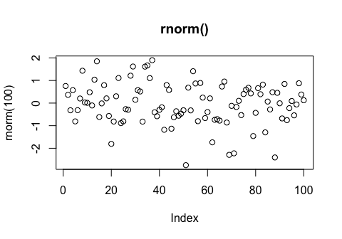
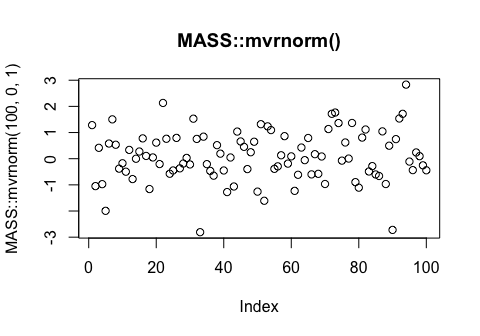

R for Data Science Walkthrough Chapters 17-21
================
Erick Lu

-   [Chapter 17, 18 - No Exercises](#chapter-17-18---no-exercises)
-   [Chapter 19: Functions](#chapter-19-functions)
    -   [19.2.1 Practice](#practice)
    -   [19.3.1 Exercises](#exercises)
    -   [19.4.4 Exercises](#exercises-1)
    -   [19.5.5 Exercises](#exercises-2)
-   [Chapter 20: Vectors](#chapter-20-vectors)
    -   [20.3.5 Exercises](#exercises-3)
    -   [20.4.6 Exercises](#exercises-4)
    -   [20.5.4 Exercises](#exercises-5)
    -   [20.7.4 Exercises](#exercises-6)
-   [Chapter 21](#chapter-21)
    -   [21.2.1 Exercises](#exercises-7)
    -   [21.3.5 Exercises](#exercises-8)
    -   [21.4.1 Exercises](#exercises-9)
    -   [21.5.3 Exercises](#exercises-10)
    -   [21.9.3 Exercises](#exercises-11)
-   [Chapter 22 - No Exercises](#chapter-22---no-exercises)

This my walkthrough for chapters 17-21 for the book: *R for Data Science* by Hadley Wickham and Garrett Grolemund. Here I provide solutions to their exercises and some of my own notes and explorations.

Chapter 17, 18 - No Exercises
=============================

Chapter 19: Functions
=====================

Learn about unit testing your functions - <http://r-pkgs.had.co.nz/tests.html>.

19.2.1 Practice
---------------

### 1. Why is TRUE not a parameter to rescale01()? What would happen if x contained a single missing value, and na.rm was FALSE?

TRUE is not a parameter to rescale01() because it is an option for one of the arguments in the range() function. It can be specified within the function itself rather than having to be passed in as a function parameter. If na.rm was FALSE, NA values would not be "removed" from the analysis, and the function would produce a vector of NA values. Below, I show an example what would happen if na.rm was FALSE and a vector with an NA value was used.

``` r
rescale01 <- function(x) {
  rng <- range(x, na.rm = TRUE)
  (x - rng[1]) / (rng[2] - rng[1])
}

rescale01_FALSE <- function(x) {
  rng <- range(x, na.rm = FALSE)
  (x - rng[1]) / (rng[2] - rng[1])
}

test <- c(1,2,3,NA,4,5)

rescale01(test)
```

    ## [1] 0.00 0.25 0.50   NA 0.75 1.00

``` r
rescale01_FALSE(test)
```

    ## [1] NA NA NA NA NA NA

### 2. In the second variant of rescale01(), infinite values are left unchanged. Rewrite rescale01() so that -Inf is mapped to 0, and Inf is mapped to 1.

To map Inf to 1 and -Inf to 0, we can search for the indicies which have these values and assign 0 or 1 accordingly, using the which() function in base R. We then return the modified vector using return().

``` r
x <- c(1:10,Inf, c(1:3), Inf, c(1:5), -Inf)
rescale01_mapInf <- function(x) {
rng <- range(x, na.rm = TRUE, finite = TRUE) 
x <- (x - rng[1]) / (rng[2] - rng[1])
x[which(x==Inf)] <- 1
x[which(x==-Inf)] <- 0
return (x)
}
rescale01_mapInf(x)
```

    ##  [1] 0.0000000 0.1111111 0.2222222 0.3333333 0.4444444 0.5555556 0.6666667
    ##  [8] 0.7777778 0.8888889 1.0000000 1.0000000 0.0000000 0.1111111 0.2222222
    ## [15] 1.0000000 0.0000000 0.1111111 0.2222222 0.3333333 0.4444444 0.0000000

### 3. Practice turning the following code snippets into functions. Think about what each function does. What would you call it? How many arguments does it need? Can you rewrite it to be more expressive or less duplicative?

mean(is.na(x)) is a snippet that calculates what proportion of the values in a vector are NA values. is.na(x) will return a boolean for each value in x (FALSE if not NA, TRUE if NA). TRUE is 1 and FALSE is 0 when used in mean().

``` r
x = c(1:5, NA, 1:2, NA, 1:3)
mean(is.na(x))
```

    ## [1] 0.1666667

``` r
# rewrite the snippet into a function
proportion_na <- function (x) {
  sum(is.na(x))/length(x)
}
# see if the function output matches the snippet
proportion_na(x)
```

    ## [1] 0.1666667

x / sum(x, na.rm = TRUE) is a snippet that divides each of the values in X by the total sum of the non-NA values in x.

``` r
x / sum(x, na.rm = TRUE)
```

    ##  [1] 0.04166667 0.08333333 0.12500000 0.16666667 0.20833333         NA
    ##  [7] 0.04166667 0.08333333         NA 0.04166667 0.08333333 0.12500000

``` r
divide_by_sum <- function (x) {
  x / sum(x, na.rm = TRUE)
}
divide_by_sum(x)
```

    ##  [1] 0.04166667 0.08333333 0.12500000 0.16666667 0.20833333         NA
    ##  [7] 0.04166667 0.08333333         NA 0.04166667 0.08333333 0.12500000

sd(x, na.rm = TRUE) / mean(x, na.rm = TRUE) is a snippet that divides the standard deviation of the values in x by the mean of the values in x.

``` r
sd(x, na.rm = TRUE) / mean(x, na.rm = TRUE)
```

    ## [1] 0.5624571

``` r
sd_div_mean <- function (x) {
  sd(x, na.rm = TRUE) / mean(x, na.rm = TRUE)
}
sd_div_mean(x)
```

    ## [1] 0.5624571

Each of the functions only requires the vector x as an input argument.

### 4. Follow <http://nicercode.github.io/intro/writing-functions.html> to write your own functions to compute the variance and skew of a numeric vector.

``` r
sample_vector <- c(1:10)

variance <- function (x) {
  n <- length(x)
    m <- mean(x)
    (1/(n - 1)) * sum((x - m)^2)
}

skew <- function (x) {
    n <- length(x)
    v <- var(x)
    m <- mean(x)
    third.moment <- (1/(n - 2)) * sum((x - m)^3)
    third.moment/(var(x)^(3/2))
}
# might have to cross-reference this function with other sources to make sure it's correct.

variance(sample_vector)
```

    ## [1] 9.166667

``` r
var(sample_vector)
```

    ## [1] 9.166667

``` r
skew(sample_vector)
```

    ## [1] 0

### 5. Write both\_na(), a function that takes two vectors of the same length and returns the number of positions that have an NA in both vectors.

I interpreted this question as finding the index numbers of positions in both vectors that both contain NA values. For example, if you had one vector c(1, 2, NA, 5, 6) and another vector c(NA, 6, NA, 4, 5), this function should return "3". To do this, we first evaluate which values in both vectors are NA values using is.na(). Then, we can use which() to find out the index of all TRUE (NA) values in these vectors. Then, we use intersect() to determine which indecies are common between the two vectors. This function should work even if the vectors are different lengths.

``` r
vector1 = c(1, 2, NA, 5, 6)
vector2 = c(NA, 6, NA, 4, 5)

both_na <- function (v1, v2) {
  na1 <- is.na(v1)
  na2 <- is.na(v2)
  intersect(which(na1==TRUE),which(na2==TRUE))
}

vector1
```

    ## [1]  1  2 NA  5  6

``` r
vector2
```

    ## [1] NA  6 NA  4  5

``` r
both_na(vector1,vector2)
```

    ## [1] 3

### 6. What do the following functions do? Why are they useful even though they are so short?

``` r
is_directory <- function(x) file.info(x)$isdir
is_readable <- function(x) file.access(x, 4) == 0
```

is\_directory() is a function that tells the user whether the object (x) is a directory or not (returns a TRUE or FALSE value). is\_readable() is a function that tells the user whether the file is readable or not (also returns TRUE or FALSE). The second argument (4) indicates that it "tests for read permission" based on the documentation. The function file.access() returns 0 for success and -1 for failure. These functions are useful because it they provide information that guides the user with how to proceed with the file.

### 7. Read the complete lyrics to “Little Bunny Foo Foo”. There’s a lot of duplication in this song. Extend the initial piping example to recreate the complete song, and use functions to reduce the duplication.

The lyrics are repeated three times, each time with the number of chances decreased by one. We can lump all the lyrics into one function, and then call the function 3 times using a loop while decreasing the number of chances each iteration of the loop.

``` r
# I commented out the pseudocode so the R markdown file can compile.

# foo_foo %>%
#   hop(through = forest) %>%
#   scoop(up = field_mice) %>%
#   bop(on = head) %>%
#   down(came = good_fairy) %>%
#   scoop(up = field_mice) %>%
#   bop (on = head) %>%
#   give (chances = three) %>%
#   turn (into = goonie)
#   # repeat 3 times, with the # of chances decreasing each time
#   
# play_through (foo_foo, chances) {
#   hop(through = forest) %>%
#   scoop(up = field_mice) %>%
#   bop(on = head) %>%
#   down(came = good_fairy) %>%
#   scoop(up = field_mice) %>%
#   bop (on = head) %>%
#   give (chances = three) %>%
#   turn (into = goonie)
# }
#  
# chances <- 3
# while (chances > 0) {
#   play_through (foo_foo, chances)
#   chances <- chances - 1
# }
#  
```

19.3.1 Exercises
----------------

### 1. Read the source code for each of the following three functions, puzzle out what they do, and then brainstorm better names.

``` r
f1 <- function(string, prefix) {
  substr(string, 1, nchar(prefix)) == prefix
}

f1("hello", "he")
```

    ## [1] TRUE

``` r
f1("hello", "ell")
```

    ## [1] FALSE

This function returns TRUE or FALSE depending on whether the second argument (prefix) matches the corresponding first letters in the first argument (string). A better function name would be "is\_prefix".

``` r
f2 <- function(x) {
  if (length(x) <= 1) return(NULL)
  x[-length(x)]
}
x = c(1:10)
x
```

    ##  [1]  1  2  3  4  5  6  7  8  9 10

``` r
f2(x)
```

    ## [1] 1 2 3 4 5 6 7 8 9

This is a function that deletes the last entry of the input vector, x. If the vector is of length 1 or less, the function returns NULL. A better function name would be "delete\_last".

``` r
f3 <- function(x, y) {
  rep(y, length.out = length(x))
}
x = c(1:10)
x
```

    ##  [1]  1  2  3  4  5  6  7  8  9 10

``` r
f3(x, 5)
```

    ##  [1] 5 5 5 5 5 5 5 5 5 5

This is a function that returns a vector that is the same length as x, but all of its values consist of y. A better name for this function would be "rep\_constant\_values". Although we are not necessarily changing the values in the input vector, but rather generating a new vector with the values "replaced", the user can infer that the output vector consist of a constant value.

### 2. Take a function that you’ve written recently and spend 5 minutes brainstorming a better name for it and its arguments.

Below is an example of a task that could be optimized by writing a function instead.

``` r
library(tidyverse)
```

    ## ── Attaching packages ──────────────────────────────────────────────────────────────────────────────────────────────────── tidyverse 1.2.1 ──

    ## ✔ ggplot2 2.2.1     ✔ purrr   0.2.4
    ## ✔ tibble  1.4.2     ✔ dplyr   0.7.5
    ## ✔ tidyr   0.8.1     ✔ stringr 1.3.1
    ## ✔ readr   1.1.1     ✔ forcats 0.3.0

    ## ── Conflicts ─────────────────────────────────────────────────────────────────────────────────────────────────────── tidyverse_conflicts() ──
    ## ✖ dplyr::filter() masks stats::filter()
    ## ✖ dplyr::lag()    masks stats::lag()

``` r
preg <- tribble(
  ~pregnant, ~male, ~female,
  "yes",     NA,    10,
  "no",      20,    12
)

# without using functions, convert the pregnant and female columns to booleans (TRUE or FALSE values).
gather(preg, sex, count, male, female) %>%
  mutate(pregnant = pregnant == "yes",
         female = sex == "female") %>%
  select(-sex)
```

    ## # A tibble: 4 x 3
    ##   pregnant count female
    ##   <lgl>    <dbl> <lgl> 
    ## 1 TRUE        NA FALSE 
    ## 2 FALSE       20 FALSE 
    ## 3 TRUE        10 TRUE  
    ## 4 FALSE       12 TRUE

Instead of having to place the "==" clause in the mutate function, we can write a function to do so instead.

``` r
# write function to convert a vector of strings to TRUE or FALSE, depending on whether the values match a specified string:
string_to_boolean <- function (x, string) {
  x == string
}

# use the function to do the job
gather(preg, sex, count, male, female) %>%
  mutate(pregnant = string_to_boolean(pregnant,"yes"),
         female = string_to_boolean(sex,"female")) %>%
  select(-sex)
```

    ## # A tibble: 4 x 3
    ##   pregnant count female
    ##   <lgl>    <dbl> <lgl> 
    ## 1 TRUE        NA FALSE 
    ## 2 FALSE       20 FALSE 
    ## 3 TRUE        10 TRUE  
    ## 4 FALSE       12 TRUE

### 3. Compare and contrast rnorm() and MASS::mvrnorm(). How could you make them more consistent?

First we can compare and contrast the type of output from the two functions by generating a list of 100 random normal values with mean 0 and SD 1 using both functions (plotted below):

``` r
plot(rnorm(100), main = "rnorm()")
```



``` r
plot(MASS::mvrnorm(100,0,1), main = "MASS::mvrnorm()")
```



I noticed that `rnorm(100)` automatically sets the mean to 0 and SD to 1, whereas `MASS::mvrnorm(100)` does not work unless you manually specify the mean to 0 and SD to 1 in the 2nd and 3rd arguments `MASS::mvrnorm(100,0,1)`. To make them more consistent, I would set the default values for mu and Sigma for MASS::mvrnorm() to 0 and 1, so that both functions will work without having to explicitly state the mu (mean) and Sigma (SD) values.

### 4. Make a case for why norm\_r(), norm\_d() etc would be better than rnorm(), dnorm(). Make a case for the opposite.

norm\_r(), norm\_d() etc would be better since you know that these functions have are common with each other in that they deal with the normal distribution. The suffix "\_r", etc lets you know how the functions differ from each other. You can also get a list of all the related functions by typing "norm" in RStudio and seeing the autocomplete options. One could argue that this is not as good as the current rnorm(), dnorm() etc convention because of the added finger work required to place an underscore in the name. Also, norm\_r() is a rather cryptic name that might not have intuitive meaning, whereas rnorm immediately suggests "random normal" to one familiar with statistics.

19.4.4 Exercises
----------------

### 1. What’s the difference between if and ifelse()? Carefully read the help and construct three examples that illustrate the key differences.

`if`, if used by itself, will only execute its contents if the conditional statement is TRUE. If the statement is FALSE, nothing will be executed unless there is an `else if` or `else` statement afterwards. ifelse() gives you an option to execute code if the conditional statement is FALSE. It can also be used to filter or reassign values in a vector depending on a condition.

### 2. Write a greeting function that says “good morning”, “good afternoon”, or “good evening”, depending on the time of day. (Hint: use a time argument that defaults to lubridate::now(). That will make it easier to test your function.)

``` r
library(lubridate)
```

    ## 
    ## Attaching package: 'lubridate'

    ## The following object is masked from 'package:base':
    ## 
    ##     date

``` r
greet <- function ( datetime = lubridate::now() ) {
  print(datetime)
  time <- hour(datetime)
  
  if (time < 12) {
    print("good morning")
  } else if (time >= 12 && time < 18) {
    print("good afternoon")
  } else
    print("good evening")
}

greet()
```

    ## [1] "2018-12-25 17:21:00 CST"
    ## [1] "good afternoon"

``` r
greet(ymd_hms("2016-07-08 08:34:56"))
```

    ## [1] "2016-07-08 08:34:56 UTC"
    ## [1] "good morning"

``` r
greet(ymd_hms("2016-07-08 20:34:56"))
```

    ## [1] "2016-07-08 20:34:56 UTC"
    ## [1] "good evening"

``` r
greet(ymd_hms("2016-07-08 15:34:56"))
```

    ## [1] "2016-07-08 15:34:56 UTC"
    ## [1] "good afternoon"

### 3. Implement a fizzbuzz function. It takes a single number as input. If the number is divisible by three, it returns “fizz”. If it’s divisible by five it returns “buzz”. If it’s divisible by three and five, it returns “fizzbuzz”. Otherwise, it returns the number. Make sure you first write working code before you create the function.

``` r
fizzbuzz <- function ( input ) {
  if (input %% 3 == 0 && input %% 5 == 0) {
    print("fizzbuzz")
  } else if ( input %% 5 == 0 ) {
    print ("buzz")
  } else if ( input %% 3 == 0 ) {
    print ("fizz")
  } else
    print (input)
}

fizzbuzz(15)
```

    ## [1] "fizzbuzz"

``` r
fizzbuzz(10)
```

    ## [1] "buzz"

``` r
fizzbuzz(9)
```

    ## [1] "fizz"

``` r
fizzbuzz(4)
```

    ## [1] 4

### 4. How could you use cut() to simplify this set of nested if-else statements?

``` r
# if (temp <= 0) {
#   "freezing"
# } else if (temp <= 10) {
#   "cold"
# } else if (temp <= 20) {
#   "cool"
# } else if (temp <= 30) {
#   "warm"
# } else {
#   "hot"
# }

temp_range <- c(-5:40)
# without labels
cut(temp_range, breaks = c(-100, 0, 10, 20, 30, 100), right = TRUE)
```

    ##  [1] (-100,0] (-100,0] (-100,0] (-100,0] (-100,0] (-100,0] (0,10]  
    ##  [8] (0,10]   (0,10]   (0,10]   (0,10]   (0,10]   (0,10]   (0,10]  
    ## [15] (0,10]   (0,10]   (10,20]  (10,20]  (10,20]  (10,20]  (10,20] 
    ## [22] (10,20]  (10,20]  (10,20]  (10,20]  (10,20]  (20,30]  (20,30] 
    ## [29] (20,30]  (20,30]  (20,30]  (20,30]  (20,30]  (20,30]  (20,30] 
    ## [36] (20,30]  (30,100] (30,100] (30,100] (30,100] (30,100] (30,100]
    ## [43] (30,100] (30,100] (30,100] (30,100]
    ## Levels: (-100,0] (0,10] (10,20] (20,30] (30,100]

``` r
table(cut(temp_range, breaks = c(-100, 0, 10, 20, 30, 100), right = TRUE))
```

    ## 
    ## (-100,0]   (0,10]  (10,20]  (20,30] (30,100] 
    ##        6       10       10       10       10

``` r
# with labels
cut(temp_range, breaks = c(-100, 0, 10, 20, 30, 100), labels = c("freezing", "cold", "cool", "warm", "hot"), right = TRUE)
```

    ##  [1] freezing freezing freezing freezing freezing freezing cold    
    ##  [8] cold     cold     cold     cold     cold     cold     cold    
    ## [15] cold     cold     cool     cool     cool     cool     cool    
    ## [22] cool     cool     cool     cool     cool     warm     warm    
    ## [29] warm     warm     warm     warm     warm     warm     warm    
    ## [36] warm     hot      hot      hot      hot      hot      hot     
    ## [43] hot      hot      hot      hot     
    ## Levels: freezing cold cool warm hot

``` r
table(cut(temp_range, breaks = c(-100, 0, 10, 20, 30, 100), labels = c("freezing", "cold", "cool", "warm", "hot"), right = TRUE))
```

    ## 
    ## freezing     cold     cool     warm      hot 
    ##        6       10       10       10       10

How would you change the call to cut() if I’d used &lt; instead of &lt;=? What is the other chief advantage of cut() for this problem? (Hint: what happens if you have many values in temp?)

If &lt; was used instead of &lt;=, I would change the argument from right = TRUE to right = FALSE. This will split the interval to be closed on the left and open on the right. The other advantage of cut() for this problem is that it is able to sort a vector of values into the various intervals, whereas the nested if else statement that was provided only works on a single value. This makes cut() more efficient when there are many values to be sorted into the intervals.

### 5. What happens if you use switch() with numeric values?

Based on the documentation for switch(), if numerical values are input for the EXPR parameter (first argument), switch() will choose the corresponding element of the list of alternatives (...). I wrote an example below. Switch(1) will choose the first argument after EXPR (the second total argument in the switch() function). If a numerical input for EXPR is larger than the number of alternatives, it seems no output is provided (typeof() returns NULL).

``` r
test_switch <- function ( x ) {
  switch(x, 
         "first choice after EXPR",
         2,
         "third",
         "4th choice after EXPR"
         )
}
test_switch(1)
```

    ## [1] "first choice after EXPR"

``` r
test_switch(2)
```

    ## [1] 2

``` r
test_switch(3)
```

    ## [1] "third"

``` r
test_switch(4)
```

    ## [1] "4th choice after EXPR"

``` r
typeof(test_switch(5))
```

    ## [1] "NULL"

### 6. What does this switch() call do? What happens if x is “e”?

Below I turn the provided switch() call into a function and test each of the possibilities for x, as well as try what happens when x is "e". Since there is no output provided for options a or c, the switch() function returns the value immediately afterwards. So test\_switch("a") returns the same value as test\_switch("b"), and test\_switch("c") returns the same value as test\_switch("d"). If x is "e", a NULL value is returned. There seems to be no output but if you use typeof(test\_switch("e")), we see that the value is NULL.

``` r
test_switch <- function (x) {
  switch(x, 
    a = ,
    b = "ab",
    c = ,
    d = "cd"
  )
}

test_switch("a")
```

    ## [1] "ab"

``` r
test_switch("b")
```

    ## [1] "ab"

``` r
test_switch("c")
```

    ## [1] "cd"

``` r
test_switch("d")
```

    ## [1] "cd"

``` r
test_switch("e")
typeof(test_switch("e"))
```

    ## [1] "NULL"

19.5.5 Exercises
----------------

### 1. What does commas(letters, collapse = "-") do? Why?

``` r
commas <- function(...) stringr::str_c(..., collapse = ", ")
commas(letters[1:10])
```

    ## [1] "a, b, c, d, e, f, g, h, i, j"

``` r
# commas(letters[1:10], collapse = "-")
```

### 2. It’d be nice if you could supply multiple characters to the pad argument, e.g. rule("Title", pad = "-+"). Why doesn’t this currently work? How could you fix it?

### 3. What does the trim argument to mean() do? When might you use it?

### 4. The default value for the method argument to cor() is c("pearson", "kendall", "spearman"). What does that mean? What value is used by default?

Chapter 20: Vectors
===================

20.3.5 Exercises
----------------

### 1. Describe the difference between is.finite(x) and !is.infinite(x).

### 2. Read the source code for dplyr::near() (Hint: to see the source code, drop the ()). How does it work?

### 3. A logical vector can take 3 possible values. How many possible values can an integer vector take? How many possible values can a double take? Use google to do some research.

### 4. Brainstorm at least four functions that allow you to convert a double to an integer. How do they differ? Be precise.

### 5. What functions from the readr package allow you to turn a string into logical, integer, and double vector?

20.4.6 Exercises
----------------

### 1. What does mean(is.na(x)) tell you about a vector x? What about sum(!is.finite(x))?

### 2. Carefully read the documentation of is.vector(). What does it actually test for? Why does is.atomic() not agree with the definition of atomic vectors above?

### 3. Compare and contrast setNames() with purrr::set\_names().

### 4. Create functions that take a vector as input and returns:

-   The last value. Should you use \[ or \[\[?

-   The elements at even numbered positions.

-   Every element except the last value.

-   Only even numbers (and no missing values).

### 5. Why is x\[-which(x &gt; 0)\] not the same as x\[x &lt;= 0\]?

### 6. What happens when you subset with a positive integer that’s bigger than the length of the vector? What happens when you subset with a name that doesn’t exist?

20.5.4 Exercises
----------------

### 1. Draw the following lists as nested sets:

-   list(a, b, list(c, d), list(e, f))
-   list(list(list(list(list(list(a))))))

### 2. What happens if you subset a tibble as if you’re subsetting a list? What are the key differences between a list and a tibble?

20.7.4 Exercises
----------------

### 1. What does hms::hms(3600) return? How does it print? What primitive type is the augmented vector built on top of? What attributes does it use?

### 2. Try and make a tibble that has columns with different lengths. What happens?

### 3. Based on the definition above, is it ok to have a list as a column of a tibble?

Chapter 21
==========

21.2.1 Exercises
----------------

### 3. Write for loops to:

-   Compute the mean of every column in mtcars.
-   Determine the type of each column in nycflights13::flights.
-   Compute the number of unique values in each column of iris.
-   Generate 10 random normals for each of μ=−10,0,10, and 100.

Think about the output, sequence, and body before you start writing the loop.

### 3. Eliminate the for loop in each of the following examples by taking advantage of an existing function that works with vectors:

``` r
out <- ""
for (x in letters) {
  out <- stringr::str_c(out, x)
}

x <- sample(100)
sd <- 0
for (i in seq_along(x)) {
  sd <- sd + (x[i] - mean(x)) ^ 2
}
sd <- sqrt(sd / (length(x) - 1))

x <- runif(100)
out <- vector("numeric", length(x))
out[1] <- x[1]
for (i in 2:length(x)) {
  out[i] <- out[i - 1] + x[i]
}
```

### 3. Combine your function writing and for loop skills:

-   Write a for loop that prints() the lyrics to the children’s song “Alice the camel”.

<!-- -->

    Alice the Camel has one hump.
    Alice the Camel has one hump.
    Alice the Camel has one hump.
    Go Alice go!

    Ruby the Rabbit has two ears.
    Ruby the Rabbit has two ears.
    Ruby the Rabbit has two ears.
    Go Ruby go!

    Sally the Sloth has two toes.
    Sally the Sloth has two toes.
    Sally the Sloth has two toes.
    Go Sally go?

    Felix the Fox has four legs.
    Felix the Fox has four legs.
    Felix the Fox has four legs.
    Go Felix go!

    Lilly the Ladybug has five spots.
    Lilly the Ladybug has five spots.
    Lilly the Ladybug has five spots.
    Go Lilly go!

    Andy the Ant has six legs.
    Andy the Ant has six legs.
    Andy the Ant has six legs.
    Go Andy go!

    Larry the Lizard has seven stripes.
    Larry the Lizard has seven stripes.
    Larry the Lizard has seven stripes.
    Go Larry go!

    Sammy the Spider has eight legs.
    Sammy the Spider has eight legs.
    Sammy the Spider has eight legs.
    Go Sammy go!

-   Convert the nursery rhyme “ten in the bed” to a function. Generalise it to any number of people in any sleeping structure.

<!-- -->

    There were ten in the bed
    And the little one said,
    "Roll over! Roll over!"
    So they all rolled over and
    one fell out

    ... nine ... eight ... etc.

    There were two in the bed
    And the little one said,
    "Roll over! Roll over!"
    So they all rolled over and one fell out

    There was one in the bed
    And the little one said,

    "Alone at last!"

-   Convert the song “99 bottles of beer on the wall” to a function. Generalise to any number of any vessel containing any liquid on any surface.

<!-- -->

    99 bottles of beer on the wall, 99 bottles of beer.
    Take one down and pass it around, 98 bottles of beer on the wall.

    ...

    No more bottles of beer on the wall, no more bottles of beer. 
    Go to the store and buy some more, 99 bottles of beer on the wall.

### 3. It’s common to see for loops that don’t preallocate the output and instead increase the length of a vector at each step:

``` r
output <- vector("integer", 0)
for (i in seq_along(x)) {
  output <- c(output, lengths(x[[i]]))
}
output
```

    ##   [1] 1 1 1 1 1 1 1 1 1 1 1 1 1 1 1 1 1 1 1 1 1 1 1 1 1 1 1 1 1 1 1 1 1 1 1
    ##  [36] 1 1 1 1 1 1 1 1 1 1 1 1 1 1 1 1 1 1 1 1 1 1 1 1 1 1 1 1 1 1 1 1 1 1 1
    ##  [71] 1 1 1 1 1 1 1 1 1 1 1 1 1 1 1 1 1 1 1 1 1 1 1 1 1 1 1 1 1 1

How does this affect performance? Design and execute an experiment.

21.3.5 Exercises
----------------

### 1. Imagine you have a directory full of CSV files that you want to read in. You have their paths in a vector, files &lt;- dir("data/", pattern = "\\.csv$", full.names = TRUE), and now want to read each one with read\_csv(). Write the for loop that will load them into a single data frame.

### 2. What happens if you use for (nm in names(x)) and x has no names? What if only some of the elements are named? What if the names are not unique?

### 3. Write a function that prints the mean of each numeric column in a data frame, along with its name. For example, show\_mean(iris) would print:

``` r
# show_mean(iris)
#> Sepal.Length: 5.84
#> Sepal.Width:  3.06
#> Petal.Length: 3.76
#> Petal.Width:  1.20
```

(Extra challenge: what function did I use to make sure that the numbers lined up nicely, even though the variable names had different lengths?)

### 4. What does this code do? How does it work?

``` r
trans <- list( 
  disp = function(x) x * 0.0163871,
  am = function(x) {
    factor(x, labels = c("auto", "manual"))
  }
)
for (var in names(trans)) {
  mtcars[[var]] <- trans[[var]](mtcars[[var]])
}
```

21.4.1 Exercises
----------------

### 1. Read the documentation for apply(). In the 2d case, what two for loops does it generalise?

### 2. Adapt col\_summary() so that it only applies to numeric columns You might want to start with an is\_numeric() function that returns a logical vector that has a TRUE corresponding to each numeric column.

21.5.3 Exercises
----------------

### 1. Write code that uses one of the map functions to:

-   Compute the mean of every column in mtcars.
-   Determine the type of each column in nycflights13::flights.
-   Compute the number of unique values in each column of iris.
-   Generate 10 random normals for each of μ=−10,0,10, and 100.

### 2. How can you create a single vector that for each column in a data frame indicates whether or not it’s a factor?

### 3. What happens when you use the map functions on vectors that aren’t lists? What does map(1:5, runif) do? Why?

### 4. What does map(-2:2, rnorm, n = 5) do? Why? What does map\_dbl(-2:2, rnorm, n = 5) do? Why?

### 5. Rewrite map(x, function(df) lm(mpg ~ wt, data = df)) to eliminate the anonymous function.

21.9.3 Exercises
----------------

### 1. Implement your own version of every() using a for loop. Compare it with purrr::every(). What does purrr’s version do that your version doesn’t?

### 2. Create an enhanced col\_summary() that applies a summary function to every numeric column in a data frame.

### 3. A possible base R equivalent of col\_summary() is:

``` r
col_sum3 <- function(df, f) {
  is_num <- sapply(df, is.numeric)
  df_num <- df[, is_num]

  sapply(df_num, f)
}
```

But it has a number of bugs as illustrated with the following inputs:

``` r
df <- tibble(
  x = 1:3, 
  y = 3:1,
  z = c("a", "b", "c")
)
# OK
col_sum3(df, mean)
```

    ## x y 
    ## 2 2

``` r
# Has problems: don't always return numeric vector
# col_sum3(df[1:2], mean)
# col_sum3(df[1], mean)
# col_sum3(df[0], mean)
```

What causes the bugs?

Chapter 22 - No Exercises
=========================

------------------------------------------------------------------------

Thanks for reading! I hope you found my solutions to the exercises informative. A walkthrough of chapters 22 - 30 can be found at [r4ds\_p7\_chapters22-30\_walkthrough.md](https://github.com/erilu/R-for-data-science-walkthrough/blob/master/r4ds_p7_chapters22-30_walkthrough.md).
