R for Data Science Walkthrough Chapters 22-30
================
Erick Lu

-   [Chapter 22 - No Exercises](#chapter-22---no-exercises)
-   [Chapter 23](#chapter-23)
    -   [23.2.1 Exercises](#exercises)
    -   [23.3.3 Exercises](#exercises-1)
    -   [23.4.5 Exercises](#exercises-2)
-   [Chapter 24](#chapter-24)
    -   [24.2.3 Exercises](#exercises-3)
    -   [24.3.5 Exercises](#exercises-4)
-   [Chapter 25](#chapter-25)
    -   [25.2.5 Exercises](#exercises-5)
    -   [25.4.5 Exercises](#exercises-6)
    -   [25.5.3 Exercises](#exercises-7)
-   [Chapter 26 - No Exercises](#chapter-26---no-exercises)
-   [Chapter 27](#chapter-27)
    -   [27.2.1 Exercises](#exercises-8)
    -   [27.3.1 Exercises](#exercises-9)
    -   [27.4.7 Exercises](#exercises-10)
-   [Chapter 28](#chapter-28)
    -   [28.2.1 Exercises](#exercises-11)
    -   [28.3.1 Exercises](#exercises-12)
    -   [28.4.4 Exercises](#exercises-13)
-   [Chapters 29, 30 - No Exercises](#chapters-29-30---no-exercises)

This my walkthrough for chapters 22-30 for the book: *R for Data Science* by Hadley Wickham and Garrett Grolemund. As a learning exercise, I provide solutions to their exercises and some of my own notes and explorations.

Chapter 22 - No Exercises
=========================

Chapter 23
==========

``` r
library(tidyverse)
```

    ## ── Attaching packages ──────────────────────────────────────────────────────────────────────────────────────────────────────────────────────────────── tidyverse 1.2.1 ──

    ## ✔ ggplot2 3.2.0     ✔ purrr   0.3.2
    ## ✔ tibble  2.1.3     ✔ dplyr   0.8.1
    ## ✔ tidyr   0.8.3     ✔ stringr 1.4.0
    ## ✔ readr   1.3.1     ✔ forcats 0.4.0

    ## ── Conflicts ─────────────────────────────────────────────────────────────────────────────────────────────────────────────────────────────────── tidyverse_conflicts() ──
    ## ✖ dplyr::filter() masks stats::filter()
    ## ✖ dplyr::lag()    masks stats::lag()

``` r
library(modelr)
```

The datasets that are used in this chapter are simulated datasets, such as the one shown below (sim1)

``` r
head(sim1)
```

    ## # A tibble: 6 x 2
    ##       x     y
    ##   <int> <dbl>
    ## 1     1  4.20
    ## 2     1  7.51
    ## 3     1  2.13
    ## 4     2  8.99
    ## 5     2 10.2 
    ## 6     2 11.3

Below are the functions used in this chapter, written by Hadley for demonstration purposes:

``` r
model1 <- function(a, data) {
  a[1] + data$x * a[2]
}

measure_distance <- function(mod, data) {
  diff <- data$y - model1(mod, data)
  sqrt(mean(diff ^ 2))
}

sim1_dist <- function(a1, a2) {
  measure_distance(c(a1, a2), sim1)
}

grid <- expand.grid(
  a1 = seq(-5, 20, length = 25),
  a2 = seq(1, 3, length = 25)
  ) %>% 
  mutate(dist = purrr::map2_dbl(a1, a2, sim1_dist))

head(grid)
```

    ##           a1 a2     dist
    ## 1 -5.0000000  1 15.45248
    ## 2 -3.9583333  1 14.44317
    ## 3 -2.9166667  1 13.43881
    ## 4 -1.8750000  1 12.44058
    ## 5 -0.8333333  1 11.45009
    ## 6  0.2083333  1 10.46955

``` r
dim(grid)
```

    ## [1] 625   3

``` r
grid %>% 
  ggplot(aes(a1, a2)) +
  geom_point(data = filter(grid, rank(dist) <= 10), size = 4, colour = "red") +
  geom_point(aes(colour = -dist))
```

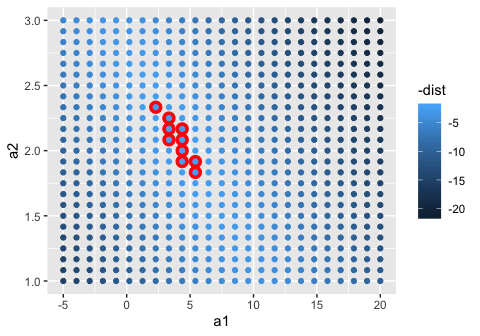

``` r
ggplot(sim1, aes(x, y)) + 
  geom_point(size = 2, colour = "grey30") + 
  geom_abline(
    aes(intercept = a1, slope = a2, colour = -dist), 
    data = filter(grid, rank(dist) <= 10)
  )
```


23.2.1 Exercises
----------------

### 1. One downside of the linear model is that it is sensitive to unusual values because the distance incorporates a squared term. Fit a linear model to the simulated data below, and visualise the results. Rerun a few times to generate different simulated datasets. What do you notice about the model?

In the simulated dataset, there are a couple of outliers that are far displaced from the rest of the points. These outliers can skew the linear approximation, because these points are so 'distant' from the other points in the dataset. Because the linear model tries to minimize the distance between each point and the fitted model (the "residuals"), these outliers will skew the approximation, pulling the line closer to them. The larger the residual, the more it contributes to the RMSE. We notice that the fitted line is slightly skewed towards the direction of the outlying point.

``` r
sim1a <- tibble(
  x = rep(1:10, each = 3),
  y = x * 1.5 + 6 + rt(length(x), df = 2)
)

# first, take a look at the data
sim1a
```

    ## # A tibble: 30 x 2
    ##        x     y
    ##    <int> <dbl>
    ##  1     1 12.1 
    ##  2     1  4.83
    ##  3     1  7.29
    ##  4     2  8.51
    ##  5     2  5.43
    ##  6     2 10.1 
    ##  7     3 10.5 
    ##  8     3 10.8 
    ##  9     3 13.6 
    ## 10     4 14.2 
    ## # … with 20 more rows

``` r
ggplot(sim1a, aes (x, y)) +
  geom_point()
```

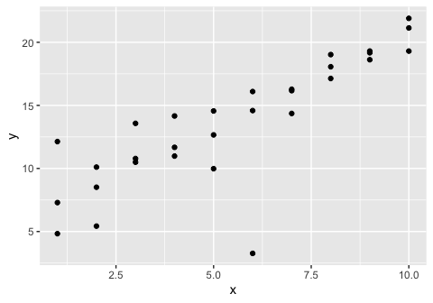

``` r
mod <- lm(y~x, data = sim1a)
summary(mod)
```

    ## 
    ## Call:
    ## lm(formula = y ~ x, data = sim1a)
    ## 
    ## Residuals:
    ##      Min       1Q   Median       3Q      Max 
    ## -11.1567  -0.3351   0.3170   1.2600   4.7538 
    ## 
    ## Coefficients:
    ##             Estimate Std. Error t value Pr(>|t|)    
    ## (Intercept)    5.968      1.086   5.497 7.14e-06 ***
    ## x              1.409      0.175   8.056 9.01e-09 ***
    ## ---
    ## Signif. codes:  0 '***' 0.001 '**' 0.01 '*' 0.05 '.' 0.1 ' ' 1
    ## 
    ## Residual standard error: 2.752 on 28 degrees of freedom
    ## Multiple R-squared:  0.6986, Adjusted R-squared:  0.6878 
    ## F-statistic:  64.9 on 1 and 28 DF,  p-value: 9.008e-09

``` r
# add the fitted linear model to the scatterplot
ggplot(sim1a, aes (x, y)) +
  geom_point()+
  geom_abline(intercept = mod$coefficients[1], slope = mod$coefficients[2])
```

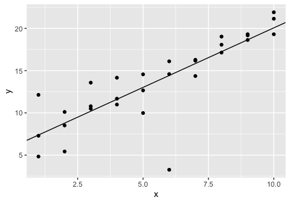

``` r
# compare with the baseR lm with geom_smooth() overlay, looks like they overlap, as expected
ggplot(sim1a, aes (x, y)) +
  geom_point()+
  geom_abline(intercept = mod$coefficients[1], slope = mod$coefficients[2], size=3, color = "red")+
  geom_smooth(method = 'lm')
```

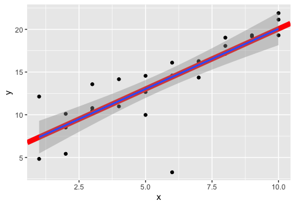

### 2. One way to make linear models more robust is to use a different distance measure. For example, instead of root-mean-squared distance, you could use mean-absolute distance:

``` r
measure_distance <- function(mod, data) {
  diff <- data$y - model1(mod, data)
  mean(abs(diff))
}
# use optim() function to 
best <- optim(c(0, 0), measure_distance, data = sim1a)
best$par
```

    ## [1] 5.808980 1.484323

``` r
# compare the parameters from optim() with the parameters obtained from lm()
mod <- lm (y~x, data = sim1a)
coef(mod)
```

    ## (Intercept)           x 
    ##    5.967502    1.409409

``` r
# plot the two lines on the scatterplot to observe differences in fit
ggplot(data = sim1a, aes(x, y))+
  geom_point()+
  geom_abline(slope = mod$coefficients[2], intercept = mod$coefficients[1], color = "red")+
  geom_abline(slope = best$par[2], intercept = best$par[1], color = "blue")+
  labs(title = "Red = root-mean-squared distance fit using lm() \n Blue = mean-absolute distance fit using optim()")
```

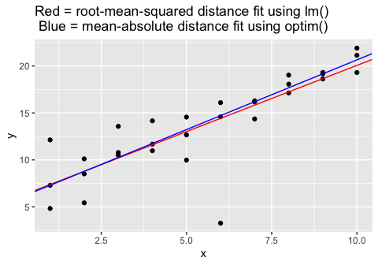

Use optim() to fit this model to the simulated data above and compare it to the linear model.

The measure\_distance() function provided above uses the absolute-mean distance (mean(abs(diff))) instead of the root-mean-squared distance, sqrt(mean(diff^2)). Using optim() and the absolute-mean distance, we find that the line is less skewed by the outlying points. The red line is "pulled" more towards the outliers, whereas the blue line remains more embbeded with the bulk of the data. This is because squaring the residuals results in much greater values when the residuals are large, so minimizing the residuals for outliers takes more priority when using the squared distance.

### 3. One challenge with performing numerical optimisation is that it’s only guaranteed to find one local optimum. What’s the problem with optimising a three parameter model like this?

A quadratic or higher order function may have more than one local minimum / maximum. This may result in the optim() function providing an unideal result. In the provided function, since a\[1\] and a\[3\] are both constants that are not multiplied by a column in data (such as `data$x`), they can be added together and represent the intercept of the line. This results in the sum of a\[1\] and a\[3\] equalling the intercept we found before using the equation `a[1] + data$x * a[2]`.

a\[1\] and a\[3\] can therefore have infinite possibilites of values, as long as the sum of a\[1\] and a\[3\] are equal to the local optimum of `a[1] + data$x * a[2]`. In the example below, if we use the dataset sim1, we find that a\[1\] and a\[3\] must sum to 4.220074. So, depending on where you start with the optim() function, a\[1\] and a\[3\] will have differing values, but still add up to 4.220074.

We see in the graph that the optim() function and lm() again provde the same result.

``` r
model1 <- function(a, data) {
  a[1] + data$x * a[2] + a[3]
}

measure_distance <- function(mod, data) {
  diff <- data$y - model1(mod, data)
  sqrt(mean(diff ^ 2))
}

best <- optim(c(0, 0, 0), measure_distance, data = sim1)
best$par
```

    ## [1] 3.3672228 2.0515737 0.8528513

``` r
best <- optim(c(0, 0, 1), measure_distance, data = sim1)
best$par
```

    ## [1] -3.469885  2.051509  7.690289

``` r
# since in the model above, a[1] and a[3] may be theoretically combined to represent the intercept of the line, we can graph it as such:
ggplot(data = sim1, aes(x, y))+
  geom_point()+
  geom_smooth(method = "lm", color = "red", size = 2)+
  geom_abline(slope = best$par[2], intercept = best$par[1] + best$par[3], color = "blue")+
  labs(title = "Red = using lm() \n Blue = optim() using the provided 3 parameter model")
```

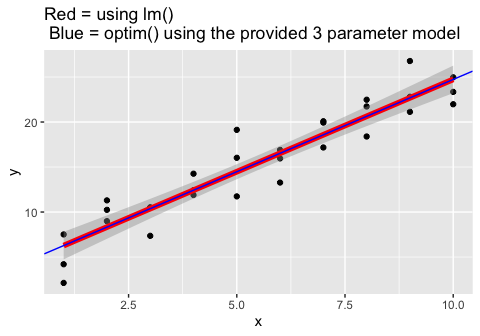

23.3.3 Exercises
----------------

### 1. Instead of using lm() to fit a straight line, you can use loess() to fit a smooth curve. Repeat the process of model fitting, grid generation, predictions, and visualisation on sim1 using loess() instead of lm(). How does the result compare to geom\_smooth()?

Using the loess() function instead of lm(), the line curves more towards the direction of variation and is not strictly a straight line. The default method for fitting using geom\_smooth() is loess(), so the line that is superimposed on the ggplot is the same as the line generated by the predictions using the loess() model. When we superimpose all 3 options (loess() prediction, lm() prediction, and geom\_smooth()), we see that geom\_smooth() and the loess() prediction precisely overlap, whereas the lm() prediction does not.

``` r
# using lm()
sim1_mod_lm <- lm(y ~ x, data = sim1)

grid <- sim1 %>% 
  data_grid(x) 
grid
```

    ## # A tibble: 10 x 1
    ##        x
    ##    <int>
    ##  1     1
    ##  2     2
    ##  3     3
    ##  4     4
    ##  5     5
    ##  6     6
    ##  7     7
    ##  8     8
    ##  9     9
    ## 10    10

``` r
grid <- grid %>% 
  add_predictions(sim1_mod_lm) 
grid
```

    ## # A tibble: 10 x 2
    ##        x  pred
    ##    <int> <dbl>
    ##  1     1  6.27
    ##  2     2  8.32
    ##  3     3 10.4 
    ##  4     4 12.4 
    ##  5     5 14.5 
    ##  6     6 16.5 
    ##  7     7 18.6 
    ##  8     8 20.6 
    ##  9     9 22.7 
    ## 10    10 24.7

``` r
sim1 <- sim1 %>% 
  add_residuals(sim1_mod_lm)
sim1
```

    ## # A tibble: 30 x 3
    ##        x     y    resid
    ##    <int> <dbl>    <dbl>
    ##  1     1  4.20 -2.07   
    ##  2     1  7.51  1.24   
    ##  3     1  2.13 -4.15   
    ##  4     2  8.99  0.665  
    ##  5     2 10.2   1.92   
    ##  6     2 11.3   2.97   
    ##  7     3  7.36 -3.02   
    ##  8     3 10.5   0.130  
    ##  9     3 10.5   0.136  
    ## 10     4 12.4   0.00763
    ## # … with 20 more rows

``` r
ggplot(sim1, aes(x)) +
  geom_point(aes(y = y)) +
  geom_line(aes(y = pred), data = grid, colour = "red", size = 1)
```

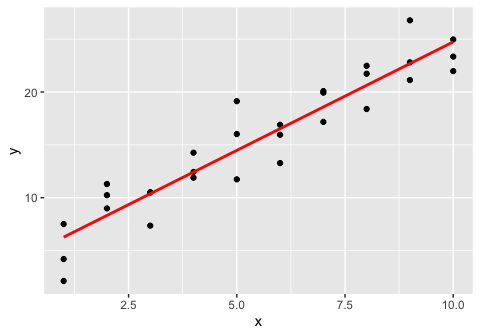

``` r
ggplot(sim1, aes(x, resid)) + 
  geom_ref_line(h = 0) +
  geom_point() 
```

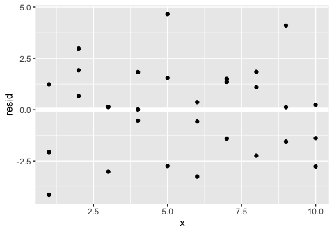

``` r
# using loess()
sim1_mod_loess <- loess(y ~ x, data = sim1)

grid <- sim1 %>% 
  data_grid(x) 
grid
```

    ## # A tibble: 10 x 1
    ##        x
    ##    <int>
    ##  1     1
    ##  2     2
    ##  3     3
    ##  4     4
    ##  5     5
    ##  6     6
    ##  7     7
    ##  8     8
    ##  9     9
    ## 10    10

``` r
grid <- grid %>% 
  add_predictions(sim1_mod_loess) 
grid
```

    ## # A tibble: 10 x 2
    ##        x  pred
    ##    <int> <dbl>
    ##  1     1  5.34
    ##  2     2  8.27
    ##  3     3 10.8 
    ##  4     4 12.8 
    ##  5     5 14.6 
    ##  6     6 16.6 
    ##  7     7 18.7 
    ##  8     8 20.8 
    ##  9     9 22.6 
    ## 10    10 24.0

``` r
sim1 <- sim1 %>% 
  add_residuals(sim1_mod_loess)
sim1
```

    ## # A tibble: 30 x 3
    ##        x     y  resid
    ##    <int> <dbl>  <dbl>
    ##  1     1  4.20 -1.14 
    ##  2     1  7.51  2.17 
    ##  3     1  2.13 -3.21 
    ##  4     2  8.99  0.714
    ##  5     2 10.2   1.97 
    ##  6     2 11.3   3.02 
    ##  7     3  7.36 -3.45 
    ##  8     3 10.5  -0.304
    ##  9     3 10.5  -0.298
    ## 10     4 12.4  -0.345
    ## # … with 20 more rows

``` r
# residuals plot
ggplot(sim1, aes(x, resid)) + 
  geom_ref_line(h = 0) +
  geom_point() 
```

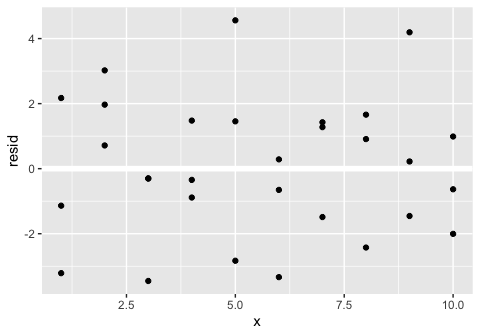

``` r
# plot the regression line
ggplot(sim1, aes(x)) +
  geom_point(aes(y = y)) +
  geom_line(aes(y = pred), data = grid, colour = "red", size = 1)
```


``` r
# compare to geom_smooth() and lm()
ggplot(sim1, aes(x, y)) +
  geom_point() +
  geom_line(aes(y = pred), data = grid, colour = "red", size = 3)+
  geom_smooth(color = "blue", se = F)+
  geom_smooth(method = "lm", color = "green", se = F)
```

    ## `geom_smooth()` using method = 'loess' and formula 'y ~ x'

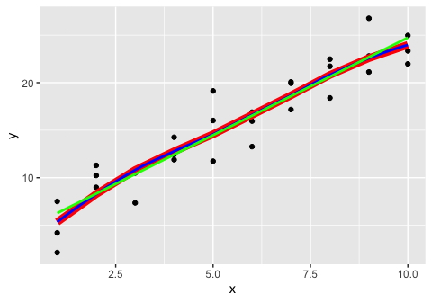

### 2. add\_predictions() is paired with gather\_predictions() and spread\_predictions(). How do these three functions differ?

add\_predictions() can only work with one supplied model, in which it will generate a new column named "pred" in your data frame. gather\_predictions() and spread\_predictions() can work with multiple supplied models and generate predictions for each model supplied. gather\_predictions() appends the model name to the data frame along with the predictions as new rows to the data frame, in a tidy fashion. spread\_predictions() appends the new predictions to the data frame as separate columns. You can visualize the differences below, in which spread\_predictions makes the data frame "wider" and gather\_predictions() makes the data frame "taller".

``` r
grid <- sim1 %>% 
  data_grid(x) 
grid
```

    ## # A tibble: 10 x 1
    ##        x
    ##    <int>
    ##  1     1
    ##  2     2
    ##  3     3
    ##  4     4
    ##  5     5
    ##  6     6
    ##  7     7
    ##  8     8
    ##  9     9
    ## 10    10

``` r
grid_add <- grid %>% 
  add_predictions(sim1_mod_lm) 
grid_add
```

    ## # A tibble: 10 x 2
    ##        x  pred
    ##    <int> <dbl>
    ##  1     1  6.27
    ##  2     2  8.32
    ##  3     3 10.4 
    ##  4     4 12.4 
    ##  5     5 14.5 
    ##  6     6 16.5 
    ##  7     7 18.6 
    ##  8     8 20.6 
    ##  9     9 22.7 
    ## 10    10 24.7

``` r
grid_gather <- grid %>% 
  gather_predictions(sim1_mod_lm, sim1_mod_loess) 
grid_gather
```

    ## # A tibble: 20 x 3
    ##    model              x  pred
    ##    <chr>          <int> <dbl>
    ##  1 sim1_mod_lm        1  6.27
    ##  2 sim1_mod_lm        2  8.32
    ##  3 sim1_mod_lm        3 10.4 
    ##  4 sim1_mod_lm        4 12.4 
    ##  5 sim1_mod_lm        5 14.5 
    ##  6 sim1_mod_lm        6 16.5 
    ##  7 sim1_mod_lm        7 18.6 
    ##  8 sim1_mod_lm        8 20.6 
    ##  9 sim1_mod_lm        9 22.7 
    ## 10 sim1_mod_lm       10 24.7 
    ## 11 sim1_mod_loess     1  5.34
    ## 12 sim1_mod_loess     2  8.27
    ## 13 sim1_mod_loess     3 10.8 
    ## 14 sim1_mod_loess     4 12.8 
    ## 15 sim1_mod_loess     5 14.6 
    ## 16 sim1_mod_loess     6 16.6 
    ## 17 sim1_mod_loess     7 18.7 
    ## 18 sim1_mod_loess     8 20.8 
    ## 19 sim1_mod_loess     9 22.6 
    ## 20 sim1_mod_loess    10 24.0

``` r
grid_spread <- grid %>% 
  spread_predictions(sim1_mod_lm, sim1_mod_loess) 
grid_spread
```

    ## # A tibble: 10 x 3
    ##        x sim1_mod_lm sim1_mod_loess
    ##    <int>       <dbl>          <dbl>
    ##  1     1        6.27           5.34
    ##  2     2        8.32           8.27
    ##  3     3       10.4           10.8 
    ##  4     4       12.4           12.8 
    ##  5     5       14.5           14.6 
    ##  6     6       16.5           16.6 
    ##  7     7       18.6           18.7 
    ##  8     8       20.6           20.8 
    ##  9     9       22.7           22.6 
    ## 10    10       24.7           24.0

### 3. What does geom\_ref\_line() do? What package does it come from? Why is displaying a reference line in plots showing residuals useful and important?

geom\_ref\_line() adds either a horizontal or vertical line at a specified position to your ggplot, of a specified color (default white). It comes from `modelr`. This is useful when plotting residuals because ideally the residuals should be centered around 0. Having a reference line helps the viewer judge how the residuals behave. Conceptually, we can think of the horizontal line in the residuals plot as the prediction, and of the residual as how far off the true value is from that prediction.

### 4. Why might you want to look at a frequency polygon of absolute residuals? What are the pros and cons compared to looking at the raw residuals?

The residuals, ideally, should approximately be normally distributed. Examining the frequency polygon is useful as a visual assessment for whether or not the residuals follow the Normal distribution. This graph will also more easily capture any abnormal pattern in the residuals, in which there are over-representations of either + or - residuals. The cons are that this graph masks some of the variability in the residuals by binning them, and you lose the relationship between the residual and the predictor variable. This is best paired with a scatterplot of the residuals so you can observe exactly where each point lies in relation to the predictor variable.

``` r
# example from book
ggplot(sim1, aes(resid)) + 
  geom_freqpoly(binwidth = 0.5)
```

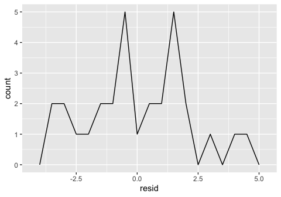

``` r
# make an example where residuals approximate normal distribution
x = seq(1:1000)
y = 12 + 5 * x + rnorm(1000,0,100) # add random white noise
mysim <- as_tibble(cbind(x, y))

#fit model
mysim_mod <- lm(y ~ x, data = mysim)
summary(mysim_mod)
```

    ## 
    ## Call:
    ## lm(formula = y ~ x, data = mysim)
    ## 
    ## Residuals:
    ##      Min       1Q   Median       3Q      Max 
    ## -302.076  -69.590    3.048   70.392  267.531 
    ## 
    ## Coefficients:
    ##             Estimate Std. Error t value Pr(>|t|)    
    ## (Intercept) 13.39087    6.34200   2.111    0.035 *  
    ## x            4.98703    0.01098 454.339   <2e-16 ***
    ## ---
    ## Signif. codes:  0 '***' 0.001 '**' 0.01 '*' 0.05 '.' 0.1 ' ' 1
    ## 
    ## Residual standard error: 100.2 on 998 degrees of freedom
    ## Multiple R-squared:  0.9952, Adjusted R-squared:  0.9952 
    ## F-statistic: 2.064e+05 on 1 and 998 DF,  p-value: < 2.2e-16

``` r
# make predictions
mygrid <- mysim %>% 
  data_grid(x) 
mygrid
```

    ## # A tibble: 1,000 x 1
    ##        x
    ##    <dbl>
    ##  1     1
    ##  2     2
    ##  3     3
    ##  4     4
    ##  5     5
    ##  6     6
    ##  7     7
    ##  8     8
    ##  9     9
    ## 10    10
    ## # … with 990 more rows

``` r
mygrid <- mygrid %>% add_predictions(mysim_mod)
mygrid
```

    ## # A tibble: 1,000 x 2
    ##        x  pred
    ##    <dbl> <dbl>
    ##  1     1  18.4
    ##  2     2  23.4
    ##  3     3  28.4
    ##  4     4  33.3
    ##  5     5  38.3
    ##  6     6  43.3
    ##  7     7  48.3
    ##  8     8  53.3
    ##  9     9  58.3
    ## 10    10  63.3
    ## # … with 990 more rows

``` r
mysim <- mysim %>% add_residuals(mysim_mod)
mysim
```

    ## # A tibble: 1,000 x 3
    ##        x       y   resid
    ##    <dbl>   <dbl>   <dbl>
    ##  1     1   -8.32  -26.7 
    ##  2     2  -75.1   -98.5 
    ##  3     3   33.9     5.58
    ##  4     4 -102.   -135.  
    ##  5     5   93.5    55.2 
    ##  6     6  -56.5   -99.8 
    ##  7     7 -105.   -153.  
    ##  8     8   81.5    28.2 
    ##  9     9  126.     67.8 
    ## 10    10   53.7    -9.56
    ## # … with 990 more rows

``` r
# plot prediction line
ggplot(mysim, aes(x)) +
  geom_point(aes(y = y)) +
  geom_line(aes(y = pred), data =  mygrid, colour = "red", size = 1)
```

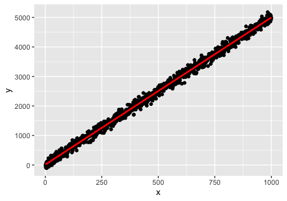

``` r
# plot freqpoly() of residuals
ggplot(mysim, aes(resid)) + 
  geom_freqpoly()
```

    ## `stat_bin()` using `bins = 30`. Pick better value with `binwidth`.

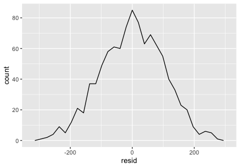

``` r
# plot scatterplot of residuals
ggplot(mysim, aes (x = x, y = resid))+
  geom_ref_line(h=0)+
  geom_point()
```

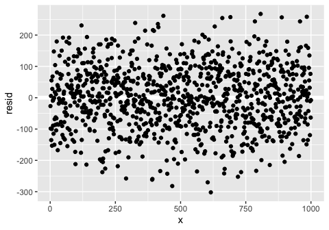

23.4.5 Exercises
----------------

For categorical variables, the book performs a similar prediction workflow:

``` r
# use the sim2 dataset from modelr
sim2
```

    ## # A tibble: 40 x 2
    ##    x          y
    ##    <chr>  <dbl>
    ##  1 a      1.94 
    ##  2 a      1.18 
    ##  3 a      1.24 
    ##  4 a      2.62 
    ##  5 a      1.11 
    ##  6 a      0.866
    ##  7 a     -0.910
    ##  8 a      0.721
    ##  9 a      0.687
    ## 10 a      2.07 
    ## # … with 30 more rows

``` r
# examine how the data are distributed
ggplot(sim2) + 
  geom_point(aes(x, y))
```

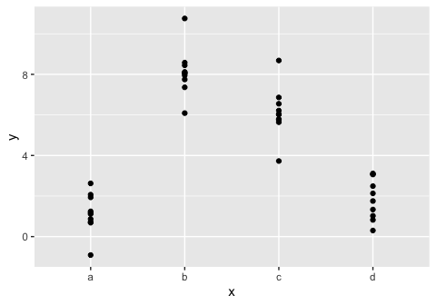

``` r
# generate a model (R automatically recognizes that the predictor variables are categorical)
mod2 <- lm(y ~ x, data = sim2)

# generate predictions based on model
grid <- sim2 %>% 
  data_grid(x) %>% 
  add_predictions(mod2)
grid
```

    ## # A tibble: 4 x 2
    ##   x      pred
    ##   <chr> <dbl>
    ## 1 a      1.15
    ## 2 b      8.12
    ## 3 c      6.13
    ## 4 d      1.91

``` r
# plot the predictions overlaid on the graph
ggplot(sim2, aes(x)) + 
  geom_point(aes(y = y)) +
  geom_point(data = grid, aes(y = pred), colour = "red", size = 4)
```

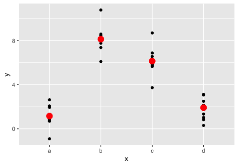

For using more than one predictor variable (can be a combination of categorical and continuous variables), a similar approach is used:

``` r
# examine data and build models
sim3
```

    ## # A tibble: 120 x 5
    ##       x1 x2      rep      y    sd
    ##    <int> <fct> <int>  <dbl> <dbl>
    ##  1     1 a         1 -0.571     2
    ##  2     1 a         2  1.18      2
    ##  3     1 a         3  2.24      2
    ##  4     1 b         1  7.44      2
    ##  5     1 b         2  8.52      2
    ##  6     1 b         3  7.72      2
    ##  7     1 c         1  6.51      2
    ##  8     1 c         2  5.79      2
    ##  9     1 c         3  6.07      2
    ## 10     1 d         1  2.11      2
    ## # … with 110 more rows

``` r
mod1 <- lm(y ~ x1 + x2, data = sim3)
mod2 <- lm(y ~ x1 * x2, data = sim3)

# inputting multiple variables into data_grid results in it returning all the possible combinations between x1 and x2
grid <- sim3 %>% 
  data_grid(x1, x2) %>% 
  gather_predictions(mod1, mod2)
grid
```

    ## # A tibble: 80 x 4
    ##    model    x1 x2     pred
    ##    <chr> <int> <fct> <dbl>
    ##  1 mod1      1 a      1.67
    ##  2 mod1      1 b      4.56
    ##  3 mod1      1 c      6.48
    ##  4 mod1      1 d      4.03
    ##  5 mod1      2 a      1.48
    ##  6 mod1      2 b      4.37
    ##  7 mod1      2 c      6.28
    ##  8 mod1      2 d      3.84
    ##  9 mod1      3 a      1.28
    ## 10 mod1      3 b      4.17
    ## # … with 70 more rows

Inputting multiple continuous variables into data\_grid will also return all possible combinations, unless you manually specify the combinations as done in the book chapter.

``` r
# examine data and build models
sim4
```

    ## # A tibble: 300 x 4
    ##       x1     x2   rep       y
    ##    <dbl>  <dbl> <int>   <dbl>
    ##  1    -1 -1         1  4.25  
    ##  2    -1 -1         2  1.21  
    ##  3    -1 -1         3  0.353 
    ##  4    -1 -0.778     1 -0.0467
    ##  5    -1 -0.778     2  4.64  
    ##  6    -1 -0.778     3  1.38  
    ##  7    -1 -0.556     1  0.975 
    ##  8    -1 -0.556     2  2.50  
    ##  9    -1 -0.556     3  2.70  
    ## 10    -1 -0.333     1  0.558 
    ## # … with 290 more rows

``` r
mod1 <- lm(y ~ x1 + x2, data = sim4)
mod2 <- lm(y ~ x1 * x2, data = sim4)

# with manual specification of range
grid <- sim4 %>% 
  data_grid(
    x1 = seq_range(x1, 5), 
    x2 = seq_range(x2, 5) 
  ) %>% 
  gather_predictions(mod1, mod2)
grid
```

    ## # A tibble: 50 x 4
    ##    model    x1    x2   pred
    ##    <chr> <dbl> <dbl>  <dbl>
    ##  1 mod1   -1    -1    0.996
    ##  2 mod1   -1    -0.5 -0.395
    ##  3 mod1   -1     0   -1.79 
    ##  4 mod1   -1     0.5 -3.18 
    ##  5 mod1   -1     1   -4.57 
    ##  6 mod1   -0.5  -1    1.91 
    ##  7 mod1   -0.5  -0.5  0.516
    ##  8 mod1   -0.5   0   -0.875
    ##  9 mod1   -0.5   0.5 -2.27 
    ## 10 mod1   -0.5   1   -3.66 
    ## # … with 40 more rows

``` r
# without manual specification of range, provides all combinations of values
grid2 <- sim4 %>% 
  data_grid(
    x1, 
    x2
  ) 
grid2
```

    ## # A tibble: 100 x 2
    ##       x1     x2
    ##    <dbl>  <dbl>
    ##  1    -1 -1    
    ##  2    -1 -0.778
    ##  3    -1 -0.556
    ##  4    -1 -0.333
    ##  5    -1 -0.111
    ##  6    -1  0.111
    ##  7    -1  0.333
    ##  8    -1  0.556
    ##  9    -1  0.778
    ## 10    -1  1    
    ## # … with 90 more rows

### 1. What happens if you repeat the analysis of sim2 using a model without an intercept. What happens to the model equation? What happens to the predictions?

To fit a model to sim2 without an intercept, use "-1" with the formula, as shown. We observe that the model matrix loses the "intercept" column when we use "-1". We then generate predictions using gather\_predictions() on both models. We find that both models generate the same predictions! This is because in both cases, the mean of the observations for each categorical possibility is the optimal fit.

``` r
mod1 <- lm(y ~ x, data = sim2)
model_matrix(sim2, y ~x)
```

    ## # A tibble: 40 x 4
    ##    `(Intercept)`    xb    xc    xd
    ##            <dbl> <dbl> <dbl> <dbl>
    ##  1             1     0     0     0
    ##  2             1     0     0     0
    ##  3             1     0     0     0
    ##  4             1     0     0     0
    ##  5             1     0     0     0
    ##  6             1     0     0     0
    ##  7             1     0     0     0
    ##  8             1     0     0     0
    ##  9             1     0     0     0
    ## 10             1     0     0     0
    ## # … with 30 more rows

``` r
mod2 <- lm(y ~ x - 1, data = sim2)
model_matrix(sim2, y ~x -1)
```

    ## # A tibble: 40 x 4
    ##       xa    xb    xc    xd
    ##    <dbl> <dbl> <dbl> <dbl>
    ##  1     1     0     0     0
    ##  2     1     0     0     0
    ##  3     1     0     0     0
    ##  4     1     0     0     0
    ##  5     1     0     0     0
    ##  6     1     0     0     0
    ##  7     1     0     0     0
    ##  8     1     0     0     0
    ##  9     1     0     0     0
    ## 10     1     0     0     0
    ## # … with 30 more rows

``` r
grid <- sim2 %>% 
  data_grid(x) %>% 
  gather_predictions(mod1, mod2)
grid
```

    ## # A tibble: 8 x 3
    ##   model x      pred
    ##   <chr> <chr> <dbl>
    ## 1 mod1  a      1.15
    ## 2 mod1  b      8.12
    ## 3 mod1  c      6.13
    ## 4 mod1  d      1.91
    ## 5 mod2  a      1.15
    ## 6 mod2  b      8.12
    ## 7 mod2  c      6.13
    ## 8 mod2  d      1.91

``` r
ggplot(sim2, aes(x)) + 
  geom_point(aes(y = y)) +
  geom_point(data = grid, aes(y = pred, shape = model, color = model), size = 4)
```

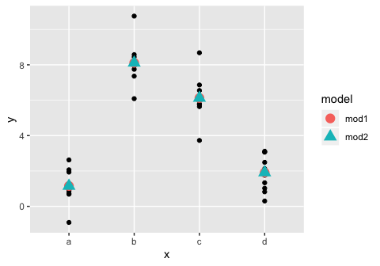

### 2. Use model\_matrix() to explore the equations generated for the models I fit to sim3 and sim4. Why is \* a good shorthand for interaction?

The model matrix for y ~ x1 + x2 for sim3 has an intercept, an x1 column, and 3 columns for x2, corresponding to each of the possibilities for the categories in x2. The model matrix for y ~ x1 \* x2 has an these columns as well, but also has x1:x2b, x1:x2c, and x1:x2d, which correspond to the interaction between x1 and each of the categories in x2.

For sim4, since the values of the predictor variables x1 and x2 are both continuous variables, the x2 column does not need to be split up as in sim3. The model matrix consists of 3 columns, an intercept, x1, and x2. Similarly, y ~ x1 \* x2 uses a model matrix of 4 columns, which consists of the 3 mentioned previously and an additional column x1:x2.

is a good shorthand for this interaction because the additional columns that it adds are products. it suggests that changes in values of one variable will affect the value of the other, which is what it is trying to model.

``` r
sim3
```

    ## # A tibble: 120 x 5
    ##       x1 x2      rep      y    sd
    ##    <int> <fct> <int>  <dbl> <dbl>
    ##  1     1 a         1 -0.571     2
    ##  2     1 a         2  1.18      2
    ##  3     1 a         3  2.24      2
    ##  4     1 b         1  7.44      2
    ##  5     1 b         2  8.52      2
    ##  6     1 b         3  7.72      2
    ##  7     1 c         1  6.51      2
    ##  8     1 c         2  5.79      2
    ##  9     1 c         3  6.07      2
    ## 10     1 d         1  2.11      2
    ## # … with 110 more rows

``` r
# models fit to sim3
model_matrix(sim3, y ~ x1 + x2 )
```

    ## # A tibble: 120 x 5
    ##    `(Intercept)`    x1   x2b   x2c   x2d
    ##            <dbl> <dbl> <dbl> <dbl> <dbl>
    ##  1             1     1     0     0     0
    ##  2             1     1     0     0     0
    ##  3             1     1     0     0     0
    ##  4             1     1     1     0     0
    ##  5             1     1     1     0     0
    ##  6             1     1     1     0     0
    ##  7             1     1     0     1     0
    ##  8             1     1     0     1     0
    ##  9             1     1     0     1     0
    ## 10             1     1     0     0     1
    ## # … with 110 more rows

``` r
model_matrix(sim3, y ~ x1 * x2 )
```

    ## # A tibble: 120 x 8
    ##    `(Intercept)`    x1   x2b   x2c   x2d `x1:x2b` `x1:x2c` `x1:x2d`
    ##            <dbl> <dbl> <dbl> <dbl> <dbl>    <dbl>    <dbl>    <dbl>
    ##  1             1     1     0     0     0        0        0        0
    ##  2             1     1     0     0     0        0        0        0
    ##  3             1     1     0     0     0        0        0        0
    ##  4             1     1     1     0     0        1        0        0
    ##  5             1     1     1     0     0        1        0        0
    ##  6             1     1     1     0     0        1        0        0
    ##  7             1     1     0     1     0        0        1        0
    ##  8             1     1     0     1     0        0        1        0
    ##  9             1     1     0     1     0        0        1        0
    ## 10             1     1     0     0     1        0        0        1
    ## # … with 110 more rows

``` r
sim4
```

    ## # A tibble: 300 x 4
    ##       x1     x2   rep       y
    ##    <dbl>  <dbl> <int>   <dbl>
    ##  1    -1 -1         1  4.25  
    ##  2    -1 -1         2  1.21  
    ##  3    -1 -1         3  0.353 
    ##  4    -1 -0.778     1 -0.0467
    ##  5    -1 -0.778     2  4.64  
    ##  6    -1 -0.778     3  1.38  
    ##  7    -1 -0.556     1  0.975 
    ##  8    -1 -0.556     2  2.50  
    ##  9    -1 -0.556     3  2.70  
    ## 10    -1 -0.333     1  0.558 
    ## # … with 290 more rows

``` r
# models fit to sim4
model_matrix(sim4, y ~ x1 + x2 )
```

    ## # A tibble: 300 x 3
    ##    `(Intercept)`    x1     x2
    ##            <dbl> <dbl>  <dbl>
    ##  1             1    -1 -1    
    ##  2             1    -1 -1    
    ##  3             1    -1 -1    
    ##  4             1    -1 -0.778
    ##  5             1    -1 -0.778
    ##  6             1    -1 -0.778
    ##  7             1    -1 -0.556
    ##  8             1    -1 -0.556
    ##  9             1    -1 -0.556
    ## 10             1    -1 -0.333
    ## # … with 290 more rows

``` r
model_matrix(sim4, y ~ x1 * x2 )
```

    ## # A tibble: 300 x 4
    ##    `(Intercept)`    x1     x2 `x1:x2`
    ##            <dbl> <dbl>  <dbl>   <dbl>
    ##  1             1    -1 -1       1    
    ##  2             1    -1 -1       1    
    ##  3             1    -1 -1       1    
    ##  4             1    -1 -0.778   0.778
    ##  5             1    -1 -0.778   0.778
    ##  6             1    -1 -0.778   0.778
    ##  7             1    -1 -0.556   0.556
    ##  8             1    -1 -0.556   0.556
    ##  9             1    -1 -0.556   0.556
    ## 10             1    -1 -0.333   0.333
    ## # … with 290 more rows

### 3. Using the basic principles, convert the formulas in the following two models into functions. (Hint: start by converting the categorical variable into 0-1 variables.)

The formulas below use the model matricies that were described in exercise 2 of this section. We can re-create the model matricies by writing a function that accepts the predictor variables as input, as well as the type of operator. In the example below, I input sim3 along with either "+" or "\*" and show that the model matricies generated match those made by the modelr function model\_matrix().

``` r
mod1 <- lm(y ~ x1 + x2, data = sim3)
mod2 <- lm(y ~ x1 * x2, data = sim3)

# check to see if the column to add is a categorical variable (factor), and split it up if true
add_column <- function ( mycolumn, colname ) {
  # test whether the columns are factors or not
  if (is.factor (mycolumn)){
    my_levels <- levels(mycolumn)
    
    # split into separate columns
    output <- vector("list")
    for (i in 2: length(my_levels)) {
      level_name <- str_c(colname, my_levels[i])
      output[[level_name]] <- 1*(mycolumn == my_levels[i])
    }
  }
  # if not factor, return the column as-is
  else {
    output <- list( mycolumn)
    names(output) <- colname
  }
  output
}

# check the type of operator supplied (+ or *) and create the columns as necessary, calling the add_column function
make_matrix <- function (data, operator) {
  my_colnames <- c("x1", "x2")
  # store the columns of the model matrix in "mm"
  mm <- list()
  
  # make the default intercept column
  mm$intercept <- rep(1, length(data$x2))
  
  # add the base columns using add_column()
  for (item in my_colnames) {
    mm <- c(mm, add_column (data[[item]], item))
  }
  mm <- bind_cols(mm)
  
  # if the operator is *, add the appropriate columns based on vector multiplication
  if (operator == "*") {
    x1cols <- colnames(mm)[grep("x1", colnames(mm))]
    x2cols <- colnames(mm)[grep("x2", colnames(mm))]
    newcols <- vector("list")
    for (i in x1cols) {
      print(i)
      for (j in x2cols) {
        print(j)
        new_level_name <- str_c(i,j, sep = ":")
        print(new_level_name)
        newcols[[new_level_name]] <- mm[[i]]* mm[[j]]
      }
    }
    newcols <- bind_cols(newcols)
    mm <- cbind(mm, newcols)
  }
  mm
}

make_matrix( sim3, "+")
```

    ## # A tibble: 120 x 5
    ##    intercept    x1   x2b   x2c   x2d
    ##        <dbl> <int> <dbl> <dbl> <dbl>
    ##  1         1     1     0     0     0
    ##  2         1     1     0     0     0
    ##  3         1     1     0     0     0
    ##  4         1     1     1     0     0
    ##  5         1     1     1     0     0
    ##  6         1     1     1     0     0
    ##  7         1     1     0     1     0
    ##  8         1     1     0     1     0
    ##  9         1     1     0     1     0
    ## 10         1     1     0     0     1
    ## # … with 110 more rows

``` r
model_matrix( sim3, y ~ x1 + x2)
```

    ## # A tibble: 120 x 5
    ##    `(Intercept)`    x1   x2b   x2c   x2d
    ##            <dbl> <dbl> <dbl> <dbl> <dbl>
    ##  1             1     1     0     0     0
    ##  2             1     1     0     0     0
    ##  3             1     1     0     0     0
    ##  4             1     1     1     0     0
    ##  5             1     1     1     0     0
    ##  6             1     1     1     0     0
    ##  7             1     1     0     1     0
    ##  8             1     1     0     1     0
    ##  9             1     1     0     1     0
    ## 10             1     1     0     0     1
    ## # … with 110 more rows

``` r
make_matrix( sim3, "*")
```

    ## [1] "x1"
    ## [1] "x2b"
    ## [1] "x1:x2b"
    ## [1] "x2c"
    ## [1] "x1:x2c"
    ## [1] "x2d"
    ## [1] "x1:x2d"

    ##     intercept x1 x2b x2c x2d x1:x2b x1:x2c x1:x2d
    ## 1           1  1   0   0   0      0      0      0
    ## 2           1  1   0   0   0      0      0      0
    ## 3           1  1   0   0   0      0      0      0
    ## 4           1  1   1   0   0      1      0      0
    ## 5           1  1   1   0   0      1      0      0
    ## 6           1  1   1   0   0      1      0      0
    ## 7           1  1   0   1   0      0      1      0
    ## 8           1  1   0   1   0      0      1      0
    ## 9           1  1   0   1   0      0      1      0
    ## 10          1  1   0   0   1      0      0      1
    ## 11          1  1   0   0   1      0      0      1
    ## 12          1  1   0   0   1      0      0      1
    ## 13          1  2   0   0   0      0      0      0
    ## 14          1  2   0   0   0      0      0      0
    ## 15          1  2   0   0   0      0      0      0
    ## 16          1  2   1   0   0      2      0      0
    ## 17          1  2   1   0   0      2      0      0
    ## 18          1  2   1   0   0      2      0      0
    ## 19          1  2   0   1   0      0      2      0
    ## 20          1  2   0   1   0      0      2      0
    ## 21          1  2   0   1   0      0      2      0
    ## 22          1  2   0   0   1      0      0      2
    ## 23          1  2   0   0   1      0      0      2
    ## 24          1  2   0   0   1      0      0      2
    ## 25          1  3   0   0   0      0      0      0
    ## 26          1  3   0   0   0      0      0      0
    ## 27          1  3   0   0   0      0      0      0
    ## 28          1  3   1   0   0      3      0      0
    ## 29          1  3   1   0   0      3      0      0
    ## 30          1  3   1   0   0      3      0      0
    ## 31          1  3   0   1   0      0      3      0
    ## 32          1  3   0   1   0      0      3      0
    ## 33          1  3   0   1   0      0      3      0
    ## 34          1  3   0   0   1      0      0      3
    ## 35          1  3   0   0   1      0      0      3
    ## 36          1  3   0   0   1      0      0      3
    ## 37          1  4   0   0   0      0      0      0
    ## 38          1  4   0   0   0      0      0      0
    ## 39          1  4   0   0   0      0      0      0
    ## 40          1  4   1   0   0      4      0      0
    ## 41          1  4   1   0   0      4      0      0
    ## 42          1  4   1   0   0      4      0      0
    ## 43          1  4   0   1   0      0      4      0
    ## 44          1  4   0   1   0      0      4      0
    ## 45          1  4   0   1   0      0      4      0
    ## 46          1  4   0   0   1      0      0      4
    ## 47          1  4   0   0   1      0      0      4
    ## 48          1  4   0   0   1      0      0      4
    ## 49          1  5   0   0   0      0      0      0
    ## 50          1  5   0   0   0      0      0      0
    ## 51          1  5   0   0   0      0      0      0
    ## 52          1  5   1   0   0      5      0      0
    ## 53          1  5   1   0   0      5      0      0
    ## 54          1  5   1   0   0      5      0      0
    ## 55          1  5   0   1   0      0      5      0
    ## 56          1  5   0   1   0      0      5      0
    ## 57          1  5   0   1   0      0      5      0
    ## 58          1  5   0   0   1      0      0      5
    ## 59          1  5   0   0   1      0      0      5
    ## 60          1  5   0   0   1      0      0      5
    ## 61          1  6   0   0   0      0      0      0
    ## 62          1  6   0   0   0      0      0      0
    ## 63          1  6   0   0   0      0      0      0
    ## 64          1  6   1   0   0      6      0      0
    ## 65          1  6   1   0   0      6      0      0
    ## 66          1  6   1   0   0      6      0      0
    ## 67          1  6   0   1   0      0      6      0
    ## 68          1  6   0   1   0      0      6      0
    ## 69          1  6   0   1   0      0      6      0
    ## 70          1  6   0   0   1      0      0      6
    ## 71          1  6   0   0   1      0      0      6
    ## 72          1  6   0   0   1      0      0      6
    ## 73          1  7   0   0   0      0      0      0
    ## 74          1  7   0   0   0      0      0      0
    ## 75          1  7   0   0   0      0      0      0
    ## 76          1  7   1   0   0      7      0      0
    ## 77          1  7   1   0   0      7      0      0
    ## 78          1  7   1   0   0      7      0      0
    ## 79          1  7   0   1   0      0      7      0
    ## 80          1  7   0   1   0      0      7      0
    ## 81          1  7   0   1   0      0      7      0
    ## 82          1  7   0   0   1      0      0      7
    ## 83          1  7   0   0   1      0      0      7
    ## 84          1  7   0   0   1      0      0      7
    ## 85          1  8   0   0   0      0      0      0
    ## 86          1  8   0   0   0      0      0      0
    ## 87          1  8   0   0   0      0      0      0
    ## 88          1  8   1   0   0      8      0      0
    ## 89          1  8   1   0   0      8      0      0
    ## 90          1  8   1   0   0      8      0      0
    ## 91          1  8   0   1   0      0      8      0
    ## 92          1  8   0   1   0      0      8      0
    ## 93          1  8   0   1   0      0      8      0
    ## 94          1  8   0   0   1      0      0      8
    ## 95          1  8   0   0   1      0      0      8
    ## 96          1  8   0   0   1      0      0      8
    ## 97          1  9   0   0   0      0      0      0
    ## 98          1  9   0   0   0      0      0      0
    ## 99          1  9   0   0   0      0      0      0
    ## 100         1  9   1   0   0      9      0      0
    ## 101         1  9   1   0   0      9      0      0
    ## 102         1  9   1   0   0      9      0      0
    ## 103         1  9   0   1   0      0      9      0
    ## 104         1  9   0   1   0      0      9      0
    ## 105         1  9   0   1   0      0      9      0
    ## 106         1  9   0   0   1      0      0      9
    ## 107         1  9   0   0   1      0      0      9
    ## 108         1  9   0   0   1      0      0      9
    ## 109         1 10   0   0   0      0      0      0
    ## 110         1 10   0   0   0      0      0      0
    ## 111         1 10   0   0   0      0      0      0
    ## 112         1 10   1   0   0     10      0      0
    ## 113         1 10   1   0   0     10      0      0
    ## 114         1 10   1   0   0     10      0      0
    ## 115         1 10   0   1   0      0     10      0
    ## 116         1 10   0   1   0      0     10      0
    ## 117         1 10   0   1   0      0     10      0
    ## 118         1 10   0   0   1      0      0     10
    ## 119         1 10   0   0   1      0      0     10
    ## 120         1 10   0   0   1      0      0     10

``` r
model_matrix( sim3, y ~ x1 * x2)
```

    ## # A tibble: 120 x 8
    ##    `(Intercept)`    x1   x2b   x2c   x2d `x1:x2b` `x1:x2c` `x1:x2d`
    ##            <dbl> <dbl> <dbl> <dbl> <dbl>    <dbl>    <dbl>    <dbl>
    ##  1             1     1     0     0     0        0        0        0
    ##  2             1     1     0     0     0        0        0        0
    ##  3             1     1     0     0     0        0        0        0
    ##  4             1     1     1     0     0        1        0        0
    ##  5             1     1     1     0     0        1        0        0
    ##  6             1     1     1     0     0        1        0        0
    ##  7             1     1     0     1     0        0        1        0
    ##  8             1     1     0     1     0        0        1        0
    ##  9             1     1     0     1     0        0        1        0
    ## 10             1     1     0     0     1        0        0        1
    ## # … with 110 more rows

### 4. For sim4, which of mod1 and mod2 is better? I think mod2 does a slightly better job at removing patterns, but it’s pretty subtle. Can you come up with a plot to support my claim?

To test which model does a better job, we can look at the residuals for each model by subtracting the predicted values for each model from the true values. A measurement to compare the models would be to calculate the RMSE using these residuals, and choose the model with the lower RMSE. Doing so, we find that mod2 seems to be a better fit. The RMSE for mod2 is 2.0636 whereas the RMSE for mod1 is slightly higher (worse fit), at 2.0998.

``` r
mod1 <- lm(y ~ x1 + x2, data = sim4)
mod2 <- lm(y ~ x1 * x2, data = sim4)

sim4 <- sim4 %>%
  spread_residuals (mod1, mod2)
sim4
```

    ## # A tibble: 300 x 6
    ##       x1     x2   rep       y   mod1   mod2
    ##    <dbl>  <dbl> <int>   <dbl>  <dbl>  <dbl>
    ##  1    -1 -1         1  4.25    3.25   2.30 
    ##  2    -1 -1         2  1.21    0.210 -0.743
    ##  3    -1 -1         3  0.353  -0.643 -1.60 
    ##  4    -1 -0.778     1 -0.0467 -0.425 -1.17 
    ##  5    -1 -0.778     2  4.64    4.26   3.52 
    ##  6    -1 -0.778     3  1.38    0.999  0.258
    ##  7    -1 -0.556     1  0.975   1.22   0.687
    ##  8    -1 -0.556     2  2.50    2.74   2.21 
    ##  9    -1 -0.556     3  2.70    2.95   2.42 
    ## 10    -1 -0.333     1  0.558   1.42   1.10 
    ## # … with 290 more rows

``` r
ggplot(sim4, aes(x1, mod1)) + 
  geom_ref_line(h = 0) +
  geom_point() 
```

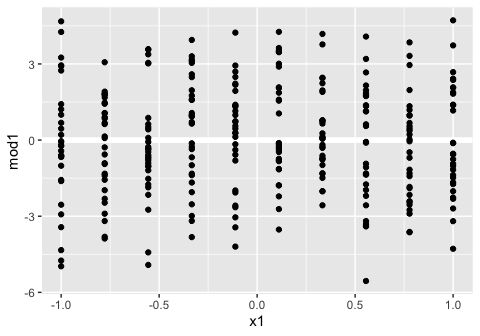

``` r
ggplot(sim4, aes(x1, mod2)) + 
  geom_ref_line(h = 0) +
  geom_point() 
```

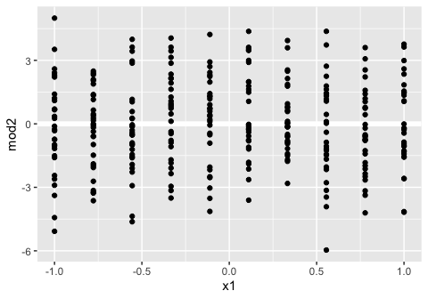

``` r
sim4 %>% summarize ( mod1_rmse = sqrt(mean(mod1^2)),
                     mod2_rmse = sqrt(mean(mod2^2)))
```

    ## # A tibble: 1 x 2
    ##   mod1_rmse mod2_rmse
    ##       <dbl>     <dbl>
    ## 1      2.10      2.06

Chapter 24
==========

For this chapter, the following packages and modifications to datasets were used:

``` r
options(na.action = na.warn)
library(nycflights13)
library(lubridate)
```

    ## 
    ## Attaching package: 'lubridate'

    ## The following object is masked from 'package:base':
    ## 
    ##     date

``` r
diamonds2 <- diamonds %>% 
  filter(carat <= 2.5) %>% 
  mutate(lprice = log2(price), lcarat = log2(carat))
```

24.2.3 Exercises
----------------

### 1. In the plot of lcarat vs. lprice, there are some bright vertical strips. What do they represent?

The color of each hexagon in geom\_hex corresponds to the number of observations that lie within the hexagon, which means that the bright vertical strips represent highly concentrated areas containing large amounts of observations relative to the dim hexagons. Hadley alludes to the possible reason why these stripes exist in the previous chapters, where he mentions that humans are inclined to report "pretty" intervals such as 1.0, 1.5, 2.0, etc, resulting in more observations lying on these intervals.

``` r
ggplot(diamonds2, aes(lcarat, lprice)) + 
  geom_hex(bins = 50)
```

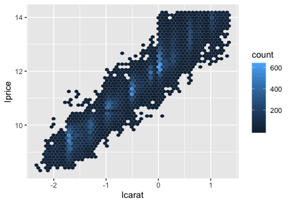

### 2. If log(price) = a\_0 + a\_1 \* log(carat), what does that say about the relationship between price and carat?

This equation suggests that there is a linear relationsihp between log(price) and log(carat), because the equation can be interpreted as a\_0 being an intercept and a\_1 being a "slope". It is harder to discern the relationship between the non-logged price and carat given this equation. The relationship between the original non-transformed variables may not necessarily be linear.

### 3. Extract the diamonds that have very high and very low residuals. Is there anything unusual about these diamonds? Are they particularly bad or good, or do you think these are pricing errors?

Hadley extracts the diamonds with high / low residuals (abs(lresid2) &gt; 1) in the code below. After examining these, we find that most of the outlier diamonds that are priced much lower than predicted have a specific flaw associated with them. For example, $1262 predicted to be $2644 has a huge carat size but has a clarity of I1 (worst clarity), of which there are not that many observations for in the dataset (707 observations for grade I1 vs 13055 observations for grade SI1).

The diamonds in this list usually have a combination of very good qualities as well as very bad qualities. It could be that there is some multicollinearity in the model, in which some of the predictor variables (lcarat, color, cut, and clarity) are correlated with one another. This may result in the model breaking down when something when the values of two variables which usually are correlated do not follow the trend for any specific observation. For example, the diamond priced at 2366 is predicted to only be 774, but this is likely due to the fact that the diamond has one of the best clarity values, but has the worst possible color. Looking at a density plot of color vs clarity, we find that there are very few observations which have this combination of color and clarity, which may be why the model breaks down.

``` r
mod_diamond2 <- lm(lprice ~ lcarat + color + cut + clarity, data = diamonds2)

diamonds2 <- diamonds2 %>% 
  add_residuals(mod_diamond2, "lresid2")

ggplot(diamonds2, aes(lcarat, lresid2)) + 
  geom_hex(bins = 50)
```

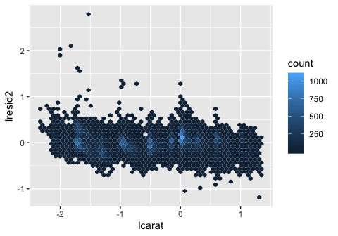

``` r
diamonds2 %>% 
  filter(abs(lresid2) > 1) %>% 
  add_predictions(mod_diamond2) %>% 
  mutate(pred = round(2 ^ pred)) %>% 
  select(price, pred, carat:table, x:z, lresid2) %>% 
  arrange(price)
```

    ## # A tibble: 16 x 12
    ##    price  pred carat cut   color clarity depth table     x     y     z
    ##    <int> <dbl> <dbl> <ord> <ord> <ord>   <dbl> <dbl> <dbl> <dbl> <dbl>
    ##  1  1013   264 0.25  Fair  F     SI2      54.4    64  4.3   4.23  2.32
    ##  2  1186   284 0.25  Prem… G     SI2      59      60  5.33  5.28  3.12
    ##  3  1186   284 0.25  Prem… G     SI2      58.8    60  5.33  5.28  3.12
    ##  4  1262  2644 1.03  Fair  E     I1       78.2    54  5.72  5.59  4.42
    ##  5  1415   639 0.35  Fair  G     VS2      65.9    54  5.57  5.53  3.66
    ##  6  1415   639 0.35  Fair  G     VS2      65.9    54  5.57  5.53  3.66
    ##  7  1715   576 0.32  Fair  F     VS2      59.6    60  4.42  4.34  2.61
    ##  8  1776   412 0.290 Fair  F     SI1      55.8    60  4.48  4.41  2.48
    ##  9  2160   314 0.34  Fair  F     I1       55.8    62  4.72  4.6   2.6 
    ## 10  2366   774 0.3   Very… D     VVS2     60.6    58  4.33  4.35  2.63
    ## 11  3360  1373 0.51  Prem… F     SI1      62.7    62  5.09  4.96  3.15
    ## 12  3807  1540 0.61  Good  F     SI2      62.5    65  5.36  5.29  3.33
    ## 13  3920  1705 0.51  Fair  F     VVS2     65.4    60  4.98  4.9   3.23
    ## 14  4368  1705 0.51  Fair  F     VVS2     60.7    66  5.21  5.11  3.13
    ## 15 10011  4048 1.01  Fair  D     SI2      64.6    58  6.25  6.2   4.02
    ## 16 10470 23622 2.46  Prem… E     SI2      59.7    59  8.82  8.76  5.25
    ## # … with 1 more variable: lresid2 <dbl>

``` r
diamonds2 %>% group_by(clarity) %>% summarize (num = n())
```

    ## # A tibble: 8 x 2
    ##   clarity   num
    ##   <ord>   <int>
    ## 1 I1        707
    ## 2 SI2      9116
    ## 3 SI1     13055
    ## 4 VS2     12256
    ## 5 VS1      8169
    ## 6 VVS2     5066
    ## 7 VVS1     3655
    ## 8 IF       1790

``` r
diamonds2 %>% ggplot(aes(color, clarity))+
  geom_bin2d()
```

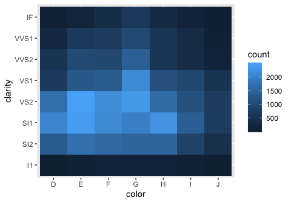

### 4. Does the final model, mod\_diamond2, do a good job of predicting diamond prices? Would you trust it to tell you how much to spend if you were buying a diamond?

Judging by the plot of the residuals, the model does a decent job at removing the patterns in the data (fairly flat, only a handful of residuals &gt; 1 st. deviation away from 0) for the log-transformed version of the data. The model could be improved to reduce the variance of the residuals (compress the points toward h=0), in order to get more accurate predictions. However, since we aren't dealing with log-transformed money when buying diamonds in the real world, we should examine how the residuals look when transformed back into their true values. To do so, we calculate subtract the non-logged prediction value from the true value to get the non-transformed residual. Plotting these non-transformed residuals shows that the variability in residuals increases as carat increases (same is true for lcarat). I would have moderate faith in the model for diamonds less than 1 carat, but for diamonds greater than one carat, I would be cautious. The model would be useful to determine whether you were being completely scammed, but it may not be that good for determining small variations in price.

``` r
nontransformed_residual <- diamonds2 %>%   
    filter(abs(lresid2) < 1) %>% 
    add_predictions(mod_diamond2) %>% 
    mutate(pred = round(2 ^ pred)) %>%
    mutate(resid = price - pred) 

nontransformed_residual %>% ggplot( aes (carat, resid) )+
  geom_hex()
```

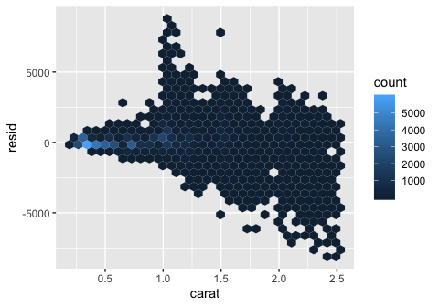

``` r
nontransformed_residual %>% 
  summarize (resid_mean = mean(resid),
             resid_sd = sd(resid),
             resid_interval_low = mean(resid) - 1.96* sd(resid),
             resid_interval_high = mean(resid) + 1.96* sd(resid),
             limit_upper = max(resid),
             limit_lower = min(resid),
             maxprice = max(price),
             minprice = min(price))
```

    ## # A tibble: 1 x 8
    ##   resid_mean resid_sd resid_interval_… resid_interval_… limit_upper
    ##        <dbl>    <dbl>            <dbl>            <dbl>       <dbl>
    ## 1       49.0     731.           -1385.            1483.        8994
    ## # … with 3 more variables: limit_lower <dbl>, maxprice <int>,
    ## #   minprice <int>

24.3.5 Exercises
----------------

``` r
daily <- flights %>% 
  mutate(date = make_date(year, month, day)) %>% 
  group_by(date) %>% 
  summarise(n = n())
daily
```

    ## # A tibble: 365 x 2
    ##    date           n
    ##    <date>     <int>
    ##  1 2013-01-01   842
    ##  2 2013-01-02   943
    ##  3 2013-01-03   914
    ##  4 2013-01-04   915
    ##  5 2013-01-05   720
    ##  6 2013-01-06   832
    ##  7 2013-01-07   933
    ##  8 2013-01-08   899
    ##  9 2013-01-09   902
    ## 10 2013-01-10   932
    ## # … with 355 more rows

``` r
ggplot(daily, aes(date, n)) + 
  geom_line()
```

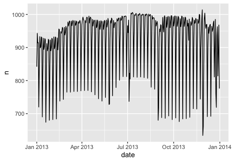

``` r
daily <- daily %>% 
  mutate(wday = wday(date, label = TRUE))
mod <- lm(n ~ wday, data = daily)

daily <- daily %>% 
  add_residuals(mod)
daily %>% 
  ggplot(aes(date, resid)) + 
  geom_ref_line(h = 0) + 
  geom_line()
```

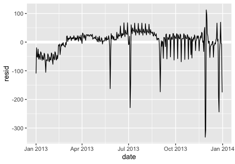

``` r
term <- function(date) {
  cut(date, 
    breaks = ymd(20130101, 20130605, 20130825, 20140101),
    labels = c("spring", "summer", "fall") 
  )
}

daily <- daily %>% 
  mutate(term = term(date)) 
```

### 1. Use your Google sleuthing skills to brainstorm why there were fewer than expected flights on Jan 20, May 26, and Sep 1. (Hint: they all have the same explanation.) How would these days generalise to another year?

These days are all the day before major US holidays (Sep 2, 2013 is Labor Day) which fall exclusively on Mondays. There may be fewer than expected flights due to the extended weekend / other holiday-associated factors. For another year, these days can be found by looking for the day before the third Monday in January, fourth Monday in May, and first Monday in September.

### 2. What do the three days with high positive residuals represent? How would these days generalise to another year?

These days look like are also associated with major US holidays, with 11/30/2013 and 12/01/2013 being the weekend after Thanksgiving, and 12/28/2013 being the weekend after Christmas. The reason flights peak on these days may be due to families who had visited their relatives leaving to go back home. These can be generalized to another year by looking for the weekends after these holidays, which typically fall after the 4th week of November and December.

``` r
daily %>% 
  top_n(3, resid)
```

    ## # A tibble: 3 x 5
    ##   date           n wday  resid term 
    ##   <date>     <int> <ord> <dbl> <fct>
    ## 1 2013-11-30   857 Sat   112.  fall 
    ## 2 2013-12-01   987 Sun    95.5 fall 
    ## 3 2013-12-28   814 Sat    69.4 fall

### 3. Create a new variable that splits the wday variable into terms, but only for Saturdays, i.e. it should have Thurs, Fri, but Sat-summer, Sat-spring, Sat-fall. How does this model compare with the model with every combination of wday and term?

In order to split the saturdays into terms, I wrote an annotate\_sat() function that takes the wday column and term column from daily and applies the appropriate suffix to each "Sat". Fitting this model (mod3) and comparing it to the mod1 and mod2 described in the chapter shows that there is a slight improvement from mod 1 (no term variable), but that the model does slightly worse than mod2 (each day is termed). The RMSE is midway between mod1 and mod2.

``` r
annotate_sat <- function (wday, term) {
  index <- which (wday == "Sat")
  wday <- as.character(wday)
  wday[index] <- str_c("Sat-", as.character(term)[index])
  wday
}

daily <- daily %>% mutate (wday_sat = annotate_sat(wday,term))
daily
```

    ## # A tibble: 365 x 6
    ##    date           n wday   resid term   wday_sat  
    ##    <date>     <int> <ord>  <dbl> <fct>  <chr>     
    ##  1 2013-01-01   842 Tue   -109.  spring Tue       
    ##  2 2013-01-02   943 Wed    -19.7 spring Wed       
    ##  3 2013-01-03   914 Thu    -51.8 spring Thu       
    ##  4 2013-01-04   915 Fri    -52.5 spring Fri       
    ##  5 2013-01-05   720 Sat    -24.6 spring Sat-spring
    ##  6 2013-01-06   832 Sun    -59.5 spring Sun       
    ##  7 2013-01-07   933 Mon    -41.8 spring Mon       
    ##  8 2013-01-08   899 Tue    -52.4 spring Tue       
    ##  9 2013-01-09   902 Wed    -60.7 spring Wed       
    ## 10 2013-01-10   932 Thu    -33.8 spring Thu       
    ## # … with 355 more rows

``` r
mod1 <- lm(n ~ wday, data = daily)
mod2 <- lm(n ~ wday * term, data = daily)
mod3 <- lm(n ~ wday_sat, data = daily)

daily %>% 
  gather_residuals(no_term = mod1, all_cominbations = mod2, only_sat_term = mod3) %>% 
  ggplot(aes(date, resid, colour = model)) +
    geom_line(alpha = 0.75)
```


``` r
sigma(mod1)
```

    ## [1] 48.79656

``` r
sigma(mod2)
```

    ## [1] 46.16568

``` r
sigma(mod3)
```

    ## [1] 47.35969

### 4. Create a new wday variable that combines the day of week, term (for Saturdays), and public holidays. What do the residuals of that model look like?

The code below adds a column to the data frame that indicates which days are holidays (I've chosen the main US corporate holidays for 2013). Fitting a model to this results in an rmse value that is lower than the model in which only the saturdays are termed (goes down from 47.36 to 42.94), suggesting that we are doing at least a slightly better job. Looking at the graph, the residuals that spike along the holidays are smaller (but still quite visible). There could be more ways to optimize the model to minimize these residuals, suchs as annotating wday with the few days before/after each holiday.

``` r
daily
```

    ## # A tibble: 365 x 6
    ##    date           n wday   resid term   wday_sat  
    ##    <date>     <int> <ord>  <dbl> <fct>  <chr>     
    ##  1 2013-01-01   842 Tue   -109.  spring Tue       
    ##  2 2013-01-02   943 Wed    -19.7 spring Wed       
    ##  3 2013-01-03   914 Thu    -51.8 spring Thu       
    ##  4 2013-01-04   915 Fri    -52.5 spring Fri       
    ##  5 2013-01-05   720 Sat    -24.6 spring Sat-spring
    ##  6 2013-01-06   832 Sun    -59.5 spring Sun       
    ##  7 2013-01-07   933 Mon    -41.8 spring Mon       
    ##  8 2013-01-08   899 Tue    -52.4 spring Tue       
    ##  9 2013-01-09   902 Wed    -60.7 spring Wed       
    ## 10 2013-01-10   932 Thu    -33.8 spring Thu       
    ## # … with 355 more rows

``` r
annotate_sat_holiday <- function (date, wday, term) {
  index <- which (wday == "Sat")
  wday <- as.character(wday)
  wday[index] <- str_c("Sat-", as.character(term)[index])
  holidays <- ymd(20130101, 20130527, 20130704, 20130902, 20131111, 20131128, 20131225)
  holday_index <- which (date %in% holidays)
  wday[which (date %in% holidays)] <- "holiday"
  wday
}

daily <- daily %>% mutate( wday_sat_holiday = annotate_sat_holiday(date,wday,term))
daily
```

    ## # A tibble: 365 x 7
    ##    date           n wday   resid term   wday_sat   wday_sat_holiday
    ##    <date>     <int> <ord>  <dbl> <fct>  <chr>      <chr>           
    ##  1 2013-01-01   842 Tue   -109.  spring Tue        holiday         
    ##  2 2013-01-02   943 Wed    -19.7 spring Wed        Wed             
    ##  3 2013-01-03   914 Thu    -51.8 spring Thu        Thu             
    ##  4 2013-01-04   915 Fri    -52.5 spring Fri        Fri             
    ##  5 2013-01-05   720 Sat    -24.6 spring Sat-spring Sat-spring      
    ##  6 2013-01-06   832 Sun    -59.5 spring Sun        Sun             
    ##  7 2013-01-07   933 Mon    -41.8 spring Mon        Mon             
    ##  8 2013-01-08   899 Tue    -52.4 spring Tue        Tue             
    ##  9 2013-01-09   902 Wed    -60.7 spring Wed        Wed             
    ## 10 2013-01-10   932 Thu    -33.8 spring Thu        Thu             
    ## # … with 355 more rows

``` r
mod4 <- lm(n ~ wday_sat_holiday, data = daily)

daily %>% 
  gather_residuals(only_sat_term = mod3, sat_with_holiday = mod4) %>% 
  ggplot(aes(date, resid, colour = model)) +
    geom_line(alpha = 0.75)
```

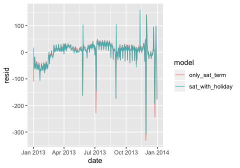

``` r
sigma(mod3)
```

    ## [1] 47.35969

``` r
sigma(mod4)
```

    ## [1] 42.94494

### 5. What happens if you fit a day of week effect that varies by month (i.e. n ~ wday \* month)? Why is this not very helpful?

Adding the month variable to the model reduces the values of the residuals by a small amount (and subsequently, the rmse). I would say that it is slightly helpful to include. I can see why it is not extremely helpful, because it may be over-fitting the data, as there is not necessarily a good reason to assume that each individual month is associated with their own unique day-of-the-week trends. This adds a large amount of predictor variables to the model that are not all necessarily independent from each other.

``` r
# add month column to daily
daily <- daily %>% mutate(month = factor(month(date)))
daily
```

    ## # A tibble: 365 x 8
    ##    date           n wday   resid term   wday_sat   wday_sat_holiday month
    ##    <date>     <int> <ord>  <dbl> <fct>  <chr>      <chr>            <fct>
    ##  1 2013-01-01   842 Tue   -109.  spring Tue        holiday          1    
    ##  2 2013-01-02   943 Wed    -19.7 spring Wed        Wed              1    
    ##  3 2013-01-03   914 Thu    -51.8 spring Thu        Thu              1    
    ##  4 2013-01-04   915 Fri    -52.5 spring Fri        Fri              1    
    ##  5 2013-01-05   720 Sat    -24.6 spring Sat-spring Sat-spring       1    
    ##  6 2013-01-06   832 Sun    -59.5 spring Sun        Sun              1    
    ##  7 2013-01-07   933 Mon    -41.8 spring Mon        Mon              1    
    ##  8 2013-01-08   899 Tue    -52.4 spring Tue        Tue              1    
    ##  9 2013-01-09   902 Wed    -60.7 spring Wed        Wed              1    
    ## 10 2013-01-10   932 Thu    -33.8 spring Thu        Thu              1    
    ## # … with 355 more rows

``` r
mod5 <- lm(n ~ wday*month, data = daily)

daily %>% 
  gather_residuals(original_model = mod1,  with_month = mod5) %>% 
  ggplot(aes(date, resid, colour = model)) +
    geom_line(alpha = 0.75)
```

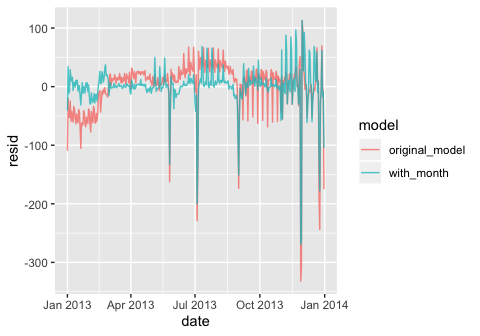

``` r
#summary(mod5)
sigma(mod1)
```

    ## [1] 48.79656

``` r
sigma(mod5)
```

    ## [1] 42.0489

### 6. What would you expect the model n ~ wday + ns(date, 5) to look like? Knowing what you know about the data, why would you expect it to be not particularly effective?

The book displays what the model n ~ wday \* ns(date, 5) looks like, which factors in the relationship between wday and the time of year into the model. The model n ~ wday + ns(date, 5) uses the "+" operator instead of "\*", which means that this model does not account for the relationship between these two variables. I would expect that n ~ wday + ns(date, 5) does a worse job as a predictive model. Testing this out below, we see that the residuals are indeed larger. The number of predictor variables are also much fewer.

``` r
library(splines)
mod6 <- MASS::rlm(n ~ wday * ns(date, 5), data = daily)
mod7 <- MASS::rlm(n ~ wday + ns(date, 5), data = daily)

summary(mod6)
```

    ## 
    ## Call: rlm(formula = n ~ wday * ns(date, 5), data = daily)
    ## Residuals:
    ##     Min      1Q  Median      3Q     Max 
    ## -339.23   -8.00    1.33    6.94  119.10 
    ## 
    ## Coefficients:
    ##                     Value     Std. Error t value  
    ## (Intercept)          839.1368    3.2049   261.8314
    ## wday.L               -58.0966    8.7636    -6.6293
    ## wday.Q              -177.5614    8.4931   -20.9065
    ## wday.C               -76.1745    8.5575    -8.9015
    ## wday^4              -106.5457    8.6304   -12.3454
    ## wday^5                14.7852    8.3463     1.7715
    ## wday^6               -18.4661    8.0673    -2.2890
    ## ns(date, 5)1          90.3704    4.0032    22.5743
    ## ns(date, 5)2         133.7194    5.1333    26.0493
    ## ns(date, 5)3          41.3817    3.9584    10.4542
    ## ns(date, 5)4         180.6645    8.1033    22.2952
    ## ns(date, 5)5          28.9177    3.5076     8.2443
    ## wday.L:ns(date, 5)1  -35.0805   10.6922    -3.2809
    ## wday.Q:ns(date, 5)1   11.6486   10.5964     1.0993
    ## wday.C:ns(date, 5)1   -6.8751   10.6179    -0.6475
    ## wday^4:ns(date, 5)1   23.7107   10.6477     2.2268
    ## wday^5:ns(date, 5)1  -21.0685   10.5431    -1.9983
    ## wday^6:ns(date, 5)1    6.6103   10.4507     0.6325
    ## wday.L:ns(date, 5)2   19.8440   13.8192     1.4360
    ## wday.Q:ns(date, 5)2   66.9609   13.5972     4.9246
    ## wday.C:ns(date, 5)2   54.5911   13.6393     4.0025
    ## wday^4:ns(date, 5)2   59.4655   13.7181     4.3348
    ## wday^5:ns(date, 5)2  -21.2690   13.4571    -1.5805
    ## wday^6:ns(date, 5)2    8.7439   13.2506     0.6599
    ## wday.L:ns(date, 5)3 -104.5352   10.4834    -9.9715
    ## wday.Q:ns(date, 5)3  -83.6926   10.4858    -7.9815
    ## wday.C:ns(date, 5)3  -77.0187   10.4500    -7.3702
    ## wday^4:ns(date, 5)3  -36.3447   10.5211    -3.4545
    ## wday^5:ns(date, 5)3  -25.0391   10.4165    -2.4038
    ## wday^6:ns(date, 5)3    0.8459   10.4801     0.0807
    ## wday.L:ns(date, 5)4  -29.5596   22.0451    -1.3409
    ## wday.Q:ns(date, 5)4   58.6436   21.4762     2.7306
    ## wday.C:ns(date, 5)4   32.5922   21.5929     1.5094
    ## wday^4:ns(date, 5)4   61.0040   21.7796     2.8010
    ## wday^5:ns(date, 5)4  -41.3648   21.1311    -1.9575
    ## wday^6:ns(date, 5)4   13.1682   20.5795     0.6399
    ## wday.L:ns(date, 5)5   39.3654    9.1661     4.2947
    ## wday.Q:ns(date, 5)5   59.7652    9.3101     6.4194
    ## wday.C:ns(date, 5)5   39.0233    9.1742     4.2536
    ## wday^4:ns(date, 5)5   22.0797    9.3456     2.3626
    ## wday^5:ns(date, 5)5    2.1498    9.1824     0.2341
    ## wday^6:ns(date, 5)5   -4.9030    9.4987    -0.5162
    ## 
    ## Residual standard error: 10.69 on 323 degrees of freedom

``` r
summary(mod7)
```

    ## 
    ## Call: rlm(formula = n ~ wday + ns(date, 5), data = daily)
    ## Residuals:
    ##       Min        1Q    Median        3Q       Max 
    ## -339.2832   -8.1235    0.1509    9.3763  111.5557 
    ## 
    ## Coefficients:
    ##              Value     Std. Error t value  
    ## (Intercept)   843.7636    3.5622   236.8666
    ## wday.L        -80.1706    2.1137   -37.9291
    ## wday.Q       -156.9939    2.1125   -74.3180
    ## wday.C        -68.1163    2.1111   -32.2664
    ## wday^4        -78.8676    2.1143   -37.3026
    ## wday^5         -6.3087    2.1084    -2.9922
    ## wday^6        -11.5275    2.1095    -5.4646
    ## ns(date, 5)1   87.4028    4.4681    19.5615
    ## ns(date, 5)2  121.4169    5.7198    21.2276
    ## ns(date, 5)3   53.7103    4.4159    12.1630
    ## ns(date, 5)4  169.0229    9.0113    18.7567
    ## ns(date, 5)5   18.4859    3.9036     4.7356
    ## 
    ## Residual standard error: 13.24 on 353 degrees of freedom

``` r
daily %>% 
  gather_residuals(multiplicative_splines = mod6,  additive_splines = mod7) %>% 
  ggplot(aes(date, resid, colour = model)) +
    geom_line(alpha = 0.75)
```

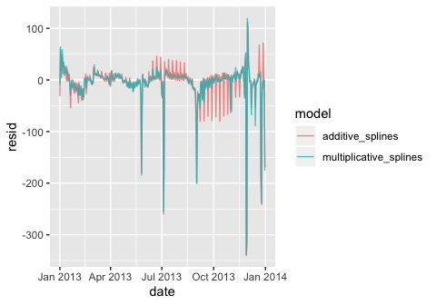

``` r
sigma(mod6)
```

    ## [1] 43.92417

``` r
sigma(mod7)
```

    ## [1] 44.30197

### 7. We hypothesised that people leaving on Sundays are more likely to be business travellers who need to be somewhere on Monday. Explore that hypothesis by seeing how it breaks down based on distance and time: if it’s true, you’d expect to see more Sunday evening flights to places that are far away.

To explore this hypothesis, we first generate a new data frame from flights that contains a factor splitting up each day into early morning (12am-8am, 8am-12pm, 12pm-5pm, and 5pm-12am). We can then summarize the data to obtain the mean distance of flights that occurred during each of those intervals grouped by day. Plotting this using boxplots, we observe that flights taking off between 1am and 8am on Sundays have a much higher mean distance compared to all other categories. Contrary to our hypothesis that evening flights (5pm-12am) would be the longest distance-wise, we instead see that there are more Sunday early morning flights between 12am-8am.

``` r
# add distance and time of flight to daily matrix
timeofday <- function(date) {
  cut(date, 
    breaks = c(0,7, 12, 17, 23),
    labels = c("12am-8am", "8am-12pm", "12pm-5pm","5pm-12am") 
  )
}

flights2 <- flights %>% mutate (date = make_date (year, month, day), timeofday = timeofday(hour)) %>% 
  group_by(date, timeofday) %>% 
  summarize (n = n(),
             mean_dist = mean(distance)) %>%
  mutate(wday = wday(date, label = TRUE))

flights2
```

    ## # A tibble: 1,460 x 5
    ## # Groups:   date [365]
    ##    date       timeofday     n mean_dist wday 
    ##    <date>     <fct>     <int>     <dbl> <ord>
    ##  1 2013-01-01 12am-8am    107     1234. Tue  
    ##  2 2013-01-01 8am-12pm    246     1074. Tue  
    ##  3 2013-01-01 12pm-5pm    301     1040. Tue  
    ##  4 2013-01-01 5pm-12am    188     1051. Tue  
    ##  5 2013-01-02 12am-8am    146     1132. Wed  
    ##  6 2013-01-02 8am-12pm    274     1045. Wed  
    ##  7 2013-01-02 12pm-5pm    318     1023. Wed  
    ##  8 2013-01-02 5pm-12am    205     1054. Wed  
    ##  9 2013-01-03 12am-8am    144     1118. Thu  
    ## 10 2013-01-03 8am-12pm    262     1037. Thu  
    ## # … with 1,450 more rows

``` r
ggplot(flights2, aes (x = wday, y = mean_dist))+
  geom_boxplot(aes(color = timeofday))
```

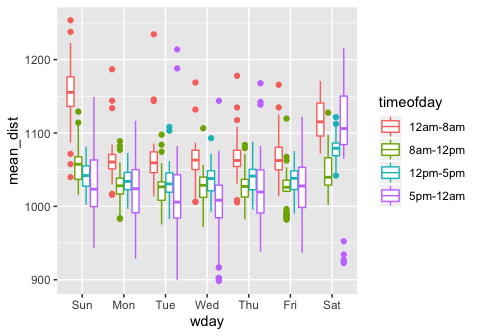

``` r
# 
# flights %>% mutate (date = make_date (year, month, day), timeofday = timeofday(hour)) %>% 
#   mutate(wday = wday(date, label = TRUE))%>%
#   ggplot( aes (x = wday, y = distance))+
#   geom_boxplot(aes(color = timeofday))
```

### 8. It’s a little frustrating that Sunday and Saturday are on separate ends of the plot. Write a small function to set the levels of the factor so that the week starts on Monday.

The levels of a factor can be re-ordered using the factor() function and redefining the order of the levels by manually passing them into the levels argument. Below is an example of a function reordering the factors so that the week starts on monday.

``` r
# before reordering the factors
ggplot(daily, aes(wday, n)) + 
  geom_boxplot()
```

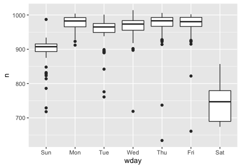

``` r
reorder_week <- function (mydata) {
  mydata <- factor(mydata, levels = c("Mon", "Tue", "Wed", "Thu", "Fri", "Sat", "Sun"))
  mydata
}

# after reordering the factors
daily %>% mutate (wday2 = reorder_week(wday)) %>% ggplot( aes(wday2, n)) + 
  geom_boxplot()
```

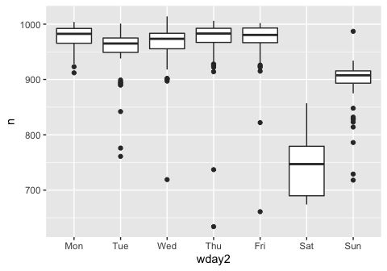

Chapter 25
==========

``` r
library(gapminder)
by_country <- gapminder %>% 
  group_by(country, continent) %>% 
  nest()

by_country
```

    ## # A tibble: 142 x 3
    ##    country     continent data             
    ##    <fct>       <fct>     <list>           
    ##  1 Afghanistan Asia      <tibble [12 × 4]>
    ##  2 Albania     Europe    <tibble [12 × 4]>
    ##  3 Algeria     Africa    <tibble [12 × 4]>
    ##  4 Angola      Africa    <tibble [12 × 4]>
    ##  5 Argentina   Americas  <tibble [12 × 4]>
    ##  6 Australia   Oceania   <tibble [12 × 4]>
    ##  7 Austria     Europe    <tibble [12 × 4]>
    ##  8 Bahrain     Asia      <tibble [12 × 4]>
    ##  9 Bangladesh  Asia      <tibble [12 × 4]>
    ## 10 Belgium     Europe    <tibble [12 × 4]>
    ## # … with 132 more rows

``` r
## wrapper function to model lifeExp by year
country_model <- function(df) {
  lm(lifeExp ~ year, data = df)
}

## add the model as a list-column to the nested data
by_country <- by_country %>% 
  mutate(model = map(data, country_model))
by_country
```

    ## # A tibble: 142 x 4
    ##    country     continent data              model 
    ##    <fct>       <fct>     <list>            <list>
    ##  1 Afghanistan Asia      <tibble [12 × 4]> <lm>  
    ##  2 Albania     Europe    <tibble [12 × 4]> <lm>  
    ##  3 Algeria     Africa    <tibble [12 × 4]> <lm>  
    ##  4 Angola      Africa    <tibble [12 × 4]> <lm>  
    ##  5 Argentina   Americas  <tibble [12 × 4]> <lm>  
    ##  6 Australia   Oceania   <tibble [12 × 4]> <lm>  
    ##  7 Austria     Europe    <tibble [12 × 4]> <lm>  
    ##  8 Bahrain     Asia      <tibble [12 × 4]> <lm>  
    ##  9 Bangladesh  Asia      <tibble [12 × 4]> <lm>  
    ## 10 Belgium     Europe    <tibble [12 × 4]> <lm>  
    ## # … with 132 more rows

``` r
## calculate residuals based on the nested data and the associated model
by_country <- by_country %>% 
  mutate(
    resids = map2(data, model, add_residuals)
  )
by_country
```

    ## # A tibble: 142 x 5
    ##    country     continent data              model  resids           
    ##    <fct>       <fct>     <list>            <list> <list>           
    ##  1 Afghanistan Asia      <tibble [12 × 4]> <lm>   <tibble [12 × 5]>
    ##  2 Albania     Europe    <tibble [12 × 4]> <lm>   <tibble [12 × 5]>
    ##  3 Algeria     Africa    <tibble [12 × 4]> <lm>   <tibble [12 × 5]>
    ##  4 Angola      Africa    <tibble [12 × 4]> <lm>   <tibble [12 × 5]>
    ##  5 Argentina   Americas  <tibble [12 × 4]> <lm>   <tibble [12 × 5]>
    ##  6 Australia   Oceania   <tibble [12 × 4]> <lm>   <tibble [12 × 5]>
    ##  7 Austria     Europe    <tibble [12 × 4]> <lm>   <tibble [12 × 5]>
    ##  8 Bahrain     Asia      <tibble [12 × 4]> <lm>   <tibble [12 × 5]>
    ##  9 Bangladesh  Asia      <tibble [12 × 4]> <lm>   <tibble [12 × 5]>
    ## 10 Belgium     Europe    <tibble [12 × 4]> <lm>   <tibble [12 × 5]>
    ## # … with 132 more rows

``` r
resids <- unnest(by_country, resids)
resids %>% group_by(country) %>% summarise (rsme = sqrt(mean(resid^2)))
```

    ## # A tibble: 142 x 2
    ##    country      rsme
    ##    <fct>       <dbl>
    ##  1 Afghanistan 1.12 
    ##  2 Albania     1.81 
    ##  3 Algeria     1.21 
    ##  4 Angola      1.28 
    ##  5 Argentina   0.267
    ##  6 Australia   0.567
    ##  7 Austria     0.372
    ##  8 Bahrain     1.50 
    ##  9 Bangladesh  0.892
    ## 10 Belgium     0.267
    ## # … with 132 more rows

25.2.5 Exercises
----------------

### 1. A linear trend seems to be slightly too simple for the overall trend. Can you do better with a quadratic polynomial? How can you interpret the coefficients of the quadratic? (Hint you might want to transform year so that it has mean zero.)

We can fit a quadratic polynomial either by using the equation y ~ poly(x,2) or writing it out as y ~ I(x^2) + x. When we fit this model to the data, we see that the majority of the rmse values calculated using the residuals by country are reduced compared to the original linear model used in this chapter. This suggests that we are doing better.

``` r
country_model_poly <- function(df) {
  lm(lifeExp ~ poly(year,2), data = df)
  # alternatively can use lm(lifeExp ~ I(year^2)+year, data = df) for raw polynomial
}

country_model_poly_centered <- function(df) {
  lm(lifeExp ~ poly(year-mean(year),2), data = df)
}

by_country <- by_country %>% 
  mutate(model2 = map(data, country_model_poly),
         model3 = map(data, country_model_poly_centered)) %>%
  mutate(resids2 = map2(data, model2, add_residuals))

## residual freq-poly plot
resids2 <- unnest(by_country, resids2)
resids2 %>% 
  ggplot(aes(year, resid)) +
    geom_line(aes(group = country), alpha = 1 / 3) + 
    geom_smooth(se = FALSE)
```

    ## `geom_smooth()` using method = 'gam' and formula 'y ~ s(x, bs = "cs")'

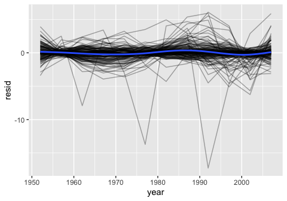

``` r
## R-squared value
glance <- by_country %>% 
  mutate(glance = map(model2, broom::glance)) %>% 
  unnest(glance, .drop = TRUE) 

glance %>% ggplot(aes(continent, r.squared)) + 
    geom_jitter(width = 0.5)
```

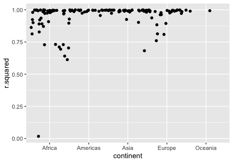

``` r
# rmse using the polynomial model
resids2 %>% group_by(country) %>% summarise (rmse = sqrt(mean(resid^2)))
```

    ## # A tibble: 142 x 2
    ##    country      rmse
    ##    <fct>       <dbl>
    ##  1 Afghanistan 0.507
    ##  2 Albania     1.19 
    ##  3 Algeria     0.883
    ##  4 Angola      0.561
    ##  5 Argentina   0.266
    ##  6 Australia   0.339
    ##  7 Austria     0.308
    ##  8 Bahrain     0.425
    ##  9 Bangladesh  0.451
    ## 10 Belgium     0.236
    ## # … with 132 more rows

``` r
# rmse using the original linear model
resids %>% group_by(country) %>% summarise (rmse = sqrt(mean(resid^2)))
```

    ## # A tibble: 142 x 2
    ##    country      rmse
    ##    <fct>       <dbl>
    ##  1 Afghanistan 1.12 
    ##  2 Albania     1.81 
    ##  3 Algeria     1.21 
    ##  4 Angola      1.28 
    ##  5 Argentina   0.267
    ##  6 Australia   0.567
    ##  7 Austria     0.372
    ##  8 Bahrain     1.50 
    ##  9 Bangladesh  0.892
    ## 10 Belgium     0.267
    ## # … with 132 more rows

When we compare the model summaries for the centered (mean 0) model vs the non-centered model, the estimates for the coefficients are the same. Poly() creates orthogonal polynomials for the fit. The coefficients may be interpreted as the weight associated with a unit of change in year.

``` r
summary(by_country$model2[[1]])
```

    ## 
    ## Call:
    ## lm(formula = lifeExp ~ poly(year, 2), data = df)
    ## 
    ## Residuals:
    ##      Min       1Q   Median       3Q      Max 
    ## -0.75900 -0.51487  0.02653  0.51654  0.62231 
    ## 
    ## Coefficients:
    ##                Estimate Std. Error t value Pr(>|t|)    
    ## (Intercept)     37.4788     0.1691 221.693  < 2e-16 ***
    ## poly(year, 2)1  16.4623     0.5856  28.110 4.44e-10 ***
    ## poly(year, 2)2  -3.4446     0.5856  -5.882 0.000234 ***
    ## ---
    ## Signif. codes:  0 '***' 0.001 '**' 0.01 '*' 0.05 '.' 0.1 ' ' 1
    ## 
    ## Residual standard error: 0.5856 on 9 degrees of freedom
    ## Multiple R-squared:  0.9892, Adjusted R-squared:  0.9868 
    ## F-statistic: 412.4 on 2 and 9 DF,  p-value: 1.41e-09

``` r
summary(by_country$model3[[1]])
```

    ## 
    ## Call:
    ## lm(formula = lifeExp ~ poly(year - mean(year), 2), data = df)
    ## 
    ## Residuals:
    ##      Min       1Q   Median       3Q      Max 
    ## -0.75900 -0.51487  0.02653  0.51654  0.62231 
    ## 
    ## Coefficients:
    ##                             Estimate Std. Error t value Pr(>|t|)    
    ## (Intercept)                  37.4788     0.1691 221.693  < 2e-16 ***
    ## poly(year - mean(year), 2)1  16.4623     0.5856  28.110 4.44e-10 ***
    ## poly(year - mean(year), 2)2  -3.4446     0.5856  -5.882 0.000234 ***
    ## ---
    ## Signif. codes:  0 '***' 0.001 '**' 0.01 '*' 0.05 '.' 0.1 ' ' 1
    ## 
    ## Residual standard error: 0.5856 on 9 degrees of freedom
    ## Multiple R-squared:  0.9892, Adjusted R-squared:  0.9868 
    ## F-statistic: 412.4 on 2 and 9 DF,  p-value: 1.41e-09

### 2. Explore other methods for visualising the distribution of R2 per continent. You might want to try the ggbeeswarm package, which provides similar methods for avoiding overlaps as jitter, but uses deterministic methods.

To use the ggbeeswarm package, simply replace geom\_jitter() with geom\_beeswarm(). The output is below. We can augment the graph by adding additional graphics such as a boxplot.

``` r
library(ggbeeswarm)
glance %>% 
  ggplot(aes(continent, r.squared)) + 
    geom_beeswarm()
```

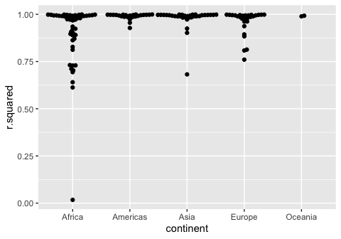

``` r
glance %>% 
  ggplot(aes(continent, r.squared)) + 
    geom_boxplot( aes(color = continent))+
    geom_beeswarm()
```


### 3. To create the last plot (showing the data for the countries with the worst model fits), we needed two steps: we created a data frame with one row per country and then semi-joined it to the original dataset. It’s possible to avoid this join if we use unnest() instead of unnest(.drop = TRUE). How?

Instead of using unnest(glance,.drop = TRUE), using unnest(glance) will retain the other columns in the dataset in addition to unnesting the glance column. This means that the list-column "data" will still be associated with the glance output, which contains the `year` and `lifeExp` variables that are needed to plot the final graph. We can then perform the filtering on the r.squared value, unnest the data, and then plot the graph, as shown below, without needing to semi-join.

``` r
glance <- by_country %>% 
  mutate(glance = map(model, broom::glance)) %>%
  unnest(glance)
glance
```

    ## # A tibble: 142 x 19
    ##    country continent data  model resids model2 model3 resids2 r.squared
    ##    <fct>   <fct>     <lis> <lis> <list> <list> <list> <list>      <dbl>
    ##  1 Afghan… Asia      <tib… <lm>  <tibb… <lm>   <lm>   <tibbl…     0.948
    ##  2 Albania Europe    <tib… <lm>  <tibb… <lm>   <lm>   <tibbl…     0.911
    ##  3 Algeria Africa    <tib… <lm>  <tibb… <lm>   <lm>   <tibbl…     0.985
    ##  4 Angola  Africa    <tib… <lm>  <tibb… <lm>   <lm>   <tibbl…     0.888
    ##  5 Argent… Americas  <tib… <lm>  <tibb… <lm>   <lm>   <tibbl…     0.996
    ##  6 Austra… Oceania   <tib… <lm>  <tibb… <lm>   <lm>   <tibbl…     0.980
    ##  7 Austria Europe    <tib… <lm>  <tibb… <lm>   <lm>   <tibbl…     0.992
    ##  8 Bahrain Asia      <tib… <lm>  <tibb… <lm>   <lm>   <tibbl…     0.967
    ##  9 Bangla… Asia      <tib… <lm>  <tibb… <lm>   <lm>   <tibbl…     0.989
    ## 10 Belgium Europe    <tib… <lm>  <tibb… <lm>   <lm>   <tibbl…     0.995
    ## # … with 132 more rows, and 10 more variables: adj.r.squared <dbl>,
    ## #   sigma <dbl>, statistic <dbl>, p.value <dbl>, df <int>, logLik <dbl>,
    ## #   AIC <dbl>, BIC <dbl>, deviance <dbl>, df.residual <int>

``` r
bad_fit <- filter(glance, r.squared < 0.25)
bad_fit
```

    ## # A tibble: 6 x 19
    ##   country continent data  model resids model2 model3 resids2 r.squared
    ##   <fct>   <fct>     <lis> <lis> <list> <list> <list> <list>      <dbl>
    ## 1 Botswa… Africa    <tib… <lm>  <tibb… <lm>   <lm>   <tibbl…    0.0340
    ## 2 Lesotho Africa    <tib… <lm>  <tibb… <lm>   <lm>   <tibbl…    0.0849
    ## 3 Rwanda  Africa    <tib… <lm>  <tibb… <lm>   <lm>   <tibbl…    0.0172
    ## 4 Swazil… Africa    <tib… <lm>  <tibb… <lm>   <lm>   <tibbl…    0.0682
    ## 5 Zambia  Africa    <tib… <lm>  <tibb… <lm>   <lm>   <tibbl…    0.0598
    ## 6 Zimbab… Africa    <tib… <lm>  <tibb… <lm>   <lm>   <tibbl…    0.0562
    ## # … with 10 more variables: adj.r.squared <dbl>, sigma <dbl>,
    ## #   statistic <dbl>, p.value <dbl>, df <int>, logLik <dbl>, AIC <dbl>,
    ## #   BIC <dbl>, deviance <dbl>, df.residual <int>

``` r
bad_fit %>% unnest (data) %>%
  ggplot(aes(year, lifeExp, colour = country)) +
    geom_line()
```

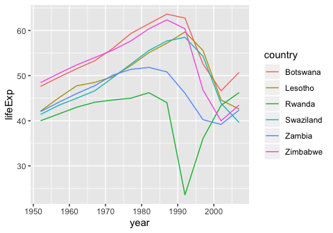

25.4.5 Exercises
----------------

### 1. List all the functions that you can think of that take a atomic vector and return a list.

enframe() or as\_tibble() will convert an atomic vector into a list. The map() function will return a list in which it applies a function that you specify on each element of the atomic vector (examples below). stringr functions return lists of strings, such as str\_split(). You may also encounter package-specific functions which may create their own types of objects. For example, in the bioinformatics world, you may have DESeq2 objects (bulk RNA-sequencing) or Seurat objects (single cell RNA-sequencing), which are S4 objects which contain several data types, including lists. Other functions that return lists are those shown in this chapter, such as broom::glance(), although in this instance the input is a model and not an atomic vector. split() also returns a list when applied to a dataframe.

``` r
my_atomic_vector <- c("hello","world")

map(my_atomic_vector, length)
```

    ## [[1]]
    ## [1] 1
    ## 
    ## [[2]]
    ## [1] 1

``` r
str_split(my_atomic_vector, "l")
```

    ## [[1]]
    ## [1] "he" ""   "o" 
    ## 
    ## [[2]]
    ## [1] "wor" "d"

``` r
typeof(as_tibble(my_atomic_vector))
```

    ## Warning: Calling `as_tibble()` on a vector is discouraged, because the behavior is likely to change in the future. Use `tibble::enframe(name = NULL)` instead.
    ## This warning is displayed once per session.

    ## [1] "list"

``` r
typeof(enframe(my_atomic_vector))
```

    ## [1] "list"

``` r
summary(my_atomic_vector)
```

    ##    Length     Class      Mode 
    ##         2 character character

``` r
mtcars %>% 
  split(.$cyl)
```

    ## $`4`
    ##                 mpg cyl  disp  hp drat    wt  qsec vs am gear carb
    ## Datsun 710     22.8   4 108.0  93 3.85 2.320 18.61  1  1    4    1
    ## Merc 240D      24.4   4 146.7  62 3.69 3.190 20.00  1  0    4    2
    ## Merc 230       22.8   4 140.8  95 3.92 3.150 22.90  1  0    4    2
    ## Fiat 128       32.4   4  78.7  66 4.08 2.200 19.47  1  1    4    1
    ## Honda Civic    30.4   4  75.7  52 4.93 1.615 18.52  1  1    4    2
    ## Toyota Corolla 33.9   4  71.1  65 4.22 1.835 19.90  1  1    4    1
    ## Toyota Corona  21.5   4 120.1  97 3.70 2.465 20.01  1  0    3    1
    ## Fiat X1-9      27.3   4  79.0  66 4.08 1.935 18.90  1  1    4    1
    ## Porsche 914-2  26.0   4 120.3  91 4.43 2.140 16.70  0  1    5    2
    ## Lotus Europa   30.4   4  95.1 113 3.77 1.513 16.90  1  1    5    2
    ## Volvo 142E     21.4   4 121.0 109 4.11 2.780 18.60  1  1    4    2
    ## 
    ## $`6`
    ##                 mpg cyl  disp  hp drat    wt  qsec vs am gear carb
    ## Mazda RX4      21.0   6 160.0 110 3.90 2.620 16.46  0  1    4    4
    ## Mazda RX4 Wag  21.0   6 160.0 110 3.90 2.875 17.02  0  1    4    4
    ## Hornet 4 Drive 21.4   6 258.0 110 3.08 3.215 19.44  1  0    3    1
    ## Valiant        18.1   6 225.0 105 2.76 3.460 20.22  1  0    3    1
    ## Merc 280       19.2   6 167.6 123 3.92 3.440 18.30  1  0    4    4
    ## Merc 280C      17.8   6 167.6 123 3.92 3.440 18.90  1  0    4    4
    ## Ferrari Dino   19.7   6 145.0 175 3.62 2.770 15.50  0  1    5    6
    ## 
    ## $`8`
    ##                      mpg cyl  disp  hp drat    wt  qsec vs am gear carb
    ## Hornet Sportabout   18.7   8 360.0 175 3.15 3.440 17.02  0  0    3    2
    ## Duster 360          14.3   8 360.0 245 3.21 3.570 15.84  0  0    3    4
    ## Merc 450SE          16.4   8 275.8 180 3.07 4.070 17.40  0  0    3    3
    ## Merc 450SL          17.3   8 275.8 180 3.07 3.730 17.60  0  0    3    3
    ## Merc 450SLC         15.2   8 275.8 180 3.07 3.780 18.00  0  0    3    3
    ## Cadillac Fleetwood  10.4   8 472.0 205 2.93 5.250 17.98  0  0    3    4
    ## Lincoln Continental 10.4   8 460.0 215 3.00 5.424 17.82  0  0    3    4
    ## Chrysler Imperial   14.7   8 440.0 230 3.23 5.345 17.42  0  0    3    4
    ## Dodge Challenger    15.5   8 318.0 150 2.76 3.520 16.87  0  0    3    2
    ## AMC Javelin         15.2   8 304.0 150 3.15 3.435 17.30  0  0    3    2
    ## Camaro Z28          13.3   8 350.0 245 3.73 3.840 15.41  0  0    3    4
    ## Pontiac Firebird    19.2   8 400.0 175 3.08 3.845 17.05  0  0    3    2
    ## Ford Pantera L      15.8   8 351.0 264 4.22 3.170 14.50  0  1    5    4
    ## Maserati Bora       15.0   8 301.0 335 3.54 3.570 14.60  0  1    5    8

### 2. Brainstorm useful summary functions that, like quantile(), return multiple values.

Summary functions in addition to quantile() include: summary(), range(), dim(), and coef() for linear models.

``` r
x <- 1:10
summary(x)
```

    ##    Min. 1st Qu.  Median    Mean 3rd Qu.    Max. 
    ##    1.00    3.25    5.50    5.50    7.75   10.00

``` r
range(x)
```

    ## [1]  1 10

``` r
dim(mtcars)
```

    ## [1] 32 11

``` r
coef(lm(mpg ~cyl, data = mtcars))
```

    ## (Intercept)         cyl 
    ##    37.88458    -2.87579

### 3. What’s missing in the following data frame? How does quantile() return that missing piece? Why isn’t that helpful here?

The data frame shows the output of unnesting the column `q`, which contains the quantile() values for each cylinder type in mtcars stored as a list-column. The important information that is missing is the label corresponding to each of the quantile values. For example, 21.4 (the first entry) corresponds to the 0% quantile. Without knowing how the function works, someone looking at the table would not know this important information. quantile() returns this information by naming the output vector with these labels. This is not helpful when creating list-columns, because the names are not stored automatically.

``` r
# what quantile should return
quantile(mtcars[which(mtcars$cyl==4),"mpg"])
```

    ##   0%  25%  50%  75% 100% 
    ## 21.4 22.8 26.0 30.4 33.9

``` r
names(quantile(mtcars[which(mtcars$cyl==4),"mpg"]))
```

    ## [1] "0%"   "25%"  "50%"  "75%"  "100%"

``` r
# quantile is missing the labels for each of the statistics (0%, 25%, ...)
mtcars %>% 
  group_by(cyl) %>% 
  summarise(q = list(quantile(mpg))) %>% 
  unnest()
```

    ## # A tibble: 15 x 2
    ##      cyl     q
    ##    <dbl> <dbl>
    ##  1     4  21.4
    ##  2     4  22.8
    ##  3     4  26  
    ##  4     4  30.4
    ##  5     4  33.9
    ##  6     6  17.8
    ##  7     6  18.6
    ##  8     6  19.7
    ##  9     6  21  
    ## 10     6  21.4
    ## 11     8  10.4
    ## 12     8  14.4
    ## 13     8  15.2
    ## 14     8  16.2
    ## 15     8  19.2

``` r
mtcars %>% 
  group_by(cyl) %>% 
  summarise(q = list(quantile(mpg))) %>% 
  unnest()
```

    ## # A tibble: 15 x 2
    ##      cyl     q
    ##    <dbl> <dbl>
    ##  1     4  21.4
    ##  2     4  22.8
    ##  3     4  26  
    ##  4     4  30.4
    ##  5     4  33.9
    ##  6     6  17.8
    ##  7     6  18.6
    ##  8     6  19.7
    ##  9     6  21  
    ## 10     6  21.4
    ## 11     8  10.4
    ## 12     8  14.4
    ## 13     8  15.2
    ## 14     8  16.2
    ## 15     8  19.2

### 4. What does this code do? Why might might it be useful?

This code will group the dataset mtcars by cylinder type (in this case, 4, 6, or 8), then aggregate the values for each of the columns into a list. Specifically, there are 11 rows in the dataset that have a cyl value of 4, 7 rows that have a cyl value of 6, and 14 rows with a cyl value of 8. This is why the entries now look like <dbl [11]>, <dbl [7]>, and <dbl [14]>, respectively. Retrieving the value of <dbl[11]> at the first row of column `mpg`, for example, will return the 11 values associated with cylinder 4.

``` r
mtcars2 <- mtcars %>% 
  group_by(cyl) %>% 
  summarise_each(funs(list))
```

    ## Warning: funs() is soft deprecated as of dplyr 0.8.0
    ## please use list() instead
    ## 
    ##   # Before:
    ##   funs(name = f(.))
    ## 
    ##   # After: 
    ##   list(name = ~ f(.))
    ## This warning is displayed once per session.

``` r
mtcars2
```

    ## # A tibble: 3 x 11
    ##     cyl mpg    disp   hp     drat   wt     qsec   vs     am     gear  carb 
    ##   <dbl> <list> <list> <list> <list> <list> <list> <list> <list> <lis> <lis>
    ## 1     4 <dbl … <dbl … <dbl … <dbl … <dbl … <dbl … <dbl … <dbl … <dbl… <dbl…
    ## 2     6 <dbl … <dbl … <dbl … <dbl … <dbl … <dbl … <dbl … <dbl … <dbl… <dbl…
    ## 3     8 <dbl … <dbl … <dbl … <dbl … <dbl … <dbl … <dbl … <dbl … <dbl… <dbl…

``` r
mtcars2$mpg[1]
```

    ## [[1]]
    ##  [1] 22.8 24.4 22.8 32.4 30.4 33.9 21.5 27.3 26.0 30.4 21.4

25.5.3 Exercises
----------------

### 1. Why might the lengths() function be useful for creating atomic vector columns from list-columns?

The lengths() function will return the length of each element in a list. This differs from the length() function which will return the number of elements contained in a list. For an example of the differences, see the code chunk below. However, for whatever reason, when lengths() is used with mutate() on a list-column, it will return the number of elements in the list rather than returning the vector with the lengths for each element in the list. In other words, when used with mutate(), lengths() performs what we normally would have thought length() would do. Even more confusing is how when length() is used with mutate, it breaks down and now returns the number of rows in the data frame regardless of what is stored in each row.

``` r
lengths(list(a = 1:10, b = 2, z = 5))
```

    ##  a  b  z 
    ## 10  1  1

``` r
length(mtcars)
```

    ## [1] 11

``` r
lengths(mtcars)
```

    ##  mpg  cyl disp   hp drat   wt qsec   vs   am gear carb 
    ##   32   32   32   32   32   32   32   32   32   32   32

``` r
df <- tribble(
  ~x,
  list(a = 1:10, b = 2, z = 5),
  list(a = 2:5, c = 4),
  list(a = 1, b = 2)
)

# lengths() returns the number of elements in the list-column
df %>% mutate(
  length_of_a = lengths(x)
)
```

    ## # A tibble: 3 x 2
    ##   x          length_of_a
    ##   <list>           <int>
    ## 1 <list [3]>           3
    ## 2 <list [2]>           2
    ## 3 <list [2]>           2

``` r
# length() returns the number of rows regardless of the value in the list-column
df %>% mutate(
  length_of_a = length(x)
)
```

    ## # A tibble: 3 x 2
    ##   x          length_of_a
    ##   <list>           <int>
    ## 1 <list [3]>           3
    ## 2 <list [2]>           3
    ## 3 <list [2]>           3

### 2. List the most common types of vector found in a data frame. What makes lists different?

In a data frame, I usually encounter numerics, characters, and factors, in which there is just a single value at any row x column designation. Lists are different because they can contain any number of data types, and multiple values for each. You can even have a list of lists! This means that a very diverse data set can be stored within lists in a single column of your data frame. That is the beauty of list-columns that this chapter tries to highlight.

Chapter 26 - No Exercises
=========================

Chapter 27
==========

27.2.1 Exercises
----------------

### 1. Create a new notebook using File &gt; New File &gt; R Notebook. Read the instructions. Practice running the chunks. Verify that you can modify the code, re-run it, and see modified output.

This document is an example of this!

### 2. Create a new R Markdown document with File &gt; New File &gt; R Markdown… Knit it by clicking the appropriate button. Knit it by using the appropriate keyboard short cut. Verify that you can modify the input and see the output update.

This document was knit as a github\_document, which will output a markdown file that is compatible with for display on github.

### 3. Compare and contrast the R notebook and R markdown files you created above. How are the outputs similar? How are they different? How are the inputs similar? How are they different? What happens if you copy the YAML header from one to the other?

R notebooks create and update a separate .html file as you execute the chunks. In contrast, the R markdown file will not create the .html counterpart unless the document is knit and the output is specified to be html. There are also differences in how the output is displayed in RStudio as the chunks are run, in which notebooks show output directly after each chunk. When you copy the YAML header from R notebook to an R markdown, the document now turns into an R notebook.

### 4. Create one new R Markdown document for each of the three built-in formats: HTML, PDF and Word. Knit each of the three documents. How does the output differ? How does the input differ? (You may need to install LaTeX in order to build the PDF output — RStudio will prompt you if this is necessary.)

The output is generally the same, except that each document is of a different type. The input differs in how you specify the output in the YAML header, or on the option you select when manually clicking the knit button.

27.3.1 Exercises
----------------

### 1. Practice what you’ve learned by creating a brief CV. The title should be your name, and you should include headings for (at least) education or employment. Each of the sections should include a bulleted list of jobs/degrees. Highlight the year in bold.

I've intentionally left this question unanswered! But since R markdown is like any other markdown language with a set of formatting rules and options, a very simple but well-organized CV can be made in Rstudio.

### 2. Using the R Markdown quick reference, figure out how to:

-   Add a footnote.
-   Add a horizontal rule.
-   Add a block quote.

How to do the above:

-   To add a footnote, use `[^footnote-name]` coupled with `[^footnote-name]:` at the bottom of the document, in which the text of the footnote comes after the colon.
-   A horizontal rule can be added using at least three hyphens in succession (or asterisks, whichever you prefer): `---`.
-   A block quote can be added by prefacing the text using using `>`.

### 3. Copy and paste the contents of diamond-sizes.Rmd from <https://github.com/hadley/r4ds/tree/master/rmarkdown> in to a local R markdown document. Check that you can run it, then add text after the frequency polygon that describes its most striking features.

Below are the contents of diamond-sizes.Rmd.

``` r
smaller <- diamonds %>% 
  filter(carat <= 2.5)
```

We have data about 53940 diamonds. Only 126 are larger than 2.5 carats. The distribution of the remainder is shown below:


Here is my commentary on the output:

From the graph, we observe immediately that there are spikes along the frequency polygon, representing diamonds of a specific carat that are over-represented in the dataset. Looking closely, we observe that the spikes lie where there are "round" values of carat size, such as 0.5, 1, 1.5, etc. It is likely that this is a result of human rounding tendencies.

27.4.7 Exercises
----------------

### 1. Add a section that explores how diamond sizes vary by cut, colour, and clarity. Assume you’re writing a report for someone who doesn’t know R, and instead of setting echo = FALSE on each chunk, set a global option.

To set a global option to hide code chunks, we can include the following code chunk:

    knitr::opts_chunk$set(
      echo = FALSE
    )

For the learning experiences of you readers out there, I will continue to display the code that generates the graphs that explore how diamond sizes vary by cut, colour, and clarity.

``` r
# diamond size by cut
diamonds %>% ggplot (aes(x = cut, y = carat))+
  geom_boxplot()
```

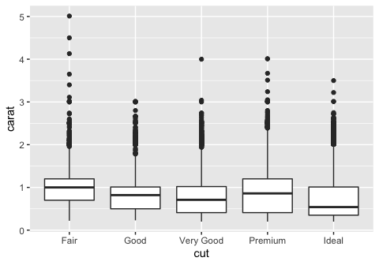

``` r
# diamond size by colour
diamonds %>% ggplot (aes(x = color, y = carat))+
  geom_boxplot()
```

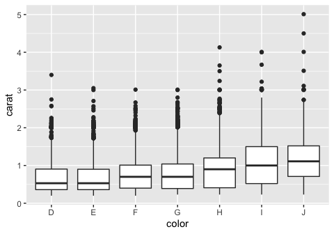

``` r
# diamond size by clarity
diamonds %>% ggplot (aes(x = clarity, y = carat))+
  geom_boxplot()
```

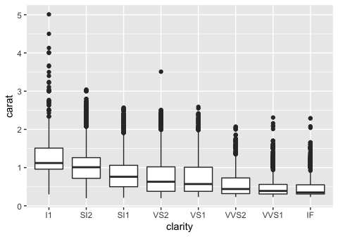

### 2. Download diamond-sizes.Rmd from <https://github.com/hadley/r4ds/tree/master/rmarkdown>. Add a section that describes the largest 20 diamonds, including a table that displays their most important attributes.

To filter out the top 20 largest diamonds, we can arrange the data table using arrange() so that the largest diamonds are at the top, then take the first 20 entries using head(). To display a table with their most important attributes, we can use knitr::kable() for carat, cut, color, clarity, and price, which I believe to be important based on the qualities they convey about the diamond.

``` r
# filter out the largest 20 diamonds

largest <- diamonds %>% arrange(desc(carat)) %>% head (20)

# display a table, using kable() to make it prettier

largest %>% select (carat, cut, color, clarity, price) %>% knitr::kable (caption = "important qualities of top 20 diamonds")
```

|  carat| cut       | color | clarity |  price|
|------:|:----------|:------|:--------|------:|
|   5.01| Fair      | J     | I1      |  18018|
|   4.50| Fair      | J     | I1      |  18531|
|   4.13| Fair      | H     | I1      |  17329|
|   4.01| Premium   | I     | I1      |  15223|
|   4.01| Premium   | J     | I1      |  15223|
|   4.00| Very Good | I     | I1      |  15984|
|   3.67| Premium   | I     | I1      |  16193|
|   3.65| Fair      | H     | I1      |  11668|
|   3.51| Premium   | J     | VS2     |  18701|
|   3.50| Ideal     | H     | I1      |  12587|
|   3.40| Fair      | D     | I1      |  15964|
|   3.24| Premium   | H     | I1      |  12300|
|   3.22| Ideal     | I     | I1      |  12545|
|   3.11| Fair      | J     | I1      |   9823|
|   3.05| Premium   | E     | I1      |  10453|
|   3.04| Very Good | I     | SI2     |  15354|
|   3.04| Premium   | I     | SI2     |  18559|
|   3.02| Fair      | I     | I1      |  10577|
|   3.01| Premium   | I     | I1      |   8040|
|   3.01| Premium   | F     | I1      |   9925|

### 3. Modify diamonds-sizes.Rmd to use comma() to produce nicely formatted output. Also include the percentage of diamonds that are larger than 2.5 carats.

Below is the formatted output, using the comma() function specified in the chapter with an additional sentence stating the percentage of diamonds that are larger than 2.5 carats (the new sentence is bolded).

``` r
comma <- function(x) format(x, digits = 2, big.mark = ",")
```

``` r
smaller <- diamonds %>% 
  filter(carat <= 2.5)
```

We have data about 53,940 diamonds. Only 126 are larger than 2.5 carats. *The percentage of diamonds that are larger than 2.5 carats is 0.2335929%.* The distribution of the remainder is shown below:

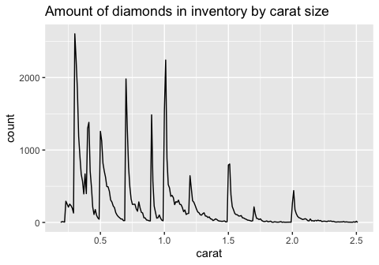

### 4. Set up a network of chunks where d depends on c and b, and both b and c depend on a. Have each chunk print lubridate::now(), set cache = TRUE, then verify your understanding of caching.

``` r
a_variable <- 2
print(paste("a:", a_variable))
```

    ## [1] "a: 2"

``` r
lubridate::now()
```

    ## [1] "2019-08-16 14:19:45 PDT"

``` r
b_variable <- 5 * a_variable
print(paste("b:", b_variable))
```

    ## [1] "b: 10"

``` r
lubridate::now()
```

    ## [1] "2019-08-16 14:19:45 PDT"

``` r
c_variable <- 10 * a_variable
print(paste("c:", c_variable))
```

    ## [1] "c: 20"

``` r
lubridate::now()
```

    ## [1] "2019-08-16 14:19:45 PDT"

``` r
d_product <- b_variable * c_variable
print(paste("d:", d_product))
```

    ## [1] "d: 200"

``` r
lubridate::now()
```

    ## [1] "2019-08-16 14:19:45 PDT"

The output of these code chunks will be cached since we set `cache = TRUE`. If we re-knit this document without changing anything in the code chunks, the value of lubridate::now() that is printed to the screen should not change, since the cached values will be used.

Chapter 28
==========

28.2.1 Exercises
----------------

### 1. Create one plot on the fuel economy data with customised title, subtitle, caption, x, y, and colour labels.

To do this, we use add labs() to the ggplot along with the title, subtitle, caption, x, y, and color arguments. I've filled them in using what was provided in the book.

``` r
ggplot(data = mpg, aes(x = displ, y = hwy)) +
  geom_point(aes(color = class)) +
  geom_smooth(se = FALSE) +
  labs(
    title = "Fuel efficiency generally decreases with engine size",
    subtitle = "Two seaters (sports cars) are an exception because of their light weight",
    caption = "Data from fueleconomy.gov",
    x = "Engine displacement (L)",
    y = "Highway fuel economy (mpg)",
    color = "Car type"
  )
```

    ## `geom_smooth()` using method = 'loess' and formula 'y ~ x'


### 2. The geom\_smooth() is somewhat misleading because the hwy for large engines is skewed upwards due to the inclusion of lightweight sports cars with big engines. Use your modelling tools to fit and display a better model.

A better model would be to use a simple linear model (straight line fit) between hwy and displ. To do this the fast way, we could just specify `geom_smooth(method = 'lm')`. If we wanted to use our modeling tools, we could manually specify the model using lm(), then fit the predicted values on top of the graph. There are even two ways to do this, either by manually plotting the slope and intercept using geom\_abline(), or by generating predictions for a grid of displ values and plotting the line using geom\_line().

``` r
# using geom_smooth(method = "lm")
ggplot(data = mpg, aes(x = displ, y = hwy)) +
  geom_point(aes(color = class)) +
  geom_smooth(se = FALSE, method="lm") +
  labs(
    title = "Plotted using geom_smooth(method = 'lm', se = F)"
  )
```

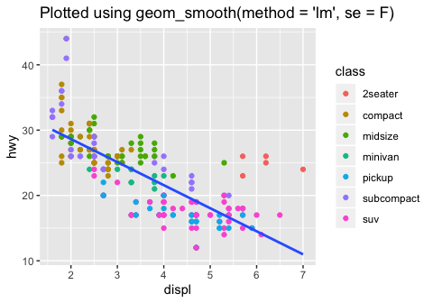

``` r
# using geom_line()
mpg_mod <- lm(hwy ~ displ, data = mpg)

grid <- mpg %>% 
  data_grid(displ) %>% 
  add_predictions(mpg_mod) 
grid
```

    ## # A tibble: 35 x 2
    ##    displ  pred
    ##    <dbl> <dbl>
    ##  1   1.6  30.0
    ##  2   1.8  29.3
    ##  3   1.9  29.0
    ##  4   2    28.6
    ##  5   2.2  27.9
    ##  6   2.4  27.2
    ##  7   2.5  26.9
    ##  8   2.7  26.2
    ##  9   2.8  25.8
    ## 10   3    25.1
    ## # … with 25 more rows

``` r
ggplot(mpg, aes(x=displ)) +
  geom_point(aes(y = hwy, color = class)) +
  geom_line(aes(y = pred), data = grid) +
  labs(
    title = "Plotted using lm(), grid(), add_predictions(), and geom_line()"
  )
```

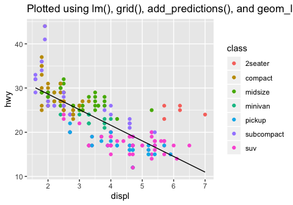

``` r
# using geom_abline()
ggplot(mpg, aes (x=displ, y=hwy)) +
  geom_point(aes(color = class))+
  geom_abline(intercept = mpg_mod$coefficients[1], slope = mpg_mod$coefficients[2]) +
  labs(
    title = "Plotted using lm() and geom_abline() with the coefficients of the model",
    subtitle = "notice how the line extends to the edges of the graph"
  )
```


### 3. Take an exploratory graphic that you’ve created in the last month, and add informative titles to make it easier for others to understand.

I've taken a plot from earlier in this document comparing diamond size by quality of cut and plotted it with labels to make it easier to understand.

``` r
diamonds %>% ggplot (aes(x = cut, y = carat))+
  geom_boxplot(aes(color = cut))+
  labs(title = "Diamonds with higher quality cuts are generally smaller",
       subtitle = "Boxplot of diamond carat size vs quality of cut",
       x = "Quality of cut",
       y = "Carat",
       caption = "data obtained from ggplot2 built-in dataset 'diamonds'")
```

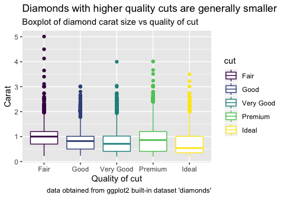

28.3.1 Exercises
----------------

### 1. Use geom\_text() with infinite positions to place text at the four corners of the plot.

The example in the chapter uses a tibble to store one label with its associated parameters, which hints to us that we can populate this tibble with multiple labels with any parameters of our choosing. For this exercise, we want to place the labels in each of four corners. To do this, we can add more entries (rows) to the tibble that correspond to these labels and their locations. Then, we can pass this tibble of labels into geom\_text().

``` r
label <- tibble(
  displ = c(-Inf, Inf, -Inf, Inf),
  hwy = c(Inf, Inf, -Inf, -Inf),
  label = c("topleft", "topright", "bottomleft", "bottomright"),
  hjust = c("left", "right", "left", "right"),
  vjust = c("top", "top", "bottom", "bottom")
)
label
```

    ## # A tibble: 4 x 5
    ##   displ   hwy label       hjust vjust 
    ##   <dbl> <dbl> <chr>       <chr> <chr> 
    ## 1  -Inf   Inf topleft     left  top   
    ## 2   Inf   Inf topright    right top   
    ## 3  -Inf  -Inf bottomleft  left  bottom
    ## 4   Inf  -Inf bottomright right bottom

``` r
ggplot(mpg, aes(displ, hwy)) +
  geom_point() +
  geom_text(aes(label = label, hjust = hjust, vjust = vjust), data = label)
```

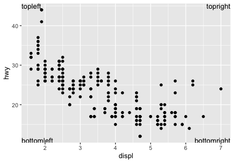

### 2. Read the documentation for annotate(). How can you use it to add a text label to a plot without having to create a tibble?

annotate() adds a geom of your choice to the plot, but instead of supplying the parameters in a data frame, you can supply it using vectors. This is useful if you just want to add a simple text label to a part of the plot without having to make a tibble with one row. An example is below.

``` r
ggplot(mpg, aes(displ, hwy)) +
  geom_point(aes(color = cyl)) +
  annotate("text", x = 6, y = 40, label = "I added this using annotate()")
```

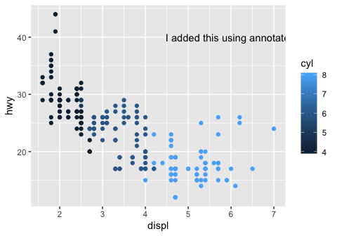

### 3. How do labels with geom\_text() interact with faceting? How can you add a label to a single facet? How can you put a different label in each facet? (Hint: think about the underlying data.)

Labels using geom\_text() get placed at the same location on each facet if the x / y coordinates are hard coded (in this instance, they are hard coded as x = 6, y = 40). If only a single label is provided, it is duplicated for each facet.

``` r
# add to all facets
label <- tibble(
  displ = 6,
  hwy = 40,
  label = "my_label"
)
label
```

    ## # A tibble: 1 x 3
    ##   displ   hwy label   
    ##   <dbl> <dbl> <chr>   
    ## 1     6    40 my_label

``` r
# labels get placed at the same location on each facet if the x / y coordinates are hard coded
ggplot (mpg, aes(displ, hwy))+
  geom_point()+
  geom_text(data = label, aes(label = label))+
  facet_wrap(~cyl)
```


In order to add the label to just one of the facets, the tibble containing your labels should include the variable you are facetting on (in this case, cyl). We set the value of cyl to 4, in order for the label to show up only in the graph for cyl=4.

``` r
# add to a single facet
label <- tibble(
  displ = 6,
  hwy = 40,
  cyl = 4,
  label = "my_label for cyl=4"
)
label
```

    ## # A tibble: 1 x 4
    ##   displ   hwy   cyl label             
    ##   <dbl> <dbl> <dbl> <chr>             
    ## 1     6    40     4 my_label for cyl=4

``` r
ggplot (mpg, aes(displ, hwy))+
  geom_point()+
  geom_text(data = label, aes(label = label))+
  facet_wrap(~cyl)
```

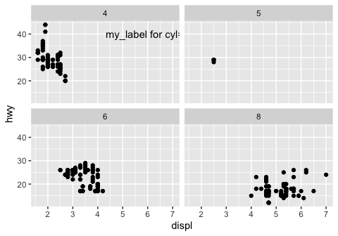

To add a different label to each facet, we can expand the tibble in the above example to have a row for each value of cyl, along with the corresponding unique label.

``` r
# add unique labels to each facet
label <- tibble(
  displ = 6,
  hwy = 40,
  cyl = c(4,5,6,8),
  label = c("cyl=4","cyl=5","cyl=6","cyl=8")
)
label
```

    ## # A tibble: 4 x 4
    ##   displ   hwy   cyl label
    ##   <dbl> <dbl> <dbl> <chr>
    ## 1     6    40     4 cyl=4
    ## 2     6    40     5 cyl=5
    ## 3     6    40     6 cyl=6
    ## 4     6    40     8 cyl=8

``` r
ggplot (mpg, aes(displ, hwy))+
  geom_point()+
  geom_text(data = label, aes(label = label))+
  facet_wrap(~cyl)
```

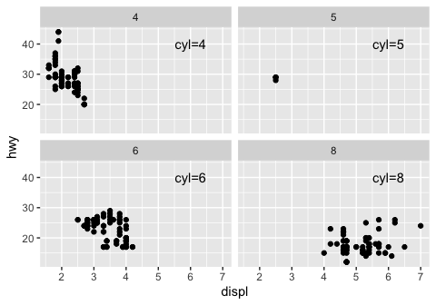

### 4. What arguments to geom\_label() control the appearance of the background box?

The fill aesthetic dictates the color of the background of the label. In the example below, I label highest 5 displ data points and fill based on auto or manual. You can also color the text and border of the label using `color`. To get rid of the black border (but keep the fill), use label.size = 0. It may be helpful to call geom\_label() before geom\_point(), or else the label will be placed over the data point and mask it.

``` r
label <- mpg %>% arrange(desc(displ)) %>% head(5)
label
```

    ## # A tibble: 5 x 11
    ##   manufacturer model  displ  year   cyl trans drv     cty   hwy fl    class
    ##   <chr>        <chr>  <dbl> <int> <int> <chr> <chr> <int> <int> <chr> <chr>
    ## 1 chevrolet    corve…   7    2008     8 manu… r        15    24 p     2sea…
    ## 2 chevrolet    k1500…   6.5  1999     8 auto… 4        14    17 d     suv  
    ## 3 chevrolet    corve…   6.2  2008     8 manu… r        16    26 p     2sea…
    ## 4 chevrolet    corve…   6.2  2008     8 auto… r        15    25 p     2sea…
    ## 5 jeep         grand…   6.1  2008     8 auto… 4        11    14 p     suv

``` r
# color code background based on category, if label comes after geom_point(), may mask the point as demonstrated below
ggplot (mpg, aes(displ, hwy))+
  geom_point()+
  geom_label(data = label, aes(label = trans, fill = trans))
```

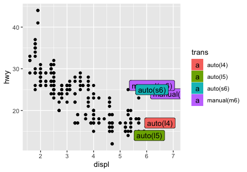

``` r
# color the text and border, call label before geom_point(), now the points show up over the labels
ggplot (mpg, aes(displ, hwy))+
  geom_label(data = label, aes(label = trans, color = trans))+
  geom_point()
```

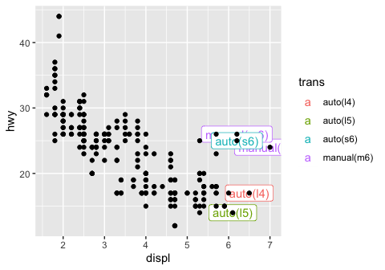

### 5. What are the four arguments to arrow()? How do they work? Create a series of plots that demonstrate the most important options.

To add an arrow to your plot, you can use geom\_segment() with the arrow argument. The arrow option of geom\_segment() receives the output of arrow(), which has four arguments: `angle` which describes the width of the arrow head, `length` which is the length of the arrow head from tip to base, `ends` which indicates which sides to put the arrow heads on, and `type` which indicates whether the arrow head should be an open or closed triangle.

Below are examples of how to customize your arrows by toggling the arguments to arrow(). I initially tried to compile all the variations of the arrow arguments in order to plot the different types of arrows all at once using one geom\_segment() call (similar to how you can lump multiple labels together at different locations using geom\_text()). However it doesn't seem like you can pass a data frame of arguments into the arrow() function by putting it inside aes(). The code below errors and produces segments wihtout arrowheads. So, I resorted to just calling geom\_segment 4 times, in order to compare the different arrow types.

``` r
label <- tibble(
  displ = 6,
  hwy = c(30,33,36,39,42),
  x = 4,
  y = c(30,33,36,39,42),
  xend = 5,
  yend = c(30,33,36,39,42),
  angle = c(30, 10, 30, 30, 30),
  length = c(unit(0.25, "inches"), unit(0.25, "inches"), unit(0.1, "inches"), unit(0.25, "inches"), unit(0.25, "inches")),
  ends = c("last", "last", "last", "both", "last"),
  type = c("open", "open", "open", "open", "closed"),
  label = c("arrowhead with default settings", "angle = 10 degrees", "length = 0.1 inches", "ends = both", "type = closed")
)
label
```

    ## # A tibble: 5 x 11
    ##   displ   hwy     x     y  xend  yend angle length ends  type   label      
    ##   <dbl> <dbl> <dbl> <dbl> <dbl> <dbl> <dbl>  <dbl> <chr> <chr>  <chr>      
    ## 1     6    30     4    30     5    30    30   0.25 last  open   arrowhead …
    ## 2     6    33     4    33     5    33    10   0.25 last  open   angle = 10…
    ## 3     6    36     4    36     5    36    30   0.1  last  open   length = 0…
    ## 4     6    39     4    39     5    39    30   0.25 both  open   ends = both
    ## 5     6    42     4    42     5    42    30   0.25 last  closed type = clo…

``` r
ggplot (mpg, aes(displ, hwy))+
  geom_point()+
  geom_segment(aes( x = 4, y =30, xend = 5, yend = 30), arrow = arrow())+
  geom_segment(aes( x = 4, y =33, xend = 5, yend = 33), arrow = arrow(angle = 10))+
  geom_segment(aes( x = 4, y =36, xend = 5, yend = 36), arrow = arrow(length = unit(0.1, "inches")))+
  geom_segment(aes( x = 4, y =39, xend = 5, yend = 39), arrow = arrow(ends = "both"))+
  geom_segment(aes( x = 4, y =42, xend = 5, yend = 42), arrow = arrow(type = "closed"))+
  geom_text(data = label, aes(label = label))+
  labs (title = "different types of arrows, plotted on top of a random graph")
```

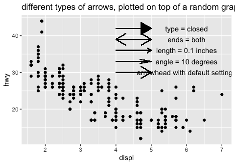

``` r
# doesn't work if you try to map the arrow arguments using aes()
ggplot (mpg, aes(displ, hwy))+
  geom_point()+
  geom_segment(data = label, aes( x = x, y =y, xend = xend, yend = yend, arrow = arrow(angle = angle, ends = ends, type = type)))+
  geom_text(data = label, aes(label = label))+
  labs (title = "cannot map arguments to arrow() using aes()")
```

    ## Warning: Ignoring unknown aesthetics: arrow

    ## Don't know how to automatically pick scale for object of type arrow. Defaulting to continuous.

    ## Warning in rep(x$angle, length.out = maxn): 'x' is NULL so the result will
    ## be NULL

    ## Warning in rep(x$length, length.out = maxn): 'x' is NULL so the result will
    ## be NULL

    ## Warning in rep(x$ends, length.out = maxn): 'x' is NULL so the result will
    ## be NULL

    ## Warning in rep(x$type, length.out = maxn): 'x' is NULL so the result will
    ## be NULL

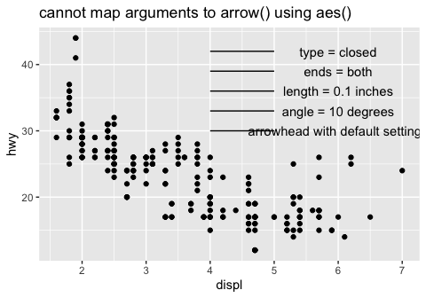

Here is a cleaned up version that isn't randomly plotted on top of the mpg dataset.

``` r
label <- tibble(
  x = 6,
  y = c(17,14,11,8,5),
  label = c("arrowhead with default settings", "angle = 10 degrees", "length = 0.1 inches", "ends = both", "type = closed")
)
label
```

    ## # A tibble: 5 x 3
    ##       x     y label                          
    ##   <dbl> <dbl> <chr>                          
    ## 1     6    17 arrowhead with default settings
    ## 2     6    14 angle = 10 degrees             
    ## 3     6    11 length = 0.1 inches            
    ## 4     6     8 ends = both                    
    ## 5     6     5 type = closed

``` r
ggplot (data = label)+
  geom_segment(aes( x = 4, y =17, xend = 5, yend = 17), arrow = arrow())+
  geom_segment(aes( x = 4, y =14, xend = 5, yend = 14), arrow = arrow(angle = 10))+
  geom_segment(aes( x = 4, y =11, xend = 5, yend = 11), arrow = arrow(length = unit(0.1, "inches")))+
  geom_segment(aes( x = 4, y =8, xend = 5, yend = 8), arrow = arrow(ends = "both"))+
  geom_segment(aes( x = 4, y =5, xend = 5, yend = 5), arrow = arrow(type = "closed"))+
  geom_text(data = label, aes(label = label, x = x, y = y))+
  labs (title = "Different types of arrows!")+
  coord_cartesian(xlim = c(3,8), ylim = c(1, 20))
```


Although there wasn't an exercise for this, here are some examples of using the other suggested additions such as: geom\_hline() and geom\_rect()

``` r
# adding a horizontal line to focus on points above or below
ggplot (mpg, aes(displ, hwy))+
  geom_point(aes(color = cyl))+
  geom_hline(yintercept = 35, color = "red", size = 1)
```


``` r
# boxing an area of the graph to emphasize what you want to focus on
ggplot (mpg, aes(displ, hwy))+
  geom_point(aes(color = cyl))+
  geom_rect( xmin = 6, xmax = 7.2, ymin = 15, ymax = 30, fill = NA, color = "red")
```


``` r
# use geom_rect with aes() to draw boxes on top of points in a graph
ggplot (mpg, aes(displ, hwy))+
  geom_point(aes(color = cyl))+
  geom_rect( aes (xmin = displ-0.1, xmax = displ+0.1, ymin = hwy-0.1, ymax = hwy+0.1))
```


28.4.4 Exercises
----------------

### 1. Why doesn’t the following code override the default scale?

This exercise follows from this code in the chapter, which provides the default coloring of the graph:

``` r
df <- tibble(
  x = rnorm(10000),
  y = rnorm(10000)
)
ggplot(df, aes(x, y)) +
  geom_hex() +
  coord_fixed()
```


The code provided in the exercise does not change the color gradient to white/red. This is because scale\_fill\_gradient() should be used instead of scale\_color\_gradient, since the geom\_hex() graphics need to be "filled".

``` r
# does not change the color gradient because 
ggplot(df, aes(x, y)) +
  geom_hex() +
  scale_colour_gradient(low = "white", high = "red") +
  coord_fixed()
```


``` r
# using scale_fill_gradient now changes the colors!
ggplot(df, aes(x, y)) +
  geom_hex() +
  scale_fill_gradient(low = "white", high = "red") +
  coord_fixed()
```


### 2. What is the first argument to every scale? How does it compare to labs()?

Based on the documentation, the first argument to scale\_x\_continuous() is `name`. If the name is modified by calling scale\_x\_continuous(name = "my\_name"), the modified name "my\_name" is displayed instead of the default. The same can be done using labs(), by changing the appropriate label. In the example below, you can use either scale\_x\_continuous(name="my\_name") or labs(x = "my\_name") to change the label of the x- axis.

``` r
# change x axis label using scale_x_continuous
ggplot(mpg, aes(displ, hwy))+
  geom_point()+
  scale_x_continuous(name = "a new x-axis name using scale_x_continuous()")
```


``` r
# change x axis label using labs()
ggplot(mpg, aes(displ, hwy))+
  geom_point()+
  labs(x = "a new x-axis name using labs()")
```


### 3. Change the display of the presidential terms by:

-   Combining the two variants shown above.

The two variants referred to by this question are:

``` r
# variant 1
presidential %>%
  mutate(id = 33 + row_number()) %>%
  ggplot(aes(start, id)) +
    geom_point() +
    geom_segment(aes(xend = end, yend = id)) +
    scale_x_date(NULL, breaks = presidential$start, date_labels = "'%y")
```


``` r
# variant 2
presidential %>%
  mutate(id = 33 + row_number()) %>%
  ggplot(aes(start, id, colour = party)) +
    geom_point() +
    geom_segment(aes(xend = end, yend = id)) +
    scale_colour_manual(values = c(Republican = "red", Democratic = "blue"))
```


We can see that version 1 has the customized breaks on the x-axis but no coloration, and version 2 has coloration but the breaks on the x-axis are not customized. The combined version with both a customized x-axis as well as coloration is below.

``` r
# combining variant 1 and 2
presidential %>%
  mutate(id = 33 + row_number()) %>%
  ggplot(aes(start, id, color = party)) +
    geom_point() +
    geom_segment(aes(xend = end, yend = id)) +
    scale_x_date(NULL, breaks = presidential$start, date_labels = "'%y") +
    scale_colour_manual(values = c(Republican = "red", Democratic = "blue"))
```


-   Improving the display of the y axis.

The y-axis can be improved by showing each tick corresponding to a single presidential number using scale\_y\_continuous and setting the breaks.

``` r
presidential2 <- presidential %>%
  mutate(id = 33 + row_number())

presidential2 %>%
  ggplot(aes(start, id, color = party)) +
    geom_point() +
    geom_segment(aes(xend = end, yend = id)) +
    scale_x_date(NULL, breaks = presidential$start, date_labels = "'%y") +
    scale_colour_manual(values = c(Republican = "red", Democratic = "blue")) +
    scale_y_continuous(NULL, breaks = presidential2$id)
```


-   Labelling each term with the name of the president.

The names of each president are already in the data frame in the `$name` column, so we can use geom\_text() setting the labels to `presidential$name`. The default is to put the label where the geom\_point() is, which is quite ugly. So, we can change this by adjusting the vjust and hjust parameters, placing the labels below and to the right of each point.

``` r
presidential2 %>%
  ggplot(aes(start, id, color = party)) +
    geom_point() +
    geom_segment(aes(xend = end, yend = id)) +
    scale_x_date(NULL, breaks = presidential$start, date_labels = "'%y") +
    scale_colour_manual(values = c(Republican = "red", Democratic = "blue")) +
    scale_y_continuous(NULL, breaks = presidential2$id)+
    geom_text(aes(label = presidential$name), vjust = 1.2, hjust = -0.5, show.legend = F)
```


-   Adding informative plot labels.

To do this, we remove the "NULL" from scale\_x\_date() and scale\_y\_continuous(), then add the labels using labs().

``` r
presidential2 %>%
  ggplot(aes(start, id, color = party)) +
    geom_point() +
    geom_segment(aes(xend = end, yend = id)) +
    scale_x_date(breaks = presidential$start, date_labels = "'%y") +
    scale_colour_manual(values = c(Republican = "red", Democratic = "blue")) +
    scale_y_continuous(breaks = presidential2$id)+
    geom_text(aes(label = presidential$name), vjust = 1.2, hjust = -0.5, show.legend = F)+
    labs (title = "Presidential terms, labeled by party affiliation",
          caption = "data from built-in R dataset: presidential",
          x = "year",
          y = "President number",
          color = "Political party")
```


-   Placing breaks every 4 years (this is trickier than it seems!).

I'm assuming that this refers to placing a tick 4 years after the start of any presidential term that lasts longer than 4 years. For example, if a presidential term is 8 years, there should be a tick in the middle. If a term was cut short and was only 5 years, there should still be a tick 4 years after the start date. To do this, we can calculate the diference between each adjacent point in `presidential$start`. If it is longer than 4 years, we insert a tick at 4 years after the start date. To implement this, we can use a simple for loop a long with some conditional statements to check whether each term lasted longer than 4 years.

``` r
years <- lubridate::year(presidential$start)
appended_years <- vector()

for (i in 1:(length(years)-1)) {
  appended_years <- c(appended_years, presidential$start[i])
  if (years[i+1] - years[i] >4)
    appended_years <- c(appended_years, presidential$start[i] + dyears(4))
  if(i == (length(years)-1))
    appended_years <- c(appended_years, presidential$start[i+1])
}
appended_years
```

    ##  [1] -6190 -4730 -3268 -2232  -772  -346  1114  1681  2576  4037  5497
    ## [12]  6959  8420  9880 11342 12802 14264

``` r
#convert back to a date-time
class(appended_years) <- "Date"

presidential2 %>%
  ggplot(aes(start, id, color = party)) +
    geom_point() +
    geom_segment(aes(xend = end, yend = id)) +
    scale_x_date(breaks = appended_years, date_labels = "'%y") +
    scale_colour_manual(values = c(Republican = "red", Democratic = "blue")) +
    scale_y_continuous(breaks = presidential2$id)+
    geom_text(aes(label = presidential$name), vjust = 1.2, hjust = -0.5, show.legend = F)+
    labs (title = "Presidential terms, labeled by party affiliation",
          caption = "data from built-in R dataset: presidential",
          x = "year",
          y = "President number",
          color = "Political party")
```


### 4. Use override.aes to make the legend on the following plot easier to see.

We can use the guides() function with guide\_legend(override.aes = list(alpha=1)) to "override" the alpha = 1/20 for the legend. I turn it back to a value of 1 in order to make the points in the legend easier to see.

``` r
# points are very faint on the legend
ggplot(diamonds, aes(carat, price)) +
  geom_point(aes(colour = cut), alpha = 1/20)
```


``` r
# change the alpha back to 1 just for the legend to make points visible
ggplot(diamonds, aes(carat, price)) +
  geom_point(aes(colour = cut), alpha = 1/20)+
  guides(color = guide_legend(override.aes = list (alpha = 1)))
```


Chapters 29, 30 - No Exercises
==============================

------------------------------------------------------------------------

Thanks for reading! This concludes my walkthrough of the book.
