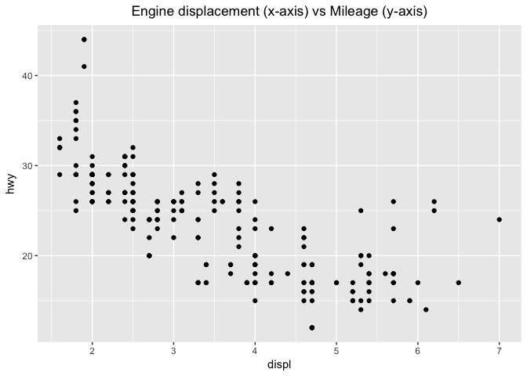
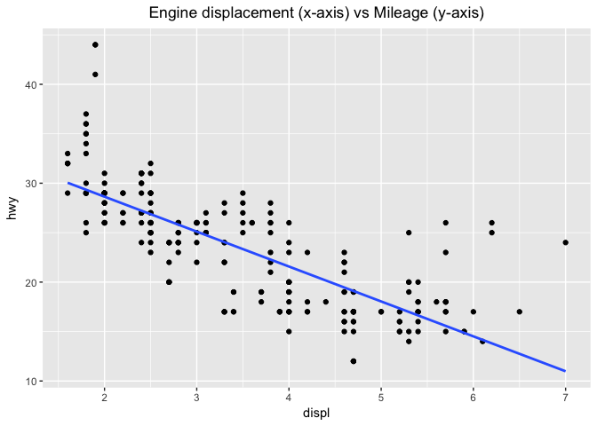
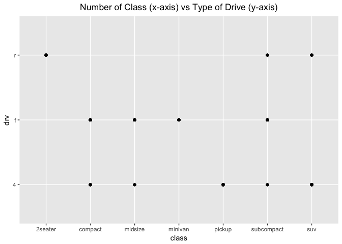
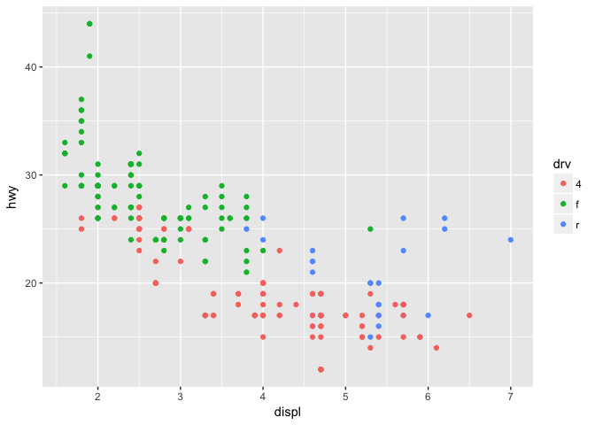
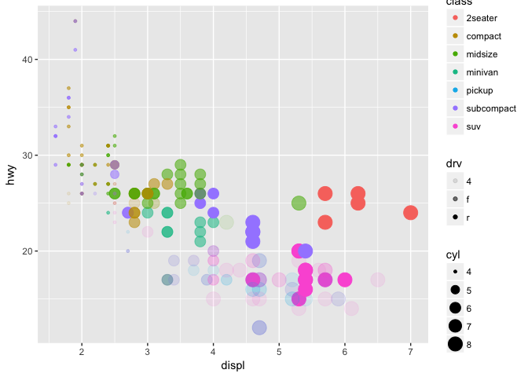
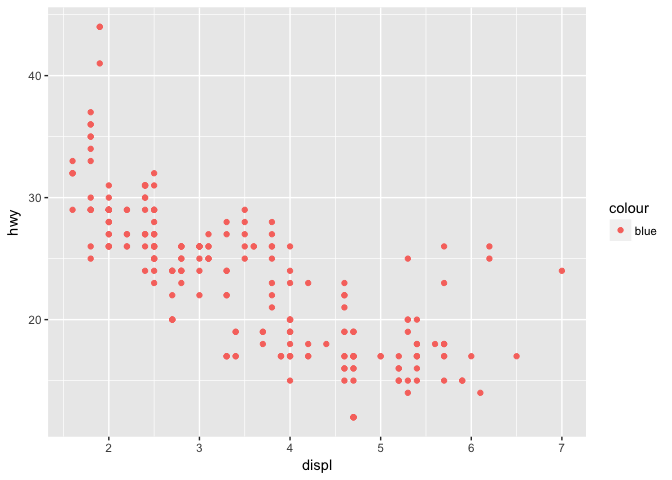
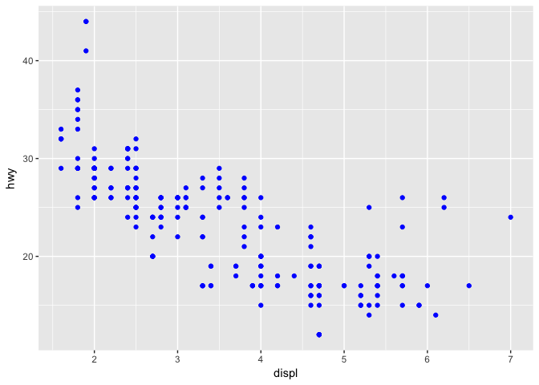

R for Data Science Walkthrough
================
Erick Lu

-   [Chapter 1 & 2: Introduction](#chapter-1-2-introduction)
-   [Chapter 3 - Introduction](#chapter-3---introduction)
    -   [3.2 Creating a ggplot](#creating-a-ggplot)
    -   [3.2.4 Exercises](#exercises)
    -   [3.3 Aesthetic Mappings](#aesthetic-mappings)
    -   [3.3.1 Exercises](#exercises-1)

This my walkthrough for the book: *R for Data Science* by Hadley Wickham and Garrett Grolemund. It contains my answers to their exercises and some of my own notes and data explorations.

Chapter 1 & 2: Introduction
===========================

Install the packages that the book will use (tidyverse):

``` r
# install.packages("tidyverse")
library(tidyverse)
```

    ## ── Attaching packages ────────────────────────────────────────────────────────────────────────── tidyverse 1.2.1 ──

    ## ✔ ggplot2 2.2.1     ✔ purrr   0.2.4
    ## ✔ tibble  1.4.2     ✔ dplyr   0.7.4
    ## ✔ tidyr   0.8.0     ✔ stringr 1.3.0
    ## ✔ readr   1.1.1     ✔ forcats 0.3.0

    ## Warning: package 'ggplot2' was built under R version 3.3.2

    ## Warning: package 'readr' was built under R version 3.3.2

    ## Warning: package 'purrr' was built under R version 3.3.2

    ## Warning: package 'dplyr' was built under R version 3.3.2

    ## ── Conflicts ───────────────────────────────────────────────────────────────────────────── tidyverse_conflicts() ──
    ## ✖ dplyr::filter() masks stats::filter()
    ## ✖ dplyr::lag()    masks stats::lag()

Install the datasets that the book will use:

``` r
# install.packages(c("nycflights13", "gapminder", "Lahman"))
```

Use the dput function to figure out how built-in data frames were constructed in R. First, examine how the `mtcars` dataset looks like using `head()`.

``` r
?mtcars # get documentation on the data / package / function
head(mtcars) # get first few lines of the already built data frame
```

    ##                    mpg cyl disp  hp drat    wt  qsec vs am gear carb
    ## Mazda RX4         21.0   6  160 110 3.90 2.620 16.46  0  1    4    4
    ## Mazda RX4 Wag     21.0   6  160 110 3.90 2.875 17.02  0  1    4    4
    ## Datsun 710        22.8   4  108  93 3.85 2.320 18.61  1  1    4    1
    ## Hornet 4 Drive    21.4   6  258 110 3.08 3.215 19.44  1  0    3    1
    ## Hornet Sportabout 18.7   8  360 175 3.15 3.440 17.02  0  0    3    2
    ## Valiant           18.1   6  225 105 2.76 3.460 20.22  1  0    3    1

Now use `dput()` to learn how this data frame was constructed.

``` r
dput(mtcars) # get the code used to build the actual data frame
```

    ## structure(list(mpg = c(21, 21, 22.8, 21.4, 18.7, 18.1, 14.3, 
    ## 24.4, 22.8, 19.2, 17.8, 16.4, 17.3, 15.2, 10.4, 10.4, 14.7, 32.4, 
    ## 30.4, 33.9, 21.5, 15.5, 15.2, 13.3, 19.2, 27.3, 26, 30.4, 15.8, 
    ## 19.7, 15, 21.4), cyl = c(6, 6, 4, 6, 8, 6, 8, 4, 4, 6, 6, 8, 
    ## 8, 8, 8, 8, 8, 4, 4, 4, 4, 8, 8, 8, 8, 4, 4, 4, 8, 6, 8, 4), 
    ##     disp = c(160, 160, 108, 258, 360, 225, 360, 146.7, 140.8, 
    ##     167.6, 167.6, 275.8, 275.8, 275.8, 472, 460, 440, 78.7, 75.7, 
    ##     71.1, 120.1, 318, 304, 350, 400, 79, 120.3, 95.1, 351, 145, 
    ##     301, 121), hp = c(110, 110, 93, 110, 175, 105, 245, 62, 95, 
    ##     123, 123, 180, 180, 180, 205, 215, 230, 66, 52, 65, 97, 150, 
    ##     150, 245, 175, 66, 91, 113, 264, 175, 335, 109), drat = c(3.9, 
    ##     3.9, 3.85, 3.08, 3.15, 2.76, 3.21, 3.69, 3.92, 3.92, 3.92, 
    ##     3.07, 3.07, 3.07, 2.93, 3, 3.23, 4.08, 4.93, 4.22, 3.7, 2.76, 
    ##     3.15, 3.73, 3.08, 4.08, 4.43, 3.77, 4.22, 3.62, 3.54, 4.11
    ##     ), wt = c(2.62, 2.875, 2.32, 3.215, 3.44, 3.46, 3.57, 3.19, 
    ##     3.15, 3.44, 3.44, 4.07, 3.73, 3.78, 5.25, 5.424, 5.345, 2.2, 
    ##     1.615, 1.835, 2.465, 3.52, 3.435, 3.84, 3.845, 1.935, 2.14, 
    ##     1.513, 3.17, 2.77, 3.57, 2.78), qsec = c(16.46, 17.02, 18.61, 
    ##     19.44, 17.02, 20.22, 15.84, 20, 22.9, 18.3, 18.9, 17.4, 17.6, 
    ##     18, 17.98, 17.82, 17.42, 19.47, 18.52, 19.9, 20.01, 16.87, 
    ##     17.3, 15.41, 17.05, 18.9, 16.7, 16.9, 14.5, 15.5, 14.6, 18.6
    ##     ), vs = c(0, 0, 1, 1, 0, 1, 0, 1, 1, 1, 1, 0, 0, 0, 0, 0, 
    ##     0, 1, 1, 1, 1, 0, 0, 0, 0, 1, 0, 1, 0, 0, 0, 1), am = c(1, 
    ##     1, 1, 0, 0, 0, 0, 0, 0, 0, 0, 0, 0, 0, 0, 0, 0, 1, 1, 1, 
    ##     0, 0, 0, 0, 0, 1, 1, 1, 1, 1, 1, 1), gear = c(4, 4, 4, 3, 
    ##     3, 3, 3, 4, 4, 4, 4, 3, 3, 3, 3, 3, 3, 4, 4, 4, 3, 3, 3, 
    ##     3, 3, 4, 5, 5, 5, 5, 5, 4), carb = c(4, 4, 1, 1, 2, 1, 4, 
    ##     2, 2, 4, 4, 3, 3, 3, 4, 4, 4, 1, 2, 1, 1, 2, 2, 4, 2, 1, 
    ##     2, 2, 4, 6, 8, 2)), .Names = c("mpg", "cyl", "disp", "hp", 
    ## "drat", "wt", "qsec", "vs", "am", "gear", "carb"), row.names = c("Mazda RX4", 
    ## "Mazda RX4 Wag", "Datsun 710", "Hornet 4 Drive", "Hornet Sportabout", 
    ## "Valiant", "Duster 360", "Merc 240D", "Merc 230", "Merc 280", 
    ## "Merc 280C", "Merc 450SE", "Merc 450SL", "Merc 450SLC", "Cadillac Fleetwood", 
    ## "Lincoln Continental", "Chrysler Imperial", "Fiat 128", "Honda Civic", 
    ## "Toyota Corolla", "Toyota Corona", "Dodge Challenger", "AMC Javelin", 
    ## "Camaro Z28", "Pontiac Firebird", "Fiat X1-9", "Porsche 914-2", 
    ## "Lotus Europa", "Ford Pantera L", "Ferrari Dino", "Maserati Bora", 
    ## "Volvo 142E"), class = "data.frame")

We can see that the data frame was constructed by merging lists of each of the parameters (displ, hwy, etc..) into columns, then naming each of the columns and rows.

Chapter 3 - Introduction
========================

3.2 Creating a ggplot
---------------------

Learn how to use ggplot2. The dataset we will work with is the built-in dataset `mpg`.

``` r
head(mpg)
```

    ## # A tibble: 6 x 11
    ##   manufacturer model displ  year   cyl trans drv     cty   hwy fl    class
    ##   <chr>        <chr> <dbl> <int> <int> <chr> <chr> <int> <int> <chr> <chr>
    ## 1 audi         a4     1.80  1999     4 auto… f        18    29 p     comp…
    ## 2 audi         a4     1.80  1999     4 manu… f        21    29 p     comp…
    ## 3 audi         a4     2.00  2008     4 manu… f        20    31 p     comp…
    ## 4 audi         a4     2.00  2008     4 auto… f        21    30 p     comp…
    ## 5 audi         a4     2.80  1999     6 auto… f        16    26 p     comp…
    ## 6 audi         a4     2.80  1999     6 manu… f        18    26 p     comp…

Plot mileage (hwy) against engine displacement (displ):

``` r
ggplot(data = mpg) + 
  geom_point(mapping = aes (x=displ, y=hwy)) +
  ggtitle("Engine displacement (x-axis) vs Mileage (y-axis)") +
  theme(plot.title = element_text(hjust = 0.5))
```



I added a title to the ggplot (ggtitle) and centered the title by adding a theme parameter. I also found that it was not required to have the "data =" or "mapping =" in the ggplot() or geom\_point() parameters. Since there was a inverse correlation, I was interested to see what a linear model would look like if fitted to the data. Here is how I added a trend line to the plot above.

``` r
ggplot(data = mpg, aes (x = displ, y = hwy)) + 
  geom_point() +
  ggtitle("Engine displacement (x-axis) vs Mileage (y-axis)") +
  theme(plot.title = element_text(hjust = 0.5)) +
  geom_smooth(method = 'lm', se = F)
```



I had to specify the `aes` in the ggplot() parameter, so that it would apply to both the geom\_point() and geom\_smooth(). When I kept the `aes` in the geom\_point() paramter as before, I received an error.

3.2.4 Exercises
---------------

1.Run ggplot(data = mpg). What do you see?

``` r
ggplot(data = mpg)
```


We see an empty plot. The ggplot() function simply creates a plotting space and specifies the data that will be plotted. Sequential parameters must be added ("+") to the ggplot to see anything.

1.  How many rows are in mpg? How many columns?

``` r
dim(mpg)
```

    ## [1] 234  11

There are 234 rows and 11 columns in the data set.

3.What does the drv variable describe? Read the help for ?mpg to find out.

``` r
?mpg
```

The `drv` column specifies whether the car is "f = front-wheel drive, r = rear wheel drive, 4 = 4wd" .

4.Make a scatterplot of hwy vs cyl.

``` r
ggplot(data = mpg) + 
  geom_point(mapping = aes (x=cyl, y=hwy)) +
  ggtitle("Number of Cylinders (x-axis) vs Mileage (y-axis)") +
  theme(plot.title = element_text(hjust = 0.5))
```


There is an inverse correlation with the number of cylinders and how much mileage the car gets on the highway.

1.  What happens if you make a scatterplot of class vs drv? Why is the plot not useful?

``` r
ggplot(data = mpg) + 
  geom_point(mapping = aes (x=class, y=drv)) +
  ggtitle("Number of Class (x-axis) vs Type of Drive (y-axis)") +
  theme(plot.title = element_text(hjust = 0.5))
```



The data is not particularly useful since these are two categorical variables, and because the class of car does not usually dictate the type of drive. This plot would suggest that, since there are many classes of cars with two or more types of drive.

3.3 Aesthetic Mappings
----------------------

Color-code the points in the scatterplot by another variable in the data set.

``` r
ggplot(data = mpg) + 
  geom_point(mapping = aes(x = displ, y = hwy, color = class))
```


The plot shows that SUVs have low highway mileage and high engine displacement and that compact cars have high mileage and low engine displacement, as expected.

Another example, this time color coding based on the `drv` variable.

``` r
ggplot(data = mpg) + 
  geom_point(mapping = aes(x = displ, y = hwy, color = drv))
```



We can see that the front wheel drive cars on average have low engine displacement and high highway mileage.

Using size variable to further categorize in the graph (you can combine multiple parameters for the cateogrization! This is pretty cool). If you try to use a categorical/discrete variable for size, an error will be displayed.

``` r
ggplot(data = mpg) + 
  geom_point(mapping = aes(x = displ, y = hwy, size = cyl, color = class, alpha = drv))
```



3.3.1 Exercises
---------------

1.What’s gone wrong with this code? Why are the points not blue?

``` r
ggplot(data = mpg) + 
  geom_point(mapping = aes(x = displ, y = hwy, color = "blue"))
```



The points are not blue because the "color =" parameter lies within aes(). This means the function will be looking for a column within the mpg dataset called "blue", which does not exist. So to fix this, place the "color =" parameter outside aes(), but within geom\_point().

``` r
ggplot(data = mpg) + 
  geom_point(mapping = aes(x = displ, y = hwy), color = "blue")
```



1.  Which variables in mpg are categorical? Which variables are continuous? (Hint: type ?mpg to read the documentation for the dataset). How can you see this information when you run mpg?

One way you can figure out which are categorical vs continuous is by using the `summary()` function. The continuous variables will have the quartiles specified, whereas the categorical variables will not. You might have to be wary about categorical variables in numerical form, in which you would have to read the documentation. Runing just `mpg` would show the type of varable under the column name (char vs int vs dbl, etc.) which would also let you know this information.

``` r
summary(mpg)
```

    ##  manufacturer          model               displ            year     
    ##  Length:234         Length:234         Min.   :1.600   Min.   :1999  
    ##  Class :character   Class :character   1st Qu.:2.400   1st Qu.:1999  
    ##  Mode  :character   Mode  :character   Median :3.300   Median :2004  
    ##                                        Mean   :3.472   Mean   :2004  
    ##                                        3rd Qu.:4.600   3rd Qu.:2008  
    ##                                        Max.   :7.000   Max.   :2008  
    ##       cyl           trans               drv                 cty       
    ##  Min.   :4.000   Length:234         Length:234         Min.   : 9.00  
    ##  1st Qu.:4.000   Class :character   Class :character   1st Qu.:14.00  
    ##  Median :6.000   Mode  :character   Mode  :character   Median :17.00  
    ##  Mean   :5.889                                         Mean   :16.86  
    ##  3rd Qu.:8.000                                         3rd Qu.:19.00  
    ##  Max.   :8.000                                         Max.   :35.00  
    ##       hwy             fl               class          
    ##  Min.   :12.00   Length:234         Length:234        
    ##  1st Qu.:18.00   Class :character   Class :character  
    ##  Median :24.00   Mode  :character   Mode  :character  
    ##  Mean   :23.44                                        
    ##  3rd Qu.:27.00                                        
    ##  Max.   :44.00

1.  Map a continuous variable to color, size, and shape. How do these aesthetics behave differently for categorical vs. continuous variables?

2.  What happens if you map the same variable to multiple aesthetics?

3.  What does the stroke aesthetic do? What shapes does it work with? (Hint: use ?geom\_point)

4.  What happens if you map an aesthetic to something other than a variable name, like aes(colour = displ &lt; 5)?
